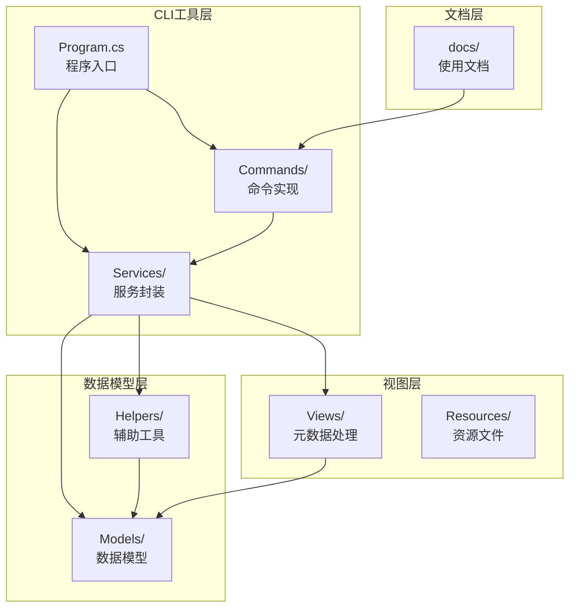
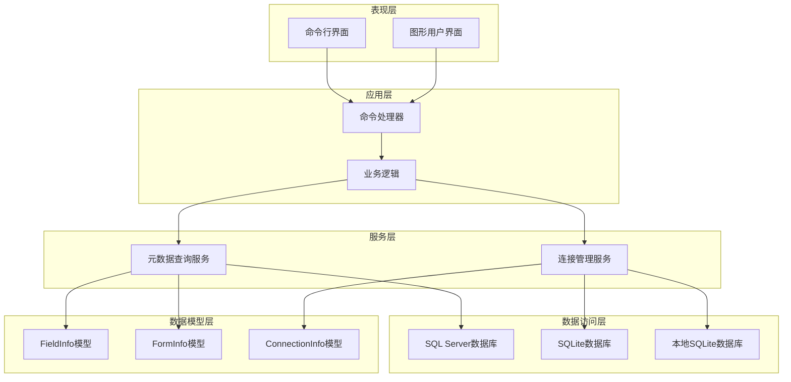
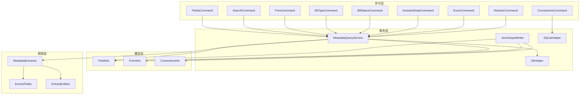

# API参考文档

<cite>
**本文档引用的文件**
- [Program.cs](file://K3CloudDataDictionary.Cli/Program.cs)
- [HelpCommand.cs](file://K3CloudDataDictionary.Cli/Commands/HelpCommand.cs)
- [FieldsCommand.cs](file://K3CloudDataDictionary.Cli/Commands/FieldsCommand.cs)
- [SearchCommand.cs](file://K3CloudDataDictionary.Cli/Commands/SearchCommand.cs)
- [FormCommand.cs](file://K3CloudDataDictionary.Cli/Commands/FormCommand.cs)
- [MetadataQueryService.cs](file://K3CloudDataDictionary.Cli/Services/MetadataQueryService.cs)
- [JsonOutputWriter.cs](file://K3CloudDataDictionary.Cli/Services/JsonOutputWriter.cs)
- [FieldInfo.cs](file://Models/FieldInfo.cs)
- [FormInfo.cs](file://Models/FormInfo.cs)
- [ConnectionInfo.cs](file://Models/ConnectionInfo.cs)
- [DbHelper.cs](file://Helpers/DbHelper.cs)
- [SQLiteHelper.cs](file://Helpers/SQLiteHelper.cs)
- [MetadataExtractor.cs](file://Views/MetadataExtractor.cs)
- [ExtractFields.cs](file://Views/ExtractFields.cs)
- [ExtractEntities.cs](file://Views/ExtractEntities.cs)
- [usage-examples.md](file://docs/usage-examples.md)
</cite>

## 目录
1. [简介](#简介)
2. [项目结构](#项目结构)
3. [核心组件](#核心组件)
4. [架构概览](#架构概览)
5. [详细组件分析](#详细组件分析)
6. [依赖关系分析](#依赖关系分析)
7. [性能考虑](#性能考虑)
8. [故障排除指南](#故障排除指南)
9. [结论](#结论)
10. [附录](#附录)

## 简介
本文件为金蝶K3 Cloud数据字典系统的全面API参考文档，涵盖命令行接口（CLI）的完整API规范、数据模型的详细说明以及公共接口的参数、返回值和异常处理机制。文档旨在帮助开发者和运维人员快速理解和使用该系统，提供最佳实践和性能优化建议。

## 项目结构
该项目采用分层架构设计，主要分为CLI工具层、服务层、数据模型层、辅助工具层和视图层：



**图表来源**
- [Program.cs:14-69](file://K3CloudDataDictionary.Cli/Program.cs#L14-L69)
- [HelpCommand.cs:8-72](file://K3CloudDataDictionary.Cli/Commands/HelpCommand.cs#L8-L72)

**章节来源**
- [Program.cs:1-166](file://K3CloudDataDictionary.Cli/Program.cs#L1-L166)
- [HelpCommand.cs:1-287](file://K3CloudDataDictionary.Cli/Commands/HelpCommand.cs#L1-L287)

## 核心组件
本系统的核心组件包括命令行入口、命令处理器、元数据查询服务、JSON输出格式化器以及数据模型。

### 命令行入口
程序入口负责解析命令行参数、初始化SQLite数据库并路由到相应的命令处理器。

### 命令处理器
系统提供8个主要命令，每个命令都有特定的功能和参数：
- `fields`: 查询表单字段信息
- `search`: 模糊搜索字段或表
- `form`: 查询表单元数据
- `billtype`: 查询单据类型（列表/详情）
- `billstatus`: 查询单据状态字段枚举值
- `assistantdata`: 查询辅助资料列表
- `enum`: 查询枚举值列表（下拉列表）
- `resolve`: 解析对象ID对应的表单信息

### 元数据查询服务
负责直接连接SQL Server实时查询元数据，提供字段、表单、实体等信息的查询能力。

### JSON输出格式化器
统一处理JSON格式的输出，支持美化输出和错误处理。

**章节来源**
- [Program.cs:14-166](file://K3CloudDataDictionary.Cli/Program.cs#L14-L166)
- [HelpCommand.cs:8-287](file://K3CloudDataDictionary.Cli/Commands/HelpCommand.cs#L8-L287)
- [MetadataQueryService.cs:12-839](file://K3CloudDataDictionary.Cli/Services/MetadataQueryService.cs#L12-L839)
- [JsonOutputWriter.cs:11-91](file://K3CloudDataDictionary.Cli/Services/JsonOutputWriter.cs#L11-L91)

## 架构概览
系统采用分层架构，各层职责明确，耦合度低：



**图表来源**
- [Program.cs:14-69](file://K3CloudDataDictionary.Cli/Program.cs#L14-L69)
- [MetadataQueryService.cs:12-839](file://K3CloudDataDictionary.Cli/Services/MetadataQueryService.cs#L12-L839)
- [SQLiteHelper.cs:10-370](file://Helpers/SQLiteHelper.cs#L10-L370)

## 详细组件分析

### 命令行接口API规范

#### 全局选项
| 选项 | 简写 | 类型 | 描述 | 示例 |
|------|------|------|------|------|
| `--connection` | `-c` | 整数 | 指定连接ID | `--connection 1` |
| `--pretty` |  | 布尔值 | 格式化JSON输出 | `--pretty` |

#### fields命令
**功能**: 查询表单字段信息

**语法**: `k3cli fields [options]`

**参数**:
- `--form <identifier>` (必填): 表单标识，如 PUR_PurchaseOrder
- `--entity <key>` (可选): 实体Key，如 FK_BillEntry
- `--keyword <keyword>` (可选): 字段搜索关键词
- `--exact` 或 `-e` (可选): 精确匹配模式

**返回值**: 字段信息数组，包含字段键、名称、类型、关联信息等

**使用示例**:
```bash
# 查询表单所有字段
k3cli fields --form PUR_PurchaseOrder

# 查询指定实体的所有字段
k3cli fields --form PUR_PurchaseOrder --entity FK_BillEntry

# 模糊搜索字段
k3cli fields --form PUR_PurchaseOrder --keyword "物料"

# 精确搜索字段
k3cli fields --form PUR_PurchaseOrder --keyword "FMaterialId" --exact
```

#### search命令
**功能**: 模糊搜索字段或表

**语法**: `k3cli search [options]`

**参数**:
- `--keyword <keyword>` (必填): 搜索关键词
- `--type <field|table>` (可选): 搜索类型，默认table
- `--exact` 或 `-e` (可选): 精确匹配模式

**返回值**: 搜索结果数组，根据类型不同包含不同字段信息

**使用示例**:
```bash
# 模糊搜索（默认）
k3cli search --keyword "物料"
k3cli search --keyword "FMaterialId" --type field

# 精确搜索
k3cli search --keyword "FMaterialId" --exact
k3cli search --keyword "物料" -e --type field
```

#### form命令
**功能**: 查询表单元数据

**语法**: `k3cli form [options]`

**参数**:
- `--id <identifier>` (必填): 表单标识

**返回值**: 表单基本信息和实体列表

**使用示例**:
```bash
k3cli form --id PUR_PurchaseOrder
```

#### billtype命令
**功能**: 查询单据类型（列表/详情）

**语法**: `k3cli billtype [options]`

**参数**:
- `--form <identifier>` (可选): 表单标识
- `--id <billTypeId>` (可选): 单据类型ID
- `--keyword <keyword>` (可选): 搜索关键词

**返回值**: 单据类型信息数组

**使用示例**:
```bash
# 查询表单关联的单据类型列表
k3cli billtype --form PUR_PurchaseOrder

# 精确查询指定单据类型
k3cli billtype --id <billTypeId>

# 模糊搜索单据类型
k3cli billtype --keyword "采购"
```

#### billstatus命令
**功能**: 查询单据状态字段枚举值

**语法**: `k3cli billstatus [options]`

**参数**:
- `--form <identifier>` (必填): 表单标识
- `--field <fieldKey>` (可选): 字段Key
- `--keyword <keyword>` (可选): 搜索关键词

**返回值**: 单据状态信息数组，包含状态值和名称

**使用示例**:
```bash
# 查询表单所有单据状态字段的枚举值
k3cli billstatus --form PUR_PurchaseOrder

# 查询指定字段的单据状态
k3cli billstatus --form PUR_PurchaseOrder --field FDocumentStatus

# 模糊搜索状态值
k3cli billstatus --form PUR_PurchaseOrder --keyword "已审核"
```

#### assistantdata命令
**功能**: 查询辅助资料列表

**语法**: `k3cli assistantdata [options]`

**参数**:
- `--id <lookUpObjectId>` (必填): 辅助资料ID

**返回值**: 辅助资料选项列表

**使用示例**:
```bash
k3cli assistantdata --id <lookUpObjectId>
```

#### enum命令
**功能**: 查询枚举值列表（下拉列表）

**语法**: `k3cli enum [options]`

**参数**:
- `--id <enumTypeId>` (必填): 枚举类型ID

**返回值**: 枚举值列表

**使用示例**:
```bash
k3cli enum --id <enumTypeId>
```

#### resolve命令
**功能**: 解析对象ID对应的表单信息

**语法**: `k3cli resolve [options]`

**参数**:
- `--id <objectId>` (必填): 对象ID

**返回值**: 表单解析结果

**使用示例**:
```bash
k3cli resolve --id 6099b796-9e56-434e-895e-a1628d12d4c2
```

#### connections命令
**功能**: 管理数据库连接

**语法**: `k3cli connections <subcommand> [options]`

**子命令**:
- `list`: 列出所有连接
- `add`: 添加新连接
- `test --id <id>`: 测试连接
- `set-default --id <id>`: 设为默认连接

**add参数**:
- `--server <ip>` (必填): SQL Server地址
- `--port <port>` (可选): 端口号，默认1433
- `--db <database>` (必填): 数据库名
- `--user <username>` (必填): 用户名
- `--password <password>` (可选): 密码
- `--name <name>` (可选): 连接名称
- `--default` (可选): 同时设为默认连接

**返回值**: 连接管理结果

**使用示例**:
```bash
k3cli connections list
k3cli connections add --server 192.168.1.100 --db AISC001 --user sa --password xxx --default
k3cli connections test --id 1
k3cli connections set-default --id 1
```

**章节来源**
- [HelpCommand.cs:74-287](file://K3CloudDataDictionary.Cli/Commands/HelpCommand.cs#L74-L287)
- [FieldsCommand.cs:13-88](file://K3CloudDataDictionary.Cli/Commands/FieldsCommand.cs#L13-L88)
- [SearchCommand.cs:13-110](file://K3CloudDataDictionary.Cli/Commands/SearchCommand.cs#L13-L110)
- [FormCommand.cs:13-93](file://K3CloudDataDictionary.Cli/Commands/FormCommand.cs#L13-L93)

### 数据模型API文档

#### FieldInfo模型
FieldInfo类表示表单字段的基本信息，实现了INotifyPropertyChanged接口用于UI绑定。

**属性定义**:

| 属性名 | 类型 | 描述 | 使用示例 |
|--------|------|------|----------|
| Key | string | 字段键 | "FSupplierId" |
| Name | string | 字段显示名称 | "供应商" |
| FieldName | string | 数据库字段名 | "FSUPPLIERID" |
| PropertyName | string | C#属性名 | "SupplierId" |
| ElementTypeName | string | 元素类型名称 | "基础资料" |
| Suffix | string | 分割后缀 | "" |
| SplitDescription | string | 分割描述 | "" |
| LookUpObjectID | string | 关联对象ID | "6099b796-..." |
| EnumType | string | 枚举类型 | "001" |
| LookUpObjectDisplay | string | 关联对象显示名 | "" |
| EnumTypeDisplay | string | 枚举类型显示名 | "" |
| UpdateActionCount | int | 更新动作计数 | 13 |
| FieldDbId | string | 字段数据库ID | "f8a2c4b1-..." |

**复杂度分析**:
- 时间复杂度: O(1) 访问所有属性
- 空间复杂度: O(n) n为字段数量

**章节来源**
- [FieldInfo.cs:6-110](file://Models/FieldInfo.cs#L6-L110)

#### FormInfo模型
FormInfo类表示表单的基本信息和统计信息。

**属性定义**:

| 属性名 | 类型 | 描述 | 使用示例 |
|--------|------|------|----------|
| FormId | string | 表单ID | "PUR_PurchaseOrder" |
| FormIdentifier | string | 表单标识符 | "PUR_PurchaseOrder" |
| FormName | string | 表单名称 | "采购订单" |
| ModelTypeName | string | 模型类型名称 | "单据" |
| SubSystemName | string | 子系统名称 | "采购管理" |
| FormPluginCount | int | 表单插件数量 | 5 |
| ListPluginCount | int | 列表插件数量 | 3 |
| BuilderPluginCount | int | 构建器插件数量 | 2 |
| UpdateActionCount | int | 更新动作数量 | 10 |
| ServiceRuleCount | int | 服务规则数量 | 8 |
| FormOperationCount | int | 表单操作数量 | 6 |

**复杂度分析**:
- 时间复杂度: O(1) 访问所有属性
- 空间复杂度: O(1) 固定大小

**章节来源**
- [FormInfo.cs:6-101](file://Models/FormInfo.cs#L6-L101)

#### ConnectionInfo模型
ConnectionInfo类表示数据库连接信息。

**属性定义**:

| 属性名 | 类型 | 描述 | 使用示例 |
|--------|------|------|----------|
| Id | int | 连接ID | 1 |
| Name | string | 连接名称 | "默认连接" |
| ServerIp | string | 服务器IP | "192.168.1.100" |
| Port | int | 端口号 | 1433 |
| UserName | string | 用户名 | "sa" |
| Password | string | 密码 | "xxx" |
| Database | string | 数据库名 | "AISC001" |
| IsDefault | bool | 是否默认连接 | true |
| LocalDbFileName | string | 本地数据库文件名 | "AISC001.db" |
| IsCurrent | bool | 当前连接标记 | false |
| EffectiveLocalDbFileName | string | 实际使用的本地文件名 | "AISC001.db" |
| ConnectionString | string | 连接字符串 | "Server=...;Database=...;" |
| DisplayName | string | 显示名称 | "默认连接 (AISC001)" |

**复杂度分析**:
- 时间复杂度: O(1) 访问所有属性
- 空间复杂度: O(1) 固定大小

**章节来源**
- [ConnectionInfo.cs:6-144](file://Models/ConnectionInfo.cs#L6-L144)

### 元数据查询服务API

#### MetadataQueryService类
MetadataQueryService类提供直接连接SQL Server查询元数据的能力。

**主要方法**:

| 方法名 | 参数 | 返回值 | 描述 |
|--------|------|--------|------|
| QueryFields | formIdentifier, entityKey=null, keyword=null, exact=false | List<Dictionary<string, object>> | 查询字段信息 |
| QueryForm | formIdentifier | List<Dictionary<string, object>> | 查询表单信息 |
| QueryEntities | formIdentifier | List<Dictionary<string, object>> | 查询实体列表 |
| SearchFields | keyword, exact=false | List<Dictionary<string, object>> | 搜索字段 |
| SearchTables | keyword, exact=false | List<Dictionary<string, object>> | 搜索表 |
| QueryBillTypes | formIdentifier=null, billTypeId=null, keyword=null | List<Dictionary<string, object>> | 查询单据类型 |
| QueryAssistantData | lookUpObjectId | List<Dictionary<string, object>> | 查询辅助资料 |
| QueryEnumItems | enumTypeId | List<Dictionary<string, object>> | 查询枚举项 |
| QueryBillStatusItems | formIdentifier, fieldKey=null, keyword=null | List<Dictionary<string, object>> | 查询单据状态项 |
| ResolveObject | objectId | List<Dictionary<string, object>> | 解析对象ID |

**复杂度分析**:
- QueryFields: O(n) n为字段数量
- QueryForm: O(1) 基于标识符查询
- SearchFields: O(m×n) m为表单数量，n为平均字段数量
- SearchTables: O(m×p) m为表单数量，p为平均实体数量

**章节来源**
- [MetadataQueryService.cs:12-839](file://K3CloudDataDictionary.Cli/Services/MetadataQueryService.cs#L12-L839)

### JSON输出格式化器API

#### JsonOutputWriter类
JsonOutputWriter类提供统一的JSON输出格式化功能。

**主要方法**:

| 方法名 | 参数 | 返回值 | 描述 |
|--------|------|--------|------|
| SetPrettyPrint | pretty: bool | void | 设置是否格式化输出 |
| WriteSuccess | command: string, data: object, count: int? | void | 写入成功结果 |
| WriteSuccess<T> | command: string, data: List<T> | void | 写入泛型成功结果 |
| WriteError | command: string, message: string | void | 写入错误结果 |
| WriteJson | json: JObject | void | 写入原始JSON |

**返回格式**:
```json
{
  "success": true,
  "command": "fields",
  "data": [],
  "count": 0
}
```

**章节来源**
- [JsonOutputWriter.cs:11-91](file://K3CloudDataDictionary.Cli/Services/JsonOutputWriter.cs#L11-L91)

### 公共接口和方法

#### Program类
Program类提供全局选项解析和连接字符串解析功能。

**主要方法**:
- `ParseGlobalOptions(args)`: 解析全局选项
- `GetArgValue(args, name)`: 获取参数值
- `HasOption(args, name)`: 检查选项是否存在
- `ResolveConnectionString(options)`: 解析连接字符串

**异常处理**:
- 未找到指定连接ID时抛出异常
- 没有默认连接时抛出异常
- 帮助命令异常时捕获并格式化输出

**章节来源**
- [Program.cs:74-151](file://K3CloudDataDictionary.Cli/Program.cs#L74-L151)

#### SQLiteHelper类
SQLiteHelper类提供SQLite数据库操作功能。

**主要方法**:
- `EnsureDatabase()`: 确保数据库存在
- `LoadAll()`: 加载所有连接
- `LoadDefault()`: 加载默认连接
- `Save(info)`: 保存连接
- `Update(info)`: 更新连接
- `Delete(id)`: 删除连接
- `SetDefault(id)`: 设置默认连接

**复杂度分析**:
- 所有方法时间复杂度均为O(n) n为连接数量
- 空间复杂度为O(n)

**章节来源**
- [SQLiteHelper.cs:10-370](file://Helpers/SQLiteHelper.cs#L10-L370)

## 依赖关系分析



**图表来源**
- [FieldsCommand.cs:13-88](file://K3CloudDataDictionary.Cli/Commands/FieldsCommand.cs#L13-L88)
- [MetadataQueryService.cs:12-839](file://K3CloudDataDictionary.Cli/Services/MetadataQueryService.cs#L12-L839)
- [JsonOutputWriter.cs:11-91](file://K3CloudDataDictionary.Cli/Services/JsonOutputWriter.cs#L11-L91)

**章节来源**
- [FieldsCommand.cs:13-88](file://K3CloudDataDictionary.Cli/Commands/FieldsCommand.cs#L13-L88)
- [MetadataQueryService.cs:12-839](file://K3CloudDataDictionary.Cli/Services/MetadataQueryService.cs#L12-L839)
- [JsonOutputWriter.cs:11-91](file://K3CloudDataDictionary.Cli/Services/JsonOutputWriter.cs#L11-L91)

## 性能考虑

### 查询优化策略

1. **索引优化**: 在频繁查询的字段上建立适当的索引
2. **连接池**: 使用连接池减少连接开销
3. **分页查询**: 对大量数据采用分页查询
4. **缓存策略**: 缓存常用查询结果
5. **批量操作**: 批量处理相似查询

### 内存管理
- 元数据提取采用流式处理，避免大对象占用过多内存
- 及时释放数据库连接和资源
- 使用弱引用避免循环引用

### 并发处理
- SQLite操作采用互斥锁保证线程安全
- 数据库查询使用异步模式提高响应性

## 故障排除指南

### 常见错误及解决方案

**连接失败**
- 检查SQL Server连接字符串
- 验证网络连通性
- 确认SQL Server服务状态

**查询超时**
- 增加CommandTimeout设置
- 优化查询条件
- 考虑添加索引

**权限不足**
- 验证数据库用户权限
- 检查数据库角色分配
- 确认必要的数据库权限

**数据不一致**
- 检查元数据版本
- 验证XML缓存完整性
- 清理缓存后重新加载

### 错误码说明

| 错误码 | 描述 | 可能原因 | 解决方案 |
|--------|------|----------|----------|
| 0 | 成功 | 正常执行 | 无需处理 |
| 1 | 命令错误 | 未知命令或参数错误 | 检查命令语法 |
| 2 | 连接失败 | 数据库连接异常 | 验证连接配置 |
| 3 | 权限不足 | 数据库权限不足 | 检查用户权限 |
| 4 | 查询超时 | 查询执行时间过长 | 优化查询条件 |
| 5 | 数据异常 | 元数据格式错误 | 检查XML完整性 |

**章节来源**
- [Program.cs:64-68](file://K3CloudDataDictionary.Cli/Program.cs#L64-L68)
- [DbHelper.cs:9-25](file://Helpers/DbHelper.cs#L9-L25)

## 结论
金蝶K3 Cloud数据字典系统提供了完整的CLI工具和丰富的API接口，能够满足企业级数据字典查询和管理需求。系统采用模块化设计，具有良好的可扩展性和维护性。通过合理的参数配置和使用最佳实践，可以有效提升查询效率和用户体验。

## 附录

### 使用最佳实践

1. **参数验证**: 始终验证必填参数的存在性
2. **错误处理**: 实现完善的异常处理机制
3. **性能监控**: 监控查询性能和资源使用情况
4. **日志记录**: 记录关键操作和错误信息
5. **安全考虑**: 验证输入参数，防止SQL注入

### 版本兼容性
- 支持SQL Server 2012及以上版本
- 兼容.NET Framework 4.7.2+
- 支持Windows和Linux环境

### 技术支持
- GitHub Issues: https://github.com/your-repo/issues
- 邮箱支持: support@company.com
- 文档更新: 每季度发布一次