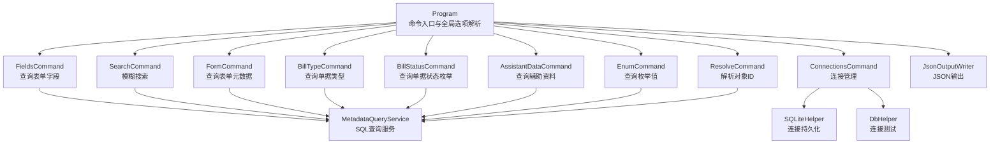
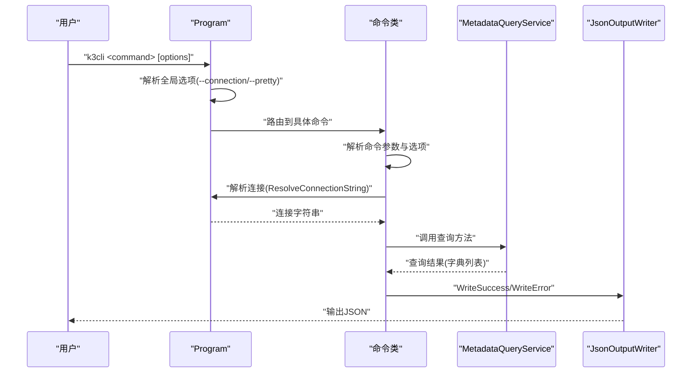
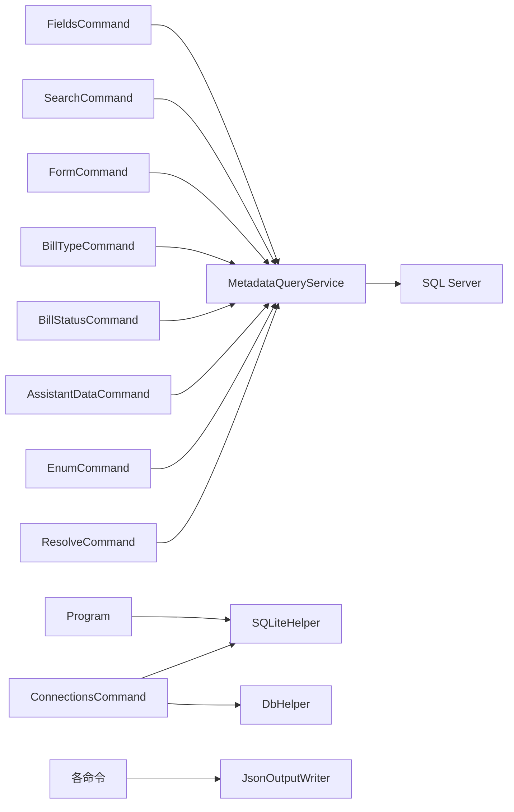

# CLI命令API

<cite>
**本文档引用的文件**
- [Program.cs](file://K3CloudDataDictionary.Cli/Program.cs)
- [FieldsCommand.cs](file://K3CloudDataDictionary.Cli/Commands/FieldsCommand.cs)
- [SearchCommand.cs](file://K3CloudDataDictionary.Cli/Commands/SearchCommand.cs)
- [FormCommand.cs](file://K3CloudDataDictionary.Cli/Commands/FormCommand.cs)
- [BillTypeCommand.cs](file://K3CloudDataDictionary.Cli/Commands/BillTypeCommand.cs)
- [BillStatusCommand.cs](file://K3CloudDataDictionary.Cli/Commands/BillStatusCommand.cs)
- [AssistantDataCommand.cs](file://K3CloudDataDictionary.Cli/Commands/AssistantDataCommand.cs)
- [EnumCommand.cs](file://K3CloudDataDictionary.Cli/Commands/EnumCommand.cs)
- [ResolveCommand.cs](file://K3CloudDataDictionary.Cli/Commands/ResolveCommand.cs)
- [ConnectionsCommand.cs](file://K3CloudDataDictionary.Cli/Commands/ConnectionsCommand.cs)
- [HelpCommand.cs](file://K3CloudDataDictionary.Cli/Commands/HelpCommand.cs)
- [MetadataQueryService.cs](file://K3CloudDataDictionary.Cli/Services/MetadataQueryService.cs)
- [JsonOutputWriter.cs](file://K3CloudDataDictionary.Cli/Services/JsonOutputWriter.cs)
- [SQLiteHelper.cs](file://Helpers/SQLiteHelper.cs)
- [DbHelper.cs](file://Helpers/DbHelper.cs)
</cite>

## 目录
1. [简介](#简介)
2. [项目结构](#项目结构)
3. [核心组件](#核心组件)
4. [架构总览](#架构总览)
5. [详细组件分析](#详细组件分析)
6. [依赖关系分析](#依赖关系分析)
7. [性能考虑](#性能考虑)
8. [故障排除指南](#故障排除指南)
9. [结论](#结论)
10. [附录](#附录)

## 简介
本文件为金蝶K3 Cloud数据字典系统的CLI命令API参考文档，覆盖fields、search、form、billtype、billstatus、assistantdata、enum、resolve、connections等命令的语法格式、参数说明、选项设置、返回值格式与使用示例。文档同时阐述命令执行流程、参数验证规则、输出格式规范、错误处理策略与最佳实践，并提供完整的命令行调用示例与故障排除指南。

## 项目结构
CLI工具采用命令分发与服务解耦的设计：Program负责解析全局选项与路由命令；各命令类封装具体业务逻辑；MetadataQueryService提供SQL Server直连查询能力；JsonOutputWriter统一输出格式；SQLiteHelper与DbHelper分别负责连接配置持久化与连接测试。

**图表来源**
- [Program.cs:14-69](file://K3CloudDataDictionary.Cli/Program.cs#L14-L69)
- [FieldsCommand.cs:13-85](file://K3CloudDataDictionary.Cli/Commands/FieldsCommand.cs#L13-L85)
- [SearchCommand.cs:13-107](file://K3CloudDataDictionary.Cli/Commands/SearchCommand.cs#L13-L107)
- [FormCommand.cs:13-89](file://K3CloudDataDictionary.Cli/Commands/FormCommand.cs#L13-L89)
- [BillTypeCommand.cs:13-62](file://K3CloudDataDictionary.Cli/Commands/BillTypeCommand.cs#L13-L62)
- [BillStatusCommand.cs:13-77](file://K3CloudDataDictionary.Cli/Commands/BillStatusCommand.cs#L13-L77)
- [AssistantDataCommand.cs:13-61](file://K3CloudDataDictionary.Cli/Commands/AssistantDataCommand.cs#L13-L61)
- [EnumCommand.cs:13-60](file://K3CloudDataDictionary.Cli/Commands/EnumCommand.cs#L13-L60)
- [ResolveCommand.cs:13-59](file://K3CloudDataDictionary.Cli/Commands/ResolveCommand.cs#L13-L59)
- [ConnectionsCommand.cs:15-42](file://K3CloudDataDictionary.Cli/Commands/ConnectionsCommand.cs#L15-L42)
- [MetadataQueryService.cs:12-22](file://K3CloudDataDictionary.Cli/Services/MetadataQueryService.cs#L12-L22)
- [JsonOutputWriter.cs:11-37](file://K3CloudDataDictionary.Cli/Services/JsonOutputWriter.cs#L11-L37)
- [SQLiteHelper.cs:10-53](file://Helpers/SQLiteHelper.cs#L10-L53)
- [DbHelper.cs:7-25](file://Helpers/DbHelper.cs#L7-L25)

**章节来源**
- [Program.cs:14-166](file://K3CloudDataDictionary.Cli/Program.cs#L14-L166)

## 核心组件
- 命令入口与全局选项
  - 全局选项：--connection/-c <id>、--pretty
  - 连接解析：优先使用指定连接ID，否则使用默认连接；均来自SQLiteHelper存储的连接配置
- 输出格式
  - 统一JSON结构：success、command、data、count（成功时）或error（失败时）
  - 支持--pretty格式化输出
- 查询服务
  - 直接连接SQL Server，按需加载元数据上下文，延迟初始化
  - 提供字段、表、单据类型、辅助资料、枚举、单据状态等查询方法

**章节来源**
- [Program.cs:74-151](file://K3CloudDataDictionary.Cli/Program.cs#L74-L151)
- [JsonOutputWriter.cs:26-70](file://K3CloudDataDictionary.Cli/Services/JsonOutputWriter.cs#L26-L70)
- [MetadataQueryService.cs:27-37](file://K3CloudDataDictionary.Cli/Services/MetadataQueryService.cs#L27-L37)

## 架构总览
命令执行流程概览：Program解析全局选项与子命令，路由至对应命令类；命令类解析自身参数，调用MetadataQueryService执行查询；最终通过JsonOutputWriter输出统一JSON格式。

**图表来源**
- [Program.cs:34-69](file://K3CloudDataDictionary.Cli/Program.cs#L34-L69)
- [FieldsCommand.cs:38-84](file://K3CloudDataDictionary.Cli/Commands/FieldsCommand.cs#L38-L84)
- [MetadataQueryService.cs:286-388](file://K3CloudDataDictionary.Cli/Services/MetadataQueryService.cs#L286-L388)
- [JsonOutputWriter.cs:26-70](file://K3CloudDataDictionary.Cli/Services/JsonOutputWriter.cs#L26-L70)

## 详细组件分析

### 命令：fields
- 功能
  - 查询指定表单的字段信息，支持按实体过滤与关键词搜索（模糊/精确）
  - 当字段elementType=40时，嵌套返回状态项statusItems
- 语法
  - k3cli fields [--form <identifier>] [--entity <key>] [--keyword <keyword>] [--exact|-e] [--connection|-c <id>] [--pretty]
- 参数与选项
  - --form <identifier>：表单标识（必填）
  - --entity <key>：实体Key（可选）
  - --keyword <keyword>：关键词（可选）
  - --exact/-e：精确匹配（可选）
  - --connection/-c <id>：连接ID（可选）
  - --pretty：格式化输出（可选）
- 返回值
  - 成功：data为字段数组，每项包含formName、entityName、table、key、name、fieldName、propertyName、elementType、elementTypeName、tagName、lookUpObject、enumType、splitSuffix、splitDescription、updateActionCount等；当elementType=40时包含statusItems
  - 失败：error消息
- 执行流程
  - 校验必填参数--form
  - 解析连接字符串
  - 调用QueryFields(formIdentifier, entityKey, keyword, exact)
  - 转换输出格式并写入JSON
- 错误处理
  - 缺少--form时报错并显示帮助
  - 异常捕获后统一写入错误JSON
- 最佳实践
  - 先用fields查询字段，再结合lookUpObject/enumType进一步查询辅助资料/枚举
  - 使用--exact进行精确匹配，减少结果集

**章节来源**
- [FieldsCommand.cs:13-85](file://K3CloudDataDictionary.Cli/Commands/FieldsCommand.cs#L13-L85)
- [MetadataQueryService.cs:286-388](file://K3CloudDataDictionary.Cli/Services/MetadataQueryService.cs#L286-L388)
- [JsonOutputWriter.cs:26-37](file://K3CloudDataDictionary.Cli/Services/JsonOutputWriter.cs#L26-L37)

### 命令：search
- 功能
  - 模糊搜索字段或表，默认搜索表
- 语法
  - k3cli search --keyword <keyword> [--type field|table] [--exact|-e] [--connection|-c <id>] [--pretty]
- 参数与选项
  - --keyword <keyword>：关键词（必填）
  - --type <field|table>：搜索类型（默认table）
  - --exact/-e：精确匹配（可选）
  - --connection/-c <id>：连接ID（可选）
  - --pretty：格式化输出（可选）
- 返回值
  - type=table：返回表/实体列表，包含formId、formIdentifier、formName、entityKey、entityName、table、elementType、fieldCount
  - type=field：返回字段列表，包含formName、entityName、table、key、name、fieldName、propertyName、elementType、elementTypeName、tagName、lookUpObject、enumType等；elementType=40时包含statusItems
- 执行流程
  - 校验必填参数--keyword
  - 选择SearchTables或SearchFields
  - 限制最大返回100条
- 错误处理
  - 缺少--keyword时报错并显示帮助
  - 异常捕获后统一写入错误JSON

**章节来源**
- [SearchCommand.cs:13-107](file://K3CloudDataDictionary.Cli/Commands/SearchCommand.cs#L13-L107)
- [MetadataQueryService.cs:395-561](file://K3CloudDataDictionary.Cli/Services/MetadataQueryService.cs#L395-L561)
- [JsonOutputWriter.cs:26-37](file://K3CloudDataDictionary.Cli/Services/JsonOutputWriter.cs#L26-L37)

### 命令：form
- 功能
  - 查询表单基本信息与实体列表
- 语法
  - k3cli form --id <identifier> [--connection|-c <id>] [--pretty]
- 参数与选项
  - --id <identifier>：表单标识（必填）
  - --connection/-c <id>：连接ID（可选）
  - --pretty：格式化输出（可选）
- 返回值
  - 成功：data为表单对象，包含formId、formIdentifier、formName、modelType、subsystem、formPluginCount、listPluginCount、builderPluginCount、updateActionCount、serviceRuleCount、formOperationCount及entities数组
- 执行流程
  - 校验必填参数--id
  - 查询表单与实体，构建输出对象
- 错误处理
  - 未找到表单时报错
  - 异常捕获后统一写入错误JSON

**章节来源**
- [FormCommand.cs:13-89](file://K3CloudDataDictionary.Cli/Commands/FormCommand.cs#L13-L89)
- [MetadataQueryService.cs:172-277](file://K3CloudDataDictionary.Cli/Services/MetadataQueryService.cs#L172-L277)
- [JsonOutputWriter.cs:26-37](file://K3CloudDataDictionary.Cli/Services/JsonOutputWriter.cs#L26-L37)

### 命令：billtype
- 功能
  - 查询单据类型：支持按表单查询列表、按ID精确查询、按关键词模糊查询
- 语法
  - k3cli billtype [--form <identifier>|--id <billTypeId>|--keyword <keyword>] [--connection|-c <id>] [--pretty]
- 参数与选项
  - --form <identifier>：表单标识（三选一）
  - --id <billTypeId>：单据类型ID（三选一）
  - --keyword <keyword>：关键词（三选一）
  - --connection/-c <id>：连接ID（可选）
  - --pretty：格式化输出（可选）
- 返回值
  - 成功：data为单据类型数组，包含billTypeId、billFormId、number、name、description
- 执行流程
  - 校验至少提供一个参数
  - 组装SQL查询条件并执行
- 错误处理
  - 参数缺失时报错并显示帮助
  - 异常捕获后统一写入错误JSON

**章节来源**
- [BillTypeCommand.cs:13-62](file://K3CloudDataDictionary.Cli/Commands/BillTypeCommand.cs#L13-L62)
- [MetadataQueryService.cs:569-630](file://K3CloudDataDictionary.Cli/Services/MetadataQueryService.cs#L569-L630)
- [JsonOutputWriter.cs:26-37](file://K3CloudDataDictionary.Cli/Services/JsonOutputWriter.cs#L26-L37)

### 命令：billstatus
- 功能
  - 查询单据状态字段的枚举值（elementType=40），支持按字段Key或关键词过滤
- 语法
  - k3cli billstatus --form <identifier> [--field <fieldKey>|--keyword <keyword>] [--connection|-c <id>] [--pretty]
- 参数与选项
  - --form <identifier>：表单标识（必填）
  - --field <fieldKey>：字段Key（可选）
  - --keyword <keyword>：关键词（可选）
  - --connection/-c <id>：连接ID（可选）
  - --pretty：格式化输出（可选）
- 返回值
  - 成功：data为字段级数组，包含formId、formName、entityName、table、fieldKey、fieldName、dbFieldName、propertyName、elementType、elementTypeName及statusItems（状态项数组，包含value、name）
- 执行流程
  - 校验必填参数--form
  - 仅处理elementType=40的字段
  - 可按fieldKey或keyword过滤
- 错误处理
  - 缺少--form时报错并显示帮助
  - 异常捕获后统一写入错误JSON

**章节来源**
- [BillStatusCommand.cs:13-77](file://K3CloudDataDictionary.Cli/Commands/BillStatusCommand.cs#L13-L77)
- [MetadataQueryService.cs:736-800](file://K3CloudDataDictionary.Cli/Services/MetadataQueryService.cs#L736-L800)
- [JsonOutputWriter.cs:26-37](file://K3CloudDataDictionary.Cli/Services/JsonOutputWriter.cs#L26-L37)

### 命令：assistantdata
- 功能
  - 查询辅助资料列表（按LookUpObjectID）
- 语法
  - k3cli assistantdata --id <lookUpObjectId> [--connection|-c <id>] [--pretty]
- 参数与选项
  - --id <lookUpObjectId>：辅助资料ID（必填）
  - --connection/-c <id>：连接ID（可选）
  - --pretty：格式化输出（可选）
- 返回值
  - 成功：data为辅助资料数组，包含id、number、name、entryId、entryNumber、dataValue
- 执行流程
  - 校验必填参数--id
  - 执行辅助资料查询并组装输出
- 错误处理
  - 缺少--id时报错并显示帮助
  - 异常捕获后统一写入错误JSON

**章节来源**
- [AssistantDataCommand.cs:13-61](file://K3CloudDataDictionary.Cli/Commands/AssistantDataCommand.cs#L13-L61)
- [MetadataQueryService.cs:636-679](file://K3CloudDataDictionary.Cli/Services/MetadataQueryService.cs#L636-L679)
- [JsonOutputWriter.cs:26-37](file://K3CloudDataDictionary.Cli/Services/JsonOutputWriter.cs#L26-L37)

### 命令：enum
- 功能
  - 查询枚举值列表（elementType=9下拉列表）
- 语法
  - k3cli enum --id <enumTypeId> [--connection|-c <id>] [--pretty]
- 参数与选项
  - --id <enumTypeId>：枚举类型ID（必填）
  - --connection/-c <id>：连接ID（可选）
  - --pretty：格式化输出（可选）
- 返回值
  - 成功：data为枚举项数组，包含id、name、value、enumId、caption
- 执行流程
  - 校验必填参数--id
  - 执行枚举查询并组装输出
- 错误处理
  - 缺少--id时报错并显示帮助
  - 异常捕获后统一写入错误JSON

**章节来源**
- [EnumCommand.cs:13-60](file://K3CloudDataDictionary.Cli/Commands/EnumCommand.cs#L13-L60)
- [MetadataQueryService.cs:685-727](file://K3CloudDataDictionary.Cli/Services/MetadataQueryService.cs#L685-L727)
- [JsonOutputWriter.cs:26-37](file://K3CloudDataDictionary.Cli/Services/JsonOutputWriter.cs#L26-L37)

### 命令：resolve
- 功能
  - 根据对象ID（lookUpObject）解析对应的表单信息
- 语法
  - k3cli resolve --id <objectId> [--connection|-c <id>] [--pretty]
- 参数与选项
  - --id <objectId>：对象ID（必填）
  - --connection/-c <id>：连接ID（可选）
  - --pretty：格式化输出（可选）
- 返回值
  - 成功：data为解析结果数组，包含lookupId、formId、tableName、pkFieldName、orgFieldName
- 执行流程
  - 校验必填参数--id
  - 通过LookupClass反查表单信息
- 错误处理
  - 缺少--id时报错并显示帮助
  - 异常捕获后统一写入错误JSON

**章节来源**
- [ResolveCommand.cs:13-59](file://K3CloudDataDictionary.Cli/Commands/ResolveCommand.cs#L13-L59)
- [MetadataQueryService.cs:83-122](file://K3CloudDataDictionary.Cli/Services/MetadataQueryService.cs#L83-L122)
- [JsonOutputWriter.cs:26-37](file://K3CloudDataDictionary.Cli/Services/JsonOutputWriter.cs#L26-L37)

### 命令：connections
- 功能
  - 管理数据库连接（列出、新增、测试、设为默认）
- 语法
  - k3cli connections list
  - k3cli connections add --server <ip> --db <database> --user <username> [--port <port>] [--password <password>] [--name <name>] [--default]
  - k3cli connections test --id <id>
  - k3cli connections set-default --id <id>
- 子命令与参数
  - list：列出所有连接
  - add：新增连接（--server/--db/--user必填，--port默认1433，--default可选）
  - test：测试指定ID连接
  - set-default：设为默认连接
- 返回值
  - list：data为连接数组，包含id、name、server、database、user、isDefault、displayName
  - add：data为新增连接信息与message
  - test：data包含connectionId、name、server、database、success、message
  - set-default：data为设为默认后的连接信息与message
- 执行流程
  - 解析子命令并路由
  - 使用SQLiteHelper持久化连接信息
  - 使用DbHelper测试连接
- 错误处理
  - 参数缺失时报错
  - 未找到连接时报错
  - 异常捕获后统一写入错误JSON

**章节来源**
- [ConnectionsCommand.cs:15-229](file://K3CloudDataDictionary.Cli/Commands/ConnectionsCommand.cs#L15-L229)
- [SQLiteHelper.cs:55-112](file://Helpers/SQLiteHelper.cs#L55-L112)
- [DbHelper.cs:9-25](file://Helpers/DbHelper.cs#L9-L25)

## 依赖关系分析
- 命令到服务
  - 各命令均依赖MetadataQueryService进行SQL查询
- 服务到数据源
  - MetadataQueryService直接连接SQL Server执行查询
- 输出到格式化
  - 所有命令统一通过JsonOutputWriter输出JSON
- 连接管理
  - Program.ResolveConnectionString从SQLiteHelper读取连接配置
  - ConnectionsCommand对SQLiteHelper进行增删改查

**图表来源**
- [Program.cs:129-151](file://K3CloudDataDictionary.Cli/Program.cs#L129-L151)
- [MetadataQueryService.cs:12-22](file://K3CloudDataDictionary.Cli/Services/MetadataQueryService.cs#L12-L22)
- [JsonOutputWriter.cs:11-37](file://K3CloudDataDictionary.Cli/Services/JsonOutputWriter.cs#L11-L37)
- [SQLiteHelper.cs:10-53](file://Helpers/SQLiteHelper.cs#L10-L53)
- [DbHelper.cs:7-25](file://Helpers/DbHelper.cs#L7-L25)

**章节来源**
- [Program.cs:129-151](file://K3CloudDataDictionary.Cli/Program.cs#L129-L151)
- [MetadataQueryService.cs:12-22](file://K3CloudDataDictionary.Cli/Services/MetadataQueryService.cs#L12-L22)
- [JsonOutputWriter.cs:11-37](file://K3CloudDataDictionary.Cli/Services/JsonOutputWriter.cs#L11-L37)
- [SQLiteHelper.cs:10-53](file://Helpers/SQLiteHelper.cs#L10-L53)
- [DbHelper.cs:7-25](file://Helpers/DbHelper.cs#L7-L25)

## 性能考虑
- 搜索限制
  - search命令在遍历对象时限制最大返回100条，避免全量扫描导致性能问题
- 上下文懒加载
  - MetadataQueryService在首次使用时加载元数据上下文，减少启动开销
- 超时控制
  - 查询命令设置合理的CommandTimeout，避免长时间阻塞
- 建议
  - 在fields/search中优先使用--exact进行精确匹配，缩小结果集
  - 使用--connection明确指定连接，避免解析默认连接的额外开销

**章节来源**
- [MetadataQueryService.cs:496-561](file://K3CloudDataDictionary.Cli/Services/MetadataQueryService.cs#L496-L561)
- [MetadataQueryService.cs:27-37](file://K3CloudDataDictionary.Cli/Services/MetadataQueryService.cs#L27-L37)
- [MetadataQueryService.cs:52-66](file://K3CloudDataDictionary.Cli/Services/MetadataQueryService.cs#L52-L66)

## 故障排除指南
- 无默认连接
  - 现象：执行命令时报“没有默认连接”
  - 处理：使用--connection指定连接ID，或先通过connections add添加并设为默认
- 未知命令
  - 现象：出现“未知命令”提示
  - 处理：使用k3cli help查看可用命令
- 参数缺失
  - 现象：fields/billtype/assistantdata/enum/resolve/connections等报缺少必填参数
  - 处理：根据帮助信息补齐相应参数
- 连接失败
  - 现象：connections test返回失败
  - 处理：检查服务器IP、端口、数据库名、用户名、密码；确认SQL Server可达
- 输出格式化
  - 现象：输出难以阅读
  - 处理：添加--pretty选项

**章节来源**
- [Program.cs:58-68](file://K3CloudDataDictionary.Cli/Program.cs#L58-L68)
- [Program.cs:140-150](file://K3CloudDataDictionary.Cli/Program.cs#L140-L150)
- [HelpCommand.cs:10-72](file://K3CloudDataDictionary.Cli/Commands/HelpCommand.cs#L10-L72)
- [ConnectionsCommand.cs:173-228](file://K3CloudDataDictionary.Cli/Commands/ConnectionsCommand.cs#L173-L228)
- [JsonOutputWriter.cs:67-79](file://K3CloudDataDictionary.Cli/Services/JsonOutputWriter.cs#L67-L79)

## 结论
本CLI工具通过清晰的命令分层与统一的输出格式，提供了对金蝶K3 Cloud元数据的高效查询能力。建议在实际使用中遵循参数校验、连接管理与性能优化的最佳实践，以获得稳定可靠的查询体验。

## 附录

### 命令与参数速查
- fields
  - 必填：--form
  - 可选：--entity、--keyword、--exact/-e、--connection/-c、--pretty
- search
  - 必填：--keyword
  - 可选：--type、--exact/-e、--connection/-c、--pretty
- form
  - 必填：--id
  - 可选：--connection/-c、--pretty
- billtype
  - 必填：--form或--id或--keyword
  - 可选：--connection/-c、--pretty
- billstatus
  - 必填：--form
  - 可选：--field、--keyword、--connection/-c、--pretty
- assistantdata
  - 必填：--id
  - 可选：--connection/-c、--pretty
- enum
  - 必填：--id
  - 可选：--connection/-c、--pretty
- resolve
  - 必填：--id
  - 可选：--connection/-c、--pretty
- connections
  - 子命令：list、add、test、set-default
  - add可选：--server、--port、--db、--user、--password、--name、--default

**章节来源**
- [HelpCommand.cs:74-284](file://K3CloudDataDictionary.Cli/Commands/HelpCommand.cs#L74-L284)