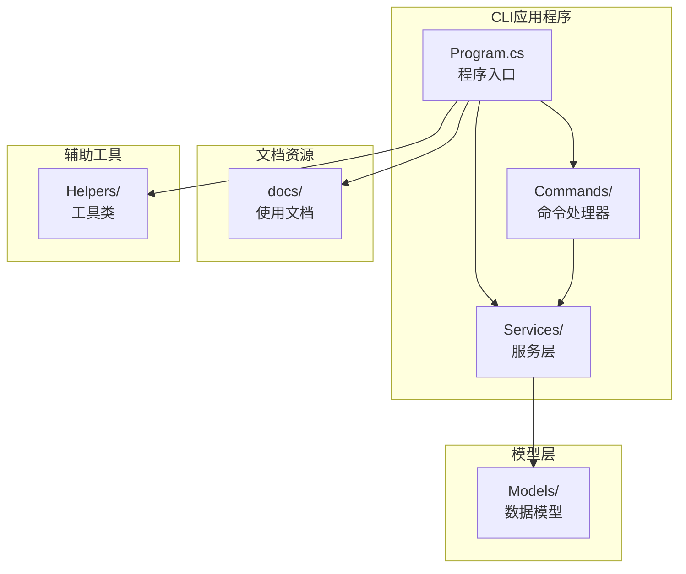
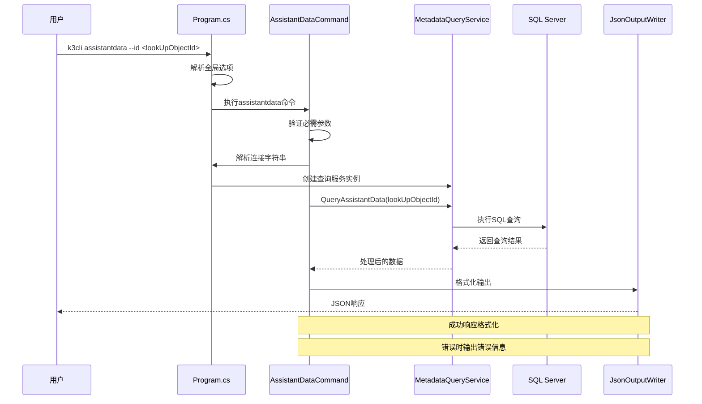
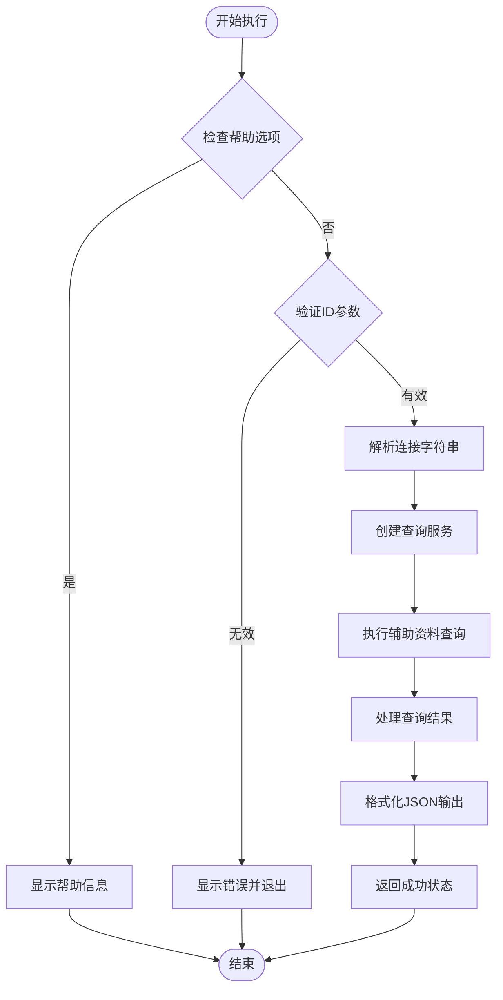
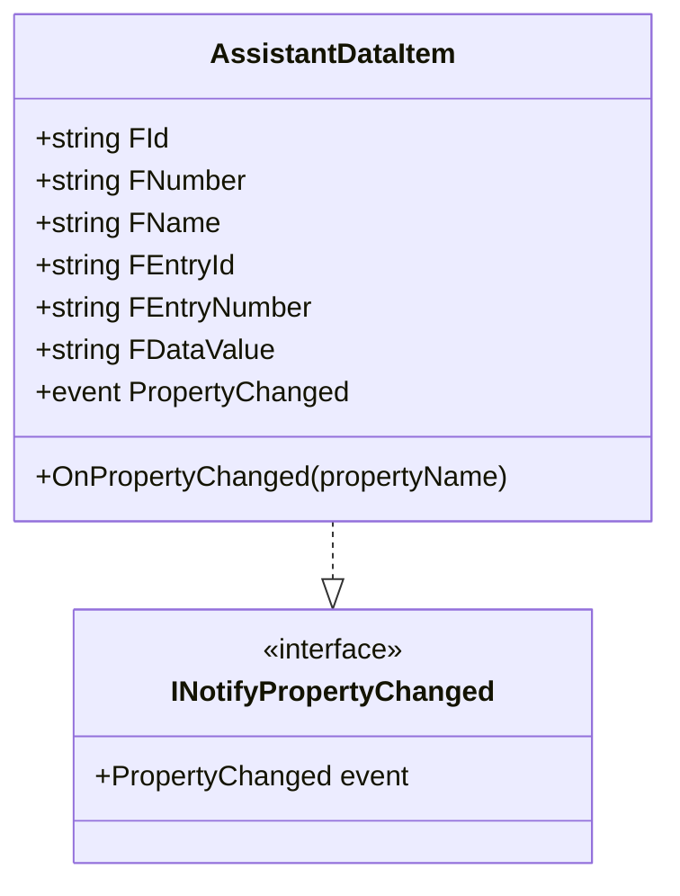
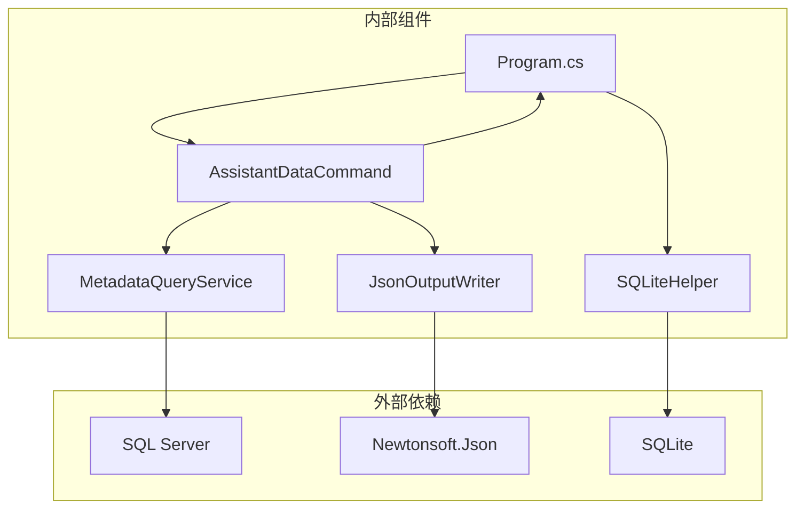

# assistantdata命令API

<cite>
**本文档引用的文件**
- [AssistantDataCommand.cs](file://K3CloudDataDictionary.Cli/Commands/AssistantDataCommand.cs)
- [MetadataQueryService.cs](file://K3CloudDataDictionary.Cli/Services/MetadataQueryService.cs)
- [JsonOutputWriter.cs](file://K3CloudDataDictionary.Cli/Services/JsonOutputWriter.cs)
- [HelpCommand.cs](file://K3CloudDataDictionary.Cli/Commands/HelpCommand.cs)
- [Program.cs](file://K3CloudDataDictionary.Cli/Program.cs)
- [AssistantDataItem.cs](file://Models/AssistantDataItem.cs)
- [usage-examples.md](file://docs/usage-examples.md)
</cite>

## 目录
1. [简介](#简介)
2. [项目结构](#项目结构)
3. [核心组件](#核心组件)
4. [架构概览](#架构概览)
5. [详细组件分析](#详细组件分析)
6. [依赖关系分析](#依赖关系分析)
7. [性能考虑](#性能考虑)
8. [故障排除指南](#故障排除指南)
9. [结论](#结论)
10. [附录](#附录)

## 简介

assistantdata命令是K3Cloud数据字典CLI工具中的一个重要功能模块，专门用于查询和获取辅助资料（辅助数据）的选项列表。该命令能够根据字段定义中的LookUpObjectID参数，查询对应辅助资料的所有可选值，包括主数据项和分录数据项的详细信息。

辅助资料在K3Cloud系统中是一种特殊的业务数据类型，通常用于存储基础的业务选项，如计量单位、仓库、员工等。通过assistantdata命令，用户可以快速获取这些辅助资料的完整配置信息，为系统集成和数据处理提供准确的数据支撑。

## 项目结构

K3Cloud数据字典CLI工具采用清晰的分层架构设计，主要包含以下核心目录结构：



**图表来源**
- [Program.cs:1-166](file://K3CloudDataDictionary.Cli/Program.cs#L1-L166)
- [AssistantDataCommand.cs:1-65](file://K3CloudDataDictionary.Cli/Commands/AssistantDataCommand.cs#L1-L65)

**章节来源**
- [Program.cs:14-69](file://K3CloudDataDictionary.Cli/Program.cs#L14-L69)

## 核心组件

### assistantdata命令处理器

AssistantDataCommand是assistantdata命令的核心实现，负责处理命令行参数、执行业务逻辑并输出结果。该组件具有以下关键特性：

- **参数验证**：严格验证必需的--id参数
- **错误处理**：完善的异常捕获和错误报告机制
- **JSON输出**：标准化的JSON格式输出
- **帮助系统**：内置的帮助信息显示功能

### 元数据查询服务

MetadataQueryService提供对K3Cloud元数据的实时查询能力，支持多种数据类型的查询操作。对于assistantdata命令，该服务专门负责辅助资料数据的查询和处理。

### JSON输出格式化器

JsonOutputWriter负责将查询结果格式化为标准的JSON响应格式，确保输出的一致性和可读性。

**章节来源**
- [AssistantDataCommand.cs:13-62](file://K3CloudDataDictionary.Cli/Commands/AssistantDataCommand.cs#L13-L62)
- [MetadataQueryService.cs:636-679](file://K3CloudDataDictionary.Cli/Services/MetadataQueryService.cs#L636-L679)
- [JsonOutputWriter.cs:26-70](file://K3CloudDataDictionary.Cli/Services/JsonOutputWriter.cs#L26-L70)

## 架构概览

assistantdata命令的执行架构采用典型的三层设计模式：



**图表来源**
- [Program.cs:45-46](file://K3CloudDataDictionary.Cli/Program.cs#L45-L46)
- [AssistantDataCommand.cs:33-61](file://K3CloudDataDictionary.Cli/Commands/AssistantDataCommand.cs#L33-L61)
- [MetadataQueryService.cs:636-679](file://K3CloudDataDictionary.Cli/Services/MetadataQueryService.cs#L636-L679)

## 详细组件分析

### 命令语法和参数规范

#### 基本语法
```
k3cli assistantdata --id <lookUpObjectId> [--connection <id>] [--pretty]
```

#### 参数详细说明

| 参数 | 类型 | 必需 | 描述 | 示例 |
|------|------|------|------|------|
| --id | 字符串 | 是 | 辅助资料ID（LookUpObjectID） | `--id 6099b796-9e56-434e-895e-a1628d12d4c2` |
| --connection | 整数 | 否 | 指定数据库连接ID | `--connection 1` |
| --pretty | 标志 | 否 | 格式化JSON输出 | `--pretty` |

#### 参数验证规则

1. **必需参数检查**：必须提供--id参数，否则返回错误
2. **参数格式验证**：ID参数不能为空字符串
3. **连接字符串解析**：支持通过--connection参数指定连接ID或使用默认连接
4. **帮助选项支持**：支持--help、-h等帮助选项

**章节来源**
- [AssistantDataCommand.cs:24-31](file://K3CloudDataDictionary.Cli/Commands/AssistantDataCommand.cs#L24-L31)
- [HelpCommand.cs:204-217](file://K3CloudDataDictionary.Cli/Commands/HelpCommand.cs#L204-L217)
- [Program.cs:102-124](file://K3CloudDataDictionary.Cli/Program.cs#L102-L124)

### 执行流程详解

#### 命令执行步骤



**图表来源**
- [AssistantDataCommand.cs:13-62](file://K3CloudDataDictionary.Cli/Commands/AssistantDataCommand.cs#L13-L62)

#### 数据处理流程

1. **参数解析**：从命令行参数中提取--id值
2. **连接建立**：通过Program.ResolveConnectionString获取数据库连接
3. **查询执行**：调用MetadataQueryService.QueryAssistantData方法
4. **数据转换**：将查询结果转换为友好的输出格式
5. **结果输出**：使用JsonOutputWriter.WriteSuccess格式化输出

**章节来源**
- [AssistantDataCommand.cs:33-56](file://K3CloudDataDictionary.Cli/Commands/AssistantDataCommand.cs#L33-L56)

### 返回值格式规范

#### 成功响应格式

```json
{
  "success": true,
  "command": "assistantdata",
  "data": [
    {
      "id": "辅助资料ID",
      "number": "编码",
      "name": "辅助资料名称",
      "entryId": "条目ID",
      "entryNumber": "条目编码",
      "dataValue": "数据值"
    }
  ],
  "count": 1
}
```

#### 错误响应格式

```json
{
  "success": false,
  "command": "assistantdata",
  "error": "错误消息"
}
```

#### 字段详细说明

| 字段名 | 类型 | 描述 | 示例值 |
|--------|------|------|--------|
| id | 字符串 | 辅助资料主数据ID | `6099b796-9e56-434e-895e-a1628d12d4c2` |
| number | 字符串 | 辅助资料编码 | `SUP001` |
| name | 字串 | 辅助资料名称 | `供应商A` |
| entryId | 字符串 | 分录数据ID | `1` |
| entryNumber | 字符串 | 分录数据编码 | `001` |
| dataValue | 字符串 | 数据值 | `供应商A` |

**章节来源**
- [AssistantDataCommand.cs:40-52](file://K3CloudDataDictionary.Cli/Commands/AssistantDataCommand.cs#L40-L52)
- [JsonOutputWriter.cs:26-70](file://K3CloudDataDictionary.Cli/Services/JsonOutputWriter.cs#L26-L70)

### 数据库查询实现

#### SQL查询语句

assistantdata命令使用以下SQL查询语句获取辅助资料数据：

```sql
SELECT a.FID, a.FNUMBER, b.FNAME, c.FENTRYID, c.FNUMBER AS FENTRYNUMBER, d.FDATAVALUE
FROM T_BAS_ASSISTANTDATA a
INNER JOIN T_BAS_ASSISTANTDATA_L b ON a.FID = b.FID AND b.FLOCALEID = 2052
INNER JOIN T_BAS_ASSISTANTDATAENTRY c ON a.FID = c.FID
INNER JOIN T_BAS_ASSISTANTDATAENTRY_L d ON c.FENTRYID = d.FENTRYID AND d.FLOCALEID = 2052
WHERE a.FID = @FID
ORDER BY c.FNUMBER
```

#### 查询特点

1. **多表关联**：涉及辅助资料主表、本地化表、分录表和分录本地化表
2. **语言支持**：通过FLOCALEID=2052确保中文显示
3. **排序规则**：按分录编码升序排列
4. **参数绑定**：使用参数化查询防止SQL注入

**章节来源**
- [MetadataQueryService.cs:645-651](file://K3CloudDataDictionary.Cli/Services/MetadataQueryService.cs#L645-L651)

### 辅助资料数据模型

#### AssistantDataItem类结构



**图表来源**
- [AssistantDataItem.cs:6-56](file://Models/AssistantDataItem.cs#L6-L56)

#### 属性映射关系

| JSON字段 | C#属性 | 数据库列 | 描述 |
|----------|--------|----------|------|
| id | FId | FID | 辅助资料主数据ID |
| number | FNumber | FNUMBER | 编码 |
| name | FName | FNAME | 名称 |
| entryId | FEntryId | FENTRYID | 分录ID |
| entryNumber | FEntryNumber | FENTRYNUMBER | 分录编码 |
| dataValue | FDataValue | FDATAVALUE | 数据值 |

**章节来源**
- [AssistantDataItem.cs:15-49](file://Models/AssistantDataItem.cs#L15-L49)

## 依赖关系分析

### 组件依赖图



**图表来源**
- [Program.cs:3-6](file://K3CloudDataDictionary.Cli/Program.cs#L3-L6)
- [AssistantDataCommand.cs:3-4](file://K3CloudDataDictionary.Cli/Commands/AssistantDataCommand.cs#L3-L4)

### 关键依赖关系

1. **Program.cs**：程序入口点，负责命令分发和全局选项解析
2. **AssistantDataCommand.cs**：assistantdata命令的具体实现
3. **MetadataQueryService.cs**：提供数据库查询功能
4. **JsonOutputWriter.cs**：负责JSON格式化输出
5. **SQLiteHelper.cs**：管理数据库连接配置

**章节来源**
- [Program.cs:34-57](file://K3CloudDataDictionary.Cli/Program.cs#L34-L57)

## 性能考虑

### 查询优化策略

1. **参数化查询**：使用@FID参数绑定，避免SQL注入同时提升查询性能
2. **索引利用**：SQL Server自动利用相关表的索引
3. **结果集限制**：合理控制返回数据量，避免内存溢出
4. **连接池管理**：通过SqlConnection自动管理连接池

### 内存使用优化

1. **流式处理**：使用SqlDataReader逐行读取数据
2. **延迟加载**：MetadataQueryService采用懒加载模式
3. **对象复用**：重用SqlCommand和SqlConnection对象

## 故障排除指南

### 常见错误及解决方案

#### 1. 缺少必需参数
**错误信息**：`缺少必填参数 --id <lookUpObjectId>`
**解决方法**：确保提供--id参数，例如：
```bash
k3cli assistantdata --id 6099b796-9e56-434e-895e-a1628d12d4c2
```

#### 2. 连接配置问题
**错误信息**：`没有默认连接。请使用 --connection 参数指定连接，或先配置默认连接。`
**解决方法**：
```bash
# 添加新的数据库连接
k3cli connections add --server 192.168.1.100 --db K3CloudDB --user sa --password password --default

# 或者指定连接ID
k3cli assistantdata --id <lookUpObjectId> --connection 1
```

#### 3. 数据库连接失败
**错误信息**：SQL Server连接异常
**解决方法**：
1. 检查网络连通性
2. 验证SQL Server服务状态
3. 确认凭据正确性
4. 测试连接配置：`k3cli connections test --id 1`

### 调试技巧

1. **启用详细日志**：使用--pretty参数查看格式化的JSON输出
2. **验证参数**：使用--help查看命令帮助信息
3. **测试连接**：先运行`k3cli connections list`确认连接配置

**章节来源**
- [AssistantDataCommand.cs:28-30](file://K3CloudDataDictionary.Cli/Commands/AssistantDataCommand.cs#L28-L30)
- [Program.cs:140-151](file://K3CloudDataDictionary.Cli/Program.cs#L140-L151)

## 结论

assistantdata命令作为K3Cloud数据字典CLI工具的重要组成部分，提供了高效、可靠的辅助资料查询功能。该命令具有以下优势：

1. **简洁易用**：仅需提供必要的--id参数即可完成查询
2. **标准化输出**：统一的JSON格式输出，便于程序处理
3. **错误处理**：完善的错误检测和用户友好的错误信息
4. **扩展性强**：基于MetadataQueryService的设计，易于扩展其他查询功能

通过assistantdata命令，开发者和系统管理员可以快速获取辅助资料的完整配置信息，为系统集成、数据迁移和业务分析提供可靠的数据支撑。

## 附录

### 完整使用示例

#### 基本查询示例
```bash
# 基本查询
k3cli assistantdata --id 6099b796-9e56-434e-895e-a1628d12d4c2

# 格式化输出
k3cli assistantdata --id 6099b796-9e56-434e-895e-a1628d12d4c2 --pretty

# 指定连接
k3cli assistantdata --id 6099b796-9e56-434e-895e-a1628d12d4c2 --connection 1
```

#### 与其他命令的配合使用

1. **查找字段获取lookUpObjectID**：
```bash
k3cli fields --form PUR_PurchaseOrder --keyword "供应商"
```

2. **解析lookUpObjectID**：
```bash
k3cli resolve --id 6099b796-9e56-434e-895e-a1628d12d4c2
```

3. **查询辅助资料选项**：
```bash
k3cli assistantdata --id 6099b796-9e56-434e-895e-a1628d12d4c2 --pretty
```

### 最佳实践建议

1. **参数验证**：始终验证--id参数的有效性
2. **连接管理**：合理管理数据库连接配置
3. **错误处理**：实现适当的错误处理和重试机制
4. **性能优化**：对于大量数据查询，考虑分页或限制结果集大小
5. **安全考虑**：使用参数化查询防止SQL注入攻击

**章节来源**
- [usage-examples.md:252-274](file://docs/usage-examples.md#L252-L274)