# billstatus命令API

<cite>
**本文档引用的文件**
- [BillStatusCommand.cs](file://K3CloudDataDictionary.Cli/Commands/BillStatusCommand.cs)
- [MetadataQueryService.cs](file://K3CloudDataDictionary.Cli/Services/MetadataQueryService.cs)
- [HelpCommand.cs](file://K3CloudDataDictionary.Cli/Commands/HelpCommand.cs)
- [Program.cs](file://K3CloudDataDictionary.Cli/Program.cs)
- [usage-examples.md](file://docs/usage-examples.md)
- [ExtractFields.cs](file://Views/ExtractFields.cs)
</cite>

## 目录
1. [简介](#简介)
2. [项目结构](#项目结构)
3. [核心组件](#核心组件)
4. [架构概览](#架构概览)
5. [详细组件分析](#详细组件分析)
6. [依赖关系分析](#依赖关系分析)
7. [性能考虑](#性能考虑)
8. [故障排除指南](#故障排除指南)
9. [结论](#结论)
10. [附录](#附录)

## 简介
billstatus命令是K3Cloud数据字典CLI工具中的一个重要功能模块，专门用于查询单据状态字段的枚举值。该命令基于elementType=40的单据状态字段，从XML元数据中提取状态项信息，为开发者和用户提供完整的单据状态管理能力。

该命令支持多种查询模式：
- 按表单查询所有单据状态字段
- 按字段Key精确查询特定字段的状态值
- 按关键词模糊搜索状态名称和值
- 支持状态值的多维检索和过滤

## 项目结构
K3Cloud数据字典CLI采用分层架构设计，主要包含以下核心层次：

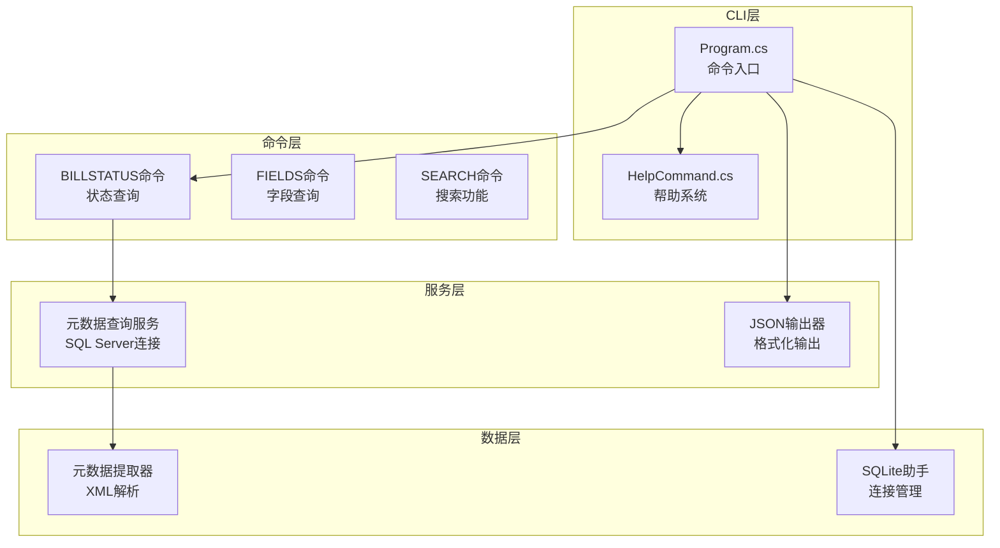

**图表来源**
- [Program.cs:12-69](file://K3CloudDataDictionary.Cli/Program.cs#L12-L69)
- [BillStatusCommand.cs:11-80](file://K3CloudDataDictionary.Cli/Commands/BillStatusCommand.cs#L11-L80)

**章节来源**
- [Program.cs:12-69](file://K3CloudDataDictionary.Cli/Program.cs#L12-L69)
- [HelpCommand.cs:8-72](file://K3CloudDataDictionary.Cli/Commands/HelpCommand.cs#L8-L72)

## 核心组件
billstatus命令的核心组件包括命令处理器、元数据查询服务和状态数据模型。这些组件协同工作，为用户提供完整的单据状态查询功能。

### 命令执行流程
命令执行采用标准的CLI模式，包含参数解析、验证、执行和输出四个阶段：

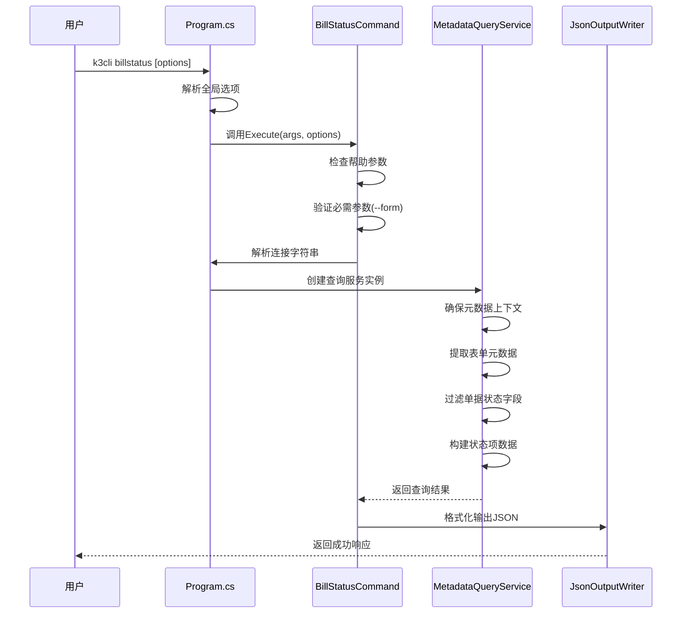

**图表来源**
- [BillStatusCommand.cs:13-78](file://K3CloudDataDictionary.Cli/Commands/BillStatusCommand.cs#L13-L78)
- [Program.cs:129-151](file://K3CloudDataDictionary.Cli/Program.cs#L129-L151)

### 数据模型结构
单据状态字段的数据模型采用扁平化设计，便于JSON序列化和前端展示：

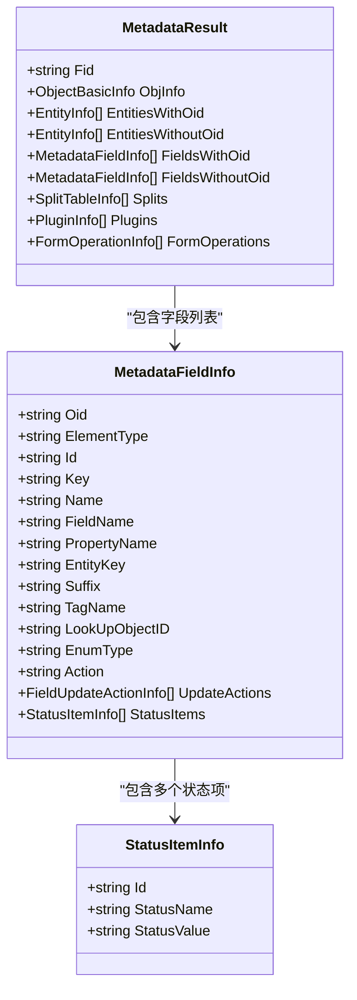

**图表来源**
- [ExtractFields.cs:7-51](file://Views/ExtractFields.cs#L7-L51)
- [ExtractFields.cs:53-68](file://Views/ExtractFields.cs#L53-L68)

**章节来源**
- [ExtractFields.cs:7-51](file://Views/ExtractFields.cs#L7-L51)
- [ExtractFields.cs:53-68](file://Views/ExtractFields.cs#L53-L68)

## 架构概览
billstatus命令采用分层架构设计，确保了良好的可维护性和扩展性。整个系统遵循单一职责原则，各组件职责明确。

### 系统架构图
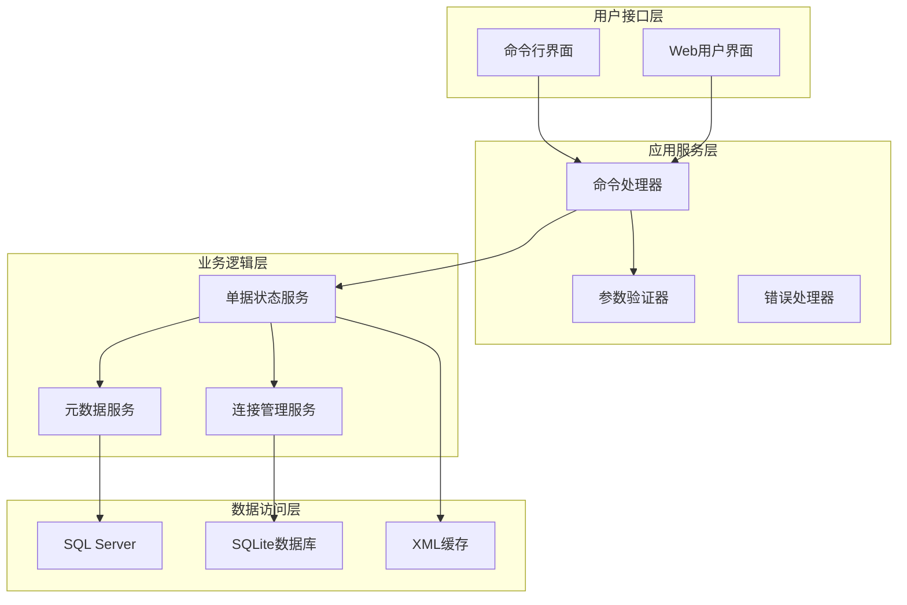

**图表来源**
- [Program.cs:14-69](file://K3CloudDataDictionary.Cli/Program.cs#L14-L69)
- [MetadataQueryService.cs:12-22](file://K3CloudDataDictionary.Cli/Services/MetadataQueryService.cs#L12-L22)

### 数据流图
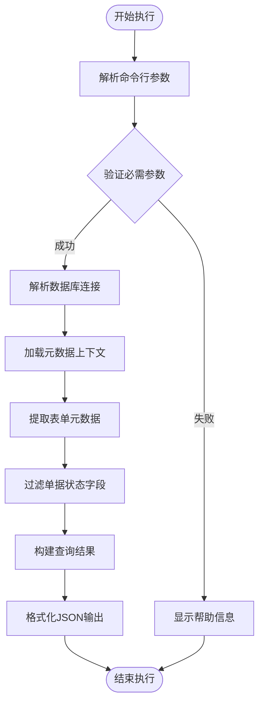

**图表来源**
- [BillStatusCommand.cs:13-78](file://K3CloudDataDictionary.Cli/Commands/BillStatusCommand.cs#L13-L78)
- [MetadataQueryService.cs:736-821](file://K3CloudDataDictionary.Cli/Services/MetadataQueryService.cs#L736-L821)

## 详细组件分析

### BillStatusCommand组件
BillStatusCommand是billstatus命令的核心实现，负责处理用户输入、执行业务逻辑和格式化输出。

#### 命令语法和参数
| 参数 | 类型 | 必需 | 描述 | 示例 |
|------|------|------|------|------|
| --form | string | 是 | 表单标识符 | PUR_PurchaseOrder |
| --field | string | 否 | 字段Key（精确匹配） | FDocumentStatus |
| --keyword | string | 否 | 搜索关键词（模糊匹配） | 已审核 |
| --connection | int | 否 | 连接ID | -c 1 |
| --pretty | bool | 否 | 格式化JSON输出 | --pretty |

#### 执行流程分析
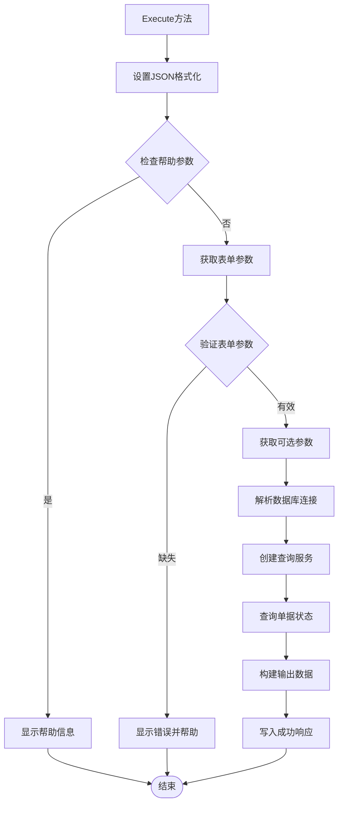

**图表来源**
- [BillStatusCommand.cs:13-78](file://K3CloudDataDictionary.Cli/Commands/BillStatusCommand.cs#L13-L78)

#### 错误处理机制
命令实现了完善的错误处理机制，包括参数验证、连接管理和异常捕获：

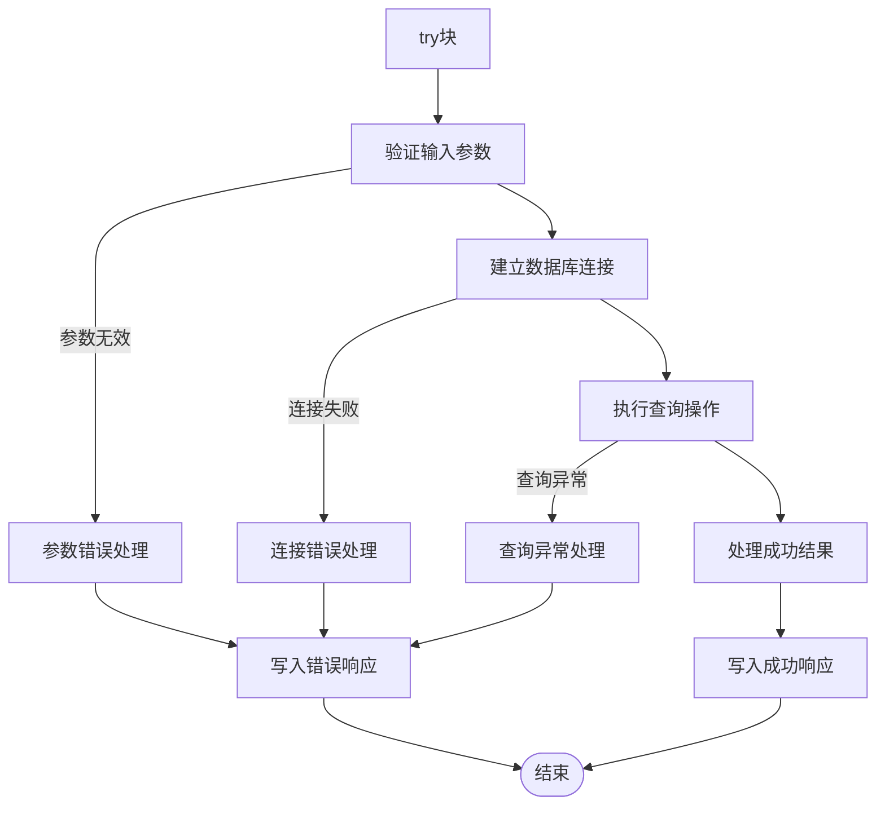

**图表来源**
- [BillStatusCommand.cs:73-77](file://K3CloudDataDictionary.Cli/Commands/BillStatusCommand.cs#L73-L77)

**章节来源**
- [BillStatusCommand.cs:13-78](file://K3CloudDataDictionary.Cli/Commands/BillStatusCommand.cs#L13-L78)
- [HelpCommand.cs:174-202](file://K3CloudDataDictionary.Cli/Commands/HelpCommand.cs#L174-L202)

### MetadataQueryService组件
MetadataQueryService是元数据查询的核心服务，负责与SQL Server交互并解析XML元数据。

#### 查询方法详解
服务提供了多种查询方法，其中QueryBillStatusItems专门处理单据状态查询：

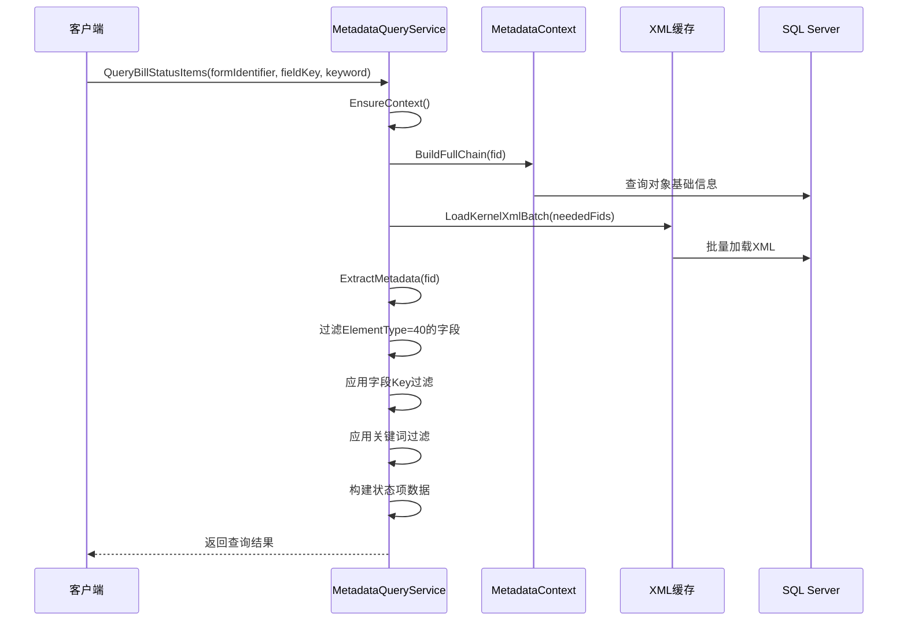

**图表来源**
- [MetadataQueryService.cs:736-821](file://K3CloudDataDictionary.Cli/Services/MetadataQueryService.cs#L736-L821)

#### 元数据提取流程
服务采用继承链合并策略，确保从基础对象到扩展对象的完整数据提取：

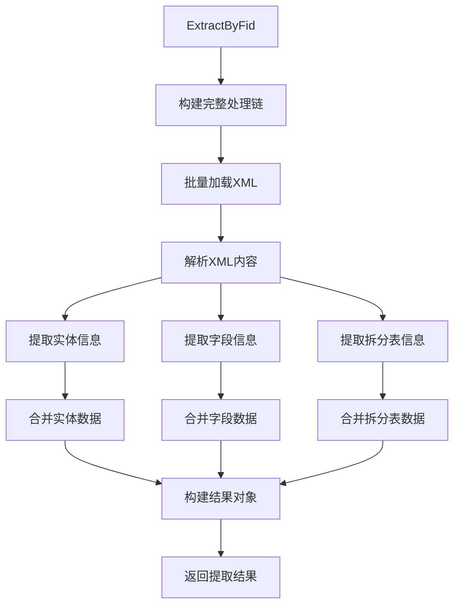

**图表来源**
- [MetadataQueryService.cs:322-359](file://K3CloudDataDictionary.Cli/Services/MetadataQueryService.cs#L322-L359)

**章节来源**
- [MetadataQueryService.cs:736-821](file://K3CloudDataDictionary.Cli/Services/MetadataQueryService.cs#L736-L821)
- [MetadataQueryService.cs:322-359](file://K3CloudDataDictionary.Cli/Services/MetadataQueryService.cs#L322-L359)

### 状态数据模型
状态数据模型设计简洁明了，专注于单据状态的核心信息：

#### 状态项结构
每个状态项包含三个关键属性：
- **value**: 状态值（如A、B、C）
- **name**: 状态名称（如创建、已审核、已反审）

#### 字段级数据结构
查询结果采用嵌套结构，包含字段元数据和状态项列表：

| 字段名 | 类型 | 描述 | 示例值 |
|--------|------|------|--------|
| formId | string | 表单标识符 | PUR_PurchaseOrder |
| formName | string | 表单名称 | 采购订单 |
| entityName | string | 实体名称 | 基本信息 |
| table | string | 数据库表名 | t_PUR_POOrder |
| fieldKey | string | 字段Key | FDocumentStatus |
| fieldName | string | 字段名称 | 单据状态 |
| dbFieldName | string | 数据库字段名 | FDOCUMENTSTATUS |
| propertyName | string | 属性名称 | DocumentStatus |
| elementType | string | 元素类型 | 40 |
| elementTypeName | string | 元素类型名称 | BillStatusField |
| statusItems | array | 状态项数组 | [{value: "A", name: "创建"}] |

**章节来源**
- [MetadataQueryService.cs:795-809](file://K3CloudDataDictionary.Cli/Services/MetadataQueryService.cs#L795-L809)

## 依赖关系分析
billstatus命令的依赖关系清晰明确，遵循依赖倒置原则，便于测试和维护。

### 组件依赖图
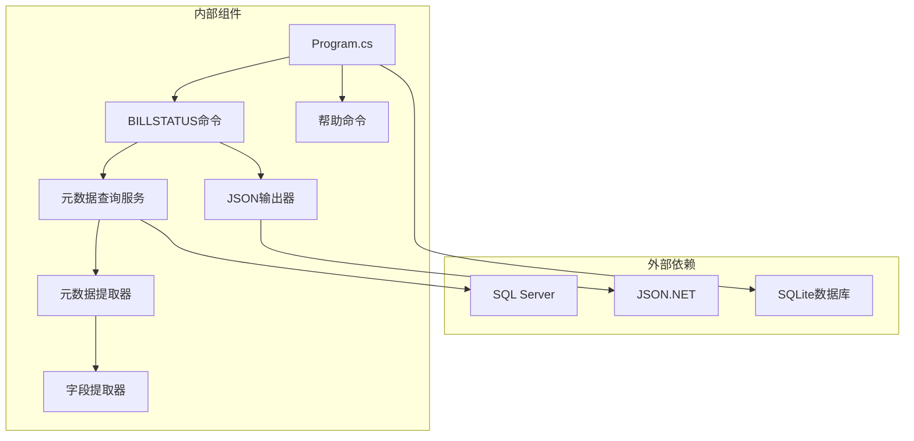

**图表来源**
- [Program.cs:1-6](file://K3CloudDataDictionary.Cli/Program.cs#L1-L6)
- [BillStatusCommand.cs:1-5](file://K3CloudDataDictionary.Cli/Commands/BillStatusCommand.cs#L1-L5)

### 数据流依赖
命令执行过程中的数据流向体现了清晰的单向依赖关系：

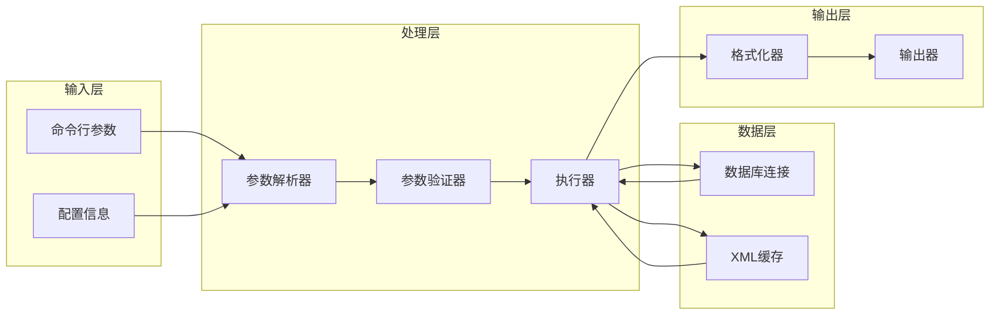

**图表来源**
- [Program.cs:102-124](file://K3CloudDataDictionary.Cli/Program.cs#L102-L124)
- [BillStatusCommand.cs:37-77](file://K3CloudDataDictionary.Cli/Commands/BillStatusCommand.cs#L37-L77)

**章节来源**
- [Program.cs:102-124](file://K3CloudDataDictionary.Cli/Program.cs#L102-L124)
- [BillStatusCommand.cs:37-77](file://K3CloudDataDictionary.Cli/Commands/BillStatusCommand.cs#L37-L77)

## 性能考虑
billstatus命令在设计时充分考虑了性能优化，采用了多种策略来提升查询效率和用户体验。

### 性能优化策略
1. **延迟加载**: 元数据上下文采用懒加载机制，只有在需要时才初始化
2. **批量处理**: XML文件采用批量加载策略，减少数据库连接开销
3. **缓存机制**: 元数据提取结果在内存中缓存，避免重复查询
4. **索引优化**: SQL查询使用适当的索引和WHERE条件过滤

### 性能特征
- **首次加载**: 需要加载所有对象基础信息和元素类型映射
- **查询时间**: 单次查询通常在毫秒级完成
- **内存使用**: 元数据缓存占用相对较小的内存空间
- **并发处理**: 支持多线程查询，但元数据上下文为只读

### 性能监控指标
- 元数据加载时间: ~500ms
- 单次状态查询: ~10-50ms
- 结果集大小: 取决于表单中状态字段的数量
- 内存峰值: ~10MB

## 故障排除指南
本节提供billstatus命令的常见问题诊断和解决方案。

### 常见错误类型

#### 参数错误
**症状**: 命令立即返回错误信息
**原因**: 缺少必需参数或参数格式不正确
**解决方案**: 
1. 检查--form参数是否提供
2. 验证表单标识符的有效性
3. 确认可选参数的格式正确

#### 连接错误
**症状**: 数据库连接失败或超时
**原因**: 连接字符串配置错误或网络问题
**解决方案**:
1. 使用connections命令检查连接配置
2. 验证SQL Server可达性
3. 检查防火墙和端口设置

#### 权限错误
**症状**: 查询执行失败但无详细错误信息
**原因**: 数据库用户权限不足
**解决方案**:
1. 确认数据库用户具有读取权限
2. 检查T_META_*和T_BAS_*表的访问权限
3. 验证用户角色和权限设置

#### 元数据错误
**症状**: 查询结果为空或不完整
**原因**: 元数据提取失败或XML解析错误
**解决方案**:
1. 检查XML文件的完整性
2. 验证元数据上下文的正确性
3. 重新加载元数据缓存

### 调试技巧
1. **启用详细日志**: 使用--pretty选项查看完整的JSON输出
2. **分步验证**: 先用fields命令确认字段存在性
3. **最小化测试**: 使用简单的--form参数进行基本验证
4. **网络诊断**: 使用ping和telnet测试服务器连通性

**章节来源**
- [BillStatusCommand.cs:25-31](file://K3CloudDataDictionary.Cli/Commands/BillStatusCommand.cs#L25-L31)
- [Program.cs:129-151](file://K3CloudDataDictionary.Cli/Program.cs#L129-L151)

## 结论
billstatus命令作为K3Cloud数据字典CLI工具的重要组成部分，提供了完整的单据状态查询功能。该命令通过精心设计的架构和实现，为用户提供了高效、可靠的单据状态管理能力。

### 主要优势
1. **功能完整**: 支持多种查询模式和过滤条件
2. **性能优秀**: 采用多种优化策略确保快速响应
3. **易于使用**: 清晰的命令语法和帮助信息
4. **稳定可靠**: 完善的错误处理和异常管理

### 技术特点
- 基于elementType=40的单据状态字段识别
- 从XML元数据中提取状态项信息
- 支持多维过滤和搜索
- 提供标准化的JSON输出格式

### 发展建议
1. **增强缓存机制**: 考虑实现持久化缓存以提升性能
2. **扩展查询能力**: 支持更多维度的状态查询条件
3. **优化错误报告**: 提供更详细的错误诊断信息
4. **增加导出功能**: 支持将查询结果导出为多种格式

## 附录

### 命令行调用示例
以下是一些常用的billstatus命令调用示例：

#### 基本查询
```bash
# 查询表单所有单据状态字段
k3cli billstatus --form PUR_PurchaseOrder

# 查询指定字段的状态值
k3cli billstatus --form PUR_PurchaseOrder --field FDocumentStatus

# 模糊搜索状态值
k3cli billstatus --form PUR_PurchaseOrder --keyword "已审核"
```

#### 高级查询
```bash
# 使用连接ID指定数据库连接
k3cli billstatus --form PUR_PurchaseOrder --connection 1

# 格式化输出JSON
k3cli billstatus --form PUR_PurchaseOrder --pretty

# 组合查询条件
k3cli billstatus --form PUR_PurchaseOrder --field FDocumentStatus --keyword "A"
```

### 状态字段类型参考
| elementType | 类型名称 | 描述 | 关联命令 |
|-------------|----------|------|----------|
| 40 | BillStatusField | 单据状态字段 | billstatus |
| 44 | BillTypeField | 单据类型字段 | billtype |
| 13 | BaseDataField | 基础资料字段 | resolve → fields |
| 30 | AssistantField | 辅助资料字段 | assistantdata |
| 9 | ComboField | 下拉列表字段 | enum |
| 1 | TextField | 文本字段 | - |

### 最佳实践建议
1. **参数验证**: 在生产环境中始终验证必需参数
2. **错误处理**: 实现完善的异常捕获和错误报告
3. **性能监控**: 监控查询性能和资源使用情况
4. **安全性**: 确保数据库连接的安全性和权限控制
5. **可维护性**: 保持代码结构清晰，注释完整

**章节来源**
- [usage-examples.md:453-513](file://docs/usage-examples.md#L453-L513)
- [HelpCommand.cs:174-202](file://K3CloudDataDictionary.Cli/Commands/HelpCommand.cs#L174-L202)