# billtype命令API

<cite>
**本文档引用的文件**
- [BillTypeCommand.cs](file://K3CloudDataDictionary.Cli/Commands/BillTypeCommand.cs)
- [MetadataQueryService.cs](file://K3CloudDataDictionary.Cli/Services/MetadataQueryService.cs)
- [HelpCommand.cs](file://K3CloudDataDictionary.Cli/Commands/HelpCommand.cs)
- [Program.cs](file://K3CloudDataDictionary.Cli/Program.cs)
- [JsonOutputWriter.cs](file://K3CloudDataDictionary.Cli/Services/JsonOutputWriter.cs)
- [usage-examples.md](file://docs/usage-examples.md)
- [BillTypeInfo.cs](file://Models/BillTypeInfo.cs)
</cite>

## 目录
1. [简介](#简介)
2. [项目结构](#项目结构)
3. [核心组件](#核心组件)
4. [架构概览](#架构概览)
5. [详细组件分析](#详细组件分析)
6. [依赖关系分析](#依赖关系分析)
7. [性能考虑](#性能考虑)
8. [故障排除指南](#故障排除指南)
9. [结论](#结论)
10. [附录](#附录)

## 简介

billtype命令是K3Cloud数据字典CLI工具中的一个重要功能模块，专门用于查询和管理单据类型信息。该命令支持三种查询模式：按表单查询单据类型列表、按ID精确查询单据类型详情、按关键词模糊搜索单据类型。

单据类型（Bill Type）是K3Cloud系统中的核心概念，代表了具体的业务单据形态，如采购订单、销售订单、入库单等。每个单据类型都有唯一的标识符、编码、名称和描述信息，并与特定的表单（Form）相关联。

## 项目结构

K3Cloud数据字典CLI工具采用分层架构设计，主要包含以下核心目录结构：

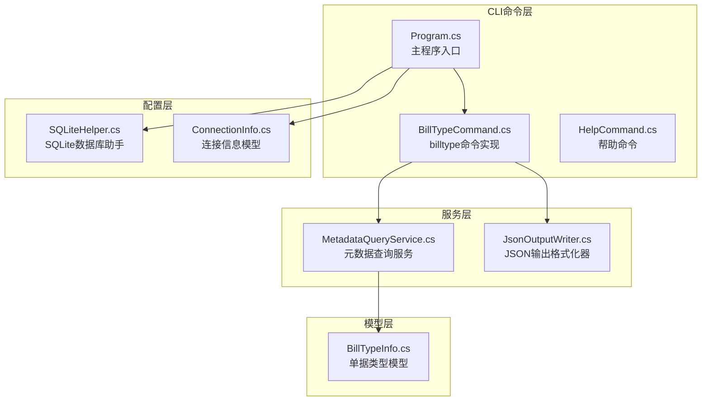

**图表来源**
- [Program.cs:1-166](file://K3CloudDataDictionary.Cli/Program.cs#L1-L166)
- [BillTypeCommand.cs:1-66](file://K3CloudDataDictionary.Cli/Commands/BillTypeCommand.cs#L1-L66)
- [MetadataQueryService.cs:1-839](file://K3CloudDataDictionary.Cli/Services/MetadataQueryService.cs#L1-L839)

**章节来源**
- [Program.cs:1-166](file://K3CloudDataDictionary.Cli/Program.cs#L1-L166)
- [BillTypeCommand.cs:1-66](file://K3CloudDataDictionary.Cli/Commands/BillTypeCommand.cs#L1-L66)

## 核心组件

### 命令执行流程

billtype命令的执行流程遵循标准的CLI命令模式，包含参数解析、业务逻辑处理和结果输出三个主要阶段：

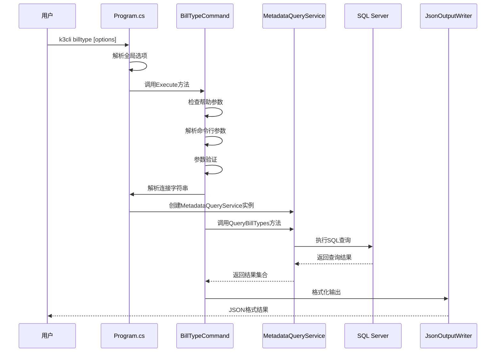

**图表来源**
- [Program.cs:14-69](file://K3CloudDataDictionary.Cli/Program.cs#L14-L69)
- [BillTypeCommand.cs:13-63](file://K3CloudDataDictionary.Cli/Commands/BillTypeCommand.cs#L13-L63)
- [MetadataQueryService.cs:569-630](file://K3CloudDataDictionary.Cli/Services/MetadataQueryService.cs#L569-L630)

### 参数验证机制

命令实现了严格的参数验证机制，确保用户输入的有效性：

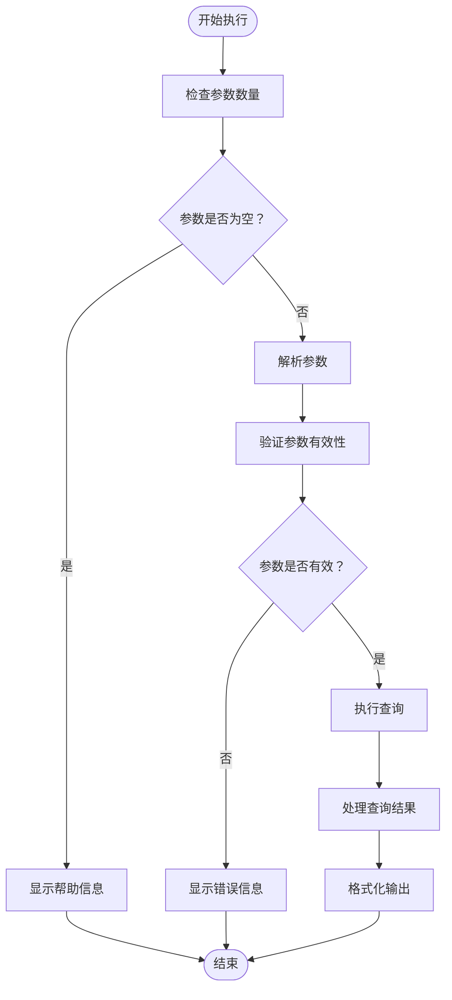

**图表来源**
- [BillTypeCommand.cs:29-34](file://K3CloudDataDictionary.Cli/Commands/BillTypeCommand.cs#L29-L34)
- [BillTypeCommand.cs:58-62](file://K3CloudDataDictionary.Cli/Commands/BillTypeCommand.cs#L58-L62)

**章节来源**
- [BillTypeCommand.cs:13-63](file://K3CloudDataDictionary.Cli/Commands/BillTypeCommand.cs#L13-L63)
- [Program.cs:102-124](file://K3CloudDataDictionary.Cli/Program.cs#L102-L124)

## 架构概览

### 整体架构设计

billtype命令采用经典的三层架构模式，实现了关注点分离和高内聚低耦合的设计原则：

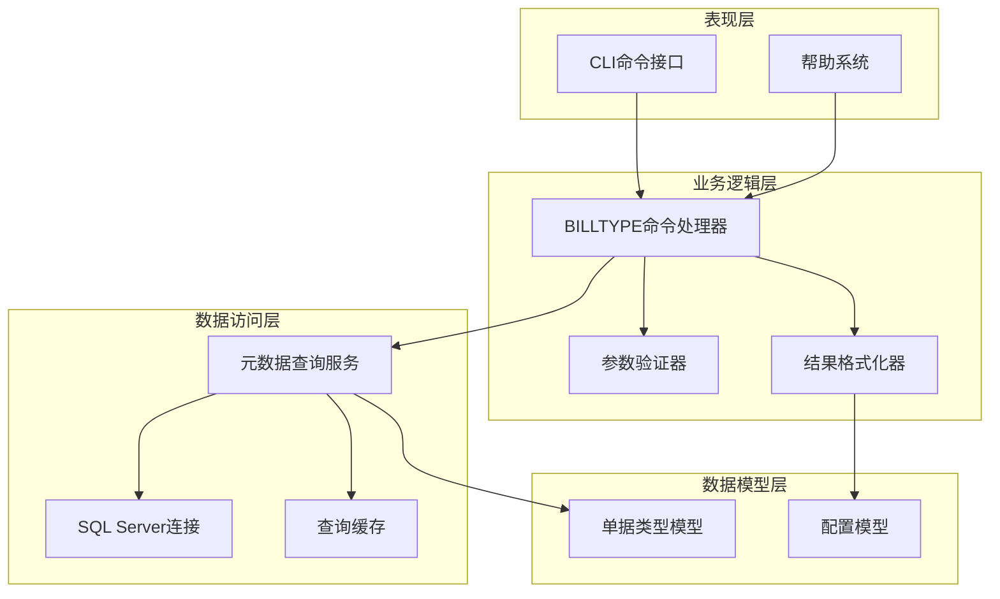

**图表来源**
- [BillTypeCommand.cs:1-66](file://K3CloudDataDictionary.Cli/Commands/BillTypeCommand.cs#L1-L66)
- [MetadataQueryService.cs:1-839](file://K3CloudDataDictionary.Cli/Services/MetadataQueryService.cs#L1-L839)

### 数据流架构

单据类型查询的数据流遵循标准的CRUD操作模式：

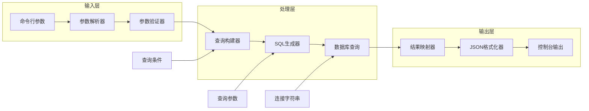

**图表来源**
- [MetadataQueryService.cs:569-630](file://K3CloudDataDictionary.Cli/Services/MetadataQueryService.cs#L569-L630)
- [JsonOutputWriter.cs:26-53](file://K3CloudDataDictionary.Cli/Services/JsonOutputWriter.cs#L26-L53)

**章节来源**
- [MetadataQueryService.cs:569-630](file://K3CloudDataDictionary.Cli/Services/MetadataQueryService.cs#L569-L630)
- [JsonOutputWriter.cs:1-91](file://K3CloudDataDictionary.Cli/Services/JsonOutputWriter.cs#L1-L91)

## 详细组件分析

### BillTypeCommand组件

BillTypeCommand是billtype命令的核心实现，负责处理用户请求、执行业务逻辑和格式化输出结果。

#### 类结构分析

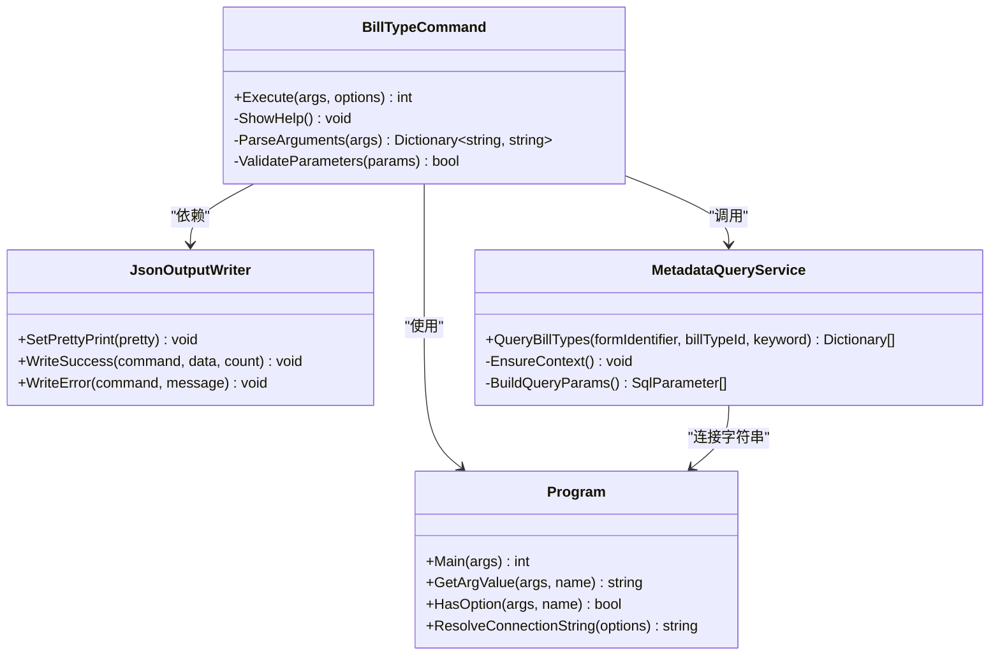

**图表来源**
- [BillTypeCommand.cs:11-66](file://K3CloudDataDictionary.Cli/Commands/BillTypeCommand.cs#L11-L66)
- [Program.cs:12-166](file://K3CloudDataDictionary.Cli/Program.cs#L12-L166)
- [JsonOutputWriter.cs:11-91](file://K3CloudDataDictionary.Cli/Services/JsonOutputWriter.cs#L11-L91)
- [MetadataQueryService.cs:12-839](file://K3CloudDataDictionary.Cli/Services/MetadataQueryService.cs#L12-L839)

#### 核心方法实现

**Execute方法分析**

Execute方法是命令的主要入口点，实现了完整的命令执行生命周期：

1. **参数预处理**：设置JSON格式化选项
2. **帮助检查**：识别并处理帮助请求
3. **参数解析**：提取form、id、keyword参数
4. **参数验证**：确保至少有一个必需参数
5. **业务执行**：调用元数据查询服务
6. **结果处理**：格式化并输出JSON结果

**章节来源**
- [BillTypeCommand.cs:13-63](file://K3CloudDataDictionary.Cli/Commands/BillTypeCommand.cs#L13-L63)

### MetadataQueryService组件

MetadataQueryService提供了强大的元数据查询能力，支持多种查询模式和复杂的业务场景。

#### 查询方法分析

**QueryBillTypes方法**

该方法支持三种查询模式，每种模式都有特定的使用场景：

```mermaid
flowchart TD
A[QueryBillTypes调用] --> B{查询模式选择}
B --> |按表单查询| C[WHERE FBILLFORMID = @FormIdentifier]
B --> |按ID查询| D[WHERE FBILLTYPEID = @BillTypeId]
B --> |关键词查询| E[WHERE (FNUMBER LIKE @Keyword OR FNAME LIKE @Keyword OR FDESCRIPTION LIKE @Keyword)]
C --> F[构建SQL语句]
D --> F
E --> F
F --> G[添加参数]
G --> H[执行查询]
H --> I[映射结果]
I --> J[返回结果集]
```

**图表来源**
- [MetadataQueryService.cs:569-630](file://K3CloudDataDictionary.Cli/Services/MetadataQueryService.cs#L569-L630)

**查询参数详解**

| 参数名称 | 类型 | 必需性 | 描述 | 示例 |
|---------|------|--------|------|------|
| form | string | 可选 | 表单标识符 | PUR_PurchaseOrder |
| id | string | 可选 | 单据类型ID | 83d822ca3e374b4ab01e5dd46a0062bd |
| keyword | string | 可选 | 搜索关键词 | 采购订单 |

**章节来源**
- [MetadataQueryService.cs:569-630](file://K3CloudDataDictionary.Cli/Services/MetadataQueryService.cs#L569-L630)

### 数据模型分析

#### BillTypeInfo模型

虽然当前billtype命令主要使用匿名对象进行结果输出，但BillTypeInfo模型提供了类型安全的数据封装：

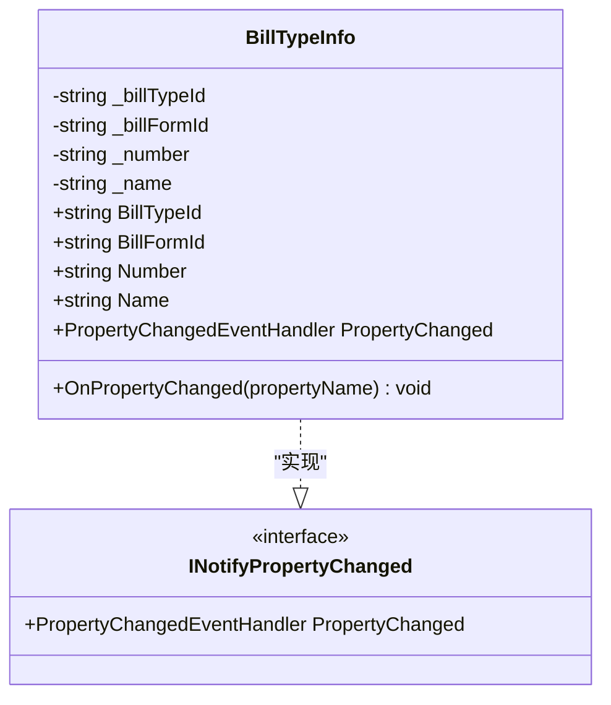

**图表来源**
- [BillTypeInfo.cs:6-45](file://Models/BillTypeInfo.cs#L6-L45)

**章节来源**
- [BillTypeInfo.cs:1-45](file://Models/BillTypeInfo.cs#L1-L45)

## 依赖关系分析

### 组件依赖图

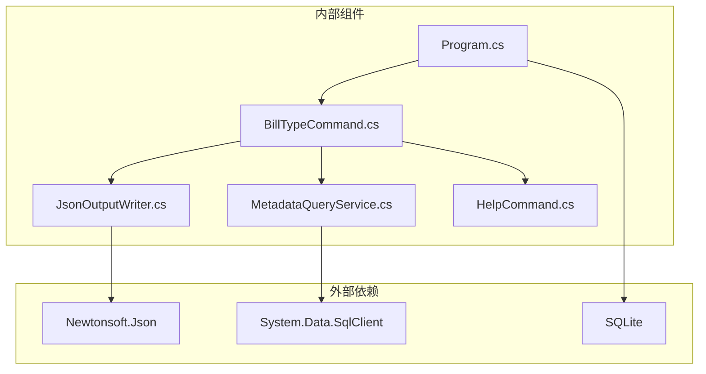

**图表来源**
- [Program.cs:1-166](file://K3CloudDataDictionary.Cli/Program.cs#L1-L166)
- [BillTypeCommand.cs:1-66](file://K3CloudDataDictionary.Cli/Commands/BillTypeCommand.cs#L1-L66)
- [MetadataQueryService.cs:1-839](file://K3CloudDataDictionary.Cli/Services/MetadataQueryService.cs#L1-L839)
- [JsonOutputWriter.cs:1-91](file://K3CloudDataDictionary.Cli/Services/JsonOutputWriter.cs#L1-L91)
- [HelpCommand.cs:1-287](file://K3CloudDataDictionary.Cli/Commands/HelpCommand.cs#L1-L287)

### 错误处理依赖

命令执行过程中的错误处理依赖于多个组件的协作：

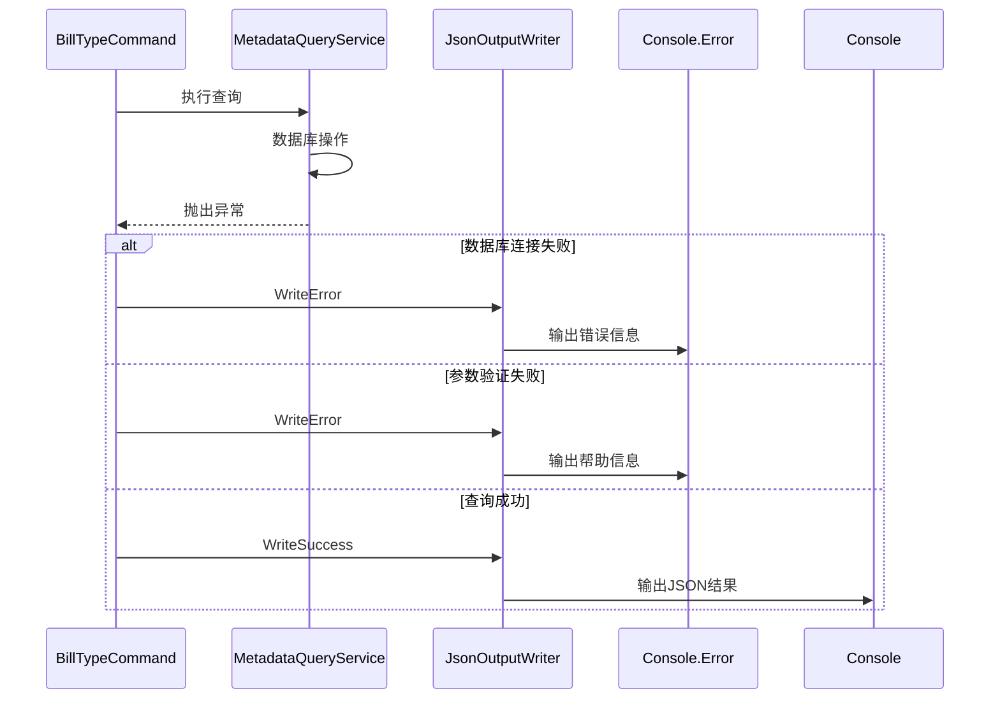

**图表来源**
- [BillTypeCommand.cs:58-62](file://K3CloudDataDictionary.Cli/Commands/BillTypeCommand.cs#L58-L62)
- [JsonOutputWriter.cs:58-70](file://K3CloudDataDictionary.Cli/Services/JsonOutputWriter.cs#L58-L70)

**章节来源**
- [BillTypeCommand.cs:58-62](file://K3CloudDataDictionary.Cli/Commands/BillTypeCommand.cs#L58-L62)
- [JsonOutputWriter.cs:58-70](file://K3CloudDataDictionary.Cli/Services/JsonOutputWriter.cs#L58-L70)

## 性能考虑

### 查询优化策略

#### SQL查询优化

1. **索引利用**：查询条件使用了适当的WHERE子句，便于数据库引擎利用索引
2. **参数化查询**：所有用户输入都通过参数绑定，防止SQL注入并提高查询计划复用率
3. **结果集限制**：对于某些查询场景，系统会限制返回结果的数量以避免内存溢出

#### 缓存机制

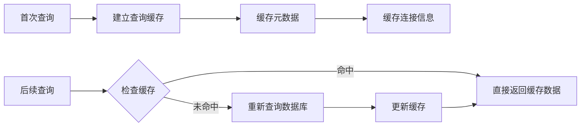

**图表来源**
- [MetadataQueryService.cs:27-37](file://K3CloudDataDictionary.Cli/Services/MetadataQueryService.cs#L27-L37)

### 内存管理

1. **流式处理**：查询结果采用流式读取，避免一次性加载大量数据到内存
2. **及时释放**：所有数据库连接和资源都在使用后及时释放
3. **对象池**：重复使用的临时对象会被回收利用

## 故障排除指南

### 常见问题及解决方案

#### 连接问题

**问题现象**：执行命令时报连接错误

**可能原因**：
1. 数据库服务器不可达
2. 认证凭据错误
3. 网络防火墙阻断

**解决步骤**：
1. 使用`k3cli connections test --id <连接ID>`测试连接
2. 检查SQL Server服务状态
3. 验证网络连通性和端口开放情况

#### 权限问题

**问题现象**：查询无结果或权限不足

**可能原因**：
1. 用户账户缺乏必要的数据库权限
2. 查询的表单不存在或已被删除

**解决步骤**：
1. 确认用户具有读取T_BAS_BILLTYPE表的权限
2. 验证表单标识符的正确性
3. 检查表单是否存在于系统中

#### 参数错误

**问题现象**：命令执行失败并显示参数错误

**可能原因**：
1. 缺少必需的参数
2. 参数格式不正确
3. 参数值超出范围

**解决步骤**：
1. 使用`k3cli billtype --help`查看帮助信息
2. 确保至少提供--form、--id或--keyword中的一个参数
3. 验证参数值的格式和内容

### 调试技巧

#### 启用详细日志

```bash
# 使用--pretty选项获得格式化的输出
k3cli billtype --form PUR_PurchaseOrder --pretty

# 在PowerShell中重定向错误输出
k3cli billtype --form PUR_PurchaseOrder 2>&1
```

#### 参数验证

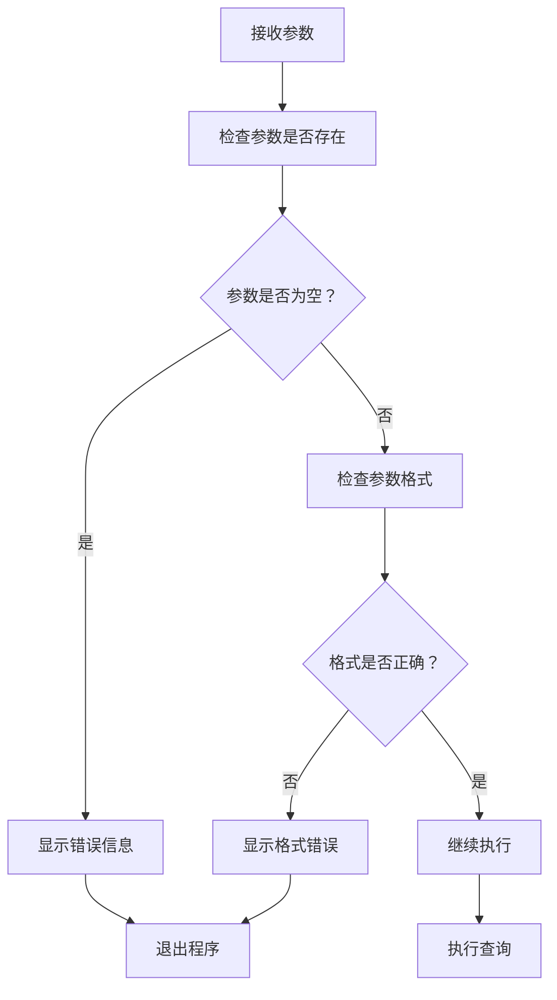

**图表来源**
- [BillTypeCommand.cs:29-34](file://K3CloudDataDictionary.Cli/Commands/BillTypeCommand.cs#L29-L34)

**章节来源**
- [BillTypeCommand.cs:29-34](file://K3CloudDataDictionary.Cli/Commands/BillTypeCommand.cs#L29-L34)
- [HelpCommand.cs:142-172](file://K3CloudDataDictionary.Cli/Commands/HelpCommand.cs#L142-L172)

## 结论

billtype命令作为K3Cloud数据字典CLI工具的重要组成部分，提供了完整的单据类型查询功能。通过精心设计的架构和严格的参数验证机制，该命令能够稳定地处理各种查询场景。

### 主要优势

1. **多模式查询**：支持按表单、按ID、按关键词三种查询模式
2. **强健的错误处理**：完善的参数验证和异常处理机制
3. **灵活的输出格式**：支持JSON格式化输出，便于程序集成
4. **高性能设计**：采用参数化查询和适当的缓存策略

### 应用场景

- **开发调试**：快速查找单据类型相关信息
- **系统维护**：批量查询和导出单据类型配置
- **业务分析**：统计分析不同表单的单据类型分布
- **集成开发**：为其他系统提供单据类型数据接口

## 附录

### 命令参考

#### 基本语法

```bash
k3cli billtype [options]
```

#### 选项说明

| 选项 | 简写 | 类型 | 必需性 | 描述 | 示例 |
|------|------|------|--------|------|------|
| --form | - | string | 可选 | 表单标识符 | --form PUR_PurchaseOrder |
| --id | - | string | 可选 | 单据类型ID | --id 83d822ca3e374b4ab01e5dd46a0062bd |
| --keyword | - | string | 可选 | 搜索关键词 | --keyword "采购" |
| --connection | -c | int | 可选 | 连接ID | --connection 1 |
| --pretty | - | flag | 可选 | 格式化JSON输出 | --pretty |

#### 返回值格式

```json
{
  "success": true,
  "command": "billtype",
  "data": [
    {
      "billTypeId": "83d822ca3e374b4ab01e5dd46a0062bd",
      "billFormId": "PUR_PurchaseOrder",
      "number": "CGDD01_SYS",
      "name": "采购订单",
      "description": "标准采购订单的单据类型"
    }
  ],
  "count": 1
}
```

#### 使用示例

**按表单查询单据类型列表**：
```bash
k3cli billtype --form PUR_PurchaseOrder --pretty
```

**按ID精确查询**：
```bash
k3cli billtype --id 83d822ca3e374b4ab01e5dd46a0062bd --pretty
```

**模糊搜索**：
```bash
k3cli billtype --keyword "采购" --pretty
```

**结合其他命令使用**：
```bash
# 先查询字段获取elementType=44的字段
k3cli fields --form PUR_PurchaseOrder --keyword "单据类型"

# 再查询具体的单据类型详情
k3cli billtype --id <billTypeId> --pretty
```

**章节来源**
- [HelpCommand.cs:142-172](file://K3CloudDataDictionary.Cli/Commands/HelpCommand.cs#L142-L172)
- [usage-examples.md:161-232](file://docs/usage-examples.md#L161-L232)