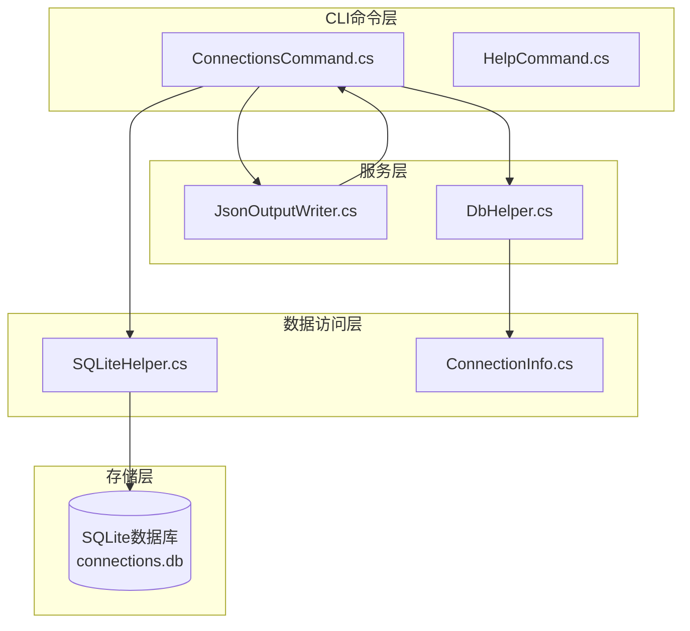
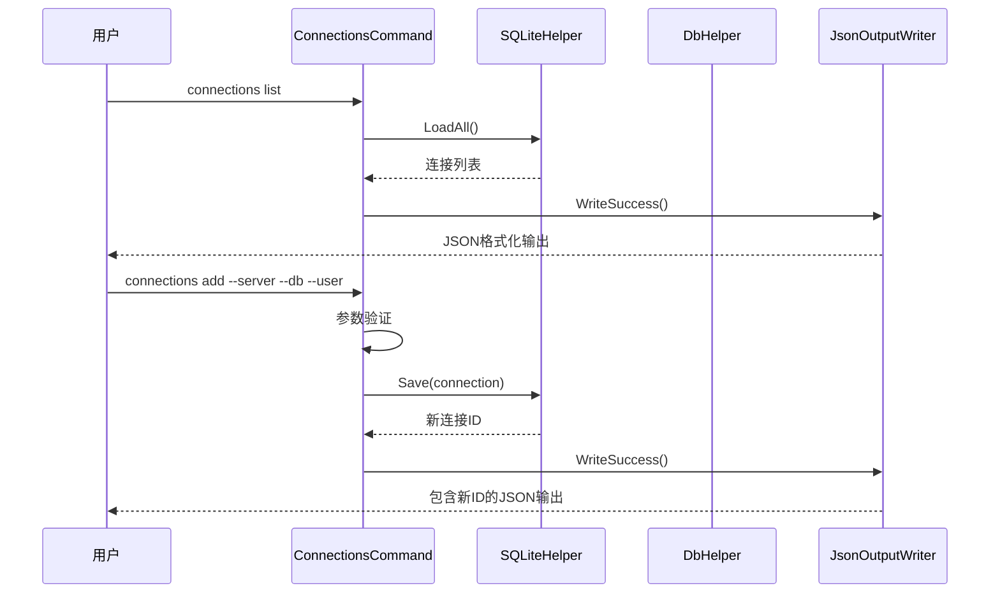
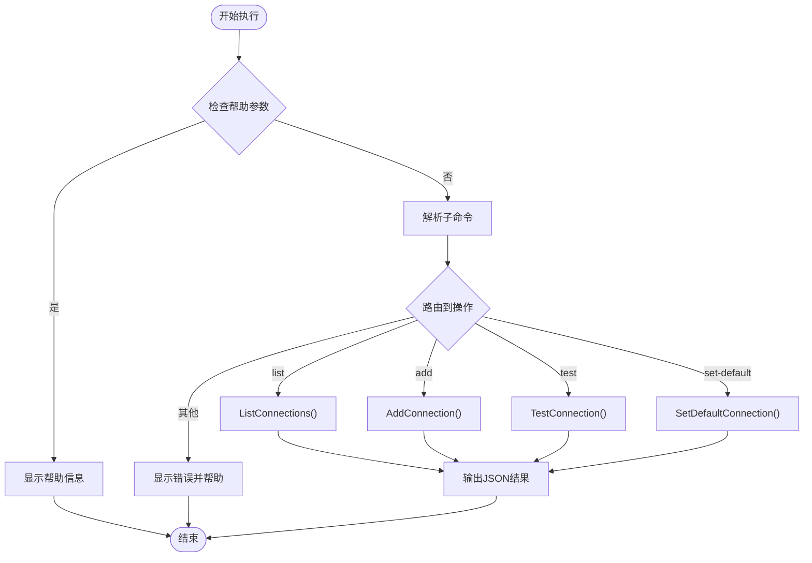
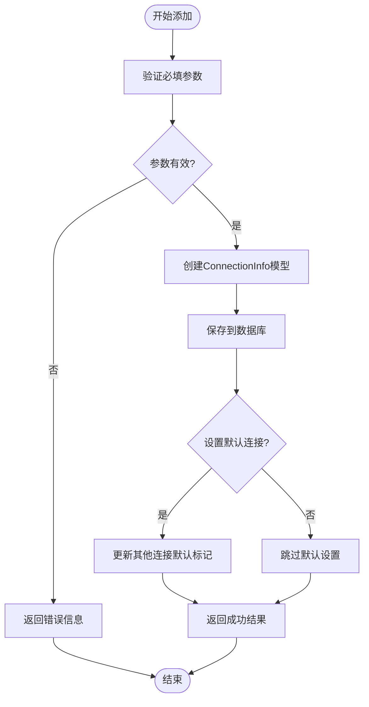
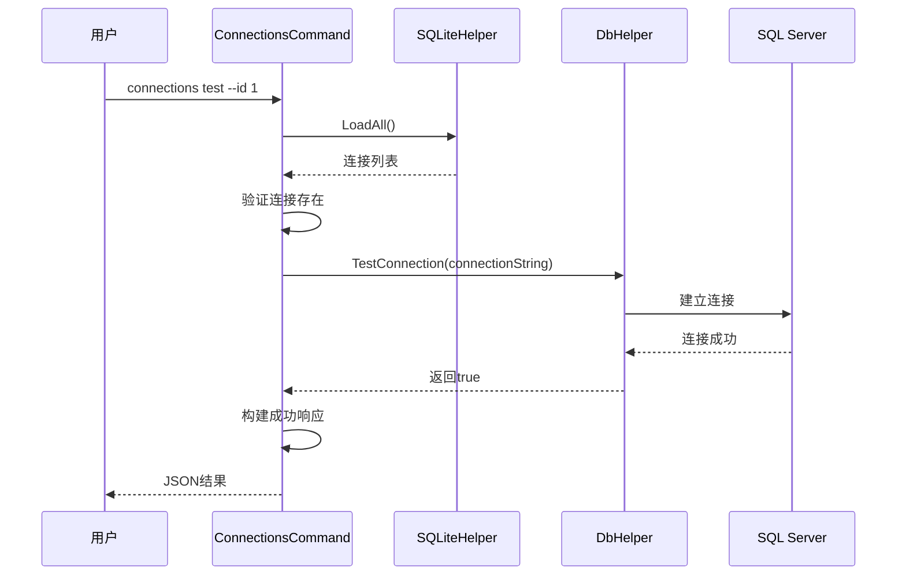
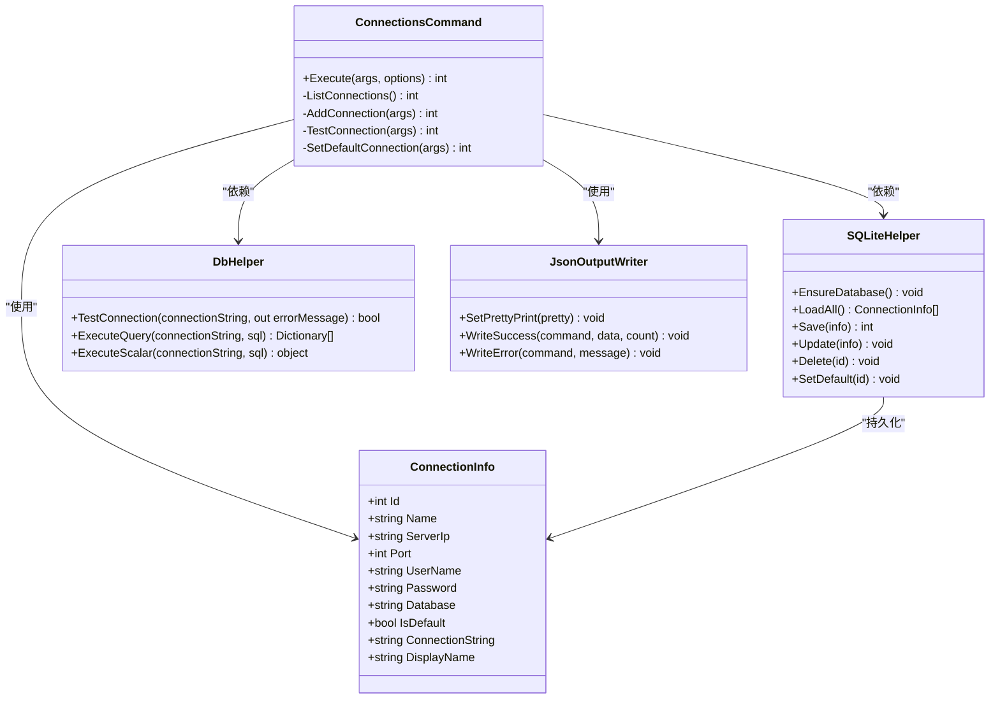
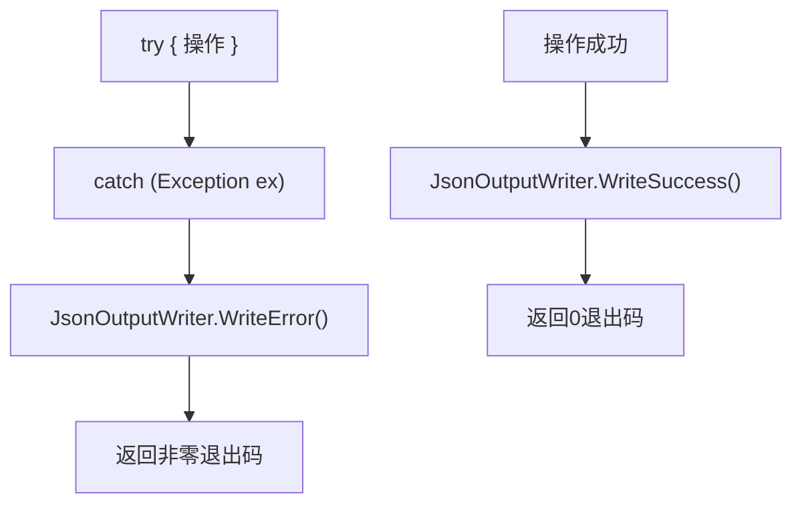

# connections命令API

<cite>
**本文档引用的文件**
- [ConnectionsCommand.cs](file://K3CloudDataDictionary.Cli/Commands/ConnectionsCommand.cs)
- [ConnectionInfo.cs](file://Models/ConnectionInfo.cs)
- [DbHelper.cs](file://Helpers/DbHelper.cs)
- [SQLiteHelper.cs](file://Helpers/SQLiteHelper.cs)
- [JsonOutputWriter.cs](file://K3CloudDataDictionary.Cli/Services/JsonOutputWriter.cs)
- [HelpCommand.cs](file://K3CloudDataDictionary.Cli/Commands/HelpCommand.cs)
- [usage-examples.md](file://docs/usage-examples.md)
</cite>

## 目录
1. [简介](#简介)
2. [项目结构](#项目结构)
3. [核心组件](#核心组件)
4. [架构概览](#架构概览)
5. [详细组件分析](#详细组件分析)
6. [依赖关系分析](#依赖关系分析)
7. [性能考虑](#性能考虑)
8. [故障排除指南](#故障排除指南)
9. [结论](#结论)
10. [附录](#附录)

## 简介
connections命令是K3Cloud数据字典CLI工具中的数据库连接管理功能，提供了完整的连接生命周期管理能力。该命令允许用户查看现有连接、添加新的数据库连接、测试连接可用性以及设置默认连接。所有连接信息都安全地存储在SQLite数据库中，并支持密码加密保护。

## 项目结构
connections命令位于CLI应用程序的命令系统中，采用分层架构设计：



**图表来源**
- [ConnectionsCommand.cs:1-231](file://K3CloudDataDictionary.Cli/Commands/ConnectionsCommand.cs#L1-L231)
- [SQLiteHelper.cs:1-370](file://Helpers/SQLiteHelper.cs#L1-L370)
- [DbHelper.cs:1-70](file://Helpers/DbHelper.cs#L1-L70)

**章节来源**
- [ConnectionsCommand.cs:1-231](file://K3CloudDataDictionary.Cli/Commands/ConnectionsCommand.cs#L1-L231)
- [HelpCommand.cs:259-284](file://K3CloudDataDictionary.Cli/Commands/HelpCommand.cs#L259-L284)

## 核心组件
connections命令的核心组件包括：

### 主要功能模块
- **ConnectionsCommand**: 主要的命令处理器，负责解析参数和路由到相应操作
- **ConnectionInfo**: 连接信息模型，定义连接属性和行为
- **SQLiteHelper**: 数据持久化层，处理连接信息的CRUD操作
- **DbHelper**: 数据库连接测试服务
- **JsonOutputWriter**: 统一的JSON输出格式化器

### 数据模型
ConnectionInfo类定义了完整的连接信息结构，包括：
- 基本连接信息：服务器地址、端口、数据库名、用户名
- 安全信息：密码（加密存储）
- 标识信息：连接ID、显示名称
- 状态信息：是否为默认连接
- 本地文件信息：本地数据库文件名

**章节来源**
- [ConnectionInfo.cs:1-144](file://Models/ConnectionInfo.cs#L1-L144)
- [ConnectionsCommand.cs:76-131](file://K3CloudDataDictionary.Cli/Commands/ConnectionsCommand.cs#L76-L131)

## 架构概览
connections命令采用命令模式和分层架构设计，确保了良好的可维护性和扩展性：



**图表来源**
- [ConnectionsCommand.cs:45-74](file://K3CloudDataDictionary.Cli/Commands/ConnectionsCommand.cs#L45-L74)
- [ConnectionsCommand.cs:76-131](file://K3CloudDataDictionary.Cli/Commands/ConnectionsCommand.cs#L76-L131)
- [SQLiteHelper.cs:114-138](file://Helpers/SQLiteHelper.cs#L114-L138)

## 详细组件分析

### ConnectionsCommand主类
ConnectionsCommand是connections命令的核心处理器，实现了完整的命令路由机制：

#### 命令执行流程


**图表来源**
- [ConnectionsCommand.cs:15-43](file://K3CloudDataDictionary.Cli/Commands/ConnectionsCommand.cs#L15-L43)

#### 参数解析机制
命令支持多种参数组合，采用灵活的参数解析策略：

| 参数类型 | 语法格式 | 必填性 | 描述 |
|---------|---------|--------|------|
| 子命令 | `list \| add \| test \| set-default` | 是 | 指定具体操作类型 |
| 服务器 | `--server <ip>` | add操作必需 | SQL Server地址 |
| 端口 | `--port <port>` | 可选，默认1433 | 数据库端口号 |
| 数据库 | `--db <database>` | add操作必需 | 目标数据库名 |
| 用户名 | `--user <username>` | add操作必需 | 数据库用户名 |
| 密码 | `--password <password>` | 可选 | 数据库密码 |
| 连接名 | `--name <name>` | 可选 | 连接显示名称 |
| 默认标记 | `--default` | 可选 | 设为默认连接 |
| 连接ID | `--id <id>` | test/set-default必需 | 连接标识符 |

**章节来源**
- [ConnectionsCommand.cs:25-42](file://K3CloudDataDictionary.Cli/Commands/ConnectionsCommand.cs#L25-L42)
- [HelpCommand.cs:269-276](file://K3CloudDataDictionary.Cli/Commands/HelpCommand.cs#L269-L276)

### 连接管理操作详解

#### 1. 连接列表操作 (list)
list操作提供完整的连接信息查询功能：

**输出格式规范**：
```json
{
  "success": true,
  "command": "connections",
  "data": [
    {
      "id": 1,
      "name": "AISC001",
      "server": "192.168.1.100,1433",
      "database": "AISC001",
      "user": "sa",
      "isDefault": true,
      "displayName": "AISC001 (AISC001)"
    }
  ],
  "count": 1
}
```

**数据字段说明**：
- `id`: 连接唯一标识符
- `name`: 连接名称（优先使用用户设置）
- `server`: 服务器地址和端口组合
- `database`: 数据库名称
- `user`: 用户名
- `isDefault`: 是否为默认连接
- `displayName`: 显示名称（智能生成）

**章节来源**
- [ConnectionsCommand.cs:45-74](file://K3CloudDataDictionary.Cli/Commands/ConnectionsCommand.cs#L45-L74)

#### 2. 添加连接操作 (add)
add操作支持完整的连接配置和验证：

**参数验证规则**：
- 必填参数：`--server`、`--db`、`--user`
- 端口默认值：1433（未指定时自动填充）
- 连接名默认值：使用数据库名
- 密码处理：支持空密码但会进行安全存储

**添加流程**：


**图表来源**
- [ConnectionsCommand.cs:76-131](file://K3CloudDataDictionary.Cli/Commands/ConnectionsCommand.cs#L76-L131)

**成功响应格式**：
```json
{
  "success": true,
  "command": "connections",
  "data": {
    "id": 2,
    "name": "测试连接",
    "server": "192.168.1.100,1433",
    "database": "TEST_DB",
    "user": "test_user",
    "isDefault": false,
    "message": "连接已保存"
  },
  "count": 1
}
```

**章节来源**
- [ConnectionsCommand.cs:112-124](file://K3CloudDataDictionary.Cli/Commands/ConnectionsCommand.cs#L112-L124)

#### 3. 连接测试操作 (test)
test操作提供实时的数据库连通性验证：

**测试流程**：


**图表来源**
- [ConnectionsCommand.cs:173-228](file://K3CloudDataDictionary.Cli/Commands/ConnectionsCommand.cs#L173-L228)

**测试结果格式**：
成功时：
```json
{
  "success": true,
  "command": "connections",
  "data": {
    "connectionId": 1,
    "name": "AISC001",
    "server": "192.168.1.100,1433",
    "database": "AISC001",
    "success": true,
    "message": "连接成功"
  },
  "count": 1
}
```

失败时：
```json
{
  "success": true,
  "command": "connections",
  "data": {
    "connectionId": 1,
    "name": "AISC001",
    "server": "192.168.1.100,1433",
    "database": "AISC001",
    "success": false,
    "message": "连接超时或认证失败"
  },
  "count": 1
}
```

**章节来源**
- [ConnectionsCommand.cs:194-221](file://K3CloudDataDictionary.Cli/Commands/ConnectionsCommand.cs#L194-L221)

#### 4. 设置默认连接操作 (set-default)
set-default操作管理连接的默认状态：

**业务规则**：
- 自动清理其他连接的默认标记
- 确保只有一个默认连接
- 提供清晰的成功反馈

**响应格式**：
```json
{
  "success": true,
  "command": "connections",
  "data": {
    "id": 1,
    "name": "AISC001",
    "database": "AISC001",
    "isDefault": true,
    "message": "已设为默认连接"
  },
  "count": 1
}
```

**章节来源**
- [ConnectionsCommand.cs:133-171](file://K3CloudDataDictionary.Cli/Commands/ConnectionsCommand.cs#L133-L171)

### 数据持久化层
SQLiteHelper提供完整的数据访问功能，采用安全的密码加密存储：

#### 数据库结构
```sql
CREATE TABLE IF NOT EXISTS Connections (
    Id INTEGER PRIMARY KEY AUTOINCREMENT,
    Name TEXT NOT NULL,
    ServerIp TEXT NOT NULL,
    Port INTEGER NOT NULL DEFAULT 1433,
    UserName TEXT NOT NULL,
    Password TEXT NOT NULL,
    Database TEXT NOT NULL,
    IsDefault INTEGER NOT NULL DEFAULT 0,
    LocalDbFileName TEXT
);
```

#### 安全特性
- 密码使用PasswordHelper进行加密存储
- 支持密码解密读取
- 数据库文件权限控制

**章节来源**
- [SQLiteHelper.cs:28-53](file://Helpers/SQLiteHelper.cs#L28-L53)
- [SQLiteHelper.cs:74](file://Helpers/SQLiteHelper.cs#L74)

## 依赖关系分析

### 组件依赖图


**图表来源**
- [ConnectionsCommand.cs:13-43](file://K3CloudDataDictionary.Cli/Commands/ConnectionsCommand.cs#L13-L43)
- [ConnectionInfo.cs:6-142](file://Models/ConnectionInfo.cs#L6-L142)
- [SQLiteHelper.cs:10-53](file://Helpers/SQLiteHelper.cs#L10-L53)
- [DbHelper.cs:7-25](file://Helpers/DbHelper.cs#L7-L25)
- [JsonOutputWriter.cs:11-37](file://K3CloudDataDictionary.Cli/Services/JsonOutputWriter.cs#L11-L37)

### 错误处理机制
commands命令采用统一的错误处理策略：



**图表来源**
- [ConnectionsCommand.cs:69-73](file://K3CloudDataDictionary.Cli/Commands/ConnectionsCommand.cs#L69-L73)
- [ConnectionsCommand.cs:126-130](file://K3CloudDataDictionary.Cli/Commands/ConnectionsCommand.cs#L126-L130)

**章节来源**
- [ConnectionsCommand.cs:69-228](file://K3CloudDataDictionary.Cli/Commands/ConnectionsCommand.cs#L69-L228)
- [JsonOutputWriter.cs:58-70](file://K3CloudDataDictionary.Cli/Services/JsonOutputWriter.cs#L58-L70)

## 性能考虑
connections命令在设计时充分考虑了性能和用户体验：

### 连接池优化
- 使用SqlConnection的短生命周期模式
- 自动资源释放和异常处理
- 最小化的数据库连接时间

### 输出格式优化
- 支持紧凑和格式化两种输出模式
- 条件格式化减少不必要的字符处理
- 流式输出避免大对象内存占用

### 缓存策略
- 连接信息在内存中缓存
- 频繁操作的数据库查询结果缓存
- 避免重复的数据库访问

## 故障排除指南

### 常见问题及解决方案

#### 1. 连接参数错误
**症状**：添加连接时报错"缺少必填参数"
**原因**：未提供--server、--db、--user参数
**解决**：确保提供所有必需参数

#### 2. 数据库连接失败
**症状**：test操作返回连接失败
**可能原因**：
- 网络连接问题
- 认证凭据错误
- 数据库服务不可用
- 防火墙阻断

**诊断步骤**：
1. 验证服务器地址和端口
2. 测试基本网络连通性
3. 验证用户名和密码
4. 检查SQL Server服务状态

#### 3. 数据库文件权限问题
**症状**：无法创建或访问connections.db
**原因**：应用程序目录权限不足
**解决**：确保应用程序对data目录有读写权限

#### 4. 密码解密失败
**症状**：连接信息加载异常
**原因**：密码加密算法版本不兼容
**解决**：重新添加连接以获得正确的加密格式

**章节来源**
- [ConnectionsCommand.cs:86-90](file://K3CloudDataDictionary.Cli/Commands/ConnectionsCommand.cs#L86-L90)
- [ConnectionsCommand.cs:186-189](file://K3CloudDataDictionary.Cli/Commands/ConnectionsCommand.cs#L186-L189)

## 结论
connections命令提供了完整、安全、易用的数据库连接管理功能。通过清晰的命令结构、完善的错误处理机制和安全的数据存储方案，为用户提供了一个可靠的连接管理解决方案。建议用户遵循最佳实践，在生产环境中特别注意密码管理和网络安全配置。

## 附录

### 命令行调用示例

#### 基本操作示例
```bash
# 查看所有连接
k3cli connections list

# 添加新连接
k3cli connections add --server 192.168.1.100 --db AISC001 --user sa --password xxx --default

# 测试连接可用性
k3cli connections test --id 1

# 设置默认连接
k3cli connections set-default --id 1
```

#### 高级操作示例
```bash
# 添加连接但不设为默认
k3cli connections add --server 10.0.0.1 --db TEST_DB --user test_user --password secret

# 查看帮助信息
k3cli connections --help
```

### 最佳实践建议

#### 安全最佳实践
1. **密码管理**：使用强密码，定期轮换
2. **最小权限原则**：为每个连接使用最小必要权限
3. **网络隔离**：在受信任的网络环境中访问数据库
4. **审计日志**：启用数据库连接审计

#### 性能优化建议
1. **连接复用**：合理管理连接生命周期
2. **批量操作**：避免频繁的连接建立和销毁
3. **索引优化**：确保连接信息查询的索引效率

#### 维护建议
1. **定期备份**：定期备份connections.db文件
2. **监控告警**：设置连接可用性监控
3. **版本升级**：关注软件版本更新和安全补丁

**章节来源**
- [usage-examples.md:527](file://docs/usage-examples.md#L527)