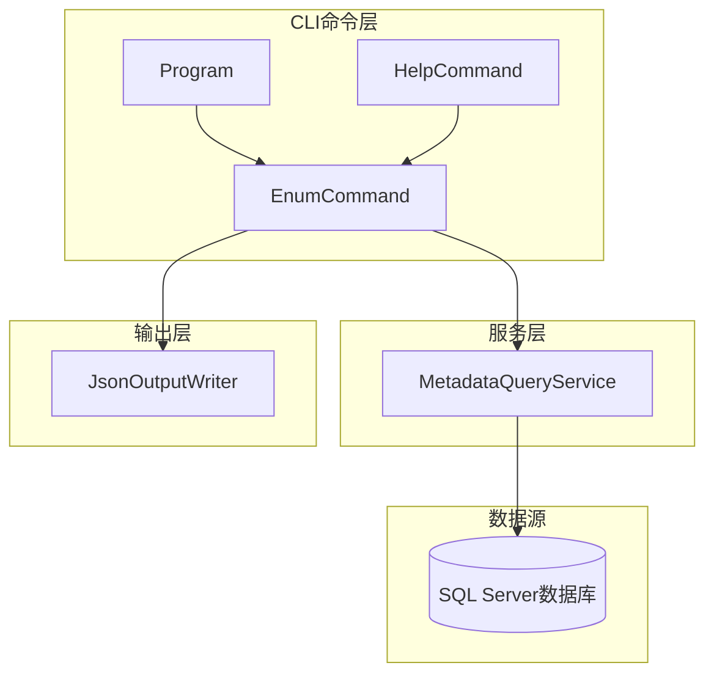
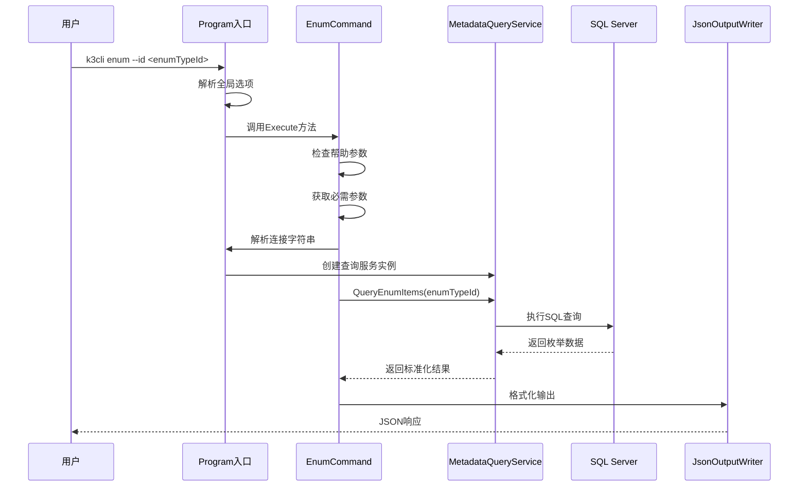
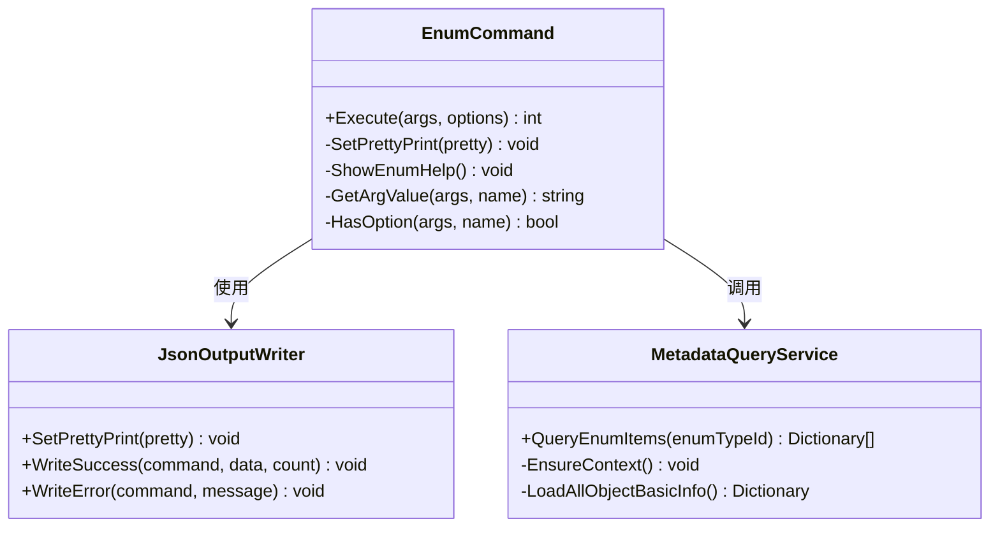
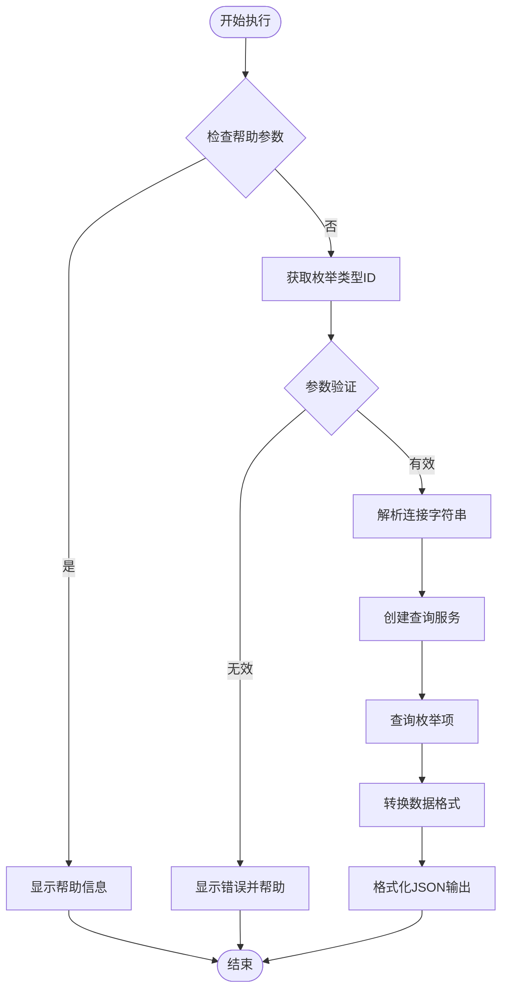
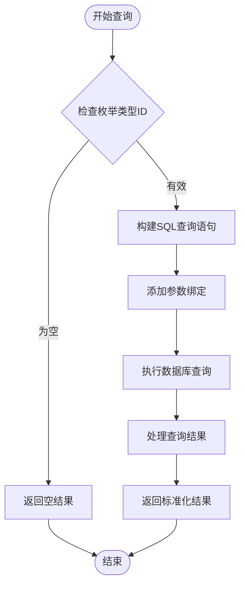
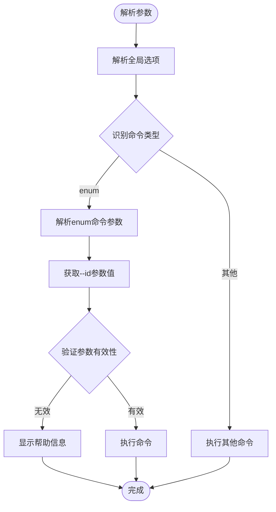
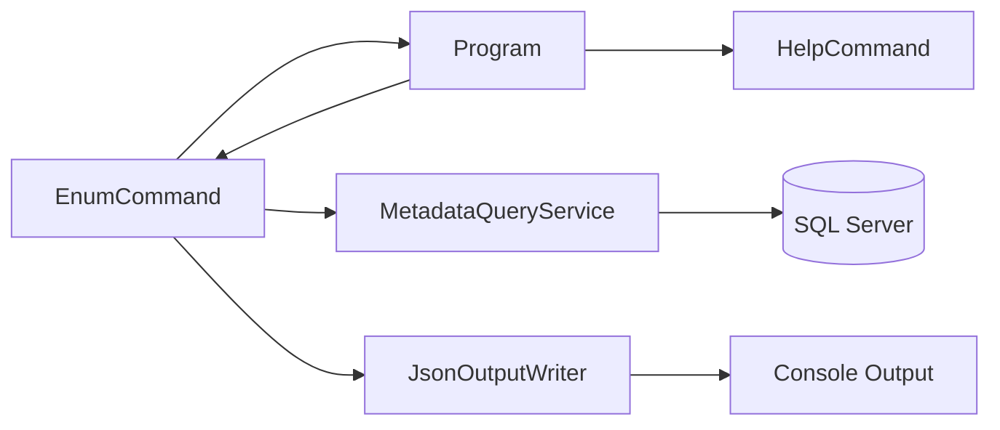

# enum命令API

<cite>
**本文档引用的文件**
- [EnumCommand.cs](file://K3CloudDataDictionary.Cli/Commands/EnumCommand.cs)
- [MetadataQueryService.cs](file://K3CloudDataDictionary.Cli/Services/MetadataQueryService.cs)
- [Program.cs](file://K3CloudDataDictionary.Cli/Program.cs)
- [HelpCommand.cs](file://K3CloudDataDictionary.Cli/Commands/HelpCommand.cs)
- [JsonOutputWriter.cs](file://K3CloudDataDictionary.Cli/Services/JsonOutputWriter.cs)
- [usage-examples.md](file://docs/usage-examples.md)
</cite>

## 目录
1. [简介](#简介)
2. [项目结构](#项目结构)
3. [核心组件](#核心组件)
4. [架构概览](#架构概览)
5. [详细组件分析](#详细组件分析)
6. [依赖关系分析](#依赖关系分析)
7. [性能考虑](#性能考虑)
8. [故障排除指南](#故障排除指南)
9. [结论](#结论)
10. [附录](#附录)

## 简介
enum命令是K3Cloud数据字典CLI工具中的核心功能之一，专门用于查询下拉列表枚举值。该命令基于K3Cloud系统的元数据架构，能够从数据库中实时查询枚举类型及其对应的选项值，为开发者和业务用户提供准确的枚举信息。

该命令主要服务于elementType=9的下拉列表字段，通过枚举类型ID（enumType）查询对应的枚举项列表。每个枚举项包含唯一标识、显示名称、数值值、枚举项ID和多语言标题等关键信息。

## 项目结构
K3Cloud数据字典CLI工具采用模块化设计，enum命令位于命令层，通过服务层与数据库交互，通过输出层格式化结果。



**图表来源**
- [EnumCommand.cs:1-64](file://K3CloudDataDictionary.Cli/Commands/EnumCommand.cs#L1-L64)
- [Program.cs:1-166](file://K3CloudDataDictionary.Cli/Program.cs#L1-L166)
- [MetadataQueryService.cs:1-839](file://K3CloudDataDictionary.Cli/Services/MetadataQueryService.cs#L1-L839)

**章节来源**
- [EnumCommand.cs:1-64](file://K3CloudDataDictionary.Cli/Commands/EnumCommand.cs#L1-L64)
- [Program.cs:1-166](file://K3CloudDataDictionary.Cli/Program.cs#L1-L166)

## 核心组件
enum命令的核心组件包括命令执行器、元数据查询服务、参数解析器和JSON输出格式化器。

### 命令执行器
EnumCommand类负责处理enum命令的完整生命周期，包括参数验证、数据库查询和结果格式化。

### 元数据查询服务
MetadataQueryService提供与数据库的直接连接，执行SQL查询并返回标准化的数据结构。

### 参数解析器
Program类中的参数解析逻辑支持多种参数格式，包括长格式(--id)和短格式(-i)。

### JSON输出格式化器
JsonOutputWriter统一处理所有命令的输出格式，确保一致的JSON响应结构。

**章节来源**
- [EnumCommand.cs:11-62](file://K3CloudDataDictionary.Cli/Commands/EnumCommand.cs#L11-L62)
- [MetadataQueryService.cs:681-727](file://K3CloudDataDictionary.Cli/Services/MetadataQueryService.cs#L681-L727)
- [Program.cs:102-151](file://K3CloudDataDictionary.Cli/Program.cs#L102-L151)
- [JsonOutputWriter.cs:11-91](file://K3CloudDataDictionary.Cli/Services/JsonOutputWriter.cs#L11-L91)

## 架构概览
enum命令的执行流程遵循典型的CLI应用架构，从命令解析到数据库查询再到结果输出。



**图表来源**
- [Program.cs:47-48](file://K3CloudDataDictionary.Cli/Program.cs#L47-L48)
- [EnumCommand.cs:13-61](file://K3CloudDataDictionary.Cli/Commands/EnumCommand.cs#L13-L61)
- [MetadataQueryService.cs:685-727](file://K3CloudDataDictionary.Cli/Services/MetadataQueryService.cs#L685-L727)

## 详细组件分析

### EnumCommand组件分析
EnumCommand是enum命令的核心实现，负责处理用户输入、执行业务逻辑和格式化输出。

#### 类结构图


**图表来源**
- [EnumCommand.cs:11-62](file://K3CloudDataDictionary.Cli/Commands/EnumCommand.cs#L11-L62)
- [JsonOutputWriter.cs:11-91](file://K3CloudDataDictionary.Cli/Services/JsonOutputWriter.cs#L11-L91)
- [MetadataQueryService.cs:12-22](file://K3CloudDataDictionary.Cli/Services/MetadataQueryService.cs#L12-L22)

#### 执行流程图


**图表来源**
- [EnumCommand.cs:13-61](file://K3CloudDataDictionary.Cli/Commands/EnumCommand.cs#L13-L61)

#### 参数验证规则
- 必需参数：--id <enumTypeId>
- 支持的选项：--connection/-c <id>, --pretty
- 参数格式：支持--id和-id两种形式

#### 返回值格式
enum命令返回标准化的JSON格式，包含成功标志、命令名称、数据数组和计数信息。

**章节来源**
- [EnumCommand.cs:13-61](file://K3CloudDataDictionary.Cli/Commands/EnumCommand.cs#L13-L61)
- [JsonOutputWriter.cs:26-53](file://K3CloudDataDictionary.Cli/Services/JsonOutputWriter.cs#L26-L53)

### MetadataQueryService组件分析
MetadataQueryService提供与数据库的直接连接，执行具体的SQL查询逻辑。

#### 查询逻辑分析


**图表来源**
- [MetadataQueryService.cs:685-727](file://K3CloudDataDictionary.Cli/Services/MetadataQueryService.cs#L685-L727)

#### 数据库查询结构
查询语句涉及多个表的联接，包括枚举主表、本地化表、枚举项表和枚举项本地化表。

**章节来源**
- [MetadataQueryService.cs:685-727](file://K3CloudDataDictionary.Cli/Services/MetadataQueryService.cs#L685-L727)

### 参数解析器组件分析
Program类提供统一的参数解析功能，支持多种参数格式和选项组合。

#### 参数解析流程


**图表来源**
- [Program.cs:74-97](file://K3CloudDataDictionary.Cli/Program.cs#L74-L97)
- [Program.cs:102-124](file://K3CloudDataDictionary.Cli/Program.cs#L102-L124)

**章节来源**
- [Program.cs:74-124](file://K3CloudDataDictionary.Cli/Program.cs#L74-L124)

## 依赖关系分析
enum命令的依赖关系相对简单，主要依赖于程序入口、查询服务和输出格式化器。



**图表来源**
- [EnumCommand.cs:3-4](file://K3CloudDataDictionary.Cli/Commands/EnumCommand.cs#L3-L4)
- [Program.cs:3-6](file://K3CloudDataDictionary.Cli/Program.cs#L3-L6)

### 组件耦合度分析
- EnumCommand与Program的耦合度较低，仅通过静态方法调用
- EnumCommand与MetadataQueryService的耦合度适中，通过构造函数注入
- EnumCommand与JsonOutputWriter的耦合度较低，通过静态方法调用

### 外部依赖
- SQL Server数据库连接
- Newtonsoft.Json库用于JSON序列化
- SQLite数据库用于连接配置存储

**章节来源**
- [EnumCommand.cs:3-4](file://K3CloudDataDictionary.Cli/Commands/EnumCommand.cs#L3-L4)
- [Program.cs:1-6](file://K3CloudDataDictionary.Cli/Program.cs#L1-L6)

## 性能考虑
enum命令的性能主要受数据库查询性能影响，以下是关键的性能优化建议：

### 数据库查询优化
- 使用索引优化：确保枚举类型ID和本地化语言ID字段有适当的索引
- 查询缓存：可以考虑在MetadataQueryService中实现简单的查询结果缓存
- 连接池管理：合理配置SQL Server连接池参数

### 内存使用优化
- 结果集处理：对于大量枚举项的情况，考虑分页查询
- 对象生命周期：及时释放数据库连接和命令对象

### 并发处理
- 线程安全：确保MetadataQueryService实例在多线程环境下的安全性
- 懒加载：利用EnsureContext的懒加载机制减少不必要的初始化

## 故障排除指南
### 常见错误及解决方案

#### 连接配置问题
**症状**：执行命令时报连接错误
**原因**：未配置数据库连接或连接信息不正确
**解决方案**：
1. 使用`k3cli connections add`命令添加数据库连接
2. 使用`k3cli connections list`确认连接配置
3. 使用`--connection <id>`参数指定特定连接

#### 参数验证失败
**症状**：显示"缺少必填参数 --id <enumTypeId>"
**原因**：未提供枚举类型ID参数
**解决方案**：
1. 确保提供--id参数
2. 检查枚举类型ID的有效性
3. 使用`k3cli fields`命令获取有效的enumType值

#### 数据库查询异常
**症状**：执行过程中出现数据库访问异常
**原因**：数据库连接中断或权限不足
**解决方案**：
1. 检查数据库服务器连通性
2. 验证数据库用户权限
3. 确认SQL Server实例正常运行

**章节来源**
- [EnumCommand.cs:26-31](file://K3CloudDataDictionary.Cli/Commands/EnumCommand.cs#L26-L31)
- [Program.cs:129-151](file://K3CloudDataDictionary.Cli/Program.cs#L129-L151)

## 结论
enum命令作为K3Cloud数据字典CLI工具的重要组成部分，提供了高效、可靠的枚举值查询功能。该命令设计简洁明了，参数验证严格，输出格式标准化，能够满足开发和业务场景的各种需求。

通过合理的架构设计和性能优化，enum命令能够在大型K3Cloud系统中稳定运行，为用户提供准确的枚举信息。建议在实际使用中结合其他相关命令（如fields、resolve等）形成完整的数据字典查询工作流。

## 附录

### 命令行调用示例
以下是一些完整的命令行调用示例：

#### 基本查询示例
```bash
# 基本的枚举值查询
k3cli enum --id PUR_PurchaseOrder_Status

# 格式化输出
k3cli enum --id PUR_PurchaseOrder_Status --pretty

# 指定数据库连接
k3cli enum --id PUR_PurchaseOrder_Status --connection 1
```

#### 高级查询示例
```bash
# 结合其他命令获取枚举类型ID
k3cli fields --form PUR_PurchaseOrder --keyword "状态"
# 然后使用获取到的enumType值查询枚举项
k3cli enum --id <获取到的enumType值>
```

### 返回值格式详解
enum命令的标准JSON响应格式如下：

```json
{
  "success": true,
  "command": "enum",
  "data": [
    {
      "id": "枚举类型ID",
      "name": "枚举名称",
      "value": "0",
      "enumId": "枚举项ID",
      "caption": "显示名称"
    }
  ],
  "count": 2
}
```

### 最佳实践建议
1. **参数验证**：始终验证枚举类型ID的有效性
2. **连接管理**：合理管理数据库连接，避免连接泄漏
3. **错误处理**：妥善处理数据库连接异常和查询异常
4. **性能优化**：对于频繁查询的场景，考虑实现查询缓存
5. **日志记录**：在生产环境中添加适当的日志记录

**章节来源**
- [usage-examples.md:278-326](file://docs/usage-examples.md#L278-L326)
- [HelpCommand.cs:219-236](file://K3CloudDataDictionary.Cli/Commands/HelpCommand.cs#L219-L236)