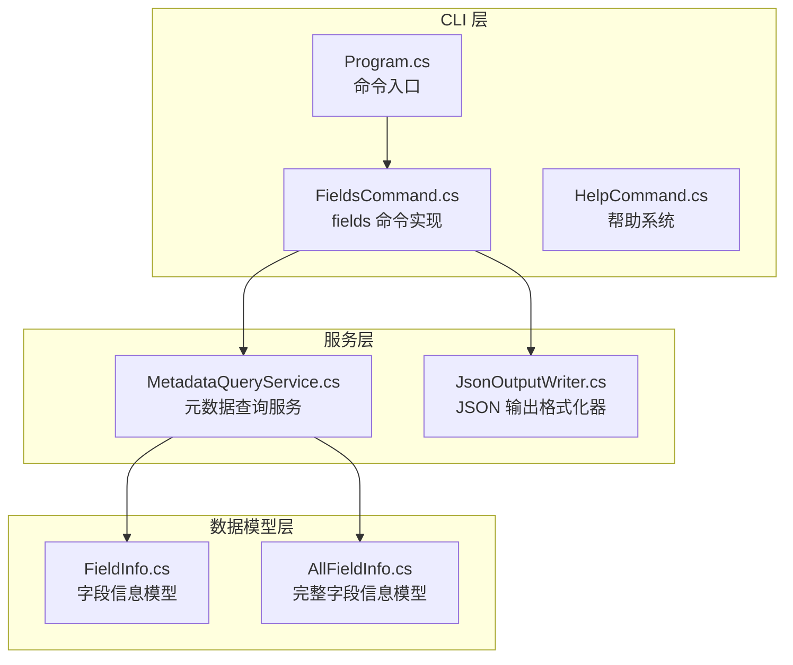
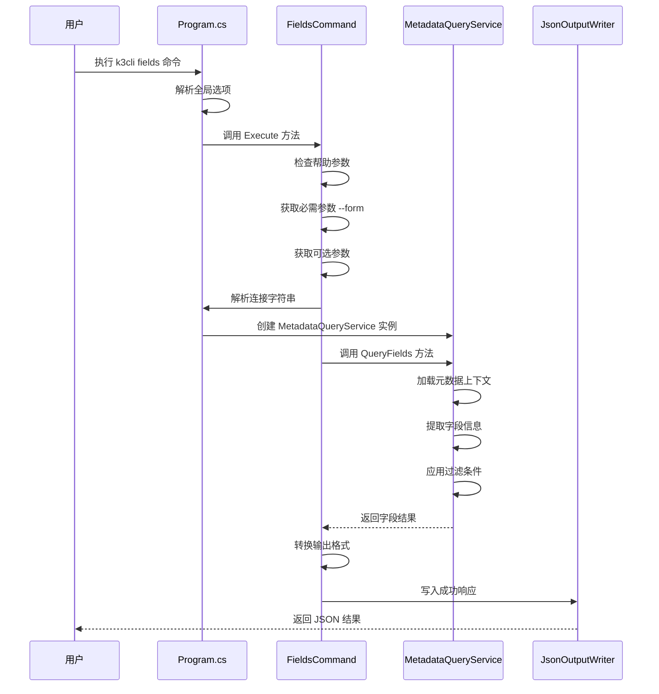
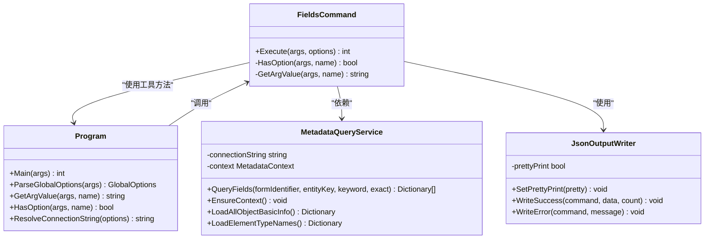
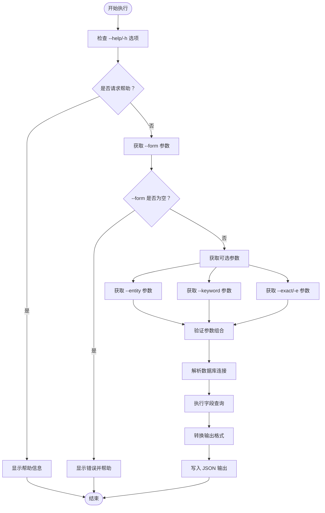
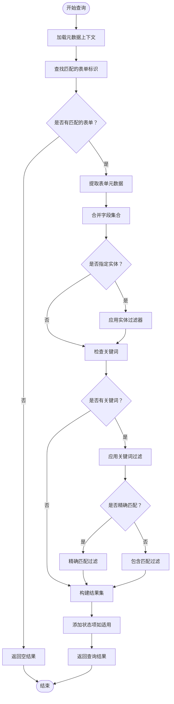
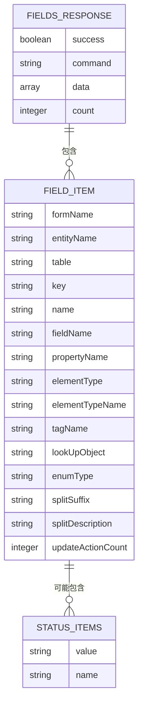
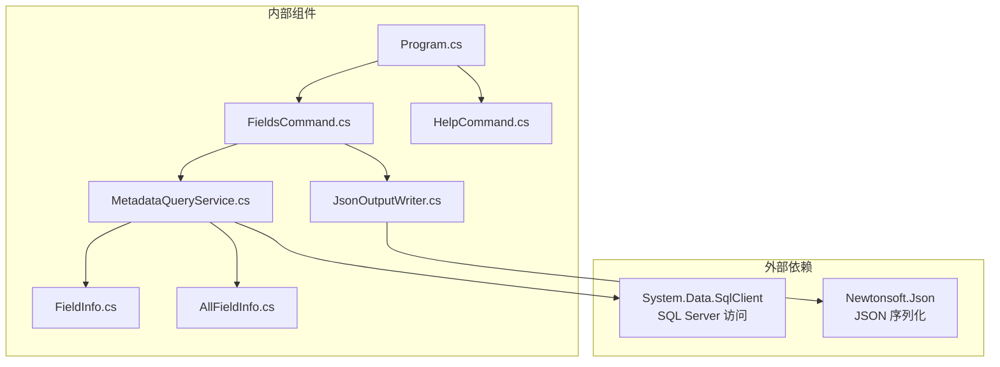

# fields命令API

<cite>
**本文档引用的文件**
- [FieldsCommand.cs](file://K3CloudDataDictionary.Cli/Commands/FieldsCommand.cs)
- [MetadataQueryService.cs](file://K3CloudDataDictionary.Cli/Services/MetadataQueryService.cs)
- [HelpCommand.cs](file://K3CloudDataDictionary.Cli/Commands/HelpCommand.cs)
- [Program.cs](file://K3CloudDataDictionary.Cli/Program.cs)
- [JsonOutputWriter.cs](file://K3CloudDataDictionary.Cli/Services/JsonOutputWriter.cs)
- [usage-examples.md](file://docs/usage-examples.md)
- [FieldInfo.cs](file://Models/FieldInfo.cs)
- [AllFieldInfo.cs](file://Models/AllFieldInfo.cs)
</cite>

## 目录
1. [简介](#简介)
2. [项目结构](#项目结构)
3. [核心组件](#核心组件)
4. [架构概览](#架构概览)
5. [详细组件分析](#详细组件分析)
6. [依赖关系分析](#依赖关系分析)
7. [性能考虑](#性能考虑)
8. [故障排除指南](#故障排除指南)
9. [结论](#结论)
10. [附录](#附录)

## 简介

`fields` 命令是 K3Cloud 数据字典 CLI 工具的核心功能之一，用于查询和检索 K3 Cloud 系统中的表单字段信息。该命令提供了强大的字段搜索能力，支持按表单标识、实体键、关键词等多种条件进行精确和模糊匹配查询。

该命令特别适用于：
- 开发人员查找特定业务表单的字段结构
- 系统管理员了解系统中可用的字段信息
- 数据分析师探索业务数据模型
- 技术支持人员诊断字段相关问题

## 项目结构

`fields` 命令的实现采用分层架构设计，主要涉及以下组件：



**图表来源**
- [Program.cs:14-69](file://K3CloudDataDictionary.Cli/Program.cs#L14-L69)
- [FieldsCommand.cs:11-86](file://K3CloudDataDictionary.Cli/Commands/FieldsCommand.cs#L11-L86)
- [MetadataQueryService.cs:12-388](file://K3CloudDataDictionary.Cli/Services/MetadataQueryService.cs#L12-L388)

**章节来源**
- [Program.cs:1-166](file://K3CloudDataDictionary.Cli/Program.cs#L1-L166)
- [FieldsCommand.cs:1-88](file://K3CloudDataDictionary.Cli/Commands/FieldsCommand.cs#L1-L88)

## 核心组件

### 命令语法格式

`fields` 命令遵循标准的 CLI 语法格式：

```
k3cli fields [options]
```

### 必需参数

- `--form <identifier>`：表单标识（必填）
  - 类型：字符串
  - 描述：指定要查询的表单标识符，如 `PUR_PurchaseOrder`
  - 示例：`--form PUR_PurchaseOrder`

### 可选参数

- `--entity <key>`：实体 Key（可选）
  - 类型：字符串
  - 描述：指定查询的实体键，如 `FK_BillEntry`
  - 示例：`--entity FK_BillEntry`

- `--keyword <keyword>`：字段搜索关键词（可选）
  - 类型：字符串
  - 描述：用于在字段名称、键、属性名中进行搜索
  - 示例：`--keyword "物料"`

- `--exact, -e`：精确匹配模式（可选）
  - 类型：布尔值
  - 描述：启用精确匹配模式，要求字段完全等于关键词
  - 默认：模糊匹配（包含关键词）
  - 示例：`--exact` 或 `-e`

### 全局选项

- `--connection, -c <id>`：指定连接 ID（可选）
- `--pretty`：格式化 JSON 输出（可选）

**章节来源**
- [HelpCommand.cs:74-102](file://K3CloudDataDictionary.Cli/Commands/HelpCommand.cs#L74-L102)
- [FieldsCommand.cs:24-36](file://K3CloudDataDictionary.Cli/Commands/FieldsCommand.cs#L24-L36)

## 架构概览

`fields` 命令的执行流程采用典型的三层架构：



**图表来源**
- [Program.cs:33-62](file://K3CloudDataDictionary.Cli/Program.cs#L33-L62)
- [FieldsCommand.cs:13-85](file://K3CloudDataDictionary.Cli/Commands/FieldsCommand.cs#L13-L85)
- [MetadataQueryService.cs:286-388](file://K3CloudDataDictionary.Cli/Services/MetadataQueryService.cs#L286-L388)

## 详细组件分析

### FieldsCommand 类分析

`FieldsCommand` 是 `fields` 命令的主要实现类，负责处理命令行参数和协调各个服务组件。



**图表来源**
- [FieldsCommand.cs:11-86](file://K3CloudDataDictionary.Cli/Commands/FieldsCommand.cs#L11-L86)
- [Program.cs:12-151](file://K3CloudDataDictionary.Cli/Program.cs#L12-L151)
- [MetadataQueryService.cs:12-388](file://K3CloudDataDictionary.Cli/Services/MetadataQueryService.cs#L12-L388)
- [JsonOutputWriter.cs:11-91](file://K3CloudDataDictionary.Cli/Services/JsonOutputWriter.cs#L11-L91)

### 参数验证规则

`fields` 命令实现了严格的参数验证机制：



**图表来源**
- [FieldsCommand.cs:18-31](file://K3CloudDataDictionary.Cli/Commands/FieldsCommand.cs#L18-L31)
- [FieldsCommand.cs:24-36](file://K3CloudDataDictionary.Cli/Commands/FieldsCommand.cs#L24-L36)
- [Program.cs:102-124](file://K3CloudDataDictionary.Cli/Program.cs#L102-L124)

### 查询逻辑

`MetadataQueryService` 的 `QueryFields` 方法实现了复杂的查询逻辑：



**图表来源**
- [MetadataQueryService.cs:286-388](file://K3CloudDataDictionary.Cli/Services/MetadataQueryService.cs#L286-L388)
- [MetadataQueryService.cs:311-385](file://K3CloudDataDictionary.Cli/Services/MetadataQueryService.cs#L311-L385)

### 返回值格式

`fields` 命令返回标准化的 JSON 格式响应：



**图表来源**
- [JsonOutputWriter.cs:26-53](file://K3CloudDataDictionary.Cli/Services/JsonOutputWriter.cs#L26-L53)
- [FieldsCommand.cs:45-75](file://K3CloudDataDictionary.Cli/Commands/FieldsCommand.cs#L45-L75)

**章节来源**
- [FieldsCommand.cs:45-75](file://K3CloudDataDictionary.Cli/Commands/FieldsCommand.cs#L45-L75)
- [JsonOutputWriter.cs:26-53](file://K3CloudDataDictionary.Cli/Services/JsonOutputWriter.cs#L26-L53)

## 依赖关系分析

`fields` 命令的依赖关系体现了清晰的分层架构：



**图表来源**
- [MetadataQueryService.cs:1-6](file://K3CloudDataDictionary.Cli/Services/MetadataQueryService.cs#L1-L6)
- [JsonOutputWriter.cs:1-5](file://K3CloudDataDictionary.Cli/Services/JsonOutputWriter.cs#L1-L5)

**章节来源**
- [Program.cs:1-166](file://K3CloudDataDictionary.Cli/Program.cs#L1-L166)
- [FieldsCommand.cs:1-88](file://K3CloudDataDictionary.Cli/Commands/FieldsCommand.cs#L1-L88)

## 性能考虑

### 查询优化策略

1. **延迟加载上下文**：`MetadataQueryService` 使用懒加载机制，在首次访问时才初始化元数据上下文，避免不必要的数据库连接开销。

2. **索引优化**：通过 `StringComparer.OrdinalIgnoreCase` 实现高效的字符串比较，减少大小写转换的开销。

3. **内存管理**：合理使用 `Dictionary` 和 `List` 数据结构，避免重复的对象创建。

### 性能优化建议

- **批量查询**：对于大量字段的查询，建议使用 `--entity` 参数限定实体范围
- **精确匹配**：在已知具体字段名时使用 `--exact` 参数提高查询效率
- **连接池**：利用 SQL Server 连接池机制，避免频繁建立数据库连接

## 故障排除指南

### 常见错误及解决方案

| 错误类型 | 错误信息 | 可能原因 | 解决方案 |
|----------|----------|----------|----------|
| 参数错误 | "缺少必填参数 --form <identifier>" | 未提供表单标识 | 确保提供有效的表单标识符 |
| 连接错误 | "没有默认连接" | 未配置数据库连接 | 使用 `--connection` 参数或配置默认连接 |
| 查询异常 | 数据库连接失败 | 网络或权限问题 | 检查网络连接和数据库权限 |
| 格式错误 | JSON 输出格式异常 | 输出格式设置问题 | 移除 `--pretty` 参数测试 |

### 调试技巧

1. **启用详细日志**：使用 `--pretty` 参数查看格式化的 JSON 输出
2. **逐步排查**：先查询表单基本信息，再逐步缩小到具体字段
3. **验证连接**：使用 `k3cli connections test --id <连接ID>` 测试数据库连接

**章节来源**
- [FieldsCommand.cs:28-31](file://K3CloudDataDictionary.Cli/Commands/FieldsCommand.cs#L28-L31)
- [Program.cs:140-151](file://K3CloudDataDictionary.Cli/Program.cs#L140-L151)
- [JsonOutputWriter.cs:58-70](file://K3CloudDataDictionary.Cli/Services/JsonOutputWriter.cs#L58-L70)

## 结论

`fields` 命令作为 K3Cloud 数据字典 CLI 工具的核心功能，提供了强大而灵活的字段查询能力。其设计充分体现了现代 CLI 工具的最佳实践：

- **清晰的参数设计**：简洁明了的命令语法，易于理解和使用
- **完善的错误处理**：全面的参数验证和异常处理机制
- **高性能的查询实现**：优化的数据结构和查询算法
- **标准化的输出格式**：一致的 JSON 响应格式，便于集成

该命令特别适合在开发调试、系统维护和技术支持等场景中使用，能够显著提高工作效率和准确性。

## 附录

### 命令行调用示例

#### 基本查询示例

```bash
# 查询表单所有字段
k3cli fields --form PUR_PurchaseOrder

# 查询指定实体的所有字段
k3cli fields --form PUR_PurchaseOrder --entity FK_BillEntry

# 模糊搜索字段
k3cli fields --form PUR_PurchaseOrder --keyword "物料"
k3cli fields --form PUR_PurchaseOrder --entity FK_BillEntry --keyword "FMaterialId"

# 精确搜索字段
k3cli fields --form PUR_PurchaseOrder --keyword "FMaterialId" --exact
k3cli fields --form PUR_PurchaseOrder --entity FK_BillEntry --keyword "物料" -e
```

#### 高级查询示例

```bash
# 格式化输出
k3cli fields --form PUR_PurchaseOrder --pretty

# 指定数据库连接
k3cli fields --form PUR_PurchaseOrder --connection 1

# 组合多个条件
k3cli fields --form PUR_PurchaseOrder --entity FK_BillEntry --keyword "单价" --exact --pretty
```

### 最佳实践建议

1. **明确查询目标**：在执行复杂查询前，先确定具体的查询需求
2. **合理使用过滤器**：优先使用 `--entity` 限定实体范围，再使用 `--keyword` 进行精确搜索
3. **选择合适的匹配模式**：在已知具体字段名时使用 `--exact`，在不确定字段名时使用模糊匹配
4. **优化输出格式**：在需要人工阅读时使用 `--pretty`，在程序处理时保持默认格式
5. **管理连接配置**：定期检查和更新数据库连接配置，确保查询的稳定性

**章节来源**
- [usage-examples.md:141-150](file://docs/usage-examples.md#L141-L150)
- [HelpCommand.cs:87-101](file://K3CloudDataDictionary.Cli/Commands/HelpCommand.cs#L87-L101)