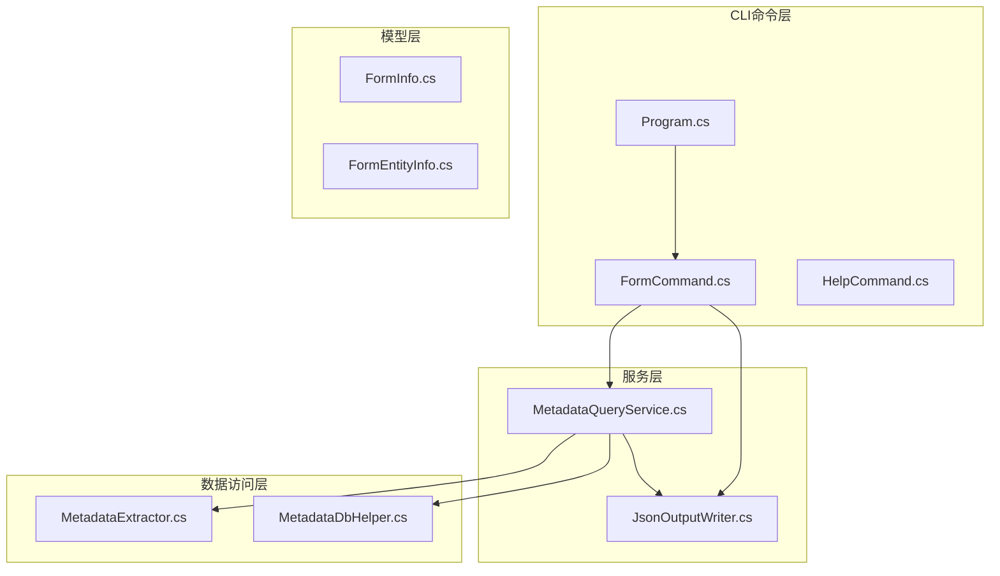
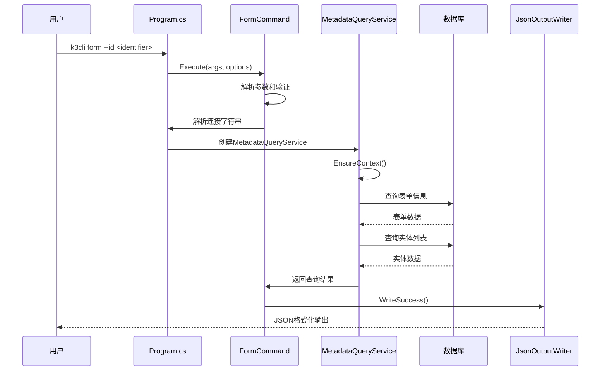
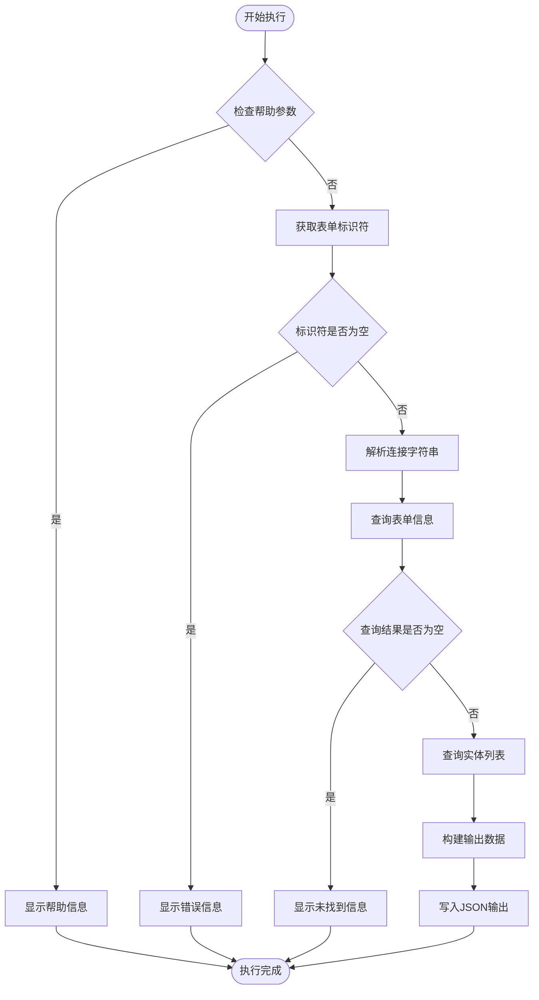
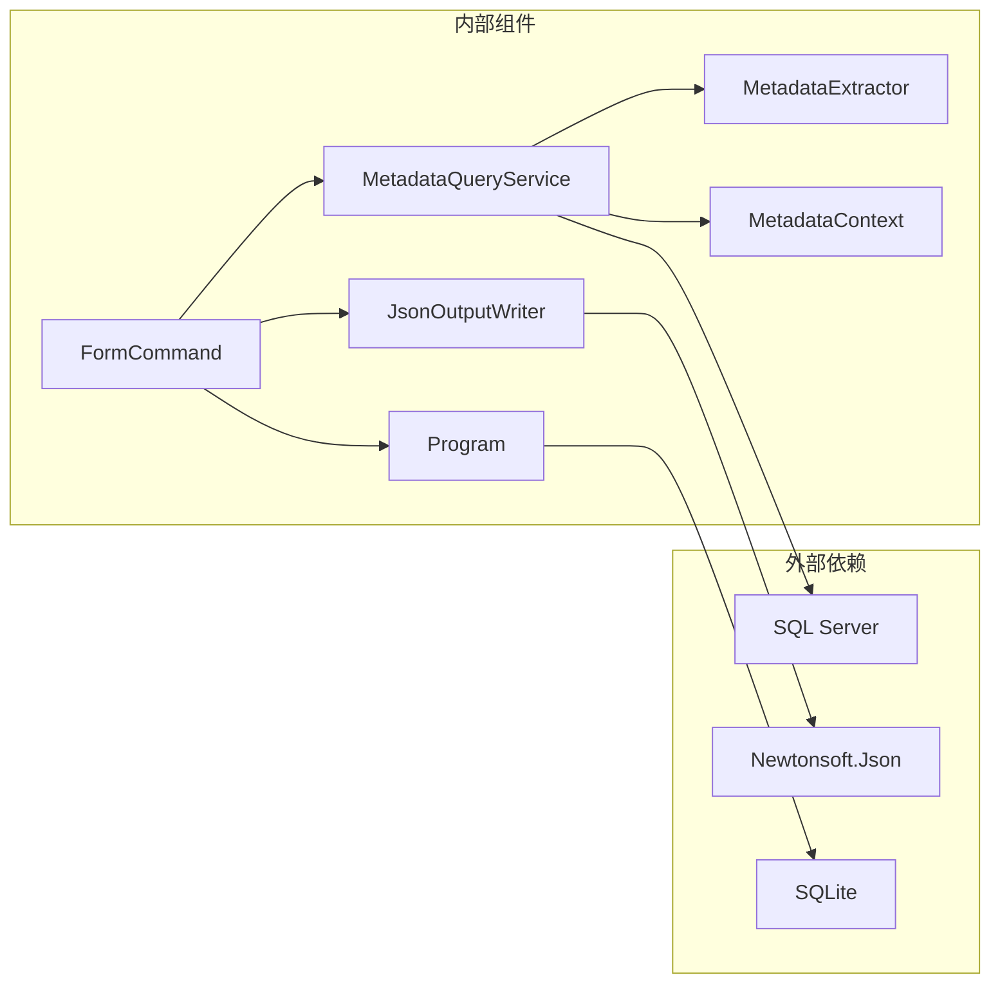

# form命令API

<cite>
**本文档引用的文件**
- [FormCommand.cs](file://K3CloudDataDictionary.Cli/Commands/FormCommand.cs)
- [MetadataQueryService.cs](file://K3CloudDataDictionary.Cli/Services/MetadataQueryService.cs)
- [HelpCommand.cs](file://K3CloudDataDictionary.Cli/Commands/HelpCommand.cs)
- [Program.cs](file://K3CloudDataDictionary.Cli/Program.cs)
- [JsonOutputWriter.cs](file://K3CloudDataDictionary.Cli/Services/JsonOutputWriter.cs)
- [FormInfo.cs](file://Models/FormInfo.cs)
- [FormEntityInfo.cs](file://Models/FormEntityInfo.cs)
- [usage-examples.md](file://docs/usage-examples.md)
</cite>

## 目录
1. [简介](#简介)
2. [项目结构](#项目结构)
3. [核心组件](#核心组件)
4. [架构概览](#架构概览)
5. [详细组件分析](#详细组件分析)
6. [依赖关系分析](#依赖关系分析)
7. [性能考虑](#性能考虑)
8. [故障排除指南](#故障排除指南)
9. [结论](#结论)

## 简介

form命令是K3Cloud数据字典CLI工具中的核心查询命令，专门用于查询表单的基本信息、结构和相关配置。该命令提供了完整的表单元数据查询能力，包括表单基本信息、实体列表、插件统计、服务规则统计等功能。

## 项目结构

K3Cloud数据字典CLI工具采用清晰的分层架构设计：



**图表来源**
- [FormCommand.cs:1-93](file://K3CloudDataDictionary.Cli/Commands/FormCommand.cs#L1-L93)
- [MetadataQueryService.cs:1-839](file://K3CloudDataDictionary.Cli/Services/MetadataQueryService.cs#L1-L839)

**章节来源**
- [FormCommand.cs:1-93](file://K3CloudDataDictionary.Cli/Commands/FormCommand.cs#L1-L93)
- [Program.cs:1-166](file://K3CloudDataDictionary.Cli/Program.cs#L1-L166)

## 核心组件

### 命令语法格式

form命令遵循统一的CLI语法格式：

```
k3cli form --id <identifier> [--connection <id>] [--pretty]
```

### 必需参数

- `--id <identifier>`：表单标识符（必填）
  - 支持表单ID（如 PUR_PurchaseOrder）
  - 支持表单名称
  - 支持部分匹配

### 可选参数

- `--connection <id>` 或 `-c <id>`：指定数据库连接ID
- `--pretty`：格式化JSON输出

### 功能特性

1. **表单基本信息查询**：获取表单ID、标识符、名称、模型类型等
2. **实体列表查询**：列出表单关联的所有实体及其属性
3. **统计信息聚合**：计算插件数量、服务规则数量、更新动作数量等
4. **错误处理机制**：完善的异常捕获和用户友好的错误提示
5. **JSON格式化输出**：支持美化输出和标准输出格式

**章节来源**
- [HelpCommand.cs:128-140](file://K3CloudDataDictionary.Cli/Commands/HelpCommand.cs#L128-L140)
- [FormCommand.cs:13-90](file://K3CloudDataDictionary.Cli/Commands/FormCommand.cs#L13-L90)

## 架构概览

form命令的执行流程采用典型的三层架构：



**图表来源**
- [FormCommand.cs:33-90](file://K3CloudDataDictionary.Cli/Commands/FormCommand.cs#L33-L90)
- [Program.cs:129-151](file://K3CloudDataDictionary.Cli/Program.cs#L129-L151)

## 详细组件分析

### FormCommand执行流程

FormCommand是form命令的核心执行组件，负责处理命令行参数、调用服务层查询数据并格式化输出。

#### 参数验证流程



**图表来源**
- [FormCommand.cs:18-90](file://K3CloudDataDictionary.Cli/Commands/FormCommand.cs#L18-L90)

#### 数据查询逻辑

MetadataQueryService提供核心的数据查询能力：

1. **表单信息查询**：通过对象基础信息表查询表单元数据
2. **实体列表查询**：通过元数据提取器获取实体详细信息
3. **统计信息计算**：基于元数据统计各类计数信息

**章节来源**
- [FormCommand.cs:33-90](file://K3CloudDataDictionary.Cli/Commands/FormCommand.cs#L33-L90)
- [MetadataQueryService.cs:172-277](file://K3CloudDataDictionary.Cli/Services/MetadataQueryService.cs#L172-L277)

### 数据模型结构

#### FormInfo模型

FormInfo类定义了表单信息的数据结构：

| 属性名 | 类型 | 描述 | 显示属性 |
|--------|------|------|----------|
| FormId | string | 表单ID | - |
| FormIdentifier | string | 表单标识符 | - |
| FormName | string | 表单名称 | - |
| ModelTypeName | string | 模型类型名称 | - |
| SubSystemName | string | 子系统名称 | - |
| FormPluginCount | int | 表单插件数量 | FormPluginCountDisplay |
| ListPluginCount | int | 列表插件数量 | ListPluginCountDisplay |
| BuilderPluginCount | int | 构建器插件数量 | BuilderPluginCountDisplay |
| UpdateActionCount | int | 更新动作数量 | UpdateActionCountDisplay |
| ServiceRuleCount | int | 服务规则数量 | ServiceRuleCountDisplay |
| FormOperationCount | int | 表单操作数量 | FormOperationCountDisplay |

#### FormEntityInfo模型

FormEntityInfo类定义了实体信息的数据结构：

| 属性名 | 类型 | 描述 | 显示属性 |
|--------|------|------|----------|
| IsSelected | bool | 是否选中 | - |
| FormId | string | 表单ID | - |
| EntityId | string | 实体ID | - |
| FormIdentifier | string | 表单标识符 | - |
| FormName | string | 表单名称 | - |
| FormModelType | string | 表单模型类型 | - |
| EntityKey | string | 实体Key | - |
| EntityEntryName | string | 实体入口名称 | - |
| EntityName | string | 实体名称 | - |
| EntityTableName | string | 实体表名 | - |
| EntityEntryPkFieldName | string | 实体主键字段名 | - |
| EntityElementTypeName | string | 实体元素类型名称 | - |
| ServiceRuleCount | int | 服务规则数量 | ServiceRuleCountDisplay |
| UpdateActionCount | int | 更新动作数量 | UpdateActionCountDisplay |

**章节来源**
- [FormInfo.cs:1-101](file://Models/FormInfo.cs#L1-L101)
- [FormEntityInfo.cs:1-118](file://Models/FormEntityInfo.cs#L1-L118)

### 错误处理机制

form命令实现了多层次的错误处理机制：

1. **参数验证错误**：缺少必需参数时返回明确的错误信息
2. **数据库连接错误**：连接字符串解析失败时抛出异常
3. **查询结果为空**：未找到匹配的表单时提供友好提示
4. **通用异常处理**：捕获所有未预期的异常并格式化输出

**章节来源**
- [FormCommand.cs:24-90](file://K3CloudDataDictionary.Cli/Commands/FormCommand.cs#L24-L90)
- [Program.cs:64-68](file://K3CloudDataDictionary.Cli/Program.cs#L64-L68)

## 依赖关系分析

### 组件依赖图



**图表来源**
- [FormCommand.cs:1-93](file://K3CloudDataDictionary.Cli/Commands/FormCommand.cs#L1-L93)
- [MetadataQueryService.cs:1-839](file://K3CloudDataDictionary.Cli/Services/MetadataQueryService.cs#L1-L839)

### 数据流分析

form命令的数据流遵循以下模式：

1. **输入层**：命令行参数解析
2. **业务层**：表单查询和实体查询
3. **数据层**：SQL Server数据库访问
4. **输出层**：JSON格式化输出

**章节来源**
- [MetadataQueryService.cs:172-277](file://K3CloudDataDictionary.Cli/Services/MetadataQueryService.cs#L172-L277)
- [JsonOutputWriter.cs:26-80](file://K3CloudDataDictionary.Cli/Services/JsonOutputWriter.cs#L26-L80)

## 性能考虑

### 查询优化策略

1. **延迟加载**：MetadataQueryService采用懒加载模式，首次使用时才初始化数据库连接
2. **批量查询**：元数据提取器支持批量处理，减少数据库往返次数
3. **内存缓存**：对象基础信息和元素类型映射在内存中缓存，避免重复查询
4. **连接池管理**：合理使用SqlConnection确保连接资源的有效利用

### 性能监控

- **加载进度**：显示元数据上下文加载进度
- **查询耗时**：SQL命令设置合理的超时时间（默认30秒）
- **内存使用**：元数据结果在方法返回后自动垃圾回收

## 故障排除指南

### 常见问题及解决方案

#### 1. 连接配置问题

**问题**：无法连接到数据库
**原因**：连接字符串配置错误或网络问题
**解决方案**：
- 使用 `k3cli connections list` 查看可用连接
- 使用 `k3cli connections add` 添加新的数据库连接
- 确认SQL Server服务正常运行

#### 2. 表单标识符无效

**问题**：返回"未找到表单"错误
**原因**：表单标识符拼写错误或不存在
**解决方案**：
- 使用 `k3cli search` 命令搜索表单
- 确认表单标识符的大小写
- 检查表单是否存在于目标数据库中

#### 3. 权限不足

**问题**：查询失败但无具体错误信息
**原因**：数据库用户权限不足
**解决方案**：
- 确认数据库用户具有足够的查询权限
- 检查数据库对象的访问权限
- 联系数据库管理员确认权限配置

### 调试建议

1. **启用详细日志**：使用 `--pretty` 参数获取格式化的JSON输出
2. **检查连接状态**：使用 `k3cli connections test --id <id>` 测试连接
3. **验证参数**：逐步验证命令行参数的正确性
4. **查看系统信息**：检查系统环境和依赖库版本

**章节来源**
- [Program.cs:129-151](file://K3CloudDataDictionary.Cli/Program.cs#L129-L151)
- [usage-examples.md:152-157](file://docs/usage-examples.md#L152-L157)

## 结论

form命令作为K3Cloud数据字典CLI工具的重要组成部分，提供了完整的表单查询能力。通过清晰的架构设计、完善的错误处理机制和友好的用户界面，该命令能够有效地帮助用户查询和理解K3Cloud系统的表单结构。

主要优势包括：
- **易用性强**：简洁的命令语法和详细的帮助信息
- **功能完整**：涵盖表单基本信息、实体列表、统计信息等多维度查询
- **性能优秀**：采用延迟加载和批量处理优化查询性能
- **错误友好**：提供清晰的错误信息和故障排除指导

建议在实际使用中结合其他相关命令（如fields、search等）形成完整的查询工作流，以获得更全面的表单元数据视图。