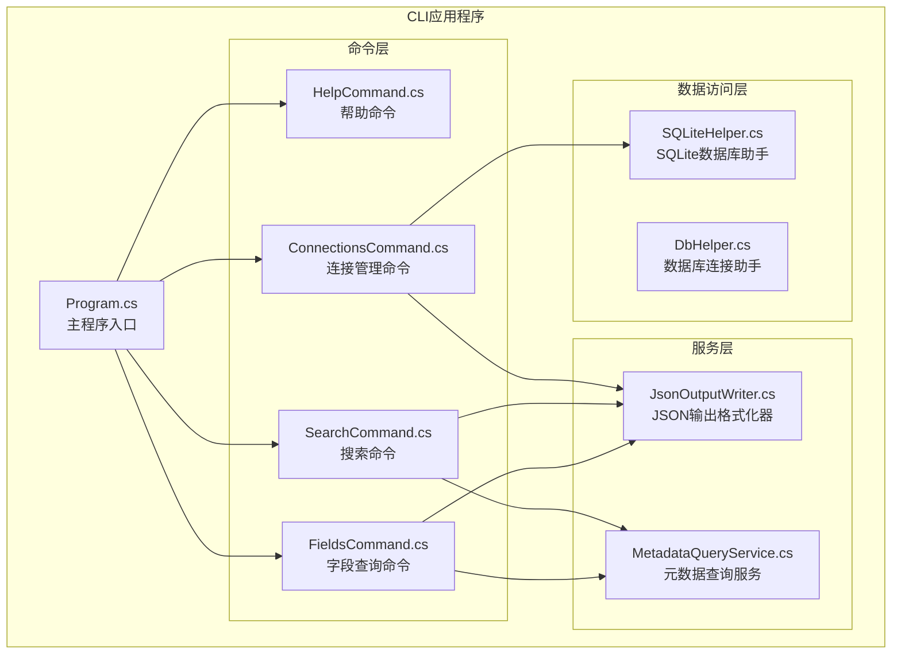
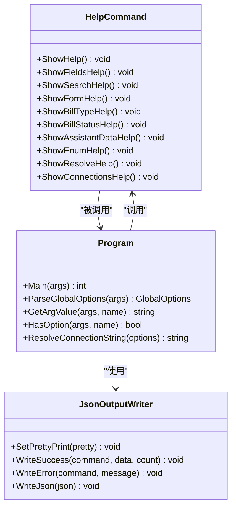
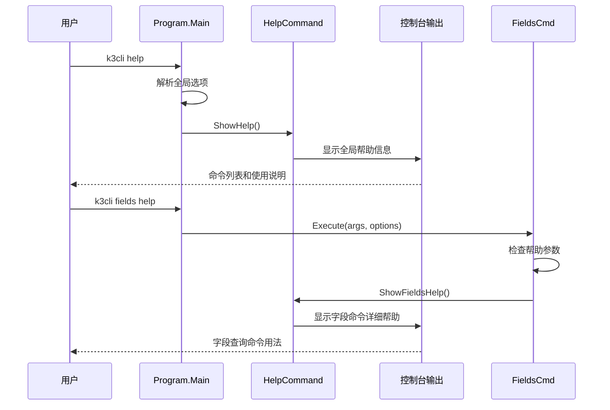
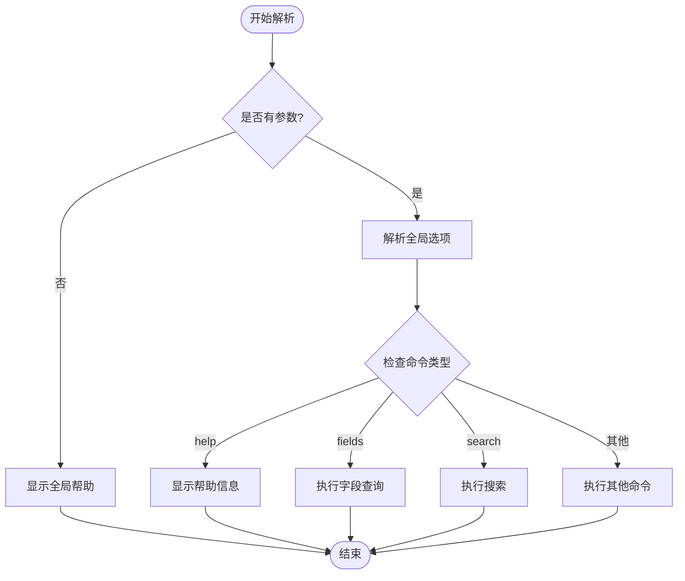
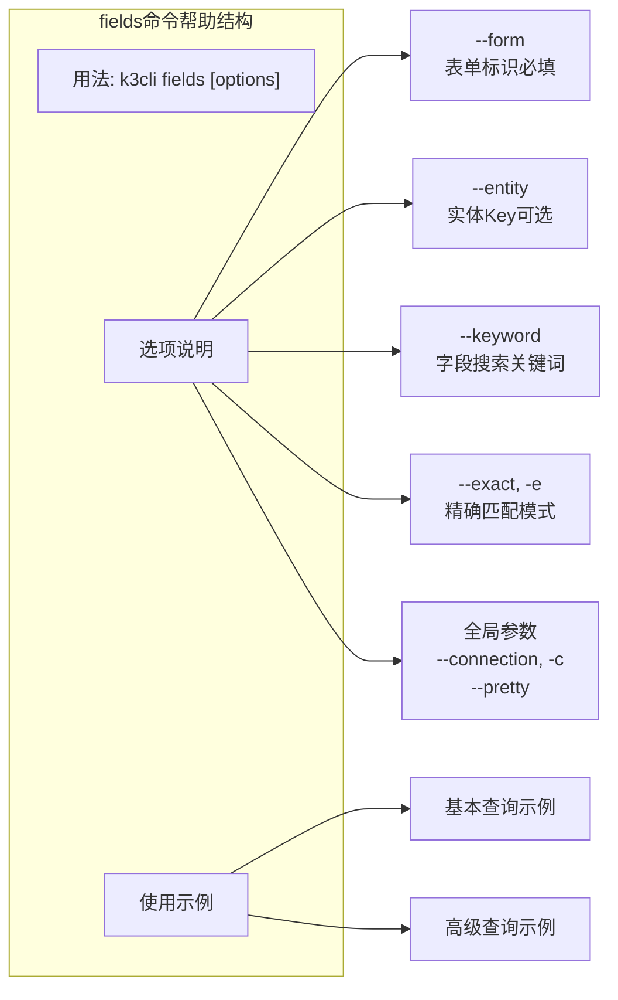
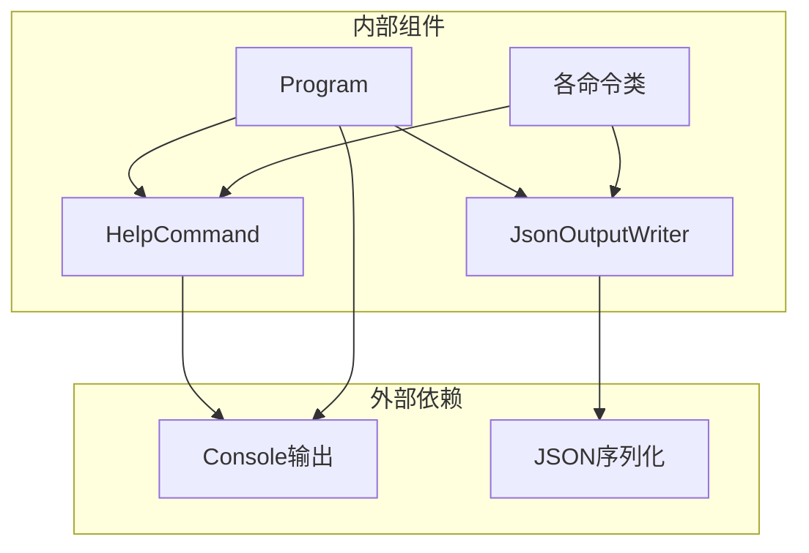

# help命令API

<cite>
**本文档引用的文件**
- [HelpCommand.cs](file://K3CloudDataDictionary.Cli/Commands/HelpCommand.cs)
- [Program.cs](file://K3CloudDataDictionary.Cli/Program.cs)
- [JsonOutputWriter.cs](file://K3CloudDataDictionary.Cli/Services/JsonOutputWriter.cs)
- [FieldsCommand.cs](file://K3CloudDataDictionary.Cli/Commands/FieldsCommand.cs)
- [SearchCommand.cs](file://K3CloudDataDictionary.Cli/Commands/SearchCommand.cs)
- [ConnectionsCommand.cs](file://K3CloudDataDictionary.Cli/Commands/ConnectionsCommand.cs)
- [usage-examples.md](file://docs/usage-examples.md)
</cite>

## 目录
1. [简介](#简介)
2. [项目结构](#项目结构)
3. [核心组件](#核心组件)
4. [架构概览](#架构概览)
5. [详细组件分析](#详细组件分析)
6. [依赖关系分析](#依赖关系分析)
7. [性能考虑](#性能考虑)
8. [故障排除指南](#故障排除指南)
9. [结论](#结论)

## 简介

help命令是K3Cloud数据字典CLI工具的核心功能模块，负责提供完整的命令行帮助信息和使用指导。该系统采用分层设计，支持全局帮助和特定命令的帮助信息显示，为用户提供从入门到高级使用的完整指导。

## 项目结构

K3Cloud数据字典CLI工具采用清晰的分层架构，help命令位于命令层，与业务逻辑层和服务层分离：



**图表来源**
- [Program.cs:14-69](file://K3CloudDataDictionary.Cli/Program.cs#L14-L69)
- [HelpCommand.cs:8-286](file://K3CloudDataDictionary.Cli/Commands/HelpCommand.cs#L8-L286)

**章节来源**
- [Program.cs:1-166](file://K3CloudDataDictionary.Cli/Program.cs#L1-L166)
- [HelpCommand.cs:1-287](file://K3CloudDataDictionary.Cli/Commands/HelpCommand.cs#L1-L287)

## 核心组件

### HelpCommand类结构

HelpCommand类是一个静态类，专门负责帮助信息的生成和显示。它包含了完整的帮助系统实现：



**图表来源**
- [HelpCommand.cs:8-286](file://K3CloudDataDictionary.Cli/Commands/HelpCommand.cs#L8-L286)
- [Program.cs:14-151](file://K3CloudDataDictionary.Cli/Program.cs#L14-L151)
- [JsonOutputWriter.cs:11-91](file://K3CloudDataDictionary.Cli/Services/JsonOutputWriter.cs#L11-L91)

### 帮助系统层次结构

帮助系统采用多层级设计，从全局帮助到具体命令帮助：

1. **全局帮助** - 显示所有可用命令和全局选项
2. **命令级帮助** - 显示特定命令的详细用法和参数
3. **子命令帮助** - 显示连接管理等复杂命令的子命令说明

**章节来源**
- [HelpCommand.cs:10-72](file://K3CloudDataDictionary.Cli/Commands/HelpCommand.cs#L10-L72)
- [HelpCommand.cs:74-102](file://K3CloudDataDictionary.Cli/Commands/HelpCommand.cs#L74-L102)
- [HelpCommand.cs:259-284](file://K3CloudDataDictionary.Cli/Commands/HelpCommand.cs#L259-L284)

## 架构概览

### 命令执行流程

help命令的执行遵循标准的CLI命令模式，具有完整的参数解析和错误处理机制：



**图表来源**
- [Program.cs:33-62](file://K3CloudDataDictionary.Cli/Program.cs#L33-L62)
- [HelpCommand.cs:10-72](file://K3CloudDataDictionary.Cli/Commands/HelpCommand.cs#L10-L72)

### 参数解析机制

程序采用简单的字符串匹配方式进行参数解析，支持长格式和短格式参数：



**图表来源**
- [Program.cs:74-97](file://K3CloudDataDictionary.Cli/Program.cs#L74-L97)
- [Program.cs:33-62](file://K3CloudDataDictionary.Cli/Program.cs#L33-L62)

**章节来源**
- [Program.cs:19-69](file://K3CloudDataDictionary.Cli/Program.cs#L19-L69)

## 详细组件分析

### 全局帮助系统

全局帮助提供了CLI工具的整体概览，包括所有可用命令和通用选项：

#### 命令分类

帮助系统将命令分为多个功能类别：

1. **查询类命令**
   - `fields` - 查询表单字段信息
   - `search` - 模糊搜索字段或表
   - `form` - 查询表单元数据

2. **业务数据查询命令**
   - `billtype` - 查询单据类型（列表/详情）
   - `billstatus` - 查询单据状态字段枚举值
   - `assistantdata` - 查询辅助资料列表
   - `enum` - 查询枚举值列表

3. **解析和导航命令**
   - `resolve` - 解析对象ID对应的表单信息
   - `connections` - 管理数据库连接

#### 全局选项

全局选项支持跨所有命令使用：

- `--connection, -c <id>` - 指定连接ID
- `--pretty` - 格式化JSON输出

**章节来源**
- [HelpCommand.cs:16-26](file://K3CloudDataDictionary.Cli/Commands/HelpCommand.cs#L16-L26)
- [HelpCommand.cs:28-31](file://K3CloudDataDictionary.Cli/Commands/HelpCommand.cs#L28-L31)

### 命令级帮助系统

每个命令都有专门的帮助信息，采用统一的格式化标准：

#### fields命令帮助

fields命令帮助包含完整的参数说明和使用示例：



**图表来源**
- [HelpCommand.cs:76-101](file://K3CloudDataDictionary.Cli/Commands/HelpCommand.cs#L76-L101)

#### search命令帮助

search命令帮助提供了灵活的搜索功能说明：

- 支持字段和表两种搜索类型
- 支持模糊匹配和精确匹配
- 默认搜索类型为表（table）

**章节来源**
- [HelpCommand.cs:104-126](file://K3CloudDataDictionary.Cli/Commands/HelpCommand.cs#L104-L126)

### 子命令帮助系统

connections命令具有复杂的子命令结构，每个子命令都有专门的帮助信息：

#### 子命令类型

1. `list` - 列出所有连接
2. `add` - 添加新连接
3. `test --id <id>` - 测试连接
4. `set-default --id <id>` - 设为默认连接

#### add子命令参数

add子命令支持丰富的连接配置参数：

- 必填参数：`--server`, `--db`, `--user`
- 可选参数：`--port`, `--password`, `--name`, `--default`
- 默认端口：1433

**章节来源**
- [HelpCommand.cs:259-284](file://K3CloudDataDictionary.Cli/Commands/HelpCommand.cs#L259-L284)

### 帮助内容生成逻辑

帮助系统采用模板化的文本生成方式，确保一致性和可维护性：

#### 文本格式规范

1. **标题格式** - 使用"用法:"前缀标识命令语法
2. **参数说明** - 采用"--param <value>"格式标注参数
3. **必需性标记** - 必填参数使用"(必填)"标注
4. **示例格式** - 使用"#"前缀标识示例说明

#### 条件帮助显示

命令执行过程中，帮助信息的显示遵循以下规则：

1. **无参数情况** - 自动显示对应命令的帮助
2. **--help/-h/--help参数** - 显示详细帮助信息
3. **参数验证失败** - 显示错误信息和帮助示例

**章节来源**
- [FieldsCommand.cs:17-22](file://K3CloudDataDictionary.Cli/Commands/FieldsCommand.cs#L17-L22)
- [SearchCommand.cs:17-22](file://K3CloudDataDictionary.Cli/Commands/SearchCommand.cs#L17-L22)
- [ConnectionsCommand.cs:19-24](file://K3CloudDataDictionary.Cli/Commands/ConnectionsCommand.cs#L19-L24)

## 依赖关系分析

### 组件间依赖关系



**图表来源**
- [HelpCommand.cs:10-72](file://K3CloudDataDictionary.Cli/Commands/HelpCommand.cs#L10-L72)
- [Program.cs:14-69](file://K3CloudDataDictionary.Cli/Program.cs#L14-L69)
- [JsonOutputWriter.cs:26-70](file://K3CloudDataDictionary.Cli/Services/JsonOutputWriter.cs#L26-L70)

### 错误处理依赖

帮助系统与错误处理机制紧密集成：

1. **参数验证失败** - 自动显示相应命令的帮助信息
2. **未知命令** - 显示全局帮助并提示使用方法
3. **异常处理** - 通过统一的错误输出格式化器处理

**章节来源**
- [Program.cs:58-68](file://K3CloudDataDictionary.Cli/Program.cs#L58-L68)
- [JsonOutputWriter.cs:58-70](file://K3CloudDataDictionary.Cli/Services/JsonOutputWriter.cs#L58-L70)

## 性能考虑

### 帮助信息缓存

当前实现中，帮助信息采用静态字符串存储，具有以下特点：

- **内存占用** - 帮助文本在编译时确定，运行时内存占用固定
- **加载速度** - 直接从内存读取，无I/O开销
- **更新成本** - 修改帮助信息需要重新编译

### 输出优化

JSON输出格式化器支持两种输出模式：

1. **紧凑模式** - 减少输出体积，适合管道传输
2. **格式化模式** - 提高可读性，适合调试和文档生成

**章节来源**
- [JsonOutputWriter.cs:18-21](file://K3CloudDataDictionary.Cli/Services/JsonOutputWriter.cs#L18-L21)
- [JsonOutputWriter.cs:77-79](file://K3CloudDataDictionary.Cli/Services/JsonOutputWriter.cs#L77-L79)

## 故障排除指南

### 常见问题及解决方案

#### 1. 帮助信息显示异常

**症状**：执行help命令后无响应或显示乱码

**可能原因**：
- 控制台编码设置问题
- 帮助文本包含特殊字符
- 输出重定向问题

**解决方法**：
- 检查控制台编码设置
- 验证帮助文本格式
- 确认输出设备可用性

#### 2. 参数解析错误

**症状**：命令执行时报参数错误但同时显示帮助

**可能原因**：
- 参数格式不正确
- 缺少必需参数
- 参数值类型不匹配

**解决方法**：
- 检查参数格式（--param value vs --param=value）
- 确认必需参数完整性
- 验证参数值的数据类型

#### 3. 连接配置问题

**症状**：使用--connection参数时报连接错误

**可能原因**：
- 连接ID不存在
- 默认连接未配置
- 数据库连接失败

**解决方法**：
- 使用`k3cli connections list`查看可用连接
- 使用`k3cli connections add`添加新连接
- 使用`k3cli connections test --id <id>`测试连接

**章节来源**
- [Program.cs:129-151](file://K3CloudDataDictionary.Cli/Program.cs#L129-L151)
- [HelpCommand.cs:64-71](file://K3CloudDataDictionary.Cli/Commands/HelpCommand.cs#L64-L71)

### 调试技巧

#### 1. 启用详细日志

通过`--pretty`参数可以启用格式化输出，便于调试：

```bash
k3cli fields --form PUR_PurchaseOrder --pretty
```

#### 2. 分步骤验证

对于复杂的命令组合，建议分步骤执行：

```bash
# 第一步：验证连接
k3cli connections test --id 1

# 第二步：获取字段信息
k3cli fields --form PUR_PurchaseOrder --connection 1

# 第三步：应用过滤条件
k3cli fields --form PUR_PurchaseOrder --keyword "物料" --connection 1
```

#### 3. 使用帮助命令

当不确定命令语法时，始终可以使用相应的帮助命令：

```bash
# 获取字段查询帮助
k3cli fields help

# 获取连接管理帮助  
k3cli connections help
```

## 结论

help命令API为K3Cloud数据字典CLI工具提供了完整、一致的帮助系统。通过分层设计和标准化的格式，用户可以从全局概览逐步深入到具体命令的详细使用方法。该系统的特点包括：

1. **一致性** - 所有命令采用相同的帮助格式和显示规则
2. **完整性** - 覆盖所有命令的功能说明和使用示例
3. **易用性** - 支持多种帮助触发方式和参数组合
4. **可扩展性** - 新增命令时可复用现有的帮助框架

通过合理使用help命令API，用户可以快速掌握K3Cloud数据字典CLI工具的使用方法，并能够高效地进行数据查询和分析工作。