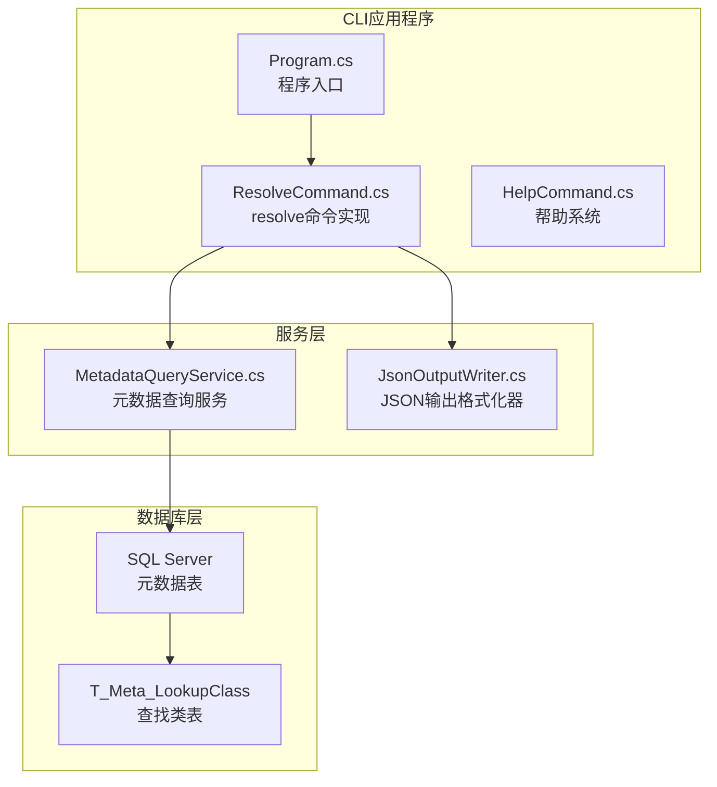
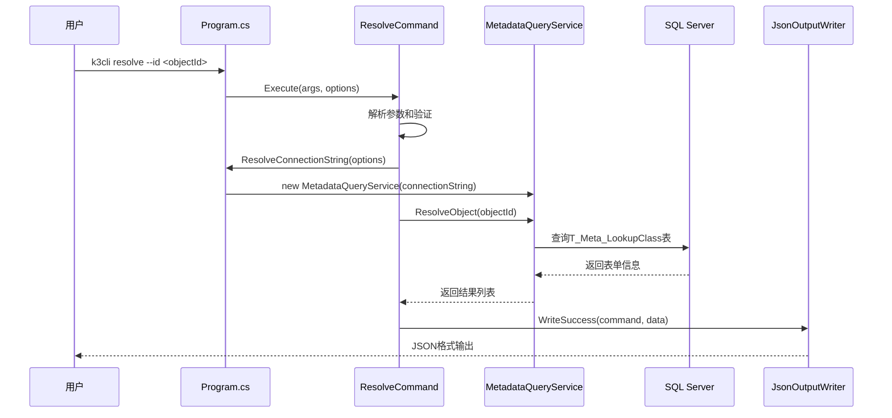
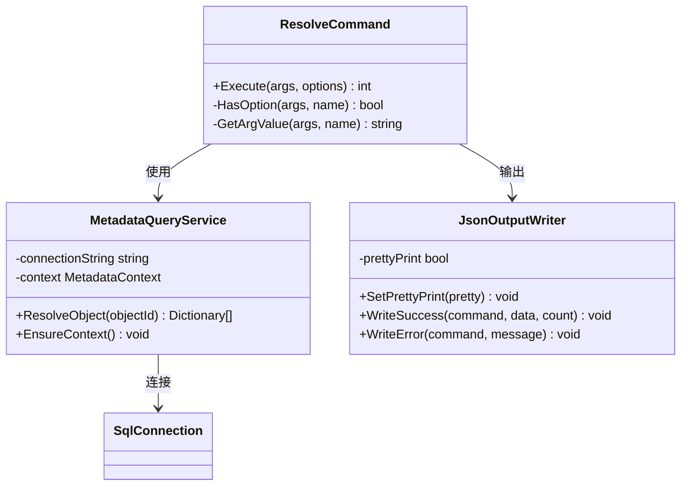
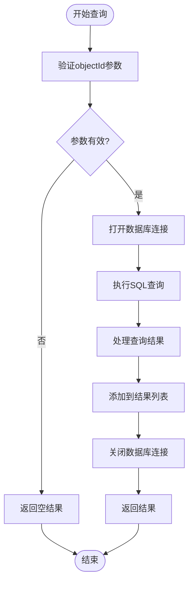
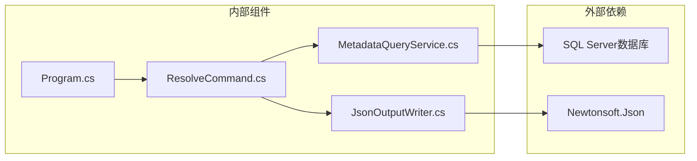

# resolve命令API

<cite>
**本文档引用的文件**
- [ResolveCommand.cs](file://K3CloudDataDictionary.Cli/Commands/ResolveCommand.cs)
- [MetadataQueryService.cs](file://K3CloudDataDictionary.Cli/Services/MetadataQueryService.cs)
- [Program.cs](file://K3CloudDataDictionary.Cli/Program.cs)
- [HelpCommand.cs](file://K3CloudDataDictionary.Cli/Commands/HelpCommand.cs)
- [JsonOutputWriter.cs](file://K3CloudDataDictionary.Cli/Services/JsonOutputWriter.cs)
- [usage-examples.md](file://docs/usage-examples.md)
</cite>

## 目录
1. [简介](#简介)
2. [项目结构](#项目结构)
3. [核心组件](#核心组件)
4. [架构概览](#架构概览)
5. [详细组件分析](#详细组件分析)
6. [依赖关系分析](#依赖关系分析)
7. [性能考虑](#性能考虑)
8. [故障排除指南](#故障排除指南)
9. [结论](#结论)
10. [附录](#附录)

## 简介
resolve命令是K3Cloud数据字典CLI工具中的核心功能之一，专门用于解析lookUpObject ID并反查其对应的表单信息。该命令通过直接连接SQL Server数据库，查询元数据表来获取关联表单的详细信息，包括表单标识、数据库表名、主键字段名等关键信息。

## 项目结构
resolve命令位于CLI应用程序的命令系统中，采用清晰的分层架构设计：



**图表来源**
- [Program.cs:14-69](file://K3CloudDataDictionary.Cli/Program.cs#L14-L69)
- [ResolveCommand.cs:11-62](file://K3CloudDataDictionary.Cli/Commands/ResolveCommand.cs#L11-L62)
- [MetadataQueryService.cs:12-22](file://K3CloudDataDictionary.Cli/Services/MetadataQueryService.cs#L12-L22)

**章节来源**
- [Program.cs:14-69](file://K3CloudDataDictionary.Cli/Program.cs#L14-L69)
- [ResolveCommand.cs:11-62](file://K3CloudDataDictionary.Cli/Commands/ResolveCommand.cs#L11-L62)

## 核心组件
resolve命令的核心组件包括：

### 命令执行器
- **ResolveCommand**: 主要的命令实现类，负责参数解析、业务逻辑执行和结果输出
- **MetadataQueryService**: 元数据查询服务，提供与数据库交互的能力
- **JsonOutputWriter**: JSON输出格式化器，统一处理命令行输出格式

### 数据模型
- **GlobalOptions**: 全局选项配置，支持连接管理和输出格式化
- **Dictionary<string, object>**: 动态数据结构，用于灵活的数据传输

**章节来源**
- [ResolveCommand.cs:11-62](file://K3CloudDataDictionary.Cli/Commands/ResolveCommand.cs#L11-L62)
- [MetadataQueryService.cs:12-22](file://K3CloudDataDictionary.Cli/Services/MetadataQueryService.cs#L12-L22)
- [Program.cs:156-164](file://K3CloudDataDictionary.Cli/Program.cs#L156-L164)

## 架构概览
resolve命令采用经典的三层架构模式：



**图表来源**
- [ResolveCommand.cs:13-60](file://K3CloudDataDictionary.Cli/Commands/ResolveCommand.cs#L13-L60)
- [MetadataQueryService.cs:83-122](file://K3CloudDataDictionary.Cli/Services/MetadataQueryService.cs#L83-L122)
- [Program.cs:129-151](file://K3CloudDataDictionary.Cli/Program.cs#L129-L151)

## 详细组件分析

### ResolveCommand组件分析
resolve命令的实现遵循单一职责原则，主要负责命令的生命周期管理：



**图表来源**
- [ResolveCommand.cs:11-62](file://K3CloudDataDictionary.Cli/Commands/ResolveCommand.cs#L11-L62)
- [MetadataQueryService.cs:12-22](file://K3CloudDataDictionary.Cli/Services/MetadataQueryService.cs#L12-L22)
- [JsonOutputWriter.cs:11-91](file://K3CloudDataDictionary.Cli/Services/JsonOutputWriter.cs#L11-L91)

#### 命令执行流程
resolve命令的执行流程严格遵循以下步骤：

1. **参数解析阶段**: 检查帮助请求和必需参数
2. **连接建立阶段**: 解析全局选项并建立数据库连接
3. **业务处理阶段**: 调用元数据查询服务执行解析逻辑
4. **结果输出阶段**: 格式化并输出JSON结果

#### 参数验证规则
- **必需参数**: `--id` 或 `-i` 必须提供有效的lookUpObject ID
- **可选参数**: `--connection` 指定连接ID，`--pretty` 格式化输出
- **帮助参数**: `help`、`--help`、`-h` 显示帮助信息

**章节来源**
- [ResolveCommand.cs:13-60](file://K3CloudDataDictionary.Cli/Commands/ResolveCommand.cs#L13-L60)
- [HelpCommand.cs:238-257](file://K3CloudDataDictionary.Cli/Commands/HelpCommand.cs#L238-L257)

### MetadataQueryService组件分析
元数据查询服务是resolve命令的核心数据访问层：

#### 数据查询逻辑
服务通过直接查询T_Meta_LookupClass表来获取lookUpObject对应的表单信息：



**图表来源**
- [MetadataQueryService.cs:83-122](file://K3CloudDataDictionary.Cli/Services/MetadataQueryService.cs#L83-L122)

#### 查询参数和返回值
- **输入参数**: `objectId` (lookUpObject ID)
- **查询表**: `T_Meta_LookupClass`
- **返回字段**: 
  - `FID`: lookUpObject ID
  - `FFORMID`: 表单标识
  - `FTABLENAME`: 数据库表名
  - `FPKFIELDNAME`: 主键字段名
  - `FORGFIELDNAME`: 组织字段名

**章节来源**
- [MetadataQueryService.cs:83-122](file://K3CloudDataDictionary.Cli/Services/MetadataQueryService.cs#L83-L122)

### JsonOutputWriter组件分析
JSON输出格式化器提供统一的输出格式：

#### 输出格式规范
resolve命令的标准输出格式：
```json
{
  "success": true,
  "command": "resolve",
  "data": [
    {
      "lookupId": "6099b796-9e56-434e-895e-a1628d12d4c2",
      "formId": "BD_Supplier",
      "tableName": "t_BD_Supplier", 
      "pkFieldName": "FSupplierId",
      "orgFieldName": "FUseOrgId"
    }
  ],
  "count": 1
}
```

**章节来源**
- [JsonOutputWriter.cs:26-53](file://K3CloudDataDictionary.Cli/Services/JsonOutputWriter.cs#L26-L53)

## 依赖关系分析
resolve命令的依赖关系清晰明确：



**图表来源**
- [Program.cs:1-6](file://K3CloudDataDictionary.Cli/Program.cs#L1-L6)
- [ResolveCommand.cs:1-6](file://K3CloudDataDictionary.Cli/Commands/ResolveCommand.cs#L1-L6)
- [JsonOutputWriter.cs:1-5](file://K3CloudDataDictionary.Cli/Services/JsonOutputWriter.cs#L1-L5)

### 组件耦合度
- **低耦合**: 各组件职责明确，接口清晰
- **单向依赖**: ResolveCommand依赖MetadataQueryService，MetadataQueryService依赖数据库
- **无循环依赖**: 依赖关系呈树形结构

**章节来源**
- [Program.cs:1-6](file://K3CloudDataDictionary.Cli/Program.cs#L1-L6)
- [ResolveCommand.cs:1-6](file://K3CloudDataDictionary.Cli/Commands/ResolveCommand.cs#L1-L6)

## 性能考虑
resolve命令在性能方面具有以下特点：

### 数据库查询优化
- **直接SQL查询**: 避免复杂的JOIN操作，直接查询lookupclass表
- **参数化查询**: 使用参数化SQL防止注入攻击
- **超时设置**: 查询超时时间为30秒，平衡响应时间和安全性

### 内存使用优化
- **流式处理**: 使用DataReader逐行处理查询结果
- **延迟加载**: 元数据上下文采用懒加载策略
- **连接池**: 利用SqlConnection连接池提高性能

### 并发处理
- **线程安全**: MetadataQueryService设计为线程安全
- **资源管理**: 正确的using语句确保资源及时释放

## 故障排除指南

### 常见错误及解决方案

#### 连接配置问题
**错误**: "没有默认连接。请使用 --connection 参数指定连接，或先配置默认连接。使用 'k3cli connections add' 添加连接。"
**解决方案**: 
1. 使用 `k3cli connections add` 添加新的数据库连接
2. 使用 `k3cli connections list` 查看现有连接
3. 在resolve命令中使用 `--connection <id>` 指定连接

#### 参数验证错误
**错误**: "缺少必填参数 --id <objectId>"
**解决方案**: 确保在命令中提供有效的lookUpObject ID

#### 数据库连接失败
**错误**: SQL Server连接异常
**解决方案**:
1. 验证数据库服务器地址和端口
2. 检查用户名和密码
3. 确认数据库实例名称正确

#### 查询超时
**错误**: 查询超时
**解决方案**:
1. 检查网络连接稳定性
2. 验证SQL Server性能
3. 考虑增加查询超时时间

**章节来源**
- [Program.cs:129-151](file://K3CloudDataDictionary.Cli/Program.cs#L129-L151)
- [ResolveCommand.cs:25-31](file://K3CloudDataDictionary.Cli/Commands/ResolveCommand.cs#L25-L31)

## 结论
resolve命令是一个设计精良的CLI工具功能，具有以下优势：

1. **简洁明了**: 专注于单一功能，API设计直观易用
2. **性能优秀**: 直接数据库查询，避免不必要的数据处理
3. **错误处理完善**: 提供详细的错误信息和帮助文档
4. **扩展性强**: 基于接口设计，易于功能扩展

该命令为K3Cloud系统的元数据查询提供了重要的支撑功能，特别是在处理lookUpObject关联关系时发挥着关键作用。

## 附录

### 命令行使用示例

#### 基本使用
```bash
# 解析lookUpObject ID得到表单信息
k3cli resolve --id 6099b796-9e56-434e-895e-a1628d12d4c2

# 格式化输出
k3cli resolve --id 6099b796-9e56-434e-895e-a1628d12d4c2 --pretty
```

#### 高级使用
```bash
# 指定数据库连接
k3cli resolve --id 6099b796-9e56-434e-895e-a1628d12d4c2 --connection 1

# 结合其他命令使用
k3cli fields --form PUR_PurchaseOrder --keyword "供应商"
k3cli resolve --id 6099b796-9e56-434e-895e-a1628d12d4c2
k3cli fields --form BD_Supplier
```

### 关联查询最佳实践

#### 处理复杂关联关系
1. **分步查询**: 先fields命令获取lookUpObject ID，再resolve解析
2. **缓存结果**: 对频繁查询的结果进行本地缓存
3. **批量处理**: 对多个lookUpObject ID进行批量解析

#### 错误处理策略
1. **参数验证**: 在调用resolve之前验证lookUpObject ID的有效性
2. **异常捕获**: 捕获并处理数据库连接异常
3. **降级方案**: 当数据库不可用时提供替代方案

#### 性能优化建议
1. **连接复用**: 复用数据库连接减少连接开销
2. **查询优化**: 使用索引优化lookupclass表查询
3. **结果缓存**: 缓存常用的解析结果

**章节来源**
- [usage-examples.md:50-150](file://docs/usage-examples.md#L50-L150)