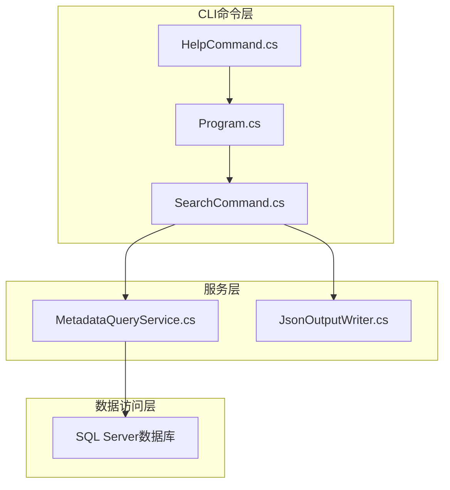
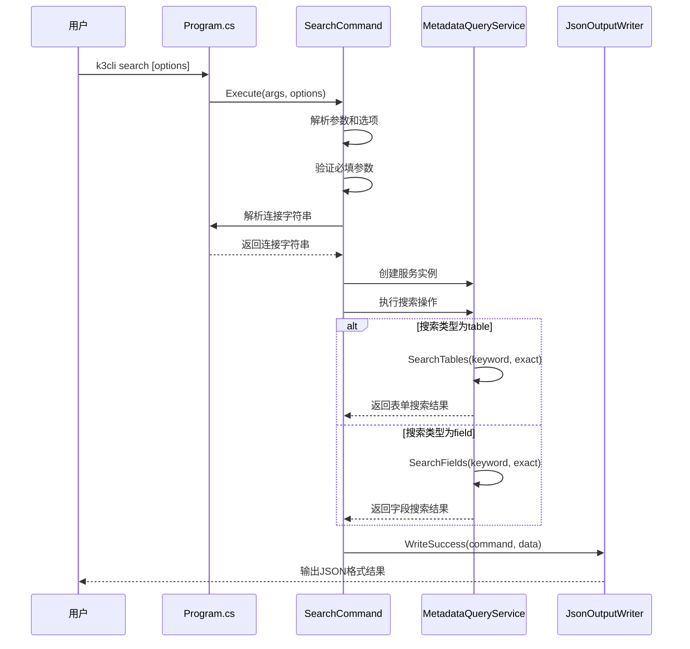
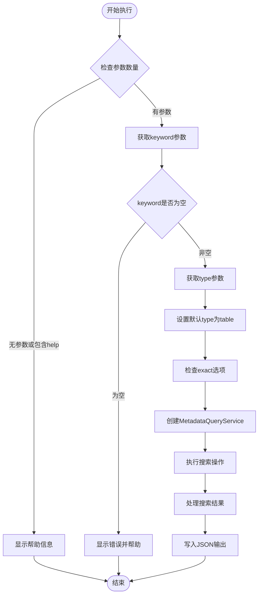
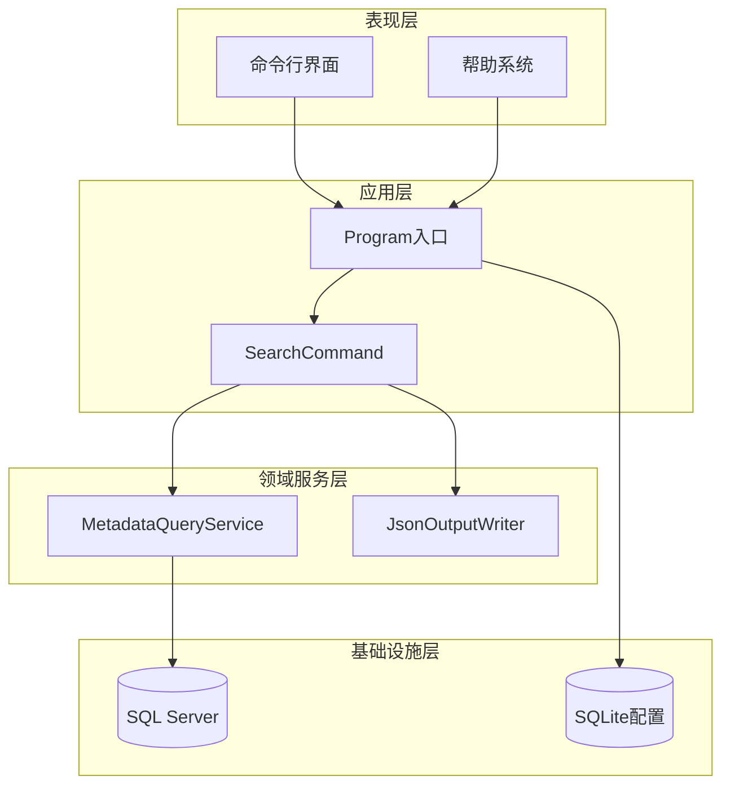
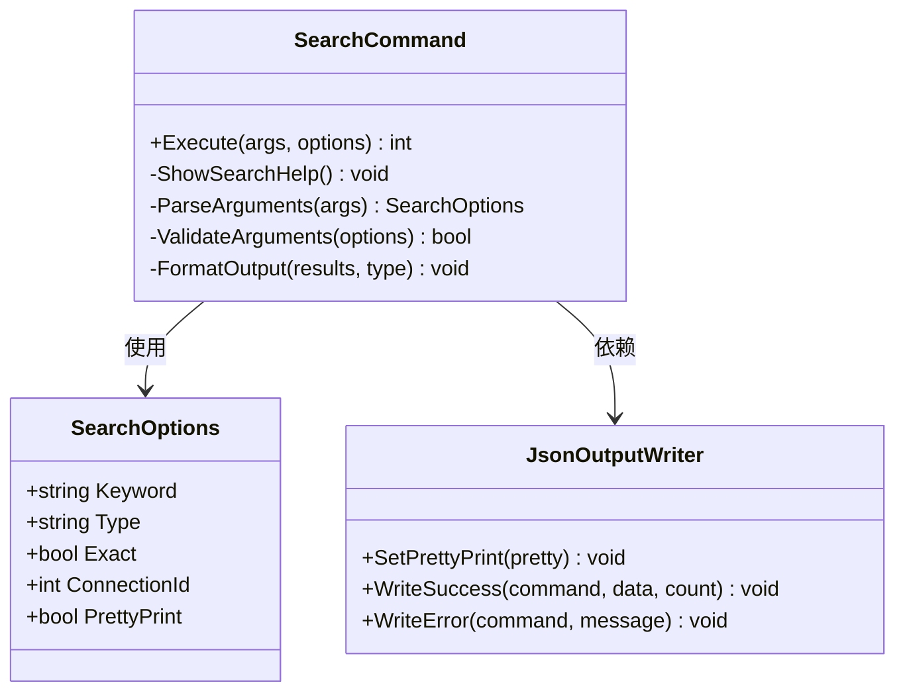
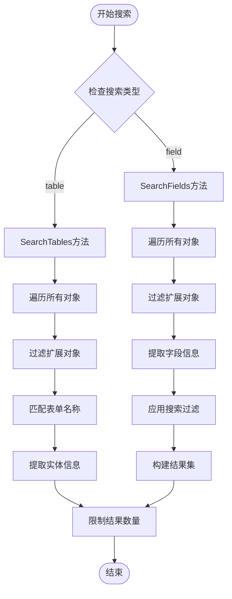
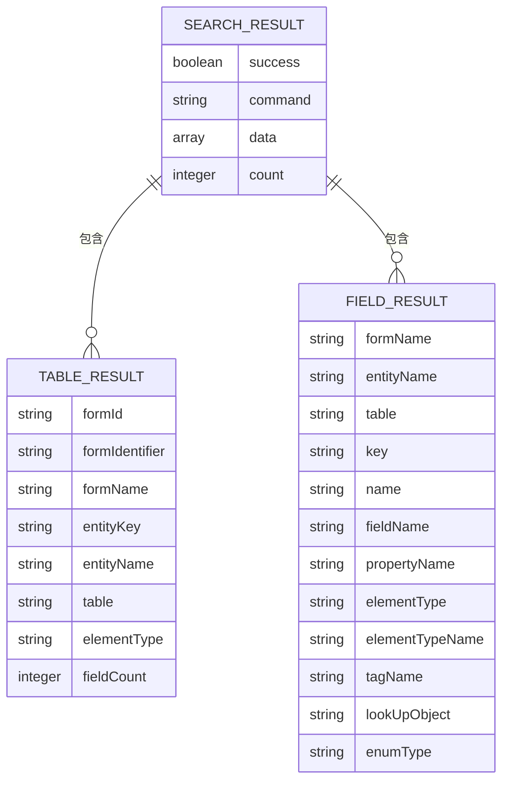
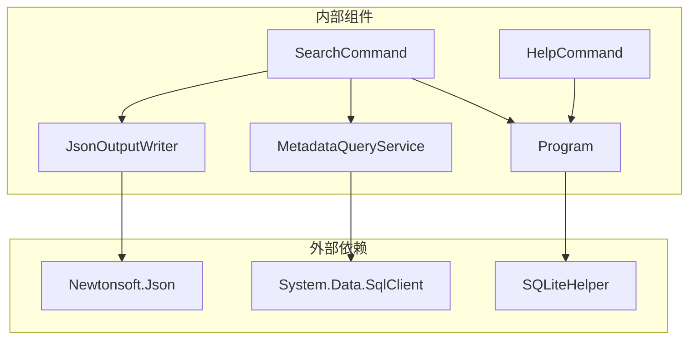
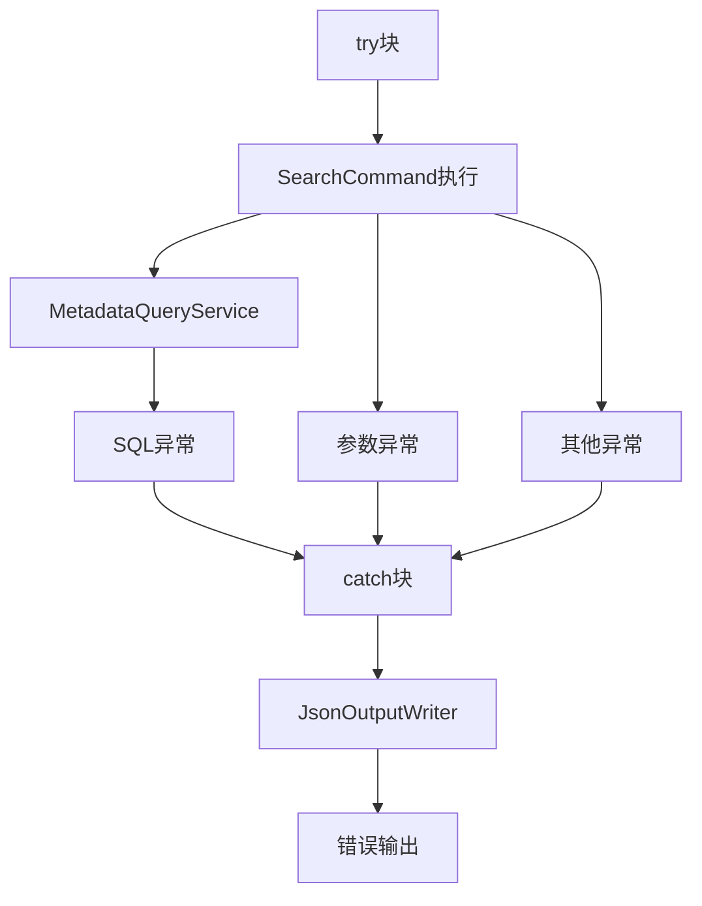

# search命令API

<cite>
**本文档引用的文件**
- [SearchCommand.cs](file://K3CloudDataDictionary.Cli/Commands/SearchCommand.cs)
- [MetadataQueryService.cs](file://K3CloudDataDictionary.Cli/Services/MetadataQueryService.cs)
- [HelpCommand.cs](file://K3CloudDataDictionary.Cli/Commands/HelpCommand.cs)
- [Program.cs](file://K3CloudDataDictionary.Cli/Program.cs)
- [JsonOutputWriter.cs](file://K3CloudDataDictionary.Cli/Services/JsonOutputWriter.cs)
- [usage-examples.md](file://docs/usage-examples.md)
</cite>

## 目录
1. [简介](#简介)
2. [项目结构](#项目结构)
3. [核心组件](#核心组件)
4. [架构概览](#架构概览)
5. [详细组件分析](#详细组件分析)
6. [依赖关系分析](#依赖关系分析)
7. [性能考虑](#性能考虑)
8. [故障排除指南](#故障排除指南)
9. [结论](#结论)
10. [附录](#附录)

## 简介

search命令是K3Cloud数据字典CLI工具中的核心搜索功能，提供了对表单、实体和字段信息的模糊搜索能力。该命令支持两种搜索模式：表单搜索（默认）和字段搜索，能够帮助用户快速定位所需的业务对象和字段信息。

## 项目结构

search命令位于CLI应用程序的命令系统中，采用分层架构设计：



**图表来源**
- [SearchCommand.cs:1-110](file://K3CloudDataDictionary.Cli/Commands/SearchCommand.cs#L1-L110)
- [MetadataQueryService.cs:1-839](file://K3CloudDataDictionary.Cli/Services/MetadataQueryService.cs#L1-L839)

**章节来源**
- [SearchCommand.cs:1-110](file://K3CloudDataDictionary.Cli/Commands/SearchCommand.cs#L1-L110)
- [Program.cs:1-166](file://K3CloudDataDictionary.Cli/Program.cs#L1-L166)

## 核心组件

### 命令执行流程

search命令的执行流程遵循标准的CLI命令模式：



**图表来源**
- [SearchCommand.cs:13-107](file://K3CloudDataDictionary.Cli/Commands/SearchCommand.cs#L13-L107)
- [Program.cs:129-151](file://K3CloudDataDictionary.Cli/Program.cs#L129-L151)

### 参数验证规则

search命令实现了严格的参数验证机制：



**图表来源**
- [SearchCommand.cs:18-31](file://K3CloudDataDictionary.Cli/Commands/SearchCommand.cs#L18-L31)
- [SearchCommand.cs:34-37](file://K3CloudDataDictionary.Cli/Commands/SearchCommand.cs#L34-L37)

**章节来源**
- [SearchCommand.cs:13-107](file://K3CloudDataDictionary.Cli/Commands/SearchCommand.cs#L13-L107)

## 架构概览

search命令采用分层架构设计，确保了良好的关注点分离：



**图表来源**
- [Program.cs:33-57](file://K3CloudDataDictionary.Cli/Program.cs#L33-L57)
- [SearchCommand.cs:42-42](file://K3CloudDataDictionary.Cli/Commands/SearchCommand.cs#L42-L42)

## 详细组件分析

### SearchCommand组件

SearchCommand是search命令的核心实现，负责处理命令行参数、执行业务逻辑和格式化输出。

#### 类结构图



**图表来源**
- [SearchCommand.cs:11-109](file://K3CloudDataDictionary.Cli/Commands/SearchCommand.cs#L11-L109)

#### 执行流程详解

SearchCommand的执行流程包含以下关键步骤：

1. **参数解析**：从命令行参数中提取keyword、type和exact选项
2. **帮助检查**：如果包含help选项，显示详细的帮助信息
3. **参数验证**：确保keyword参数存在且非空
4. **连接管理**：解析数据库连接字符串
5. **搜索执行**：根据type参数选择相应的搜索方法
6. **结果格式化**：将查询结果转换为统一的JSON格式

**章节来源**
- [SearchCommand.cs:13-107](file://K3CloudDataDictionary.Cli/Commands/SearchCommand.cs#L13-L107)

### MetadataQueryService组件

MetadataQueryService是搜索功能的核心服务类，负责与SQL Server数据库交互并执行实际的搜索操作。

#### 搜索算法实现



**图表来源**
- [MetadataQueryService.cs:496-561](file://K3CloudDataDictionary.Cli/Services/MetadataQueryService.cs#L496-L561)
- [MetadataQueryService.cs:395-489](file://K3CloudDataDictionary.Cli/Services/MetadataQueryService.cs#L395-L489)

#### 模糊匹配与精确匹配机制

服务类实现了灵活的匹配机制：

| 匹配类型 | 实现方式 | 性能特征 | 使用场景 |
|---------|----------|----------|----------|
| 精确匹配 | 字符串完全相等比较 | O(n) - n为对象数量 | 精确查找特定字段或表单 |
| 模糊匹配 | 包含关系字符串匹配 | O(n*m) - m为字段属性数量 | 模糊搜索关键词 |
| 大小写不敏感 | 统一转换为小写后比较 | - | 支持任意大小写输入 |

**章节来源**
- [MetadataQueryService.cs:425-439](file://K3CloudDataDictionary.Cli/Services/MetadataQueryService.cs#L425-L439)
- [MetadataQueryService.cs:325-338](file://K3CloudDataDictionary.Cli/Services/MetadataQueryService.cs#L325-L338)

### JsonOutputWriter组件

JsonOutputWriter负责将搜索结果格式化为标准的JSON输出格式。

#### 输出格式规范



**图表来源**
- [JsonOutputWriter.cs:26-53](file://K3CloudDataDictionary.Cli/Services/JsonOutputWriter.cs#L26-L53)
- [SearchCommand.cs:48-97](file://K3CloudDataDictionary.Cli/Commands/SearchCommand.cs#L48-L97)

**章节来源**
- [JsonOutputWriter.cs:26-80](file://K3CloudDataDictionary.Cli/Services/JsonOutputWriter.cs#L26-L80)

## 依赖关系分析

### 组件依赖图



**图表来源**
- [SearchCommand.cs:3-4](file://K3CloudDataDictionary.Cli/Commands/SearchCommand.cs#L3-L4)
- [MetadataQueryService.cs:3-5](file://K3CloudDataDictionary.Cli/Services/MetadataQueryService.cs#L3-L5)

### 错误处理依赖

search命令的错误处理依赖于多个组件的协作：



**图表来源**
- [SearchCommand.cs:102-106](file://K3CloudDataDictionary.Cli/Commands/SearchCommand.cs#L102-L106)

**章节来源**
- [SearchCommand.cs:102-106](file://K3CloudDataDictionary.Cli/Commands/SearchCommand.cs#L102-L106)

## 性能考虑

### 搜索性能优化策略

1. **默认表单搜索优先**：默认搜索类型为table，避免全量字段搜索导致的性能问题
2. **结果数量限制**：每个搜索操作最多返回100条结果，防止大规模数据传输
3. **懒加载机制**：元数据上下文采用懒加载，首次使用时才建立数据库连接
4. **索引友好的查询**：基于表单标识和名称的查询，利用数据库索引提升性能

### 内存使用优化

- **流式处理**：搜索结果逐条处理，避免大量内存占用
- **对象复用**：重用StringBuilder和集合对象，减少GC压力
- **延迟计算**：仅在需要时才执行复杂的字符串比较操作

### 数据库连接优化

- **连接池复用**：使用SqlConnection的内置连接池机制
- **超时控制**：设置合理的CommandTimeout（30-60秒）
- **批量操作**：一次性加载必要的元数据，减少往返次数

## 故障排除指南

### 常见错误及解决方案

| 错误类型 | 错误信息 | 可能原因 | 解决方案 |
|---------|----------|----------|----------|
| 参数错误 | 缺少必填参数 --keyword <keyword> | 忘记提供搜索关键词 | 添加 --keyword 参数 |
| 连接错误 | 未找到指定ID的连接 | 连接ID不存在 | 使用正确的连接ID或设置默认连接 |
| 数据库错误 | SQL Server连接失败 | 网络或认证问题 | 检查网络连通性和凭据 |
| 权限错误 | 无法访问元数据表 | 数据库权限不足 | 联系管理员授予必要权限 |

### 调试技巧

1. **启用详细日志**：使用 --pretty 选项查看格式化的JSON输出
2. **逐步缩小范围**：先进行表单搜索，再进行字段搜索
3. **检查连接配置**：使用 `k3cli connections list` 验证连接设置
4. **验证关键词**：确保搜索关键词与实际数据匹配

**章节来源**
- [SearchCommand.cs:28-31](file://K3CloudDataDictionary.Cli/Commands/SearchCommand.cs#L28-L31)
- [Program.cs:140-151](file://K3CloudDataDictionary.Cli/Program.cs#L140-L151)

## 结论

search命令作为K3Cloud数据字典CLI工具的核心功能，提供了高效、灵活的搜索能力。通过合理的架构设计和性能优化策略，该命令能够在大型数据库环境中快速响应用户的搜索需求。

主要优势包括：
- **直观的命令语法**：符合CLI工具的标准约定
- **灵活的搜索模式**：支持表单和字段两种搜索类型
- **强大的匹配机制**：同时支持模糊匹配和精确匹配
- **标准化的输出格式**：便于程序化处理和集成

## 附录

### 命令行使用示例

以下是一些常用的search命令使用示例：

#### 基本搜索示例

```bash
# 模糊搜索表单（默认行为）
k3cli search --keyword "采购订单"

# 搜索字段
k3cli search --keyword "物料" --type field

# 搜索表单（明确指定）
k3cli search --keyword "PO_Order" --type table

# 精确搜索字段
k3cli search --keyword "FMaterialId" --type field --exact

# 使用指定连接
k3cli search --keyword "供应商" --connection 1
```

#### 高级搜索示例

```bash
# 模糊搜索表单名称
k3cli search --keyword "订单" --type table

# 搜索包含特定关键词的字段
k3cli search --keyword "单价" --type field --pretty

# 结合连接参数使用
k3cli search --keyword "数量" --type field --exact --connection 1 --pretty
```

### 最佳实践建议

1. **合理使用搜索类型**：默认使用table搜索，只有在需要精确字段信息时才使用field类型
2. **控制搜索范围**：尽量提供更具体的关键词，避免过于宽泛的搜索
3. **利用连接管理**：配置多个连接以便在不同环境间切换
4. **格式化输出**：在开发和调试阶段使用 --pretty 选项便于阅读
5. **错误处理**：在脚本中正确处理search命令的返回码和错误输出

**章节来源**
- [usage-examples.md:338-420](file://docs/usage-examples.md#L338-L420)
- [HelpCommand.cs:104-126](file://K3CloudDataDictionary.Cli/Commands/HelpCommand.cs#L104-L126)