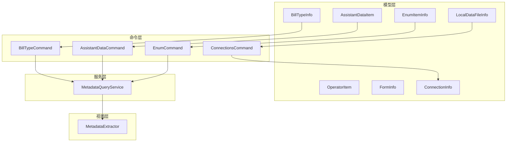
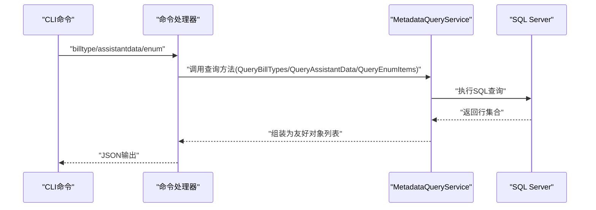
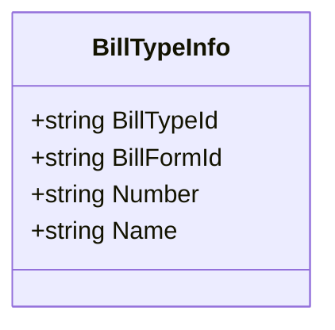
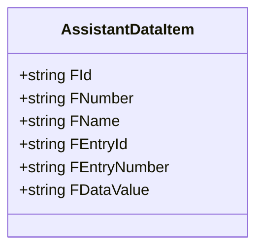
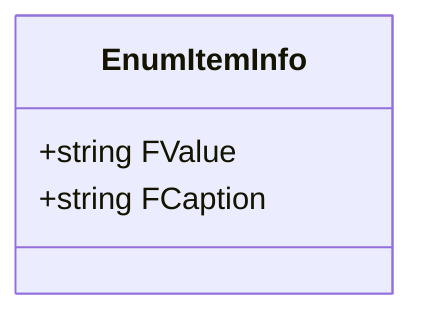
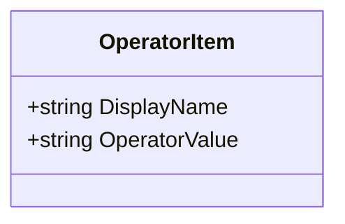
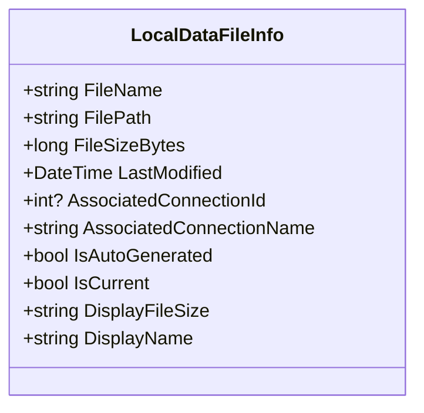
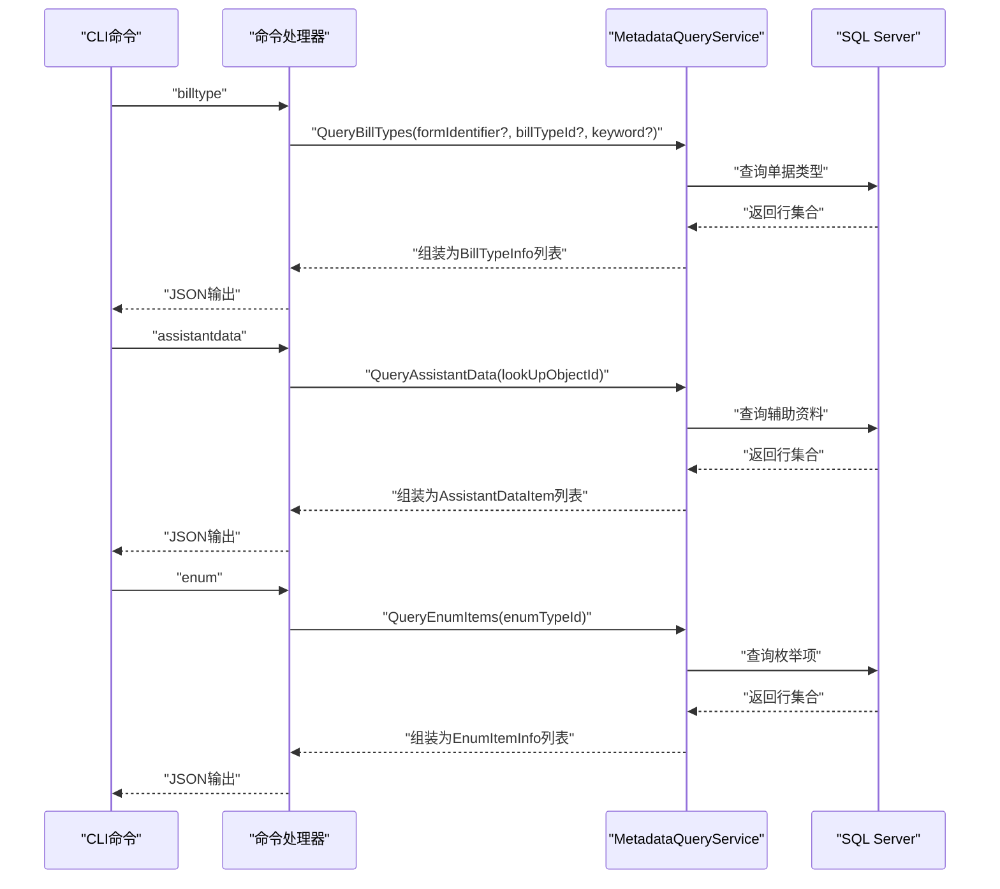
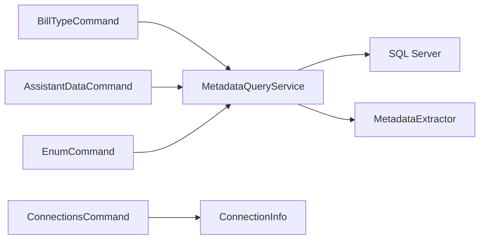

# 业务数据模型

<cite>
**本文引用的文件**
- [BillTypeInfo.cs](file://Models/BillTypeInfo.cs)
- [AssistantDataItem.cs](file://Models/AssistantDataItem.cs)
- [EnumItemInfo.cs](file://Models/EnumItemInfo.cs)
- [OperatorItem.cs](file://Models/OperatorItem.cs)
- [LocalDataFileInfo.cs](file://Models/LocalDataFileInfo.cs)
- [BillTypeCommand.cs](file://K3CloudDataDictionary.Cli/Commands/BillTypeCommand.cs)
- [AssistantDataCommand.cs](file://K3CloudDataDictionary.Cli/Commands/AssistantDataCommand.cs)
- [EnumCommand.cs](file://K3CloudDataDictionary.Cli/Commands/EnumCommand.cs)
- [MetadataQueryService.cs](file://K3CloudDataDictionary.Cli/Services/MetadataQueryService.cs)
- [usage-examples.md](file://docs/usage-examples.md)
- [MetadataExtractor.cs](file://Views/MetadataExtractor.cs)
- [FormInfo.cs](file://Models/FormInfo.cs)
- [ConnectionInfo.cs](file://Models/ConnectionInfo.cs)
- [ConnectionsCommand.cs](file://K3CloudDataDictionary.Cli/Commands/ConnectionsCommand.cs)
</cite>

## 目录
1. [简介](#简介)
2. [项目结构](#项目结构)
3. [核心组件](#核心组件)
4. [架构总览](#架构总览)
5. [详细组件分析](#详细组件分析)
6. [依赖关系分析](#依赖关系分析)
7. [性能考量](#性能考量)
8. [故障排查指南](#故障排查指南)
9. [结论](#结论)
10. [附录](#附录)

## 简介
本文件面向金蝶K3 Cloud数据字典系统，围绕业务数据模型创建全面的API文档，重点覆盖以下模型及其支撑能力：
- 单据类型管理：BillTypeInfo
- 辅助资料查询：AssistantDataItem
- 枚举值管理：EnumItemInfo
- 操作员信息：OperatorItem
- 本地数据文件管理：LocalDataFileInfo

文档将说明各模型的属性定义、业务含义、典型使用场景与最佳实践，并结合CLI命令与服务实现展示真实业务应用流程。

## 项目结构
项目采用“模型-命令-服务-视图”的分层组织方式，模型层提供数据载体，命令层封装CLI命令入口，服务层负责与SQL Server实时查询元数据，视图层负责元数据提取与上下文构建。

图表来源
- [BillTypeCommand.cs:1-66](file://K3CloudDataDictionary.Cli/Commands/BillTypeCommand.cs#L1-L66)
- [AssistantDataCommand.cs:1-65](file://K3CloudDataDictionary.Cli/Commands/AssistantDataCommand.cs#L1-L65)
- [EnumCommand.cs:1-64](file://K3CloudDataDictionary.Cli/Commands/EnumCommand.cs#L1-L64)
- [MetadataQueryService.cs:1-839](file://K3CloudDataDictionary.Cli/Services/MetadataQueryService.cs#L1-L839)
- [MetadataExtractor.cs:1-880](file://Views/MetadataExtractor.cs#L1-L880)
- [FormInfo.cs:1-101](file://Models/FormInfo.cs#L1-L101)
- [ConnectionInfo.cs:1-144](file://Models/ConnectionInfo.cs#L1-L144)
- [ConnectionsCommand.cs:1-231](file://K3CloudDataDictionary.Cli/Commands/ConnectionsCommand.cs#L1-L231)

章节来源
- [BillTypeInfo.cs:1-45](file://Models/BillTypeInfo.cs#L1-L45)
- [AssistantDataItem.cs:1-58](file://Models/AssistantDataItem.cs#L1-L58)
- [EnumItemInfo.cs:1-31](file://Models/EnumItemInfo.cs#L1-L31)
- [OperatorItem.cs:1-9](file://Models/OperatorItem.cs#L1-L9)
- [LocalDataFileInfo.cs:1-67](file://Models/LocalDataFileInfo.cs#L1-L67)
- [BillTypeCommand.cs:1-66](file://K3CloudDataDictionary.Cli/Commands/BillTypeCommand.cs#L1-L66)
- [AssistantDataCommand.cs:1-65](file://K3CloudDataDictionary.Cli/Commands/AssistantDataCommand.cs#L1-L65)
- [EnumCommand.cs:1-64](file://K3CloudDataDictionary.Cli/Commands/EnumCommand.cs#L1-L64)
- [MetadataQueryService.cs:1-839](file://K3CloudDataDictionary.Cli/Services/MetadataQueryService.cs#L1-L839)
- [usage-examples.md:1-542](file://docs/usage-examples.md#L1-L542)
- [MetadataExtractor.cs:1-880](file://Views/MetadataExtractor.cs#L1-L880)
- [FormInfo.cs:1-101](file://Models/FormInfo.cs#L1-L101)
- [ConnectionInfo.cs:1-144](file://Models/ConnectionInfo.cs#L1-L144)
- [ConnectionsCommand.cs:1-231](file://K3CloudDataDictionary.Cli/Commands/ConnectionsCommand.cs#L1-L231)

## 核心组件
本节概述五个业务模型的职责与典型用途：
- BillTypeInfo：承载单据类型的标识、表单标识、编号与名称，用于单据类型管理与查询。
- AssistantDataItem：承载辅助资料的主键、编码、名称、分录标识、分录编码与数据值，用于辅助资料查询与展示。
- EnumItemInfo：承载枚举值与其多语言标题，用于下拉列表与状态字段的枚举值展示。
- OperatorItem：承载操作员显示名与操作值，用于界面显示与交互。
- LocalDataFileInfo：承载本地数据文件的文件名、路径、大小、最后修改时间、是否自动生成、是否当前使用及关联连接信息，用于本地数据文件管理与UI展示。

章节来源
- [BillTypeInfo.cs:1-45](file://Models/BillTypeInfo.cs#L1-L45)
- [AssistantDataItem.cs:1-58](file://Models/AssistantDataItem.cs#L1-L58)
- [EnumItemInfo.cs:1-31](file://Models/EnumItemInfo.cs#L1-L31)
- [OperatorItem.cs:1-9](file://Models/OperatorItem.cs#L1-L9)
- [LocalDataFileInfo.cs:1-67](file://Models/LocalDataFileInfo.cs#L1-L67)

## 架构总览
下图展示了CLI命令到服务层再到数据库查询的整体流程，以及模型在其中的角色定位。

图表来源
- [BillTypeCommand.cs:13-62](file://K3CloudDataDictionary.Cli/Commands/BillTypeCommand.cs#L13-L62)
- [AssistantDataCommand.cs:13-61](file://K3CloudDataDictionary.Cli/Commands/AssistantDataCommand.cs#L13-L61)
- [EnumCommand.cs:13-60](file://K3CloudDataDictionary.Cli/Commands/EnumCommand.cs#L13-L60)
- [MetadataQueryService.cs:569-727](file://K3CloudDataDictionary.Cli/Services/MetadataQueryService.cs#L569-L727)

## 详细组件分析

### 单据类型模型：BillTypeInfo
- 属性定义
  - BillTypeId：单据类型唯一标识
  - BillFormId：所属表单标识
  - Number：单据类型编号
  - Name：单据类型名称
- 业务含义
  - 描述K3 Cloud中某一单据类型的标识与显示信息，常用于单据类型筛选、列表展示与详情查询。
- 使用场景
  - CLI命令“billtype”支持按表单查询列表、按ID查询详情、按关键词模糊搜索，均会返回包含上述字段的结果。
- 最佳实践
  - 在前端展示时，建议同时显示Number与Name，便于用户识别。
  - 若需描述信息，可在查询时补充描述字段（服务端查询包含描述列）。

图表来源
- [BillTypeInfo.cs:6-43](file://Models/BillTypeInfo.cs#L6-L43)

章节来源
- [BillTypeInfo.cs:1-45](file://Models/BillTypeInfo.cs#L1-L45)
- [BillTypeCommand.cs:13-62](file://K3CloudDataDictionary.Cli/Commands/BillTypeCommand.cs#L13-L62)
- [MetadataQueryService.cs:569-630](file://K3CloudDataDictionary.Cli/Services/MetadataQueryService.cs#L569-L630)

### 辅助资料模型：AssistantDataItem
- 属性定义
  - FId：辅助资料主键
  - FNumber：辅助资料编码
  - FName：辅助资料名称
  - FEntryId：分录标识
  - FEntryNumber：分录编码
  - FDataValue：分录数据值
- 业务含义
  - 描述辅助资料的主记录与分录明细，常用于下拉选择与明细展示。
- 使用场景
  - CLI命令“assistantdata”按lookUpObject查询辅助资料列表，返回上述字段。
- 最佳实践
  - 在UI中优先展示FNumber与FName，分录场景展示FEntryNumber与FDataValue。
  - 结合字段的elementType=30与lookUpObject进行关联查询。

图表来源
- [AssistantDataItem.cs:6-55](file://Models/AssistantDataItem.cs#L6-L55)

章节来源
- [AssistantDataItem.cs:1-58](file://Models/AssistantDataItem.cs#L1-L58)
- [AssistantDataCommand.cs:13-61](file://K3CloudDataDictionary.Cli/Commands/AssistantDataCommand.cs#L13-L61)
- [MetadataQueryService.cs:636-679](file://K3CloudDataDictionary.Cli/Services/MetadataQueryService.cs#L636-L679)

### 枚举值模型：EnumItemInfo
- 属性定义
  - FValue：枚举值
  - FCaption：枚举标题（多语言）
- 业务含义
  - 描述下拉列表或状态字段的枚举项，用于UI渲染与用户选择。
- 使用场景
  - CLI命令“enum”按enumType查询枚举值列表，返回包含FValue与FCaption的数据。
- 最佳实践
  - 在展示时优先使用FCaption，确保本地化显示。
  - 与字段的elementType=9配合使用，明确枚举类型。

图表来源
- [EnumItemInfo.cs:6-28](file://Models/EnumItemInfo.cs#L6-L28)

章节来源
- [EnumItemInfo.cs:1-31](file://Models/EnumItemInfo.cs#L1-L31)
- [EnumCommand.cs:13-60](file://K3CloudDataDictionary.Cli/Commands/EnumCommand.cs#L13-L60)
- [MetadataQueryService.cs:685-726](file://K3CloudDataDictionary.Cli/Services/MetadataQueryService.cs#L685-L726)

### 操作员模型：OperatorItem
- 属性定义
  - DisplayName：显示名
  - OperatorValue：操作员值
- 业务含义
  - 用于界面展示与交互，标识操作员身份或操作值。
- 使用场景
  - 在UI中展示操作员信息，或在业务流程中传递操作员标识。
- 最佳实践
  - 保持DisplayName简洁易懂，OperatorValue与后端约定一致。

图表来源
- [OperatorItem.cs:3-7](file://Models/OperatorItem.cs#L3-L7)

章节来源
- [OperatorItem.cs:1-9](file://Models/OperatorItem.cs#L1-L9)

### 本地数据文件模型：LocalDataFileInfo
- 属性定义
  - FileName：文件名
  - FilePath：文件路径
  - FileSizeBytes：文件大小（字节）
  - LastModified：最后修改时间
  - AssociatedConnectionId：关联连接ID（自动生成文件时有效）
  - AssociatedConnectionName：关联连接显示名（含数据库名）
  - IsAutoGenerated：是否自动生成
  - IsCurrent：是否当前使用（UI显示）
  - DisplayFileSize：人性化显示的文件大小（KB/MB）
  - DisplayName：显示名（自动生成文件时使用关联连接名）
- 业务含义
  - 描述本地数据文件的元信息与关联关系，支撑本地数据文件的管理与切换。
- 使用场景
  - CLI命令“connections”管理连接与本地数据文件，结合该模型进行UI展示与操作。
- 最佳实践
  - 自动化生成的文件建议保留关联连接信息，便于溯源与维护。
  - UI中优先展示DisplayName与DisplayFileSize，提升可读性。

图表来源
- [LocalDataFileInfo.cs:7-64](file://Models/LocalDataFileInfo.cs#L7-L64)

章节来源
- [LocalDataFileInfo.cs:1-67](file://Models/LocalDataFileInfo.cs#L1-L67)
- [ConnectionsCommand.cs:45-74](file://K3CloudDataDictionary.Cli/Commands/ConnectionsCommand.cs#L45-L74)

### 模型在查询流程中的角色
- 单据类型查询流程
  - CLI命令“billtype”调用服务层方法，查询T_BAS_BILLTYPE与T_BAS_BILLTYPE_L，组装为包含BillTypeId、BillFormId、Number、Name与描述的列表。
- 辅助资料查询流程
  - CLI命令“assistantdata”调用服务层方法，查询T_BAS_ASSISTANTDATA、T_BAS_ASSISTANTDATA_L、T_BAS_ASSISTANTDATAENTRY、T_BAS_ASSISTANTDATAENTRY_L，组装为包含FId、FNumber、FName、FEntryId、FEntryNumber、FDataValue的列表。
- 枚举值查询流程
  - CLI命令“enum”调用服务层方法，查询T_META_FORMENUM、T_META_FORMENUM_L、T_META_FORMENUMITEM、T_META_FORMENUMITEM_L，组装为包含FID、FNAME、FVALUE、FENUMID、FCAPTION的列表。

图表来源
- [BillTypeCommand.cs:13-62](file://K3CloudDataDictionary.Cli/Commands/BillTypeCommand.cs#L13-L62)
- [AssistantDataCommand.cs:13-61](file://K3CloudDataDictionary.Cli/Commands/AssistantDataCommand.cs#L13-L61)
- [EnumCommand.cs:13-60](file://K3CloudDataDictionary.Cli/Commands/EnumCommand.cs#L13-L60)
- [MetadataQueryService.cs:569-727](file://K3CloudDataDictionary.Cli/Services/MetadataQueryService.cs#L569-L727)

章节来源
- [BillTypeCommand.cs:1-66](file://K3CloudDataDictionary.Cli/Commands/BillTypeCommand.cs#L1-L66)
- [AssistantDataCommand.cs:1-65](file://K3CloudDataDictionary.Cli/Commands/AssistantDataCommand.cs#L1-L65)
- [EnumCommand.cs:1-64](file://K3CloudDataDictionary.Cli/Commands/EnumCommand.cs#L1-L64)
- [MetadataQueryService.cs:569-727](file://K3CloudDataDictionary.Cli/Services/MetadataQueryService.cs#L569-L727)

### 实际业务应用示例与最佳实践
- 单据类型查询
  - 场景：字段elementType=44（单据类型字段）时，通过“billtype”命令按表单、ID或关键词查询单据类型列表与详情。
  - 示例参考：[usage-examples.md:161-232](file://docs/usage-examples.md#L161-L232)
- 辅助资料查询
  - 场景：字段elementType=30（辅助资料字段）时，先通过字段查询获取lookUpObject，再用“assistantdata”命令查询辅助资料选项列表。
  - 示例参考：[usage-examples.md:234-276](file://docs/usage-examples.md#L234-L276)
- 枚举值查询
  - 场景：字段elementType=9（下拉列表字段）时，通过字段查询获取enumType，再用“enum”命令查询枚举值列表。
  - 示例参考：[usage-examples.md:278-326](file://docs/usage-examples.md#L278-L326)
- 本地数据文件管理
  - 场景：通过“connections”命令管理连接与本地数据文件，结合LocalDataFileInfo进行展示与切换。
  - 示例参考：[usage-examples.md:515-528](file://docs/usage-examples.md#L515-L528)

章节来源
- [usage-examples.md:1-542](file://docs/usage-examples.md#L1-L542)
- [BillTypeCommand.cs:1-66](file://K3CloudDataDictionary.Cli/Commands/BillTypeCommand.cs#L1-L66)
- [AssistantDataCommand.cs:1-65](file://K3CloudDataDictionary.Cli/Commands/AssistantDataCommand.cs#L1-L65)
- [EnumCommand.cs:1-64](file://K3CloudDataDictionary.Cli/Commands/EnumCommand.cs#L1-L64)
- [ConnectionsCommand.cs:1-231](file://K3CloudDataDictionary.Cli/Commands/ConnectionsCommand.cs#L1-L231)

## 依赖关系分析
- 模型与命令的关系
  - 命令层通过服务层查询数据库，将结果映射为模型对象，再统一输出为JSON。
- 服务层与数据库的关系
  - 服务层直接连接SQL Server执行查询，元数据上下文与提取器用于复杂场景的XML解析与合并。
- 本地数据文件与连接的关系
  - LocalDataFileInfo与ConnectionInfo共同支撑本地数据文件的管理与切换。

图表来源
- [BillTypeCommand.cs:1-66](file://K3CloudDataDictionary.Cli/Commands/BillTypeCommand.cs#L1-L66)
- [AssistantDataCommand.cs:1-65](file://K3CloudDataDictionary.Cli/Commands/AssistantDataCommand.cs#L1-L65)
- [EnumCommand.cs:1-64](file://K3CloudDataDictionary.Cli/Commands/EnumCommand.cs#L1-L64)
- [MetadataQueryService.cs:1-839](file://K3CloudDataDictionary.Cli/Services/MetadataQueryService.cs#L1-L839)
- [MetadataExtractor.cs:1-880](file://Views/MetadataExtractor.cs#L1-L880)
- [ConnectionsCommand.cs:1-231](file://K3CloudDataDictionary.Cli/Commands/ConnectionsCommand.cs#L1-L231)
- [ConnectionInfo.cs:1-144](file://Models/ConnectionInfo.cs#L1-L144)

章节来源
- [MetadataQueryService.cs:1-839](file://K3CloudDataDictionary.Cli/Services/MetadataQueryService.cs#L1-L839)
- [MetadataExtractor.cs:1-880](file://Views/MetadataExtractor.cs#L1-L880)
- [ConnectionInfo.cs:1-144](file://Models/ConnectionInfo.cs#L1-L144)
- [ConnectionsCommand.cs:1-231](file://K3CloudDataDictionary.Cli/Commands/ConnectionsCommand.cs#L1-L231)

## 性能考量
- 查询优化
  - 服务层对SQL查询设置合理的CommandTimeout，避免长时间阻塞。
  - 对于大量结果的场景，建议限制返回数量或增加分页机制。
- 元数据提取
  - 元数据上下文与提取器采用批量化加载与合并策略，减少重复查询与内存占用。
- UI展示
  - LocalDataFileInfo提供DisplayFileSize与DisplayName，降低前端格式化开销。

## 故障排查指南
- 常见错误与处理
  - 参数缺失：命令参数校验失败时，返回错误信息并提示帮助。
  - 数据库连接异常：检查连接字符串与网络连通性。
  - 查询超时：适当调整CommandTimeout或优化查询条件。
- 日志与诊断
  - 服务层在提取元数据或执行查询时输出错误日志，便于定位问题。

章节来源
- [BillTypeCommand.cs:29-34](file://K3CloudDataDictionary.Cli/Commands/BillTypeCommand.cs#L29-L34)
- [AssistantDataCommand.cs:25-31](file://K3CloudDataDictionary.Cli/Commands/AssistantDataCommand.cs#L25-L31)
- [EnumCommand.cs:25-31](file://K3CloudDataDictionary.Cli/Commands/EnumCommand.cs#L25-L31)
- [MetadataQueryService.cs:31-36](file://K3CloudDataDictionary.Cli/Services/MetadataQueryService.cs#L31-L36)

## 结论
本文档系统梳理了金蝶K3 Cloud数据字典系统中的五类业务模型及其在CLI命令与服务层中的应用，明确了属性定义、业务含义、使用场景与最佳实践，并提供了基于真实示例的业务流程参考。通过合理使用这些模型与命令，可以高效完成单据类型、辅助资料、枚举值、操作员与本地数据文件的管理与查询任务。

## 附录
- 相关命令与模型对照
  - billtype ↔ BillTypeInfo
  - assistantdata ↔ AssistantDataItem
  - enum ↔ EnumItemInfo
  - connections ↔ LocalDataFileInfo（配合ConnectionInfo）

章节来源
- [usage-examples.md:515-528](file://docs/usage-examples.md#L515-L528)
- [FormInfo.cs:1-101](file://Models/FormInfo.cs#L1-L101)
- [ConnectionInfo.cs:1-144](file://Models/ConnectionInfo.cs#L1-L144)
- [ConnectionsCommand.cs:1-231](file://K3CloudDataDictionary.Cli/Commands/ConnectionsCommand.cs#L1-L231)