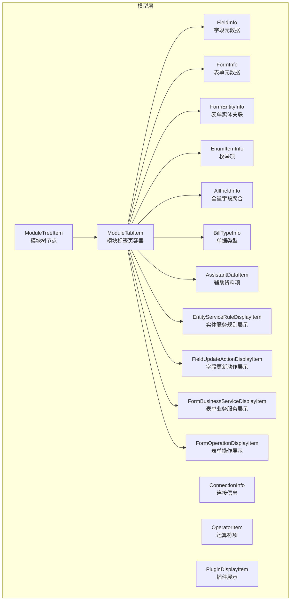
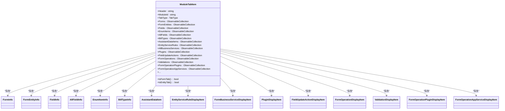
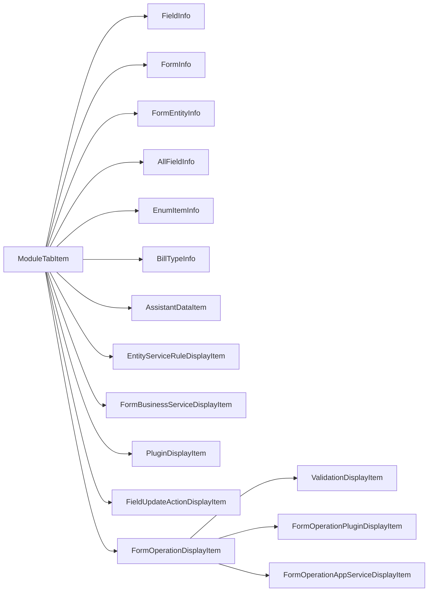
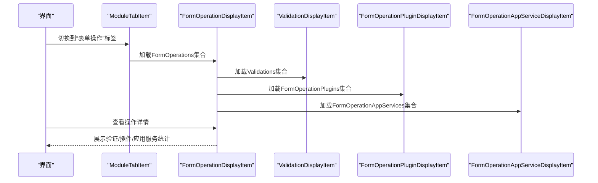
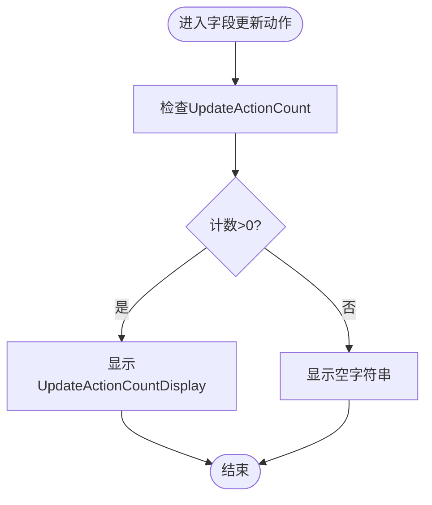
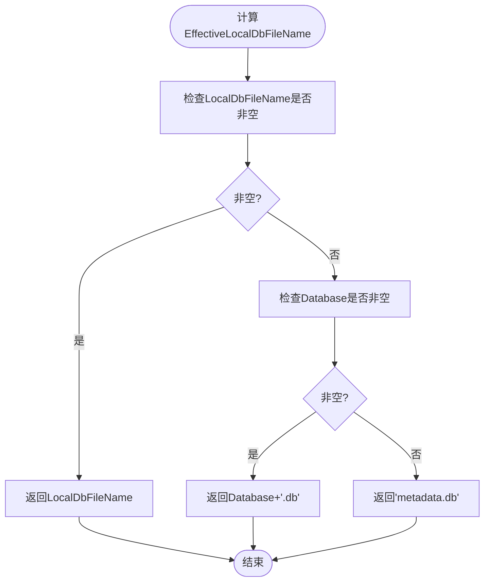
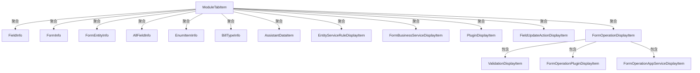

# 数据模型API

<cite>
**本文引用的文件**
- [FieldInfo.cs](file://Models/FieldInfo.cs)
- [FormInfo.cs](file://Models/FormInfo.cs)
- [ConnectionInfo.cs](file://Models/ConnectionInfo.cs)
- [BillTypeInfo.cs](file://Models/BillTypeInfo.cs)
- [AssistantDataItem.cs](file://Models/AssistantDataItem.cs)
- [EnumItemInfo.cs](file://Models/EnumItemInfo.cs)
- [AllFieldInfo.cs](file://Models/AllFieldInfo.cs)
- [FormEntityInfo.cs](file://Models/FormEntityInfo.cs)
- [EntityServiceRuleDisplayItem.cs](file://Models/EntityServiceRuleDisplayItem.cs)
- [FieldUpdateActionDisplayItem.cs](file://Models/FieldUpdateActionDisplayItem.cs)
- [FormBusinessServiceDisplayItem.cs](file://Models/FormBusinessServiceDisplayItem.cs)
- [FormOperationDisplayItem.cs](file://Models/FormOperationDisplayItem.cs)
- [OperatorItem.cs](file://Models/OperatorItem.cs)
- [PluginDisplayItem.cs](file://Models/PluginDisplayItem.cs)
- [ModuleTreeItem.cs](file://Models/ModuleTreeItem.cs)
- [ModuleTabItem.cs](file://Models/ModuleTabItem.cs)
</cite>

## 目录
1. [简介](#简介)
2. [项目结构](#项目结构)
3. [核心组件](#核心组件)
4. [架构总览](#架构总览)
5. [详细组件分析](#详细组件分析)
6. [依赖分析](#依赖分析)
7. [性能考虑](#性能考虑)
8. [故障排查指南](#故障排查指南)
9. [结论](#结论)
10. [附录](#附录)

## 简介
本文件为金蝶K3 Cloud数据字典系统中的数据模型API参考文档，聚焦于核心数据模型类的属性定义、数据类型、字段说明与使用场景。重点覆盖以下模型：
- FieldInfo：字段元数据
- FormInfo：表单元数据
- ConnectionInfo：连接信息
- BillTypeInfo：单据类型
- AssistantDataItem：辅助资料项
- EnumItemInfo：枚举项
- AllFieldInfo：全量字段聚合
- FormEntityInfo：表单实体关联
- EntityServiceRuleDisplayItem：实体服务规则展示
- FieldUpdateActionDisplayItem：字段更新动作展示
- FormBusinessServiceDisplayItem：表单业务服务展示
- FormOperationDisplayItem：表单操作展示及子项
- OperatorItem：运算符项
- PluginDisplayItem：插件展示
- ModuleTreeItem：模块树节点
- ModuleTabItem：模块标签页容器

文档同时说明模型间的关系、继承结构与组合模式，并提供实例化建议、属性访问方式、序列化注意事项、数据验证规则与最佳实践。

## 项目结构
模型层采用分层与按职责划分的组织方式，核心模型位于 Models 目录，统一实现 INotifyPropertyChanged 接口以支持UI绑定与变更通知。

图表来源
- [ModuleTabItem.cs:1-196](file://Models/ModuleTabItem.cs#L1-L196)
- [ModuleTreeItem.cs:1-60](file://Models/ModuleTreeItem.cs#L1-L60)

章节来源
- [ModuleTabItem.cs:1-196](file://Models/ModuleTabItem.cs#L1-L196)
- [ModuleTreeItem.cs:1-60](file://Models/ModuleTreeItem.cs#L1-L60)

## 核心组件
本节对关键模型进行逐项说明，包括属性定义、数据类型、字段含义与典型使用场景。

- FieldInfo（字段元数据）
  - 属性要点
    - Key：字符串，唯一键
    - Name：字符串，显示名称
    - FieldName：字符串，物理字段名
    - PropertyName：字符串，属性映射名
    - ElementTypeName：字符串，元素类型名
    - Suffix：字符串，后缀
    - SplitDescription：字符串，拆分描述
    - LookUpObjectID：字符串，查找对象ID
    - EnumType：字符串，枚举类型
    - LookUpObjectDisplay：字符串，查找对象显示名
    - EnumTypeDisplay：字符串，枚举类型显示名
    - UpdateActionCount：整数，更新动作计数
    - UpdateActionCountDisplay：只读字符串，计数显示或空
    - FieldDbId：字符串，数据库字段标识
  - 使用场景
    - 字段级元数据查询与展示
    - 字段与实体/表单的映射关系
    - 字段更新动作统计与可视化
  - 序列化建议
    - JSON序列化时保持属性命名一致，注意布尔/数值字段的空值处理
  - 验证规则
    - Key/FieldName/PropertyName应唯一且非空
    - UpdateActionCount非负
  - 最佳实践
    - 通过UpdateActionCountDisplay进行UI条件渲染
    - 结合LookUpObjectID/EnumType进行字段类型扩展解析

- FormInfo（表单元数据）
  - 属性要点
    - FormId：字符串，表单ID
    - FormIdentifier：字符串，表单标识
    - FormName：字符串，表单名称
    - ModelTypeName：字符串，模型类型名
    - SubSystemName：字符串，子系统名
    - FormPluginCount：整数，表单插件数量
    - ListPluginCount：整数，列表插件数量
    - BuilderPluginCount：整数，构建插件数量
    - UpdateActionCount：整数，更新动作数量
    - ServiceRuleCount：整数，服务规则数量
    - FormOperationCount：整数，表单操作数量
    - 各计数均提供对应Display属性用于UI显示
  - 使用场景
    - 表单概览与能力统计
    - 插件与服务规则的可视化
  - 序列化建议
    - 计数字段在未启用时返回空字符串，前端需做空值判断
  - 验证规则
    - 所有计数非负
  - 最佳实践
    - 使用Display属性进行条件渲染，避免直接显示数字0

- ConnectionInfo（连接信息）
  - 属性要点
    - Id：整数，内部标识
    - Name：字符串，连接名称
    - ServerIp：字符串，服务器IP
    - Port：整数，端口
    - UserName：字符串，用户名
    - Password：字符串，密码
    - Database：字符串，数据库名
    - IsDefault：布尔，是否默认
    - LocalDbFileName：字符串，本地数据库文件名
    - IsCurrent：布尔，当前选中（仅UI，不持久化）
    - EffectiveLocalDbFileName：只读，实际本地文件名（优先LocalDbFileName，否则基于Database生成）
    - ConnectionString：只读，SQL连接串
    - DisplayName：只读，显示名（Name+Database或IP:Port）
    - Clone()：克隆当前连接配置
  - 使用场景
    - 连接管理与切换
    - 本地SQLite文件选择策略
  - 序列化建议
    - 密码字段避免序列化到日志或持久化存储
  - 验证规则
    - ServerIp/Database非空校验
    - Port范围校验
  - 最佳实践
    - 通过EffectiveLocalDbFileName统一本地文件名生成逻辑
    - 使用Clone()复制配置，避免直接修改原对象

- BillTypeInfo（单据类型）
  - 属性要点
    - BillTypeId：字符串，单据类型ID
    - BillFormId：字符串，单据表单ID
    - Number：字符串，编号
    - Name：字符串，名称
  - 使用场景
    - 单据类型与表单的关联查询
  - 序列化建议
    - 保持字符串类型一致性
  - 验证规则
    - BillTypeId/Number唯一性
  - 最佳实践
    - 与FormInfo结合用于单据类型到表单的映射

- AssistantDataItem（辅助资料项）
  - 属性要点
    - FId：字符串，主键
    - FNumber：字符串，编号
    - FName：字符串，名称
    - FEntryId：字符串，分录ID
    - FEntryNumber：字符串，分录编号
    - FDataValue：字符串，数据值
  - 使用场景
    - 辅助资料的查询与展示
  - 序列化建议
    - 注意FEntryId/FEntryNumber与主表/分录的关联
  - 验证规则
    - FId唯一
  - 最佳实践
    - 与业务实体结合进行数据联动

- EnumItemInfo（枚举项）
  - 属性要点
    - FValue：字符串，枚举值
    - FCaption：字符串，枚举显示名
  - 使用场景
    - 枚举值与显示名的映射
  - 序列化建议
    - 保持键值对一致性
  - 验证规则
    - FValue唯一
  - 最佳实践
    - 与FieldInfo的EnumType/EnumTypeDisplay配合使用

- AllFieldInfo（全量字段聚合）
  - 属性要点
    - FormName/EntityName/EntityTableName：字符串，表单/实体/表名
    - Key/Name/FieldName/PropertyName/ElementTypeName：字符串
    - LookUpObjectID/EnumType/LookUpObjectDisplay/EnumTypeDisplay：字符串
    - Suffix/SplitDescription：字符串
    - UpdateActionCount：整数
    - UpdateActionCountDisplay：只读
    - FieldDbId：字符串
  - 使用场景
    - 跨实体/表单的字段聚合查询
  - 序列化建议
    - 与FieldInfo一致的序列化策略
  - 验证规则
    - 与FieldInfo相同的字段约束
  - 最佳实践
    - 作为跨维度检索的中间层

- FormEntityInfo（表单实体关联）
  - 属性要点
    - IsSelected：布尔，是否选中
    - FormId/EntityId/FormIdentifier/FormName/FormModelType：字符串
    - EntityKey/EntityEntryName/EntityName/EntityTableName：字符串
    - EntityEntryPkFieldName/EntityElementTypeName：字符串
    - ServiceRuleCount/UpdateActionCount：整数
    - 对应Display属性用于UI显示
  - 使用场景
    - 表单与实体的关联关系展示
  - 序列化建议
    - 布尔字段注意序列化为true/false
  - 验证规则
    - 所有计数非负
  - 最佳实践
    - 通过IsSelected控制UI交互状态

- EntityServiceRuleDisplayItem（实体服务规则展示）
  - 属性要点
    - DbId：整数，数据库ID
    - Description/IsEnabled/PreCondition/PreConditionDesc：字符串
    - EntityName：字符串，实体名
    - WhenTrueServices/WhenFalseServices：字符串，条件分支服务集合
  - 使用场景
    - 服务规则的条件与分支展示
  - 序列化建议
    - 服务集合可采用JSON数组或逗号分隔字符串
  - 验证规则
    - DbId唯一
  - 最佳实践
    - 与FormEntityInfo结合定位规则作用范围

- FieldUpdateActionDisplayItem（字段更新动作展示）
  - 属性要点
    - ActionId/ActionDesc/Description/Parameters/IsForbidden：字符串
    - PreCondition/PreConditionDesc：字符串
    - FieldName/FieldDisplayName：字符串
  - 使用场景
    - 字段更新动作的条件与参数展示
  - 序列化建议
    - Parameters建议采用JSON对象
  - 验证规则
    - ActionId唯一
  - 最佳实践
    - 与FieldInfo结合进行字段级动作控制

- FormBusinessServiceDisplayItem（表单业务服务展示）
  - 属性要点
    - ServiceType/ServiceTypeName/ActionId/Description/Parameters：字符串
  - 使用场景
    - 表单业务服务的类型与参数展示
  - 序列化建议
    - Parameters建议采用JSON对象
  - 验证规则
    - ServiceType唯一
  - 最佳实践
    - 与FormInfo结合进行服务能力展示

- FormOperationDisplayItem（表单操作展示）
  - 主体类属性
    - Operation/OperationName：字符串
    - FormOperationDbId：整数
    - ValidationCount/ServicePluginCount/AppServiceCount：整数
    - 对应Display属性用于UI显示
  - 子类
    - ValidationDisplayItem：验证项展示
      - ErrorMessage/Description/IsUsed/OperationName/ValidationTypeName：字符串
    - FormOperationPluginDisplayItem：操作插件展示
      - ClassName/IsEnabled/OperationName：字符串
    - FormOperationAppServiceDisplayItem：操作应用服务展示
      - Description/OperationName/IsForbidden：字符串
  - 使用场景
    - 表单操作的验证、插件与应用服务的综合展示
  - 序列化建议
    - 子类属性与主体一致
  - 验证规则
    - 各计数非负
  - 最佳实践
    - 通过Display属性进行条件渲染

- OperatorItem（运算符项）
  - 属性要点
    - DisplayName：字符串，显示名
    - OperatorValue：字符串，运算符值
  - 使用场景
    - 查询条件中的运算符选择
  - 序列化建议
    - 保持键值对一致性
  - 验证规则
    - 无特殊约束
  - 最佳实践
    - 与SearchCommand结合使用

- PluginDisplayItem（插件展示）
  - 属性要点
    - PluginType/ClassName/IsEnabled：字符串
    - PluginTypeDisplay：只读，根据PluginType映射中文显示
  - 使用场景
    - 插件类型的分类展示
  - 序列化建议
    - PluginType与Display保持一致
  - 验证规则
    - 无特殊约束
  - 最佳实践
    - 通过PluginTypeDisplay进行UI分类

- ModuleTreeItem（模块树节点）
  - 属性要点
    - Id/Text/ParentId：字符串
    - IsExpanded/IsSelected：布尔
    - Children：ObservableCollection<ModuleTreeItem>
  - 使用场景
    - 模块树的展开/折叠与选择
  - 序列化建议
    - 注意递归结构的序列化与反序列化
  - 验证规则
    - 无特殊约束
  - 最佳实践
    - 与ModuleTabItem结合进行模块导航

- ModuleTabItem（模块标签页容器）
  - 属性要点
    - Header/ModuleId：字符串
    - TabType：枚举（Form/Entity/Field/Enum/AllFields/BillType/AssistantData/EntityServiceRule/EntityServiceRuleDetail/Plugin/FieldUpdateAction/FormOperation/Validation/FormOperationPlugin/FormOperationAppService）
    - 各集合属性：Forms/FormEntities/Fields/EnumItems/AllFields/BillTypes/AssistantDataItems/EntityServiceRules/AllBusinessServices/Plugins/FieldUpdateActions/FormOperations/Validations/FormOperationPlugins/FormOperationAppServices
    - IsXxxTab：布尔，根据TabType判断当前标签页类型
    - IsSelected/IsMouseOver：布尔
  - 使用场景
    - 多标签页的数据字典浏览与筛选
  - 序列化建议
    - 集合属性按类型分别序列化
  - 验证规则
    - TabType与各集合属性匹配
  - 最佳实践
    - 通过IsXxxTab简化UI分支逻辑

章节来源
- [FieldInfo.cs:1-110](file://Models/FieldInfo.cs#L1-L110)
- [FormInfo.cs:1-101](file://Models/FormInfo.cs#L1-L101)
- [ConnectionInfo.cs:1-144](file://Models/ConnectionInfo.cs#L1-L144)
- [BillTypeInfo.cs:1-45](file://Models/BillTypeInfo.cs#L1-L45)
- [AssistantDataItem.cs:1-58](file://Models/AssistantDataItem.cs#L1-L58)
- [EnumItemInfo.cs:1-31](file://Models/EnumItemInfo.cs#L1-L31)
- [AllFieldInfo.cs:1-50](file://Models/AllFieldInfo.cs#L1-L50)
- [FormEntityInfo.cs:1-118](file://Models/FormEntityInfo.cs#L1-L118)
- [EntityServiceRuleDisplayItem.cs:1-72](file://Models/EntityServiceRuleDisplayItem.cs#L1-L72)
- [FieldUpdateActionDisplayItem.cs:1-80](file://Models/FieldUpdateActionDisplayItem.cs#L1-L80)
- [FormBusinessServiceDisplayItem.cs:1-51](file://Models/FormBusinessServiceDisplayItem.cs#L1-L51)
- [FormOperationDisplayItem.cs:1-169](file://Models/FormOperationDisplayItem.cs#L1-L169)
- [OperatorItem.cs:1-9](file://Models/OperatorItem.cs#L1-L9)
- [PluginDisplayItem.cs:1-51](file://Models/PluginDisplayItem.cs#L1-L51)
- [ModuleTreeItem.cs:1-60](file://Models/ModuleTreeItem.cs#L1-L60)
- [ModuleTabItem.cs:1-196](file://Models/ModuleTabItem.cs#L1-L196)

## 架构总览
下图展示了模块标签页与核心模型之间的组合关系，以及部分展示模型与业务模型的映射。

图表来源
- [ModuleTabItem.cs:1-196](file://Models/ModuleTabItem.cs#L1-L196)
- [FormInfo.cs:1-101](file://Models/FormInfo.cs#L1-L101)
- [FormEntityInfo.cs:1-118](file://Models/FormEntityInfo.cs#L1-L118)
- [FieldInfo.cs:1-110](file://Models/FieldInfo.cs#L1-L110)
- [AllFieldInfo.cs:1-50](file://Models/AllFieldInfo.cs#L1-L50)
- [EnumItemInfo.cs:1-31](file://Models/EnumItemInfo.cs#L1-L31)
- [BillTypeInfo.cs:1-45](file://Models/BillTypeInfo.cs#L1-L45)
- [AssistantDataItem.cs:1-58](file://Models/AssistantDataItem.cs#L1-L58)
- [EntityServiceRuleDisplayItem.cs:1-72](file://Models/EntityServiceRuleDisplayItem.cs#L1-L72)
- [FormBusinessServiceDisplayItem.cs:1-51](file://Models/FormBusinessServiceDisplayItem.cs#L1-L51)
- [PluginDisplayItem.cs:1-51](file://Models/PluginDisplayItem.cs#L1-L51)
- [FieldUpdateActionDisplayItem.cs:1-80](file://Models/FieldUpdateActionDisplayItem.cs#L1-L80)
- [FormOperationDisplayItem.cs:1-169](file://Models/FormOperationDisplayItem.cs#L1-L169)

## 详细组件分析

### 字段模型关系与组合模式
- 组合模式
  - ModuleTabItem聚合多种模型集合，形成“容器-内容”关系
  - FormOperationDisplayItem内嵌多个子展示模型，形成“复合展示”
- 关系图

图表来源
- [ModuleTabItem.cs:1-196](file://Models/ModuleTabItem.cs#L1-L196)
- [FormOperationDisplayItem.cs:1-169](file://Models/FormOperationDisplayItem.cs#L1-L169)

章节来源
- [ModuleTabItem.cs:1-196](file://Models/ModuleTabItem.cs#L1-L196)
- [FormOperationDisplayItem.cs:1-169](file://Models/FormOperationDisplayItem.cs#L1-L169)

### 表单操作流程（序列图）
该序列图展示表单操作的典型调用链，从ModuleTabItem到FormOperationDisplayItem及其子项。

图表来源
- [ModuleTabItem.cs:1-196](file://Models/ModuleTabItem.cs#L1-L196)
- [FormOperationDisplayItem.cs:1-169](file://Models/FormOperationDisplayItem.cs#L1-L169)

章节来源
- [ModuleTabItem.cs:1-196](file://Models/ModuleTabItem.cs#L1-L196)
- [FormOperationDisplayItem.cs:1-169](file://Models/FormOperationDisplayItem.cs#L1-L169)

### 字段更新动作决策流程（流程图）
该流程图展示字段更新动作的条件判断与显示逻辑。

图表来源
- [FieldInfo.cs:88-94](file://Models/FieldInfo.cs#L88-L94)

章节来源
- [FieldInfo.cs:88-94](file://Models/FieldInfo.cs#L88-L94)

### 连接信息有效性判定（流程图）
该流程图展示EffectiveLocalDbFileName的判定逻辑。

图表来源
- [ConnectionInfo.cs:86-96](file://Models/ConnectionInfo.cs#L86-L96)

章节来源
- [ConnectionInfo.cs:86-96](file://Models/ConnectionInfo.cs#L86-L96)

## 依赖分析
- 内聚性
  - 各模型围绕单一职责设计，如FieldInfo专注字段元数据，FormInfo专注表单元数据
- 耦合度
  - ModuleTabItem作为容器聚合多模型，耦合度较高但职责清晰
  - FormOperationDisplayItem通过子类实现功能扩展，降低主类复杂度
- 可能的循环依赖
  - 当前模型均为数据传输对象，不存在循环依赖风险
- 外部依赖
  - 所有模型实现INotifyPropertyChanged接口，依赖UI框架的绑定机制

图表来源
- [ModuleTabItem.cs:1-196](file://Models/ModuleTabItem.cs#L1-L196)
- [FormOperationDisplayItem.cs:1-169](file://Models/FormOperationDisplayItem.cs#L1-L169)

章节来源
- [ModuleTabItem.cs:1-196](file://Models/ModuleTabItem.cs#L1-L196)
- [FormOperationDisplayItem.cs:1-169](file://Models/FormOperationDisplayItem.cs#L1-L169)

## 性能考虑
- 属性变更通知
  - 所有模型实现INotifyPropertyChanged，频繁设置属性会触发多次通知，建议批量赋值后统一刷新
- 集合大小
  - ModuleTabItem包含大量ObservableCollection，建议在大数据量场景下延迟加载与虚拟化展示
- 显示逻辑
  - Display属性基于计数生成，避免重复计算可在UI层缓存
- 序列化
  - 大型集合序列化时注意内存占用，建议分页或流式输出

## 故障排查指南
- 字段显示异常
  - 检查UpdateActionCountDisplay的计数逻辑，确认是否为0导致显示为空
  - 参考路径：[FieldInfo.cs:88-94](file://Models/FieldInfo.cs#L88-L94)
- 连接文件名错误
  - 检查EffectiveLocalDbFileName的判定顺序，确认LocalDbFileName与Database的优先级
  - 参考路径：[ConnectionInfo.cs:86-96](file://Models/ConnectionInfo.cs#L86-L96)
- 插件类型显示不正确
  - 检查PluginTypeDisplay的映射逻辑，确保PluginType值符合预期
  - 参考路径：[PluginDisplayItem.cs:30-42](file://Models/PluginDisplayItem.cs#L30-L42)
- 表单操作统计为0
  - 检查FormOperationDisplayItem的计数字段是否正确加载
  - 参考路径：[FormOperationDisplayItem.cs:33-49](file://Models/FormOperationDisplayItem.cs#L33-L49)

章节来源
- [FieldInfo.cs:88-94](file://Models/FieldInfo.cs#L88-L94)
- [ConnectionInfo.cs:86-96](file://Models/ConnectionInfo.cs#L86-L96)
- [PluginDisplayItem.cs:30-42](file://Models/PluginDisplayItem.cs#L30-L42)
- [FormOperationDisplayItem.cs:33-49](file://Models/FormOperationDisplayItem.cs#L33-L49)

## 结论
本文档系统梳理了金蝶K3 Cloud数据字典系统的核心数据模型，明确了各模型的属性定义、数据类型、使用场景与最佳实践。通过ModuleTabItem的聚合与FormOperationDisplayItem的复合展示，实现了从表单到字段、枚举、辅助资料、服务规则与操作的全链路数据字典视图。建议在实际使用中遵循序列化与验证规则，结合Display属性优化UI体验，并在大数据量场景下关注性能与内存占用。

## 附录
- 实例化与属性访问建议
  - 使用构造函数初始化常用属性，随后通过属性赋值完成填充
  - 通过Display属性进行UI渲染，避免直接使用原始计数
- 序列化格式建议
  - JSON：字符串/数值/布尔字段保持一致的命名与类型
  - XML：注意布尔值大小写与枚举映射
- 数据验证与业务约束
  - 唯一性：Key/Id/FValue等字段应保证唯一
  - 非空性：关键标识字段不得为空
  - 范围性：计数字段非负；端口字段在有效范围内
- 最佳实践
  - 使用Clone()复制连接配置，避免直接修改
  - 通过IsXxxTab简化UI分支逻辑
  - 在UI层缓存Display属性结果，减少重复计算