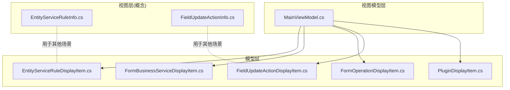
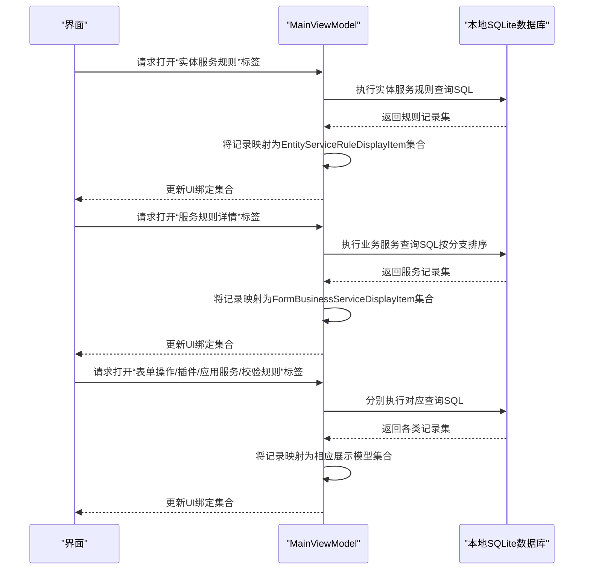
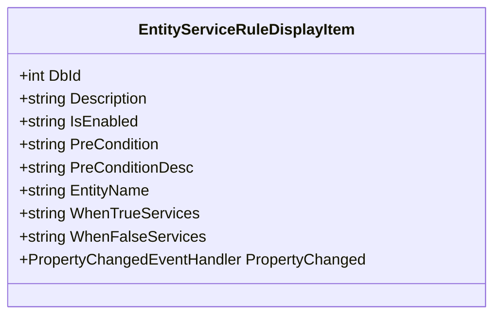
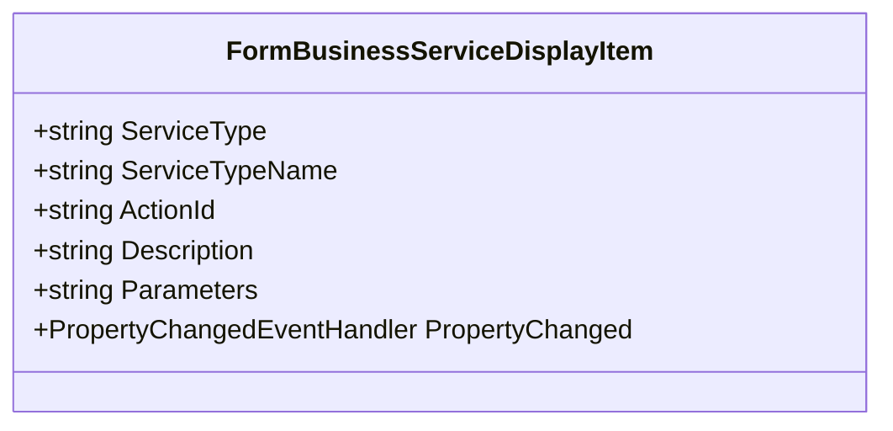
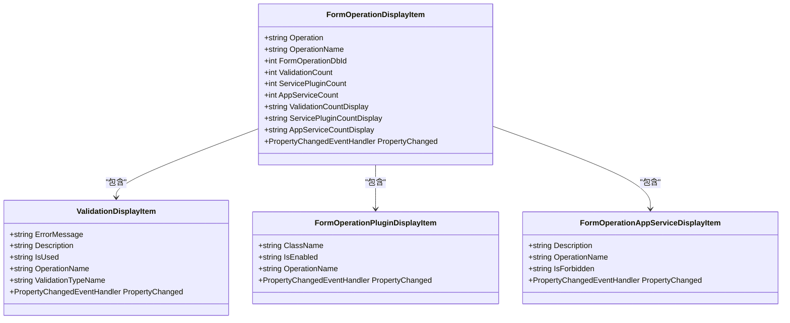
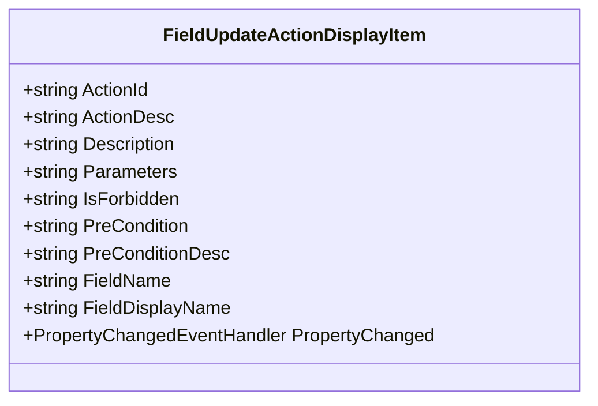
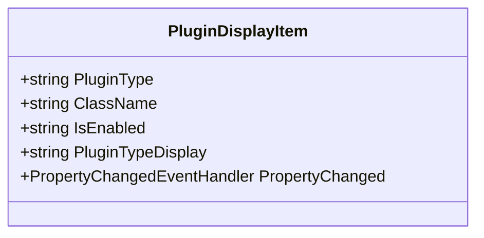
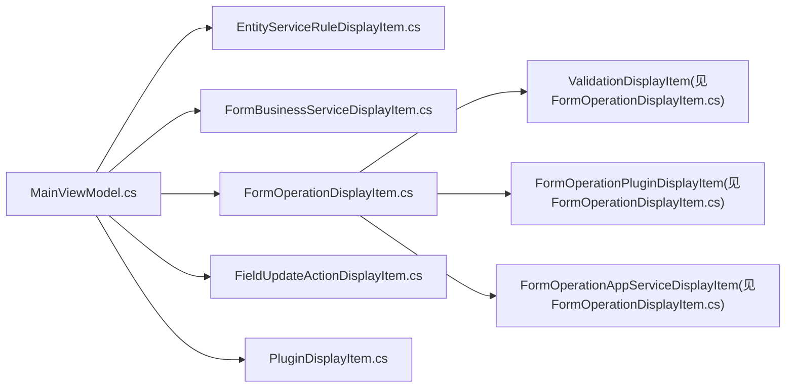

# 服务数据模型

<cite>
**本文档引用的文件**
- [EntityServiceRuleDisplayItem.cs](file://Models/EntityServiceRuleDisplayItem.cs)
- [FormBusinessServiceDisplayItem.cs](file://Models/FormBusinessServiceDisplayItem.cs)
- [FormOperationDisplayItem.cs](file://Models/FormOperationDisplayItem.cs)
- [FieldUpdateActionDisplayItem.cs](file://Models/FieldUpdateActionDisplayItem.cs)
- [PluginDisplayItem.cs](file://Models/PluginDisplayItem.cs)
- [MainViewModel.cs](file://ViewModels/MainViewModel.cs)
- [EntityServiceRuleInfo.cs](file://Views/EntityServiceRuleInfo.cs)
- [FieldUpdateActionInfo.cs](file://Views/FieldUpdateActionInfo.cs)
</cite>

## 目录
1. [简介](#简介)
2. [项目结构](#项目结构)
3. [核心组件](#核心组件)
4. [架构总览](#架构总览)
5. [详细组件分析](#详细组件分析)
6. [依赖关系分析](#依赖关系分析)
7. [性能考虑](#性能考虑)
8. [故障排除指南](#故障排除指南)
9. [结论](#结论)
10. [附录](#附录)

## 简介
本文件面向金蝶K3 Cloud数据字典系统的“服务数据模型”，聚焦以下服务相关展示模型的完整API规范与使用说明：
- 实体服务规则展示模型：EntityServiceRuleDisplayItem
- 表单业务服务展示模型：FormBusinessServiceDisplayItem
- 表单操作展示模型：FormOperationDisplayItem（含验证、插件、应用服务子模型）
- 字段更新动作展示模型：FieldUpdateActionDisplayItem
- 插件展示模型：PluginDisplayItem

文档将从数据结构、属性定义、服务逻辑映射、显示格式化到业务规则实现进行系统阐述，并提供服务调用示例与集成指南，帮助开发者在WPF界面中正确绑定与呈现K3 Cloud元数据中的实体服务规则、表单操作、字段更新动作及插件信息。

## 项目结构
围绕服务数据模型的相关代码组织如下：
- Models：定义各展示模型类，用于UI绑定与显示
- ViewModels：封装业务逻辑与数据加载，负责将数据库查询结果映射到展示模型
- Views：定义与模型同名但用于其他场景（如导出或序列化）的数据传输对象

**图表来源**
- [EntityServiceRuleDisplayItem.cs:1-72](file://Models/EntityServiceRuleDisplayItem.cs#L1-L72)
- [FormBusinessServiceDisplayItem.cs:1-51](file://Models/FormBusinessServiceDisplayItem.cs#L1-L51)
- [FormOperationDisplayItem.cs:1-169](file://Models/FormOperationDisplayItem.cs#L1-L169)
- [FieldUpdateActionDisplayItem.cs:1-80](file://Models/FieldUpdateActionDisplayItem.cs#L1-L80)
- [PluginDisplayItem.cs:1-51](file://Models/PluginDisplayItem.cs#L1-L51)
- [MainViewModel.cs:659-966](file://ViewModels/MainViewModel.cs#L659-L966)
- [EntityServiceRuleInfo.cs:1-67](file://Views/EntityServiceRuleInfo.cs#L1-L67)
- [FieldUpdateActionInfo.cs:1-36](file://Views/FieldUpdateActionInfo.cs#L1-L36)

**章节来源**
- [MainViewModel.cs:659-966](file://ViewModels/MainViewModel.cs#L659-L966)

## 核心组件
本节对每个服务相关展示模型进行逐项解析，包括属性语义、数据类型、显示格式化策略以及与后端数据库表的映射关系。

- 实体服务规则展示模型（EntityServiceRuleDisplayItem）
  - 属性概览
    - DbId：整型，规则主键
    - Description：字符串，规则描述
    - IsEnabled：字符串，是否启用（通常为“是/否”或布尔字符串）
    - PreCondition：字符串，前置条件表达式
    - PreConditionDesc：字符串，前置条件描述
    - EntityName：字符串，关联实体名称
    - WhenTrueServices：字符串，条件为真时的服务集合（逗号分隔）
    - WhenFalseServices：字符串，条件为假时的服务集合（逗号分隔）
  - 显示格式化
    - WhenTrueServices/WhenFalseServices采用“描述(多语言描述)”的拼接方式，便于在表格中直观查看
  - 数据库映射
    - 来源于实体服务规则表与实体表的联结，同时通过子查询聚合对应分支的服务描述

- 表单业务服务展示模型（FormBusinessServiceDisplayItem）
  - 属性概览
    - ServiceType：字符串，服务类型（如“条件为真/条件为假”的本地化描述）
    - ServiceTypeName：字符串，业务服务动作类型名称（多语言描述）
    - ActionId：字符串，动作标识
    - Description：字符串，服务描述
    - Parameters：字符串，参数JSON或文本
  - 显示格式化
    - 通过ServiceType区分分支，便于在规则详情页按分支排序展示

- 表单操作展示模型（FormOperationDisplayItem）
  - 主模型属性
    - Operation：字符串，操作编码
    - OperationName：字符串，操作名称
    - FormOperationDbId：整型，操作主键
    - ValidationCount：整型，该操作下校验规则数量
    - ServicePluginCount：整型，该操作下服务插件数量
    - AppServiceCount：整型，该操作下应用服务数量
    - ValidationCountDisplay/ServicePluginCountDisplay/AppServiceCountDisplay：字符串，仅在计数大于0时显示，否则为空字符串
  - 子模型
    - ValidationDisplayItem：校验规则展示项
      - 属性：ErrorMessage、Description、IsUsed、OperationName、ValidationTypeName
    - FormOperationPluginDisplayItem：操作插件展示项
      - 属性：ClassName、IsEnabled、OperationName
    - FormOperationAppServiceDisplayItem：操作应用服务展示项
      - 属性：Description、OperationName、IsForbidden

- 字段更新动作展示模型（FieldUpdateActionDisplayItem）
  - 属性概览
    - ActionId：字符串，动作标识
    - ActionDesc：字符串，动作类型多语言描述
    - Description：字符串，动作描述
    - Parameters：字符串，参数
    - IsForbidden：字符串，是否禁止
    - PreCondition：字符串，前置条件表达式
    - PreConditionDesc：字符串，前置条件描述
    - FieldName：字符串，字段键（用于表单级汇总）
    - FieldDisplayName：字符串，字段显示名（用于实体级明细）
  - 显示格式化
    - 通过字段键与显示名区分表单级与实体级视图

- 插件展示模型（PluginDisplayItem）
  - 属性概览
    - PluginType：字符串，插件类型（如FormPlugins、ListPlugins、WebFormBuilderPlugins）
    - ClassName：字符串，插件类名
    - IsEnabled：字符串，是否启用
    - PluginTypeDisplay：字符串，插件类型的中文显示（基于PluginType的switch映射）

**章节来源**
- [EntityServiceRuleDisplayItem.cs:1-72](file://Models/EntityServiceRuleDisplayItem.cs#L1-L72)
- [FormBusinessServiceDisplayItem.cs:1-51](file://Models/FormBusinessServiceDisplayItem.cs#L1-L51)
- [FormOperationDisplayItem.cs:1-169](file://Models/FormOperationDisplayItem.cs#L1-L169)
- [FieldUpdateActionDisplayItem.cs:1-80](file://Models/FieldUpdateActionDisplayItem.cs#L1-L80)
- [PluginDisplayItem.cs:1-51](file://Models/PluginDisplayItem.cs#L1-L51)

## 架构总览
下图展示了从数据库查询到展示模型绑定的整体流程，以及各模型之间的关系：

**图表来源**
- [MainViewModel.cs:659-966](file://ViewModels/MainViewModel.cs#L659-L966)

## 详细组件分析

### 实体服务规则展示模型（EntityServiceRuleDisplayItem）
- 类设计要点
  - 实现INotifyPropertyChanged，支持UI属性变更通知
  - 所有属性均为字符串类型，便于直接绑定与显示
- 服务逻辑映射
  - 规则的“条件为真/条件为假”分支通过子查询聚合服务描述，形成WhenTrueServices/WhenFalseServices字符串
- 显示格式化
  - 通过逗号分隔多个服务描述，提升可读性
- 业务规则实现
  - PreCondition与PreConditionDesc用于表达规则生效条件；IsEnabled控制规则启用状态

**图表来源**
- [EntityServiceRuleDisplayItem.cs:1-72](file://Models/EntityServiceRuleDisplayItem.cs#L1-L72)

**章节来源**
- [EntityServiceRuleDisplayItem.cs:1-72](file://Models/EntityServiceRuleDisplayItem.cs#L1-L72)
- [MainViewModel.cs:659-731](file://ViewModels/MainViewModel.cs#L659-L731)

### 表单业务服务展示模型（FormBusinessServiceDisplayItem）
- 类设计要点
  - 实现INotifyPropertyChanged，支持UI属性变更通知
  - ServiceType用于区分分支（条件为真/条件为假），便于排序与筛选
- 服务逻辑映射
  - ActionId与ServiceTypeName对应具体业务动作类型；Parameters承载动作参数
- 显示格式化
  - 通过ServiceTypeName与Description组合，增强用户理解

**图表来源**
- [FormBusinessServiceDisplayItem.cs:1-51](file://Models/FormBusinessServiceDisplayItem.cs#L1-L51)

**章节来源**
- [FormBusinessServiceDisplayItem.cs:1-51](file://Models/FormBusinessServiceDisplayItem.cs#L1-L51)
- [MainViewModel.cs:736-786](file://ViewModels/MainViewModel.cs#L736-L786)

### 表单操作展示模型（FormOperationDisplayItem）
- 类设计要点
  - 主模型包含操作基本信息与三类计数属性，对应三个子模型
  - 计数属性变更时同步触发显示属性更新
- 子模型职责
  - ValidationDisplayItem：展示校验规则的错误消息、描述、是否启用、所属操作与类型名称
  - FormOperationPluginDisplayItem：展示服务插件类名、启用状态与所属操作
  - FormOperationAppServiceDisplayItem：展示应用服务描述、启用状态与所属操作
- 服务逻辑映射
  - 通过FormOperationDbId关联到验证、插件、应用服务三类数据

**图表来源**
- [FormOperationDisplayItem.cs:1-169](file://Models/FormOperationDisplayItem.cs#L1-L169)

**章节来源**
- [FormOperationDisplayItem.cs:1-169](file://Models/FormOperationDisplayItem.cs#L1-L169)
- [MainViewModel.cs:971-1200](file://ViewModels/MainViewModel.cs#L971-L1200)

### 字段更新动作展示模型（FieldUpdateActionDisplayItem）
- 类设计要点
  - 实现INotifyPropertyChanged，支持UI属性变更通知
  - 支持表单级（FieldName）与实体级（FieldDisplayName）两种字段标识形式
- 服务逻辑映射
  - 动作由ActionId与ActionDesc标识，PreCondition与PreConditionDesc表达生效条件
  - IsForbidden控制动作是否被禁止
- 显示格式化
  - 参数与描述结合，便于在表格中快速识别动作意图

**图表来源**
- [FieldUpdateActionDisplayItem.cs:1-80](file://Models/FieldUpdateActionDisplayItem.cs#L1-L80)

**章节来源**
- [FieldUpdateActionDisplayItem.cs:1-80](file://Models/FieldUpdateActionDisplayItem.cs#L1-L80)
- [MainViewModel.cs:856-966](file://ViewModels/MainViewModel.cs#L856-L966)

### 插件展示模型（PluginDisplayItem）
- 类设计要点
  - 实现INotifyPropertyChanged，支持UI属性变更通知
  - PluginTypeDisplay根据PluginType进行中文映射（FormPlugins、ListPlugins、WebFormBuilderPlugins）
- 服务逻辑映射
  - ClassName标识插件实现类，IsEnabled表示启用状态
- 显示格式化
  - 使用PluginTypeDisplay在UI中展示更易读的中文类型

**图表来源**
- [PluginDisplayItem.cs:1-51](file://Models/PluginDisplayItem.cs#L1-L51)

**章节来源**
- [PluginDisplayItem.cs:1-51](file://Models/PluginDisplayItem.cs#L1-L51)
- [MainViewModel.cs:791-851](file://ViewModels/MainViewModel.cs#L791-L851)

## 依赖关系分析
- 模型与视图模型的依赖
  - MainViewModel通过查询本地SQLite数据库，将原始记录映射到上述展示模型集合，并更新UI绑定集合
- 模型间的耦合
  - FormOperationDisplayItem与三个子模型存在组合关系，体现“操作”作为容器的概念
- 外部依赖
  - 依赖SQLiteHelper与本地数据库文件，确保数据访问一致性

**图表来源**
- [MainViewModel.cs:659-1200](file://ViewModels/MainViewModel.cs#L659-L1200)
- [FormOperationDisplayItem.cs:1-169](file://Models/FormOperationDisplayItem.cs#L1-L169)

**章节来源**
- [MainViewModel.cs:659-1200](file://ViewModels/MainViewModel.cs#L659-L1200)

## 性能考虑
- 查询优化
  - 使用子查询聚合WhenTrue/WhenFalse服务描述，避免多次往返数据库
  - 对操作类数据使用COUNT聚合统计，减少UI层计算开销
- 绑定优化
  - 展示模型均实现INotifyPropertyChanged，仅在必要时触发属性变更通知
- I/O优化
  - 通过本地SQLite数据库缓存元数据，降低网络延迟影响

## 故障排除指南
- 常见问题
  - 插件类型显示异常：检查PluginType是否为受支持的枚举值（FormPlugins、ListPlugins、WebFormBuilderPlugins）
  - 操作计数显示为空：确认数据库中是否存在对应记录，或检查聚合查询是否返回NULL
  - 规则详情为空：确认规则ID是否正确，且对应分支是否存在服务
- 排查步骤
  - 验证本地数据库文件路径与连接状态
  - 检查查询SQL与参数绑定是否正确
  - 确认映射逻辑（如字符串转整型）不会抛出异常

**章节来源**
- [MainViewModel.cs:659-1200](file://ViewModels/MainViewModel.cs#L659-L1200)
- [PluginDisplayItem.cs:30-42](file://Models/PluginDisplayItem.cs#L30-L42)

## 结论
本文档系统梳理了金蝶K3 Cloud数据字典中与服务相关的核心展示模型，明确了其属性语义、服务逻辑映射、显示格式化策略与业务规则实现。通过MainViewModel的统一数据加载与映射，前端界面能够稳定地展示实体服务规则、表单业务服务、表单操作及其配套的校验规则、插件与应用服务，以及字段更新动作信息。建议在实际集成中遵循本文档的API规范与最佳实践，确保数据一致性与用户体验。

## 附录

### 服务调用示例与集成指南
- 实体服务规则
  - 打开规则列表：调用打开实体服务规则标签的方法，传入表单ID与可选实体ID
  - 打开规则详情：双击某条规则，打开“服务规则详情”标签，按分支排序展示业务服务
- 表单操作
  - 打开操作列表：调用打开表单操作标签的方法，传入表单ID
  - 打开校验规则/插件/应用服务：分别调用对应标签方法，可选择按操作过滤
- 字段更新动作
  - 打开字段值更新：调用打开字段值更新标签的方法，传入字段数据库ID
  - 打开表单值更新：调用打开表单值更新标签的方法，传入表单ID
- 插件
  - 打开插件列表：调用打开插件标签的方法，传入表单ID与可选插件类型

以上调用均通过MainViewModel完成，内部使用SQLite查询并将结果映射到相应展示模型集合，最终由WPF绑定到界面控件。

**章节来源**
- [MainViewModel.cs:659-1200](file://ViewModels/MainViewModel.cs#L659-L1200)