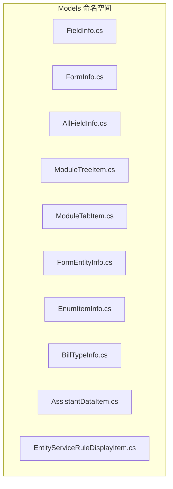
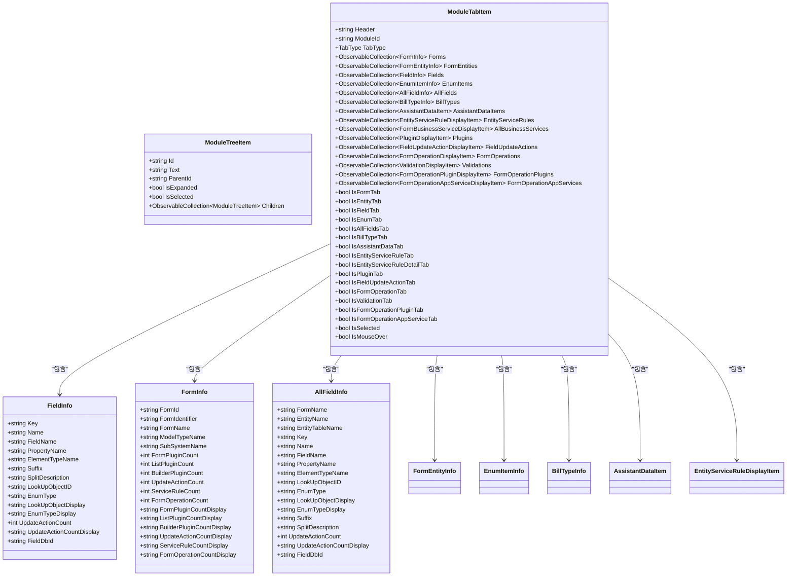
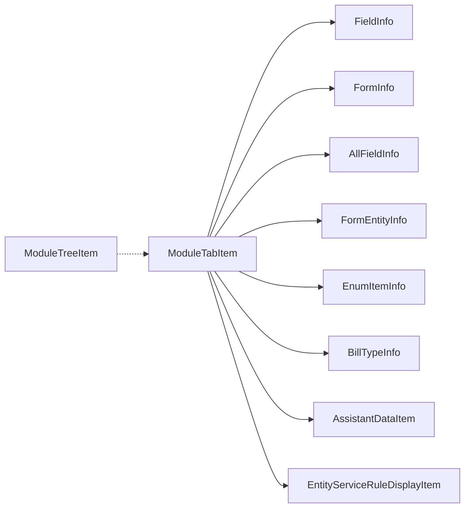

# 核心数据模型

<cite>
**本文档引用的文件**
- [FieldInfo.cs](file://Models/FieldInfo.cs)
- [FormInfo.cs](file://Models/FormInfo.cs)
- [AllFieldInfo.cs](file://Models/AllFieldInfo.cs)
- [ModuleTreeItem.cs](file://Models/ModuleTreeItem.cs)
- [ModuleTabItem.cs](file://Models/ModuleTabItem.cs)
- [FormEntityInfo.cs](file://Models/FormEntityInfo.cs)
- [EnumItemInfo.cs](file://Models/EnumItemInfo.cs)
- [BillTypeInfo.cs](file://Models/BillTypeInfo.cs)
- [AssistantDataItem.cs](file://Models/AssistantDataItem.cs)
- [EntityServiceRuleDisplayItem.cs](file://Models/EntityServiceRuleDisplayItem.cs)
</cite>

## 目录
1. [简介](#简介)
2. [项目结构](#项目结构)
3. [核心组件](#核心组件)
4. [架构总览](#架构总览)
5. [详细组件分析](#详细组件分析)
6. [依赖分析](#依赖分析)
7. [性能考虑](#性能考虑)
8. [故障排除指南](#故障排除指南)
9. [结论](#结论)

## 简介
本文件面向金蝶K3 Cloud数据字典系统的前端与CLI工具使用者，聚焦于核心数据模型的API规范与使用说明。重点覆盖以下模型：
- FieldInfo：单个字段的元信息与状态
- FormInfo：表单级元信息与统计计数
- AllFieldInfo：跨实体/表单的字段聚合视图
- ModuleTreeItem：模块树节点（用于UI导航）
- ModuleTabItem：模块标签页容器，承载多类元数据集合

同时，文档将解释各模型的属性定义、数据类型、字段含义、使用场景、事件处理机制，并给出在实际业务中的组合使用方式。

## 项目结构
核心模型位于 Models 命名空间下，均实现 INotifyPropertyChanged 接口以支持WPF/XAML绑定与实时更新。部分模型还包含枚举或复杂集合属性，用于承载不同维度的元数据。

**图表来源**
- [FieldInfo.cs:1-110](file://Models/FieldInfo.cs#L1-L110)
- [FormInfo.cs:1-101](file://Models/FormInfo.cs#L1-L101)
- [AllFieldInfo.cs:1-50](file://Models/AllFieldInfo.cs#L1-L50)
- [ModuleTreeItem.cs:1-60](file://Models/ModuleTreeItem.cs#L1-L60)
- [ModuleTabItem.cs:1-196](file://Models/ModuleTabItem.cs#L1-L196)

**章节来源**
- [FieldInfo.cs:1-110](file://Models/FieldInfo.cs#L1-L110)
- [FormInfo.cs:1-101](file://Models/FormInfo.cs#L1-L101)
- [AllFieldInfo.cs:1-50](file://Models/AllFieldInfo.cs#L1-L50)
- [ModuleTreeItem.cs:1-60](file://Models/ModuleTreeItem.cs#L1-L60)
- [ModuleTabItem.cs:1-196](file://Models/ModuleTabItem.cs#L1-L196)

## 核心组件
本节对五个关键模型进行逐项说明，包括属性定义、数据类型、字段含义、使用场景与事件处理机制。

- FieldInfo
  - 属性概览
    - Key: 字符串；唯一标识
    - Name: 字符串；显示名称
    - FieldName: 字符串；物理字段名
    - PropertyName: 字符串；领域属性名
    - ElementTypeName: 字符串；元素类型名
    - Suffix: 字符串；后缀
    - SplitDescription: 字符串；拆分描述
    - LookUpObjectID: 字符串；查找对象ID
    - EnumType: 字符串；枚举类型
    - LookUpObjectDisplay: 字符串；查找对象显示名
    - EnumTypeDisplay: 字符串；枚举类型显示名
    - UpdateActionCount: 整型；更新动作计数
    - UpdateActionCountDisplay: 字符串；计数显示（空字符串表示无计数）
    - FieldDbId: 字符串；数据库字段ID
  - 使用场景
    - 表单字段级元数据展示与筛选
    - 字段变更追踪与统计
  - 事件处理
    - 支持属性变更通知，便于UI绑定更新

- FormInfo
  - 属性概览
    - FormId: 字符串；表单ID
    - FormIdentifier: 字符串；表单标识
    - FormName: 字符串；表单显示名
    - ModelTypeName: 字符串；模型类型名
    - SubSystemName: 字符串；子系统名
    - FormPluginCount: 整型；表单插件数量
    - ListPluginCount: 整型；列表插件数量
    - BuilderPluginCount: 整型；构建器插件数量
    - UpdateActionCount: 整型；更新动作数量
    - ServiceRuleCount: 整型；服务规则数量
    - FormOperationCount: 整型；表单操作数量
    - 各计数属性均提供对应的显示属性（空字符串表示无计数）
  - 使用场景
    - 表单维度的元数据概览与统计
    - 插件与规则数量的可视化展示
  - 事件处理
    - 支持属性变更通知

- AllFieldInfo
  - 属性概览
    - FormName: 字符串；所属表单名
    - EntityName: 字符串；实体名
    - EntityTableName: 字符串；实体表名
    - Key/Name/FieldName/PropertyName/ElementTypeName/LookUpObjectID/EnumType/LookUpObjectDisplay/EnumTypeDisplay/Suffix/SplitDescription/UpdateActionCount/FieldDbId: 与FieldInfo一致的字段
    - UpdateActionCountDisplay: 字符串；计数显示
  - 使用场景
    - 跨实体/表单的字段聚合视图，便于全局检索与对比
  - 事件处理
    - 支持属性变更通知

- ModuleTreeItem
  - 属性概览
    - Id: 字符串；节点ID
    - Text: 字符串；显示文本
    - ParentId: 字符串；父节点ID
    - IsExpanded: 布尔；是否展开
    - IsSelected: 布尔；是否选中
    - Children: 观察集合；子节点集合
  - 使用场景
    - 模块树形导航（如按子系统/模块层级组织）
  - 事件处理
    - 支持属性变更通知
  - 构造函数
    - 初始化 Children 为非空集合

- ModuleTabItem
  - 属性概览
    - Header: 字符串；标签页标题
    - ModuleId: 字符串；模块ID
    - TabType: 枚举；标签页类型（Form/Entity/Field/Enum/AllFields/BillType/AssistantData/EntityServiceRule/EntityServiceRuleDetail/Plugin/FieldUpdateAction/FormOperation/Validation/FormOperationPlugin/FormOperationAppService）
    - Forms: 观察集合；FormInfo集合
    - FormEntities: 观察集合；FormEntityInfo集合
    - Fields: 观察集合；FieldInfo集合
    - EnumItems: 观察集合；EnumItemInfo集合
    - AllFields: 观察集合；AllFieldInfo集合
    - BillTypes: 观察集合；BillTypeInfo集合
    - AssistantDataItems: 观察集合；AssistantDataItem集合
    - EntityServiceRules: 观察集合；EntityServiceRuleDisplayItem集合
    - AllBusinessServices: 观察集合；业务服务集合
    - Plugins: 观察集合；插件集合
    - FieldUpdateActions: 观察集合；字段更新动作集合
    - FormOperations: 观察集合；表单操作集合
    - Validations: 观察集合；校验集合
    - FormOperationPlugins: 观察集合；表单操作插件集合
    - FormOperationAppServices: 观察集合；表单操作应用服务集合
    - IsFormTab/IsEntityTab/.../IsFormOperationAppServiceTab: 基于 TabType 的布尔判断属性
    - IsSelected/IsMouseOver: UI交互状态
  - 使用场景
    - 将多种元数据类型统一装载到一个标签页容器中，便于切换与展示
  - 事件处理
    - 支持属性变更通知
  - 构造函数
    - 初始化所有集合为空观察集合，默认 TabType 为 Form

**章节来源**
- [FieldInfo.cs:6-108](file://Models/FieldInfo.cs#L6-L108)
- [FormInfo.cs:6-99](file://Models/FormInfo.cs#L6-L99)
- [AllFieldInfo.cs:6-48](file://Models/AllFieldInfo.cs#L6-L48)
- [ModuleTreeItem.cs:7-58](file://Models/ModuleTreeItem.cs#L7-L58)
- [ModuleTabItem.cs:9-194](file://Models/ModuleTabItem.cs#L9-L194)

## 架构总览
从数据模型视角看，ModuleTabItem 是“容器”，内部持有多种元数据集合；FieldInfo、FormInfo、AllFieldInfo 分别代表“字段”、“表单”、“字段聚合”三个维度；ModuleTreeItem 提供树形导航支撑。下图展示了核心模型之间的关系与职责划分。

**图表来源**
- [FieldInfo.cs:6-108](file://Models/FieldInfo.cs#L6-L108)
- [FormInfo.cs:6-99](file://Models/FormInfo.cs#L6-L99)
- [AllFieldInfo.cs:6-48](file://Models/AllFieldInfo.cs#L6-L48)
- [ModuleTreeItem.cs:7-58](file://Models/ModuleTreeItem.cs#L7-L58)
- [ModuleTabItem.cs:9-194](file://Models/ModuleTabItem.cs#L9-L194)

## 详细组件分析

### FieldInfo 模型
- 数据结构与复杂度
  - 字段均为简单值类型（字符串/整型），读写操作时间复杂度 O(1)
  - 计数显示属性基于内存计算，O(1)
- 关键属性说明
  - Key/Name/FieldName/PropertyName/ElementTypeName：用于定位与显示字段
  - LookUpObjectID/EnumType/LookUpObjectDisplay/EnumTypeDisplay：关联查找与枚举信息
  - UpdateActionCount/UpdateActionCountDisplay：字段更新动作统计
  - FieldDbId：数据库层字段标识
- 事件处理
  - 所有 setter 均触发属性变更通知，便于UI绑定自动刷新
- 使用场景
  - 在表单详情页展示字段元信息
  - 在字段变更审计中记录 UpdateActionCount

**章节来源**
- [FieldInfo.cs:6-108](file://Models/FieldInfo.cs#L6-L108)

### FormInfo 模型
- 数据结构与复杂度
  - 字段均为简单值类型，O(1) 访问
- 关键属性说明
  - FormId/FormIdentifier/FormName：表单标识与显示
  - ModelTypeName/SubSystemName：模型与子系统归属
  - 各计数属性（插件、更新动作、服务规则、表单操作）及其显示属性
- 事件处理
  - 计数属性在赋值时触发两次通知：计数本身与显示属性
- 使用场景
  - 表单概览面板
  - 统计报表与仪表盘

**章节来源**
- [FormInfo.cs:6-99](file://Models/FormInfo.cs#L6-L99)

### AllFieldInfo 模型
- 数据结构与复杂度
  - 与 FieldInfo 结构高度相似，O(1) 访问
- 关键属性说明
  - 新增 FormName/EntityName/EntityTableName：用于跨实体/表单聚合展示
- 使用场景
  - 全局字段检索与对比
  - 报表与导出场景下的统一字段视图

**章节来源**
- [AllFieldInfo.cs:6-48](file://Models/AllFieldInfo.cs#L6-L48)

### ModuleTreeItem 模型
- 数据结构与复杂度
  - 节点属性 O(1)，Children 为观察集合，插入/删除为 O(1)
- 关键属性说明
  - Id/Text/ParentId：树节点标识与层级关系
  - IsExpanded/IsSelected：UI交互状态
  - Children：递归树结构的基础
- 事件处理
  - 支持属性变更通知
- 使用场景
  - 子系统/模块树导航
  - 动态加载子节点

**章节来源**
- [ModuleTreeItem.cs:7-58](file://Models/ModuleTreeItem.cs#L7-L58)

### ModuleTabItem 模型
- 数据结构与复杂度
  - 多个集合属性，初始化为观察集合，便于UI绑定
- 关键属性说明
  - Header/ModuleId/TabType：标签页元信息
  - 多种集合属性：Forms、FormEntities、Fields、EnumItems、AllFields、BillTypes、AssistantDataItems、EntityServiceRules、AllBusinessServices、Plugins、FieldUpdateActions、FormOperations、Validations、FormOperationPlugins、FormOperationAppServices
  - 基于 TabType 的布尔判断属性，便于UI条件渲染
  - IsSelected/IsMouseOver：交互状态
- 事件处理
  - 支持属性变更通知
- 使用场景
  - 将多种元数据类型统一在一个标签页容器中，便于切换与展示
  - 配合 TabType 判断实现“按需加载”的内容区域

**章节来源**
- [ModuleTabItem.cs:9-194](file://Models/ModuleTabItem.cs#L9-L194)

### 补充模型（用于理解关系）
- FormEntityInfo：连接表单与实体的中间层，包含实体关键信息与计数显示
- EnumItemInfo：枚举项（值/显示名）
- BillTypeInfo：单据类型（编号/名称）
- AssistantDataItem：辅助资料项（编号/名称/数据值等）
- EntityServiceRuleDisplayItem：实体服务规则（启用状态、前置条件、服务分支等）

这些模型与核心模型共同构成数据字典的元数据生态，可作为 ModuleTabItem 中对应集合的数据项。

**章节来源**
- [FormEntityInfo.cs:6-117](file://Models/FormEntityInfo.cs#L6-L117)
- [EnumItemInfo.cs:6-30](file://Models/EnumItemInfo.cs#L6-L30)
- [BillTypeInfo.cs:6-44](file://Models/BillTypeInfo.cs#L6-L44)
- [AssistantDataItem.cs:6-57](file://Models/AssistantDataItem.cs#L6-L57)
- [EntityServiceRuleDisplayItem.cs:6-71](file://Models/EntityServiceRuleDisplayItem.cs#L6-L71)

## 依赖分析
- 内聚性
  - 各模型围绕单一职责：FieldInfo/AllFieldInfo 聚焦字段，FormInfo 聚焦表单，ModuleTreeItem 聚焦树形导航，ModuleTabItem 聚焦标签页容器
- 耦合性
  - ModuleTabItem 对多种模型存在强耦合（集合属性），但通过接口契约（INotifyPropertyChanged）与集合抽象降低直接依赖
- 可能的循环依赖
  - 当前模型间不存在循环依赖，ModuleTreeItem 仅作为导航载体，不反向引用其他模型
- 外部依赖
  - 依赖 System.ComponentModel 实现属性变更通知
  - 依赖 System.Collections.ObjectModel 提供可观察集合

**图表来源**
- [ModuleTabItem.cs:9-194](file://Models/ModuleTabItem.cs#L9-L194)
- [ModuleTreeItem.cs:7-58](file://Models/ModuleTreeItem.cs#L7-L58)

**章节来源**
- [ModuleTabItem.cs:9-194](file://Models/ModuleTabItem.cs#L9-L194)
- [ModuleTreeItem.cs:7-58](file://Models/ModuleTreeItem.cs#L7-L58)

## 性能考虑
- 属性变更通知
  - 所有模型均通过 INotifyPropertyChanged 实现，建议在批量赋值时避免频繁触发UI刷新
- 集合操作
  - 使用 ObservableCollection 时，尽量合并多次修改为一次批量更新，减少UI重绘次数
- 显示属性
  - 计数显示属性为即时计算，避免在高频更新场景中重复计算，可在上层缓存结果

## 故障排除指南
- UI 不更新
  - 确认属性 setter 已触发 OnPropertyChanged
  - 确认绑定路径正确且属性名大小写匹配
- 集合不显示
  - 确认集合已在构造函数中初始化为非空 ObservableCollection
  - 确认集合已正确绑定到 UI 控件（如 ItemsControl）
- 导航树不展开/选择
  - 确认 IsExpanded/IsSelected 属性已赋值并触发通知
  - 确认 TreeView 的 SelectedItem/IsExpanded 绑定正确

## 结论
本文档系统梳理了金蝶K3 Cloud数据字典系统的核心数据模型，明确了 FieldInfo、FormInfo、AllFieldInfo、ModuleTreeItem、ModuleTabItem 的属性定义、数据类型、字段含义、使用场景与事件处理机制。通过 ModuleTabItem 的容器化设计，可将多种元数据类型统一管理；结合 ModuleTreeItem 的树形导航，能够高效组织与展示复杂的业务元数据。建议在实际开发中遵循 INotifyPropertyChanged 的通知约定，合理使用 ObservableCollection，并根据业务场景选择合适的模型组合。