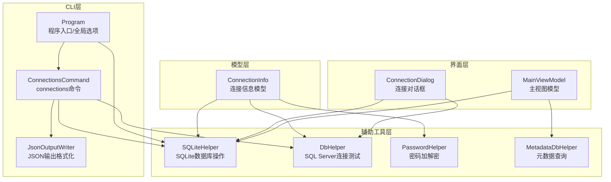
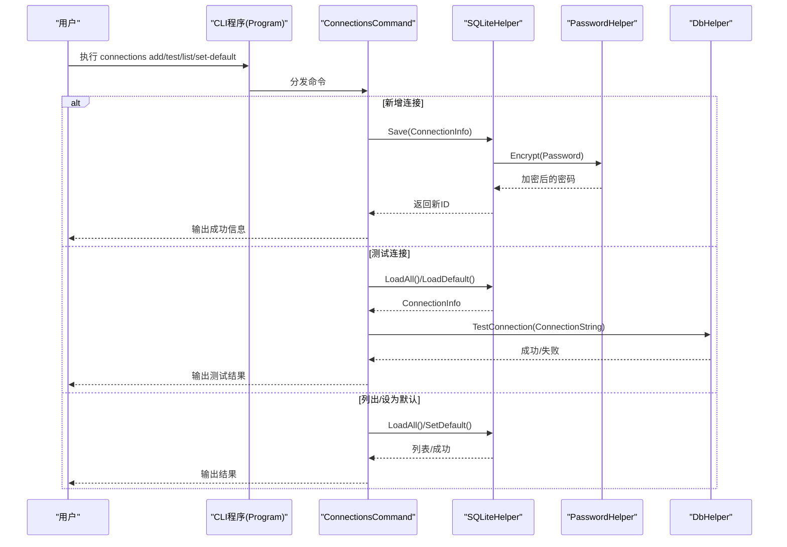
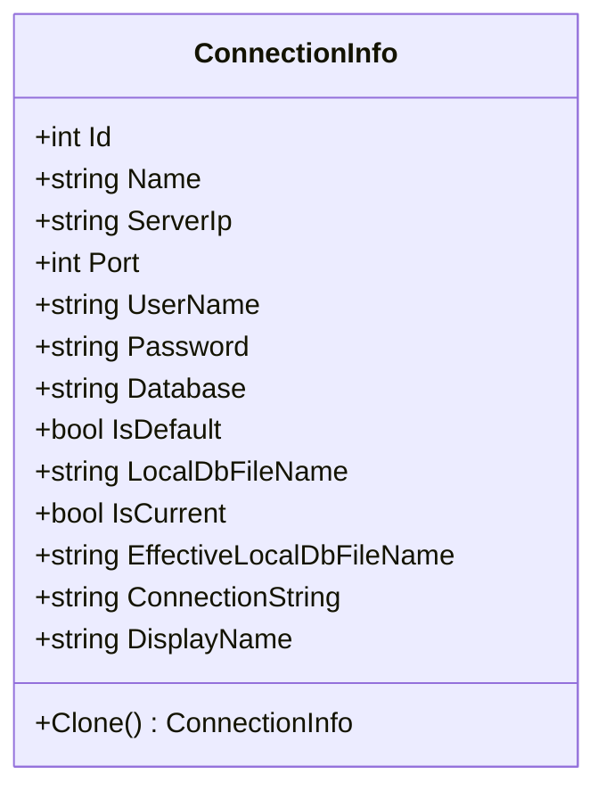
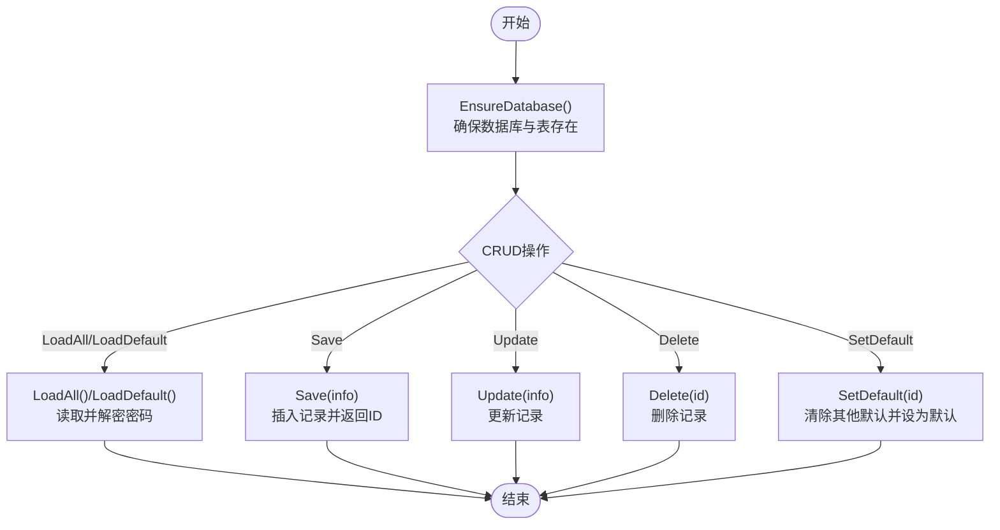
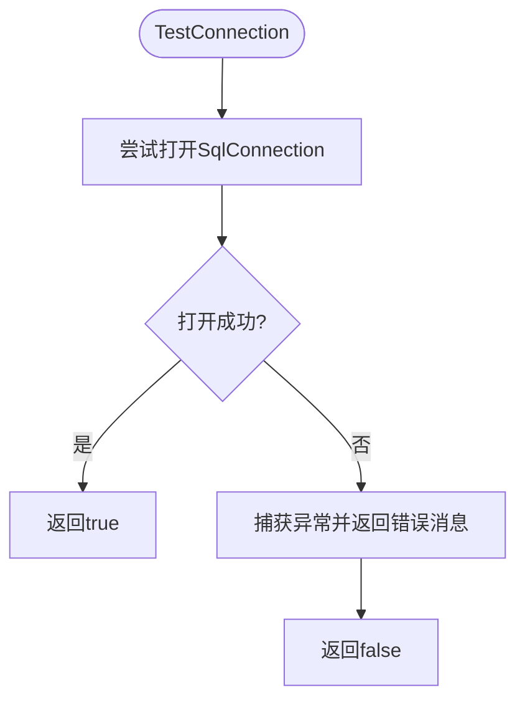
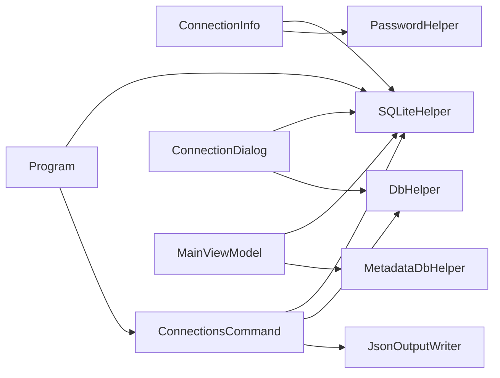

# 连接数据模型

<cite>
**本文档引用的文件**
- [ConnectionInfo.cs](file://Models/ConnectionInfo.cs)
- [DbHelper.cs](file://Helpers/DbHelper.cs)
- [PasswordHelper.cs](file://Helpers/PasswordHelper.cs)
- [SQLiteHelper.cs](file://Helpers/SQLiteHelper.cs)
- [ConnectionsCommand.cs](file://K3CloudDataDictionary.Cli/Commands/ConnectionsCommand.cs)
- [JsonOutputWriter.cs](file://K3CloudDataDictionary.Cli/Services/JsonOutputWriter.cs)
- [Program.cs](file://K3CloudDataDictionary.Cli/Program.cs)
- [ConnectionDialog.xaml](file://ConnectionDialog.xaml)
- [ConnectionDialog.xaml.cs](file://ConnectionDialog.xaml.cs)
- [MainViewModel.cs](file://ViewModels/MainViewModel.cs)
- [MetadataDbHelper.cs](file://Views/MetadataDbHelper.cs)
- [usage-examples.md](file://docs/usage-examples.md)
</cite>

## 目录
1. [简介](#简介)
2. [项目结构](#项目结构)
3. [核心组件](#核心组件)
4. [架构总览](#架构总览)
5. [详细组件分析](#详细组件分析)
6. [依赖关系分析](#依赖关系分析)
7. [性能考虑](#性能考虑)
8. [故障排除指南](#故障排除指南)
9. [结论](#结论)
10. [附录](#附录)

## 简介
本文件为金蝶K3 Cloud数据字典系统的连接数据模型提供全面的API文档。重点围绕ConnectionInfo模型，详细说明数据库连接配置、连接参数设置、连接状态管理、安全认证与加密机制、连接池管理策略、错误处理方式，以及多数据库连接支持与连接重连机制的实现细节。同时提供连接配置示例、连接测试方法与故障排除指南，并结合CLI与WPF界面的实际调用流程进行说明。

## 项目结构
系统采用分层架构，核心连接模型位于Models层；连接配置的持久化与扫描由Helpers层的SQLiteHelper负责；连接测试由DbHelper提供；密码加密由PasswordHelper提供；CLI命令connections由ConnectionsCommand统一管理；WPF界面通过ConnectionDialog进行可视化连接管理；MainViewModel负责应用状态与连接切换；MetadataDbHelper提供元数据查询能力。

**图表来源**
- [ConnectionInfo.cs:6-142](file://Models/ConnectionInfo.cs#L6-L142)
- [SQLiteHelper.cs:10-369](file://Helpers/SQLiteHelper.cs#L10-L369)
- [DbHelper.cs:7-69](file://Helpers/DbHelper.cs#L7-L69)
- [PasswordHelper.cs:7-45](file://Helpers/PasswordHelper.cs#L7-L45)
- [ConnectionsCommand.cs:13-231](file://K3CloudDataDictionary.Cli/Commands/ConnectionsCommand.cs#L13-L231)
- [JsonOutputWriter.cs:11-91](file://K3CloudDataDictionary.Cli/Services/JsonOutputWriter.cs#L11-L91)
- [Program.cs:12-166](file://K3CloudDataDictionary.Cli/Program.cs#L12-L166)
- [ConnectionDialog.xaml.cs:12-490](file://ConnectionDialog.xaml.cs#L12-L490)
- [MainViewModel.cs:18-800](file://ViewModels/MainViewModel.cs#L18-L800)
- [MetadataDbHelper.cs:36-131](file://Views/MetadataDbHelper.cs#L36-L131)

**章节来源**
- [ConnectionInfo.cs:6-142](file://Models/ConnectionInfo.cs#L6-L142)
- [SQLiteHelper.cs:10-369](file://Helpers/SQLiteHelper.cs#L10-L369)
- [DbHelper.cs:7-69](file://Helpers/DbHelper.cs#L7-L69)
- [PasswordHelper.cs:7-45](file://Helpers/PasswordHelper.cs#L7-L45)
- [ConnectionsCommand.cs:13-231](file://K3CloudDataDictionary.Cli/Commands/ConnectionsCommand.cs#L13-L231)
- [JsonOutputWriter.cs:11-91](file://K3CloudDataDictionary.Cli/Services/JsonOutputWriter.cs#L11-L91)
- [Program.cs:12-166](file://K3CloudDataDictionary.Cli/Program.cs#L12-L166)
- [ConnectionDialog.xaml.cs:12-490](file://ConnectionDialog.xaml.cs#L12-L490)
- [MainViewModel.cs:18-800](file://ViewModels/MainViewModel.cs#L18-L800)
- [MetadataDbHelper.cs:36-131](file://Views/MetadataDbHelper.cs#L36-L131)

## 核心组件
- ConnectionInfo：连接信息的核心数据模型，提供属性绑定、显示名生成、连接字符串生成、克隆与通知事件。
- SQLiteHelper：负责连接配置的增删改查、默认连接标记、本地数据文件扫描与导入、迁移逻辑。
- DbHelper：提供SQL Server连接测试与通用查询执行能力。
- PasswordHelper：基于DPAPI的密码加解密工具。
- ConnectionsCommand：CLI connections命令的实现，支持列出、新增、测试、设为默认连接。
- JsonOutputWriter：统一的JSON输出格式化器。
- Program：CLI入口，解析全局选项与连接字符串解析。
- ConnectionDialog：WPF连接管理界面，支持连接编辑、测试、本地数据文件管理。
- MainViewModel：应用主视图模型，负责连接切换、本地数据路径更新、模块树加载等。
- MetadataDbHelper：元数据查询辅助类，封装对T_META_OBJECTTYPE等表的查询。

**章节来源**
- [ConnectionInfo.cs:6-142](file://Models/ConnectionInfo.cs#L6-L142)
- [SQLiteHelper.cs:10-369](file://Helpers/SQLiteHelper.cs#L10-L369)
- [DbHelper.cs:7-69](file://Helpers/DbHelper.cs#L7-L69)
- [PasswordHelper.cs:7-45](file://Helpers/PasswordHelper.cs#L7-L45)
- [ConnectionsCommand.cs:13-231](file://K3CloudDataDictionary.Cli/Commands/ConnectionsCommand.cs#L13-L231)
- [JsonOutputWriter.cs:11-91](file://K3CloudDataDictionary.Cli/Services/JsonOutputWriter.cs#L11-L91)
- [Program.cs:12-166](file://K3CloudDataDictionary.Cli/Program.cs#L12-L166)
- [ConnectionDialog.xaml.cs:12-490](file://ConnectionDialog.xaml.cs#L12-L490)
- [MainViewModel.cs:18-800](file://ViewModels/MainViewModel.cs#L18-L800)
- [MetadataDbHelper.cs:36-131](file://Views/MetadataDbHelper.cs#L36-L131)

## 架构总览
连接数据模型贯穿于CLI与WPF两个入口，通过SQLite持久化连接配置，使用DPAPI保护密码，通过DbHelper进行连接测试，最终在MainViewModel中完成连接切换与本地数据路径更新。

**图表来源**
- [Program.cs:14-69](file://K3CloudDataDictionary.Cli/Program.cs#L14-L69)
- [ConnectionsCommand.cs:15-231](file://K3CloudDataDictionary.Cli/Commands/ConnectionsCommand.cs#L15-L231)
- [SQLiteHelper.cs:114-188](file://Helpers/SQLiteHelper.cs#L114-L188)
- [PasswordHelper.cs:11-43](file://Helpers/PasswordHelper.cs#L11-L43)
- [DbHelper.cs:9-25](file://Helpers/DbHelper.cs#L9-L25)

**章节来源**
- [Program.cs:14-69](file://K3CloudDataDictionary.Cli/Program.cs#L14-L69)
- [ConnectionsCommand.cs:15-231](file://K3CloudDataDictionary.Cli/Commands/ConnectionsCommand.cs#L15-L231)
- [SQLiteHelper.cs:114-188](file://Helpers/SQLiteHelper.cs#L114-L188)
- [PasswordHelper.cs:11-43](file://Helpers/PasswordHelper.cs#L11-L43)
- [DbHelper.cs:9-25](file://Helpers/DbHelper.cs#L9-L25)

## 详细组件分析

### ConnectionInfo 模型API规范
- 属性定义
  - Id：整数，连接唯一标识。
  - Name：字符串，连接名称，用于UI展示。
  - ServerIp：字符串，SQL Server地址。
  - Port：整数，默认1433，SQL Server端口。
  - UserName：字符串，登录用户名。
  - Password：字符串，登录密码（存储为加密文本）。
  - Database：字符串，数据库名称。
  - IsDefault：布尔，是否为默认连接。
  - LocalDbFileName：字符串，本地数据文件名（可选）。
  - IsCurrent：布尔，仅用于UI显示当前连接，不持久化。
- 计算属性
  - EffectiveLocalDbFileName：实际本地数据文件名，优先使用LocalDbFileName，否则以Database+".db"生成，若均为空则为"metadata.db"。
  - ConnectionString：生成SQL Server连接字符串，格式为"Server={ServerIp},{Port};Database={Database};User Id={UserName};Password={Password};"。
  - DisplayName：生成显示名，优先使用{Name}({Database})，否则回退到名称或地址+库名。
- 方法
  - Clone()：深拷贝当前连接信息，便于编辑时不污染原数据。
  - INotifyPropertyChanged事件：属性变更触发通知，支持UI双向绑定。
- 存储与序列化
  - 通过SQLiteHelper持久化至Connections表，包含Id、Name、ServerIp、Port、UserName、Password(加密)、Database、IsDefault、LocalDbFileName。
- 错误处理
  - UI层对无效输入进行校验（如ServerIp为空）。
  - CLI层对缺失参数进行报错提示。
- 安全与加密
  - Password通过PasswordHelper使用DPAPI进行加密存储，读取时自动解密。
- 连接池管理
  - 代码中未显式使用连接池参数，DbHelper与CLI解析均采用短生命周期连接，无连接池复用逻辑。
- 多数据库连接支持
  - 支持多条连接记录，通过IsDefault标记唯一默认连接；CLI可通过--connection参数指定具体连接ID。
- 连接重连机制
  - 代码未实现自动重连；连接测试失败时，CLI/WPF会提示并允许用户继续使用或放弃。

**图表来源**
- [ConnectionInfo.cs:6-142](file://Models/ConnectionInfo.cs#L6-L142)

**章节来源**
- [ConnectionInfo.cs:6-142](file://Models/ConnectionInfo.cs#L6-L142)
- [SQLiteHelper.cs:28-52](file://Helpers/SQLiteHelper.cs#L28-L52)
- [PasswordHelper.cs:11-43](file://Helpers/PasswordHelper.cs#L11-L43)

### SQLiteHelper：连接配置存储与本地数据管理
- 数据库与表结构
  - 使用SQLite存储连接配置，表名为Connections，包含字段：Id、Name、ServerIp、Port、UserName、Password(加密)、Database、IsDefault、LocalDbFileName。
  - 支持迁移：为旧表添加LocalDbFileName列。
- 连接配置CRUD
  - LoadAll/LoadDefault：加载全部或默认连接，读取时自动解密密码。
  - Save/Update/Delete：保存、更新、删除连接；更新时可清除默认标记后写入。
  - SetDefault：将指定ID设为默认连接，内部先清除其他默认标记。
- 本地数据文件管理
  - ScanLocalDataFiles：扫描data目录下除connections.db外的.db文件，识别自动生成与导入文件，建立与连接的关联映射。
  - ImportLocalData：导入外部.db文件到data目录，避免与连接预期文件名冲突。
  - DeleteLocalData/RenameLocalData：删除与重命名本地数据文件。
  - MigrateOldMetadataDb：将旧版metadata.db迁移到按连接命名的新文件（仅在无其他数据文件时执行）。
- 路径与文件名
  - GetDataFolder：返回data目录绝对路径。
  - GetLocalDbPath：根据连接EffectiveLocalDbFileName计算本地数据文件完整路径。

**图表来源**
- [SQLiteHelper.cs:17-53](file://Helpers/SQLiteHelper.cs#L17-L53)
- [SQLiteHelper.cs:114-188](file://Helpers/SQLiteHelper.cs#L114-L188)
- [SQLiteHelper.cs:218-367](file://Helpers/SQLiteHelper.cs#L218-L367)

**章节来源**
- [SQLiteHelper.cs:17-53](file://Helpers/SQLiteHelper.cs#L17-L53)
- [SQLiteHelper.cs:114-188](file://Helpers/SQLiteHelper.cs#L114-L188)
- [SQLiteHelper.cs:218-367](file://Helpers/SQLiteHelper.cs#L218-L367)

### DbHelper：连接测试与查询执行
- TestConnection：接收连接字符串，尝试打开SqlConnection，捕获异常并返回错误消息。
- ExecuteQuery/ExecuteScalar：执行SQL查询，设置CommandTimeout=60秒，返回结果集或标量值。

**图表来源**
- [DbHelper.cs:9-25](file://Helpers/DbHelper.cs#L9-L25)

**章节来源**
- [DbHelper.cs:9-25](file://Helpers/DbHelper.cs#L9-L25)
- [DbHelper.cs:27-67](file://Helpers/DbHelper.cs#L27-L67)

### PasswordHelper：密码加密与解密
- Encrypt：对明文密码使用DPAPI(DataProtectionScope.CurrentUser)加密，异常时回退为原文。
- Decrypt：对密文进行解密，异常时回退为原文。
- 用于SQLiteHelper的密码字段存储与读取。

**章节来源**
- [PasswordHelper.cs:11-43](file://Helpers/PasswordHelper.cs#L11-L43)
- [SQLiteHelper.cs:74-103](file://Helpers/SQLiteHelper.cs#L74-L103)

### CLI connections 命令：连接管理API
- 子命令
  - list：列出所有连接，输出id、name、server、database、user、isDefault、displayName。
  - add：新增连接，支持--server、--port、--db、--user、--password、--name、--default；保存后可设为默认。
  - test：测试指定ID连接，输出success与message。
  - set-default：将指定ID设为默认连接。
- 参数校验与错误处理
  - 缺少必要参数时报错。
  - 未找到连接ID时报错。
  - 异常统一通过JsonOutputWriter.WriteError输出。

**章节来源**
- [ConnectionsCommand.cs:15-231](file://K3CloudDataDictionary.Cli/Commands/ConnectionsCommand.cs#L15-L231)
- [JsonOutputWriter.cs:26-70](file://K3CloudDataDictionary.Cli/Services/JsonOutputWriter.cs#L26-L70)

### Program：全局选项与连接字符串解析
- 全局选项
  - --connection/-c：指定连接ID。
  - --pretty：格式化JSON输出。
- ResolveConnectionString：优先使用--connection指定的ID，否则使用默认连接；若都不存在则抛出异常。

**章节来源**
- [Program.cs:74-97](file://K3CloudDataDictionary.Cli/Program.cs#L74-L97)
- [Program.cs:129-151](file://K3CloudDataDictionary.Cli/Program.cs#L129-L151)

### WPF ConnectionDialog：连接与本地数据管理
- 连接管理
  - 新增/删除/保存连接，测试连接，设为默认连接。
  - 支持编辑Name、ServerIp、Port、UserName、Password、Database、LocalDbFileName。
- 本地数据管理
  - 列表显示data目录.db文件，区分自动生成与导入文件。
  - 支持导入、删除、重命名、刷新列表、查看数据概览。
  - 从本地数据页签连接时，可直接使用选中的本地数据文件。

**章节来源**
- [ConnectionDialog.xaml.cs:35-133](file://ConnectionDialog.xaml.cs#L35-L133)
- [ConnectionDialog.xaml.cs:135-222](file://ConnectionDialog.xaml.cs#L135-L222)
- [ConnectionDialog.xaml.cs:239-485](file://ConnectionDialog.xaml.cs#L239-L485)

### MainViewModel：连接切换与本地数据路径
- 应用启动时加载默认连接，尝试自动连接。
- ApplyConnectionAsync：切换连接时清空旧数据，更新本地数据路径，检查是否存在本地数据并加载树。
- UpdateLocalDbPath：根据当前连接计算本地数据文件路径。
- 通过SQLite连接读取本地元数据，支持多种查询场景。

**章节来源**
- [MainViewModel.cs:235-267](file://ViewModels/MainViewModel.cs#L235-L267)
- [MainViewModel.cs:280-290](file://ViewModels/MainViewModel.cs#L280-L290)
- [MainViewModel.cs:292-321](file://ViewModels/MainViewModel.cs#L292-L321)

### MetadataDbHelper：元数据查询辅助
- LoadAllObjectBasicInfo：一次性查询T_META_OBJECTTYPE基础信息，用于内存构建继承链。
- LoadKernelXmlBatch：批量查询指定FID列表的内核XML内容。

**章节来源**
- [MetadataDbHelper.cs:44-79](file://Views/MetadataDbHelper.cs#L44-L79)
- [MetadataDbHelper.cs:87-127](file://Views/MetadataDbHelper.cs#L87-L127)

## 依赖关系分析
- ConnectionInfo依赖SQLiteHelper进行持久化，依赖PasswordHelper进行密码加解密。
- ConnectionsCommand依赖SQLiteHelper与DbHelper，输出通过JsonOutputWriter格式化。
- Program依赖SQLiteHelper解析连接字符串，供各命令使用。
- ConnectionDialog依赖SQLiteHelper与DbHelper，负责UI交互与本地数据管理。
- MainViewModel依赖SQLiteHelper与MetadataDbHelper，负责应用状态与数据加载。

**图表来源**
- [ConnectionInfo.cs:6-142](file://Models/ConnectionInfo.cs#L6-L142)
- [SQLiteHelper.cs:10-369](file://Helpers/SQLiteHelper.cs#L10-L369)
- [PasswordHelper.cs:7-45](file://Helpers/PasswordHelper.cs#L7-L45)
- [ConnectionsCommand.cs:13-231](file://K3CloudDataDictionary.Cli/Commands/ConnectionsCommand.cs#L13-L231)
- [DbHelper.cs:7-69](file://Helpers/DbHelper.cs#L7-L69)
- [JsonOutputWriter.cs:11-91](file://K3CloudDataDictionary.Cli/Services/JsonOutputWriter.cs#L11-L91)
- [Program.cs:12-166](file://K3CloudDataDictionary.Cli/Program.cs#L12-L166)
- [ConnectionDialog.xaml.cs:12-490](file://ConnectionDialog.xaml.cs#L12-L490)
- [MainViewModel.cs:18-800](file://ViewModels/MainViewModel.cs#L18-L800)
- [MetadataDbHelper.cs:36-131](file://Views/MetadataDbHelper.cs#L36-L131)

**章节来源**
- [ConnectionInfo.cs:6-142](file://Models/ConnectionInfo.cs#L6-L142)
- [SQLiteHelper.cs:10-369](file://Helpers/SQLiteHelper.cs#L10-L369)
- [ConnectionsCommand.cs:13-231](file://K3CloudDataDictionary.Cli/Commands/ConnectionsCommand.cs#L13-L231)
- [Program.cs:12-166](file://K3CloudDataDictionary.Cli/Program.cs#L12-L166)
- [ConnectionDialog.xaml.cs:12-490](file://ConnectionDialog.xaml.cs#L12-L490)
- [MainViewModel.cs:18-800](file://ViewModels/MainViewModel.cs#L18-L800)
- [MetadataDbHelper.cs:36-131](file://Views/MetadataDbHelper.cs#L36-L131)

## 性能考虑
- 连接测试与查询
  - DbHelper对每次操作新建SqlConnection并在using中释放，避免连接池复用，适合CLI短任务场景。
  - CommandTimeout设置为60秒，平衡查询超时与稳定性。
- 本地数据文件
  - 通过SQLiteHelper扫描data目录，注意在大量.db文件时I/O开销；建议合理组织文件命名与数量。
- UI交互
  - ConnectionDialog与MainViewModel中涉及多次数据库查询，建议在UI线程外执行耗时操作，避免阻塞。

[本节为一般性指导，无需特定文件分析]

## 故障排除指南
- 连接测试失败
  - 检查ServerIp、Port、Database、UserName、Password是否正确。
  - 确认SQL Server网络可达与认证方式（Windows或SQL认证）。
  - 使用CLI connections test命令或WPF测试按钮进行验证。
- 无法连接或报错
  - 确认默认连接已设置或通过--connection明确指定连接ID。
  - 检查SQLite数据库文件权限与路径。
- 密码相关问题
  - 若密码解密失败，系统会回退为原文，可重新保存连接以修复。
- 本地数据文件问题
  - 导入文件名冲突时会自动重命名；重命名失败通常因名称重复或非法字符。
  - 无法读取数据概览时，确认文件为有效元数据库。

**章节来源**
- [DbHelper.cs:9-25](file://Helpers/DbHelper.cs#L9-L25)
- [ConnectionsCommand.cs:173-228](file://K3CloudDataDictionary.Cli/Commands/ConnectionsCommand.cs#L173-L228)
- [ConnectionDialog.xaml.cs:135-222](file://ConnectionDialog.xaml.cs#L135-L222)
- [SQLiteHelper.cs:260-338](file://Helpers/SQLiteHelper.cs#L260-L338)

## 结论
ConnectionInfo模型提供了完整的数据库连接配置与显示逻辑，配合SQLiteHelper实现持久化与本地数据管理，DbHelper提供连接测试与查询能力，PasswordHelper保障密码安全。CLI与WPF双入口分别满足命令行与图形化场景，支持多连接与本地数据文件管理。当前实现未内置连接池与自动重连机制，但通过测试与错误处理保证了基本的可用性与安全性。

[本节为总结性内容，无需特定文件分析]

## 附录

### 连接配置示例
- CLI新增连接
  - k3cli connections add --server <服务器IP> --port <端口> --db <数据库> --user <用户名> [--password <密码>] [--name <连接名>] [--default]
- CLI测试连接
  - k3cli connections test --id <连接ID>
- CLI设置默认连接
  - k3cli connections set-default --id <连接ID>
- CLI查询字段（指定连接）
  - k3cli fields --connection <连接ID> --form <表单标识> --entity <实体Key> --keyword <关键词>

**章节来源**
- [usage-examples.md:517-528](file://docs/usage-examples.md#L517-L528)
- [ConnectionsCommand.cs:76-131](file://K3CloudDataDictionary.Cli/Commands/ConnectionsCommand.cs#L76-L131)
- [ConnectionsCommand.cs:173-228](file://K3CloudDataDictionary.Cli/Commands/ConnectionsCommand.cs#L173-L228)
- [ConnectionsCommand.cs:133-171](file://K3CloudDataDictionary.Cli/Commands/ConnectionsCommand.cs#L133-L171)
- [Program.cs:129-151](file://K3CloudDataDictionary.Cli/Program.cs#L129-L151)

### 连接测试方法
- CLI：connections test --id <连接ID>
- WPF：连接编辑面板点击“测试连接”
- DbHelper：TestConnection(ConnectionString, out errorMessage)

**章节来源**
- [ConnectionsCommand.cs:173-228](file://K3CloudDataDictionary.Cli/Commands/ConnectionsCommand.cs#L173-L228)
- [ConnectionDialog.xaml.cs:135-153](file://ConnectionDialog.xaml.cs#L135-L153)
- [DbHelper.cs:9-25](file://Helpers/DbHelper.cs#L9-L25)

### 故障排除清单
- 必要参数缺失：connections add缺少--server/--db/--user
- 连接ID不存在：connections test/set-default未找到对应ID
- 连接失败：检查网络、认证、防火墙
- 密码解密失败：重新保存连接
- 本地数据文件冲突：导入时自动重命名，重命名需避免重复与非法字符

**章节来源**
- [ConnectionsCommand.cs:86-90](file://K3CloudDataDictionary.Cli/Commands/ConnectionsCommand.cs#L86-L90)
- [ConnectionsCommand.cs:186-190](file://K3CloudDataDictionary.Cli/Commands/ConnectionsCommand.cs#L186-L190)
- [DbHelper.cs:9-25](file://Helpers/DbHelper.cs#L9-L25)
- [SQLiteHelper.cs:260-338](file://Helpers/SQLiteHelper.cs#L260-L338)