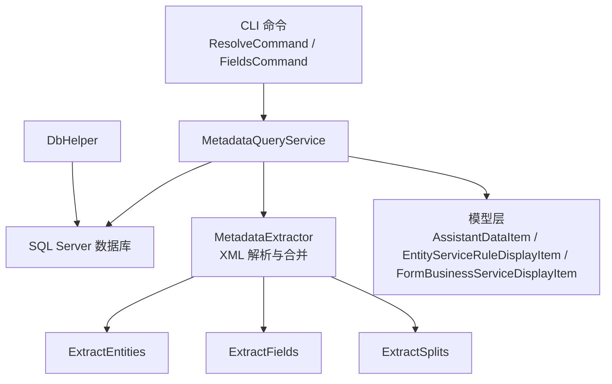
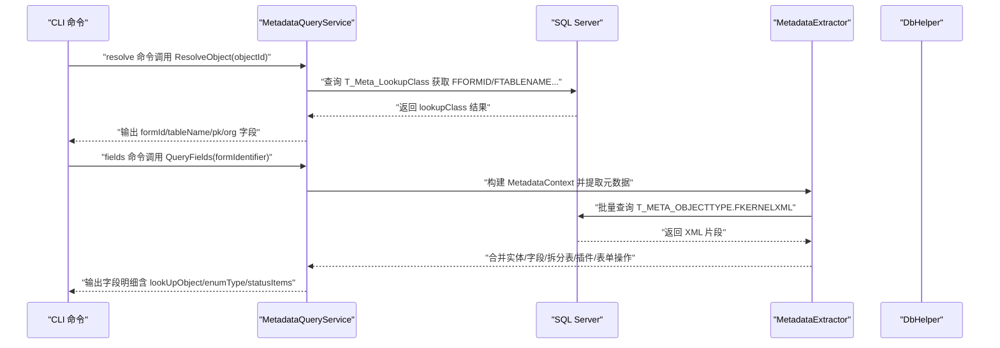
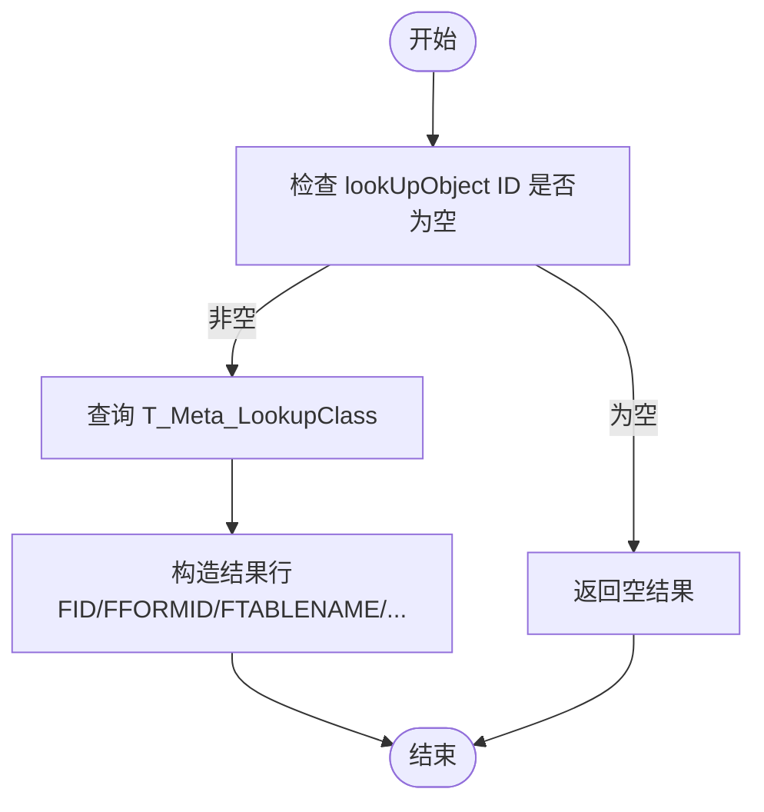
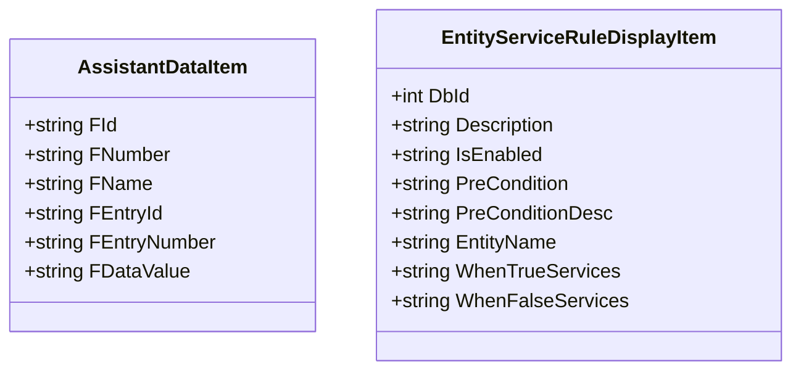
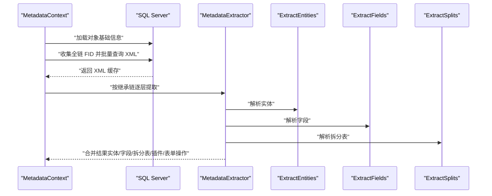
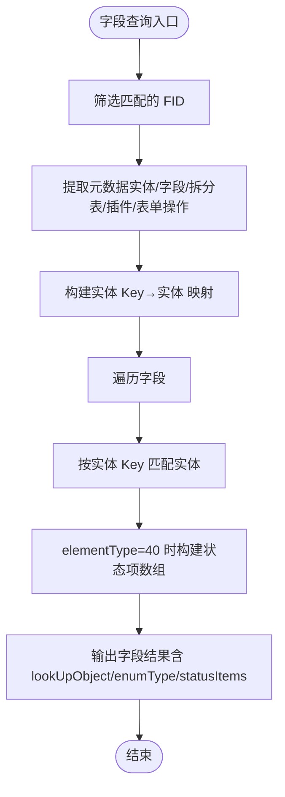
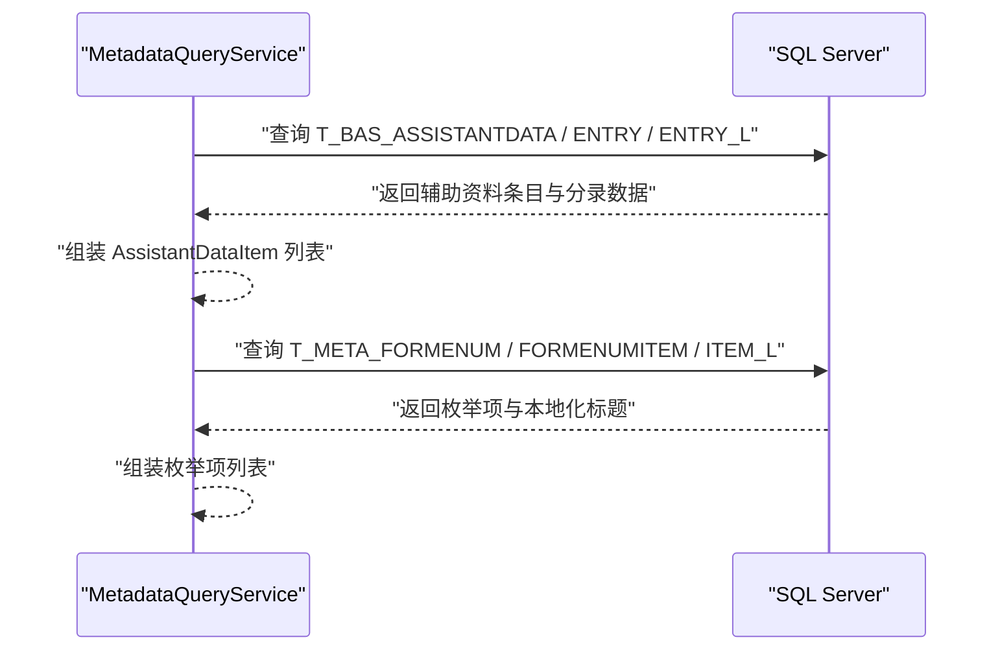
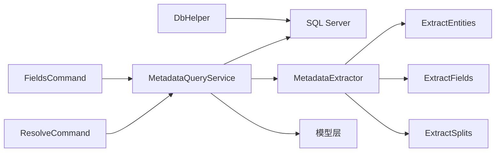

# 关联查询功能

<cite>
**本文引用的文件**
- [AssistantDataItem.cs](file://Models/AssistantDataItem.cs)
- [EntityServiceRuleDisplayItem.cs](file://Models/EntityServiceRuleDisplayItem.cs)
- [FormBusinessServiceDisplayItem.cs](file://Models/FormBusinessServiceDisplayItem.cs)
- [DbHelper.cs](file://Helpers/DbHelper.cs)
- [MetadataExtractor.cs](file://Views/MetadataExtractor.cs)
- [MetadataDbHelper.cs](file://Views/MetadataDbHelper.cs)
- [ExtractEntities.cs](file://Views/ExtractEntities.cs)
- [ExtractFields.cs](file://Views/ExtractFields.cs)
- [ExtractSplits.cs](file://Views/ExtractSplits.cs)
- [FieldUpdateActionInfo.cs](file://Views/FieldUpdateActionInfo.cs)
- [MetadataQueryService.cs](file://K3CloudDataDictionary.Cli/Services/MetadataQueryService.cs)
- [ResolveCommand.cs](file://K3CloudDataDictionary.Cli/Commands/ResolveCommand.cs)
- [FieldsCommand.cs](file://K3CloudDataDictionary.Cli/Commands/FieldsCommand.cs)
</cite>

## 目录
1. [简介](#简介)
2. [项目结构](#项目结构)
3. [核心组件](#核心组件)
4. [架构总览](#架构总览)
5. [详细组件分析](#详细组件分析)
6. [依赖关系分析](#依赖关系分析)
7. [性能考虑](#性能考虑)
8. [故障排查指南](#故障排查指南)
9. [结论](#结论)
10. [附录](#附录)

## 简介
本文件围绕“关联查询”能力，系统性阐述 lookUpObject 机制的实现原理与工作流程，详解 AssistantDataItem 与 EntityServiceRuleDisplayItem 在关联查询中的角色定位，并给出关联表单查询的解析过程（含 lookUpObject ID 的解析、关联数据的获取与处理逻辑）。同时提供复杂关联查询的实现思路与最佳实践，以及性能优化策略。

## 项目结构
该项目采用分层设计：
- CLI 层：命令入口与输出编排（ResolveCommand、FieldsCommand、JsonOutputWriter 等）
- 服务层：MetadataQueryService 提供 SQL 查询与元数据提取能力
- 视图/解析层：MetadataExtractor、ExtractEntities、ExtractFields、ExtractSplits 等负责 XML 解析与合并
- 模型层：各业务模型（如 AssistantDataItem、EntityServiceRuleDisplayItem、FormBusinessServiceDisplayItem）承载展示与绑定需求
- 辅助层：DbHelper 提供通用 SQL 访问能力

图表来源
- [MetadataQueryService.cs:12-839](file://K3CloudDataDictionary.Cli/Services/MetadataQueryService.cs#L12-L839)
- [MetadataExtractor.cs:289-880](file://Views/MetadataExtractor.cs#L289-L880)
- [ExtractEntities.cs:47-293](file://Views/ExtractEntities.cs#L47-L293)
- [ExtractFields.cs:70-167](file://Views/ExtractFields.cs#L70-L167)
- [ExtractSplits.cs:28-60](file://Views/ExtractSplits.cs#L28-L60)
- [DbHelper.cs:7-70](file://Helpers/DbHelper.cs#L7-L70)

章节来源
- [MetadataQueryService.cs:12-839](file://K3CloudDataDictionary.Cli/Services/MetadataQueryService.cs#L12-L839)
- [MetadataExtractor.cs:289-880](file://Views/MetadataExtractor.cs#L289-L880)
- [DbHelper.cs:7-70](file://Helpers/DbHelper.cs#L7-L70)

## 核心组件
- MetadataQueryService：面向 SQL Server 的实时查询服务，提供 lookUpObject 反查、字段/表单/实体/枚举/辅助资料等查询能力
- MetadataExtractor：基于 XML 的元数据提取与合并引擎，构建继承链与扩展链，产出统一的实体、字段、拆分表、插件、表单操作等结果
- ExtractEntities/ExtractFields/ExtractSplits：分别从 XML 中抽取实体、字段、拆分表信息
- AssistantDataItem / EntityServiceRuleDisplayItem / FormBusinessServiceDisplayItem：模型层数据载体，用于展示与绑定
- DbHelper：通用 SQL 访问工具，提供连接测试与查询执行

章节来源
- [MetadataQueryService.cs:12-839](file://K3CloudDataDictionary.Cli/Services/MetadataQueryService.cs#L12-L839)
- [MetadataExtractor.cs:289-880](file://Views/MetadataExtractor.cs#L289-L880)
- [ExtractEntities.cs:47-293](file://Views/ExtractEntities.cs#L47-L293)
- [ExtractFields.cs:70-167](file://Views/ExtractFields.cs#L70-L167)
- [ExtractSplits.cs:28-60](file://Views/ExtractSplits.cs#L28-L60)
- [AssistantDataItem.cs:6-58](file://Models/AssistantDataItem.cs#L6-L58)
- [EntityServiceRuleDisplayItem.cs:6-72](file://Models/EntityServiceRuleDisplayItem.cs#L6-L72)
- [FormBusinessServiceDisplayItem.cs:6-51](file://Models/FormBusinessServiceDisplayItem.cs#L6-L51)
- [DbHelper.cs:7-70](file://Helpers/DbHelper.cs#L7-L70)

## 架构总览
下图展示了“关联查询”的端到端流程：CLI 命令触发，服务层解析 lookUpObject 并查询数据库，随后通过元数据提取器合并 XML，最终输出结构化结果。

图表来源
- [ResolveCommand.cs:13-63](file://K3CloudDataDictionary.Cli/Commands/ResolveCommand.cs#L13-L63)
- [MetadataQueryService.cs:80-230](file://K3CloudDataDictionary.Cli/Services/MetadataQueryService.cs#L80-L230)
- [MetadataExtractor.cs:289-360](file://Views/MetadataExtractor.cs#L289-L360)
- [MetadataDbHelper.cs:87-127](file://Views/MetadataDbHelper.cs#L87-L127)

## 详细组件分析

### lookUpObject 机制与工作流程
- lookUpObject 是字段配置中用于关联“辅助资料”或“单据类型”等对象的标识。在字段元数据中以 LookUpObjectID 存储。
- 反查流程（resolve）：给定一个 lookUpObject ID，查询 T_Meta_LookupClass 获取其对应的表单标识（FFORMID）、主表名（FTABLENAME）、主键字段名（FPKFIELDNAME）、组织字段名（FORGFIELDNAME），从而建立“字段→表单→表”的关联。
- 字段查询（fields）：在字段结果集中，会保留原始的 FLookUpObjectID，并在展示层可进一步补充显示文本（例如通过关联查询辅助资料或单据类型数据）。

图表来源
- [MetadataQueryService.cs:80-122](file://K3CloudDataDictionary.Cli/Services/MetadataQueryService.cs#L80-L122)

章节来源
- [MetadataQueryService.cs:80-122](file://K3CloudDataDictionary.Cli/Services/MetadataQueryService.cs#L80-L122)
- [ResolveCommand.cs:13-63](file://K3CloudDataDictionary.Cli/Commands/ResolveCommand.cs#L13-L63)

### AssistantDataItem 与 EntityServiceRuleDisplayItem 的作用
- AssistantDataItem：承载“辅助资料”及其分录条目的标识与显示值，用于在字段为辅助资料类型时，提供下拉/选择的数据源。在关联查询中，可通过字段的 LookUpObjectID 反查到辅助资料，再结合该模型展示条目数据。
- EntityServiceRuleDisplayItem：承载实体级服务规则的展示信息（描述、启用状态、前置条件、真/假分支服务等），用于在字段/实体层面体现业务规则的生效范围与行为。

图表来源
- [AssistantDataItem.cs:6-58](file://Models/AssistantDataItem.cs#L6-L58)
- [EntityServiceRuleDisplayItem.cs:6-72](file://Models/EntityServiceRuleDisplayItem.cs#L6-L72)

章节来源
- [AssistantDataItem.cs:6-58](file://Models/AssistantDataItem.cs#L6-L58)
- [EntityServiceRuleDisplayItem.cs:6-72](file://Models/EntityServiceRuleDisplayItem.cs#L6-L72)

### 关联表单查询的解析过程
- 元数据上下文构建：MetadataContext 从 T_META_OBJECTTYPE 与 T_META_OBJECTTYPE_L 加载对象基础信息，构建继承链与扩展链映射，形成全量 FID 到 ObjectBasicInfo 的字典。
- 批量 XML 加载：根据目标 FID 列表，一次性查询 T_META_OBJECTTYPE.FKERNELXML，得到 XML 片段缓存。
- 元数据提取与合并：按继承链顺序逐层解析 XML，抽取实体、字段、拆分表、插件、表单操作等，使用 OID/Key 等键进行覆盖与删除逻辑，最终生成统一的结果集。
- 字段级关联：字段模型包含 LookUpObjectID 与 EnumType，可在展示层进一步查询辅助资料或枚举项，完成“ID→名称”的关联显示。

图表来源
- [MetadataExtractor.cs:289-360](file://Views/MetadataExtractor.cs#L289-L360)
- [ExtractEntities.cs:47-139](file://Views/ExtractEntities.cs#L47-L139)
- [ExtractFields.cs:70-164](file://Views/ExtractFields.cs#L70-L164)
- [ExtractSplits.cs:28-56](file://Views/ExtractSplits.cs#L28-L56)
- [MetadataDbHelper.cs:87-127](file://Views/MetadataDbHelper.cs#L87-L127)

章节来源
- [MetadataExtractor.cs:289-360](file://Views/MetadataExtractor.cs#L289-L360)
- [ExtractEntities.cs:47-139](file://Views/ExtractEntities.cs#L47-L139)
- [ExtractFields.cs:70-164](file://Views/ExtractFields.cs#L70-L164)
- [ExtractSplits.cs:28-56](file://Views/ExtractSplits.cs#L28-L56)
- [MetadataDbHelper.cs:87-127](file://Views/MetadataDbHelper.cs#L87-L127)

### 字段查询与关联数据处理
- 字段查询支持按表单标识、实体 Key、关键词进行过滤；当 elementType=40（单据状态）时，字段包含状态项集合，可直接作为嵌套对象输出。
- 字段结果中保留 FLookUpObjectID 与 FEnumType，便于后续进一步查询辅助资料或枚举项，实现“ID→名称”的关联展示。

图表来源
- [MetadataQueryService.cs:286-388](file://K3CloudDataDictionary.Cli/Services/MetadataQueryService.cs#L286-L388)

章节来源
- [MetadataQueryService.cs:286-388](file://K3CloudDataDictionary.Cli/Services/MetadataQueryService.cs#L286-L388)
- [FieldsCommand.cs:13-88](file://K3CloudDataDictionary.Cli/Commands/FieldsCommand.cs#L13-L88)

### 辅助资料与枚举项的关联查询
- 辅助资料查询：根据字段的 LookUpObjectID 查询 T_BAS_ASSISTANTDATA 及其分录、本地化信息，形成“辅助资料→分录→本地化名称”的关联数据。
- 枚举项查询：根据字段的 EnumType 查询 T_META_FORMENUM 及其枚举项、本地化标题，形成“枚举类型→枚举项→显示标题”的关联数据。

图表来源
- [MetadataQueryService.cs:635-727](file://K3CloudDataDictionary.Cli/Services/MetadataQueryService.cs#L635-L727)

章节来源
- [MetadataQueryService.cs:635-727](file://K3CloudDataDictionary.Cli/Services/MetadataQueryService.cs#L635-L727)

## 依赖关系分析
- CLI 命令依赖 MetadataQueryService 完成查询与输出编排
- MetadataQueryService 依赖 SQL Server 提供的内核元数据与业务数据
- 元数据提取依赖 MetadataExtractor 与 ExtractEntities/ExtractFields/ExtractSplits
- 模型层（AssistantDataItem、EntityServiceRuleDisplayItem、FormBusinessServiceDisplayItem）用于展示与绑定

图表来源
- [ResolveCommand.cs:13-63](file://K3CloudDataDictionary.Cli/Commands/ResolveCommand.cs#L13-L63)
- [FieldsCommand.cs:13-88](file://K3CloudDataDictionary.Cli/Commands/FieldsCommand.cs#L13-L88)
- [MetadataQueryService.cs:12-839](file://K3CloudDataDictionary.Cli/Services/MetadataQueryService.cs#L12-L839)
- [MetadataExtractor.cs:289-880](file://Views/MetadataExtractor.cs#L289-L880)
- [DbHelper.cs:7-70](file://Helpers/DbHelper.cs#L7-L70)

章节来源
- [ResolveCommand.cs:13-63](file://K3CloudDataDictionary.Cli/Commands/ResolveCommand.cs#L13-L63)
- [FieldsCommand.cs:13-88](file://K3CloudDataDictionary.Cli/Commands/FieldsCommand.cs#L13-L88)
- [MetadataQueryService.cs:12-839](file://K3CloudDataDictionary.Cli/Services/MetadataQueryService.cs#L12-L839)
- [MetadataExtractor.cs:289-880](file://Views/MetadataExtractor.cs#L289-L880)
- [DbHelper.cs:7-70](file://Helpers/DbHelper.cs#L7-L70)

## 性能考虑
- 批量加载与合并
  - 使用 MetadataContext.CollectNeededFids 一次性收集全链 FID，避免多次往返数据库
  - 使用 MetadataDbHelper.LoadKernelXmlBatch 一次性批量查询 XML，减少网络开销
- 查询优化
  - 字段查询支持 exact/fuzzy 过滤，建议在高频场景下优先 exact 匹配以降低结果集规模
  - 对搜索接口设置结果上限（如 100 条），避免大结果集带来的序列化与传输压力
- 连接与超时
  - SQL 命令设置合理 CommandTimeout（如 30~60 秒），避免长时间阻塞
  - DbHelper.TestConnection 可用于连接可用性检测，提前失败
- 内存与并发
  - 元数据提取过程为纯内存合并，注意对象数量增长导致的内存占用
  - 多线程环境下确保只读共享状态（MetadataContext），避免竞态

章节来源
- [MetadataExtractor.cs:188-311](file://Views/MetadataExtractor.cs#L188-L311)
- [MetadataDbHelper.cs:87-127](file://Views/MetadataDbHelper.cs#L87-L127)
- [MetadataQueryService.cs:396-489](file://K3CloudDataDictionary.Cli/Services/MetadataQueryService.cs#L396-L489)
- [DbHelper.cs:9-25](file://Helpers/DbHelper.cs#L9-L25)

## 故障排查指南
- 连接问题
  - 使用 DbHelper.TestConnection 检测连接字符串是否有效，捕获异常信息
- 查询无结果
  - 确认 lookUpObject ID 是否正确；resolve 命令返回空时，检查 T_Meta_LookupClass 中是否存在该 FID
  - 字段查询无结果时，确认 formIdentifier 是否匹配，或是否设置了 entityKey/keyword 导致过滤过严
- 性能问题
  - 搜索接口建议限制 keyword 长度与结果数量
  - 批量查询时关注 XML 加载耗时，必要时分批处理
- 输出格式
  - CLI 命令通过 JsonOutputWriter 输出，若出现格式异常，检查 PrettyPrint 选项与字段映射

章节来源
- [DbHelper.cs:9-25](file://Helpers/DbHelper.cs#L9-L25)
- [MetadataQueryService.cs:80-122](file://K3CloudDataDictionary.Cli/Services/MetadataQueryService.cs#L80-L122)
- [FieldsCommand.cs:13-88](file://K3CloudDataDictionary.Cli/Commands/FieldsCommand.cs#L13-L88)

## 结论
本项目通过 MetadataQueryService 与 MetadataExtractor 的协同，实现了从 lookUpObject 到表单、实体、字段、辅助资料与枚举项的完整关联查询链路。借助继承链与扩展链的合并机制，能够准确还原复杂业务形态下的元数据视图；通过批量加载与结果裁剪，兼顾了查询效率与用户体验。建议在实际应用中结合 exact 匹配、结果上限与连接池策略，持续优化性能与稳定性。

## 附录
- 常用查询命令
  - resolve：根据 lookUpObject ID 反查表单与表信息
  - fields：按表单/实体/关键词查询字段，输出包含 lookUpObject/enumType/statusItems
- 数据模型要点
  - AssistantDataItem：用于辅助资料条目展示
  - EntityServiceRuleDisplayItem：用于实体服务规则展示
  - FormBusinessServiceDisplayItem：用于业务服务展示

章节来源
- [ResolveCommand.cs:13-63](file://K3CloudDataDictionary.Cli/Commands/ResolveCommand.cs#L13-L63)
- [FieldsCommand.cs:13-88](file://K3CloudDataDictionary.Cli/Commands/FieldsCommand.cs#L13-L88)
- [AssistantDataItem.cs:6-58](file://Models/AssistantDataItem.cs#L6-L58)
- [EntityServiceRuleDisplayItem.cs:6-72](file://Models/EntityServiceRuleDisplayItem.cs#L6-L72)
- [FormBusinessServiceDisplayItem.cs:6-51](file://Models/FormBusinessServiceDisplayItem.cs#L6-L51)