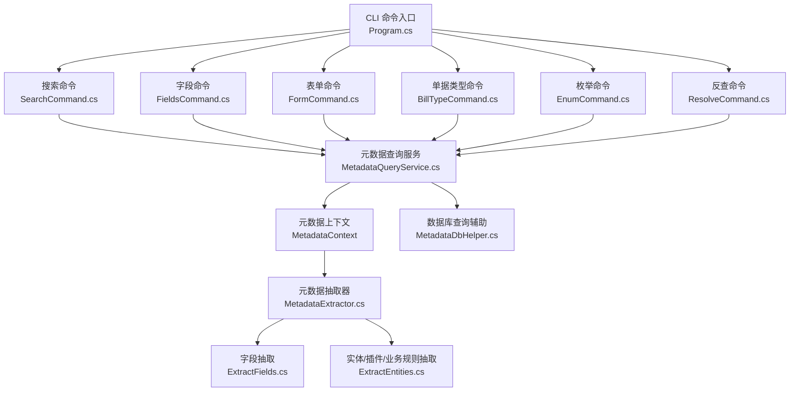
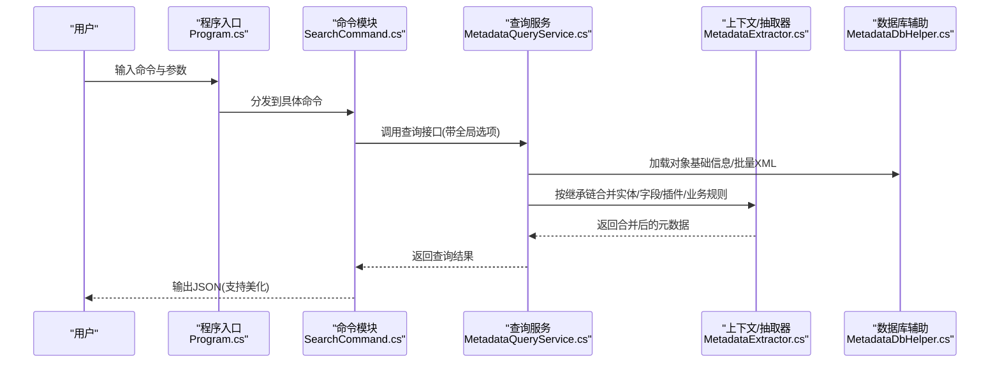
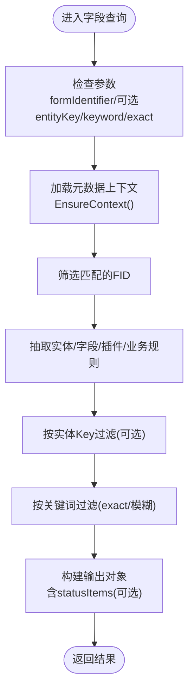
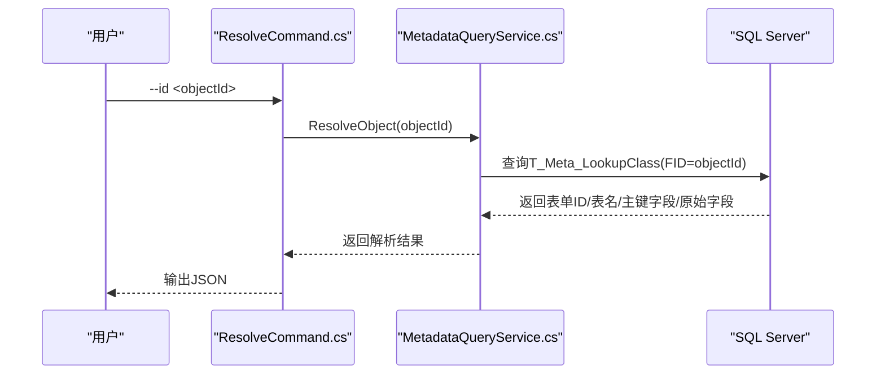
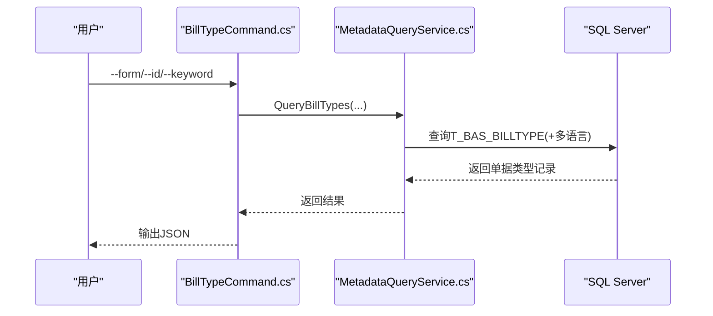
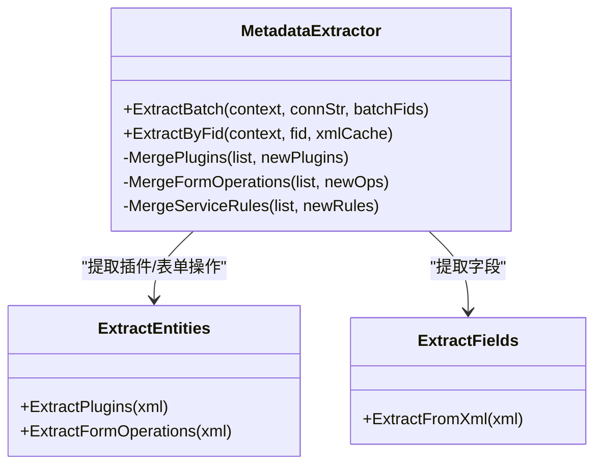
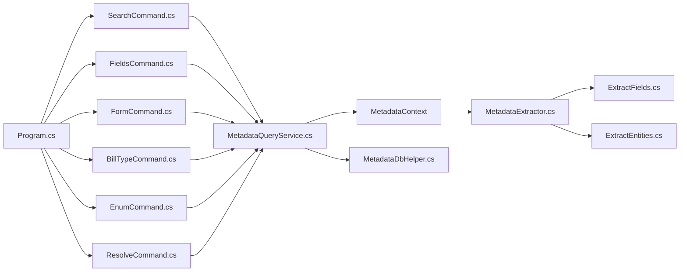

# 功能特性详解

<cite>
**本文引用的文件**
- [Program.cs](file://K3CloudDataDictionary.Cli/Program.cs)
- [SearchCommand.cs](file://K3CloudDataDictionary.Cli/Commands/SearchCommand.cs)
- [FieldsCommand.cs](file://K3CloudDataDictionary.Cli/Commands/FieldsCommand.cs)
- [FormCommand.cs](file://K3CloudDataDictionary.Cli/Commands/FormCommand.cs)
- [BillTypeCommand.cs](file://K3CloudDataDictionary.Cli/Commands/BillTypeCommand.cs)
- [EnumCommand.cs](file://K3CloudDataDictionary.Cli/Commands/EnumCommand.cs)
- [ResolveCommand.cs](file://K3CloudDataDictionary.Cli/Commands/ResolveCommand.cs)
- [MetadataQueryService.cs](file://K3CloudDataDictionary.Cli/Services/MetadataQueryService.cs)
- [MetadataExtractor.cs](file://K3CloudDataDictionary.Views/MetadataExtractor.cs)
- [MetadataDbHelper.cs](file://K3CloudDataDictionary.Views/MetadataDbHelper.cs)
- [ExtractFields.cs](file://K3CloudDataDictionary.Views/ExtractFields.cs)
- [ExtractEntities.cs](file://K3CloudDataDictionary.Views/ExtractEntities.cs)
- [SQLiteHelper.cs](file://Helpers/SQLiteHelper.cs)
- [FieldInfo.cs](file://Models/FieldInfo.cs)
- [EntityServiceRuleDisplayItem.cs](file://Models/EntityServiceRuleDisplayItem.cs)
</cite>

## 目录
1. [引言](#引言)
2. [项目结构](#项目结构)
3. [核心组件](#核心组件)
4. [架构总览](#架构总览)
5. [详细组件分析](#详细组件分析)
6. [依赖关系分析](#依赖关系分析)
7. [性能考量](#性能考量)
8. [故障排查指南](#故障排查指南)
9. [结论](#结论)
10. [附录](#附录)

## 引言
本文件面向金蝶K3 Cloud数据字典系统的使用者与开发者，系统性梳理字段查询、表单与实体查询、单据类型与状态、枚举值、关联查询（lookUpObject）以及插件与实体服务规则等高级能力的实现原理与使用方法，并提供可直接定位到源码位置的“代码片段路径”，便于快速查阅与扩展。

## 项目结构
系统采用CLI命令驱动与服务层查询分离的设计：
- CLI层：命令解析与参数校验，调用服务层执行查询并输出JSON。
- 服务层：直接连接SQL Server，基于元数据上下文与XML抽取器完成继承/扩展链合并与字段/实体/插件/业务规则等抽取。
- 视图层：负责XML解析、元数据合并、实体/字段/插件/业务规则等数据模型。
- 辅助层：SQLite本地连接配置管理、密码加密、本地数据文件扫描与导入等。

图表来源
- [Program.cs:14-69](file://K3CloudDataDictionary.Cli/Program.cs#L14-L69)
- [SearchCommand.cs:13-107](file://K3CloudDataDictionary.Cli/Commands/SearchCommand.cs#L13-L107)
- [FieldsCommand.cs:13-84](file://K3CloudDataDictionary.Cli/Commands/FieldsCommand.cs#L13-L84)
- [FormCommand.cs:13-89](file://K3CloudDataDictionary.Cli/Commands/FormCommand.cs#L13-L89)
- [BillTypeCommand.cs:13-63](file://K3CloudDataDictionary.Cli/Commands/BillTypeCommand.cs#L13-L63)
- [EnumCommand.cs:13-61](file://K3CloudDataDictionary.Cli/Commands/EnumCommand.cs#L13-L61)
- [ResolveCommand.cs:13-60](file://K3CloudDataDictionary.Cli/Commands/ResolveCommand.cs#L13-L60)
- [MetadataQueryService.cs:12-37](file://K3CloudDataDictionary.Cli/Services/MetadataQueryService.cs#L12-L37)
- [MetadataExtractor.cs:102-284](file://K3CloudDataDictionary.Views/MetadataExtractor.cs#L102-L284)
- [MetadataDbHelper.cs:36-127](file://K3CloudDataDictionary.Views/MetadataDbHelper.cs#L36-L127)
- [ExtractFields.cs:70-166](file://K3CloudDataDictionary.Views/ExtractFields.cs#L70-L166)
- [ExtractEntities.cs:47-292](file://K3CloudDataDictionary.Views/ExtractEntities.cs#L47-L292)

章节来源
- [Program.cs:14-69](file://K3CloudDataDictionary.Cli/Program.cs#L14-L69)

## 核心组件
- CLI命令层：统一入口解析命令与全局选项，调用各命令模块执行查询与输出。
- 元数据查询服务：负责连接数据库、构建元数据上下文、加载对象基础信息、按需加载XML、抽取字段/实体/插件/业务规则并执行搜索与过滤。
- 元数据上下文与抽取器：构建继承链与扩展链，按层级合并实体/字段/插件/业务规则，保证扩展对象正确覆盖与删除。
- 数据库查询辅助：提供一次性加载对象基础信息与批量加载XML的能力。
- 字段/实体/插件/业务规则模型：承载抽取后的结构化数据，供上层展示与导出。
- SQLite本地连接管理：保存/切换默认连接，支持本地数据文件导入与扫描。

章节来源
- [MetadataQueryService.cs:12-37](file://K3CloudDataDictionary.Cli/Services/MetadataQueryService.cs#L12-L37)
- [MetadataExtractor.cs:102-284](file://K3CloudDataDictionary.Views/MetadataExtractor.cs#L102-L284)
- [MetadataDbHelper.cs:36-127](file://K3CloudDataDictionary.Views/MetadataDbHelper.cs#L36-L127)
- [ExtractFields.cs:70-166](file://K3CloudDataDictionary.Views/ExtractFields.cs#L70-L166)
- [ExtractEntities.cs:47-292](file://K3CloudDataDictionary.Views/ExtractEntities.cs#L47-L292)
- [SQLiteHelper.cs:17-53](file://Helpers/SQLiteHelper.cs#L17-L53)

## 架构总览
系统通过“命令层-服务层-上下文/抽取器-数据库”的分层设计，实现对K3 Cloud元数据的高效查询与合并。命令层负责参数解析与输出格式化，服务层负责数据库访问与元数据合并，上下文与抽取器负责XML解析与继承/扩展链合并，最终形成稳定一致的查询结果。

图表来源
- [Program.cs:14-69](file://K3CloudDataDictionary.Cli/Program.cs#L14-L69)
- [SearchCommand.cs:13-107](file://K3CloudDataDictionary.Cli/Commands/SearchCommand.cs#L13-L107)
- [MetadataQueryService.cs:27-37](file://K3CloudDataDictionary.Cli/Services/MetadataQueryService.cs#L27-L37)
- [MetadataExtractor.cs:299-360](file://K3CloudDataDictionary.Views/MetadataExtractor.cs#L299-L360)
- [MetadataDbHelper.cs:87-127](file://K3CloudDataDictionary.Views/MetadataDbHelper.cs#L87-L127)

## 详细组件分析

### 字段查询功能：搜索算法、过滤、排序与显示
- 搜索算法
  - 支持按表单标识精确匹配与按表单名称模糊匹配，避免全量字段搜索导致慢查询。
  - 字段搜索支持精确匹配与模糊匹配，关键词分别匹配字段Key、Name、FieldName、PropertyName。
- 查询条件过滤
  - 可按表单标识过滤实体与字段；可按实体Key过滤字段；可按关键词过滤字段。
  - 对elementType=40（单据状态）的字段，支持statusItems嵌套子对象输出。
- 结果排序与显示
  - 字段查询输出包含表单名、实体名、表名、字段Key/Name/FieldName/PropertyName、元素类型、标签、lookUpObject、枚举类型、拆分后缀与描述、更新动作计数等。
  - 搜索命令对表与字段两类结果分别构造输出对象，字段结果在elementType=40时附加statusItems数组。
- 性能限制
  - 搜索字段/表时对结果数量进行上限控制，避免大规模返回影响性能。

图表来源
- [MetadataQueryService.cs:286-388](file://K3CloudDataDictionary.Cli/Services/MetadataQueryService.cs#L286-L388)
- [SearchCommand.cs:39-98](file://K3CloudDataDictionary.Cli/Commands/SearchCommand.cs#L39-L98)
- [FieldsCommand.cs:38-77](file://K3CloudDataDictionary.Cli/Commands/FieldsCommand.cs#L38-L77)

章节来源
- [MetadataQueryService.cs:286-388](file://K3CloudDataDictionary.Cli/Services/MetadataQueryService.cs#L286-L388)
- [SearchCommand.cs:39-98](file://K3CloudDataDictionary.Cli/Commands/SearchCommand.cs#L39-L98)
- [FieldsCommand.cs:38-77](file://K3CloudDataDictionary.Cli/Commands/FieldsCommand.cs#L38-L77)

### 关联查询功能：lookUpObject解析与表单查询
- lookUpObject解析
  - 通过对象ID（即字段的LookUpObjectID）反查T_Meta_LookupClass，获取表单ID、表名、主键字段名、原始字段名等信息。
- 关联表单查询
  - 表单查询支持按表单标识精确匹配，返回表单基础信息及插件、服务规则、操作等统计。
  - 实体查询返回实体Key、实体名、表名、条目名、元素类型、服务规则与更新动作计数等。
- 数据关联处理
  - 上下文构建继承链与扩展链，抽取器按oid/Id键合并实体与字段，确保扩展对象覆盖与删除逻辑正确。
  - 插件与业务规则同样按oid/Id键合并，支持action=remove的删除语义。

图表来源
- [ResolveCommand.cs:13-60](file://K3CloudDataDictionary.Cli/Commands/ResolveCommand.cs#L13-L60)
- [MetadataQueryService.cs:83-122](file://K3CloudDataDictionary.Cli/Services/MetadataQueryService.cs#L83-L122)

章节来源
- [ResolveCommand.cs:13-60](file://K3CloudDataDictionary.Cli/Commands/ResolveCommand.cs#L13-L60)
- [MetadataQueryService.cs:83-122](file://K3CloudDataDictionary.Cli/Services/MetadataQueryService.cs#L83-L122)
- [FormCommand.cs:13-89](file://K3CloudDataDictionary.Cli/Commands/FormCommand.cs#L13-L89)

### 单据类型管理与枚举值管理
- 单据类型管理
  - 支持按表单标识查询单据类型列表，或按ID/关键词查询详情。
  - SQL查询包含多语言名称与描述，支持模糊匹配编号/名称/描述。
- 枚举值管理
  - 支持按枚举类型ID查询枚举项列表，返回ID、名称、值、枚举项ID、标题等。
  - 适用于elementType=9的下拉列表场景。

图表来源
- [BillTypeCommand.cs:13-63](file://K3CloudDataDictionary.Cli/Commands/BillTypeCommand.cs#L13-L63)
- [MetadataQueryService.cs:569-630](file://K3CloudDataDictionary.Cli/Services/MetadataQueryService.cs#L569-L630)

章节来源
- [BillTypeCommand.cs:13-63](file://K3CloudDataDictionary.Cli/Commands/BillTypeCommand.cs#L13-L63)
- [EnumCommand.cs:13-61](file://K3CloudDataDictionary.Cli/Commands/EnumCommand.cs#L13-L61)
- [MetadataQueryService.cs:636-727](file://K3CloudDataDictionary.Cli/Services/MetadataQueryService.cs#L636-L727)

### 插件系统与实体服务规则
- 插件系统
  - 支持FormPlugins、ListPlugins、WebFormBuilderPlugins三类插件的提取与合并。
  - 合并策略：按oid（扩展）或ClassName（基础）匹配，action=remove删除，已存在则覆盖属性，不存在则新增。
- 实体服务规则
  - 支持EntityServiceRule的提取与合并，按oid（扩展）或Id（基础）匹配。
  - WhenTrue/WhenFalse中的FormBusinessService同样按oid粒度合并。
- 表单操作与验证
  - 提取FormOperations及其Validations、ServicePlugins、AppBusinessService，支持action=remove与属性覆盖。

图表来源
- [MetadataExtractor.cs:299-360](file://K3CloudDataDictionary.Views/MetadataExtractor.cs#L299-L360)
- [ExtractEntities.cs:144-292](file://K3CloudDataDictionary.Views/ExtractEntities.cs#L144-L292)
- [ExtractFields.cs:70-166](file://K3CloudDataDictionary.Views/ExtractFields.cs#L70-L166)

章节来源
- [MetadataExtractor.cs:425-451](file://K3CloudDataDictionary.Views/MetadataExtractor.cs#L425-L451)
- [MetadataExtractor.cs:466-499](file://K3CloudDataDictionary.Views/MetadataExtractor.cs#L466-L499)
- [MetadataExtractor.cs:726-759](file://K3CloudDataDictionary.Views/MetadataExtractor.cs#L726-L759)
- [ExtractEntities.cs:144-292](file://K3CloudDataDictionary.Views/ExtractEntities.cs#L144-L292)
- [ExtractFields.cs:70-166](file://K3CloudDataDictionary.Views/ExtractFields.cs#L70-L166)

### 单据状态字段与状态项查询
- 仅处理elementType=40的字段，构建statusItems嵌套数组，包含状态值与状态名。
- 支持按表单标识与字段Key过滤，以及按状态名称/值的关键词模糊搜索。

章节来源
- [MetadataQueryService.cs:736-806](file://K3CloudDataDictionary.Cli/Services/MetadataQueryService.cs#L736-L806)
- [SearchCommand.cs:66-98](file://K3CloudDataDictionary.Cli/Commands/SearchCommand.cs#L66-L98)

### 辅助资料（LookUpObject）查询
- 通过字段的LookUpObjectID查询T_BAS_ASSISTANTDATA相关表，返回辅助资料主表、分录、多语言描述等信息。

章节来源
- [MetadataQueryService.cs:636-679](file://K3CloudDataDictionary.Cli/Services/MetadataQueryService.cs#L636-L679)

## 依赖关系分析
- 命令层依赖服务层：各命令模块通过MetadataQueryService执行查询。
- 服务层依赖上下文与抽取器：EnsureContext懒加载，构建继承/扩展链，按层级合并实体/字段/插件/业务规则。
- 抽取器依赖数据库辅助：一次性加载对象基础信息与批量XML。
- SQLite辅助：本地连接配置与本地数据文件管理，为CLI提供连接选择与默认连接解析。

图表来源
- [Program.cs:14-69](file://K3CloudDataDictionary.Cli/Program.cs#L14-L69)
- [SearchCommand.cs:13-107](file://K3CloudDataDictionary.Cli/Commands/SearchCommand.cs#L13-L107)
- [FieldsCommand.cs:13-84](file://K3CloudDataDictionary.Cli/Commands/FieldsCommand.cs#L13-L84)
- [FormCommand.cs:13-89](file://K3CloudDataDictionary.Cli/Commands/FormCommand.cs#L13-L89)
- [BillTypeCommand.cs:13-63](file://K3CloudDataDictionary.Cli/Commands/BillTypeCommand.cs#L13-L63)
- [EnumCommand.cs:13-61](file://K3CloudDataDictionary.Cli/Commands/EnumCommand.cs#L13-L61)
- [ResolveCommand.cs:13-60](file://K3CloudDataDictionary.Cli/Commands/ResolveCommand.cs#L13-L60)
- [MetadataQueryService.cs:12-37](file://K3CloudDataDictionary.Cli/Services/MetadataQueryService.cs#L12-L37)
- [MetadataExtractor.cs:102-284](file://K3CloudDataDictionary.Views/MetadataExtractor.cs#L102-L284)
- [MetadataDbHelper.cs:36-127](file://K3CloudDataDictionary.Views/MetadataDbHelper.cs#L36-L127)
- [ExtractFields.cs:70-166](file://K3CloudDataDictionary.Views/ExtractFields.cs#L70-L166)
- [ExtractEntities.cs:47-292](file://K3CloudDataDictionary.Views/ExtractEntities.cs#L47-L292)

## 性能考量
- 懒加载与上下文复用：EnsureContext仅在首次使用时加载对象基础信息与元素类型映射，减少重复开销。
- 批量XML加载：MetadataDbHelper.LoadKernelXmlBatch一次性查询多个FID的XML，降低网络往返。
- 结果数量限制：搜索字段/表时限制返回数量，避免大规模输出影响性能。
- 连接超时设置：查询SQL设置合理CommandTimeout，避免长时间阻塞。
- 建议
  - 大规模查询时优先使用精确匹配与限定表单标识，减少全量扫描。
  - 合理使用--exact与--keyword组合，缩小搜索范围。
  - 在高并发场景下，考虑增加数据库连接池与查询索引优化。

## 故障排查指南
- 未找到连接或默认连接缺失
  - 现象：提示未找到指定ID的连接或没有默认连接。
  - 排查：使用连接管理命令配置连接并设置默认连接。
  - 参考
    - [Program.cs:129-151](file://K3CloudDataDictionary.Cli/Program.cs#L129-L151)
    - [SQLiteHelper.cs:55-112](file://Helpers/SQLiteHelper.cs#L55-L112)
- 查询异常
  - 现象：命令执行抛出异常并输出错误信息。
  - 排查：检查数据库连接字符串、网络连通性、SQL Server权限与表是否存在。
  - 参考
    - [Program.cs:64-68](file://K3CloudDataDictionary.Cli/Program.cs#L64-L68)
    - [MetadataQueryService.cs:27-37](file://K3CloudDataDictionary.Cli/Services/MetadataQueryService.cs#L27-L37)
- 结果为空
  - 现象：查询无结果。
  - 排查：确认表单标识、实体Key、关键词拼写与大小写；检查对象是否为扩展类型（FDEVTYPE=2会被跳过）。
  - 参考
    - [MetadataQueryService.cs:408-409](file://K3CloudDataDictionary.Cli/Services/MetadataQueryService.cs#L408-L409)
    - [MetadataQueryService.cs:508-509](file://K3CloudDataDictionary.Cli/Services/MetadataQueryService.cs#L508-L509)

章节来源
- [Program.cs:64-68](file://K3CloudDataDictionary.Cli/Program.cs#L64-L68)
- [Program.cs:129-151](file://K3CloudDataDictionary.Cli/Program.cs#L129-L151)
- [SQLiteHelper.cs:55-112](file://Helpers/SQLiteHelper.cs#L55-L112)
- [MetadataQueryService.cs:408-409](file://K3CloudDataDictionary.Cli/Services/MetadataQueryService.cs#L408-L409)
- [MetadataQueryService.cs:508-509](file://K3CloudDataDictionary.Cli/Services/MetadataQueryService.cs#L508-L509)

## 结论
本系统通过清晰的分层设计与严谨的元数据合并机制，实现了对K3 Cloud字段、实体、插件、业务规则、单据类型、枚举与关联查询的全面支持。命令层提供简洁的查询接口，服务层与上下文/抽取器保障了扩展对象的正确合并与高性能查询。结合SQLite本地连接管理与结果数量限制，系统在可用性与性能之间取得良好平衡。

## 附录
- 代码片段路径示例（仅列出关键位置）
  - 字段查询与过滤
    - [字段查询入口:286-388](file://K3CloudDataDictionary.Cli/Services/MetadataQueryService.cs#L286-L388)
    - [字段命令输出转换:38-77](file://K3CloudDataDictionary.Cli/Commands/FieldsCommand.cs#L38-L77)
  - 搜索功能
    - [搜索命令入口:13-107](file://K3CloudDataDictionary.Cli/Commands/SearchCommand.cs#L13-L107)
    - [搜索表实现:496-561](file://K3CloudDataDictionary.Cli/Services/MetadataQueryService.cs#L496-L561)
    - [搜索字段实现:395-489](file://K3CloudDataDictionary.Cli/Services/MetadataQueryService.cs#L395-L489)
  - 关联查询与表单查询
    - [反查lookUpObject:13-60](file://K3CloudDataDictionary.Cli/Commands/ResolveCommand.cs#L13-L60)
    - [表单查询:172-230](file://K3CloudDataDictionary.Cli/Services/MetadataQueryService.cs#L172-L230)
    - [实体查询:235-277](file://K3CloudDataDictionary.Cli/Services/MetadataQueryService.cs#L235-L277)
  - 单据类型与枚举
    - [单据类型查询:13-63](file://K3CloudDataDictionary.Cli/Commands/BillTypeCommand.cs#L13-L63)
    - [枚举项查询:13-61](file://K3CloudDataDictionary.Cli/Commands/EnumCommand.cs#L13-L61)
  - 插件与实体服务规则
    - [插件合并策略:425-451](file://K3CloudDataDictionary.Views/MetadataExtractor.cs#L425-L451)
    - [业务规则合并策略:726-759](file://K3CloudDataDictionary.Views/MetadataExtractor.cs#L726-L759)
    - [表单操作与验证提取:182-274](file://K3CloudDataDictionary.Views/ExtractEntities.cs#L182-L274)
  - XML抽取与上下文
    - [字段抽取:70-166](file://K3CloudDataDictionary.Views/ExtractFields.cs#L70-L166)
    - [实体/插件/业务规则抽取:47-292](file://K3CloudDataDictionary.Views/ExtractEntities.cs#L47-L292)
    - [元数据上下文构建:102-284](file://K3CloudDataDictionary.Views/MetadataExtractor.cs#L102-L284)
    - [基础信息与XML批量加载:44-127](file://K3CloudDataDictionary.Views/MetadataDbHelper.cs#L44-L127)
  - 本地连接与数据文件
    - [SQLite初始化与连接管理:17-112](file://Helpers/SQLiteHelper.cs#L17-L112)
    - [本地数据文件扫描与导入:218-303](file://Helpers/SQLiteHelper.cs#L218-L303)