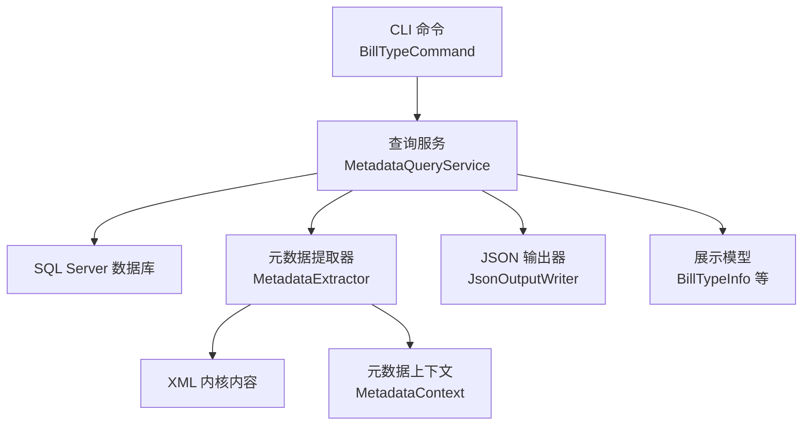
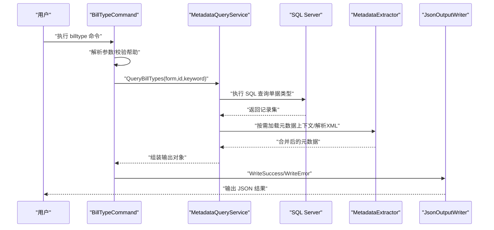
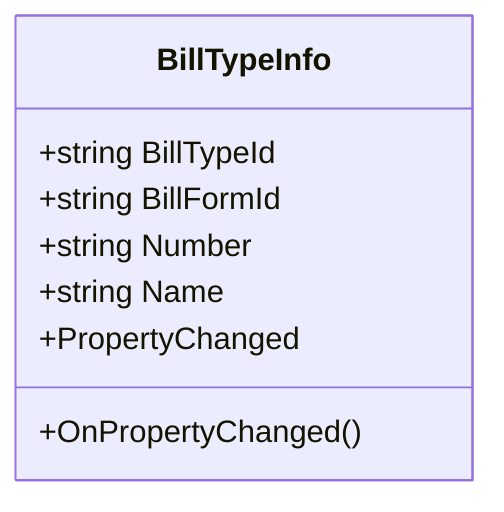
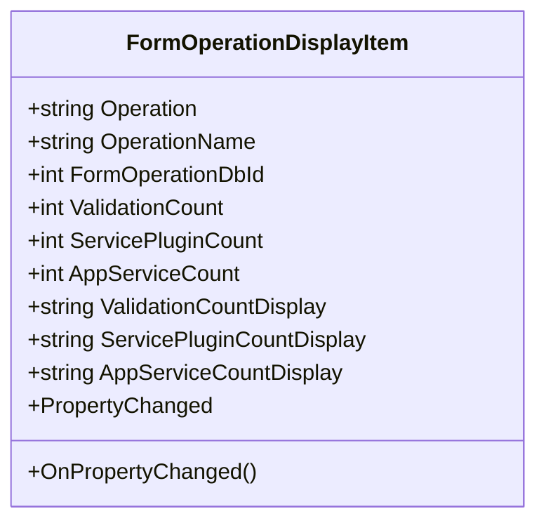
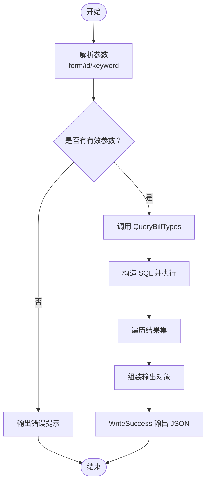
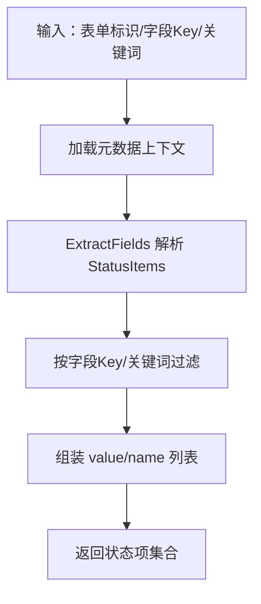
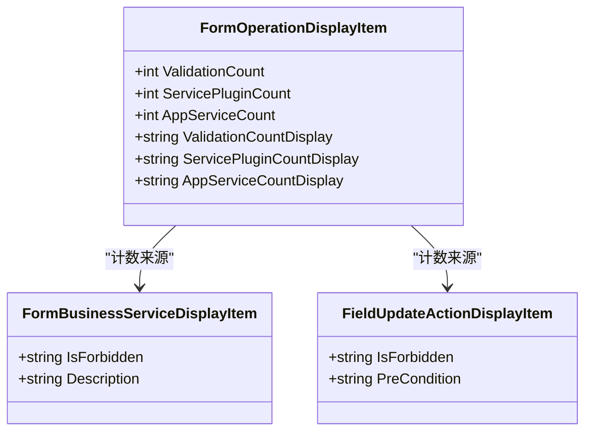
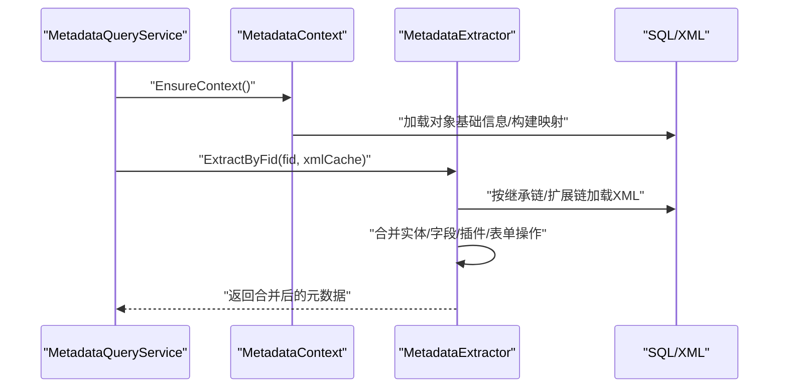
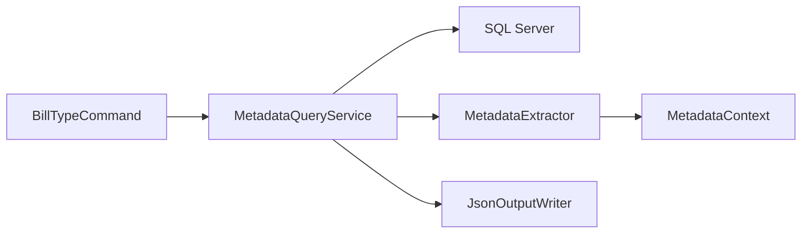

# 单据类型管理

<cite>
**本文引用的文件**
- [BillTypeInfo.cs](file://Models/BillTypeInfo.cs)
- [FormOperationDisplayItem.cs](file://Models/FormOperationDisplayItem.cs)
- [BillTypeCommand.cs](file://K3CloudDataDictionary.Cli/Commands/BillTypeCommand.cs)
- [MetadataQueryService.cs](file://K3CloudDataDictionary.Cli/Services/MetadataQueryService.cs)
- [MetadataExtractor.cs](file://Views/MetadataExtractor.cs)
- [ExtractFields.cs](file://Views/ExtractFields.cs)
- [ExtractEntities.cs](file://Views/ExtractEntities.cs)
- [ExtractSplits.cs](file://Views/ExtractSplits.cs)
- [FieldInfo.cs](file://Models/FieldInfo.cs)
- [EntityServiceRuleDisplayItem.cs](file://Models/EntityServiceRuleDisplayItem.cs)
- [FieldUpdateActionDisplayItem.cs](file://Models/FieldUpdateActionDisplayItem.cs)
- [FormBusinessServiceDisplayItem.cs](file://Models/FormBusinessServiceDisplayItem.cs)
- [MetadataDbHelper.cs](file://Views/MetadataDbHelper.cs)
- [JsonOutputWriter.cs](file://K3CloudDataDictionary.Cli/Services/JsonOutputWriter.cs)
</cite>

## 目录
1. [简介](#简介)
2. [项目结构](#项目结构)
3. [核心组件](#核心组件)
4. [架构总览](#架构总览)
5. [详细组件分析](#详细组件分析)
6. [依赖关系分析](#依赖关系分析)
7. [性能考量](#性能考量)
8. [故障排查指南](#故障排查指南)
9. [结论](#结论)
10. [附录](#附录)

## 简介
本文件围绕“单据类型管理”主题，系统性梳理并解释以下内容：
- BillTypeInfo 数据模型的设计与职责边界
- 单据类型查询、配置管理、状态跟踪的实现原理
- FormOperationDisplayItem 在单据操作管理中的作用与实现逻辑
- 单据状态枚举值的处理方式
- 业务操作的权限控制机制（基于应用服务与插件的启用/禁用标记）
- 提供具体命令行调用示例与代码片段路径，便于快速定位实现位置

## 项目结构
该项目采用分层与领域模型结合的组织方式：
- Models：定义展示层与业务显示所需的轻量模型（如 BillTypeInfo、FormOperationDisplayItem 等）
- Views：负责元数据抽取与解析（XML→实体/字段/拆分表/表单操作等），并维护上下文与合并策略
- K3CloudDataDictionary.Cli：命令行入口与服务编排，封装查询服务、输出格式化
- Helpers/Services：通用工具与输出格式化器

图示来源
- [BillTypeCommand.cs:1-66](file://K3CloudDataDictionary.Cli/Commands/BillTypeCommand.cs#L1-L66)
- [MetadataQueryService.cs:1-839](file://K3CloudDataDictionary.Cli/Services/MetadataQueryService.cs#L1-L839)
- [MetadataExtractor.cs:1-880](file://Views/MetadataExtractor.cs#L1-L880)
- [JsonOutputWriter.cs:1-91](file://K3CloudDataDictionary.Cli/Services/JsonOutputWriter.cs#L1-L91)

章节来源
- [BillTypeCommand.cs:1-66](file://K3CloudDataDictionary.Cli/Commands/BillTypeCommand.cs#L1-L66)
- [MetadataQueryService.cs:1-839](file://K3CloudDataDictionary.Cli/Services/MetadataQueryService.cs#L1-L839)
- [MetadataExtractor.cs:1-880](file://Views/MetadataExtractor.cs#L1-L880)
- [JsonOutputWriter.cs:1-91](file://K3CloudDataDictionary.Cli/Services/JsonOutputWriter.cs#L1-L91)

## 核心组件
- BillTypeInfo：承载单据类型的基本信息（类型ID、表单ID、编号、名称），并实现属性变更通知，便于 UI 绑定与刷新
- FormOperationDisplayItem：承载表单操作的显示信息（操作码、名称、验证计数、服务插件计数、应用服务计数），并提供计数到显示文本的转换
- MetadataQueryService：直接连接 SQL Server 实时查询单据类型，并在需要时加载元数据上下文与执行 XML 抽取
- MetadataExtractor：负责从 XML 中解析实体、字段、拆分表、插件、表单操作等，并按继承链与扩展链进行合并
- JsonOutputWriter：统一输出格式，支持成功/失败消息与计数统计

章节来源
- [BillTypeInfo.cs:1-45](file://Models/BillTypeInfo.cs#L1-L45)
- [FormOperationDisplayItem.cs:1-169](file://Models/FormOperationDisplayItem.cs#L1-L169)
- [MetadataQueryService.cs:563-630](file://K3CloudDataDictionary.Cli/Services/MetadataQueryService.cs#L563-L630)
- [MetadataExtractor.cs:289-397](file://Views/MetadataExtractor.cs#L289-L397)
- [JsonOutputWriter.cs:23-80](file://K3CloudDataDictionary.Cli/Services/JsonOutputWriter.cs#L23-L80)

## 架构总览
下图展示了“单据类型查询”的端到端流程：CLI 命令接收参数，调用查询服务，服务根据参数构造 SQL 查询，必要时加载元数据上下文并解析 XML，最终通过 JSON 输出器返回结构化结果。

图示来源
- [BillTypeCommand.cs:13-63](file://K3CloudDataDictionary.Cli/Commands/BillTypeCommand.cs#L13-L63)
- [MetadataQueryService.cs:569-629](file://K3CloudDataDictionary.Cli/Services/MetadataQueryService.cs#L569-L629)
- [JsonOutputWriter.cs:26-70](file://K3CloudDataDictionary.Cli/Services/JsonOutputWriter.cs#L26-L70)

## 详细组件分析

### BillTypeInfo 数据模型
- 设计要点
  - 使用 INotifyPropertyChanged 支持 UI 绑定
  - 字段包括：单据类型ID、表单ID、编号、名称
- 复杂度与性能
  - 仅包含简单属性与通知事件，内存占用极低，适合大量实例化与绑定场景
- 错误处理与边界
  - 无复杂校验逻辑，异常主要来自上游查询或绑定层

图示来源
- [BillTypeInfo.cs:6-42](file://Models/BillTypeInfo.cs#L6-L42)

章节来源
- [BillTypeInfo.cs:1-45](file://Models/BillTypeInfo.cs#L1-L45)

### FormOperationDisplayItem 在单据操作管理中的作用
- 角色定位
  - 作为展示层模型，承载单据表单操作的显示信息（操作码、名称、验证/插件/应用服务计数）
  - 提供计数到显示文本的转换，便于 UI 直观呈现
- 关键字段
  - Operation、OperationName、FormOperationDbId
  - ValidationCount、ServicePluginCount、AppServiceCount
  - 对应的显示属性 ValidationCountDisplay、ServicePluginCountDisplay、AppServiceCountDisplay
- 与业务控制的关系
  - 计数来源于元数据解析阶段对 Validations、ServicePlugins、AppBusinessServices 的统计
  - 是否启用/禁用通常由插件或应用服务的 IsEnabled/IsForbidden 标记体现，属于权限控制的间接依据

图示来源
- [FormOperationDisplayItem.cs:6-59](file://Models/FormOperationDisplayItem.cs#L6-L59)

章节来源
- [FormOperationDisplayItem.cs:1-169](file://Models/FormOperationDisplayItem.cs#L1-L169)

### 单据类型查询与配置管理
- 查询入口
  - CLI 命令 BillTypeCommand 接收 form、id、keyword 参数，调用 MetadataQueryService.QueryBillTypes
- SQL 查询逻辑
  - 支持按表单标识、单据类型ID、关键词（编号/名称/描述）组合查询
  - 返回包含 FBILLTYPEID、FBILLFORMID、FNUMBER、FNAME、FDESCRIPTION 的记录集
- 输出格式
  - 通过 JsonOutputWriter 统一输出，包含 success、command、data、count 等字段

图示来源
- [BillTypeCommand.cs:13-63](file://K3CloudDataDictionary.Cli/Commands/BillTypeCommand.cs#L13-L63)
- [MetadataQueryService.cs:569-629](file://K3CloudDataDictionary.Cli/Services/MetadataQueryService.cs#L569-L629)
- [JsonOutputWriter.cs:26-53](file://K3CloudDataDictionary.Cli/Services/JsonOutputWriter.cs#L26-L53)

章节来源
- [BillTypeCommand.cs:1-66](file://K3CloudDataDictionary.Cli/Commands/BillTypeCommand.cs#L1-L66)
- [MetadataQueryService.cs:563-630](file://K3CloudDataDictionary.Cli/Services/MetadataQueryService.cs#L563-L630)
- [JsonOutputWriter.cs:1-91](file://K3CloudDataDictionary.Cli/Services/JsonOutputWriter.cs#L1-L91)

### 单据状态枚举值处理
- 元数据层面
  - 字段解析器 ExtractFields 支持提取 StatusItems（单据状态字段，ElementType=40）
  - StatusItems 包含 Id、StatusName、StatusValue
- 查询接口
  - MetadataQueryService.QueryBillStatusItems 支持按表单标识与字段Key/关键词筛选状态项
  - 返回每条状态项的 value/name 字段，便于前端展示与选择
- 展示模型
  - FieldInfo 提供 UpdateActionCountDisplay 等显示辅助，类似地可扩展用于状态项计数显示

图示来源
- [ExtractFields.cs:70-164](file://Views/ExtractFields.cs#L70-L164)
- [MetadataQueryService.cs:736-806](file://K3CloudDataDictionary.Cli/Services/MetadataQueryService.cs#L736-L806)
- [FieldInfo.cs:88-94](file://Models/FieldInfo.cs#L88-L94)

章节来源
- [ExtractFields.cs:1-167](file://Views/ExtractFields.cs#L1-L167)
- [MetadataQueryService.cs:729-806](file://K3CloudDataDictionary.Cli/Services/MetadataQueryService.cs#L729-L806)
- [FieldInfo.cs:1-110](file://Models/FieldInfo.cs#L1-L110)

### 业务操作的权限控制机制
- 插件与应用服务的启用/禁用
  - 元数据解析阶段，插件与应用服务均包含 IsEnabled/IsForbidden 等标记
  - FormOperationDisplayItem 的计数字段（ValidationCount、ServicePluginCount、AppServiceCount）反映这些资源的存在与数量
- 权限控制的实现位置
  - 插件与应用服务的启用/禁用标记在 XML 中定义，解析后进入合并流程
  - 合并策略会覆盖或移除同源项，确保最终结果准确反映继承与扩展后的实际状态
- 与展示层的衔接
  - 展示层模型（如 FormOperationDisplayItem、FormBusinessServiceDisplayItem、FieldUpdateActionDisplayItem）仅负责呈现，不承担业务判断逻辑

图示来源
- [FormOperationDisplayItem.cs:6-59](file://Models/FormOperationDisplayItem.cs#L6-L59)
- [FormBusinessServiceDisplayItem.cs:6-49](file://Models/FormBusinessServiceDisplayItem.cs#L6-L49)
- [FieldUpdateActionDisplayItem.cs:6-78](file://Models/FieldUpdateActionDisplayItem.cs#L6-L78)

章节来源
- [ExtractEntities.cs:182-274](file://Views/ExtractEntities.cs#L182-L274)
- [MetadataExtractor.cs:466-606](file://Views/MetadataExtractor.cs#L466-L606)
- [FormOperationDisplayItem.cs:1-169](file://Models/FormOperationDisplayItem.cs#L1-L169)
- [FormBusinessServiceDisplayItem.cs:1-51](file://Models/FormBusinessServiceDisplayItem.cs#L1-L51)
- [FieldUpdateActionDisplayItem.cs:1-80](file://Models/FieldUpdateActionDisplayItem.cs#L1-L80)

### 元数据抽取与合并（支撑单据类型管理）
- 上下文与批处理
  - MetadataContext 负责构建对象基础信息、继承链与扩展链映射，支持按批收集所需 FID 并加载 XML
  - MetadataExtractor 逐层合并实体、字段、拆分表、插件与表单操作，遵循“oid 优先，action 控制（add/edit/remove）”的合并策略
- 与单据类型的关系
  - 单据类型查询依赖 SQL 查询结果；若需要统计插件、服务规则、表单操作数量，则通过元数据抽取完成
  - 元数据抽取过程贯穿于查询服务内部，按需触发

图示来源
- [MetadataQueryService.cs:27-37](file://K3CloudDataDictionary.Cli/Services/MetadataQueryService.cs#L27-L37)
- [MetadataExtractor.cs:289-397](file://Views/MetadataExtractor.cs#L289-L397)
- [MetadataDbHelper.cs:44-127](file://Views/MetadataDbHelper.cs#L44-L127)

章节来源
- [MetadataQueryService.cs:1-839](file://K3CloudDataDictionary.Cli/Services/MetadataQueryService.cs#L1-L839)
- [MetadataExtractor.cs:1-880](file://Views/MetadataExtractor.cs#L1-L880)
- [MetadataDbHelper.cs:1-131](file://Views/MetadataDbHelper.cs#L1-L131)

## 依赖关系分析
- 命令层依赖查询服务：CLI 命令仅负责参数解析与调用服务
- 查询服务依赖数据库与元数据抽取：根据查询需求决定是否加载元数据上下文
- 元数据抽取依赖 XML 解析与上下文：按继承与扩展链合并，保证结果正确性
- 输出层独立：JsonOutputWriter 不依赖业务逻辑，仅负责格式化

图示来源
- [BillTypeCommand.cs:1-66](file://K3CloudDataDictionary.Cli/Commands/BillTypeCommand.cs#L1-L66)
- [MetadataQueryService.cs:1-839](file://K3CloudDataDictionary.Cli/Services/MetadataQueryService.cs#L1-L839)
- [MetadataExtractor.cs:1-880](file://Views/MetadataExtractor.cs#L1-L880)
- [JsonOutputWriter.cs:1-91](file://K3CloudDataDictionary.Cli/Services/JsonOutputWriter.cs#L1-L91)

章节来源
- [BillTypeCommand.cs:1-66](file://K3CloudDataDictionary.Cli/Commands/BillTypeCommand.cs#L1-L66)
- [MetadataQueryService.cs:1-839](file://K3CloudDataDictionary.Cli/Services/MetadataQueryService.cs#L1-L839)
- [MetadataExtractor.cs:1-880](file://Views/MetadataExtractor.cs#L1-L880)
- [JsonOutputWriter.cs:1-91](file://K3CloudDataDictionary.Cli/Services/JsonOutputWriter.cs#L1-L91)

## 性能考量
- SQL 查询优化
  - QueryBillTypes 使用参数化查询，避免注入风险；建议在常用查询列上建立索引（如 FNUMBER、FBILLFORMID）
- 元数据加载策略
  - MetadataContext 一次性加载对象基础信息，避免重复查询
  - 批量加载 XML，减少数据库往返次数
- 合并算法复杂度
  - 合并字典与列表的匹配基于键（oid/Id/ClassName/Key 等），整体复杂度受实体/字段/插件数量影响
- I/O 与内存
  - XML 解析与对象克隆会产生一定内存开销，建议在大批量场景下分批处理并及时释放

## 故障排查指南
- 常见问题与定位
  - 参数缺失：CLI 命令会在缺少必要参数时输出错误并展示帮助
  - 数据库连接：查询服务在初始化上下文时会打印加载进度，若失败请检查连接字符串与网络连通性
  - 元数据解析：若某 FID 的 XML 缺失或为空，提取器会跳过该部分，不会中断整体流程
- 建议排查步骤
  - 确认参数 form/id/keyword 至少提供一项
  - 检查 SQL Server 可达性与权限
  - 若出现大量空结果，确认表单标识是否正确，或尝试使用 keyword 模糊查询
  - 查看控制台错误输出（JsonOutputWriter.WriteError）

章节来源
- [BillTypeCommand.cs:29-34](file://K3CloudDataDictionary.Cli/Commands/BillTypeCommand.cs#L29-L34)
- [MetadataQueryService.cs:31-36](file://K3CloudDataDictionary.Cli/Services/MetadataQueryService.cs#L31-L36)
- [JsonOutputWriter.cs:58-70](file://K3CloudDataDictionary.Cli/Services/JsonOutputWriter.cs#L58-L70)

## 结论
- 单据类型管理以 SQL 查询为核心，结合元数据抽取实现“按表单/按ID/按关键词”的灵活查询
- BillTypeInfo 与 FormOperationDisplayItem 分别承担“数据模型”与“展示模型”的职责，配合 JsonOutputWriter 提供统一输出
- 单据状态枚举值通过字段解析与查询接口暴露，便于前端选择与业务判断
- 权限控制通过插件与应用服务的启用/禁用标记实现，展示层通过计数与显示文本直观呈现

## 附录
- 命令行示例（路径参考）
  - 查询单据类型列表（按表单）：参见 [BillTypeCommand.cs:25](file://K3CloudDataDictionary.Cli/Commands/BillTypeCommand.cs#L25)
  - 查询单据类型详情（按 ID）：参见 [BillTypeCommand.cs:26](file://K3CloudDataDictionary.Cli/Commands/BillTypeCommand.cs#L26)
  - 按关键词查询（模糊）：参见 [BillTypeCommand.cs:27](file://K3CloudDataDictionary.Cli/Commands/BillTypeCommand.cs#L27)
  - SQL 查询实现：参见 [MetadataQueryService.cs:569-629](file://K3CloudDataDictionary.Cli/Services/MetadataQueryService.cs#L569-L629)
  - 状态项查询实现：参见 [MetadataQueryService.cs:736-806](file://K3CloudDataDictionary.Cli/Services/MetadataQueryService.cs#L736-L806)
  - 插件/应用服务与表单操作解析：参见 [ExtractEntities.cs:182-274](file://Views/ExtractEntities.cs#L182-L274)
  - 元数据合并策略：参见 [MetadataExtractor.cs:466-606](file://Views/MetadataExtractor.cs#L466-L606)