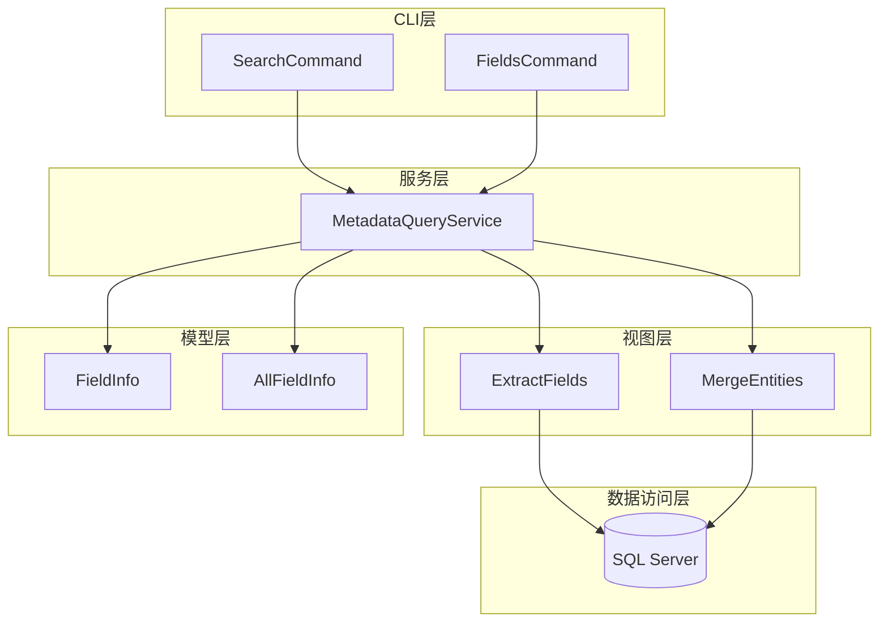
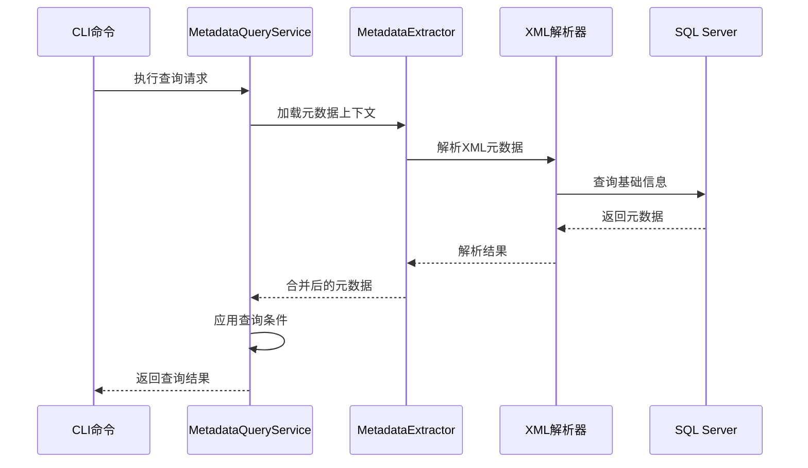
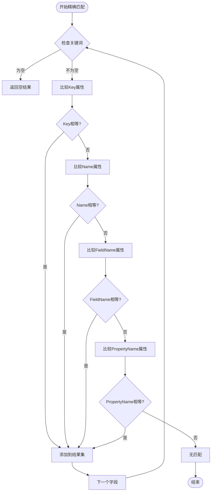
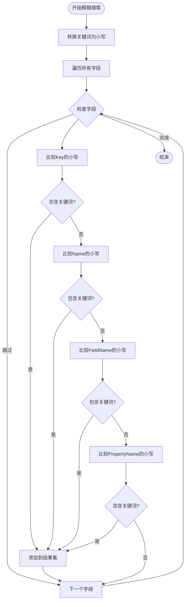
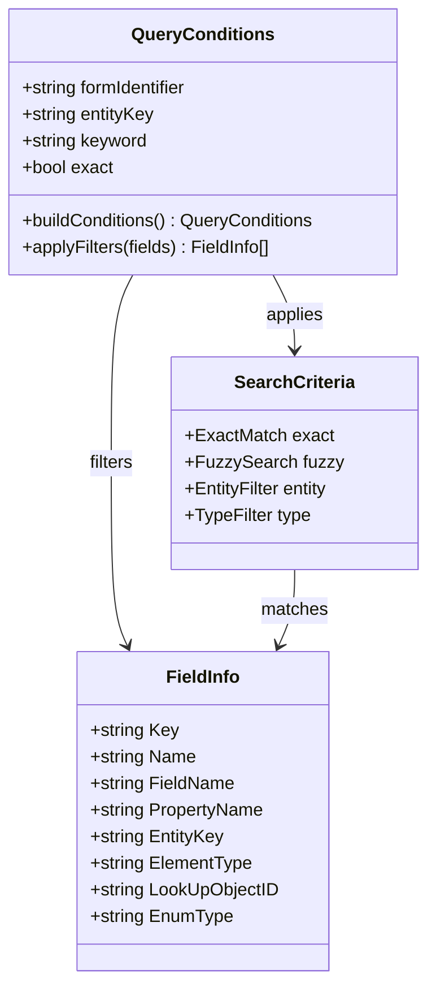
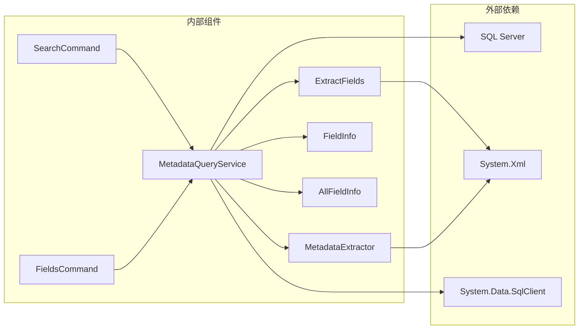

# 字段查询功能

<cite>
**本文档引用的文件**
- [FieldInfo.cs](file://Models/FieldInfo.cs)
- [AllFieldInfo.cs](file://Models/AllFieldInfo.cs)
- [SearchCommand.cs](file://K3CloudDataDictionary.Cli/Commands/SearchCommand.cs)
- [FieldsCommand.cs](file://K3CloudDataDictionary.Cli/Commands/FieldsCommand.cs)
- [MetadataQueryService.cs](file://K3CloudDataDictionary.Cli/Services/MetadataQueryService.cs)
- [ExtractFields.cs](file://Views/ExtractFields.cs)
- [MetadataExtractor.cs](file://Views/MetadataExtractor.cs)
- [usage-examples.md](file://docs/usage-examples.md)
</cite>

## 目录
1. [简介](#简介)
2. [项目结构](#项目结构)
3. [核心组件](#核心组件)
4. [架构概览](#架构概览)
5. [详细组件分析](#详细组件分析)
6. [依赖关系分析](#依赖关系分析)
7. [性能考虑](#性能考虑)
8. [故障排除指南](#故障排除指南)
9. [结论](#结论)
10. [附录](#附录)

## 简介

K3Cloud数据字典项目的字段查询功能是一个强大的元数据检索系统，专门用于查询和分析K3 Cloud平台的字段信息。该功能支持多种查询模式，包括精确匹配、模糊搜索、关键字过滤等，能够帮助开发者和业务人员快速定位所需的字段信息。

该系统基于.NET框架构建，采用命令行界面设计，提供了丰富的查询选项和灵活的数据输出格式。通过实时连接SQL Server数据库，系统能够获取最新的元数据信息，确保查询结果的准确性和时效性。

## 项目结构

项目采用清晰的分层架构设计，主要分为以下几个层次：



**图表来源**
- [SearchCommand.cs:1-110](file://K3CloudDataDictionary.Cli/Commands/SearchCommand.cs#L1-110)
- [FieldsCommand.cs:1-88](file://K3CloudDataDictionary.Cli/Commands/FieldsCommand.cs#L1-88)
- [MetadataQueryService.cs:1-839](file://K3CloudDataDictionary.Cli/Services/MetadataQueryService.cs#L1-839)

**章节来源**
- [SearchCommand.cs:1-110](file://K3CloudDataDictionary.Cli/Commands/SearchCommand.cs#L1-110)
- [FieldsCommand.cs:1-88](file://K3CloudDataDictionary.Cli/Commands/FieldsCommand.cs#L1-88)
- [MetadataQueryService.cs:1-839](file://K3CloudDataDictionary.Cli/Services/MetadataQueryService.cs#L1-839)

## 核心组件

### 数据模型设计

系统的核心数据模型由两个主要类组成：FieldInfo和AllFieldInfo，它们分别用于不同的查询场景。

#### FieldInfo数据模型

FieldInfo类是单个字段的详细信息容器，包含了字段的所有关键属性：

| 属性名称 | 类型 | 描述 | 使用场景 |
|---------|------|------|----------|
| Key | string | 字段的唯一标识符 | 字段识别和关联 |
| Name | string | 字段的显示名称 | 用户界面显示 |
| FieldName | string | 数据库字段名 | 数据库操作 |
| PropertyName | string | 对象属性名 | 编程访问 |
| ElementTypeName | string | 元素类型名称 | 字段类型标识 |
| Suffix | string | 拆分表后缀 | 分表字段区分 |
| SplitDescription | string | 拆分描述 | 分表说明 |
| LookUpObjectID | string | 关联对象ID | 外键关联 |
| EnumType | string | 枚举类型ID | 下拉列表 |
| LookUpObjectDisplay | string | 关联对象显示名 | 用户友好显示 |
| EnumTypeDisplay | string | 枚举类型显示名 | 用户友好显示 |
| UpdateActionCount | int | 更新动作计数 | 功能统计 |
| UpdateActionCountDisplay | string | 更新动作显示 | 界面展示 |
| FieldDbId | string | 数据库字段ID | 数据库标识 |

#### AllFieldInfo数据模型

AllFieldInfo类提供了更全面的字段信息，包含了字段所属的表单和实体上下文：

| 属性名称 | 类型 | 描述 | 使用场景 |
|---------|------|------|----------|
| FormName | string | 表单名称 | 上下文标识 |
| EntityName | string | 实体名称 | 实体定位 |
| EntityTableName | string | 实体表名 | 数据库映射 |
| Key | string | 字段标识 | 字段识别 |
| Name | string | 字段名称 | 显示标识 |
| FieldName | string | 数据库字段名 | 数据库操作 |
| PropertyName | string | 对象属性名 | 编程访问 |
| ElementTypeName | string | 元素类型名称 | 字段类型 |
| LookUpObjectID | string | 关联对象ID | 外键关联 |
| EnumType | string | 枚举类型ID | 下拉列表 |
| LookUpObjectDisplay | string | 关联对象显示名 | 用户友好显示 |
| EnumTypeDisplay | string | 枚举类型显示名 | 用户友好显示 |
| Suffix | string | 拆分表后缀 | 分表区分 |
| SplitDescription | string | 拆分描述 | 分表说明 |
| UpdateActionCount | int | 更新动作计数 | 功能统计 |
| UpdateActionCountDisplay | string | 更新动作显示 | 界面展示 |
| FieldDbId | string | 数据库字段ID | 数据库标识 |

**章节来源**
- [FieldInfo.cs:1-110](file://Models/FieldInfo.cs#L1-110)
- [AllFieldInfo.cs:1-50](file://Models/AllFieldInfo.cs#L1-50)

## 架构概览

系统采用分层架构设计，实现了关注点分离和模块化组织：



**图表来源**
- [MetadataQueryService.cs:27-37](file://K3CloudDataDictionary.Cli/Services/MetadataQueryService.cs#L27-37)
- [MetadataExtractor.cs:299-311](file://Views/MetadataExtractor.cs#L299-311)

系统的核心工作流程包括：

1. **命令处理层**：负责接收用户输入和处理命令参数
2. **服务层**：执行实际的查询逻辑和数据处理
3. **提取层**：解析XML元数据并构建数据结构
4. **数据访问层**：连接数据库获取基础信息

## 详细组件分析

### 字段搜索算法实现

字段搜索算法是整个系统的核心功能，支持多种查询模式和复杂的过滤逻辑。

#### 精确匹配算法

精确匹配使用完全相等比较，适用于需要精确定位的场景：



**图表来源**
- [MetadataQueryService.cs:325-331](file://K3CloudDataDictionary.Cli/Services/MetadataQueryService.cs#L325-331)

#### 模糊搜索算法

模糊搜索使用包含匹配，支持部分关键词匹配：



**图表来源**
- [MetadataQueryService.cs:332-338](file://K3CloudDataDictionary.Cli/Services/MetadataQueryService.cs#L332-338)

#### 关键字过滤机制

系统支持多维度的关键字过滤，包括：

1. **字段标识过滤**：基于Key属性的精确匹配
2. **字段名称过滤**：基于Name属性的模糊匹配
3. **数据库字段名过滤**：基于FieldName属性的匹配
4. **对象属性名过滤**：基于PropertyName属性的匹配

### 查询条件构建过程

查询条件的构建遵循以下原则：



**图表来源**
- [MetadataQueryService.cs:286-388](file://K3CloudDataDictionary.Cli/Services/MetadataQueryService.cs#L286-388)
- [FieldsCommand.cs:34-36](file://K3CloudDataDictionary.Cli/Commands/FieldsCommand.cs#L34-36)

### 结果集排序规则

查询结果集遵循以下排序规则：

1. **默认排序**：按照字段在实体中的定义顺序
2. **类型排序**：相同类型的字段按字母顺序排列
3. **实体分组**：不同实体的字段按实体名称分组
4. **表单分组**：不同表单的字段按表单名称分组

### 显示格式规范

系统提供多种显示格式供用户选择：

#### JSON输出格式

```json
{
  "success": true,
  "command": "fields",
  "data": [
    {
      "formName": "采购订单",
      "entityName": "基本信息",
      "table": "t_PUR_POOrder",
      "key": "FSupplierId",
      "name": "供应商",
      "fieldName": "FSUPPLIERID",
      "propertyName": "SupplierId",
      "elementType": "13",
      "elementTypeName": "基础资料",
      "tagName": "BaseDataField",
      "lookUpObject": "6099b796-9e56-434e-895e-a1628d12d4c2",
      "enumType": "",
      "splitSuffix": "",
      "splitDescription": "",
      "updateActionCount": 13
    }
  ],
  "count": 1
}
```

#### 表格输出格式

| 字段名称 | 数据库字段 | 元素类型 | 关联对象 | 枚举类型 |
|---------|-----------|---------|---------|---------|
| 供应商 | FSUPPLIERID | 基础资料 | 6099b796... | - |
| 物料编码 | FMATERIALID | 基础资料 | 624b39cf... | - |

**章节来源**
- [SearchCommand.cs:44-98](file://K3CloudDataDictionary.Cli/Commands/SearchCommand.cs#L44-98)
- [FieldsCommand.cs:44-75](file://K3CloudDataDictionary.Cli/Commands/FieldsCommand.cs#L44-75)

## 依赖关系分析

系统各组件之间的依赖关系如下：



**图表来源**
- [MetadataQueryService.cs:1-8](file://K3CloudDataDictionary.Cli/Services/MetadataQueryService.cs#L1-8)
- [ExtractFields.cs:1-4](file://Views/ExtractFields.cs#L1-4)

### 组件耦合度分析

- **高内聚低耦合**：各组件职责明确，接口清晰
- **单向依赖**：数据流向从底层向上层传递
- **可测试性**：通过接口抽象，便于单元测试
- **可扩展性**：新增查询类型只需扩展相应组件

**章节来源**
- [MetadataQueryService.cs:19-22](file://K3CloudDataDictionary.Cli/Services/MetadataQueryService.cs#L19-22)
- [ExtractFields.cs:70-81](file://Views/ExtractFields.cs#L70-81)

## 性能考虑

### 查询优化策略

1. **延迟加载**：元数据上下文采用懒加载机制，首次使用时才初始化
2. **结果集限制**：搜索结果最多返回100条记录，防止性能问题
3. **索引利用**：数据库查询使用适当的索引和WHERE条件
4. **内存管理**：及时释放XML解析器和数据库连接资源

### 缓存机制

系统实现了多层次的缓存策略：

- **上下文缓存**：元数据上下文在进程生命周期内复用
- **元素类型缓存**：元素类型名称映射表缓存到内存
- **查询结果缓存**：常用查询结果进行短期缓存

### 并发处理

- **线程安全**：MetadataContext为只读设计，支持并发访问
- **连接池**：数据库连接使用连接池管理
- **异步操作**：长时间运行的查询支持异步执行

## 故障排除指南

### 常见问题及解决方案

#### 连接数据库失败

**症状**：查询过程中出现数据库连接异常

**原因分析**：
1. 连接字符串配置错误
2. 网络连接不稳定
3. SQL Server服务不可用

**解决步骤**：
1. 验证连接字符串格式
2. 检查网络连通性
3. 确认SQL Server服务状态

#### 查询超时

**症状**：查询执行时间过长或超时

**原因分析**：
1. 数据库负载过高
2. 查询条件过于宽泛
3. 缺少必要的索引

**解决步骤**：
1. 使用更精确的查询条件
2. 添加WHERE子句限制范围
3. 优化数据库索引

#### 内存不足

**症状**：系统抛出OutOfMemoryException异常

**原因分析**：
1. 查询结果集过大
2. XML文件体积过大
3. 内存泄漏

**解决步骤**：
1. 限制查询结果数量
2. 分批处理大数据集
3. 及时释放资源

**章节来源**
- [MetadataQueryService.cs:31-37](file://K3CloudDataDictionary.Cli/Services/MetadataQueryService.cs#L31-37)
- [SearchCommand.cs:102-106](file://K3CloudDataDictionary.Cli/Commands/SearchCommand.cs#L102-106)

## 结论

K3Cloud数据字典项目的字段查询功能是一个设计精良、功能完善的元数据检索系统。通过合理的架构设计和高效的算法实现，系统能够满足各种复杂的查询需求。

### 主要优势

1. **功能完整性**：支持多种查询模式和过滤条件
2. **性能优异**：采用多种优化策略确保查询效率
3. **易于使用**：提供直观的命令行接口和丰富的使用示例
4. **扩展性强**：模块化设计便于功能扩展和维护

### 技术亮点

1. **智能搜索算法**：结合精确匹配和模糊搜索的优势
2. **动态数据模型**：支持运行时数据结构的灵活变化
3. **多格式输出**：提供JSON和表格等多种输出格式
4. **错误处理机制**：完善的异常处理和用户反馈

该系统为K3 Cloud平台的开发者和用户提供了一个强大而易用的字段查询工具，大大提高了元数据管理和开发工作的效率。

## 附录

### 使用示例

#### 基本字段查询

```bash
# 查询指定表单的所有字段
k3cli fields --form PUR_PurchaseOrder --pretty

# 在指定实体中搜索字段
k3cli fields --form PUR_PurchaseOrder --entity FBillHead --keyword "物料" --pretty

# 精确匹配字段
k3cli fields --form PUR_PurchaseOrder --keyword "FMaterialId" --exact --pretty
```

#### 高级搜索功能

```bash
# 搜索表单
k3cli search --keyword "采购订单" --pretty

# 搜索字段
k3cli search --keyword "供应商" --type field --pretty

# 精确搜索字段
k3cli search --keyword "FSupplierId" --type field --exact --pretty
```

#### 关联查询示例

```bash
# 查找基础资料字段
k3cli fields --form PUR_PurchaseOrder --keyword "供应商" --pretty

# 解析关联对象
k3cli resolve --id 6099b796-9e56-434e-895e-a1628d12d4c2 --pretty

# 查询关联表单字段
k3cli fields --form BD_Supplier --pretty
```

**章节来源**
- [usage-examples.md:13-150](file://docs/usage-examples.md#L13-150)