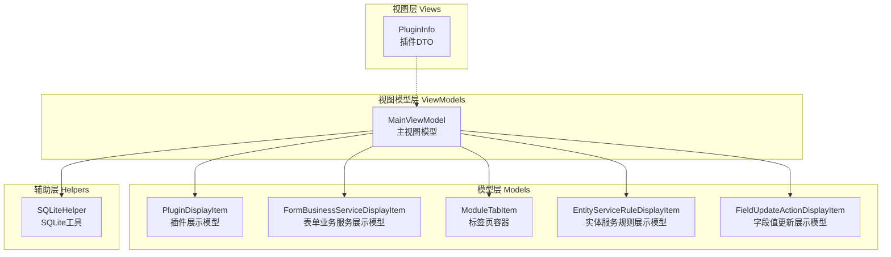
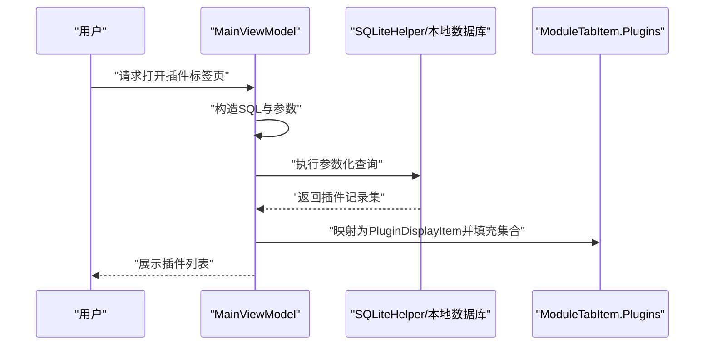
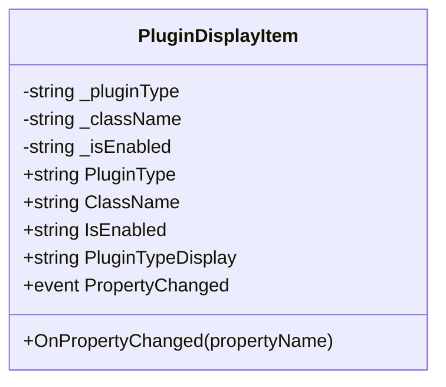
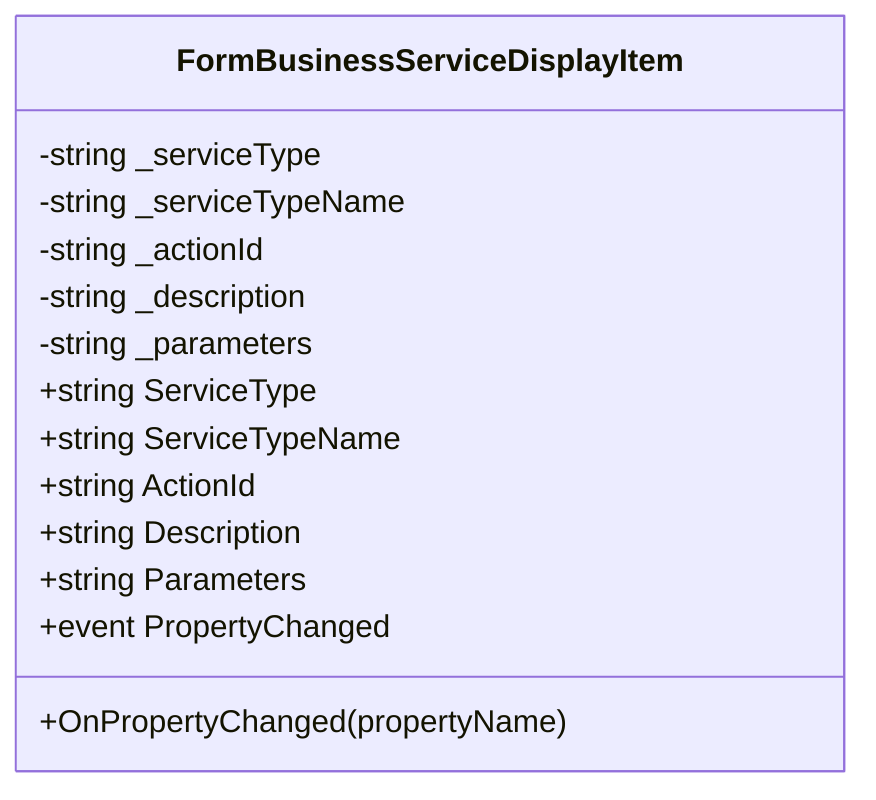
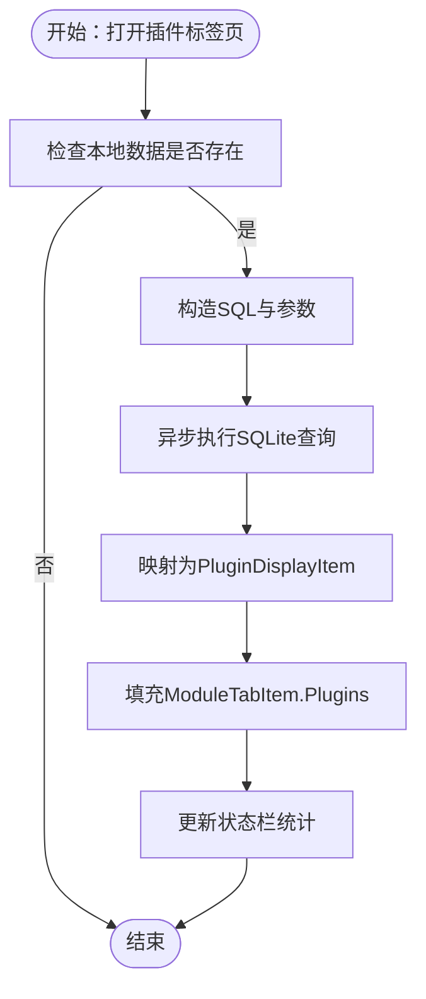
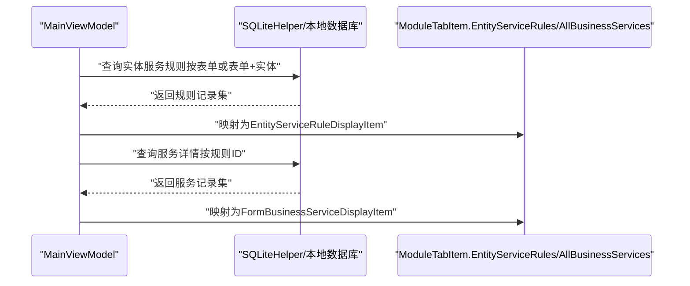
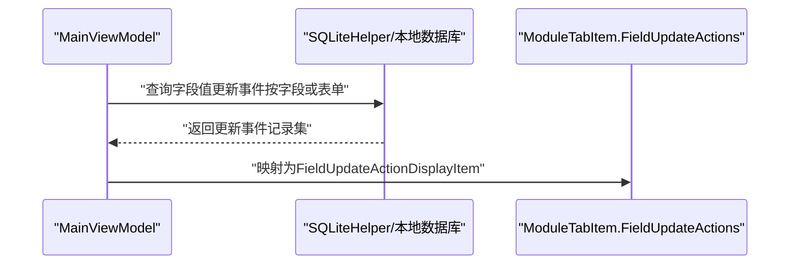
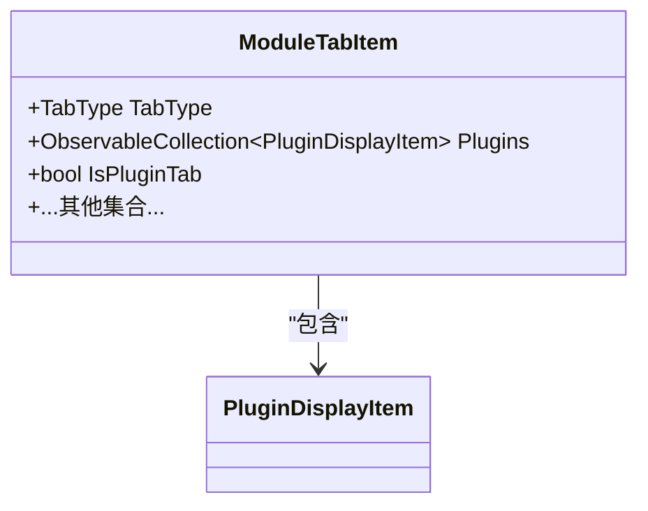
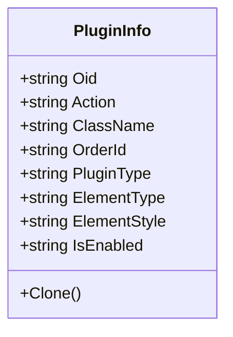
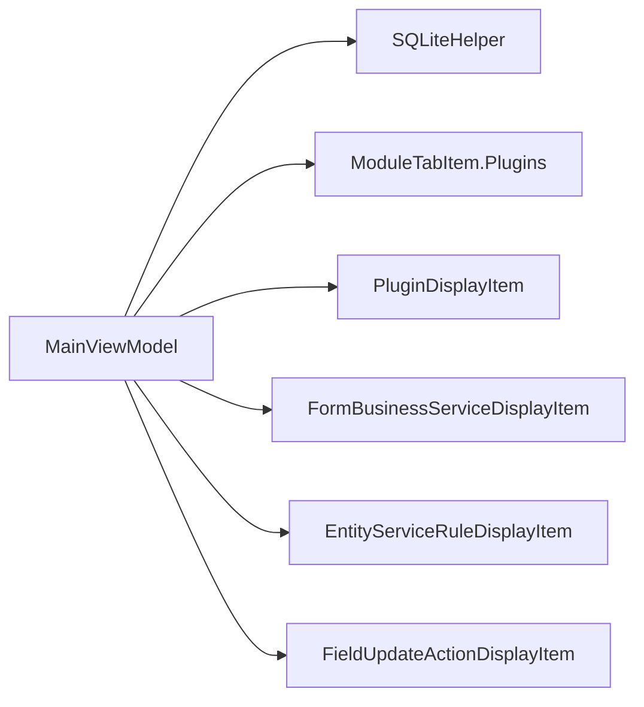

# 插件系统

<cite>
**本文档引用的文件**
- [PluginDisplayItem.cs](file://Models/PluginDisplayItem.cs)
- [FormBusinessServiceDisplayItem.cs](file://Models/FormBusinessServiceDisplayItem.cs)
- [PluginInfo.cs](file://Views/PluginInfo.cs)
- [MainViewModel.cs](file://ViewModels/MainViewModel.cs)
- [SQLiteHelper.cs](file://Helpers/SQLiteHelper.cs)
- [ModuleTabItem.cs](file://Models/ModuleTabItem.cs)
- [FieldUpdateActionDisplayItem.cs](file://Models/FieldUpdateActionDisplayItem.cs)
- [EntityServiceRuleDisplayItem.cs](file://Models/EntityServiceRuleDisplayItem.cs)
</cite>

## 目录
1. [简介](#简介)
2. [项目结构](#项目结构)
3. [核心组件](#核心组件)
4. [架构总览](#架构总览)
5. [详细组件分析](#详细组件分析)
6. [依赖关系分析](#依赖关系分析)
7. [性能考虑](#性能考虑)
8. [故障排查指南](#故障排查指南)
9. [结论](#结论)
10. [附录](#附录)

## 简介
本文件围绕插件系统功能进行深入解析，重点覆盖以下方面：
- 数据模型设计：PluginDisplayItem 与 FormBusinessServiceDisplayItem 的职责划分与属性语义
- 插件信息管理机制：从本地 SQLite 数据库查询、映射到视图模型集合、并在界面中展示
- 业务服务查询与展示：基于规则的业务服务分组与条件分支显示
- 更新动作处理：字段值更新事件的查询与展示流程
- 架构设计与扩展机制：模块化视图模型、可复用的查询方法、可拓展的标签页容器
- 安全与性能：参数化查询、异步执行、本地数据缓存与索引建议

## 项目结构
插件系统相关的核心文件分布于 Models、ViewModels、Views 与 Helpers 四个层次：
- Models：定义数据模型与集合容器，承载插件与业务服务的展示数据
- ViewModels：封装业务逻辑与数据访问，负责查询、状态管理和 UI 绑定
- Views：提供轻量级数据传输对象（DTO），用于克隆与跨层传递
- Helpers：提供 SQLite 辅助能力，如本地数据文件路径管理与扫描

**图表来源**
- [PluginDisplayItem.cs:1-51](file://Models/PluginDisplayItem.cs#L1-L51)
- [FormBusinessServiceDisplayItem.cs:1-51](file://Models/FormBusinessServiceDisplayItem.cs#L1-L51)
- [ModuleTabItem.cs:1-196](file://Models/ModuleTabItem.cs#L1-L196)
- [EntityServiceRuleDisplayItem.cs:1-72](file://Models/EntityServiceRuleDisplayItem.cs#L1-L72)
- [FieldUpdateActionDisplayItem.cs:1-80](file://Models/FieldUpdateActionDisplayItem.cs#L1-L80)
- [MainViewModel.cs:1-1200](file://ViewModels/MainViewModel.cs#L1-L1200)
- [PluginInfo.cs:1-30](file://Views/PluginInfo.cs#L1-L30)
- [SQLiteHelper.cs:1-370](file://Helpers/SQLiteHelper.cs#L1-L370)

**章节来源**
- [MainViewModel.cs:1-1200](file://ViewModels/MainViewModel.cs#L1-L1200)
- [ModuleTabItem.cs:1-196](file://Models/ModuleTabItem.cs#L1-L196)
- [SQLiteHelper.cs:1-370](file://Helpers/SQLiteHelper.cs#L1-L370)

## 核心组件
- PluginDisplayItem：封装插件类型、类名、启用状态等字段，支持属性变更通知，提供插件类型的中文显示转换
- FormBusinessServiceDisplayItem：封装业务服务类型、描述、参数、动作 ID 等字段，支持属性变更通知
- ModuleTabItem：作为标签页容器，聚合多种数据集合，包含插件集合 Plugins，用于承载插件查询结果
- MainViewModel：集中实现插件查询、业务服务查询、值更新事件查询等核心功能，使用 SQLiteHelper 访问本地数据库
- PluginInfo：轻量级 DTO，用于插件信息的克隆与跨层传递

**章节来源**
- [PluginDisplayItem.cs:1-51](file://Models/PluginDisplayItem.cs#L1-L51)
- [FormBusinessServiceDisplayItem.cs:1-51](file://Models/FormBusinessServiceDisplayItem.cs#L1-L51)
- [ModuleTabItem.cs:1-196](file://Models/ModuleTabItem.cs#L1-L196)
- [MainViewModel.cs:788-851](file://ViewModels/MainViewModel.cs#L788-L851)
- [PluginInfo.cs:1-30](file://Views/PluginInfo.cs#L1-L30)

## 架构总览
插件系统采用 MVVM 架构，查询流程如下：
- 用户触发打开插件标签页
- MainViewModel 根据表单 ID 与可选插件类型，构造 SQL 查询
- 使用 SQLiteHelper 提供的本地数据库路径，执行参数化查询
- 将查询结果映射为 PluginDisplayItem 并填充到 ModuleTabItem 的 Plugins 集合
- WPF 绑定自动渲染插件列表

**图表来源**
- [MainViewModel.cs:788-851](file://ViewModels/MainViewModel.cs#L788-L851)
- [SQLiteHelper.cs:209-213](file://Helpers/SQLiteHelper.cs#L209-L213)
- [ModuleTabItem.cs:102-106](file://Models/ModuleTabItem.cs#L102-L106)

## 详细组件分析

### 数据模型：PluginDisplayItem
- 字段与职责
  - PluginType：插件类型标识（如表单插件、列表插件、构建插件）
  - ClassName：插件类名
  - IsEnabled：启用状态
  - PluginTypeDisplay：根据 PluginType 返回中文显示文本
- 设计要点
  - 实现 INotifyPropertyChanged，支持 UI 绑定
  - PluginTypeDisplay 使用简单映射，便于国际化扩展

**图表来源**
- [PluginDisplayItem.cs:6-49](file://Models/PluginDisplayItem.cs#L6-L49)

**章节来源**
- [PluginDisplayItem.cs:1-51](file://Models/PluginDisplayItem.cs#L1-L51)

### 数据模型：FormBusinessServiceDisplayItem
- 字段与职责
  - ServiceType：服务类型（如 WhenTrue/WhenFalse）
  - ServiceTypeName：服务类型中文名
  - ActionId：动作 ID
  - Description：描述
  - Parameters：参数
- 设计要点
  - 支持属性变更通知
  - 与实体服务规则联动展示

**图表来源**
- [FormBusinessServiceDisplayItem.cs:6-48](file://Models/FormBusinessServiceDisplayItem.cs#L6-L48)

**章节来源**
- [FormBusinessServiceDisplayItem.cs:1-51](file://Models/FormBusinessServiceDisplayItem.cs#L1-L51)

### 插件查询与展示：OpenPluginTabAsync
- 功能概述
  - 支持按表单 ID 查询全部插件或按插件类型过滤
  - 异步执行 SQLite 查询，避免 UI 阻塞
  - 将结果映射为 PluginDisplayItem 并填充到标签页集合
- 关键实现点
  - SQL 参数化：@FormId、@PluginType
  - 排序：按插件类型与 ID 排序
  - 错误处理：捕获异常并更新状态文本
  - UI 状态：更新状态栏显示插件数量

**图表来源**
- [MainViewModel.cs:788-851](file://ViewModels/MainViewModel.cs#L788-L851)

**章节来源**
- [MainViewModel.cs:788-851](file://ViewModels/MainViewModel.cs#L788-L851)

### 业务服务查询与展示：实体服务规则与服务详情
- 实体服务规则查询
  - 支持按表单 ID 或表单+实体 ID 查询
  - 联合语言表获取动作描述
  - 汇总 WhenTrue/WhenFalse 服务描述
- 服务详情查询
  - 按规则 ID 查询服务列表，按服务类型与 ID 排序
  - 展示动作描述、参数、启用状态等

**图表来源**
- [MainViewModel.cs:659-731](file://ViewModels/MainViewModel.cs#L659-L731)
- [MainViewModel.cs:736-786](file://ViewModels/MainViewModel.cs#L736-L786)

**章节来源**
- [MainViewModel.cs:659-731](file://ViewModels/MainViewModel.cs#L659-L731)
- [MainViewModel.cs:736-786](file://ViewModels/MainViewModel.cs#L736-L786)

### 更新动作处理：字段值更新事件
- 功能概述
  - 支持按字段或表单维度查询值更新事件
  - 展示动作描述、参数、是否禁止、前置条件等
- 查询要点
  - 联合字段与语言表获取字段名与动作描述
  - 按字段键或 ID 排序

**图表来源**
- [MainViewModel.cs:856-909](file://ViewModels/MainViewModel.cs#L856-L909)
- [MainViewModel.cs:911-966](file://ViewModels/MainViewModel.cs#L911-L966)

**章节来源**
- [MainViewModel.cs:856-909](file://ViewModels/MainViewModel.cs#L856-L909)
- [MainViewModel.cs:911-966](file://ViewModels/MainViewModel.cs#L911-L966)

### 数据模型：ModuleTabItem 与插件集合
- 角色定位
  - 作为标签页容器，聚合多种数据集合
  - 包含 Plugins 集合作为插件展示的载体
- 扩展性
  - 新增标签页类型时，可在枚举与集合中同步扩展

**图表来源**
- [ModuleTabItem.cs:7-106](file://Models/ModuleTabItem.cs#L7-L106)

**章节来源**
- [ModuleTabItem.cs:1-196](file://Models/ModuleTabItem.cs#L1-L196)

### 视图层 DTO：PluginInfo
- 角色定位
  - 轻量级数据传输对象，支持 Clone
  - 用于插件信息的克隆与跨层传递
- 适用场景
  - 在不同视图或线程间传递插件配置副本

**图表来源**
- [PluginInfo.cs:3-28](file://Views/PluginInfo.cs#L3-L28)

**章节来源**
- [PluginInfo.cs:1-30](file://Views/PluginInfo.cs#L1-L30)

## 依赖关系分析
- MainViewModel 依赖 SQLiteHelper 获取本地数据库路径并执行查询
- 插件查询依赖 ModuleTabItem 的 Plugins 集合承载结果
- 业务服务查询与值更新事件查询共享相同的查询模式：参数化 SQL + 异步执行 + 映射到展示模型
- PluginDisplayItem 与 FormBusinessServiceDisplayItem 作为展示模型，均实现 INotifyPropertyChanged，确保 UI 实时更新

**图表来源**
- [MainViewModel.cs:788-851](file://ViewModels/MainViewModel.cs#L788-L851)
- [SQLiteHelper.cs:209-213](file://Helpers/SQLiteHelper.cs#L209-L213)
- [ModuleTabItem.cs:102-106](file://Models/ModuleTabItem.cs#L102-L106)

**章节来源**
- [MainViewModel.cs:788-851](file://ViewModels/MainViewModel.cs#L788-L851)
- [SQLiteHelper.cs:209-213](file://Helpers/SQLiteHelper.cs#L209-L213)
- [ModuleTabItem.cs:102-106](file://Models/ModuleTabItem.cs#L102-L106)

## 性能考虑
- 异步查询：所有数据库查询均通过 Task.Run 异步执行，避免阻塞 UI 线程
- 参数化 SQL：使用 SQLiteParameter 防止注入并提升缓存命中率
- 本地数据缓存：通过 SQLiteHelper 管理本地数据库文件，减少网络依赖
- 集合绑定：使用 ObservableCollection，减少 UI 刷新成本
- 建议
  - 为常用查询字段建立索引（如 T_PLUGIN.FORMID、T_PLUGIN.PLUGINTYPE）
  - 对大数据量的标签页采用虚拟化或分页加载
  - 合理使用缓存：对频繁打开的插件列表进行内存缓存

[本节为通用性能指导，无需具体文件引用]

## 故障排查指南
- 插件查询失败
  - 检查本地数据库文件是否存在与可访问
  - 确认表单 ID 有效且插件记录存在
  - 查看状态栏错误提示，定位异常堆栈
- 业务服务或值更新查询失败
  - 核对联结字段（如规则 ID、字段 ID）是否正确
  - 检查语言表联结条件（Locale ID）是否匹配
- UI 不更新
  - 确认展示模型实现了 INotifyPropertyChanged
  - 检查集合是否通过 ObservableCollection 提供变更通知

**章节来源**
- [MainViewModel.cs:844-847](file://ViewModels/MainViewModel.cs#L844-L847)
- [MainViewModel.cs:724-728](file://ViewModels/MainViewModel.cs#L724-L728)
- [MainViewModel.cs:903-906](file://ViewModels/MainViewModel.cs#L903-L906)

## 结论
插件系统通过清晰的数据模型与统一的查询模式，实现了对 K3Cloud 表单插件、业务服务与值更新事件的高效查询与展示。其 MVVM 架构保证了良好的可维护性与可扩展性；SQLiteHelper 提供的本地数据管理能力提升了用户体验。未来可在索引优化、缓存策略与 UI 虚拟化等方面进一步增强性能。

[本节为总结性内容，无需具体文件引用]

## 附录

### 代码示例路径（无代码内容，仅提供路径）
- 插件查询入口：[MainViewModel.cs:788-851](file://ViewModels/MainViewModel.cs#L788-L851)
- 业务服务规则查询：[MainViewModel.cs:659-731](file://ViewModels/MainViewModel.cs#L659-L731)
- 业务服务详情查询：[MainViewModel.cs:736-786](file://ViewModels/MainViewModel.cs#L736-L786)
- 值更新事件查询（字段维度）：[MainViewModel.cs:856-909](file://ViewModels/MainViewModel.cs#L856-L909)
- 值更新事件查询（表单维度）：[MainViewModel.cs:911-966](file://ViewModels/MainViewModel.cs#L911-L966)
- 插件展示模型：[PluginDisplayItem.cs:1-51](file://Models/PluginDisplayItem.cs#L1-L51)
- 业务服务展示模型：[FormBusinessServiceDisplayItem.cs:1-51](file://Models/FormBusinessServiceDisplayItem.cs#L1-L51)
- 标签页容器（含插件集合）：[ModuleTabItem.cs:1-196](file://Models/ModuleTabItem.cs#L1-L196)
- 本地数据库路径管理：[SQLiteHelper.cs:209-213](file://Helpers/SQLiteHelper.cs#L209-L213)