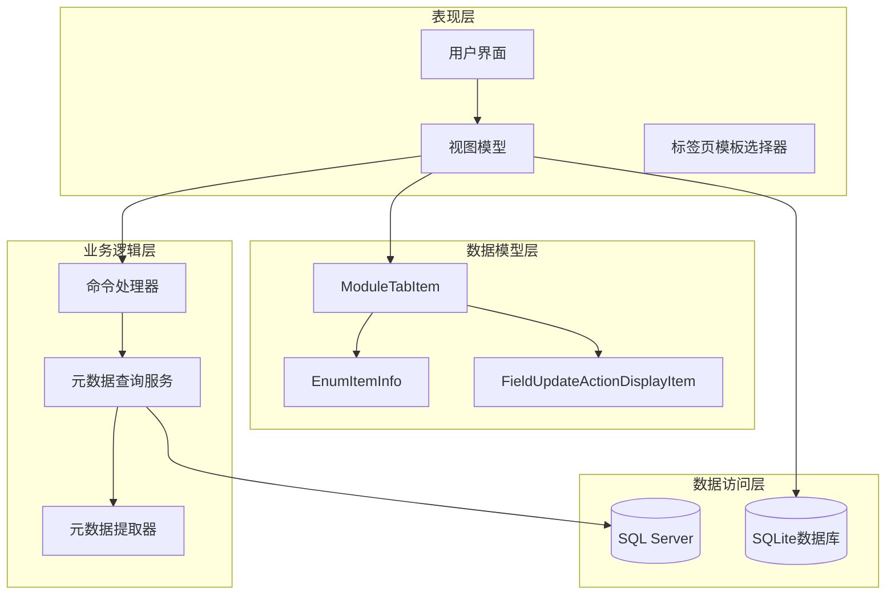
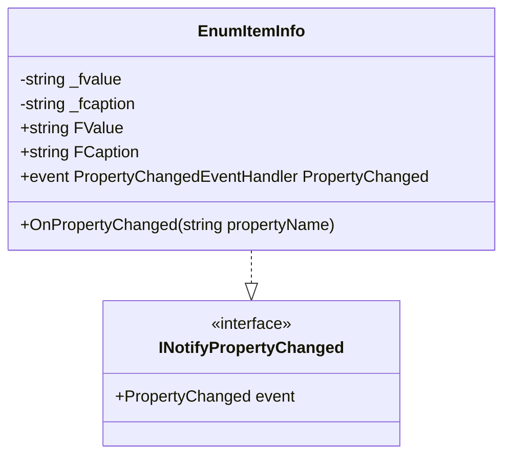
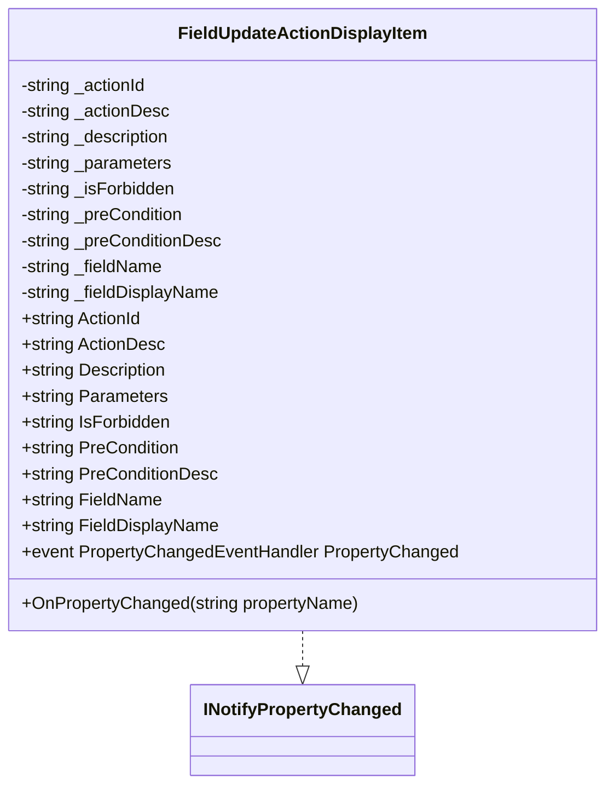
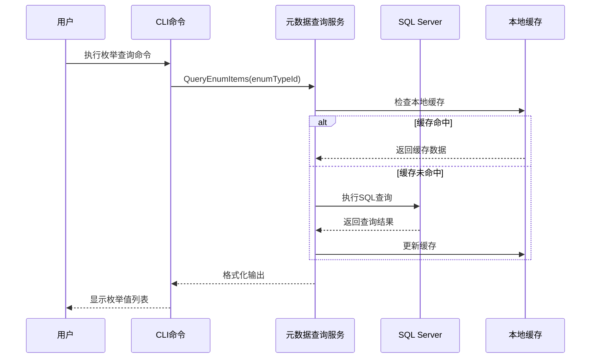
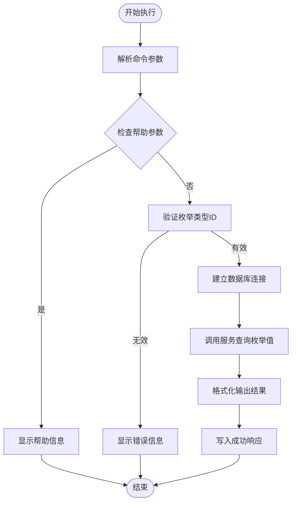
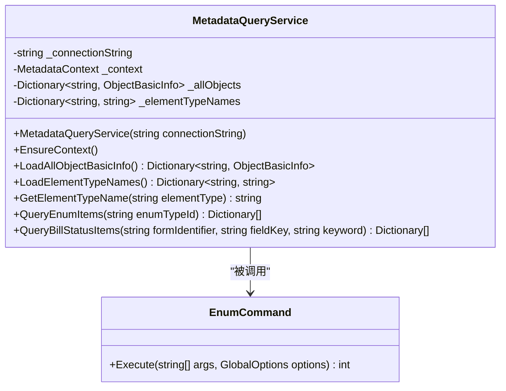
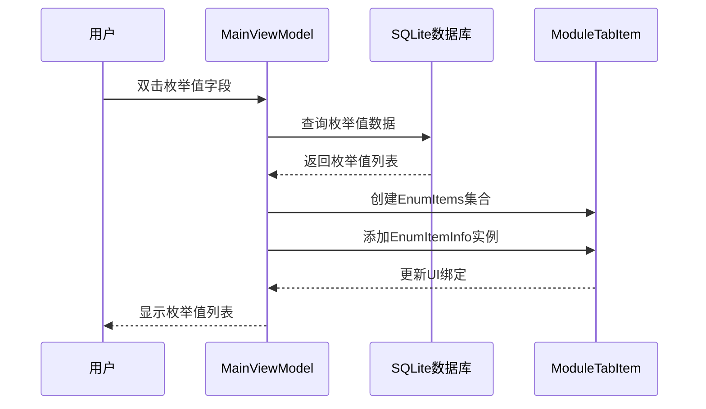
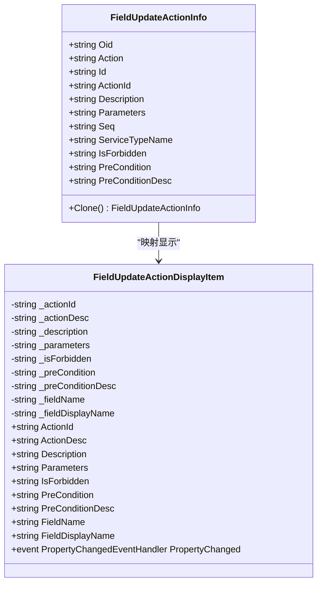
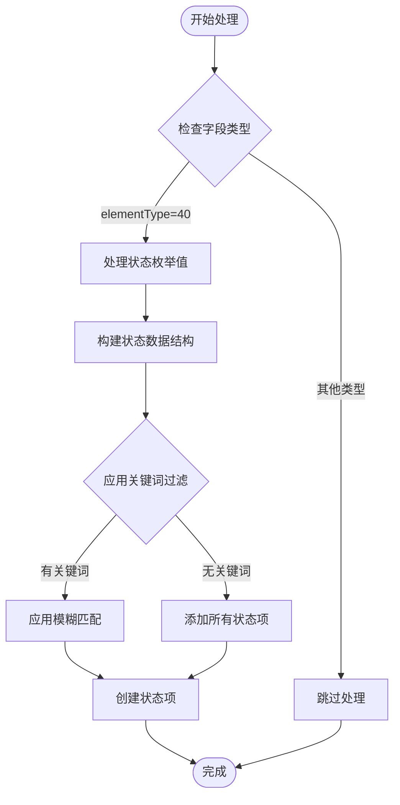
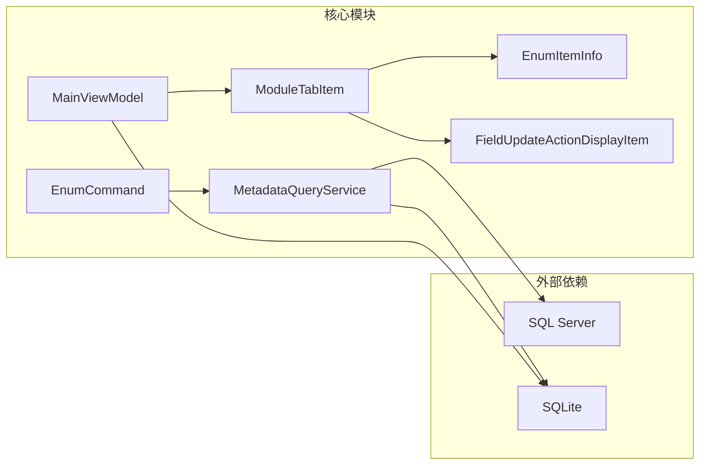

# 枚举值管理

<cite>
**本文档引用的文件**
- [EnumItemInfo.cs](file://Models/EnumItemInfo.cs)
- [FieldUpdateActionDisplayItem.cs](file://Models/FieldUpdateActionDisplayItem.cs)
- [FieldUpdateActionInfo.cs](file://Views/FieldUpdateActionInfo.cs)
- [EnumCommand.cs](file://K3CloudDataDictionary.Cli/Commands/EnumCommand.cs)
- [MetadataQueryService.cs](file://K3CloudDataDictionary.Cli/Services/MetadataQueryService.cs)
- [MainViewModel.cs](file://ViewModels/MainViewModel.cs)
- [ModuleTabItem.cs](file://Models/ModuleTabItem.cs)
- [TabContentTemplateSelector.cs](file://TabContentTemplateSelector.cs)
</cite>

## 目录
1. [简介](#简介)
2. [项目结构](#项目结构)
3. [核心组件](#核心组件)
4. [架构概览](#架构概览)
5. [详细组件分析](#详细组件分析)
6. [依赖关系分析](#依赖关系分析)
7. [性能考虑](#性能考虑)
8. [故障排除指南](#故障排除指南)
9. [结论](#结论)

## 简介

本文件详细介绍K3CloudDataDictionary项目中的枚举值管理功能。该系统提供了完整的枚举值查询、显示和管理机制，包括基础数据枚举值和单据状态枚举值的处理。系统采用MVVM架构模式，通过数据模型、业务服务和用户界面的分离实现了高效的枚举值管理。

## 项目结构

项目采用分层架构设计，主要包含以下层次：

**图表来源**
- [MainViewModel.cs:1-50](file://ViewModels/MainViewModel.cs#L1-L50)
- [MetadataQueryService.cs:1-30](file://K3CloudDataDictionary.Cli/Services/MetadataQueryService.cs#L1-L30)
- [EnumItemInfo.cs:1-31](file://Models/EnumItemInfo.cs#L1-L31)

**章节来源**
- [MainViewModel.cs:1-100](file://ViewModels/MainViewModel.cs#L1-L100)
- [EnumCommand.cs:1-30](file://K3CloudDataDictionary.Cli/Commands/EnumCommand.cs#L1-L30)

## 核心组件

### 数据模型设计

系统的核心数据模型围绕枚举值管理构建，主要包括以下关键类：

#### EnumItemInfo数据模型
`EnumItemInfo`是枚举值的基础数据模型，实现了`INotifyPropertyChanged`接口以支持UI绑定：

**图表来源**
- [EnumItemInfo.cs:6-29](file://Models/EnumItemInfo.cs#L6-L29)

#### FieldUpdateActionDisplayItem数据模型
用于显示字段更新动作的枚举值信息：

**图表来源**
- [FieldUpdateActionDisplayItem.cs:6-78](file://Models/FieldUpdateActionDisplayItem.cs#L6-L78)

**章节来源**
- [EnumItemInfo.cs:1-31](file://Models/EnumItemInfo.cs#L1-L31)
- [FieldUpdateActionDisplayItem.cs:1-80](file://Models/FieldUpdateActionDisplayItem.cs#L1-L80)

## 架构概览

系统采用客户端-服务器混合架构，结合本地SQLite缓存和远程SQL Server查询：

**图表来源**
- [EnumCommand.cs:33-61](file://K3CloudDataDictionary.Cli/Commands/EnumCommand.cs#L33-L61)
- [MetadataQueryService.cs:685-727](file://K3CloudDataDictionary.Cli/Services/MetadataQueryService.cs#L685-L727)

## 详细组件分析

### 枚举值查询实现

#### CLI命令层
`EnumCommand`类提供了命令行接口来查询枚举值：

**图表来源**
- [EnumCommand.cs:13-61](file://K3CloudDataDictionary.Cli/Commands/EnumCommand.cs#L13-L61)

#### 服务层实现
`MetadataQueryService`提供了核心的枚举值查询功能：

**图表来源**
- [MetadataQueryService.cs:12-22](file://K3CloudDataDictionary.Cli/Services/MetadataQueryService.cs#L12-L22)
- [EnumCommand.cs:11-13](file://K3CloudDataDictionary.Cli/Commands/EnumCommand.cs#L11-L13)

**章节来源**
- [EnumCommand.cs:1-64](file://K3CloudDataDictionary.Cli/Commands/EnumCommand.cs#L1-L64)
- [MetadataQueryService.cs:685-727](file://K3CloudDataDictionary.Cli/Services/MetadataQueryService.cs#L685-L727)

### 枚举值管理机制

#### 视图模型集成
`MainViewModel`负责枚举值的UI展示和用户交互：

**图表来源**
- [MainViewModel.cs:475-490](file://ViewModels/MainViewModel.cs#L475-L490)
- [ModuleTabItem.cs:172-179](file://Models/ModuleTabItem.cs#L172-L179)

#### 字段更新动作处理
`FieldUpdateActionInfo`和`FieldUpdateActionDisplayItem`协同处理字段更新动作的枚举值：

**图表来源**
- [FieldUpdateActionInfo.cs:3-35](file://Views/FieldUpdateActionInfo.cs#L3-L35)
- [FieldUpdateActionDisplayItem.cs:6-78](file://Models/FieldUpdateActionDisplayItem.cs#L6-L78)

**章节来源**
- [MainViewModel.cs:475-490](file://ViewModels/MainViewModel.cs#L475-L490)
- [FieldUpdateActionInfo.cs:1-36](file://Views/FieldUpdateActionInfo.cs#L1-L36)
- [FieldUpdateActionDisplayItem.cs:1-80](file://Models/FieldUpdateActionDisplayItem.cs#L1-L80)

### 状态枚举处理

系统特别处理了单据状态字段的枚举值，这些字段具有特殊的`elementType=40`属性：

**图表来源**
- [MetadataQueryService.cs:758-790](file://K3CloudDataDictionary.Cli/Services/MetadataQueryService.cs#L758-L790)

**章节来源**
- [MetadataQueryService.cs:736-821](file://K3CloudDataDictionary.Cli/Services/MetadataQueryService.cs#L736-L821)

## 依赖关系分析

系统各组件之间的依赖关系如下：

**图表来源**
- [EnumCommand.cs:36-37](file://K3CloudDataDictionary.Cli/Commands/EnumCommand.cs#L36-L37)
- [MetadataQueryService.cs:19-22](file://K3CloudDataDictionary.Cli/Services/MetadataQueryService.cs#L19-L22)
- [MainViewModel.cs:477-483](file://ViewModels/MainViewModel.cs#L477-L483)

**章节来源**
- [EnumCommand.cs:1-64](file://K3CloudDataDictionary.Cli/Commands/EnumCommand.cs#L1-L64)
- [MetadataQueryService.cs:1-80](file://K3CloudDataDictionary.Cli/Services/MetadataQueryService.cs#L1-L80)
- [MainViewModel.cs:1-50](file://ViewModels/MainViewModel.cs#L1-L50)

## 性能考虑

### 缓存策略
系统采用了多级缓存策略来优化性能：

1. **上下文缓存**：`MetadataQueryService`维护了`_context`实例，在首次使用时初始化并重复使用
2. **对象信息缓存**：`_allObjects`字典缓存了所有对象的基础信息
3. **元素类型名称缓存**：`_elementTypeNames`字典缓存了元素类型的中文名称映射

### 查询优化
- 使用参数化查询防止SQL注入
- 合理设置命令超时时间（默认30秒）
- 对于大量数据查询，实施结果数量限制（如搜索功能限制100条记录）

### 内存管理
- 使用`ObservableCollection<T>`支持UI绑定和增量更新
- 及时释放数据库连接和命令资源
- 避免内存泄漏，特别是在异常处理路径中

## 故障排除指南

### 常见问题及解决方案

#### 连接问题
当遇到数据库连接失败时，检查以下配置：
- 连接字符串是否正确
- SQL Server服务是否正常运行
- 网络连接是否稳定

#### 查询超时
如果查询超时，可以：
- 检查SQL Server性能
- 优化查询条件
- 增加命令超时时间

#### 数据不一致
当发现数据不一致时：
- 清除本地缓存重新加载
- 检查数据库权限
- 验证数据同步状态

**章节来源**
- [EnumCommand.cs:56-60](file://K3CloudDataDictionary.Cli/Commands/EnumCommand.cs#L56-L60)
- [MetadataQueryService.cs:29-37](file://K3CloudDataDictionary.Cli/Services/MetadataQueryService.cs#L29-L37)

## 结论

K3CloudDataDictionary项目的枚举值管理功能展现了良好的软件架构设计。通过清晰的数据模型分离、完善的缓存策略和灵活的查询机制，系统能够高效地处理各种枚举值场景。

### 主要优势
1. **模块化设计**：各组件职责明确，便于维护和扩展
2. **性能优化**：多级缓存和查询优化确保了良好的响应性能
3. **用户体验**：MVVM架构提供了流畅的用户交互体验
4. **可扩展性**：清晰的接口设计支持未来功能扩展

### 改进建议
1. 可以考虑实现更细粒度的缓存失效机制
2. 增加更多的错误处理和重试机制
3. 提供更详细的日志记录和监控功能

该系统为K3Cloud平台的元数据管理提供了坚实的技术基础，其设计理念和实现方式值得在类似项目中借鉴和参考。