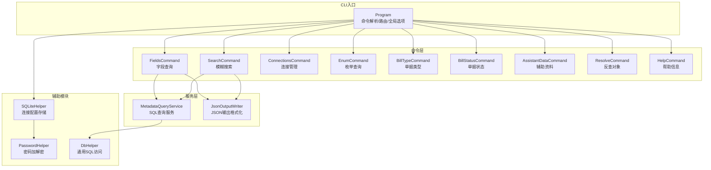
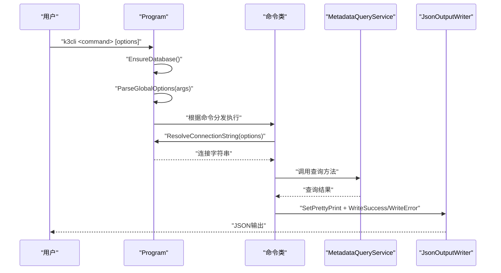
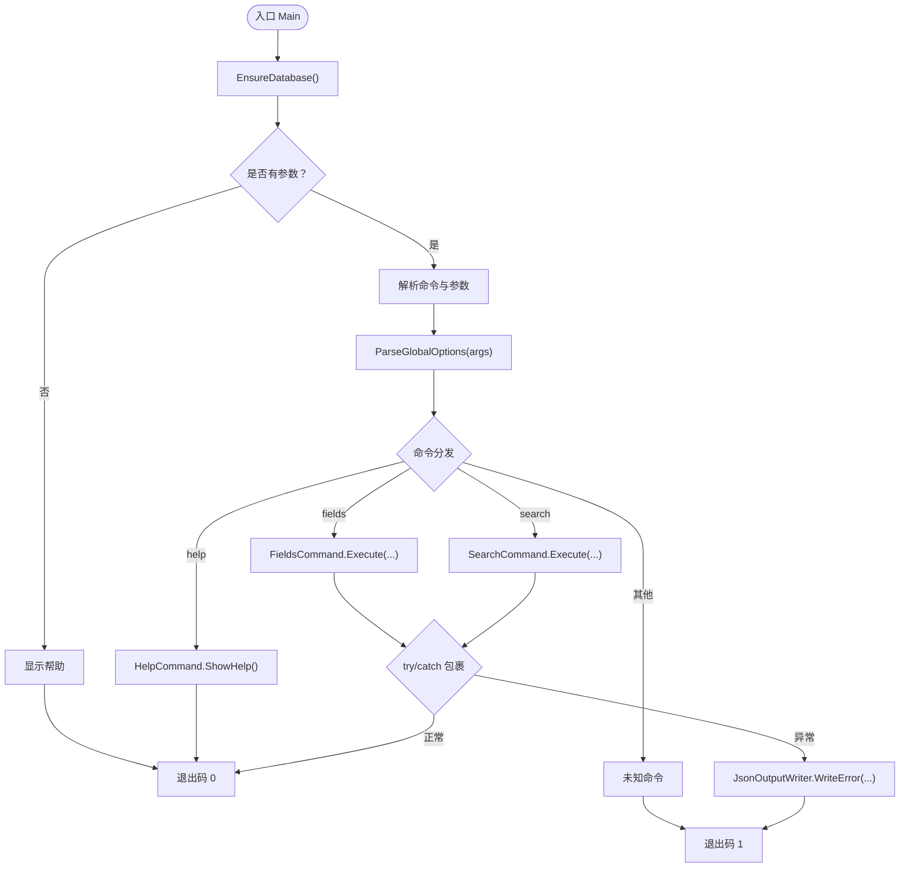
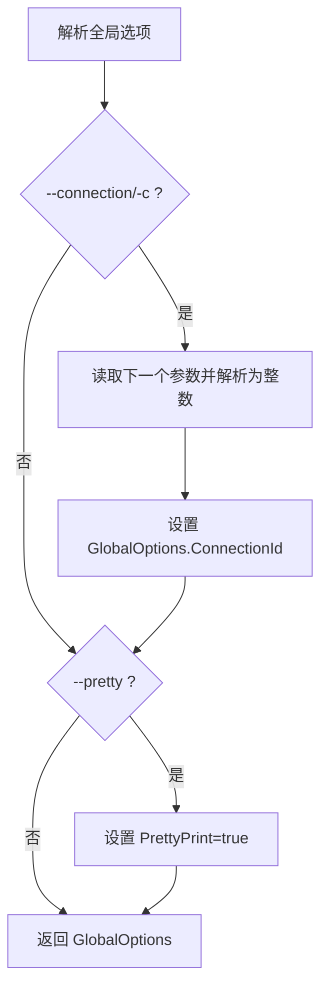
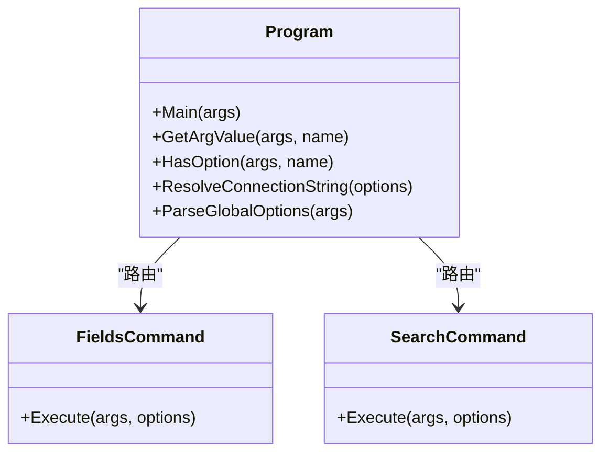
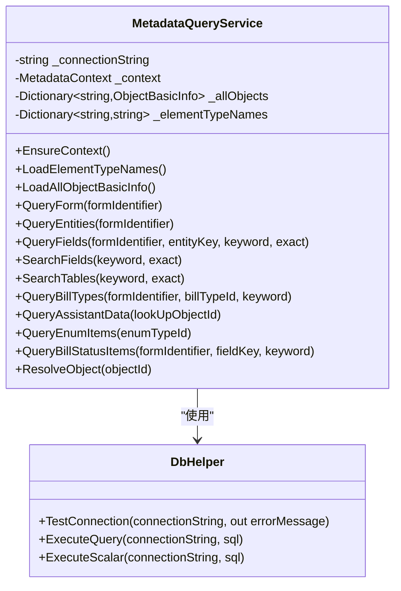
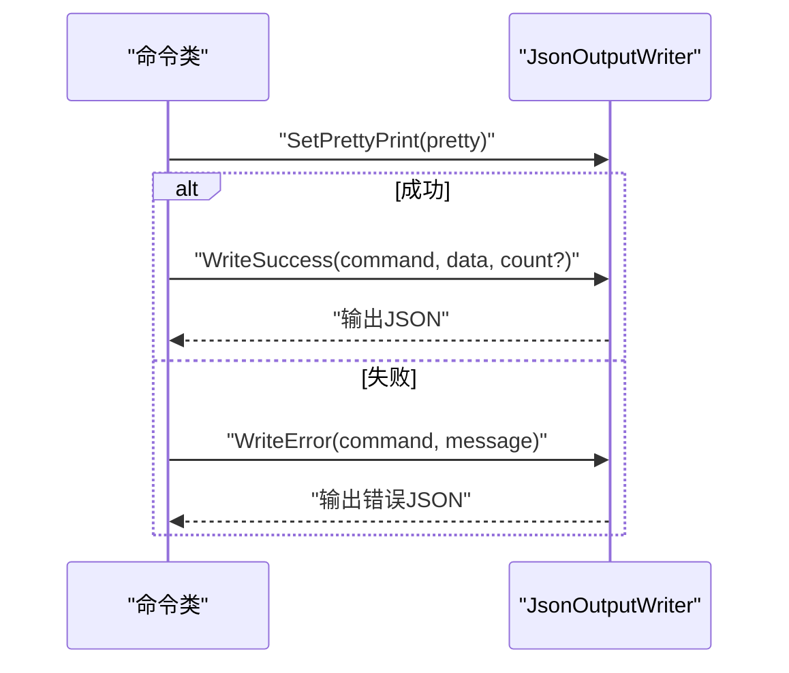
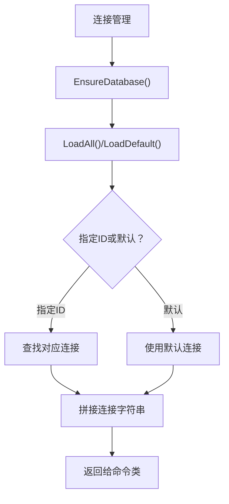
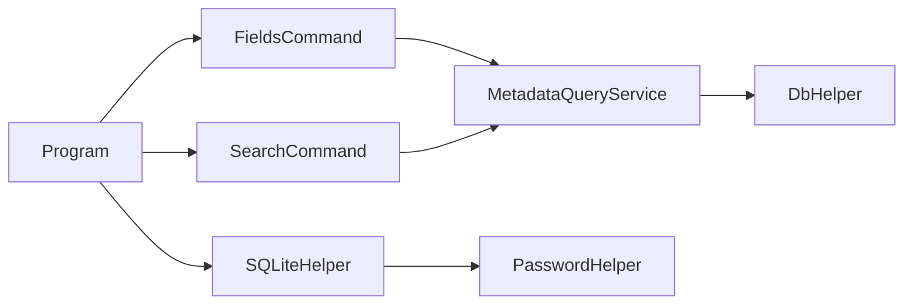

# CLI架构设计

<cite>
**本文档引用的文件**
- [Program.cs](file://K3CloudDataDictionary.Cli/Program.cs)
- [K3CloudDataDictionary.Cli.csproj](file://K3CloudDataDictionary.Cli/K3CloudDataDictionary.Cli.csproj)
- [FieldsCommand.cs](file://K3CloudDataDictionary.Cli/Commands/FieldsCommand.cs)
- [SearchCommand.cs](file://K3CloudDataDictionary.Cli/Commands/SearchCommand.cs)
- [JsonOutputWriter.cs](file://K3CloudDataDictionary.Cli/Services/JsonOutputWriter.cs)
- [MetadataQueryService.cs](file://K3CloudDataDictionary.Cli/Services/MetadataQueryService.cs)
- [SQLiteHelper.cs](file://Helpers/SQLiteHelper.cs)
- [PasswordHelper.cs](file://Helpers/PasswordHelper.cs)
- [DbHelper.cs](file://Helpers/DbHelper.cs)
- [ConnectionInfo.cs](file://Models/ConnectionInfo.cs)
- [FieldInfo.cs](file://Models/FieldInfo.cs)
</cite>

## 目录
1. [简介](#简介)
2. [项目结构](#项目结构)
3. [核心组件](#核心组件)
4. [架构总览](#架构总览)
5. [详细组件分析](#详细组件分析)
6. [依赖关系分析](#依赖关系分析)
7. [性能考虑](#性能考虑)
8. [故障排查指南](#故障排查指南)
9. [结论](#结论)

## 简介
本文件面向金蝶K3 Cloud数据字典命令行工具（k3cli）的架构设计，重点阐述命令行入口、命令路由、全局选项处理、连接字符串解析、错误处理策略以及各组件间的协作关系。文档旨在帮助开发者快速理解CLI工具的设计理念与技术实现，掌握从命令解析到数据查询的完整流程。

## 项目结构
k3cli采用“入口程序 + 命令集合 + 服务层 + 辅助模块”的分层组织方式：
- 入口程序：负责参数解析、全局选项处理、命令路由与异常捕获
- 命令集合：每个具体命令封装为静态类，负责参数校验、调用服务层并输出结果
- 服务层：封装对SQL Server的实时查询逻辑，提供统一的元数据查询能力
- 辅助模块：SQLite连接管理、密码加解密、通用数据库访问等

**图示来源**
- [Program.cs:14-69](file://K3CloudDataDictionary.Cli/Program.cs#L14-L69)
- [FieldsCommand.cs:13-85](file://K3CloudDataDictionary.Cli/Commands/FieldsCommand.cs#L13-L85)
- [SearchCommand.cs:13-107](file://K3CloudDataDictionary.Cli/Commands/SearchCommand.cs#L13-L107)
- [JsonOutputWriter.cs:11-90](file://K3CloudDataDictionary.Cli/Services/JsonOutputWriter.cs#L11-L90)
- [MetadataQueryService.cs:12-839](file://K3CloudDataDictionary.Cli/Services/MetadataQueryService.cs#L12-L839)
- [SQLiteHelper.cs:10-370](file://Helpers/SQLiteHelper.cs#L10-L370)
- [PasswordHelper.cs:7-46](file://Helpers/PasswordHelper.cs#L7-L46)
- [DbHelper.cs:7-70](file://Helpers/DbHelper.cs#L7-L70)

**章节来源**
- [Program.cs:14-69](file://K3CloudDataDictionary.Cli/Program.cs#L14-L69)
- [K3CloudDataDictionary.Cli.csproj:1-49](file://K3CloudDataDictionary.Cli/K3CloudDataDictionary.Cli.csproj#L1-L49)

## 核心组件
- Program：CLI入口，负责SQLite初始化、命令解析、全局选项解析、异常捕获与命令路由
- GlobalOptions：全局选项载体，包含连接ID与是否美化输出
- 命令类（如FieldsCommand、SearchCommand）：封装具体命令的参数校验、调用服务层、输出结果
- MetadataQueryService：直接连接SQL Server执行查询，提供字段、表单、单据类型等元数据查询
- JsonOutputWriter：统一JSON输出格式，支持美化打印与错误输出
- SQLiteHelper：本地连接配置存储与管理，支持默认连接选择
- PasswordHelper：基于DPAPI的密码加解密
- DbHelper：通用SQL访问封装（测试连接、执行查询、标量查询）

**章节来源**
- [Program.cs:74-97](file://K3CloudDataDictionary.Cli/Program.cs#L74-L97)
- [Program.cs:129-151](file://K3CloudDataDictionary.Cli/Program.cs#L129-L151)
- [FieldsCommand.cs:13-85](file://K3CloudDataDictionary.Cli/Commands/FieldsCommand.cs#L13-L85)
- [SearchCommand.cs:13-107](file://K3CloudDataDictionary.Cli/Commands/SearchCommand.cs#L13-L107)
- [MetadataQueryService.cs:12-839](file://K3CloudDataDictionary.Cli/Services/MetadataQueryService.cs#L12-L839)
- [JsonOutputWriter.cs:11-90](file://K3CloudDataDictionary.Cli/Services/JsonOutputWriter.cs#L11-L90)
- [SQLiteHelper.cs:10-370](file://Helpers/SQLiteHelper.cs#L10-L370)
- [PasswordHelper.cs:7-46](file://Helpers/PasswordHelper.cs#L7-L46)
- [DbHelper.cs:7-70](file://Helpers/DbHelper.cs#L7-L70)

## 架构总览
k3cli遵循“入口解析 → 全局选项 → 命令路由 → 服务查询 → 统一输出”的控制流。Program作为单一职责入口，负责：
- 初始化SQLite数据库（用于存储连接配置）
- 解析命令与全局选项
- 根据命令分发到对应命令类
- 捕获异常并输出标准化错误
- 通过服务层完成SQL查询，再由输出器统一格式化

**图示来源**
- [Program.cs:14-69](file://K3CloudDataDictionary.Cli/Program.cs#L14-L69)
- [Program.cs:129-151](file://K3CloudDataDictionary.Cli/Program.cs#L129-L151)
- [FieldsCommand.cs:38-84](file://K3CloudDataDictionary.Cli/Commands/FieldsCommand.cs#L38-L84)
- [SearchCommand.cs:39-106](file://K3CloudDataDictionary.Cli/Commands/SearchCommand.cs#L39-L106)
- [JsonOutputWriter.cs:26-80](file://K3CloudDataDictionary.Cli/Services/JsonOutputWriter.cs#L26-L80)
- [MetadataQueryService.cs:12-839](file://K3CloudDataDictionary.Cli/Services/MetadataQueryService.cs#L12-L839)

## 详细组件分析

### Program类设计与实现
Program承担CLI的“门面”角色，职责包括：
- 启动时确保SQLite数据库存在
- 处理无参情况显示帮助
- 解析第一个参数作为命令，剩余参数交由命令类处理
- 全局选项解析：支持--connection/-c与--pretty
- 异常捕获：统一写入JSON错误输出
- 连接字符串解析：优先使用指定连接ID，否则使用默认连接；若均不可用则抛出异常

**图示来源**
- [Program.cs:14-69](file://K3CloudDataDictionary.Cli/Program.cs#L14-L69)
- [Program.cs:74-97](file://K3CloudDataDictionary.Cli/Program.cs#L74-L97)

**章节来源**
- [Program.cs:14-69](file://K3CloudDataDictionary.Cli/Program.cs#L14-L69)
- [Program.cs:74-97](file://K3CloudDataDictionary.Cli/Program.cs#L74-L97)
- [Program.cs:129-151](file://K3CloudDataDictionary.Cli/Program.cs#L129-L151)

### 全局选项系统（--connection、--pretty）
- --connection/-c：接收一个整数ID，Program将其解析为GlobalOptions.ConnectionId
- --pretty：布尔开关，开启后JsonOutputWriter将以缩进格式输出
- 连接字符串解析：当存在ConnectionId时优先从SQLite读取对应连接；否则读取默认连接；若均不存在则抛出异常

**图示来源**
- [Program.cs:74-97](file://K3CloudDataDictionary.Cli/Program.cs#L74-L97)
- [Program.cs:129-151](file://K3CloudDataDictionary.Cli/Program.cs#L129-L151)
- [JsonOutputWriter.cs:18-21](file://K3CloudDataDictionary.Cli/Services/JsonOutputWriter.cs#L18-L21)

**章节来源**
- [Program.cs:74-97](file://K3CloudDataDictionary.Cli/Program.cs#L74-L97)
- [Program.cs:129-151](file://K3CloudDataDictionary.Cli/Program.cs#L129-L151)
- [JsonOutputWriter.cs:18-21](file://K3CloudDataDictionary.Cli/Services/JsonOutputWriter.cs#L18-L21)

### 命令路由与参数解析
- 命令路由：Program根据第一个参数匹配命令，分发到对应命令类的Execute方法
- 参数解析：命令类通过Program提供的工具方法获取参数值与检测选项存在性
- 示例：FieldsCommand要求--form参数，可选--entity、--keyword、--exact/-e；SearchCommand要求--keyword，可选--type与--exact/-e

**图示来源**
- [Program.cs:14-69](file://K3CloudDataDictionary.Cli/Program.cs#L14-L69)
- [FieldsCommand.cs:13-85](file://K3CloudDataDictionary.Cli/Commands/FieldsCommand.cs#L13-L85)
- [SearchCommand.cs:13-107](file://K3CloudDataDictionary.Cli/Commands/SearchCommand.cs#L13-L107)

**章节来源**
- [FieldsCommand.cs:13-85](file://K3CloudDataDictionary.Cli/Commands/FieldsCommand.cs#L13-L85)
- [SearchCommand.cs:13-107](file://K3CloudDataDictionary.Cli/Commands/SearchCommand.cs#L13-L107)
- [Program.cs:102-124](file://K3CloudDataDictionary.Cli/Program.cs#L102-L124)

### 服务层与数据查询
- MetadataQueryService负责直接连接SQL Server执行查询，提供：
  - 对象基础信息与元素类型映射的懒加载
  - 表单、实体、字段查询
  - 字段与表的模糊/精确搜索
  - 单据类型、单据状态、辅助资料、枚举项查询
- DbHelper提供通用SQL访问能力（连接测试、查询、标量查询）

**图示来源**
- [MetadataQueryService.cs:12-839](file://K3CloudDataDictionary.Cli/Services/MetadataQueryService.cs#L12-L839)
- [DbHelper.cs:7-70](file://Helpers/DbHelper.cs#L7-L70)

**章节来源**
- [MetadataQueryService.cs:12-839](file://K3CloudDataDictionary.Cli/Services/MetadataQueryService.cs#L12-L839)
- [DbHelper.cs:7-70](file://Helpers/DbHelper.cs#L7-L70)

### 输出与错误处理
- JsonOutputWriter统一输出格式，支持：
  - 成功输出：包含success、command、data、count
  - 错误输出：包含success、command、error
  - 美化输出：通过SetPrettyPrint控制缩进
- Program在命令执行过程中捕获异常并调用JsonOutputWriter.WriteError输出

**图示来源**
- [JsonOutputWriter.cs:26-80](file://K3CloudDataDictionary.Cli/Services/JsonOutputWriter.cs#L26-L80)
- [Program.cs:64-68](file://K3CloudDataDictionary.Cli/Program.cs#L64-L68)

**章节来源**
- [JsonOutputWriter.cs:26-80](file://K3CloudDataDictionary.Cli/Services/JsonOutputWriter.cs#L26-L80)
- [Program.cs:64-68](file://K3CloudDataDictionary.Cli/Program.cs#L64-L68)

### 连接管理与安全
- SQLiteHelper负责连接配置的持久化与管理，包括：
  - 创建连接表、迁移旧列、设置默认连接
  - 保存/更新/删除连接
  - 扫描本地数据文件、导入/重命名/删除本地数据文件
  - 迁移旧版metadata.db文件
- PasswordHelper使用DPAPI对密码进行加密存储与解密读取
- ConnectionInfo提供连接字符串与显示名称的生成逻辑

**图示来源**
- [SQLiteHelper.cs:17-112](file://Helpers/SQLiteHelper.cs#L17-L112)
- [PasswordHelper.cs:7-46](file://Helpers/PasswordHelper.cs#L7-L46)
- [ConnectionInfo.cs:86-118](file://Models/ConnectionInfo.cs#L86-L118)

**章节来源**
- [SQLiteHelper.cs:17-112](file://Helpers/SQLiteHelper.cs#L17-L112)
- [PasswordHelper.cs:7-46](file://Helpers/PasswordHelper.cs#L7-L46)
- [ConnectionInfo.cs:86-118](file://Models/ConnectionInfo.cs#L86-L118)

## 依赖关系分析
- 项目依赖
  - Newtonsoft.Json：JSON序列化与格式化
  - System.Data.SqlClient：SQL Server连接与查询
  - System.Data.SQLite.Core：本地连接配置存储
- 组件耦合
  - Program与命令类松耦合：通过静态方法与全局选项传递
  - 命令类与服务层松耦合：通过MetadataQueryService接口化
  - 服务层与数据访问层松耦合：通过DbHelper抽象
  - 连接管理独立于业务查询：通过SQLiteHelper隔离

**图示来源**
- [K3CloudDataDictionary.Cli.csproj:9-11](file://K3CloudDataDictionary.Cli/K3CloudDataDictionary.Cli.csproj#L9-L11)
- [Program.cs:3-5](file://K3CloudDataDictionary.Cli/Program.cs#L3-L5)
- [FieldsCommand.cs:3-4](file://K3CloudDataDictionary.Cli/Commands/FieldsCommand.cs#L3-L4)
- [SearchCommand.cs:3-4](file://K3CloudDataDictionary.Cli/Commands/SearchCommand.cs#L3-L4)
- [MetadataQueryService.cs:3-5](file://K3CloudDataDictionary.Cli/Services/MetadataQueryService.cs#L3-L5)
- [DbHelper.cs:3-4](file://Helpers/DbHelper.cs#L3-L4)
- [SQLiteHelper.cs:1-7](file://Helpers/SQLiteHelper.cs#L1-L7)
- [PasswordHelper.cs:1-4](file://Helpers/PasswordHelper.cs#L1-L4)

**章节来源**
- [K3CloudDataDictionary.Cli.csproj:9-11](file://K3CloudDataDictionary.Cli/K3CloudDataDictionary.Cli.csproj#L9-L11)

## 性能考虑
- 懒加载元数据上下文：首次查询时加载对象基础信息与元素类型映射，后续复用减少重复查询
- 查询超时控制：SQL命令超时统一设置，避免长时间阻塞
- 结果集限制：搜索类查询限制最大返回条数，避免大规模数据传输
- 连接池与资源释放：使用using语句确保连接与命令正确释放
- 美化输出成本：开启--pretty会增加序列化开销，建议在自动化场景关闭

## 故障排查指南
- 无参数或help：Program自动显示帮助并正常退出
- 未知命令：输出错误信息并提示使用help
- 连接失败：检查--connection指定ID是否存在，默认连接是否配置；使用DbHelper.TestConnection验证连接字符串
- 输出格式问题：确认--pretty开关状态；检查JsonOutputWriter的格式化设置
- 权限与加密：确认当前用户作用域下的DPAPI可用；重新保存连接以刷新加密

**章节来源**
- [Program.cs:19-23](file://K3CloudDataDictionary.Cli/Program.cs#L19-L23)
- [Program.cs:58-62](file://K3CloudDataDictionary.Cli/Program.cs#L58-L62)
- [Program.cs:140-150](file://K3CloudDataDictionary.Cli/Program.cs#L140-L150)
- [DbHelper.cs:9-25](file://Helpers/DbHelper.cs#L9-L25)
- [JsonOutputWriter.cs:67-79](file://K3CloudDataDictionary.Cli/Services/JsonOutputWriter.cs#L67-L79)

## 结论
k3cli通过清晰的分层与职责分离，实现了从命令解析到数据查询再到统一输出的完整链路。Program作为入口协调全局，命令类专注参数与业务逻辑，服务层屏蔽底层SQL细节，辅助模块保障连接与安全。该架构便于扩展新的命令与查询能力，同时保持一致的错误处理与输出风格。