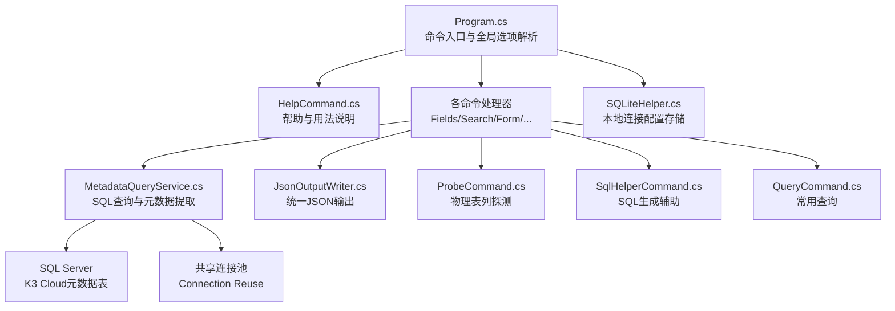
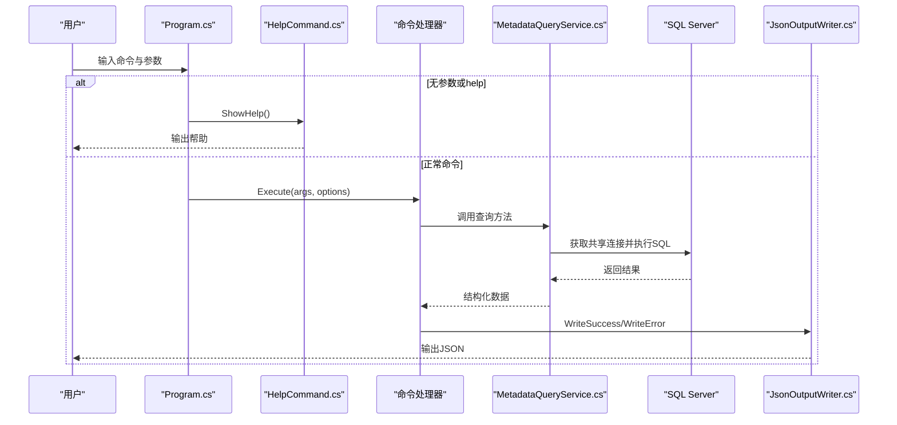
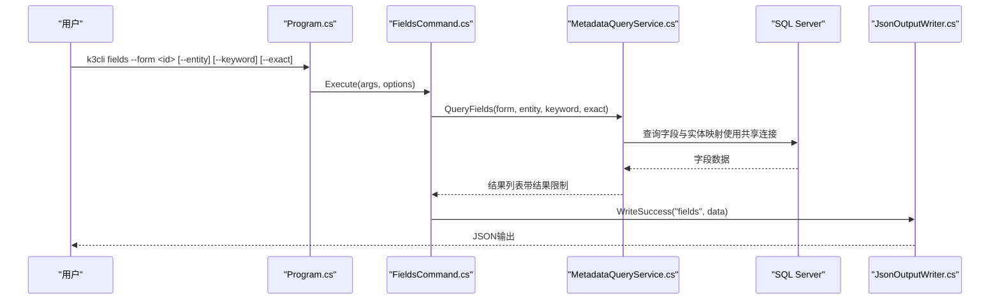
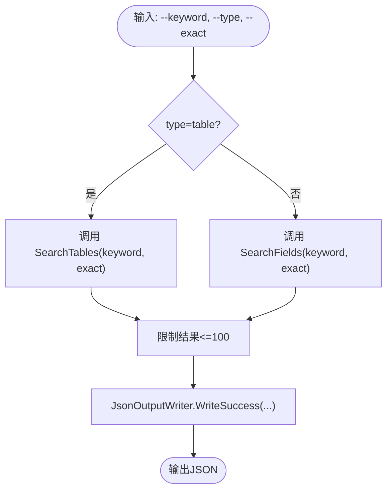
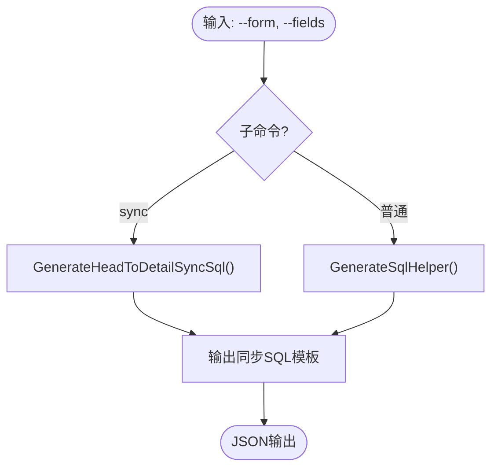
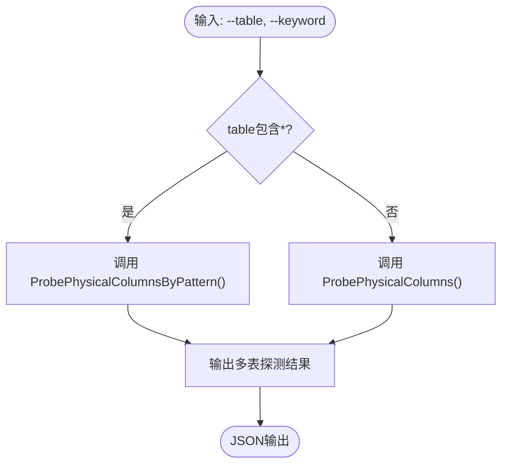
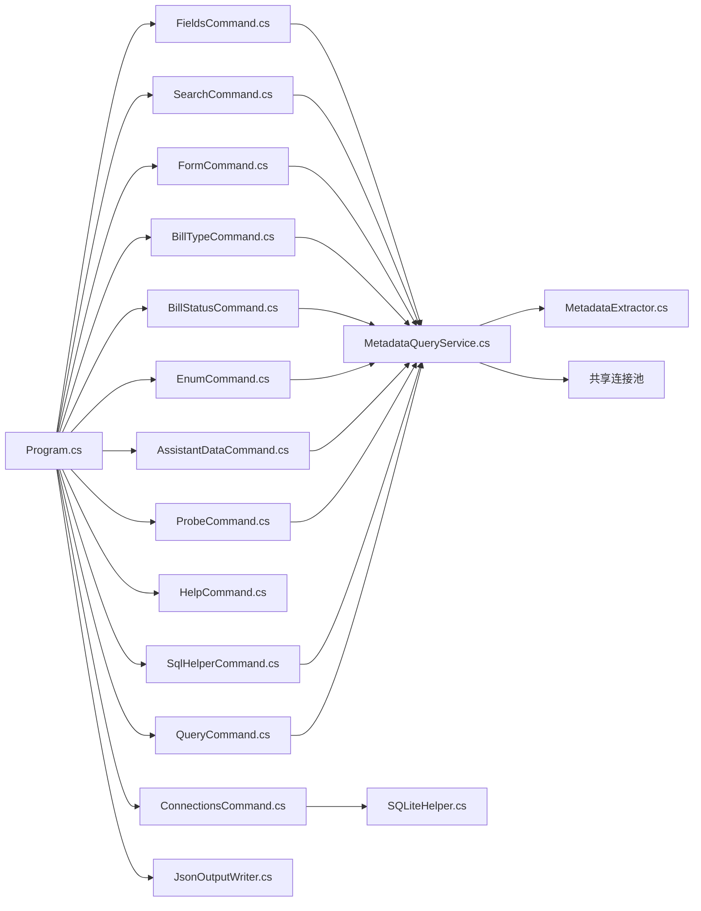

# 使用示例与最佳实践

<cite>
**本文引用的文件**   
- [Program.cs](file://K3CloudDataDictionary.Cli/Program.cs)
- [HelpCommand.cs](file://K3CloudDataDictionary.Cli/Commands/HelpCommand.cs)
- [FieldsCommand.cs](file://K3CloudDataDictionary.Cli/Commands/FieldsCommand.cs)
- [SearchCommand.cs](file://K3CloudDataDictionary.Cli/Commands/SearchCommand.cs)
- [FormCommand.cs](file://K3CloudDataDictionary.Cli/Commands/FormCommand.cs)
- [BillTypeCommand.cs](file://K3CloudDataDictionary.Cli/Commands/BillTypeCommand.cs)
- [BillStatusCommand.cs](file://K3CloudDataDictionary.Cli/Commands/BillStatusCommand.cs)
- [EnumCommand.cs](file://K3CloudDataDictionary.Cli/Commands/EnumCommand.cs)
- [AssistantDataCommand.cs](file://K3CloudDataDictionary.Cli/Commands/AssistantDataCommand.cs)
- [ConnectionsCommand.cs](file://K3CloudDataDictionary.Cli/Commands/ConnectionsCommand.cs)
- [ProbeCommand.cs](file://K3CloudDataDictionary.Cli/Commands/ProbeCommand.cs)
- [SqlHelperCommand.cs](file://K3CloudDataDictionary.Cli/Commands/SqlHelperCommand.cs)
- [QueryCommand.cs](file://K3CloudDataDictionary.Cli/Commands/QueryCommand.cs)
- [MetadataQueryService.cs](file://K3CloudDataDictionary.Cli/Services/MetadataQueryService.cs)
- [JsonOutputWriter.cs](file://K3CloudDataDictionary.Cli/Services/JsonOutputWriter.cs)
- [SQLiteHelper.cs](file://Helpers/SQLiteHelper.cs)
- [usage-examples.md](file://docs/usage-examples.md)
- [MetadataExtractor.cs](file://Views/MetadataExtractor.cs)
</cite>

## 更新摘要
**变更内容**   
- 新增 user-role-permissions 命令的 --permission 和 --limit 参数支持，提供更灵活的权限查询功能
- 增强了权限审计场景的使用示例，包括按权限项过滤和结果限制的实际应用
- 完善了用户角色权限查询的输出字段说明和使用注意事项
- 更新了帮助文档中的参数说明和示例用法

## 目录
1. [简介](#简介)
2. [项目结构](#项目结构)
3. [核心组件](#核心组件)
4. [架构总览](#架构总览)
5. [详细组件分析](#详细组件分析)
6. [依赖关系分析](#依赖关系分析)
7. [性能考虑](#性能考虑)
8. [故障排除指南](#故障排除指南)
9. [结论](#结论)
10. [附录](#附录)

## 简介
本文件面向金蝶K3 Cloud数据字典命令行工具（k3cli）的使用者，提供从入门到进阶的使用示例、最佳实践与故障排除指南。内容覆盖常见查询场景、批量处理思路、自动化脚本编写要点，并结合各命令串联复杂的数据查询与分析任务，帮助您高效完成元数据探索、字段关联分析、单据类型与状态枚举查询、权限审计以及连接管理等日常工作。

**更新** 新版本增强了 user-role-permissions 命令的功能，新增了 --permission 和 --limit 参数支持，可以按权限项名称进行模糊匹配过滤，并支持限制返回结果数量，大幅提升权限审计的灵活性和效率。

## 项目结构
k3cli采用命令分发 + 服务层 + 输出格式化的分层设计：
- 命令入口负责参数解析与路由，调用对应命令处理器
- 命令处理器通过服务层访问SQL Server元数据，组装统一JSON输出
- 输出层负责美化与错误包装，便于脚本消费



**图示来源**
- [Program.cs:14-69](file://K3CloudDataDictionary.Cli/Program.cs#L14-L69)
- [HelpCommand.cs:10-72](file://K3CloudDataDictionary.Cli/Commands/HelpCommand.cs#L10-L72)
- [MetadataQueryService.cs:12-22](file://K3CloudDataDictionary.Cli/Services/MetadataQueryService.cs#L12-L22)
- [JsonOutputWriter.cs:11-37](file://K3CloudDataDictionary.Cli/Services/JsonOutputWriter.cs#L11-L37)
- [SQLiteHelper.cs:10-53](file://Helpers/SQLiteHelper.cs#L10-L53)
- [ProbeCommand.cs:12-87](file://K3CloudDataDictionary.Cli/Commands/ProbeCommand.cs#L12-L87)
- [SqlHelperCommand.cs:12-109](file://K3CloudDataDictionary.Cli/Commands/SqlHelperCommand.cs#L12-L109)
- [QueryCommand.cs:12-85](file://K3CloudDataDictionary.Cli/Commands/QueryCommand.cs#L12-L85)

**章节来源**
- [Program.cs:14-69](file://K3CloudDataDictionary.Cli/Program.cs#L14-L69)
- [HelpCommand.cs:10-72](file://K3CloudDataDictionary.Cli/Commands/HelpCommand.cs#L10-L72)

## 核心组件
- 命令入口与全局选项
  - 解析全局选项（连接ID、格式化输出）
  - 分发到具体命令处理器
  - **新增** 自动连接检测和连接字符串解析
- 命令处理器
  - 字段查询、搜索、表单信息、单据类型、单据状态、枚举、辅助资料、连接管理
  - **新增** probe命令：物理表列探测，支持通配符匹配
  - **新增** sql命令：SQL生成辅助，支持sync子命令
  - **新增** query命令：常用业务数据查询
- 查询服务
  - 直连SQL Server查询元数据，支持字段、表、实体、单据类型、枚举、辅助资料等
  - **新增** GenerateSqlHelper：生成SQL辅助信息
  - **新增** GenerateHeadToDetailSyncSql：生成字段同步SQL
  - **新增** CompareHeadEntryFields：对比字段差异
  - **新增** QueryBlockingProcesses：查询数据库阻塞信息
  - **新增** ExecuteSql：执行自定义只读SQL
  - **新增** QueryUserRolePermissions：查询用户角色权限，支持按表单、权限项过滤和结果限制
  - **新增** 连接复用机制：共享SqlConnection实例
- 输出格式化
  - 统一成功/失败JSON结构，支持美化输出
- 连接管理
  - SQLite本地存储连接配置，支持增删改查与默认连接设置
  - **增强** 自动连接检测和连接历史追踪

**章节来源**
- [Program.cs:74-97](file://K3CloudDataDictionary.Cli/Program.cs#L74-L97)
- [FieldsCommand.cs:13-85](file://K3CloudDataDictionary.Cli/Commands/FieldsCommand.cs#L13-L85)
- [MetadataQueryService.cs:12-22](file://K3CloudDataDictionary.Cli/Services/MetadataQueryService.cs#L12-L22)
- [JsonOutputWriter.cs:11-37](file://K3CloudDataDictionary.Cli/Services/JsonOutputWriter.cs#L11-L37)
- [ConnectionsCommand.cs:15-43](file://K3CloudDataDictionary.Cli/Commands/ConnectionsCommand.cs#L15-L43)
- [ProbeCommand.cs:12-87](file://K3CloudDataDictionary.Cli/Commands/ProbeCommand.cs#L12-L87)
- [SqlHelperCommand.cs:12-109](file://K3CloudDataDictionary.Cli/Commands/SqlHelperCommand.cs#L12-L109)
- [QueryCommand.cs:12-85](file://K3CloudDataDictionary.Cli/Commands/QueryCommand.cs#L12-L85)

## 架构总览
k3cli的执行流从命令入口开始，解析参数后调用对应命令处理器；处理器通过服务层访问数据库并返回结构化结果，最终由输出层统一格式化输出。**新增的连接复用机制**确保同一进程内的多次查询共享同一个数据库连接，显著提升性能。



**图示来源**
- [Program.cs:19-69](file://K3CloudDataDictionary.Cli/Program.cs#L19-L69)
- [HelpCommand.cs:10-72](file://K3CloudDataDictionary.Cli/Commands/HelpCommand.cs#L10-L72)
- [MetadataQueryService.cs:286-388](file://K3CloudDataDictionary.Cli/Services/MetadataQueryService.cs#L286-L388)
- [JsonOutputWriter.cs:26-70](file://K3CloudDataDictionary.Cli/Services/JsonOutputWriter.cs#L26-L70)

## 详细组件分析

### 字段查询（fields）
- 功能：按表单/实体查询字段，支持关键词模糊/精确匹配
- 关键参数：--form、--entity、--keyword、--exact、--type、--compare
- 输出：字段元数据（含elementType、tagName、lookUpObject、enumType、更新动作计数等）
- **新增** 多关键词支持：支持逗号、分号分隔的多个关键词批量查询
- **新增** 类型过滤：支持entry、head、oid、normal等类型筛选



**图示来源**
- [FieldsCommand.cs:13-85](file://K3CloudDataDictionary.Cli/Commands/FieldsCommand.cs#L13-L85)
- [MetadataQueryService.cs:286-388](file://K3CloudDataDictionary.Cli/Services/MetadataQueryService.cs#L286-L388)
- [JsonOutputWriter.cs:26-53](file://K3CloudDataDictionary.Cli/Services/JsonOutputWriter.cs#L26-L53)

**章节来源**
- [FieldsCommand.cs:13-85](file://K3CloudDataDictionary.Cli/Commands/FieldsCommand.cs#L13-L85)
- [MetadataQueryService.cs:286-388](file://K3CloudDataDictionary.Cli/Services/MetadataQueryService.cs#L286-L388)

### 搜索（search）
- 功能：按字段或表进行模糊/精确搜索，支持限制结果数量
- 关键参数：--keyword、--type（field/table）、--exact
- 输出：表单/字段元数据摘要
- **新增** 结果限制：默认限制100条结果，避免全量扫描



**图示来源**
- [SearchCommand.cs:13-107](file://K3CloudDataDictionary.Cli/Commands/SearchCommand.cs#L13-L107)
- [MetadataQueryService.cs:496-561](file://K3CloudDataDictionary.Cli/Services/MetadataQueryService.cs#L496-L561)

**章节来源**
- [SearchCommand.cs:13-107](file://K3CloudDataDictionary.Cli/Commands/SearchCommand.cs#L13-L107)
- [MetadataQueryService.cs:496-561](file://K3CloudDataDictionary.Cli/Services/MetadataQueryService.cs#L496-L561)

### SQL生成辅助（sql）
- 功能：根据表单标识和字段列表，自动生成SQL辅助信息
- 关键参数：--form、--fields
- **新增** sync子命令：生成单据头到明细的字段同步SQL
- 输出：物理表名、列名、JOIN条件、SELECT/UPDATE模板



**图示来源**
- [SqlHelperCommand.cs:14-109](file://K3CloudDataDictionary.Cli/Commands/SqlHelperCommand.cs#L14-L109)
- [MetadataQueryService.cs:1300-1520](file://K3CloudDataDictionary.Cli/Services/MetadataQueryService.cs#L1300-L1520)

**章节来源**
- [SqlHelperCommand.cs:14-109](file://K3CloudDataDictionary.Cli/Commands/SqlHelperCommand.cs#L14-L109)
- [MetadataQueryService.cs:1300-1520](file://K3CloudDataDictionary.Cli/Services/MetadataQueryService.cs#L1300-L1520)

### 常用查询（query）
- 功能：提供预定义的常用业务数据查询
- 子命令：list、user-licenses、blocking、mo-pick-summary等
- **新增** 自定义SQL执行：支持--sql参数执行只读SQL
- **新增** 超时控制：支持--timeout参数设置查询超时时间
- **新增** user-role-permissions权限查询：支持按表单、权限项过滤和结果限制
- 输出：业务数据结果集

**章节来源**
- [QueryCommand.cs:12-85](file://K3CloudDataDictionary.Cli/Commands/QueryCommand.cs#L12-L85)
- [MetadataQueryService.cs:1574-1708](file://K3CloudDataDictionary.Cli/Services/MetadataQueryService.cs#L1574-L1708)

### 连接管理（connections）
- 功能：列出、添加、测试、设为默认连接
- 子命令：list、add、test --id、set-default --id
- 输出：统一JSON结构
- **增强** 自动连接检测：执行查询前自动检测连接可达性
- **增强** 连接历史追踪：记录最后成功连接时间

**章节来源**
- [ConnectionsCommand.cs:15-229](file://K3CloudDataDictionary.Cli/Commands/ConnectionsCommand.cs#L15-L229)
- [SQLiteHelper.cs:55-112](file://Helpers/SQLiteHelper.cs#L55-L112)

### 物理表列探测（probe）
- 功能：直接查询SQL Server物理表的列信息，绕过字典限制
- 关键参数：--table、--keyword
- **新增** 通配符匹配：支持*通配符同时探测多个表
- 输出：列名、数据类型、长度、精度、是否可空



**图示来源**
- [ProbeCommand.cs:14-87](file://K3CloudDataDictionary.Cli/Commands/ProbeCommand.cs#L14-L87)
- [MetadataQueryService.cs:1044-1057](file://K3CloudDataDictionary.Cli/Services/MetadataQueryService.cs#L1044-L1057)

**章节来源**
- [ProbeCommand.cs:14-87](file://K3CloudDataDictionary.Cli/Commands/ProbeCommand.cs#L14-L87)
- [MetadataQueryService.cs:1044-1057](file://K3CloudDataDictionary.Cli/Services/MetadataQueryService.cs#L1044-L1057)

## 依赖关系分析
- 命令入口依赖各命令处理器与输出格式化器
- 命令处理器依赖查询服务与连接解析
- 查询服务依赖SQL Server与元数据提取器
- **新增** 连接复用：查询服务内部维护共享SqlConnection实例
- 输出格式化器独立于业务逻辑，统一错误与成功输出
- 连接管理依赖SQLite本地存储



**图示来源**
- [Program.cs:3-69](file://K3CloudDataDictionary.Cli/Program.cs#L3-L69)
- [MetadataQueryService.cs:12-22](file://K3CloudDataDictionary.Cli/Services/MetadataQueryService.cs#L12-L22)
- [MetadataExtractor.cs:98-200](file://Views/MetadataExtractor.cs#L98-L200)
- [JsonOutputWriter.cs:11-37](file://K3CloudDataDictionary.Cli/Services/JsonOutputWriter.cs#L11-L37)
- [SQLiteHelper.cs:10-53](file://Helpers/SQLiteHelper.cs#L10-L53)
- [ProbeCommand.cs:12-87](file://K3CloudDataDictionary.Cli/Commands/ProbeCommand.cs#L12-L87)
- [SqlHelperCommand.cs:12-109](file://K3CloudDataDictionary.Cli/Commands/SqlHelperCommand.cs#L12-L109)
- [QueryCommand.cs:12-85](file://K3CloudDataDictionary.Cli/Commands/QueryCommand.cs#L12-L85)

**章节来源**
- [Program.cs:3-69](file://K3CloudDataDictionary.Cli/Program.cs#L3-L69)
- [MetadataQueryService.cs:12-22](file://K3CloudDataDictionary.Cli/Services/MetadataQueryService.cs#L12-L22)
- [MetadataExtractor.cs:98-200](file://Views/MetadataExtractor.cs#L98-L200)
- [JsonOutputWriter.cs:11-37](file://K3CloudDataDictionary.Cli/Services/JsonOutputWriter.cs#L11-L37)
- [SQLiteHelper.cs:10-53](file://Helpers/SQLiteHelper.cs#L10-L53)

## 性能考虑
- 搜索限制：字段/表搜索默认限制结果数量，避免全量扫描导致性能问题
- 上下文懒加载：元数据上下文按需初始化，减少首次启动开销
- 命令选择：优先使用按表单/实体的精确查询，减少跨对象遍历
- 输出美化：仅在需要时启用格式化输出，降低序列化成本
- 连接复用：**新增** 共享SqlConnection实例，避免重复建立连接的开销
- **新增** 通配符匹配：probe命令支持批量探测，减少多次查询开销
- **新增** LK表检测超时：避免长时间等待数据库响应
- **新增** SQL执行超时：query命令支持自定义超时时间
- **新增** 结果缓存：LK表检测结果缓存，避免重复查询
- **新增** 权限查询优化：user-role-permissions支持按表单、权限项过滤和结果限制，减少不必要的数据传输

**章节来源**
- [MetadataQueryService.cs:476-486](file://K3CloudDataDictionary.Cli/Services/MetadataQueryService.cs#L476-L486)
- [MetadataQueryService.cs:27-37](file://K3CloudDataDictionary.Cli/Services/MetadataQueryService.cs#L27-L37)
- [SearchCommand.cs:34-37](file://K3CloudDataDictionary.Cli/Commands/SearchCommand.cs#L34-L37)
- [JsonOutputWriter.cs:18-21](file://K3CloudDataDictionary.Cli/Services/JsonOutputWriter.cs#L18-L21)
- [MetadataQueryService.cs:1500-1508](file://K3CloudDataDictionary.Cli/Services/MetadataQueryService.cs#L1500-L1508)
- [MetadataQueryService.cs:1324-1384](file://K3CloudDataDictionary.Cli/Services/MetadataQueryService.cs#L1324-L1384)

## 故障排除指南
- 未知命令
  - 现象：输出"未知命令"
  - 处理：使用帮助命令查看可用命令
  - 参考：[Program.cs:58-62](file://K3CloudDataDictionary.Cli/Program.cs#L58-L62)
- 缺少必填参数
  - 现象：字段/搜索/表单/枚举/辅助资料等命令报错
  - 处理：检查必填参数（如--form、--id、--keyword）
  - 参考：[FieldsCommand.cs:26-31](file://K3CloudDataDictionary.Cli/Commands/FieldsCommand.cs#L26-L31)、[SearchCommand.cs:26-31](file://K3CloudDataDictionary.Cli/Commands/SearchCommand.cs#L26-L31)、[EnumCommand.cs:26-31](file://K3CloudDataDictionary.Cli/Commands/EnumCommand.cs#L26-L31)、[AssistantDataCommand.cs:26-31](file://K3CloudDataDictionary.Cli/Commands/AssistantDataCommand.cs#L26-L31)
- 连接相关
  - 现象：未找到连接或默认连接不存在
  - 处理：使用connections命令添加/测试/设为默认
  - 参考：[Program.cs:129-151](file://K3CloudDataDictionary.Cli/Program.cs#L129-L151)、[ConnectionsCommand.cs:173-228](file://K3CloudDataDictionary.Cli/Commands/ConnectionsCommand.cs#L173-L228)
- SQL异常
  - 现象：查询过程中抛出异常
  - 处理：检查连接字符串、网络连通性、数据库权限
  - 参考：[Program.cs:64-68](file://K3CloudDataDictionary.Cli/Program.cs#L64-L68)、[MetadataQueryService.cs:47-67](file://K3CloudDataDictionary.Cli/Services/MetadataQueryService.cs#L47-L67)
- 输出格式
  - 现象：输出不可读或过大
  - 处理：使用--pretty美化输出；必要时重定向到文件
- **新增** 权限不足
  - 现象：blocking查询返回权限错误
  - 处理：授予VIEW SERVER STATE权限
  - 参考：[usage-examples.md:1956-1969](file://docs/usage-examples.md#L1956-L1969)
- **新增** 连接超时
  - 现象：查询执行时间过长或超时
  - 处理：使用--timeout参数调整超时时间，检查网络连接
  - 参考：[QueryCommand.cs:182-188](file://K3CloudDataDictionary.Cli/Commands/QueryCommand.cs#L182-L188)
- **新增** 结果过多
  - 现象：搜索结果返回大量数据
  - 处理：使用更精确的搜索条件，或增加--limit参数限制结果数
  - 参考：[MetadataQueryService.cs:614-615](file://K3CloudDataDictionary.Cli/Services/MetadataQueryService.cs#L614-L615)
- **新增** 权限查询性能问题
  - 现象：user-role-permissions查询返回大量数据
  - 处理：使用--form参数指定表单标识进行过滤，或使用--user参数限定用户范围，结合--limit限制结果数量
  - 参考：[MetadataQueryService.cs:2423-2427](file://K3CloudDataDictionary.Cli/Services/MetadataQueryService.cs#L2423-L2427)

**章节来源**
- [Program.cs:58-68](file://K3CloudDataDictionary.Cli/Program.cs#L58-L68)
- [FieldsCommand.cs:26-31](file://K3CloudDataDictionary.Cli/Commands/FieldsCommand.cs#L26-L31)
- [SearchCommand.cs:26-31](file://K3CloudDataDictionary.Cli/Commands/SearchCommand.cs#L26-L31)
- [EnumCommand.cs:26-31](file://K3CloudDataDictionary.Cli/Commands/EnumCommand.cs#L26-L31)
- [AssistantDataCommand.cs:26-31](file://K3CloudDataDictionary.Cli/Commands/AssistantDataCommand.cs#L26-L31)
- [ConnectionsCommand.cs:173-228](file://K3CloudDataDictionary.Cli/Commands/ConnectionsCommand.cs#L173-L228)
- [Program.cs:129-151](file://K3CloudDataDictionary.Cli/Program.cs#L129-L151)
- [MetadataQueryService.cs:47-67](file://K3CloudDataDictionary.Cli/Services/MetadataQueryService.cs#L47-L67)

## 结论
k3cli提供了围绕金蝶K3 Cloud元数据的一站式CLI能力，通过命令组合可完成从字段发现、关联查询到单据类型与状态枚举的全链路分析。配合连接管理与输出格式化，适合在脚本与自动化流程中稳定使用。建议优先采用精确查询与结果限制策略，结合--pretty提升可读性，并通过connections命令维护稳定的连接配置。

**更新** 新版本通过引入连接复用机制、结果限制、超时保护、SQL sync子命令等功能，显著提升了工具的性能和实用性。特别是 user-role-permissions 命令新增的 --permission 和 --limit 参数支持，使得权限审计工作更加精准高效，能够按权限项名称进行模糊匹配过滤，并限制返回结果数量，大幅提升权限管理的效率和准确性。

## 附录

### 常见使用流程与示例
- 通过lookUpObject解析基础资料/辅助资料
  - 步骤：fields → resolve → fields/assistantdata
  - 示例参考：[usage-examples.md:3-158](file://docs/usage-examples.md#L3-L158)
- 查询单据类型
  - 步骤：billtype --form 或 --id 或 --keyword
  - 示例参考：[usage-examples.md:161-232](file://docs/usage-examples.md#L161-L232)
- 查询辅助资料列表
  - 步骤：fields → assistantdata --id
  - 示例参考：[usage-examples.md:234-275](file://docs/usage-examples.md#L234-L275)
- 查询下拉列表枚举
  - 步骤：fields → enum --id
  - 示例参考：[usage-examples.md:278-325](file://docs/usage-examples.md#L278-L325)
- 从搜索表到字段
  - 步骤：search → fields
  - 示例参考：[usage-examples.md:328-390](file://docs/usage-examples.md#L328-L390)
- 根据表+实体查询子项明细字段
  - 步骤：search → fields --entity → fields --keyword
  - 示例参考：[usage-examples.md:392-451](file://docs/usage-examples.md#L392-L451)
- 查询单据状态字段枚举值
  - 步骤：fields → billstatus
  - 示例参考：[usage-examples.md:453-512](file://docs/usage-examples.md#L453-L512)

### 新增功能示例
- **拆分表支持**
  - 步骤：fields查询splitTable字段 → sql命令自动生成JOIN语句
  - 示例参考：[usage-examples.md:792-862](file://docs/usage-examples.md#L792-L862)
- **probe通配符匹配**
  - 步骤：probe --table "表名*" --keyword
  - 示例参考：[usage-examples.md:864-917](file://docs/usage-examples.md#L864-L917)
- **LK关联表检测**
  - 步骤：sql命令自动检测并输出关联信息
  - 示例参考：[usage-examples.md:918-1004](file://docs/usage-examples.md#L918-L1004)
- **字段同步SQL生成**
  - 步骤：sql sync --form --field
  - 示例参考：[usage-examples.md:1159-1263](file://docs/usage-examples.md#L1159-L1263)
- **字段对比分析**
  - 步骤：fields --compare --form
  - 示例参考：[usage-examples.md:1265-1358](file://docs/usage-examples.md#L1265-L1358)
- **数据库阻塞查询**
  - 步骤：query blocking
  - 示例参考：[usage-examples.md:1840-1978](file://docs/usage-examples.md#L1840-L1978)
- **连接管理增强**
  - 步骤：connections list查看连接历史，connections test测试连接
  - 示例参考：[usage-examples.md:1496-1594](file://docs/usage-examples.md#L1496-L1594)
- **权限审计增强**
  - 步骤：query user-role-permissions --user <用户ID> --form <表单标识> --permission <权限项> --limit <条数>
  - 示例参考：[usage-examples.md:1861-1931](file://docs/usage-examples.md#L1861-L1931)

### 命令速查与最佳实践
- 命令速查表
  - 参考：[usage-examples.md:1596-1611](file://docs/usage-examples.md#L1596-L1611)
- elementType速查
  - 参考：[usage-examples.md:1612-1625](file://docs/usage-examples.md#L1612-L1625)
- 最佳实践
  - 使用--exact进行精确匹配，避免模糊搜索导致的大量结果
  - 优先使用--connection指定连接ID，减少默认连接依赖
  - 对大结果集启用--pretty仅在调试阶段，生产环境建议重定向输出
  - 使用connections命令维护默认连接，简化日常使用
  - **新增** 使用probe通配符批量探测多个表，提高效率
  - **新增** 利用sql命令自动生成SQL模板，减少手写错误
  - **新增** 定期使用query blocking监控数据库性能
  - **新增** 合理使用结果限制，避免大量数据查询影响性能
  - **新增** 利用连接复用机制，提升批量查询性能
  - **新增** 设置合适的超时时间，防止长时间查询阻塞系统
  - **新增** 使用user-role-permissions的--form、--permission、--limit参数进行精确权限审计，提高审计效率

**章节来源**
- [usage-examples.md:1596-1611](file://docs/usage-examples.md#L1596-L1611)
- [usage-examples.md:1612-1625](file://docs/usage-examples.md#L1612-L1625)

### 权限审计实战示例

#### 场景一：针对特定表单进行权限审计

当需要对特定表单（如AP_Payable应付单）进行权限审计时，可以使用user-role-permissions命令的--form参数：

```bash
# 查询用户110792在应付单上的所有权限
k3cli query user-role-permissions --user 110792 --form AP_Payable --pretty

# 查询所有用户在应付单上的权限分布
k3cli query user-role-permissions --form AP_Payable --pretty
```

**优势**：
- 精确过滤：只返回指定表单相关的权限记录
- 性能优化：减少不必要的数据传输和处理
- 审计聚焦：专注于特定业务对象的权限分析

#### 场景二：按权限项进行精细化查询

```bash
# 查询用户110792的所有"新增"权限
k3cli query user-role-permissions --user 110792 --permission "新增" --pretty

# 查询用户110792的所有"查看"权限
k3cli query user-role-permissions --user 110792 --permission "查看" --pretty

# 查询用户110792的所有"审核"权限
k3cli query user-role-permissions --user 110792 --permission "审核" --pretty
```

#### 场景三：多维度权限分析

```bash
# 按组织维度分析应付单权限
k3cli query user-role-permissions --form AP_Payable --pretty | jq '.data[] | {FOrgName, FUserName, FRoleName}'

# 按角色维度统计应付单权限
k3cli query user-role-permissions --form AP_Payable --pretty | jq '.data[] | {FRoleName, FPermissionItemName}'

# 限制返回条数，只查看前100条结果
k3cli query user-role-permissions --user 110792 --limit 100 --pretty
```

#### 场景四：权限合规检查

```bash
# 检查特定用户的应付单权限是否符合预期
k3cli query user-role-permissions --user 110792 --form AP_Payable --pretty

# 导出权限数据进行进一步分析
k3cli query user-role-permissions --form AP_Payable > fin_yfd_permissions.json

# 组合使用：按表单 + 权限项 + 限制条数
k3cli query user-role-permissions --user 110792 --form AP_Payable --permission "查看" --limit 50 --pretty
```

#### 输出字段说明

| 字段 | 说明 |
|------|------|
| `FUserName` | 用户名称 |
| `FUserID` | 用户内码 |
| `FForbidStatusName` | 用户是否禁用（是 / 否） |
| `FOrgNumber` | 组织编码 |
| `FOrgName` | 组织名称 |
| `FRoleName` | 角色名称 |
| `FTopClassName` | 业务领域（顶级分类）名称 |
| `FSubSystemName` | 子系统名称 |
| `FObjectTypeName` | 业务对象名称（如"付款申请单"） |
| `FObjectNumber` | 业务对象标识（如 `CN_PAYAPPLY`，用于 `--form` 过滤） |
| `FPermissionItemName` | 权限项名称（如 查看、新增、修改） |
| `FPermissionStatusName` | 权限状态（有权 / 禁止 / 无权） |
| `FIDENTITYID` | 行序号（按用户、组织、业务领域、子系统、业务对象、权限项排序） |

#### 注意事项

- 查询结果已按用户名称、组织编码、业务领域、子系统、业务对象、权限项名称、权限状态排序
- 仅返回已启用（`FFORBIDSTATUS = 'A'`）的用户，已禁用的用户不显示
- 不传 `--user` 参数时返回所有已启用用户的权限明细，数据量可能较大，建议指定用户ID
- 使用 `--form <表单标识>` 可按表单过滤，只返回该表单对应的权限对象记录（如 `CN_PAYAPPLY` 付款申请单）
- 使用 `--permission <权限项>` 可按权限项名称模糊过滤（如 "新增"、"查看"、"审核"）
- 使用 `--limit <条数>` 可限制返回条数，避免输出过大（如 `--limit 100`）
- 权限状态为"有权"表示该用户通过角色拥有对应权限项，"禁止"表示显式禁止，"无权"表示未授权

**章节来源**
- [QueryCommand.cs:140-165](file://K3CloudDataDictionary.Cli/Commands/QueryCommand.cs#L140-L165)
- [MetadataQueryService.cs:2369-2443](file://K3CloudDataDictionary.Cli/Services/MetadataQueryService.cs#L2369-L2443)
- [HelpCommand.cs:501-507](file://K3CloudDataDictionary.Cli/Commands/HelpCommand.cs#L501-L507)
- [usage-examples.md:1861-1942](file://docs/usage-examples.md#L1861-L1942)