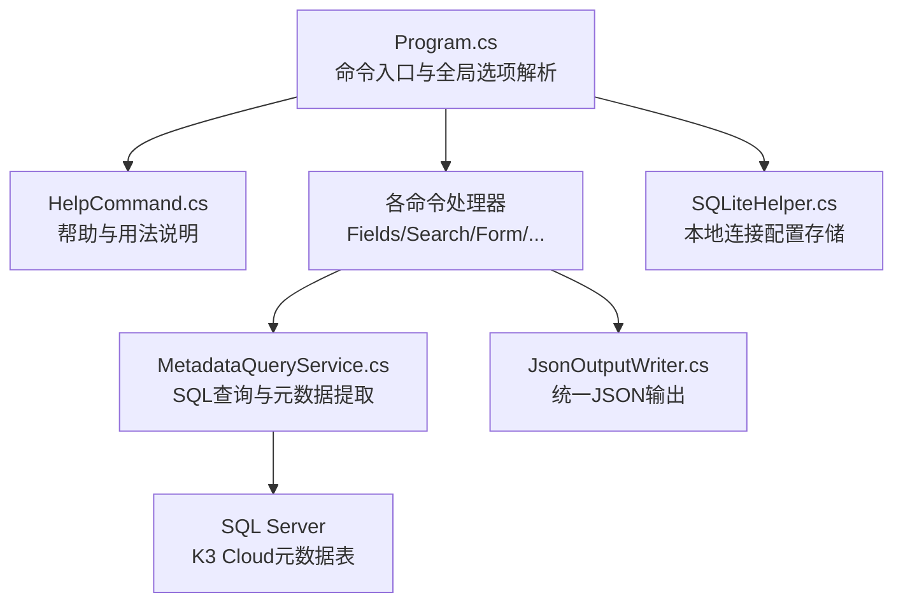
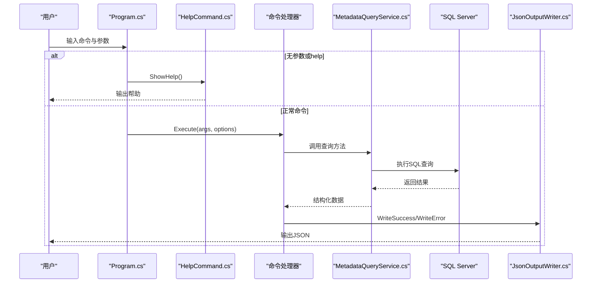
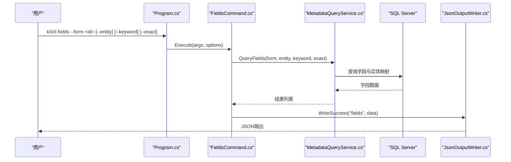
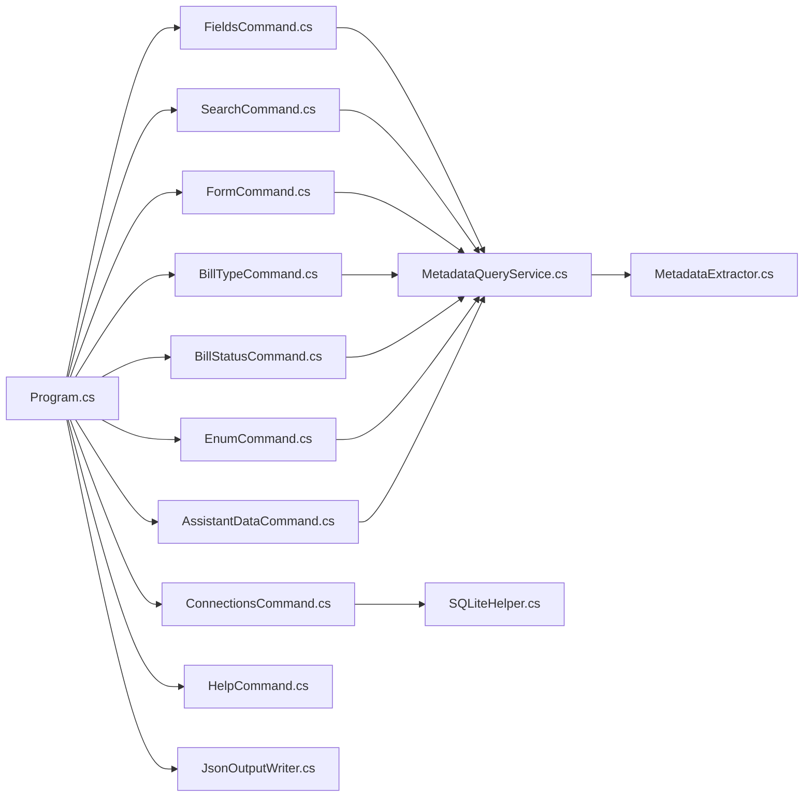

# 使用示例与最佳实践

<cite>
**本文引用的文件**   
- [Program.cs](file://K3CloudDataDictionary.Cli/Program.cs)
- [HelpCommand.cs](file://K3CloudDataDictionary.Cli/Commands/HelpCommand.cs)
- [FieldsCommand.cs](file://K3CloudDataDictionary.Cli/Commands/FieldsCommand.cs)
- [SearchCommand.cs](file://K3CloudDataDictionary.Cli/Commands/SearchCommand.cs)
- [FormCommand.cs](file://K3CloudDataDictionary.Cli/Commands/FormCommand.cs)
- [BillTypeCommand.cs](file://K3CloudDataDictionary.Cli/Commands/BillTypeCommand.cs)
- [BillStatusCommand.cs](file://K3CloudDataDictionary.Cli/Commands/BillStatusCommand.cs)
- [EnumCommand.cs](file://K3CloudDataDictionary.Cli/Commands/EnumCommand.cs)
- [AssistantDataCommand.cs](file://K3CloudDataDictionary.Cli/Commands/AssistantDataCommand.cs)
- [ConnectionsCommand.cs](file://K3CloudDataDictionary.Cli/Commands/ConnectionsCommand.cs)
- [MetadataQueryService.cs](file://K3CloudDataDictionary.Cli/Services/MetadataQueryService.cs)
- [JsonOutputWriter.cs](file://K3CloudDataDictionary.Cli/Services/JsonOutputWriter.cs)
- [SQLiteHelper.cs](file://Helpers/SQLiteHelper.cs)
- [usage-examples.md](file://docs/usage-examples.md)
- [MetadataExtractor.cs](file://Views/MetadataExtractor.cs)
</cite>

## 目录
1. [简介](#简介)
2. [项目结构](#项目结构)
3. [核心组件](#核心组件)
4. [架构总览](#架构总览)
5. [详细组件分析](#详细组件分析)
6. [依赖关系分析](#依赖关系分析)
7. [性能考虑](#性能考虑)
8. [故障排除指南](#故障排除指南)
9. [结论](#结论)
10. [附录](#附录)

## 简介
本文件面向金蝶K3 Cloud数据字典命令行工具（k3cli）的使用者，提供从入门到进阶的使用示例、最佳实践与故障排除指南。内容覆盖常见查询场景、批量处理思路、自动化脚本编写要点，并结合各命令串联复杂的数据查询与分析任务，帮助您高效完成元数据探索、字段关联分析、单据类型与状态枚举查询、以及连接管理等日常工作。

## 项目结构
k3cli采用命令分发 + 服务层 + 输出格式化的分层设计：
- 命令入口负责参数解析与路由，调用对应命令处理器
- 命令处理器通过服务层访问SQL Server元数据，组装统一JSON输出
- 输出层负责美化与错误包装，便于脚本消费

**图示来源**
- [Program.cs:14-69](file://K3CloudDataDictionary.Cli/Program.cs#L14-L69)
- [HelpCommand.cs:10-72](file://K3CloudDataDictionary.Cli/Commands/HelpCommand.cs#L10-L72)
- [MetadataQueryService.cs:12-22](file://K3CloudDataDictionary.Cli/Services/MetadataQueryService.cs#L12-L22)
- [JsonOutputWriter.cs:11-37](file://K3CloudDataDictionary.Cli/Services/JsonOutputWriter.cs#L11-L37)
- [SQLiteHelper.cs:10-53](file://Helpers/SQLiteHelper.cs#L10-L53)

**章节来源**
- [Program.cs:14-69](file://K3CloudDataDictionary.Cli/Program.cs#L14-L69)
- [HelpCommand.cs:10-72](file://K3CloudDataDictionary.Cli/Commands/HelpCommand.cs#L10-L72)

## 核心组件
- 命令入口与全局选项
  - 解析全局选项（连接ID、格式化输出）
  - 分发到具体命令处理器
- 命令处理器
  - 字段查询、搜索、表单信息、单据类型、单据状态、枚举、辅助资料、连接管理
- 查询服务
  - 直连SQL Server查询元数据，支持字段、表、实体、单据类型、枚举、辅助资料等
- 输出格式化
  - 统一成功/失败JSON结构，支持美化输出
- 连接管理
  - SQLite本地存储连接配置，支持增删改查与默认连接设置

**章节来源**
- [Program.cs:74-97](file://K3CloudDataDictionary.Cli/Program.cs#L74-L97)
- [FieldsCommand.cs:13-85](file://K3CloudDataDictionary.Cli/Commands/FieldsCommand.cs#L13-L85)
- [MetadataQueryService.cs:12-22](file://K3CloudDataDictionary.Cli/Services/MetadataQueryService.cs#L12-L22)
- [JsonOutputWriter.cs:11-37](file://K3CloudDataDictionary.Cli/Services/JsonOutputWriter.cs#L11-L37)
- [ConnectionsCommand.cs:15-43](file://K3CloudDataDictionary.Cli/Commands/ConnectionsCommand.cs#L15-L43)

## 架构总览
k3cli的执行流从命令入口开始，解析参数后调用对应命令处理器；处理器通过服务层访问数据库并返回结构化结果，最终由输出层统一格式化输出。

**图示来源**
- [Program.cs:19-69](file://K3CloudDataDictionary.Cli/Program.cs#L19-L69)
- [HelpCommand.cs:10-72](file://K3CloudDataDictionary.Cli/Commands/HelpCommand.cs#L10-L72)
- [MetadataQueryService.cs:286-388](file://K3CloudDataDictionary.Cli/Services/MetadataQueryService.cs#L286-L388)
- [JsonOutputWriter.cs:26-70](file://K3CloudDataDictionary.Cli/Services/JsonOutputWriter.cs#L26-L70)

## 详细组件分析

### 字段查询（fields）
- 功能：按表单/实体查询字段，支持关键词模糊/精确匹配
- 关键参数：--form、--entity、--keyword、--exact
- 输出：字段元数据（含elementType、tagName、lookUpObject、enumType、更新动作计数等）

**图示来源**
- [FieldsCommand.cs:13-85](file://K3CloudDataDictionary.Cli/Commands/FieldsCommand.cs#L13-L85)
- [MetadataQueryService.cs:286-388](file://K3CloudDataDictionary.Cli/Services/MetadataQueryService.cs#L286-L388)
- [JsonOutputWriter.cs:26-53](file://K3CloudDataDictionary.Cli/Services/JsonOutputWriter.cs#L26-L53)

**章节来源**
- [FieldsCommand.cs:13-85](file://K3CloudDataDictionary.Cli/Commands/FieldsCommand.cs#L13-L85)
- [MetadataQueryService.cs:286-388](file://K3CloudDataDictionary.Cli/Services/MetadataQueryService.cs#L286-L388)

### 搜索（search）
- 功能：按字段或表进行模糊/精确搜索，支持限制结果数量
- 关键参数：--keyword、--type（field/table）、--exact
- 输出：表单/字段元数据摘要

**图示来源**
- [SearchCommand.cs:13-107](file://K3CloudDataDictionary.Cli/Commands/SearchCommand.cs#L13-L107)
- [MetadataQueryService.cs:496-561](file://K3CloudDataDictionary.Cli/Services/MetadataQueryService.cs#L496-L561)

**章节来源**
- [SearchCommand.cs:13-107](file://K3CloudDataDictionary.Cli/Commands/SearchCommand.cs#L13-L107)
- [MetadataQueryService.cs:496-561](file://K3CloudDataDictionary.Cli/Services/MetadataQueryService.cs#L496-L561)

### 表单信息（form）
- 功能：查询表单及其实体信息，统计插件、服务规则、更新动作等
- 关键参数：--id
- 输出：表单基础信息与实体列表

**章节来源**
- [FormCommand.cs:13-90](file://K3CloudDataDictionary.Cli/Commands/FormCommand.cs#L13-L90)
- [MetadataQueryService.cs:172-230](file://K3CloudDataDictionary.Cli/Services/MetadataQueryService.cs#L172-L230)

### 单据类型（billtype）
- 功能：按表单查询类型列表，或按ID/关键词查询详情
- 关键参数：--form、--id、--keyword
- 输出：类型ID、编号、名称、描述

**章节来源**
- [BillTypeCommand.cs:13-63](file://K3CloudDataDictionary.Cli/Commands/BillTypeCommand.cs#L13-L63)
- [MetadataQueryService.cs:569-630](file://K3CloudDataDictionary.Cli/Services/MetadataQueryService.cs#L569-L630)

### 单据状态（billstatus）
- 功能：查询elementType=40的字段状态枚举，支持按字段或关键词筛选
- 关键参数：--form、--field、--keyword
- 输出：字段级状态项（值、名称）

**章节来源**
- [BillStatusCommand.cs:13-79](file://K3CloudDataDictionary.Cli/Commands/BillStatusCommand.cs#L13-L79)
- [MetadataQueryService.cs:736-809](file://K3CloudDataDictionary.Cli/Services/MetadataQueryService.cs#L736-L809)

### 枚举（enum）
- 功能：查询elementType=9的下拉列表枚举项
- 关键参数：--id（enumType）
- 输出：枚举项ID、名称、值、显示名

**章节来源**
- [EnumCommand.cs:13-62](file://K3CloudDataDictionary.Cli/Commands/EnumCommand.cs#L13-L62)
- [MetadataQueryService.cs:685-727](file://K3CloudDataDictionary.Cli/Services/MetadataQueryService.cs#L685-L727)

### 辅助资料（assistantdata）
- 功能：查询elementType=30的辅助资料选项
- 关键参数：--id（lookUpObject）
- 输出：条目ID、编号、名称、数据值

**章节来源**
- [AssistantDataCommand.cs:13-63](file://K3CloudDataDictionary.Cli/Commands/AssistantDataCommand.cs#L13-L63)
- [MetadataQueryService.cs:636-679](file://K3CloudDataDictionary.Cli/Services/MetadataQueryService.cs#L636-L679)

### 连接管理（connections）
- 功能：列出、添加、测试、设为默认连接
- 子命令：list、add、test --id、set-default --id
- 输出：统一JSON结构

**章节来源**
- [ConnectionsCommand.cs:15-229](file://K3CloudDataDictionary.Cli/Commands/ConnectionsCommand.cs#L15-L229)
- [SQLiteHelper.cs:55-112](file://Helpers/SQLiteHelper.cs#L55-L112)

### 帮助系统（help）
- 功能：展示命令用法与示例
- 输出：控制台文本帮助

**章节来源**
- [HelpCommand.cs:10-284](file://K3CloudDataDictionary.Cli/Commands/HelpCommand.cs#L10-L284)

## 依赖关系分析
- 命令入口依赖各命令处理器与输出格式化器
- 命令处理器依赖查询服务与连接解析
- 查询服务依赖SQL Server与元数据提取器
- 输出格式化器独立于业务逻辑，统一错误与成功输出
- 连接管理依赖SQLite本地存储

**图示来源**
- [Program.cs:3-69](file://K3CloudDataDictionary.Cli/Program.cs#L3-L69)
- [MetadataQueryService.cs:12-22](file://K3CloudDataDictionary.Cli/Services/MetadataQueryService.cs#L12-L22)
- [MetadataExtractor.cs:98-200](file://Views/MetadataExtractor.cs#L98-L200)
- [JsonOutputWriter.cs:11-37](file://K3CloudDataDictionary.Cli/Services/JsonOutputWriter.cs#L11-L37)
- [SQLiteHelper.cs:10-53](file://Helpers/SQLiteHelper.cs#L10-L53)

**章节来源**
- [Program.cs:3-69](file://K3CloudDataDictionary.Cli/Program.cs#L3-L69)
- [MetadataQueryService.cs:12-22](file://K3CloudDataDictionary.Cli/Services/MetadataQueryService.cs#L12-L22)
- [MetadataExtractor.cs:98-200](file://Views/MetadataExtractor.cs#L98-L200)
- [JsonOutputWriter.cs:11-37](file://K3CloudDataDictionary.Cli/Services/JsonOutputWriter.cs#L11-L37)
- [SQLiteHelper.cs:10-53](file://Helpers/SQLiteHelper.cs#L10-L53)

## 性能考虑
- 搜索限制：字段/表搜索默认限制结果数量，避免全量扫描导致性能问题
- 上下文懒加载：元数据上下文按需初始化，减少首次启动开销
- 命令选择：优先使用按表单/实体的精确查询，减少跨对象遍历
- 输出美化：仅在需要时启用格式化输出，降低序列化成本
- 连接复用：合理设置默认连接，减少重复参数传递

**章节来源**
- [MetadataQueryService.cs:476-486](file://K3CloudDataDictionary.Cli/Services/MetadataQueryService.cs#L476-L486)
- [MetadataQueryService.cs:27-37](file://K3CloudDataDictionary.Cli/Services/MetadataQueryService.cs#L27-L37)
- [SearchCommand.cs:34-37](file://K3CloudDataDictionary.Cli/Commands/SearchCommand.cs#L34-L37)
- [JsonOutputWriter.cs:18-21](file://K3CloudDataDictionary.Cli/Services/JsonOutputWriter.cs#L18-L21)

## 故障排除指南
- 未知命令
  - 现象：输出“未知命令”
  - 处理：使用帮助命令查看可用命令
  - 参考：[Program.cs:58-62](file://K3CloudDataDictionary.Cli/Program.cs#L58-L62)
- 缺少必填参数
  - 现象：字段/搜索/表单/枚举/辅助资料等命令报错
  - 处理：检查必填参数（如--form、--id、--keyword）
  - 参考：[FieldsCommand.cs:26-31](file://K3CloudDataDictionary.Cli/Commands/FieldsCommand.cs#L26-L31)、[SearchCommand.cs:26-31](file://K3CloudDataDictionary.Cli/Commands/SearchCommand.cs#L26-L31)、[EnumCommand.cs:26-31](file://K3CloudDataDictionary.Cli/Commands/EnumCommand.cs#L26-L31)、[AssistantDataCommand.cs:26-31](file://K3CloudDataDictionary.Cli/Commands/AssistantDataCommand.cs#L26-L31)
- 连接相关
  - 现象：未找到连接或默认连接不存在
  - 处理：使用connections命令添加/测试/设为默认
  - 参考：[Program.cs:129-151](file://K3CloudDataDictionary.Cli/Program.cs#L129-L151)、[ConnectionsCommand.cs:173-228](file://K3CloudDataDictionary.Cli/Commands/ConnectionsCommand.cs#L173-L228)
- SQL异常
  - 现象：查询过程中抛出异常
  - 处理：检查连接字符串、网络连通性、数据库权限
  - 参考：[Program.cs:64-68](file://K3CloudDataDictionary.Cli/Program.cs#L64-L68)、[MetadataQueryService.cs:47-67](file://K3CloudDataDictionary.Cli/Services/MetadataQueryService.cs#L47-L67)
- 输出格式
  - 现象：输出不可读或过大
  - 处理：使用--pretty美化输出；必要时重定向到文件

**章节来源**
- [Program.cs:58-68](file://K3CloudDataDictionary.Cli/Program.cs#L58-L68)
- [FieldsCommand.cs:26-31](file://K3CloudDataDictionary.Cli/Commands/FieldsCommand.cs#L26-L31)
- [SearchCommand.cs:26-31](file://K3CloudDataDictionary.Cli/Commands/SearchCommand.cs#L26-L31)
- [EnumCommand.cs:26-31](file://K3CloudDataDictionary.Cli/Commands/EnumCommand.cs#L26-L31)
- [AssistantDataCommand.cs:26-31](file://K3CloudDataDictionary.Cli/Commands/AssistantDataCommand.cs#L26-L31)
- [ConnectionsCommand.cs:173-228](file://K3CloudDataDictionary.Cli/Commands/ConnectionsCommand.cs#L173-L228)
- [Program.cs:129-151](file://K3CloudDataDictionary.Cli/Program.cs#L129-L151)
- [MetadataQueryService.cs:47-67](file://K3CloudDataDictionary.Cli/Services/MetadataQueryService.cs#L47-L67)

## 结论
k3cli提供了围绕金蝶K3 Cloud元数据的一站式CLI能力，通过命令组合可完成从字段发现、关联查询到单据类型与状态枚举的全链路分析。配合连接管理与输出格式化，适合在脚本与自动化流程中稳定使用。建议优先采用精确查询与结果限制策略，结合--pretty提升可读性，并通过connections命令维护稳定的连接配置。

## 附录

### 常见使用流程与示例
- 通过lookUpObject解析基础资料/辅助资料
  - 步骤：fields → resolve → fields/assistantdata
  - 示例参考：[usage-examples.md:3-158](file://docs/usage-examples.md#L3-L158)
- 查询单据类型
  - 步骤：billtype --form 或 --id 或 --keyword
  - 示例参考：[usage-examples.md:161-232](file://docs/usage-examples.md#L161-L232)
- 查询辅助资料列表
  - 步骤：fields → assistantdata --id
  - 示例参考：[usage-examples.md:234-275](file://docs/usage-examples.md#L234-L275)
- 查询下拉列表枚举
  - 步骤：fields → enum --id
  - 示例参考：[usage-examples.md:278-325](file://docs/usage-examples.md#L278-L325)
- 从搜索表到字段
  - 步骤：search → fields
  - 示例参考：[usage-examples.md:328-390](file://docs/usage-examples.md#L328-L390)
- 根据表+实体查询子项明细字段
  - 步骤：search → fields --entity → fields --keyword
  - 示例参考：[usage-examples.md:392-451](file://docs/usage-examples.md#L392-L451)
- 查询单据状态字段枚举值
  - 步骤：fields → billstatus
  - 示例参考：[usage-examples.md:453-512](file://docs/usage-examples.md#L453-L512)

### 命令速查与最佳实践
- 命令速查表
  - 参考：[usage-examples.md:515-542](file://docs/usage-examples.md#L515-L542)
- 最佳实践
  - 使用--exact进行精确匹配，避免模糊搜索导致的大量结果
  - 优先使用--connection指定连接ID，减少默认连接依赖
  - 对大结果集启用--pretty仅在调试阶段，生产环境建议重定向输出
  - 使用connections命令维护默认连接，简化日常使用

**章节来源**
- [usage-examples.md:515-542](file://docs/usage-examples.md#L515-L542)