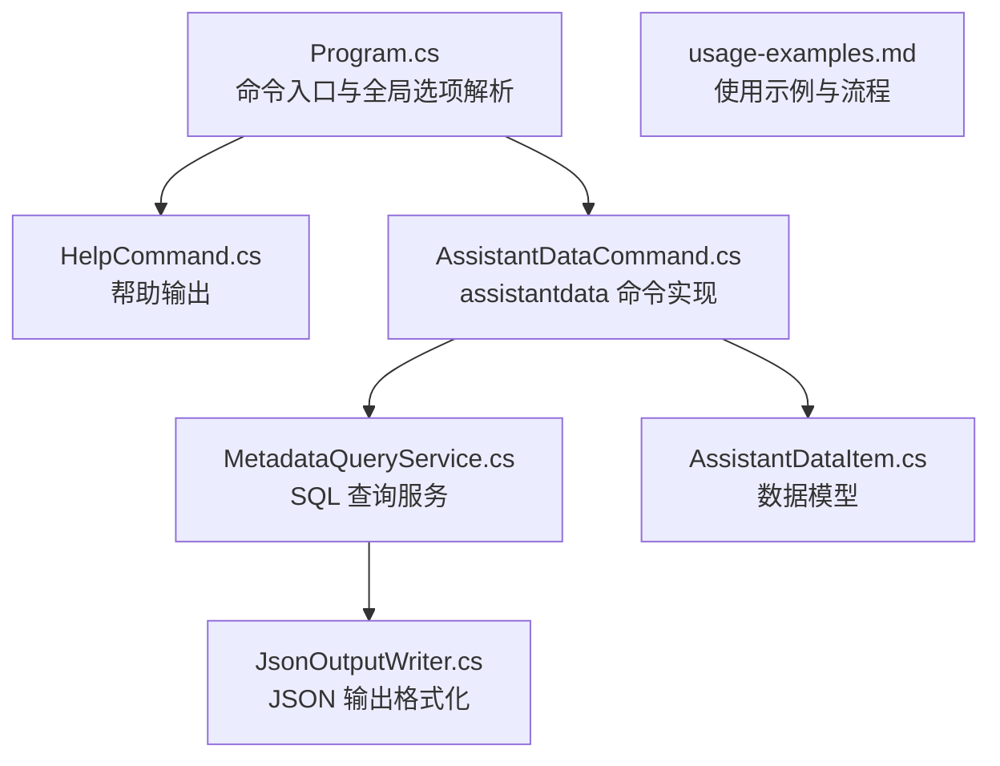
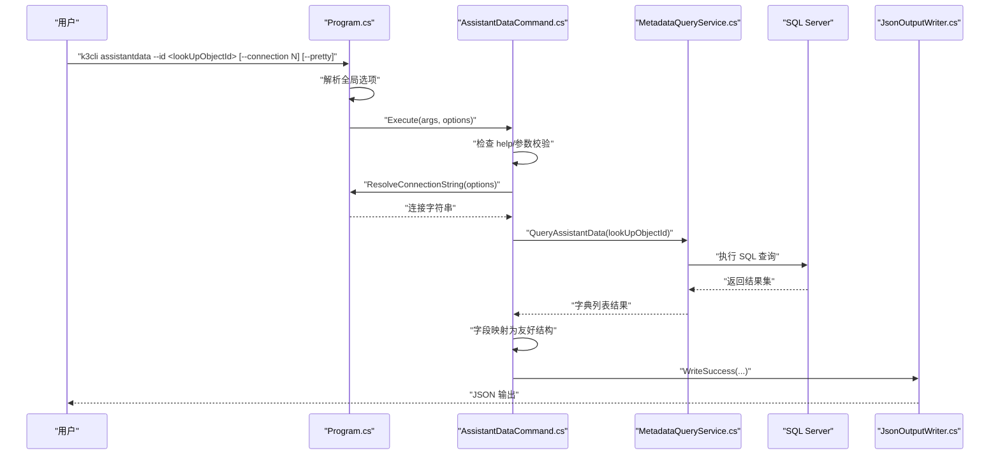
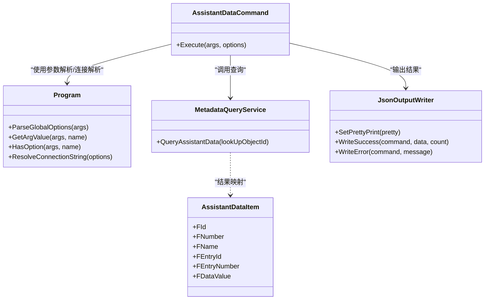

# assistantdata 命令

<cite>
**本文引用的文件**
- [AssistantDataCommand.cs](file://K3CloudDataDictionary.Cli/Commands/AssistantDataCommand.cs)
- [MetadataQueryService.cs](file://K3CloudDataDictionary.Cli/Services/MetadataQueryService.cs)
- [JsonOutputWriter.cs](file://K3CloudDataDictionary.Cli/Services/JsonOutputWriter.cs)
- [Program.cs](file://K3CloudDataDictionary.Cli/Program.cs)
- [HelpCommand.cs](file://K3CloudDataDictionary.Cli/Commands/HelpCommand.cs)
- [usage-examples.md](file://docs/usage-examples.md)
- [AssistantDataItem.cs](file://Models/AssistantDataItem.cs)
</cite>

## 目录
1. [简介](#简介)
2. [项目结构](#项目结构)
3. [核心组件](#核心组件)
4. [架构总览](#架构总览)
5. [详细组件分析](#详细组件分析)
6. [依赖关系分析](#依赖关系分析)
7. [性能考量](#性能考量)
8. [故障排查指南](#故障排查指南)
9. [结论](#结论)
10. [附录](#附录)

## 简介
assistantdata 命令用于查询“辅助资料”（辅助数据）的可选项列表。当字段的 elementType 为 30（辅助资料字段）时，该字段的可选值来源于某个“辅助资料对象”。通过该命令，可以基于 lookUpObject（即辅助资料对象 ID）查询该辅助资料的所有条目及其本地化显示名称、条目编码与数据值等信息，便于开发与运维人员快速理解系统中的辅助资料配置与取值范围。

## 项目结构
与 assistantdata 命令相关的核心文件组织如下：
- 命令入口与解析：Program.cs
- 助手命令帮助：HelpCommand.cs
- 命令实现：AssistantDataCommand.cs
- 查询服务：MetadataQueryService.cs
- 输出格式化：JsonOutputWriter.cs
- 数据模型：AssistantDataItem.cs
- 使用示例：usage-examples.md

图表来源
- [Program.cs:14-69](file://K3CloudDataDictionary.Cli/Program.cs#L14-L69)
- [HelpCommand.cs:204-217](file://K3CloudDataDictionary.Cli/Commands/HelpCommand.cs#L204-L217)
- [AssistantDataCommand.cs:13-62](file://K3CloudDataDictionary.Cli/Commands/AssistantDataCommand.cs#L13-L62)
- [MetadataQueryService.cs:636-679](file://K3CloudDataDictionary.Cli/Services/MetadataQueryService.cs#L636-L679)
- [JsonOutputWriter.cs:26-70](file://K3CloudDataDictionary.Cli/Services/JsonOutputWriter.cs#L26-L70)
- [AssistantDataItem.cs:6-56](file://Models/AssistantDataItem.cs#L6-L56)
- [usage-examples.md:234-276](file://docs/usage-examples.md#L234-L276)

章节来源
- [Program.cs:14-69](file://K3CloudDataDictionary.Cli/Program.cs#L14-L69)
- [AssistantDataCommand.cs:13-62](file://K3CloudDataDictionary.Cli/Commands/AssistantDataCommand.cs#L13-L62)
- [MetadataQueryService.cs:636-679](file://K3CloudDataDictionary.Cli/Services/MetadataQueryService.cs#L636-L679)
- [JsonOutputWriter.cs:26-70](file://K3CloudDataDictionary.Cli/Services/JsonOutputWriter.cs#L26-L70)
- [AssistantDataItem.cs:6-56](file://Models/AssistantDataItem.cs#L6-L56)
- [usage-examples.md:234-276](file://docs/usage-examples.md#L234-L276)

## 核心组件
- 命令入口与参数解析：Program.cs 负责解析全局选项（--connection/-c、--pretty）与分发到具体命令。
- 助手命令帮助：HelpCommand.cs 提供 assistantdata 的语法与示例帮助。
- 命令实现：AssistantDataCommand.cs 实现 assistantdata 的执行逻辑，包括参数校验、调用查询服务、结果转换与输出。
- 查询服务：MetadataQueryService.cs 提供直接连接 SQL Server 的查询能力，其中包含 QueryAssistantData 方法用于查询辅助资料。
- 输出格式化：JsonOutputWriter.cs 统一输出 JSON 结构，支持格式化打印。
- 数据模型：AssistantDataItem.cs 定义了辅助资料项的属性（用于 WPF 视图模型绑定，CLI 中也用于字段命名一致性）。

章节来源
- [Program.cs:74-97](file://K3CloudDataDictionary.Cli/Program.cs#L74-L97)
- [HelpCommand.cs:204-217](file://K3CloudDataDictionary.Cli/Commands/HelpCommand.cs#L204-L217)
- [AssistantDataCommand.cs:13-62](file://K3CloudDataDictionary.Cli/Commands/AssistantDataCommand.cs#L13-L62)
- [MetadataQueryService.cs:636-679](file://K3CloudDataDictionary.Cli/Services/MetadataQueryService.cs#L636-L679)
- [JsonOutputWriter.cs:26-70](file://K3CloudDataDictionary.Cli/Services/JsonOutputWriter.cs#L26-L70)
- [AssistantDataItem.cs:6-56](file://Models/AssistantDataItem.cs#L6-L56)

## 架构总览
assistantdata 命令的调用链路如下：
- CLI 入口解析参数与全局选项
- 校验 --id（lookUpObject）参数
- 解析连接字符串（SQLite 存储的连接配置）
- 调用 MetadataQueryService.QueryAssistantData 执行 SQL 查询
- 将结果转换为统一的输出结构
- 通过 JsonOutputWriter 输出 JSON

图表来源
- [Program.cs:14-69](file://K3CloudDataDictionary.Cli/Program.cs#L14-L69)
- [AssistantDataCommand.cs:13-62](file://K3CloudDataDictionary.Cli/Commands/AssistantDataCommand.cs#L13-L62)
- [MetadataQueryService.cs:636-679](file://K3CloudDataDictionary.Cli/Services/MetadataQueryService.cs#L636-L679)
- [JsonOutputWriter.cs:26-70](file://K3CloudDataDictionary.Cli/Services/JsonOutputWriter.cs#L26-L70)

## 详细组件分析

### 命令语法与参数
- 命令：assistantdata
- 必填参数：
  - --id <lookUpObjectId>：辅助资料对象 ID（即字段的 LookUpObject 值）
- 可选参数：
  - --connection/-c <id>：指定连接 ID（使用 SQLite 存储的连接配置）
  - --pretty：格式化 JSON 输出
- 帮助：k3cli assistantdata --help 或 k3cli help

章节来源
- [HelpCommand.cs:204-217](file://K3CloudDataDictionary.Cli/Commands/HelpCommand.cs#L204-L217)
- [Program.cs:74-97](file://K3CloudDataDictionary.Cli/Program.cs#L74-L97)

### 查询逻辑与数据过滤
- 参数校验：若未提供 --id 或传入 help/-h，则输出帮助并退出。
- 连接解析：优先使用 --connection 指定的连接；否则使用默认连接；均来自 SQLite 存储的连接配置。
- SQL 查询：根据 lookUpObjectId 查询辅助资料主表、本地化表、分录表与分录本地化表，返回主键、编码、名称、分录 ID/编码、数据值等字段。
- 结果转换：将底层字典结果映射为统一的输出字段（id、number、name、entryId、entryNumber、dataValue），便于消费端一致化处理。
- 错误处理：捕获异常并输出错误 JSON；正常成功输出包含 success=true、command、data、count 的结构。

章节来源
- [AssistantDataCommand.cs:13-62](file://K3CloudDataDictionary.Cli/Commands/AssistantDataCommand.cs#L13-L62)
- [MetadataQueryService.cs:636-679](file://K3CloudDataDictionary.Cli/Services/MetadataQueryService.cs#L636-L679)
- [JsonOutputWriter.cs:26-70](file://K3CloudDataDictionary.Cli/Services/JsonOutputWriter.cs#L26-L70)

### 结果展示格式
输出采用统一的 JSON 结构：
- success：布尔值，表示请求是否成功
- command：字符串，命令名称
- data：数组，每项包含 id、number、name、entryId、entryNumber、dataValue
- count：整数，data 数组长度

章节来源
- [JsonOutputWriter.cs:26-70](file://K3CloudDataDictionary.Cli/Services/JsonOutputWriter.cs#L26-L70)
- [AssistantDataCommand.cs:40-54](file://K3CloudDataDictionary.Cli/Commands/AssistantDataCommand.cs#L40-L54)

### 辅助资料的数据结构说明与业务含义
- 主表字段（T_BAS_ASSISTANTDATA）：
  - FID：辅助资料对象 ID（即 lookUpObject）
  - FNUMBER：辅助资料编码
- 本地化表（T_BAS_ASSISTANTDATA_L）：
  - FNAME：辅助资料名称（多语言）
- 分录表（T_BAS_ASSISTANTDATAENTRY）：
  - FENTRYID：分录 ID
  - FNUMBER：分录编码
- 分录本地化表（T_BAS_ASSISTANTDATAENTRY_L）：
  - FDATAVALUE：分录数据值（多语言）

业务含义：
- 辅助资料对象是一组可选项的集合，每个对象包含若干条目（entry），每条目有编码与本地化显示值。
- 当字段 elementType=30 时，该字段的可选值来自某个辅助资料对象，其 lookUpObject 即为该对象的 FID。
- 通过 assistantdata 命令，可以快速查看某辅助资料对象的所有条目及其本地化显示值，辅助前端选择器、校验规则与报表展示。

章节来源
- [MetadataQueryService.cs:645-671](file://K3CloudDataDictionary.Cli/Services/MetadataQueryService.cs#L645-L671)
- [usage-examples.md:234-276](file://docs/usage-examples.md#L234-L276)

### 使用示例
- 基本用法：k3cli assistantdata --id <lookUpObjectId>
- 格式化输出：k3cli assistantdata --id <lookUpObjectId> --pretty
- 指定连接：k3cli assistantdata --id <lookUpObjectId> --connection 1

章节来源
- [HelpCommand.cs:204-217](file://K3CloudDataDictionary.Cli/Commands/HelpCommand.cs#L204-L217)
- [usage-examples.md:250-276](file://docs/usage-examples.md#L250-L276)

## 依赖关系分析
- 命令层依赖：
  - AssistantDataCommand 依赖 Program（参数解析、连接解析）、JsonOutputWriter（输出格式化）、MetadataQueryService（查询服务）
- 查询服务依赖：
  - MetadataQueryService 依赖 SQL Server（直接查询），内部封装了连接字符串解析与 SQL 执行
- 输出层依赖：
  - JsonOutputWriter 提供统一的 JSON 输出结构，支持格式化

图表来源
- [Program.cs:74-97](file://K3CloudDataDictionary.Cli/Program.cs#L74-L97)
- [AssistantDataCommand.cs:13-62](file://K3CloudDataDictionary.Cli/Commands/AssistantDataCommand.cs#L13-L62)
- [MetadataQueryService.cs:636-679](file://K3CloudDataDictionary.Cli/Services/MetadataQueryService.cs#L636-L679)
- [JsonOutputWriter.cs:26-70](file://K3CloudDataDictionary.Cli/Services/JsonOutputWriter.cs#L26-L70)
- [AssistantDataItem.cs:6-56](file://Models/AssistantDataItem.cs#L6-L56)

## 性能考量
- SQL 查询：QueryAssistantData 为单表查询，使用主键过滤，性能主要受数据库响应时间影响。
- 结果映射：将底层字典映射为统一字段，开销较小。
- 输出格式化：--pretty 会增加序列化成本，建议在调试时使用。
- 连接管理：通过 SQLite 缓存连接配置，避免重复输入，提升交互效率。

## 故障排查指南
- 未提供 --id 参数：命令会输出错误并显示帮助。
- 连接失败或未设置默认连接：ResolveConnectionString 抛出异常，提示添加或指定连接。
- SQL 查询异常：捕获异常并输出错误 JSON，包含命令名与错误消息。
- 输出格式问题：确保正确使用 --pretty；必要时去掉以获得紧凑输出。

章节来源
- [AssistantDataCommand.cs:24-31](file://K3CloudDataDictionary.Cli/Commands/AssistantDataCommand.cs#L24-L31)
- [Program.cs:129-151](file://K3CloudDataDictionary.Cli/Program.cs#L129-L151)
- [AssistantDataCommand.cs:57-61](file://K3CloudDataDictionary.Cli/Commands/AssistantDataCommand.cs#L57-L61)
- [JsonOutputWriter.cs:58-70](file://K3CloudDataDictionary.Cli/Services/JsonOutputWriter.cs#L58-L70)

## 结论
assistantdata 命令提供了对“辅助资料”对象的快速查询能力，能够直观地展示辅助资料对象的条目编码、名称与本地化数据值，帮助开发者与运维人员准确理解字段取值来源与可选项范围。结合字段查询与对象解析命令，可形成完整的辅助资料关联查询闭环。

## 附录
- 相关命令与流程参考：使用示例文档中包含“查询辅助资料列表”的完整步骤与示例。

章节来源
- [usage-examples.md:234-276](file://docs/usage-examples.md#L234-L276)