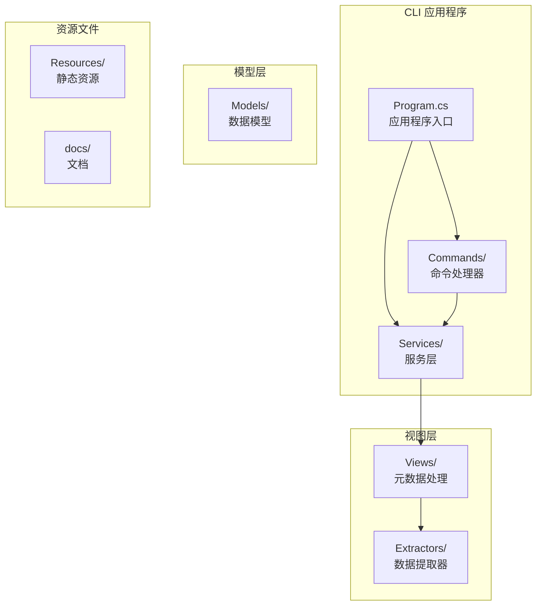
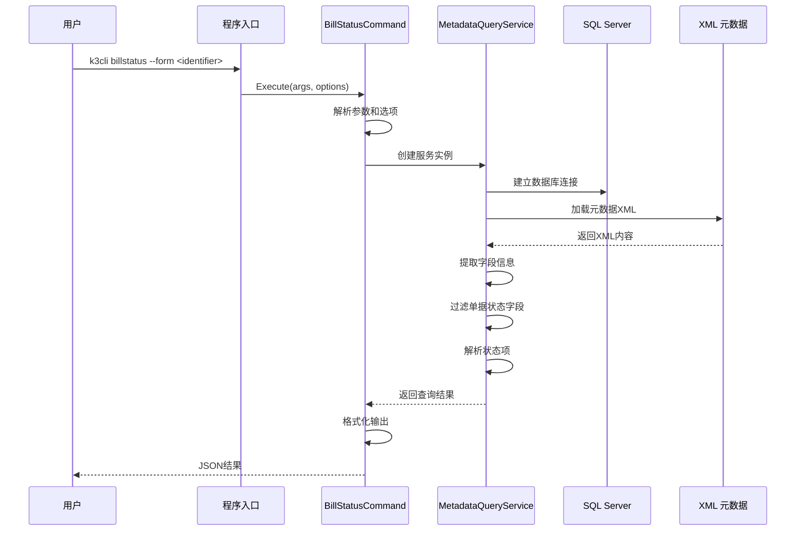
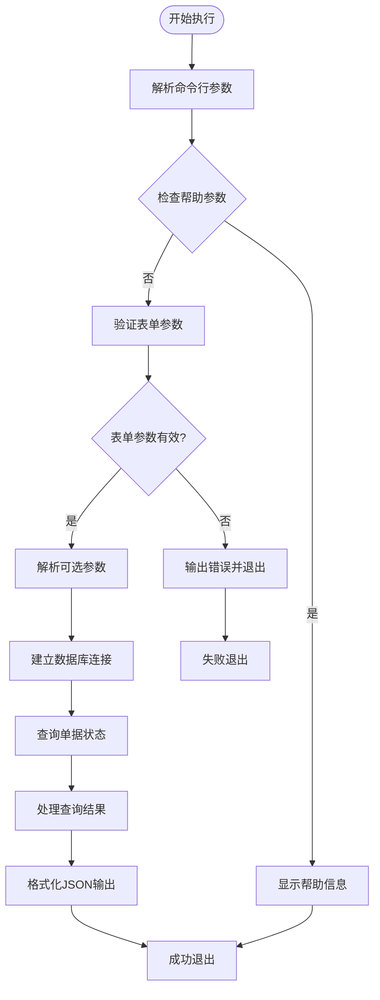
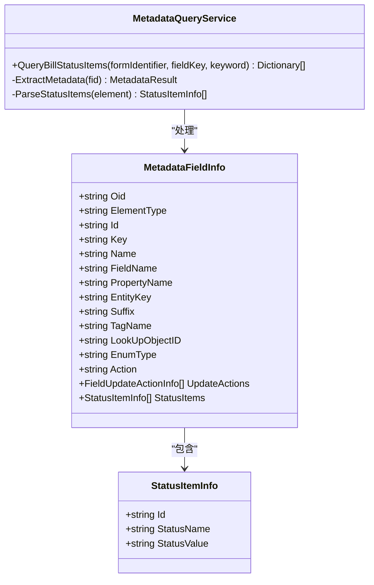
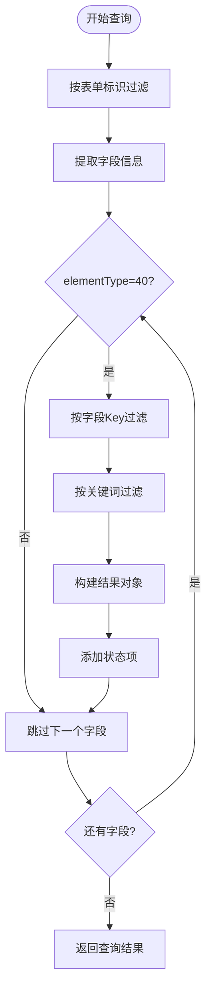
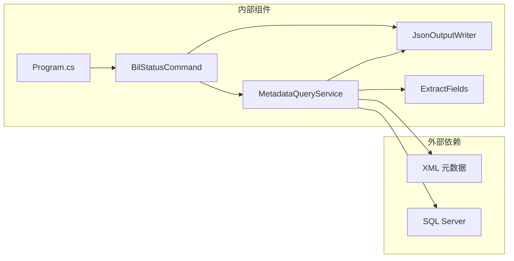

# billstatus 命令

<cite>
**本文档引用的文件**
- [BillStatusCommand.cs](file://K3CloudDataDictionary.Cli/Commands/BillStatusCommand.cs)
- [MetadataQueryService.cs](file://K3CloudDataDictionary.Cli/Services/MetadataQueryService.cs)
- [Program.cs](file://K3CloudDataDictionary.Cli/Program.cs)
- [HelpCommand.cs](file://K3CloudDataDictionary.Cli/Commands/HelpCommand.cs)
- [ExtractFields.cs](file://Views/ExtractFields.cs)
- [usage-examples.md](file://docs/usage-examples.md)
</cite>

## 目录
1. [简介](#简介)
2. [项目结构](#项目结构)
3. [核心组件](#核心组件)
4. [架构概览](#架构概览)
5. [详细组件分析](#详细组件分析)
6. [依赖关系分析](#依赖关系分析)
7. [性能考虑](#性能考虑)
8. [故障排除指南](#故障排除指南)
9. [结论](#结论)
10. [附录](#附录)

## 简介

billstatus 命令是 K3Cloud 数据字典 CLI 工具中的一个重要功能模块，专门用于查询单据状态字段的枚举值。该命令针对 elementType=40 的单据状态字段（BillStatusField），从 XML 元数据中提取状态信息，为用户提供完整的状态值列表和状态名称映射。

单据状态字段在 K3Cloud 系统中扮演着至关重要的角色，它定义了单据在整个生命周期中的各种状态，如"暂存"、"创建"、"已审核"、"已反审"、"重新审核"等。这些状态值通常存储在 XML 元数据中，而不是单独的数据库表中，因此需要特殊的处理方式来提取和展示。

## 项目结构

K3Cloud 数据字典 CLI 工具采用清晰的分层架构设计，主要包含以下核心目录结构：



**图表来源**
- [Program.cs:1-166](file://K3CloudDataDictionary.Cli/Program.cs#L1-L166)
- [BillStatusCommand.cs:1-81](file://K3CloudDataDictionary.Cli/Commands/BillStatusCommand.cs#L1-L81)

**章节来源**
- [Program.cs:14-69](file://K3CloudDataDictionary.Cli/Program.cs#L14-L69)

## 核心组件

### 命令执行器

billstatus 命令的核心执行器位于 `BillStatusCommand` 类中，负责处理命令行参数、调用服务层并格式化输出结果。

### 服务层

`MetadataQueryService` 是整个系统的核心服务，负责：
- 连接 SQL Server 数据库
- 加载元数据上下文
- 提取 XML 元数据
- 处理单据状态字段的查询逻辑

### 数据提取器

`ExtractFields` 类专门处理 XML 元数据中的字段信息，特别是单据状态字段的解析。

**章节来源**
- [BillStatusCommand.cs:11-81](file://K3CloudDataDictionary.Cli/Commands/BillStatusCommand.cs#L11-L81)
- [MetadataQueryService.cs:12-839](file://K3CloudDataDictionary.Cli/Services/MetadataQueryService.cs#L12-L839)
- [ExtractFields.cs:70-167](file://Views/ExtractFields.cs#L70-L167)

## 架构概览

billstatus 命令的架构采用了典型的三层架构模式，确保了良好的分离关注点和可维护性。



**图表来源**
- [Program.cs:43](file://K3CloudDataDictionary.Cli/Program.cs#L43)
- [BillStatusCommand.cs:13-78](file://K3CloudDataDictionary.Cli/Commands/BillStatusCommand.cs#L13-L78)
- [MetadataQueryService.cs:736-821](file://K3CloudDataDictionary.Cli/Services/MetadataQueryService.cs#L736-L821)

## 详细组件分析

### 命令执行流程

billstatus 命令的执行流程遵循标准的命令模式，具有完善的错误处理和参数验证机制。



**图表来源**
- [BillStatusCommand.cs:13-78](file://K3CloudDataDictionary.Cli/Commands/BillStatusCommand.cs#L13-L78)

### 单据状态字段处理

单据状态字段（elementType=40）的处理是整个系统的核心功能，涉及复杂的 XML 元数据解析和状态项提取。



**图表来源**
- [ExtractFields.cs:7-68](file://Views/ExtractFields.cs#L7-L68)
- [MetadataQueryService.cs:736-821](file://K3CloudDataDictionary.Cli/Services/MetadataQueryService.cs#L736-L821)

### 状态查询逻辑

状态查询逻辑实现了多层级的过滤和匹配机制，支持精确匹配和模糊搜索。



**图表来源**
- [MetadataQueryService.cs:756-811](file://K3CloudDataDictionary.Cli/Services/MetadataQueryService.cs#L756-L811)

**章节来源**
- [BillStatusCommand.cs:13-78](file://K3CloudDataDictionary.Cli/Commands/BillStatusCommand.cs#L13-L78)
- [MetadataQueryService.cs:736-821](file://K3CloudDataDictionary.Cli/Services/MetadataQueryService.cs#L736-L821)
- [ExtractFields.cs:137-151](file://Views/ExtractFields.cs#L137-L151)

## 依赖关系分析

billstatus 命令的依赖关系体现了清晰的分层架构和职责分离。



**图表来源**
- [Program.cs:3-6](file://K3CloudDataDictionary.Cli/Program.cs#L3-L6)
- [BillStatusCommand.cs:3-4](file://K3CloudDataDictionary.Cli/Commands/BillStatusCommand.cs#L3-L4)
- [MetadataQueryService.cs:1-6](file://K3CloudDataDictionary.Cli/Services/MetadataQueryService.cs#L1-L6)

### 关键依赖关系

1. **命令到服务的依赖**：BillStatusCommand 依赖 MetadataQueryService 进行数据查询
2. **服务到数据库的依赖**：MetadataQueryService 依赖 SQL Server 进行元数据查询
3. **服务到XML解析的依赖**：MetadataQueryService 依赖 ExtractFields 进行 XML 元数据解析
4. **输出格式化**：所有命令都依赖 JsonOutputWriter 进行统一的 JSON 格式化输出

**章节来源**
- [Program.cs:43](file://K3CloudDataDictionary.Cli/Program.cs#L43)
- [BillStatusCommand.cs:40](file://K3CloudDataDictionary.Cli/Commands/BillStatusCommand.cs#L40)
- [MetadataQueryService.cs:826-836](file://K3CloudDataDictionary.Cli/Services/MetadataQueryService.cs#L826-L836)

## 性能考虑

### 数据库连接优化

系统采用了连接池和懒加载策略来优化数据库连接性能：

- **连接池复用**：通过 SQLiteHelper 管理连接配置，避免重复创建连接
- **延迟初始化**：MetadataQueryService 在首次使用时才初始化元数据上下文
- **超时设置**：所有数据库操作设置了合理的超时时间（30-60秒）

### 元数据缓存策略

为了提高查询性能，系统实现了多层次的缓存机制：

- **上下文缓存**：MetadataContext 缓存所有对象的基础信息
- **XML 缓存**：批量加载 XML 元数据并缓存到内存中
- **元素类型名称缓存**：ElementType 名称映射缓存到内存中

### 查询优化

查询过程中的优化措施包括：

- **早期过滤**：在数据库层面就过滤掉不需要的数据
- **增量加载**：只加载必要的 XML 片段
- **结果集限制**：对搜索结果进行数量限制，避免内存溢出

## 故障排除指南

### 常见问题及解决方案

#### 1. 连接配置问题

**问题症状**：执行命令时报错，提示无法连接数据库

**解决方案**：
- 使用 `k3cli connections list` 查看现有连接配置
- 使用 `k3cli connections add` 添加新的数据库连接
- 确认连接字符串格式正确，包含服务器地址、数据库名、认证信息

#### 2. 表单标识无效

**问题症状**：提示找不到指定的表单标识

**解决方案**：
- 使用 `k3cli search --keyword "<表单名称>"` 搜索正确的表单标识
- 确认表单标识大小写正确
- 检查表单是否存在于目标数据库中

#### 3. 字段Key不存在

**问题症状**：指定的字段Key无法找到

**解决方案**：
- 使用 `k3cli fields --form <identifier>` 查看所有字段
- 确认字段Key的拼写和大小写
- 检查字段是否属于指定的表单

#### 4. 状态项为空

**问题症状**：查询结果显示没有状态项

**可能原因**：
- 指定的字段不是单据状态字段（elementType≠40）
- 字段配置中没有定义状态项
- XML 元数据中缺少状态配置

**解决方案**：
- 使用 `k3cli fields --form <identifier> --keyword "<字段名称>"` 确认字段类型
- 检查字段的 elementType 属性
- 验证 XML 元数据的完整性

**章节来源**
- [HelpCommand.cs:174-202](file://K3CloudDataDictionary.Cli/Commands/HelpCommand.cs#L174-L202)
- [BillStatusCommand.cs:25-31](file://K3CloudDataDictionary.Cli/Commands/BillStatusCommand.cs#L25-L31)

## 结论

billstatus 命令作为 K3Cloud 数据字典 CLI 工具的重要组成部分，提供了强大的单据状态字段查询能力。通过精心设计的架构和优化的性能策略，该命令能够高效地处理复杂的 XML 元数据解析任务，为用户提供准确、及时的单据状态信息。

该命令的主要优势包括：
- **精确的类型识别**：专门针对 elementType=40 的单据状态字段
- **灵活的查询机制**：支持表单级、字段级和关键词级的多层级查询
- **完整的状态信息**：提供状态值、状态名称等完整信息
- **友好的错误处理**：完善的参数验证和错误提示机制

随着 K3Cloud 系统的发展，billstatus 命令将继续发挥重要作用，帮助用户更好地理解和管理系统中的单据状态控制机制。

## 附录

### 命令语法参考

```bash
# 基本语法
k3cli billstatus [options]

# 常用示例
k3cli billstatus --form PUR_PurchaseOrder
k3cli billstatus --form PUR_PurchaseOrder --field FDocumentStatus
k3cli billstatus --form PUR_PurchaseOrder --keyword "已审核"
k3cli billstatus --form PUR_PurchaseOrder --pretty
```

### 参数说明

| 参数 | 必需 | 描述 | 示例 |
|------|------|------|------|
| `--form` | 是 | 表单标识符 | `--form PUR_PurchaseOrder` |
| `--field` | 否 | 字段Key（精确匹配） | `--field FDocumentStatus` |
| `--keyword` | 否 | 搜索关键词（模糊匹配） | `--keyword "已审核"` |
| `--connection` | 否 | 指定连接ID | `--connection 1` |
| `--pretty` | 否 | 格式化JSON输出 | `--pretty` |

### 结果格式

查询结果采用标准化的 JSON 格式，包含以下主要字段：

```json
{
  "success": true,
  "command": "billstatus",
  "data": [
    {
      "formId": "PUR_PurchaseOrder",
      "formName": "采购订单",
      "entityName": "基本信息",
      "table": "t_PUR_POOrder",
      "fieldKey": "FDocumentStatus",
      "fieldName": "单据状态",
      "dbFieldName": "FDOCUMENTSTATUS",
      "propertyName": "DocumentStatus",
      "elementType": "40",
      "elementTypeName": "BillStatusField",
      "statusItems": [
        {
          "value": "Z",
          "name": "暂存"
        },
        {
          "value": "A",
          "name": "创建"
        }
      ]
    }
  ],
  "count": 1
}
```

### 状态枚举值参考

常见的单据状态值包括：
- `Z` - 暂存（Draft）
- `A` - 创建（Created）
- `B` - 已审核（Approved）
- `C` - 已反审（Reversed）
- `D` - 重新审核（Reapproved）

这些状态值代表了单据在生命周期中的不同阶段，具体的含义可能因业务需求而有所不同。

**章节来源**
- [usage-examples.md:453-513](file://docs/usage-examples.md#L453-L513)
- [HelpCommand.cs:174-202](file://K3CloudDataDictionary.Cli/Commands/HelpCommand.cs#L174-L202)