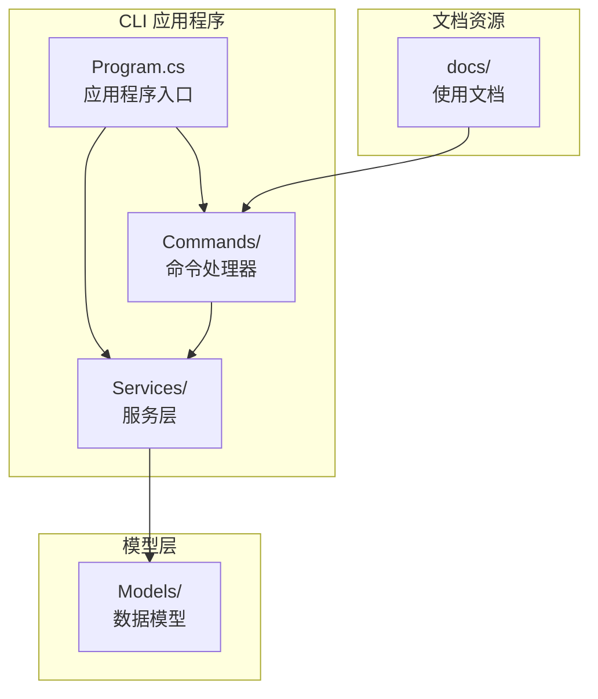
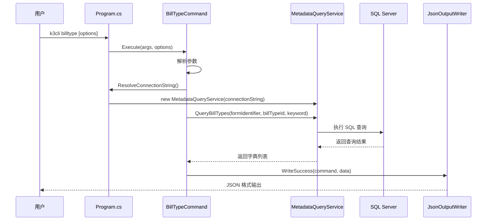
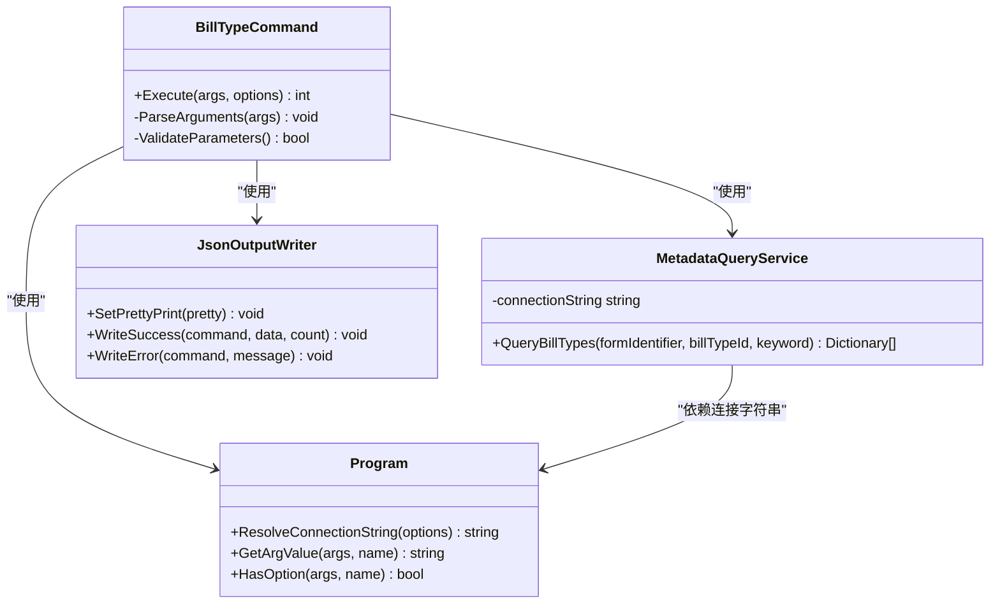

# billtype 命令

<cite>
**本文档引用的文件**
- [BillTypeCommand.cs](file://K3CloudDataDictionary.Cli/Commands/BillTypeCommand.cs)
- [MetadataQueryService.cs](file://K3CloudDataDictionary.Cli/Services/MetadataQueryService.cs)
- [HelpCommand.cs](file://K3CloudDataDictionary.Cli/Commands/HelpCommand.cs)
- [Program.cs](file://K3CloudDataDictionary.Cli/Program.cs)
- [JsonOutputWriter.cs](file://K3CloudDataDictionary.Cli/Services/JsonOutputWriter.cs)
- [usage-examples.md](file://docs/usage-examples.md)
- [BillTypeInfo.cs](file://Models/BillTypeInfo.cs)
</cite>

## 目录
1. [简介](#简介)
2. [项目结构](#项目结构)
3. [核心组件](#核心组件)
4. [架构概览](#架构概览)
5. [详细组件分析](#详细组件分析)
6. [依赖关系分析](#依赖关系分析)
7. [性能考虑](#性能考虑)
8. [故障排除指南](#故障排除指南)
9. [结论](#结论)

## 简介

billtype 命令是 K3Cloud 数据字典 CLI 工具中的一个重要功能模块，专门用于查询和管理单据类型信息。该命令支持三种查询模式：按表单查询单据类型列表、按 ID 精确查询单据类型详情、按关键词模糊搜索单据类型。

单据类型（Bill Type）是 K3Cloud 系统中的核心概念，代表具体的业务单据类别，如采购订单、销售订单、委外订单等。每个单据类型都有唯一的标识符、编码、名称和描述信息，并与特定的表单（Form）相关联。

## 项目结构

K3Cloud 数据字典 CLI 工具采用分层架构设计，主要包含以下核心目录结构：



**图表来源**
- [Program.cs:1-166](file://K3CloudDataDictionary.Cli/Program.cs#L1-L166)
- [BillTypeCommand.cs:1-66](file://K3CloudDataDictionary.Cli/Commands/BillTypeCommand.cs#L1-L66)

**章节来源**
- [Program.cs:1-166](file://K3CloudDataDictionary.Cli/Program.cs#L1-L166)

## 核心组件

### 命令执行器

billtype 命令的核心执行逻辑由 `BillTypeCommand` 类实现，该类提供了静态的 `Execute` 方法来处理命令请求。

### 查询服务

`MetadataQueryService` 类负责实际的数据库查询操作，实现了 `QueryBillTypes` 方法来获取单据类型信息。

### 输出格式化

`JsonOutputWriter` 类提供统一的 JSON 输出格式化功能，确保命令行输出的一致性和可读性。

**章节来源**
- [BillTypeCommand.cs:11-66](file://K3CloudDataDictionary.Cli/Commands/BillTypeCommand.cs#L11-L66)
- [MetadataQueryService.cs:563-630](file://K3CloudDataDictionary.Cli/Services/MetadataQueryService.cs#L563-L630)
- [JsonOutputWriter.cs:11-91](file://K3CloudDataDictionary.Cli/Services/JsonOutputWriter.cs#L11-L91)

## 架构概览

billtype 命令的执行架构遵循典型的三层架构模式：



**图表来源**
- [Program.cs:14-69](file://K3CloudDataDictionary.Cli/Program.cs#L14-L69)
- [BillTypeCommand.cs:13-63](file://K3CloudDataDictionary.Cli/Commands/BillTypeCommand.cs#L13-L63)
- [MetadataQueryService.cs:569-629](file://K3CloudDataDictionary.Cli/Services/MetadataQueryService.cs#L569-L629)

## 详细组件分析

### 命令语法和参数

#### 基本语法
```
k3cli billtype [options]
```

#### 参数说明

| 参数 | 类型 | 必需 | 描述 | 示例 |
|------|------|------|------|------|
| `--form` | 标识符 | 否 | 表单标识符，按表单查询单据类型列表 | `--form PUR_PurchaseOrder` |
| `--id` | ID | 否 | 单据类型 ID，精确查询 | `--id 83d822ca3e374b4ab01e5dd46a0062bd` |
| `--keyword` | 关键词 | 否 | 搜索关键词，模糊搜索编码、名称、描述 | `--keyword "采购"` |
| `--connection` | 连接ID | 否 | 指定数据库连接ID | `--connection 1` |
| `-c` | 连接ID | 否 | 简短形式的连接参数 | `-c 1` |
| `--pretty` | 标志 | 否 | 格式化JSON输出 | `--pretty` |

#### 参数验证规则

命令要求至少指定以下三个参数中的一个：
- `--form` 参数
- `--id` 参数  
- `--keyword` 参数

如果未提供任何有效参数，命令会返回错误并显示帮助信息。

**章节来源**
- [HelpCommand.cs:142-172](file://K3CloudDataDictionary.Cli/Commands/HelpCommand.cs#L142-L172)
- [BillTypeCommand.cs:29-34](file://K3CloudDataDictionary.Cli/Commands/BillTypeCommand.cs#L29-L34)

### 查询模式详解

#### 模式一：按表单查询单据类型列表

当提供 `--form` 参数时，命令会查询指定表单关联的所有单据类型。

**SQL 查询逻辑**：
```sql
SELECT a.FBILLTYPEID, a.FBILLFORMID, a.FNUMBER, b.FNAME, b.FDESCRIPTION
FROM T_BAS_BILLTYPE a
LEFT JOIN T_BAS_BILLTYPE_L b ON a.FBILLTYPEID = b.FBILLTYPEID AND b.FLOCALEID = 2052
WHERE a.FBILLFORMID = @FormIdentifier
ORDER BY a.FNUMBER
```

#### 模式二：按 ID 精确查询单据类型详情

当提供 `--id` 参数时，命令会返回指定单据类型的详细信息。

**SQL 查询逻辑**：
```sql
SELECT a.FBILLTYPEID, a.FBILLFORMID, a.FNUMBER, b.FNAME, b.FDESCRIPTION
FROM T_BAS_BILLTYPE a
LEFT JOIN T_BAS_BILLTYPE_L b ON a.FBILLTYPEID = b.FBILLTYPEID AND b.FLOCALEID = 2052
WHERE a.FBILLTYPEID = @BillTypeId
ORDER BY a.FNUMBER
```

#### 模式三：按关键词模糊搜索

当提供 `--keyword` 参数时，命令会在编码、名称、描述中进行模糊搜索。

**SQL 查询逻辑**：
```sql
SELECT a.FBILLTYPEID, a.FBILLFORMID, a.FNUMBER, b.FNAME, b.FDESCRIPTION
FROM T_BAS_BILLTYPE a
LEFT JOIN T_BAS_BILLTYPE_L b ON a.FBILLTYPEID = b.FBILLTYPEID AND b.FLOCALEID = 2052
WHERE (a.FNUMBER LIKE @Keyword OR b.FNAME LIKE @Keyword OR b.FDESCRIPTION LIKE @Keyword)
ORDER BY a.FNUMBER
```

**章节来源**
- [MetadataQueryService.cs:569-629](file://K3CloudDataDictionary.Cli/Services/MetadataQueryService.cs#L569-L629)

### 结果数据结构

查询结果返回标准化的 JSON 格式，包含以下字段：

| 字段名 | 类型 | 描述 | 示例值 |
|--------|------|------|--------|
| `billTypeId` | string | 单据类型唯一标识符 | `"83d822ca3e374b4ab01e5dd46a0062bd"` |
| `billFormId` | string | 关联的表单标识符 | `"PUR_PurchaseOrder"` |
| `number` | string | 单据类型编码 | `"CGDD01_SYS"` |
| `name` | string | 单据类型名称 | `"采购订单"` |
| `description` | string | 单据类型描述 | `"标准采购订单的单据类型"` |

**章节来源**
- [BillTypeCommand.cs:42-53](file://K3CloudDataDictionary.Cli/Commands/BillTypeCommand.cs#L42-L53)

### 错误处理机制

命令实现了完善的错误处理机制：

1. **参数验证错误**：当缺少必需参数时，返回错误信息并显示帮助
2. **数据库连接错误**：捕获 SQL 连接异常并返回详细错误信息
3. **查询执行错误**：处理 SQL 查询过程中的各种异常情况
4. **输出格式化错误**：确保 JSON 输出的正确性和一致性

**章节来源**
- [BillTypeCommand.cs:58-62](file://K3CloudDataDictionary.Cli/Commands/BillTypeCommand.cs#L58-L62)
- [JsonOutputWriter.cs:58-70](file://K3CloudDataDictionary.Cli/Services/JsonOutputWriter.cs#L58-L70)

## 依赖关系分析

### 组件依赖图



**图表来源**
- [BillTypeCommand.cs:11-66](file://K3CloudDataDictionary.Cli/Commands/BillTypeCommand.cs#L11-L66)
- [MetadataQueryService.cs:12-22](file://K3CloudDataDictionary.Cli/Services/MetadataQueryService.cs#L12-L22)
- [JsonOutputWriter.cs:11-91](file://K3CloudDataDictionary.Cli/Services/JsonOutputWriter.cs#L11-L91)
- [Program.cs:12-152](file://K3CloudDataDictionary.Cli/Program.cs#L12-L152)

### 外部依赖

1. **SQL Server 数据库**：直接连接 K3Cloud 系统数据库
2. **Newtonsoft.Json 库**：用于 JSON 格式化和序列化
3. **SQLite 数据库**：存储连接配置信息

**章节来源**
- [MetadataQueryService.cs:1-8](file://K3CloudDataDictionary.Cli/Services/MetadataQueryService.cs#L1-L8)
- [JsonOutputWriter.cs:1-5](file://K3CloudDataDictionary.Cli/Services/JsonOutputWriter.cs#L1-L5)

## 性能考虑

### 查询优化策略

1. **索引利用**：查询语句针对 `FBILLTYPEID`、`FBILLFORMID`、`FNUMBER` 字段进行了适当的索引利用
2. **参数化查询**：使用参数化 SQL 防止 SQL 注入攻击
3. **连接池管理**：通过 `SqlConnection` 自动管理连接生命周期
4. **超时控制**：设置合理的命令超时时间（30秒）

### 内存使用优化

1. **流式处理**：使用 `SqlDataReader` 进行流式数据读取
2. **延迟加载**：元数据上下文采用懒加载策略
3. **对象复用**：重用 `SqlCommand` 和 `SqlConnection` 对象

## 故障排除指南

### 常见问题及解决方案

#### 1. 连接配置问题

**问题症状**：命令执行时报连接错误
**解决方案**：
- 使用 `k3cli connections list` 查看现有连接
- 使用 `k3cli connections add` 添加新的数据库连接
- 使用 `--connection` 参数指定正确的连接ID

#### 2. 参数缺失错误

**问题症状**：返回 "缺少参数" 错误
**解决方案**：
- 确保至少提供 `--form`、`--id` 或 `--keyword` 中的一个参数
- 检查参数格式是否正确

#### 3. 查询无结果

**问题症状**：查询返回空结果集
**解决方案**：
- 验证表单标识符是否正确
- 检查单据类型ID是否存在
- 尝试使用不同的关键词进行模糊搜索

#### 4. JSON 输出格式问题

**问题症状**：输出格式不符合预期
**解决方案**：
- 使用 `--pretty` 参数获取格式化的 JSON 输出
- 检查终端编码设置

**章节来源**
- [Program.cs:129-151](file://K3CloudDataDictionary.Cli/Program.cs#L129-L151)
- [HelpCommand.cs:142-172](file://K3CloudDataDictionary.Cli/Commands/HelpCommand.cs#L142-L172)

## 结论

billtype 命令为 K3Cloud 系统提供了强大而灵活的单据类型查询功能。通过三种不同的查询模式，用户可以快速定位所需的单据类型信息。命令的设计充分考虑了易用性、性能和可靠性，是 K3Cloud 数据字典工具的重要组成部分。

该命令不仅满足了基本的查询需求，还为后续的单据状态查询、辅助资料查询等功能奠定了基础，形成了完整的 K3Cloud 元数据查询生态系统。

通过本文档的详细说明，用户可以充分利用 billtype 命令的各项功能，提高 K3Cloud 系统的使用效率和开发体验。