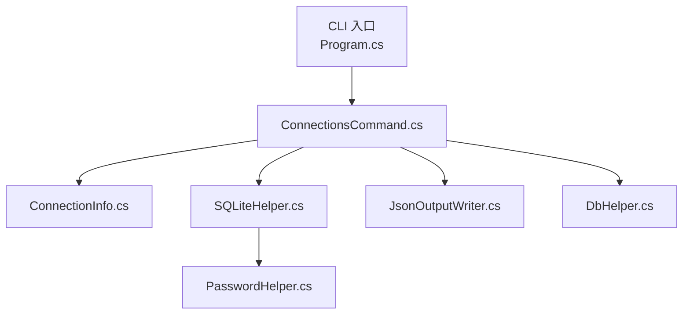
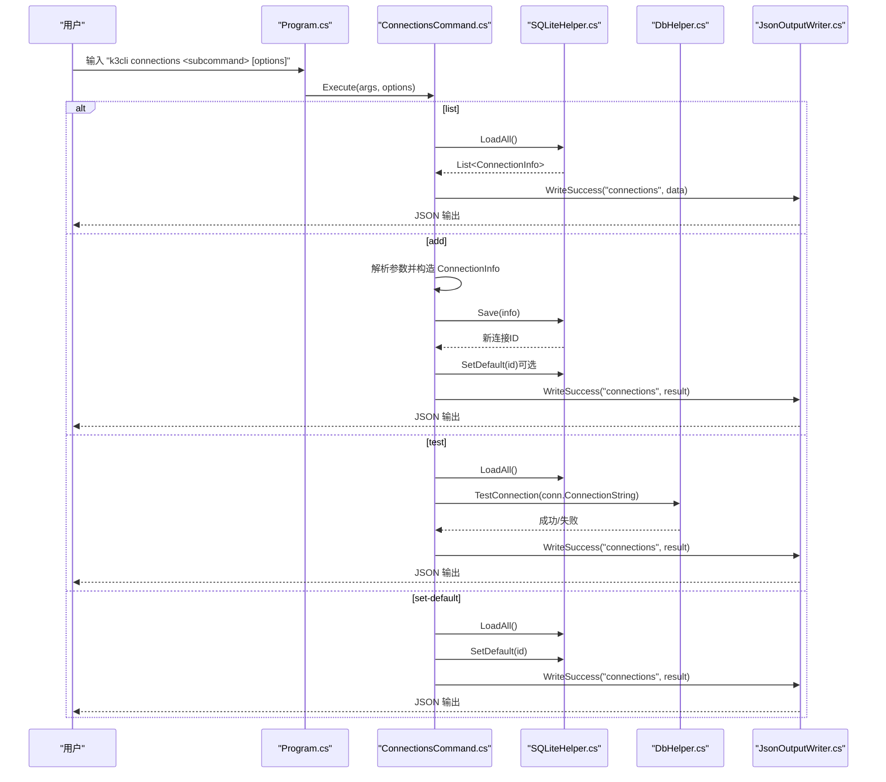
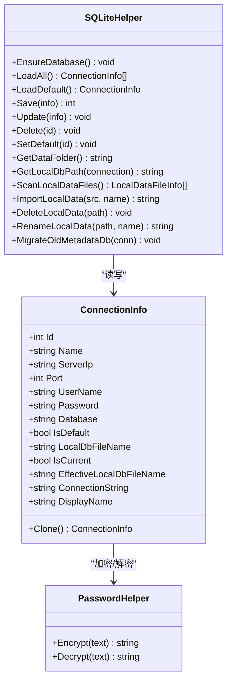
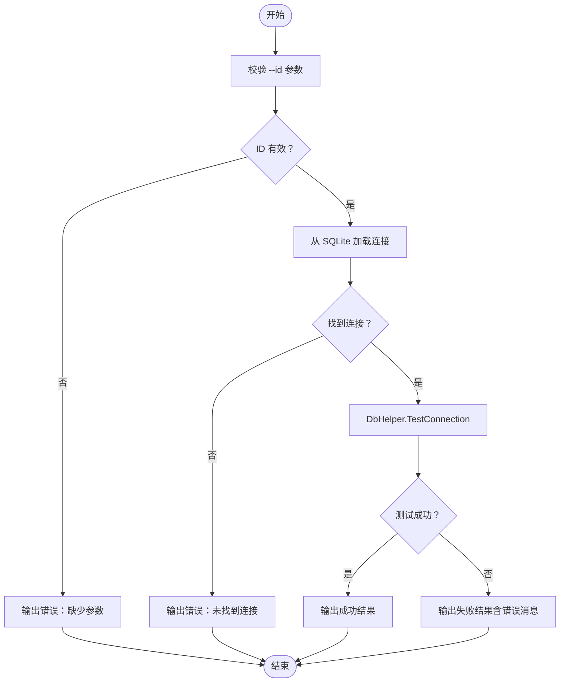
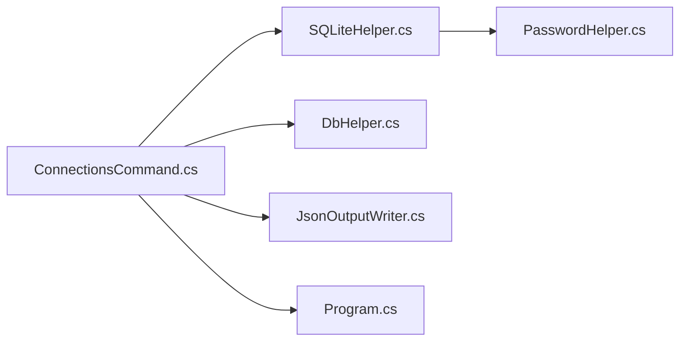

# connections 命令

<cite>
**本文引用的文件**
- [ConnectionsCommand.cs](file://K3CloudDataDictionary.Cli/Commands/ConnectionsCommand.cs)
- [ConnectionInfo.cs](file://Models/ConnectionInfo.cs)
- [SQLiteHelper.cs](file://Helpers/SQLiteHelper.cs)
- [DbHelper.cs](file://Helpers/DbHelper.cs)
- [PasswordHelper.cs](file://Helpers/PasswordHelper.cs)
- [JsonOutputWriter.cs](file://K3CloudDataDictionary.Cli/Services/JsonOutputWriter.cs)
- [Program.cs](file://K3CloudDataDictionary.Cli/Program.cs)
- [HelpCommand.cs](file://K3CloudDataDictionary.Cli/Commands/HelpCommand.cs)
</cite>

## 目录
1. [简介](#简介)
2. [项目结构](#项目结构)
3. [核心组件](#核心组件)
4. [架构总览](#架构总览)
5. [详细组件分析](#详细组件分析)
6. [依赖关系分析](#依赖关系分析)
7. [性能考量](#性能考量)
8. [故障排查指南](#故障排查指南)
9. [结论](#结论)
10. [附录](#附录)

## 简介
connections 命令用于管理本地存储的数据库连接信息，支持查看、添加、测试连接以及设置默认连接。它基于 SQLite 存储连接配置，并对密码进行本地加密保护；通过统一的 JSON 输出格式返回结果，便于脚本化集成与自动化处理。

## 项目结构
connections 命令位于 CLI 层，围绕以下核心模块协作：
- 命令层：解析参数、分发子命令、调用服务与输出格式化
- 数据模型：连接信息实体及显示属性
- 数据访问：SQLiteHelper 负责连接配置的持久化与默认连接标记
- 加密工具：PasswordHelper 提供本地加密/解密
- 连接测试：DbHelper 提供连接可用性检测
- 输出格式：JsonOutputWriter 统一输出结构

图表来源
- [Program.cs:14-69](file://K3CloudDataDictionary.Cli/Program.cs#L14-L69)
- [ConnectionsCommand.cs:15-43](file://K3CloudDataDictionary.Cli/Commands/ConnectionsCommand.cs#L15-L43)
- [ConnectionInfo.cs:6-144](file://Models/ConnectionInfo.cs#L6-L144)
- [SQLiteHelper.cs:10-370](file://Helpers/SQLiteHelper.cs#L10-L370)
- [DbHelper.cs:7-70](file://Helpers/DbHelper.cs#L7-L70)
- [PasswordHelper.cs:7-46](file://Helpers/PasswordHelper.cs#L7-L46)
- [JsonOutputWriter.cs:11-91](file://K3CloudDataDictionary.Cli/Services/JsonOutputWriter.cs#L11-L91)

章节来源
- [Program.cs:14-69](file://K3CloudDataDictionary.Cli/Program.cs#L14-L69)
- [ConnectionsCommand.cs:15-43](file://K3CloudDataDictionary.Cli/Commands/ConnectionsCommand.cs#L15-L43)

## 核心组件
- 命令入口与分发：ConnectionsCommand.Execute 根据子命令分发到 list/add/test/set-default
- 连接模型：ConnectionInfo 提供连接属性、显示名、连接串与克隆能力
- 数据持久化：SQLiteHelper 负责建表、增删改查、设置默认连接、扫描本地数据文件
- 密码保护：PasswordHelper 使用 Windows DPAPI 对密码进行本地加解密
- 连接测试：DbHelper.TestConnection 使用 SqlConnection 验证连接可用性
- 输出格式：JsonOutputWriter 统一 success/error 结构，支持缩进格式化

章节来源
- [ConnectionsCommand.cs:45-228](file://K3CloudDataDictionary.Cli/Commands/ConnectionsCommand.cs#L45-L228)
- [ConnectionInfo.cs:6-144](file://Models/ConnectionInfo.cs#L6-L144)
- [SQLiteHelper.cs:17-196](file://Helpers/SQLiteHelper.cs#L17-L196)
- [PasswordHelper.cs:7-46](file://Helpers/PasswordHelper.cs#L7-L46)
- [DbHelper.cs:9-25](file://Helpers/DbHelper.cs#L9-L25)
- [JsonOutputWriter.cs:26-80](file://K3CloudDataDictionary.Cli/Services/JsonOutputWriter.cs#L26-L80)

## 架构总览
connections 命令的控制流如下：
- CLI 入口解析全局选项与子命令
- 分发到具体子命令函数
- 读取/写入 SQLite 数据库
- 必要时调用 DbHelper 进行连接测试
- 使用 JsonOutputWriter 输出统一格式的结果

图表来源
- [Program.cs:51-52](file://K3CloudDataDictionary.Cli/Program.cs#L51-L52)
- [ConnectionsCommand.cs:15-43](file://K3CloudDataDictionary.Cli/Commands/ConnectionsCommand.cs#L15-L43)
- [ConnectionsCommand.cs:45-74](file://K3CloudDataDictionary.Cli/Commands/ConnectionsCommand.cs#L45-L74)
- [ConnectionsCommand.cs:76-131](file://K3CloudDataDictionary.Cli/Commands/ConnectionsCommand.cs#L76-L131)
- [ConnectionsCommand.cs:173-228](file://K3CloudDataDictionary.Cli/Commands/ConnectionsCommand.cs#L173-L228)
- [ConnectionsCommand.cs:133-171](file://K3CloudDataDictionary.Cli/Commands/ConnectionsCommand.cs#L133-L171)
- [SQLiteHelper.cs:55-196](file://Helpers/SQLiteHelper.cs#L55-L196)
- [DbHelper.cs:9-25](file://Helpers/DbHelper.cs#L9-L25)
- [JsonOutputWriter.cs:26-80](file://K3CloudDataDictionary.Cli/Services/JsonOutputWriter.cs#L26-L80)

## 详细组件分析

### 命令语法与参数
- 通用语法
  - k3cli connections <subcommand> [options]
- 子命令
  - list：列出所有连接
  - add：添加新连接
  - test --id <id>：测试指定连接
  - set-default --id <id>：设为默认连接
- add 专用参数
  - --server <ip>：SQL Server 地址（必填）
  - --port <port>：端口，默认 1433
  - --db <database>：数据库名（必填）
  - --user <username>：用户名（必填）
  - --password <password>：密码（可选）
  - --name <name>：连接名称（可选，默认使用数据库名）
  - --default：同时设为默认连接
- test/set-default 专用参数
  - --id <id>：连接 ID（必填）

章节来源
- [HelpCommand.cs:259-284](file://K3CloudDataDictionary.Cli/Commands/HelpCommand.cs#L259-L284)
- [ConnectionsCommand.cs:76-131](file://K3CloudDataDictionary.Cli/Commands/ConnectionsCommand.cs#L76-L131)
- [ConnectionsCommand.cs:133-171](file://K3CloudDataDictionary.Cli/Commands/ConnectionsCommand.cs#L133-L171)
- [ConnectionsCommand.cs:173-228](file://K3CloudDataDictionary.Cli/Commands/ConnectionsCommand.cs#L173-L228)

### 连接管理逻辑
- list
  - 从 SQLite 加载全部连接，组装输出字段（id、name、server、database、user、isDefault、displayName）
  - 使用 JsonOutputWriter.WriteSuccess 输出
- add
  - 校验必填参数（server/db/user）
  - 构造 ConnectionInfo，缺省端口 1433，密码为空字符串
  - 保存到 SQLite 并返回新 ID
  - 若指定 --default，则更新默认标记
  - 输出包含新增连接的详细信息
- test
  - 校验 --id 参数有效性
  - 从 SQLite 加载目标连接
  - 使用 DbHelper.TestConnection 测试连接
  - 输出包含连接 ID、名称、服务器、数据库、成功标志与消息
- set-default
  - 校验 --id 参数有效性
  - 从 SQLite 加载目标连接
  - 清除现有默认标记后设置新默认连接
  - 输出包含连接 ID、名称、数据库、isDefault 与消息

章节来源
- [ConnectionsCommand.cs:45-74](file://K3CloudDataDictionary.Cli/Commands/ConnectionsCommand.cs#L45-L74)
- [ConnectionsCommand.cs:76-131](file://K3CloudDataDictionary.Cli/Commands/ConnectionsCommand.cs#L76-L131)
- [ConnectionsCommand.cs:173-228](file://K3CloudDataDictionary.Cli/Commands/ConnectionsCommand.cs#L173-L228)
- [ConnectionsCommand.cs:133-171](file://K3CloudDataDictionary.Cli/Commands/ConnectionsCommand.cs#L133-L171)

### 配置验证与结果格式
- 配置验证
  - add：必须提供 server、db、user；port 缺省为 1433；password 缺省为空字符串
  - test/set-default：必须提供有效整数型 --id
  - 未找到连接时返回错误信息
- 结果格式
  - 统一 JSON 结构：success、command、data/count 或 error
  - list：data 为连接数组，每项包含 id、name、server、database、user、isDefault、displayName
  - add：data 包含 id、name、server、database、user、isDefault、message
  - test：data 包含 connectionId、name、server、database、success、message
  - set-default：data 包含 id、name、database、isDefault、message
  - 错误：error 字段包含错误信息

章节来源
- [ConnectionsCommand.cs:86-90](file://K3CloudDataDictionary.Cli/Commands/ConnectionsCommand.cs#L86-L90)
- [ConnectionsCommand.cs:175-180](file://K3CloudDataDictionary.Cli/Commands/ConnectionsCommand.cs#L175-L180)
- [ConnectionsCommand.cs:135-140](file://K3CloudDataDictionary.Cli/Commands/ConnectionsCommand.cs#L135-L140)
- [JsonOutputWriter.cs:26-80](file://K3CloudDataDictionary.Cli/Services/JsonOutputWriter.cs#L26-L80)

### 数据模型与持久化
- ConnectionInfo
  - 属性：Id、Name、ServerIp、Port、UserName、Password、Database、IsDefault、LocalDbFileName、IsCurrent
  - 计算属性：EffectiveLocalDbFileName、ConnectionString、DisplayName
  - 方法：Clone
- SQLiteHelper
  - 初始化：EnsureDatabase 创建 data/connections.db 与 Connections 表
  - CRUD：LoadAll、LoadDefault、Save、Update、Delete
  - 默认连接：SetDefault、ClearDefaultFlag
  - 本地数据文件：ScanLocalDataFiles、ImportLocalData、DeleteLocalData、RenameLocalData、MigrateOldMetadataDb
- PasswordHelper
  - Encrypt/Decrypt 使用 Windows DPAPI，作用域 CurrentUser

图表来源
- [ConnectionInfo.cs:6-144](file://Models/ConnectionInfo.cs#L6-L144)
- [SQLiteHelper.cs:17-196](file://Helpers/SQLiteHelper.cs#L17-L196)
- [PasswordHelper.cs:7-46](file://Helpers/PasswordHelper.cs#L7-L46)

章节来源
- [ConnectionInfo.cs:6-144](file://Models/ConnectionInfo.cs#L6-L144)
- [SQLiteHelper.cs:17-196](file://Helpers/SQLiteHelper.cs#L17-L196)
- [PasswordHelper.cs:7-46](file://Helpers/PasswordHelper.cs#L7-L46)

### 连接测试流程
- 参数校验：确保 --id 存在且为整数
- 加载连接：从 SQLite 获取目标连接
- 连接测试：使用 SqlConnection 打开连接，捕获异常并返回错误消息
- 输出：success=true/false，包含连接信息与 message

图表来源
- [ConnectionsCommand.cs:173-228](file://K3CloudDataDictionary.Cli/Commands/ConnectionsCommand.cs#L173-L228)
- [DbHelper.cs:9-25](file://Helpers/DbHelper.cs#L9-L25)

章节来源
- [ConnectionsCommand.cs:173-228](file://K3CloudDataDictionary.Cli/Commands/ConnectionsCommand.cs#L173-L228)
- [DbHelper.cs:9-25](file://Helpers/DbHelper.cs#L9-L25)

### 使用示例
- 查看所有连接
  - k3cli connections list
- 添加连接并设为默认
  - k3cli connections add --server 192.168.1.100 --db AISC001 --user sa --password xxx --default
- 测试连接
  - k3cli connections test --id 1
- 设为默认连接
  - k3cli connections set-default --id 1

章节来源
- [HelpCommand.cs:278-283](file://K3CloudDataDictionary.Cli/Commands/HelpCommand.cs#L278-L283)

## 依赖关系分析
- 命令层依赖
  - ConnectionsCommand 依赖 SQLiteHelper、DbHelper、JsonOutputWriter、Program（参数解析）
- 数据层依赖
  - SQLiteHelper 依赖 PasswordHelper 进行密码加解密
- 输出层依赖
  - JsonOutputWriter 提供统一的 JSON 输出接口

图表来源
- [ConnectionsCommand.cs:15-43](file://K3CloudDataDictionary.Cli/Commands/ConnectionsCommand.cs#L15-L43)
- [SQLiteHelper.cs:10-370](file://Helpers/SQLiteHelper.cs#L10-L370)
- [PasswordHelper.cs:7-46](file://Helpers/PasswordHelper.cs#L7-L46)
- [DbHelper.cs:7-70](file://Helpers/DbHelper.cs#L7-L70)
- [JsonOutputWriter.cs:11-91](file://K3CloudDataDictionary.Cli/Services/JsonOutputWriter.cs#L11-L91)
- [Program.cs:14-69](file://K3CloudDataDictionary.Cli/Program.cs#L14-L69)

章节来源
- [ConnectionsCommand.cs:15-43](file://K3CloudDataDictionary.Cli/Commands/ConnectionsCommand.cs#L15-L43)
- [SQLiteHelper.cs:10-370](file://Helpers/SQLiteHelper.cs#L10-L370)
- [PasswordHelper.cs:7-46](file://Helpers/PasswordHelper.cs#L7-L46)
- [DbHelper.cs:7-70](file://Helpers/DbHelper.cs#L7-L70)
- [JsonOutputWriter.cs:11-91](file://K3CloudDataDictionary.Cli/Services/JsonOutputWriter.cs#L11-L91)
- [Program.cs:14-69](file://K3CloudDataDictionary.Cli/Program.cs#L14-L69)

## 性能考量
- SQLite 访问
  - 采用短连接模式，每个操作打开/关闭连接，避免长事务与锁竞争
  - SetDefault 在更新前清空现有默认标记，保证一致性
- 密码处理
  - 使用 Windows DPAPI，本地加密，避免明文存储
- 连接测试
  - DbHelper.TestConnection 仅做最小化连接验证，避免复杂查询影响性能
- 输出格式
  - JsonOutputWriter 支持缩进输出，便于调试但会增加输出体积

[本节为一般性建议，不直接分析具体文件]

## 故障排查指南
- 未找到连接
  - 现象：test/set-default 返回“未找到 ID 为 X 的连接”
  - 排查：使用 list 确认连接是否存在，检查 --id 是否正确
- 缺少必要参数
  - 现象：add 返回“缺少必填参数。需要 --server、--db、--user”
  - 排查：确认 server、db、user 是否提供；port 缺省为 1433
- 连接失败
  - 现象：test 返回 success=false 与错误消息
  - 排查：检查 server/port/db/user/password；确认网络连通性与 SQL Server 配置
- 默认连接未设置
  - 现象：全局命令报“没有默认连接”
  - 排查：使用 connections add --default 或 connections set-default --id N

章节来源
- [ConnectionsCommand.cs:86-90](file://K3CloudDataDictionary.Cli/Commands/ConnectionsCommand.cs#L86-L90)
- [ConnectionsCommand.cs:144-150](file://K3CloudDataDictionary.Cli/Commands/ConnectionsCommand.cs#L144-L150)
- [ConnectionsCommand.cs:186-189](file://K3CloudDataDictionary.Cli/Commands/ConnectionsCommand.cs#L186-L189)

## 结论
connections 命令提供了简洁可靠的连接管理能力：支持查看、添加、测试与设置默认连接，配合 SQLite 持久化与本地加密，满足日常开发与运维场景。统一的 JSON 输出便于自动化集成；合理的参数校验与错误提示提升了易用性与稳定性。

[本节为总结性内容，不直接分析具体文件]

## 附录

### 最佳实践
- 为每个环境维护独立连接：不同 server/db/user 组合对应不同连接，避免混淆
- 使用 --default 仅保留一个默认连接，减少歧义
- 定期使用 test 验证连接有效性，及时发现网络或凭据变更
- 密码尽量使用短期令牌或受控凭据管理方案，避免长期暴露

[本节为一般性建议，不直接分析具体文件]

### 安全注意事项
- 密码存储：使用本地 DPAPI 加密，仅在当前用户上下文有效
- 凭据泄露：避免在日志或共享环境中打印完整连接串
- 权限控制：确保 data/connections.db 文件权限仅限当前用户读写
- 网络安全：仅在可信网络内访问 SQL Server，启用 TLS/SSL

[本节为一般性建议，不直接分析具体文件]