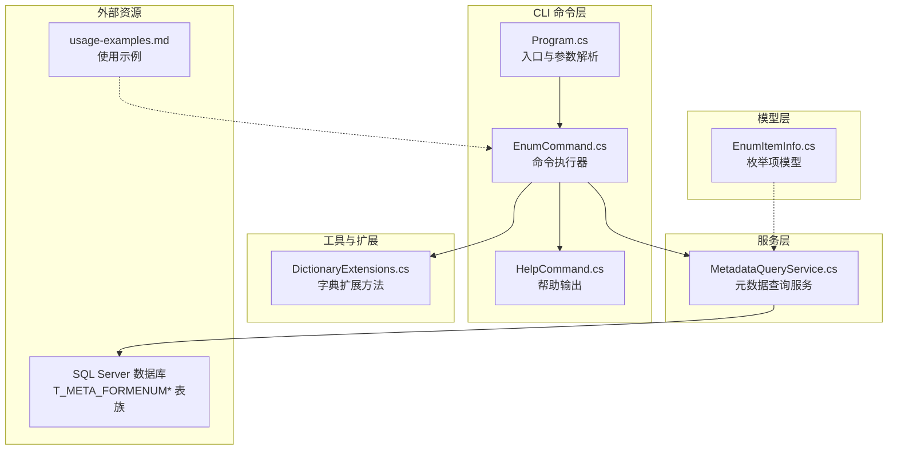
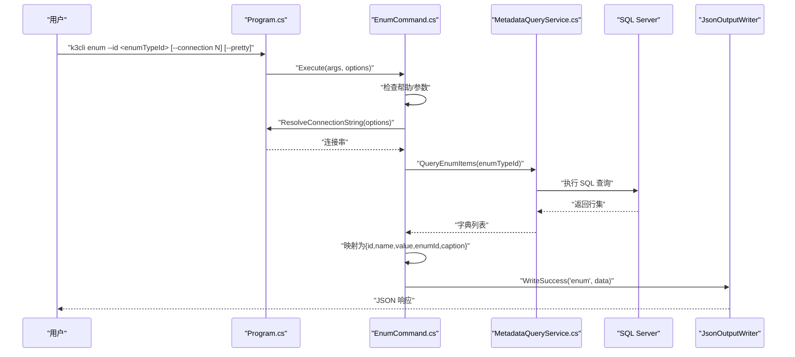
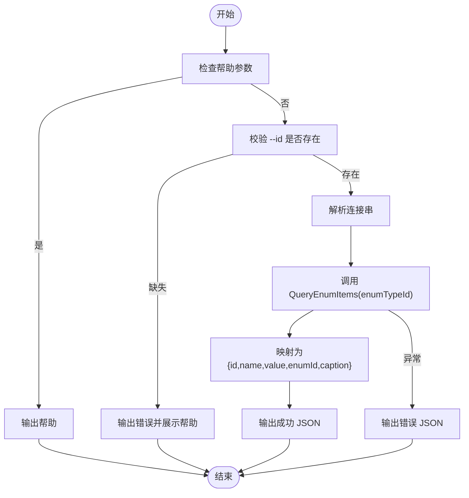
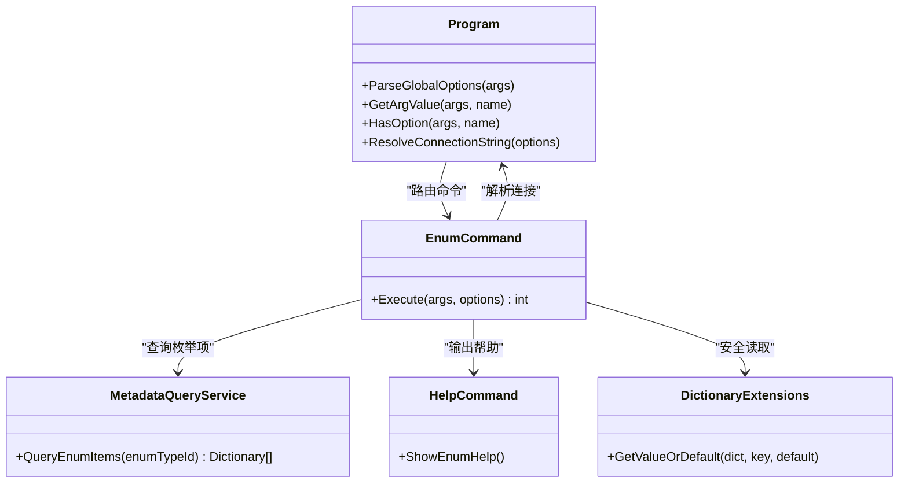
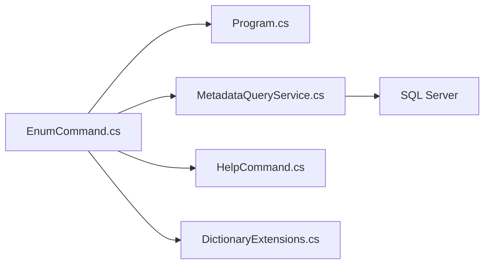

# enum 命令

<cite>
**本文引用的文件**
- [EnumCommand.cs](file://K3CloudDataDictionary.Cli/Commands/EnumCommand.cs)
- [MetadataQueryService.cs](file://K3CloudDataDictionary.Cli/Services/MetadataQueryService.cs)
- [HelpCommand.cs](file://K3CloudDataDictionary.Cli/Commands/HelpCommand.cs)
- [Program.cs](file://K3CloudDataDictionary.Cli/Program.cs)
- [usage-examples.md](file://docs/usage-examples.md)
- [EnumItemInfo.cs](file://Models/EnumItemInfo.cs)
- [DictionaryExtensions.cs](file://K3CloudDataDictionary.Cli/DictionaryExtensions.cs)
</cite>

## 目录
1. [简介](#简介)
2. [项目结构](#项目结构)
3. [核心组件](#核心组件)
4. [架构总览](#架构总览)
5. [详细组件分析](#详细组件分析)
6. [依赖关系分析](#依赖关系分析)
7. [性能考虑](#性能考虑)
8. [故障排除指南](#故障排除指南)
9. [结论](#结论)
10. [附录](#附录)

## 简介
本文件系统性地阐述了 K3Cloud CLI 中的 enum 命令，用于查询“下拉列表”类型的枚举值信息。该命令基于实时 SQL Server 查询，返回枚举类型下的所有枚举项，包含枚举项的标识、显示名称、数值以及本地化标题等关键字段。文档涵盖命令语法、参数说明、查询逻辑、过滤与结果格式、数据结构与业务含义，并提供完整的使用示例与最佳实践建议，帮助用户高效理解与应用枚举值管理系统。

## 项目结构
enum 命令位于 CLI 子项目中，采用分层设计：
- 命令层：负责解析参数、调用服务、输出结果
- 服务层：封装对 K3Cloud 元数据数据库的查询逻辑
- 模型层：提供领域模型（如枚举项模型）
- 帮助与入口：统一的帮助输出与程序入口解析

图表来源
- [EnumCommand.cs:1-64](file://K3CloudDataDictionary.Cli/Commands/EnumCommand.cs#L1-L64)
- [MetadataQueryService.cs:681-727](file://K3CloudDataDictionary.Cli/Services/MetadataQueryService.cs#L681-L727)
- [HelpCommand.cs:219-236](file://K3CloudDataDictionary.Cli/Commands/HelpCommand.cs#L219-L236)
- [Program.cs:14-69](file://K3CloudDataDictionary.Cli/Program.cs#L14-L69)
- [EnumItemInfo.cs:1-31](file://Models/EnumItemInfo.cs#L1-L31)
- [DictionaryExtensions.cs:1-23](file://K3CloudDataDictionary.Cli/DictionaryExtensions.cs#L1-L23)

章节来源
- [EnumCommand.cs:1-64](file://K3CloudDataDictionary.Cli/Commands/EnumCommand.cs#L1-L64)
- [MetadataQueryService.cs:681-727](file://K3CloudDataDictionary.Cli/Services/MetadataQueryService.cs#L681-L727)
- [HelpCommand.cs:219-236](file://K3CloudDataDictionary.Cli/Commands/HelpCommand.cs#L219-L236)
- [Program.cs:14-69](file://K3CloudDataDictionary.Cli/Program.cs#L14-L69)
- [EnumItemInfo.cs:1-31](file://Models/EnumItemInfo.cs#L1-L31)
- [DictionaryExtensions.cs:1-23](file://K3CloudDataDictionary.Cli/DictionaryExtensions.cs#L1-L23)

## 核心组件
- 命令执行器：解析参数、校验必填项、调用服务、格式化输出
- 元数据查询服务：封装 SQL 查询，返回标准化字典集合
- 帮助输出：提供 enum 命令的语法与示例
- 程序入口：统一解析全局选项与路由命令
- 模型与扩展：提供枚举项模型与字典安全访问扩展

章节来源
- [EnumCommand.cs:13-61](file://K3CloudDataDictionary.Cli/Commands/EnumCommand.cs#L13-L61)
- [MetadataQueryService.cs:685-727](file://K3CloudDataDictionary.Cli/Services/MetadataQueryService.cs#L685-L727)
- [HelpCommand.cs:219-236](file://K3CloudDataDictionary.Cli/Commands/HelpCommand.cs#L219-L236)
- [Program.cs:74-97](file://K3CloudDataDictionary.Cli/Program.cs#L74-L97)
- [EnumItemInfo.cs:6-29](file://Models/EnumItemInfo.cs#L6-L29)
- [DictionaryExtensions.cs:13-20](file://K3CloudDataDictionary.Cli/DictionaryExtensions.cs#L13-L20)

## 架构总览
enum 命令的执行路径如下：
- 入口解析：Program.Main 将命令路由至 EnumCommand.Execute
- 参数校验：检查帮助与必填参数 --id
- 连接解析：Program.ResolveConnectionString 获取 SQL Server 连接串
- 查询执行：MetadataQueryService.QueryEnumItems 执行 SQL 查询
- 结果转换：将数据库行映射为友好输出结构
- 输出：JsonOutputWriter 写入成功响应

图表来源
- [Program.cs:14-69](file://K3CloudDataDictionary.Cli/Program.cs#L14-L69)
- [EnumCommand.cs:13-61](file://K3CloudDataDictionary.Cli/Commands/EnumCommand.cs#L13-L61)
- [MetadataQueryService.cs:685-727](file://K3CloudDataDictionary.Cli/Services/MetadataQueryService.cs#L685-L727)

## 详细组件分析

### 命令语法与参数
- 命令：enum
- 必填参数：
  - --id <enumTypeId>：枚举类型 ID，对应字段的 enumType 或 FEnumType
- 可选参数：
  - --connection/-c <id>：指定连接 ID；若未指定则使用默认连接
  - --pretty：格式化 JSON 输出
- 帮助：k3cli enum --help 或 k3cli help

章节来源
- [HelpCommand.cs:219-236](file://K3CloudDataDictionary.Cli/Commands/HelpCommand.cs#L219-L236)
- [Program.cs:74-97](file://K3CloudDataDictionary.Cli/Program.cs#L74-L97)

### 查询逻辑与过滤条件
- 输入校验：若无参数或包含帮助标志，则输出帮助并退出
- 必填参数：必须提供 --id；否则输出错误并展示帮助
- 连接解析：优先使用 --connection 指定的连接，否则使用默认连接
- 查询执行：调用服务层 QueryEnumItems(enumTypeId)
- 结果转换：将数据库列映射为 id、name、value、enumId、caption
- 错误处理：捕获异常并输出错误信息

图表来源
- [EnumCommand.cs:18-61](file://K3CloudDataDictionary.Cli/Commands/EnumCommand.cs#L18-L61)
- [Program.cs:129-151](file://K3CloudDataDictionary.Cli/Program.cs#L129-L151)

章节来源
- [EnumCommand.cs:13-61](file://K3CloudDataDictionary.Cli/Commands/EnumCommand.cs#L13-L61)
- [Program.cs:129-151](file://K3CloudDataDictionary.Cli/Program.cs#L129-L151)

### 查询实现细节
- SQL 查询范围：枚举类型表与枚举项表的多表关联，按 FVALUE 排序
- 关键列映射：
  - FID → id
  - FNAME → name
  - FVALUE → value
  - FENUMID → enumId
  - FCAPTION → caption
- 语言环境：使用中文（FLOCALEID=2052）的本地化名称与标题

章节来源
- [MetadataQueryService.cs:685-727](file://K3CloudDataDictionary.Cli/Services/MetadataQueryService.cs#L685-L727)

### 结果格式与数据结构
- 成功响应包含：
  - success: true
  - command: "enum"
  - data: 枚举项数组
  - count: 条目数
- 每个枚举项对象包含：
  - id：枚举类型 ID
  - name：枚举类型名称（本地化）
  - value：枚举项排序值（字符串）
  - enumId：枚举项 ID
  - caption：枚举项标题（本地化）

章节来源
- [EnumCommand.cs:40-54](file://K3CloudDataDictionary.Cli/Commands/EnumCommand.cs#L40-L54)
- [MetadataQueryService.cs:694-720](file://K3CloudDataDictionary.Cli/Services/MetadataQueryService.cs#L694-L720)

### 业务含义与使用场景
- elementType=9 的字段（下拉列表）通过 enumType 关联到枚举类型
- 通过 enum 命令可一次性获取该枚举类型下的所有可选项
- 常见用途：前端渲染下拉列表、后端校验输入值、生成字典文档

章节来源
- [usage-examples.md:278-326](file://docs/usage-examples.md#L278-L326)

### 使用示例
- 基本查询：k3cli enum --id <enumTypeId>
- 格式化输出：k3cli enum --id <enumTypeId> --pretty
- 指定连接：k3cli enum --id <enumTypeId> --connection 1

章节来源
- [usage-examples.md:294-298](file://docs/usage-examples.md#L294-L298)
- [HelpCommand.cs:228-230](file://K3CloudDataDictionary.Cli/Commands/HelpCommand.cs#L228-L230)

### 与其他组件的关系
- 与 Program.cs：参数解析、连接解析、命令路由
- 与 HelpCommand.cs：帮助输出与语法说明
- 与 MetadataQueryService.cs：实际数据库查询
- 与 DictionaryExtensions：安全读取字典值

图表来源
- [Program.cs:74-151](file://K3CloudDataDictionary.Cli/Program.cs#L74-L151)
- [EnumCommand.cs:13-61](file://K3CloudDataDictionary.Cli/Commands/EnumCommand.cs#L13-L61)
- [MetadataQueryService.cs:685-727](file://K3CloudDataDictionary.Cli/Services/MetadataQueryService.cs#L685-L727)
- [HelpCommand.cs:219-236](file://K3CloudDataDictionary.Cli/Commands/HelpCommand.cs#L219-L236)
- [DictionaryExtensions.cs:13-20](file://K3CloudDataDictionary.Cli/DictionaryExtensions.cs#L13-L20)

## 依赖关系分析
- 命令层依赖服务层进行数据访问
- 服务层依赖 SQL Server 数据库
- 命令层依赖程序入口进行参数解析与连接解析
- 命令层依赖帮助模块提供语法说明
- 命令层依赖字典扩展提升健壮性

图表来源
- [EnumCommand.cs:13-61](file://K3CloudDataDictionary.Cli/Commands/EnumCommand.cs#L13-L61)
- [Program.cs:129-151](file://K3CloudDataDictionary.Cli/Program.cs#L129-L151)
- [MetadataQueryService.cs:685-727](file://K3CloudDataDictionary.Cli/Services/MetadataQueryService.cs#L685-L727)
- [HelpCommand.cs:219-236](file://K3CloudDataDictionary.Cli/Commands/HelpCommand.cs#L219-L236)
- [DictionaryExtensions.cs:13-20](file://K3CloudDataDictionary.Cli/DictionaryExtensions.cs#L13-L20)

章节来源
- [EnumCommand.cs:13-61](file://K3CloudDataDictionary.Cli/Commands/EnumCommand.cs#L13-L61)
- [Program.cs:129-151](file://K3CloudDataDictionary.Cli/Program.cs#L129-L151)
- [MetadataQueryService.cs:685-727](file://K3CloudDataDictionary.Cli/Services/MetadataQueryService.cs#L685-L727)
- [HelpCommand.cs:219-236](file://K3CloudDataDictionary.Cli/Commands/HelpCommand.cs#L219-L236)
- [DictionaryExtensions.cs:13-20](file://K3CloudDataDictionary.Cli/DictionaryExtensions.cs#L13-L20)

## 性能考虑
- 查询超时：SQL 命令设置 CommandTimeout=30 秒，避免长时间阻塞
- 排序：按 FVALUE 排序，确保输出稳定
- 结果量：建议配合上游字段查询（如 fields）精准定位 enumTypeId，减少无关枚举项的传输
- 连接复用：MetadataQueryService 在首次使用时初始化上下文，后续可复用

章节来源
- [MetadataQueryService.cs:707-708](file://K3CloudDataDictionary.Cli/Services/MetadataQueryService.cs#L707-L708)
- [MetadataQueryService.cs:700](file://K3CloudDataDictionary.Cli/Services/MetadataQueryService.cs#L700)

## 故障排除指南
- 缺少 --id 参数：命令会输出错误并展示帮助
- 连接失败或无默认连接：ResolveConnectionString 抛出异常并提示配置连接
- SQL 查询异常：命令捕获异常并输出错误 JSON
- 输出格式问题：使用 --pretty 格式化输出便于阅读

章节来源
- [EnumCommand.cs:26-31](file://K3CloudDataDictionary.Cli/Commands/EnumCommand.cs#L26-L31)
- [Program.cs:132-151](file://K3CloudDataDictionary.Cli/Program.cs#L132-L151)
- [EnumCommand.cs:56-60](file://K3CloudDataDictionary.Cli/Commands/EnumCommand.cs#L56-L60)

## 结论
enum 命令提供了对 K3Cloud 下拉列表枚举值的直接查询能力，通过清晰的参数与稳定的查询逻辑，能够快速获取枚举类型下的所有选项。结合字段查询与连接管理，用户可以构建完整的枚举值使用与维护流程。建议在生产环境中配合 --pretty 与明确的连接选择，以获得更好的可观测性与可维护性。

## 附录

### 语法速查
- k3cli enum --id <enumTypeId> [--connection N] [--pretty]

章节来源
- [HelpCommand.cs:219-236](file://K3CloudDataDictionary.Cli/Commands/HelpCommand.cs#L219-L236)

### 使用示例
- k3cli enum --id <enumTypeId>
- k3cli enum --id <enumTypeId> --pretty
- k3cli enum --id <enumTypeId> --connection 1

章节来源
- [usage-examples.md:294-298](file://docs/usage-examples.md#L294-L298)

### 数据结构说明
- 枚举项对象字段：
  - id：枚举类型 ID
  - name：枚举类型名称（本地化）
  - value：枚举项排序值（字符串）
  - enumId：枚举项 ID
  - caption：枚举项标题（本地化）

章节来源
- [EnumCommand.cs:43-50](file://K3CloudDataDictionary.Cli/Commands/EnumCommand.cs#L43-L50)
- [MetadataQueryService.cs:694-720](file://K3CloudDataDictionary.Cli/Services/MetadataQueryService.cs#L694-L720)