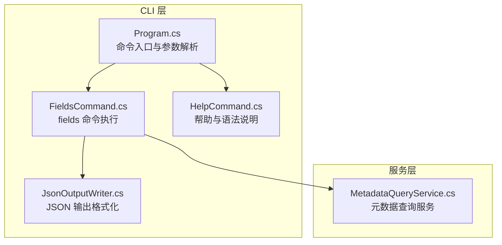
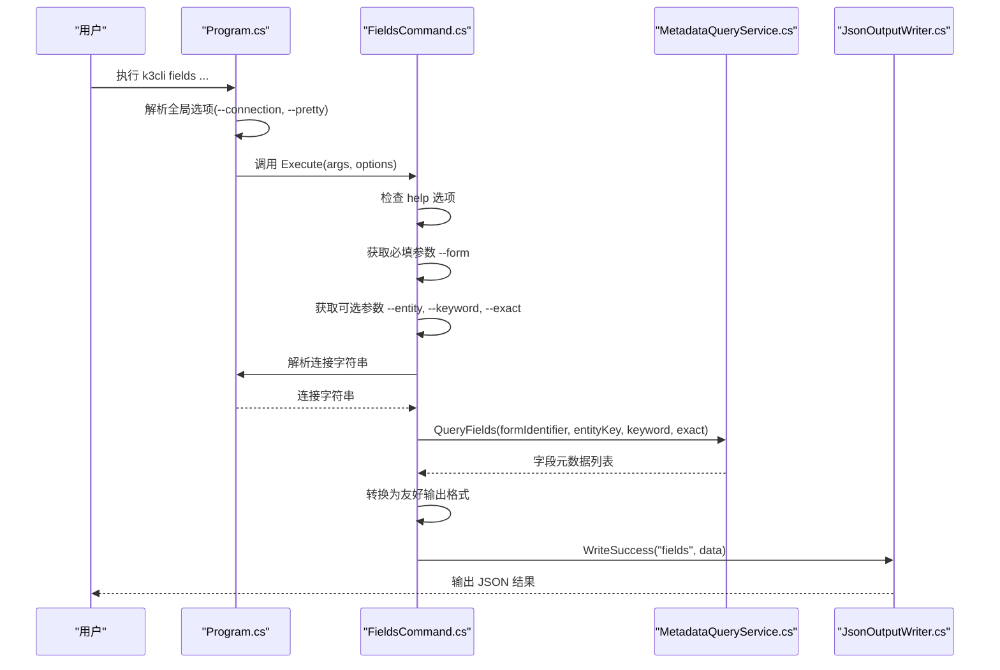
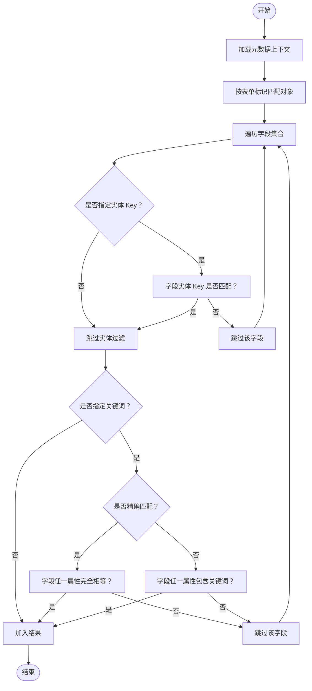
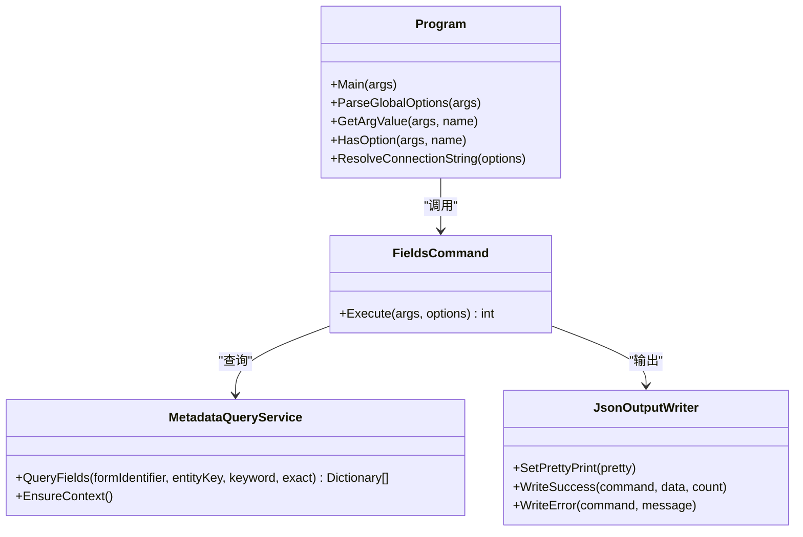

# fields 命令

<cite>
**本文档引用的文件**
- [FieldsCommand.cs](file://K3CloudDataDictionary.Cli/Commands/FieldsCommand.cs)
- [MetadataQueryService.cs](file://K3CloudDataDictionary.Cli/Services/MetadataQueryService.cs)
- [Program.cs](file://K3CloudDataDictionary.Cli/Program.cs)
- [HelpCommand.cs](file://K3CloudDataDictionary.Cli/Commands/HelpCommand.cs)
- [JsonOutputWriter.cs](file://K3CloudDataDictionary.Cli/Services/JsonOutputWriter.cs)
- [usage-examples.md](file://docs/usage-examples.md)
- [FieldInfo.cs](file://Models/FieldInfo.cs)
- [AllFieldInfo.cs](file://Models/AllFieldInfo.cs)
</cite>

## 目录
1. [简介](#简介)
2. [项目结构](#项目结构)
3. [核心组件](#核心组件)
4. [架构总览](#架构总览)
5. [详细组件分析](#详细组件分析)
6. [依赖关系分析](#依赖关系分析)
7. [性能考虑](#性能考虑)
8. [故障排除指南](#故障排除指南)
9. [结论](#结论)
10. [附录](#附录)

## 简介
fields 命令用于查询 K3 Cloud 表单的字段元数据信息，支持按表单标识、实体 Key、关键词以及精确/模糊匹配等多种条件筛选，并输出结构化的 JSON 结果。该命令是数据字典工具链中的关键环节，常与 resolve、billtype、assistantdata、enum、billstatus 等命令配合使用，形成“从字段到关联表单/枚举/状态”的完整查询闭环。

## 项目结构
fields 命令位于 CLI 层，调用服务层的元数据查询服务，最终通过 JSON 输出器输出统一格式的结果。帮助命令提供完整的语法说明与示例；Program 负责参数解析与全局选项处理；模型层提供字段信息的数据结构定义。

图表来源
- [Program.cs:14-69](file://K3CloudDataDictionary.Cli/Program.cs#L14-L69)
- [FieldsCommand.cs:13-86](file://K3CloudDataDictionary.Cli/Commands/FieldsCommand.cs#L13-L86)
- [HelpCommand.cs:74-102](file://K3CloudDataDictionary.Cli/Commands/HelpCommand.cs#L74-L102)
- [JsonOutputWriter.cs:11-91](file://K3CloudDataDictionary.Cli/Services/JsonOutputWriter.cs#L11-L91)
- [MetadataQueryService.cs:12-388](file://K3CloudDataDictionary.Cli/Services/MetadataQueryService.cs#L12-L388)

章节来源
- [Program.cs:14-69](file://K3CloudDataDictionary.Cli/Program.cs#L14-L69)
- [FieldsCommand.cs:13-86](file://K3CloudDataDictionary.Cli/Commands/FieldsCommand.cs#L13-L86)
- [HelpCommand.cs:74-102](file://K3CloudDataDictionary.Cli/Commands/HelpCommand.cs#L74-L102)
- [JsonOutputWriter.cs:11-91](file://K3CloudDataDictionary.Cli/Services/JsonOutputWriter.cs#L11-L91)
- [MetadataQueryService.cs:12-388](file://K3CloudDataDictionary.Cli/Services/MetadataQueryService.cs#L12-L388)

## 核心组件
- 命令执行器：负责解析参数、校验必填项、调用服务层查询、格式化输出。
- 元数据查询服务：负责连接数据库、加载上下文、提取并过滤字段元数据。
- JSON 输出器：统一输出成功/失败结果，支持缩进格式化。
- 帮助系统：提供 fields 命令的完整语法、参数说明与示例。
- 模型定义：提供字段信息的数据结构，便于前端或上层应用消费。

章节来源
- [FieldsCommand.cs:13-86](file://K3CloudDataDictionary.Cli/Commands/FieldsCommand.cs#L13-L86)
- [MetadataQueryService.cs:286-388](file://K3CloudDataDictionary.Cli/Services/MetadataQueryService.cs#L286-L388)
- [JsonOutputWriter.cs:26-70](file://K3CloudDataDictionary.Cli/Services/JsonOutputWriter.cs#L26-L70)
- [HelpCommand.cs:74-102](file://K3CloudDataDictionary.Cli/Commands/HelpCommand.cs#L74-L102)
- [FieldInfo.cs:6-109](file://Models/FieldInfo.cs#L6-L109)
- [AllFieldInfo.cs:6-49](file://Models/AllFieldInfo.cs#L6-L49)

## 架构总览
fields 命令的执行流程如下：
- CLI 入口解析命令与全局选项。
- fields 命令解析必填参数与可选参数。
- 解析连接字符串，实例化元数据查询服务。
- 调用查询方法，按表单标识、实体 Key、关键词与匹配模式过滤字段。
- 将结果转换为统一输出格式并打印。

图表来源
- [Program.cs:14-69](file://K3CloudDataDictionary.Cli/Program.cs#L14-L69)
- [FieldsCommand.cs:13-86](file://K3CloudDataDictionary.Cli/Commands/FieldsCommand.cs#L13-L86)
- [MetadataQueryService.cs:286-388](file://K3CloudDataDictionary.Cli/Services/MetadataQueryService.cs#L286-L388)
- [JsonOutputWriter.cs:26-53](file://K3CloudDataDictionary.Cli/Services/JsonOutputWriter.cs#L26-L53)

## 详细组件分析

### 命令语法与参数说明
- 必填参数
  - --form <identifier>：表单标识（例如 PUR_PurchaseOrder）。用于定位目标表单并提取其字段元数据。
- 可选参数
  - --entity <key>：实体 Key（例如 FK_BillEntry）。仅返回该实体下的字段。
  - --keyword <keyword>：字段搜索关键词。支持模糊或精确匹配。
  - --exact, -e：启用精确匹配模式（完全相等，不区分大小写）。默认为模糊匹配（包含）。
- 全局选项
  - --connection, -c <id>：指定连接 ID，优先使用该连接。
  - --pretty：格式化输出 JSON（缩进）。

章节来源
- [HelpCommand.cs:76-101](file://K3CloudDataDictionary.Cli/Commands/HelpCommand.cs#L76-L101)
- [Program.cs:74-97](file://K3CloudDataDictionary.Cli/Program.cs#L74-L97)

### 参数解析与验证逻辑
- 帮助检查：若参数为空或包含 help 选项，则显示帮助并退出。
- 必填参数校验：若缺失 --form，则输出错误并显示帮助，返回非零退出码。
- 可选参数解析：解析 entity、keyword、exact 选项。
- 连接解析：优先使用 --connection 指定的连接，否则使用默认连接；若均不可用则抛出异常。

章节来源
- [FieldsCommand.cs:18-31](file://K3CloudDataDictionary.Cli/Commands/FieldsCommand.cs#L18-L31)
- [Program.cs:102-124](file://K3CloudDataDictionary.Cli/Program.cs#L102-L124)
- [Program.cs:129-151](file://K3CloudDataDictionary.Cli/Program.cs#L129-L151)

### 查询流程与过滤策略
- 上下文初始化：首次查询时加载对象基础信息与元素类型映射，提升后续查询性能。
- 表单匹配：根据表单标识（不区分大小写）匹配对象集合。
- 实体过滤：若指定 entityKey，则仅返回该实体下的字段。
- 关键词过滤：支持模糊/精确匹配，分别匹配字段 Key、Name、FieldName、PropertyName。
- 状态项处理：当字段元素类型为 40 时，将状态项作为嵌套数组输出。

图表来源
- [MetadataQueryService.cs:286-388](file://K3CloudDataDictionary.Cli/Services/MetadataQueryService.cs#L286-L388)

章节来源
- [MetadataQueryService.cs:286-388](file://K3CloudDataDictionary.Cli/Services/MetadataQueryService.cs#L286-L388)

### 输出格式与结构
- 成功响应：包含 success=true、command=fields、data（字段数组）、count（数量）。
- 字段对象字段（节选）：
  - formName：表单中文名称
  - entityName：实体中文名称
  - table：实体对应数据库表名
  - key：字段 Key
  - name：字段中文名称
  - fieldName：字段数据库字段名
  - propertyName：字段属性名
  - elementType：元素类型标识
  - elementTypeName：元素类型中文名
  - tagName：标签名
  - lookUpObject：关联对象 ID（如适用）
  - enumType：枚举类型 ID（如适用）
  - splitSuffix/splitDescription：拆分表相关信息（如适用）
  - updateActionCount：更新动作计数
  - statusItems：当 elementType=40 时，包含状态项数组（value/name）

章节来源
- [FieldsCommand.cs:44-77](file://K3CloudDataDictionary.Cli/Commands/FieldsCommand.cs#L44-L77)
- [MetadataQueryService.cs:345-377](file://K3CloudDataDictionary.Cli/Services/MetadataQueryService.cs#L345-L377)
- [JsonOutputWriter.cs:26-53](file://K3CloudDataDictionary.Cli/Services/JsonOutputWriter.cs#L26-L53)

### 错误处理机制
- 参数缺失：缺少 --form 时输出错误并显示帮助，返回非零退出码。
- 连接异常：无法解析有效连接时抛出异常，交由全局异常处理器输出错误。
- 查询异常：服务层内部异常被捕获并转为错误输出，返回非零退出码。
- 输出格式：支持 --pretty 缩进输出，便于调试与阅读。

章节来源
- [FieldsCommand.cs:26-31](file://K3CloudDataDictionary.Cli/Commands/FieldsCommand.cs#L26-L31)
- [Program.cs:129-151](file://K3CloudDataDictionary.Cli/Program.cs#L129-L151)
- [FieldsCommand.cs:80-84](file://K3CloudDataDictionary.Cli/Commands/FieldsCommand.cs#L80-L84)
- [JsonOutputWriter.cs:58-70](file://K3CloudDataDictionary.Cli/Services/JsonOutputWriter.cs#L58-L70)

### 使用示例与应用场景
- 查询表单所有字段
  - k3cli fields --form PUR_PurchaseOrder
- 查询指定实体的所有字段
  - k3cli fields --form PUR_PurchaseOrder --entity FK_BillEntry
- 在表单/实体范围内模糊搜索字段
  - k3cli fields --form PUR_PurchaseOrder --keyword "物料"
  - k3cli fields --form PUR_PurchaseOrder --entity FK_BillEntry --keyword "FMaterialId"
- 在表单/实体范围内精确搜索字段
  - k3cli fields --form PUR_PurchaseOrder --keyword "FMaterialId" --exact
  - k3cli fields --form PUR_PurchaseOrder --entity FK_BillEntry --keyword "物料" -e
- 使用指定连接与格式化输出
  - k3cli fields --form PUR_PurchaseOrder --connection 1 --pretty

章节来源
- [HelpCommand.cs:87-101](file://K3CloudDataDictionary.Cli/Commands/HelpCommand.cs#L87-L101)
- [usage-examples.md:142-150](file://docs/usage-examples.md#L142-L150)

## 依赖关系分析
- CLI 入口依赖命令执行器与帮助系统。
- 命令执行器依赖程序参数解析与 JSON 输出器。
- 命令执行器依赖服务层查询方法。
- 服务层依赖数据库连接与元数据提取上下文。
- 模型层提供字段信息的数据结构，供上层消费。

图表来源
- [Program.cs:14-151](file://K3CloudDataDictionary.Cli/Program.cs#L14-L151)
- [FieldsCommand.cs:13-86](file://K3CloudDataDictionary.Cli/Commands/FieldsCommand.cs#L13-L86)
- [MetadataQueryService.cs:12-388](file://K3CloudDataDictionary.Cli/Services/MetadataQueryService.cs#L12-L388)
- [JsonOutputWriter.cs:11-91](file://K3CloudDataDictionary.Cli/Services/JsonOutputWriter.cs#L11-L91)

章节来源
- [Program.cs:14-151](file://K3CloudDataDictionary.Cli/Program.cs#L14-L151)
- [FieldsCommand.cs:13-86](file://K3CloudDataDictionary.Cli/Commands/FieldsCommand.cs#L13-L86)
- [MetadataQueryService.cs:12-388](file://K3CloudDataDictionary.Cli/Services/MetadataQueryService.cs#L12-L388)
- [JsonOutputWriter.cs:11-91](file://K3CloudDataDictionary.Cli/Services/JsonOutputWriter.cs#L11-L91)

## 性能考虑
- 上下文懒加载：首次查询时才加载对象基础信息与元素类型映射，避免重复开销。
- 结果转换：在命令执行器中进行轻量级字段映射与状态项嵌套，复杂度与字段数量线性相关。
- 连接管理：通过连接 ID 或默认连接快速解析，减少无效尝试。
- 输出优化：支持缩进输出，便于人类阅读但会增加输出体积；生产环境建议关闭缩进。

[本节为通用性能讨论，不直接分析具体文件]

## 故障排除指南
- 缺少必填参数
  - 现象：输出错误并显示帮助。
  - 处理：补充 --form 参数。
  - 参考：[FieldsCommand.cs:26-31](file://K3CloudDataDictionary.Cli/Commands/FieldsCommand.cs#L26-L31)
- 未配置连接
  - 现象：解析连接字符串时抛出异常。
  - 处理：使用 --connection 指定连接 ID，或先配置默认连接。
  - 参考：[Program.cs:129-151](file://K3CloudDataDictionary.Cli/Program.cs#L129-L151)
- 查询异常
  - 现象：服务层内部异常被捕获并输出错误。
  - 处理：检查数据库连通性、权限与表单标识是否正确。
  - 参考：[FieldsCommand.cs:80-84](file://K3CloudDataDictionary.Cli/Commands/FieldsCommand.cs#L80-L84)
- 输出格式问题
  - 现象：输出未缩进或格式混乱。
  - 处理：使用 --pretty 开启缩进输出。
  - 参考：[JsonOutputWriter.cs:18-21](file://K3CloudDataDictionary.Cli/Services/JsonOutputWriter.cs#L18-L21)

章节来源
- [FieldsCommand.cs:26-31](file://K3CloudDataDictionary.Cli/Commands/FieldsCommand.cs#L26-L31)
- [Program.cs:129-151](file://K3CloudDataDictionary.Cli/Program.cs#L129-L151)
- [FieldsCommand.cs:80-84](file://K3CloudDataDictionary.Cli/Commands/FieldsCommand.cs#L80-L84)
- [JsonOutputWriter.cs:18-21](file://K3CloudDataDictionary.Cli/Services/JsonOutputWriter.cs#L18-L21)

## 结论
fields 命令提供了灵活而强大的字段查询能力，支持按表单、实体、关键词与匹配模式进行筛选，并输出标准化的 JSON 结果。结合帮助系统与错误处理机制，用户可以高效地完成从字段到关联表单/枚举/状态的探索与分析工作流。

[本节为总结性内容，不直接分析具体文件]

## 附录

### 字段对象字段对照表（节选）
- formName：表单中文名称
- entityName：实体中文名称
- table：实体对应数据库表名
- key：字段 Key
- name：字段中文名称
- fieldName：字段数据库字段名
- propertyName：字段属性名
- elementType：元素类型标识
- elementTypeName：元素类型中文名
- tagName：标签名
- lookUpObject：关联对象 ID（如适用）
- enumType：枚举类型 ID（如适用）
- splitSuffix/splitDescription：拆分表相关信息（如适用）
- updateActionCount：更新动作计数
- statusItems：当 elementType=40 时，包含状态项数组（value/name）

章节来源
- [FieldsCommand.cs:44-77](file://K3CloudDataDictionary.Cli/Commands/FieldsCommand.cs#L44-L77)
- [MetadataQueryService.cs:345-377](file://K3CloudDataDictionary.Cli/Services/MetadataQueryService.cs#L345-L377)