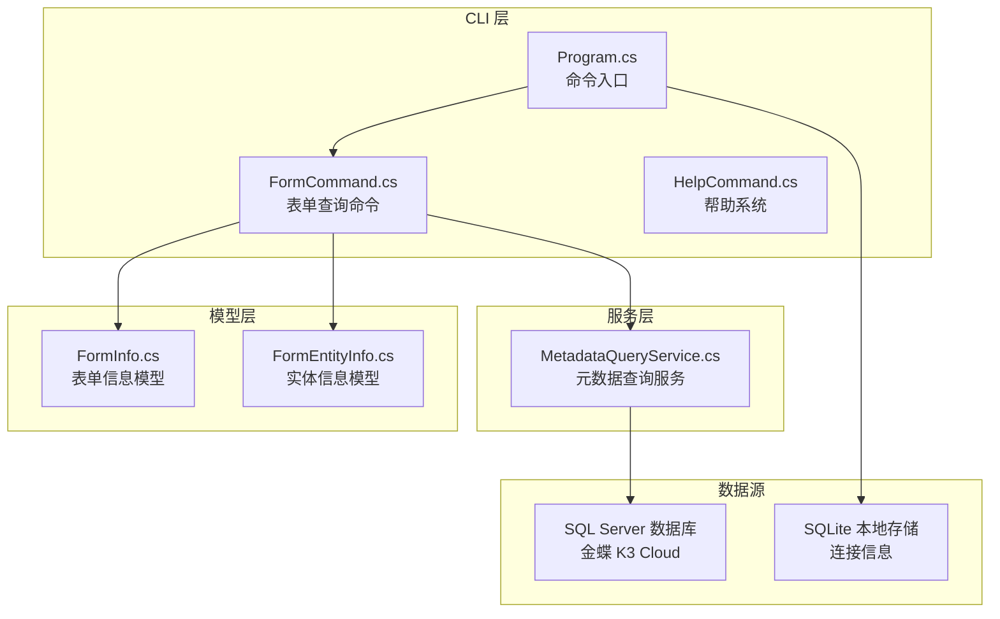
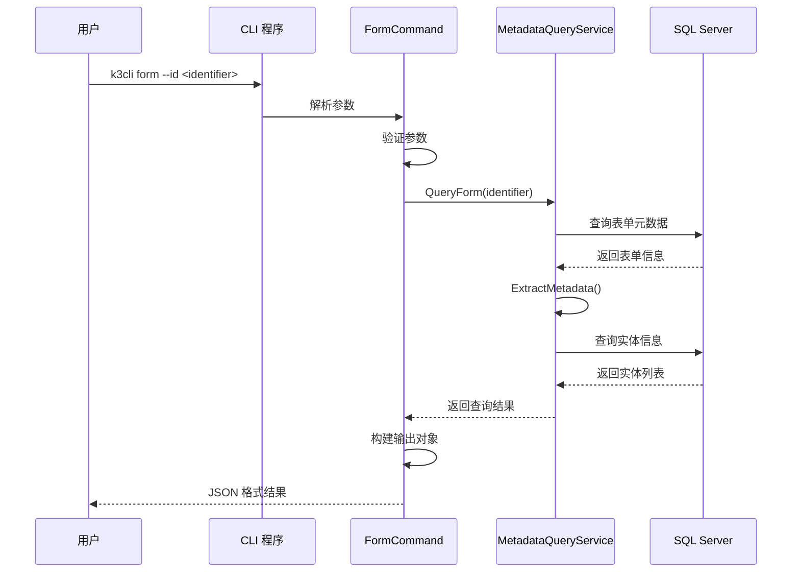
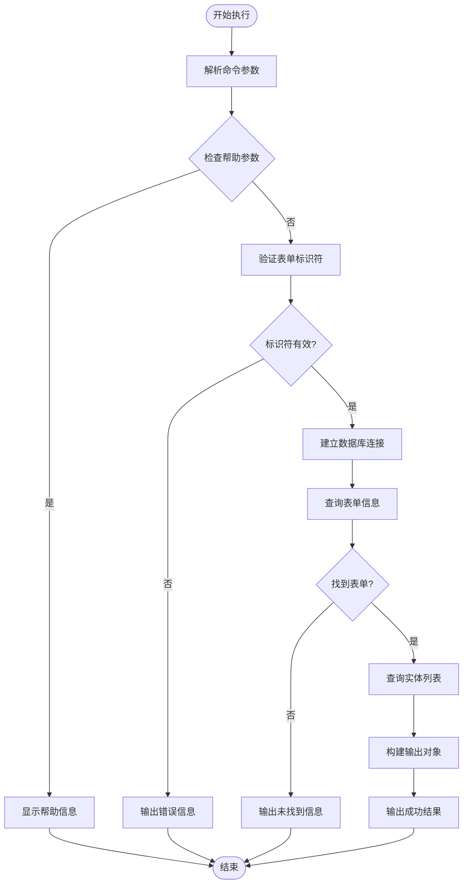
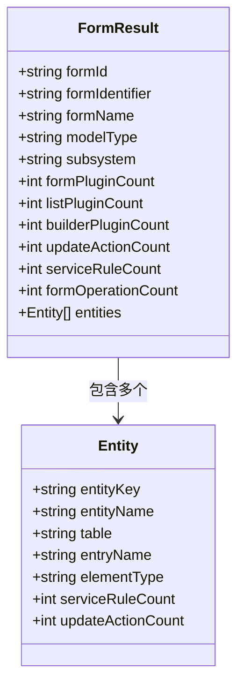
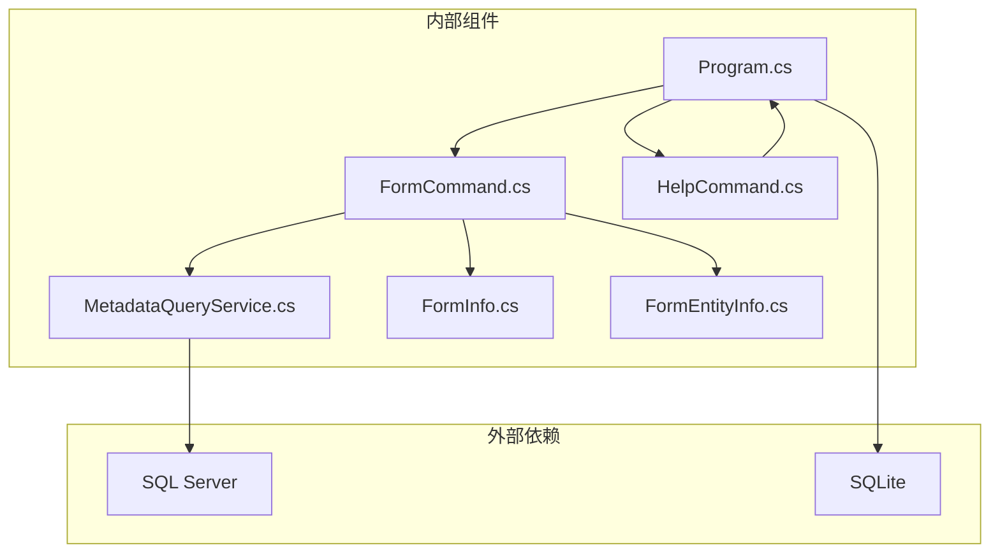

# form 命令

<cite>
**本文档引用的文件**
- [FormCommand.cs](file://K3CloudDataDictionary.Cli/Commands/FormCommand.cs)
- [MetadataQueryService.cs](file://K3CloudDataDictionary.Cli/Services/MetadataQueryService.cs)
- [Program.cs](file://K3CloudDataDictionary.Cli/Program.cs)
- [HelpCommand.cs](file://K3CloudDataDictionary.Cli/Commands/HelpCommand.cs)
- [FormInfo.cs](file://Models/FormInfo.cs)
- [FormEntityInfo.cs](file://Models/FormEntityInfo.cs)
- [usage-examples.md](file://docs/usage-examples.md)
- [README.md](file://README.md)
</cite>

## 目录
1. [简介](#简介)
2. [项目结构](#项目结构)
3. [核心组件](#核心组件)
4. [架构概览](#架构概览)
5. [详细组件分析](#详细组件分析)
6. [依赖关系分析](#依赖关系分析)
7. [性能考虑](#性能考虑)
8. [故障排除指南](#故障排除指南)
9. [结论](#结论)
10. [附录](#附录)

## 简介

form 命令是 K3Cloud 数据字典 CLI 工具中的核心功能之一，专门用于查询表单信息。该命令能够提供表单的完整元数据信息，包括表单标识符、表单类型、表单结构以及关联的实体信息。

该命令基于金蝶 K3 Cloud BOS 平台的元数据架构设计，通过直接连接 SQL Server 数据库实时查询表单相关信息。支持多种查询模式，包括按表单标识符查询、按表单类型查询、按关键词模糊搜索等。

## 项目结构

K3Cloud 数据字典工具采用清晰的分层架构设计：



**图表来源**
- [Program.cs:12-69](file://K3CloudDataDictionary.Cli/Program.cs#L12-L69)
- [FormCommand.cs:11-92](file://K3CloudDataDictionary.Cli/Commands/FormCommand.cs#L11-L92)
- [MetadataQueryService.cs:12-22](file://K3CloudDataDictionary.Cli/Services/MetadataQueryService.cs#L12-L22)

**章节来源**
- [Program.cs:1-166](file://K3CloudDataDictionary.Cli/Program.cs#L1-L166)
- [README.md:36-83](file://README.md#L36-L83)

## 核心组件

### 表单查询命令 (FormCommand)

FormCommand 是 form 命令的核心实现，负责处理用户输入、调用查询服务并格式化输出结果。

主要功能特性：
- 参数验证和帮助信息显示
- 表单标识符解析
- 实体信息查询
- 结果数据结构化输出

### 元数据查询服务 (MetadataQueryService)

MetadataQueryService 提供了完整的元数据查询能力，包括：
- 表单信息查询
- 实体列表查询  
- 字段信息查询
- 单据类型查询
- 辅助资料查询

### 数据模型

系统提供了专门的数据模型来封装查询结果：

**FormInfo 模型** - 表单基本信息
- FormId: 表单标识符
- FormIdentifier: 表单标识符
- FormName: 表单中文名称
- ModelTypeName: 模型类型名称
- SubSystemName: 所属子系统
- Plugin 统计计数器

**FormEntityInfo 模型** - 实体信息
- FormId: 所属表单标识符
- EntityKey: 实体标识符
- EntityName: 实体中文名称
- TableName: 数据库表名
- ElementType: 元素类型
- ServiceRuleCount: 服务规则数量
- UpdateActionCount: 更新动作数量

**章节来源**
- [FormCommand.cs:11-92](file://K3CloudDataDictionary.Cli/Commands/FormCommand.cs#L11-L92)
- [MetadataQueryService.cs:172-277](file://K3CloudDataDictionary.Cli/Services/MetadataQueryService.cs#L172-L277)
- [FormInfo.cs:6-99](file://Models/FormInfo.cs#L6-L99)
- [FormEntityInfo.cs:6-117](file://Models/FormEntityInfo.cs#L6-L117)

## 架构概览

form 命令采用经典的三层架构设计，确保了良好的可维护性和扩展性：



**图表来源**
- [Program.cs:39-40](file://K3CloudDataDictionary.Cli/Program.cs#L39-L40)
- [FormCommand.cs:33-89](file://K3CloudDataDictionary.Cli/Commands/FormCommand.cs#L33-L89)
- [MetadataQueryService.cs:172-277](file://K3CloudDataDictionary.Cli/Services/MetadataQueryService.cs#L172-L277)

## 详细组件分析

### 命令执行流程

form 命令的执行流程遵循严格的错误处理和参数验证机制：



**图表来源**
- [FormCommand.cs:13-90](file://K3CloudDataDictionary.Cli/Commands/FormCommand.cs#L13-L90)

### 查询逻辑详解

#### 表单信息查询

表单信息查询通过以下步骤完成：

1. **参数验证**：检查 `--id` 参数是否存在
2. **连接建立**：解析连接字符串并建立数据库连接
3. **元数据提取**：调用 `ExtractMetadata()` 方法获取完整元数据
4. **统计计算**：计算插件数量、服务规则数量、更新动作数量等

#### 实体信息查询

实体信息查询支持以下过滤条件：
- 按表单标识符过滤
- 按实体 Key 过滤
- 按关键词模糊搜索

### 结果格式说明

form 命令返回标准化的 JSON 格式结果，包含以下层次结构：



**图表来源**
- [FormCommand.cs:66-80](file://K3CloudDataDictionary.Cli/Commands/FormCommand.cs#L66-L80)

**章节来源**
- [FormCommand.cs:33-89](file://K3CloudDataDictionary.Cli/Commands/FormCommand.cs#L33-L89)

### 参数配置详解

#### 必需参数

**--id <identifier>**
- 类型：字符串
- 必需：是
- 说明：表单标识符，如 PUR_PurchaseOrder
- 示例：`k3cli form --id PUR_PurchaseOrder`

#### 可选参数

**--connection, -c <id>**
- 类型：整数
- 必需：否
- 说明：指定连接 ID，使用特定的数据库连接
- 示例：`k3cli form --id PUR_PurchaseOrder --connection 1`

**--pretty**
- 类型：开关
- 必需：否
- 说明：格式化 JSON 输出，便于阅读
- 示例：`k3cli form --id PUR_PurchaseOrder --pretty`

### 使用示例

#### 基本查询

```bash
# 最简单的查询方式
k3cli form --id PUR_PurchaseOrder

# 格式化输出
k3cli form --id PUR_PurchaseOrder --pretty
```

#### 连接指定数据库

```bash
# 使用指定连接 ID
k3cli form --id PUR_PurchaseOrder --connection 1

# 结合格式化输出
k3cli form --id PUR_PurchaseOrder --connection 1 --pretty
```

### 实际应用场景

#### 1. 表单元数据探索

当需要了解某个表单的整体结构时，可以使用 form 命令快速获取：
- 表单的基本信息（标识符、名称、类型）
- 关联的实体列表
- 插件和规则统计信息

#### 2. 表单对比分析

通过查询多个表单的信息，可以进行对比分析：
- 相同业务场景下不同表单的差异
- 插件使用情况的对比
- 实体结构的相似性分析

#### 3. 开发调试支持

在开发过程中，开发者可以使用该命令：
- 验证表单标识符的正确性
- 检查表单的完整性
- 获取实体信息用于代码生成

**章节来源**
- [HelpCommand.cs:128-140](file://K3CloudDataDictionary.Cli/Commands/HelpCommand.cs#L128-L140)
- [usage-examples.md:515-528](file://docs/usage-examples.md#L515-L528)

## 依赖关系分析

### 组件依赖图



**图表来源**
- [Program.cs:12-69](file://K3CloudDataDictionary.Cli/Program.cs#L12-L69)
- [FormCommand.cs:11-16](file://K3CloudDataDictionary.Cli/Commands/FormCommand.cs#L11-L16)
- [MetadataQueryService.cs:12-22](file://K3CloudDataDictionary.Cli/Services/MetadataQueryService.cs#L12-L22)

### 数据流分析

form 命令的数据流遵循以下模式：

1. **输入阶段**：命令行参数解析
2. **处理阶段**：元数据查询和处理
3. **输出阶段**：JSON 格式化输出

### 错误处理机制

系统实现了多层次的错误处理：
- 参数验证错误
- 数据库连接失败
- 查询结果为空
- 未知异常处理

**章节来源**
- [FormCommand.cs:85-89](file://K3CloudDataDictionary.Cli/Commands/FormCommand.cs#L85-L89)
- [Program.cs:64-68](file://K3CloudDataDictionary.Cli/Program.cs#L64-L68)

## 性能考虑

### 查询优化策略

1. **延迟加载**：元数据上下文采用懒加载方式，只有在需要时才建立数据库连接
2. **缓存机制**：元素类型名称映射采用内存缓存，避免重复查询
3. **批量查询**：支持一次性查询多个表单的相关信息

### 性能监控

系统提供了性能监控点：
- 元数据上下文加载时间
- 查询执行时间
- 结果集大小

### 内存管理

- 使用 `using` 语句确保数据库连接及时释放
- 避免大对象的重复创建
- 及时清理临时数据结构

## 故障排除指南

### 常见问题及解决方案

#### 1. 连接失败

**症状**：命令执行时报连接错误
**原因**：
- 数据库服务器不可达
- 认证信息错误
- 网络连接问题

**解决方案**：
```bash
# 检查连接配置
k3cli connections list

# 测试连接
k3cli connections test --id 1

# 使用默认连接
k3cli form --id PUR_PurchaseOrder
```

#### 2. 表单不存在

**症状**：返回 "未找到表单" 错误
**原因**：
- 表单标识符拼写错误
- 表单尚未创建
- 权限不足

**解决方案**：
```bash
# 首先搜索表单
k3cli search --keyword "采购订单"

# 或者检查表单列表
k3cli search --type table --keyword "Purchase"
```

#### 3. 输出格式问题

**症状**：JSON 输出格式不符合预期
**解决方案**：
```bash
# 使用格式化输出
k3cli form --id PUR_PurchaseOrder --pretty

# 检查帮助信息
k3cli help form
```

### 调试技巧

1. **启用详细日志**：观察控制台输出的错误信息
2. **逐步排查**：先验证连接，再测试查询
3. **参数验证**：确保所有必需参数都已提供

**章节来源**
- [FormCommand.cs:28-31](file://K3CloudDataDictionary.Cli/Commands/FormCommand.cs#L28-L31)
- [Program.cs:140-151](file://K3CloudDataDictionary.Cli/Program.cs#L140-L151)

## 结论

form 命令作为 K3Cloud 数据字典工具的重要组成部分，提供了强大的表单信息查询能力。通过合理的架构设计和完善的错误处理机制，该命令能够满足各种表单查询需求。

主要优势包括：
- **易用性强**：简洁的命令语法和清晰的帮助信息
- **功能完整**：支持多种查询模式和过滤条件
- **性能优良**：采用延迟加载和缓存机制
- **扩展性好**：模块化设计便于功能扩展

建议在实际使用中：
1. 充分利用帮助信息了解命令的完整功能
2. 合理使用连接管理和格式化选项
3. 结合其他命令进行综合查询分析
4. 建立规范的表单命名约定以便于查询

## 附录

### 完整语法参考

```bash
k3cli form [options]
```

**选项**：
- `--id <identifier>`：表单标识符（必填）
- `--connection, -c <id>`：指定连接 ID
- `--pretty`：格式化 JSON 输出

**章节来源**
- [HelpCommand.cs:128-140](file://K3CloudDataDictionary.Cli/Commands/HelpCommand.cs#L128-L140)
- [FormCommand.cs:18-31](file://K3CloudDataDictionary.Cli/Commands/FormCommand.cs#L18-L31)