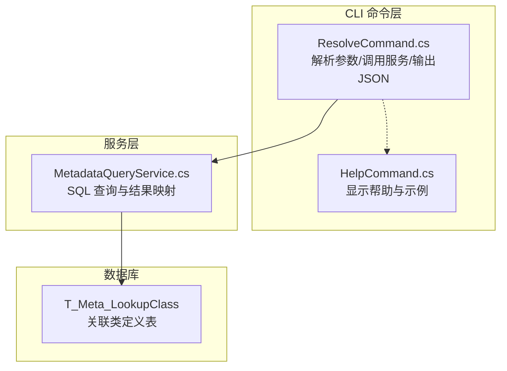
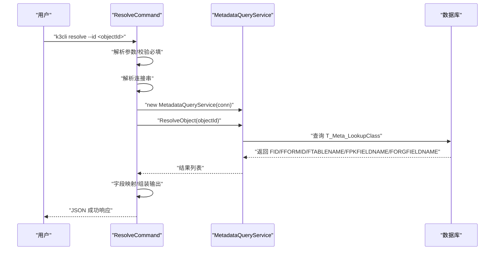
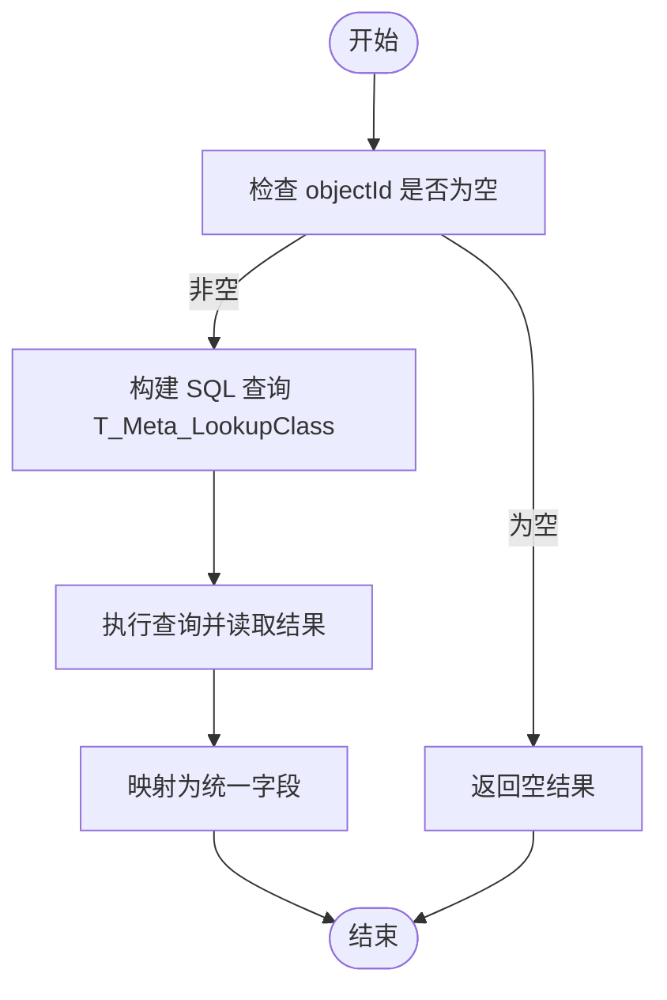
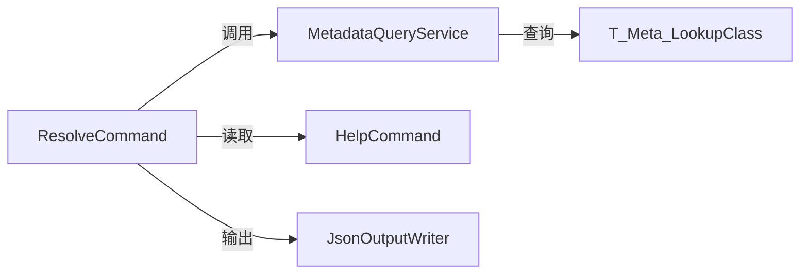

# resolve 命令

<cite>
**本文引用的文件**
- [ResolveCommand.cs](file://K3CloudDataDictionary.Cli/Commands/ResolveCommand.cs)
- [MetadataQueryService.cs](file://K3CloudDataDictionary.Cli/Services/MetadataQueryService.cs)
- [HelpCommand.cs](file://K3CloudDataDictionary.Cli/Commands/HelpCommand.cs)
- [usage-examples.md](file://docs/usage-examples.md)
</cite>

## 目录
1. [简介](#简介)
2. [项目结构](#项目结构)
3. [核心组件](#核心组件)
4. [架构总览](#架构总览)
5. [详细组件分析](#详细组件分析)
6. [依赖关系分析](#依赖关系分析)
7. [性能考量](#性能考量)
8. [故障排查指南](#故障排查指南)
9. [结论](#结论)
10. [附录](#附录)

## 简介
resolve 命令用于“反查”lookUpObject 关联对象 ID 所对应的表单信息，帮助用户从字段的关联标识快速定位到目标表单标识、数据库表名、主键与组织字段等关键元数据，从而进一步查询该表单的字段或其他相关信息。该命令直接基于数据库实时查询，返回结构化的 JSON 结果，便于自动化脚本与工具集成。

## 项目结构
resolve 命令位于 CLI 子项目中，采用命令-服务分离的设计：
- 命令层负责参数解析、错误处理与输出格式化
- 服务层负责与数据库交互，执行 SQL 查询并返回标准化结果
- 帮助文档提供命令语法与使用示例

图表来源
- [ResolveCommand.cs:13-61](file://K3CloudDataDictionary.Cli/Commands/ResolveCommand.cs#L13-L61)
- [MetadataQueryService.cs:83-122](file://K3CloudDataDictionary.Cli/Services/MetadataQueryService.cs#L83-L122)
- [HelpCommand.cs:238-257](file://K3CloudDataDictionary.Cli/Commands/HelpCommand.cs#L238-L257)

章节来源
- [ResolveCommand.cs:1-63](file://K3CloudDataDictionary.Cli/Commands/ResolveCommand.cs#L1-L63)
- [MetadataQueryService.cs:1-800](file://K3CloudDataDictionary.Cli/Services/MetadataQueryService.cs#L1-L800)
- [HelpCommand.cs:1-287](file://K3CloudDataDictionary.Cli/Commands/HelpCommand.cs#L1-L287)

## 核心组件
- resolve 命令入口：解析参数、校验必填项、调用服务、格式化输出
- 元数据查询服务：封装数据库连接与 SQL 查询逻辑，返回标准化字典列表
- 帮助命令：提供 resolve 的语法、参数与使用示例

章节来源
- [ResolveCommand.cs:13-61](file://K3CloudDataDictionary.Cli/Commands/ResolveCommand.cs#L13-L61)
- [MetadataQueryService.cs:83-122](file://K3CloudDataDictionary.Cli/Services/MetadataQueryService.cs#L83-L122)
- [HelpCommand.cs:238-257](file://K3CloudDataDictionary.Cli/Commands/HelpCommand.cs#L238-L257)

## 架构总览
resolve 命令的执行流程如下：
1. 命令解析：检查帮助参数、获取 --id 并校验必填
2. 连接解析：根据全局选项解析数据库连接串
3. 服务调用：构造 MetadataQueryService 并执行 ResolveObject(objectId)
4. 结果映射：将数据库列映射为统一的 JSON 字段
5. 输出：使用 JSON 输出器写入成功响应

图表来源
- [ResolveCommand.cs:13-61](file://K3CloudDataDictionary.Cli/Commands/ResolveCommand.cs#L13-L61)
- [MetadataQueryService.cs:83-122](file://K3CloudDataDictionary.Cli/Services/MetadataQueryService.cs#L83-L122)

## 详细组件分析

### 命令解析与执行（ResolveCommand）
- 参数处理
  - 支持 --id 必填参数；若缺失则输出错误并展示帮助
  - 支持 --help/-h 帮助开关
  - 支持 --connection 指定连接 ID（通过 Program.ResolveConnectionString(options) 解析）
  - 支持 --pretty 控制 JSON 格式化
- 业务流程
  - 调用服务层 ResolveObject(objectId)
  - 将返回的字典列表映射为统一字段：lookupId、formId、tableName、pkFieldName、orgFieldName
  - 使用 JSON 输出器写入成功响应

章节来源
- [ResolveCommand.cs:13-61](file://K3CloudDataDictionary.Cli/Commands/ResolveCommand.cs#L13-L61)

### 关联查询机制（MetadataQueryService）
- 查询目标
  - 通过 lookUpObject 值（即 objectId）在 T_Meta_LookupClass 中查找对应记录
- 查询字段
  - 返回 FID（lookupId）、FFORMID（formId）、FTABLENAME（tableName）、FPKFIELDNAME（pkFieldName）、FORGFIELDNAME（orgFieldName）
- 性能与健壮性
  - 使用参数化查询防止注入
  - 设置 CommandTimeout，避免长时间阻塞
  - 空 ID 直接返回空结果，避免无效查询

图表来源
- [MetadataQueryService.cs:83-122](file://K3CloudDataDictionary.Cli/Services/MetadataQueryService.cs#L83-L122)

章节来源
- [MetadataQueryService.cs:83-122](file://K3CloudDataDictionary.Cli/Services/MetadataQueryService.cs#L83-L122)

### 结果格式与字段说明
resolve 命令返回的 JSON 数组中，每条记录包含以下字段：
- lookupId：关联对象 ID（即传入的 objectId）
- formId：目标表单标识（可用于 fields 命令）
- tableName：目标表单对应的数据库表名
- pkFieldName：主键字段名
- orgFieldName：组织字段名

章节来源
- [ResolveCommand.cs:39-50](file://K3CloudDataDictionary.Cli/Commands/ResolveCommand.cs#L39-L50)

### 语法与参数
- 基本语法
  - k3cli resolve --id <objectId> [--connection <id>] [--pretty]
- 参数说明
  - --id：必填，关联对象 ID（即 lookUpObject 值）
  - --connection/-c：可选，指定连接 ID
  - --pretty：可选，格式化 JSON 输出
- 帮助与示例
  - 命令内置帮助会显示语法与示例
  - 使用文档提供了端到端的使用案例

章节来源
- [HelpCommand.cs:238-257](file://K3CloudDataDictionary.Cli/Commands/HelpCommand.cs#L238-L257)
- [usage-examples.md:50-84](file://docs/usage-examples.md#L50-L84)

### 使用示例与最佳实践
- 典型流程
  1) 通过 fields 命令定位字段，获取 lookUpObject 值
  2) 使用 resolve --id <lookUpObject> 获取 formId、tableName 等
  3) 使用 formId 继续查询 fields 或其他元数据
- 最佳实践
  - 在调用 resolve 前确保 objectId 非空且有效
  - 若需要更丰富的表单元数据，可在得到 formId 后使用 form 命令
  - 使用 --pretty 提升可读性，便于人工查看与调试

章节来源
- [usage-examples.md:3-157](file://docs/usage-examples.md#L3-L157)
- [HelpCommand.cs:238-257](file://K3CloudDataDictionary.Cli/Commands/HelpCommand.cs#L238-L257)

## 依赖关系分析
- 命令层依赖
  - Program：解析连接串、参数与选项
  - JsonOutputWriter：统一输出 JSON（成功/错误）
  - HelpCommand：显示帮助与示例
- 服务层依赖
  - SqlConnection：连接数据库
  - MetadataContext：上下文加载（在其他查询中使用，resolve 仅直接查询 LookupClass）
- 数据库依赖
  - T_Meta_LookupClass：核心查询表，包含关联类定义

图表来源
- [ResolveCommand.cs:35-37](file://K3CloudDataDictionary.Cli/Commands/ResolveCommand.cs#L35-L37)
- [MetadataQueryService.cs:93-119](file://K3CloudDataDictionary.Cli/Services/MetadataQueryService.cs#L93-L119)

章节来源
- [ResolveCommand.cs:13-61](file://K3CloudDataDictionary.Cli/Commands/ResolveCommand.cs#L13-L61)
- [MetadataQueryService.cs:83-122](file://K3CloudDataDictionary.Cli/Services/MetadataQueryService.cs#L83-L122)

## 性能考量
- 查询复杂度
  - resolve 命令执行一次简单等值查询，时间复杂度近似 O(1)，受数据库索引影响
- 超时设置
  - 查询设置了 CommandTimeout，避免长时间阻塞
- 结果量
  - 通常返回 0 或 1 条记录，结果集很小，对网络与内存开销影响极低

[本节为通用性能讨论，不直接分析具体文件]

## 故障排查指南
- 常见问题
  - 缺少 --id 参数：resolve 命令会输出错误并展示帮助
  - 连接失败：检查 --connection 指定的连接是否正确，或使用 connections 命令管理连接
  - objectId 无效：确认 objectId 来自字段的 lookUpObject 值
- 排查步骤
  1) 使用 help 命令查看语法与示例
  2) 确认数据库连通性与权限
  3) 核对 objectId 是否正确
  4) 如需更详细信息，结合 form 命令查看表单元数据

章节来源
- [ResolveCommand.cs:24-31](file://K3CloudDataDictionary.Cli/Commands/ResolveCommand.cs#L24-L31)
- [HelpCommand.cs:238-257](file://K3CloudDataDictionary.Cli/Commands/HelpCommand.cs#L238-L257)

## 结论
resolve 命令为 lookUpObject 关联查询提供了简洁高效的“反查”能力，通过一次数据库查询即可获得目标表单的关键元数据，显著简化了从字段到表单的探索流程。配合 CLI 的其他命令与文档示例，用户可以快速完成从字段定位到表单字段查询的完整链路。

[本节为总结性内容，不直接分析具体文件]

## 附录

### 命令语法速查
- k3cli resolve --id <objectId> [--connection <id>] [--pretty]

章节来源
- [HelpCommand.cs:238-257](file://K3CloudDataDictionary.Cli/Commands/HelpCommand.cs#L238-L257)

### 端到端使用案例（参考）
- 通过字段定位 lookUpObject → 使用 resolve 获取表单标识 → 使用 fields 查询表单字段

章节来源
- [usage-examples.md:50-150](file://docs/usage-examples.md#L50-L150)