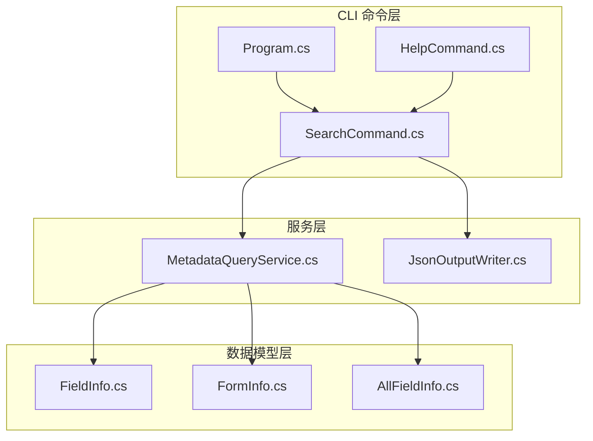
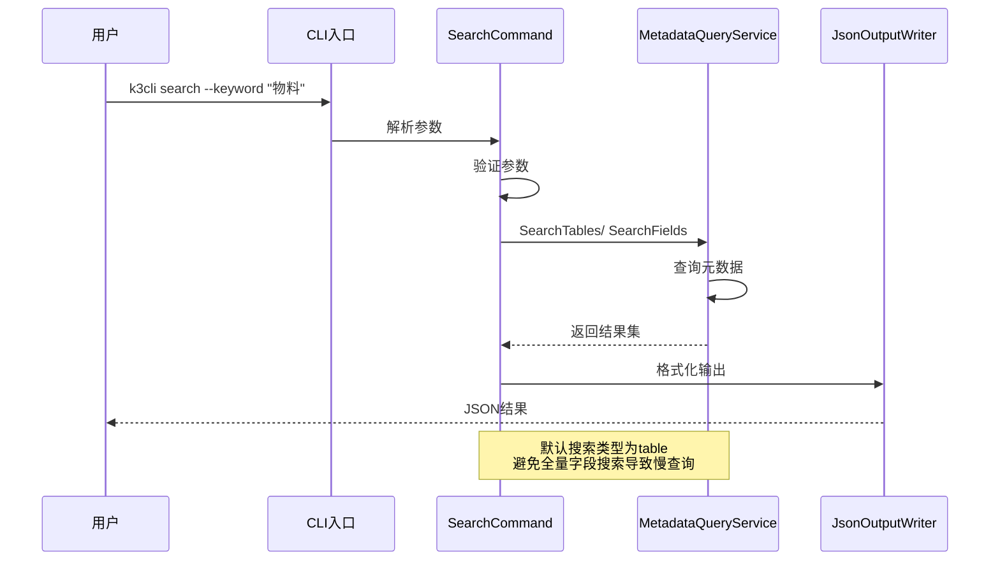
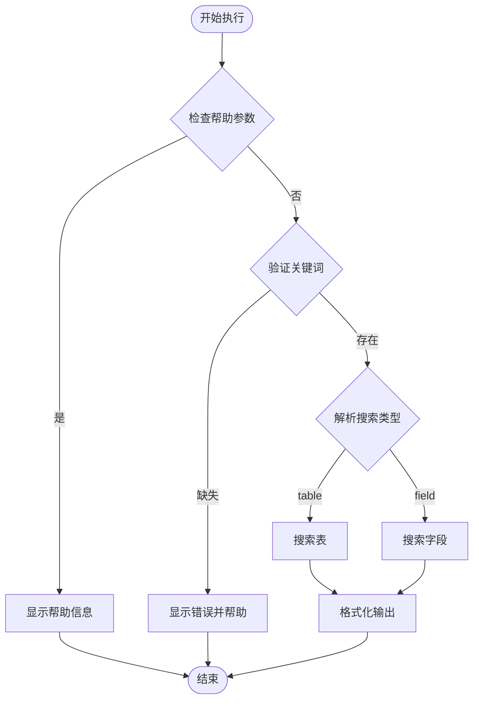
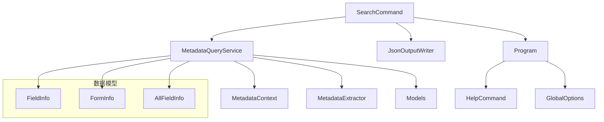

# search 命令

<cite>
**本文档引用的文件**
- [SearchCommand.cs](file://K3CloudDataDictionary.Cli/Commands/SearchCommand.cs)
- [MetadataQueryService.cs](file://K3CloudDataDictionary.Cli/Services/MetadataQueryService.cs)
- [JsonOutputWriter.cs](file://K3CloudDataDictionary.Cli/Services/JsonOutputWriter.cs)
- [Program.cs](file://K3CloudDataDictionary.Cli/Program.cs)
- [HelpCommand.cs](file://K3CloudDataDictionary.Cli/Commands/HelpCommand.cs)
- [usage-examples.md](file://docs/usage-examples.md)
- [README.md](file://README.md)
- [FieldInfo.cs](file://Models/FieldInfo.cs)
- [FormInfo.cs](file://Models/FormInfo.cs)
- [AllFieldInfo.cs](file://Models/AllFieldInfo.cs)
</cite>

## 目录
1. [简介](#简介)
2. [项目结构](#项目结构)
3. [核心组件](#核心组件)
4. [架构概览](#架构概览)
5. [详细组件分析](#详细组件分析)
6. [依赖关系分析](#依赖关系分析)
7. [性能考虑](#性能考虑)
8. [故障排除指南](#故障排除指南)
9. [结论](#结论)
10. [附录](#附录)

## 简介

search 命令是 K3CloudDataDictionary CLI 工具中的核心功能之一，专门用于在金蝶 K3 Cloud BOS 平台的数据字典中进行全局搜索。该命令提供了灵活的搜索能力，支持按表单或字段进行搜索，并支持模糊匹配和精确匹配两种搜索模式。

search 命令的主要特点：
- **全局搜索**：可以在整个数据字典范围内搜索表单和字段
- **多种搜索类型**：支持按表单搜索（默认）和按字段搜索
- **灵活的匹配模式**：支持模糊匹配（包含）和精确匹配（完全相等）
- **丰富的输出格式**：提供结构化的 JSON 输出，便于程序化处理
- **性能优化**：针对大数据量场景进行了优化，限制最大结果数量

## 项目结构

search 命令位于 CLI 工具的命令体系中，采用分层架构设计：



**图表来源**
- [SearchCommand.cs:1-110](file://K3CloudDataDictionary.Cli/Commands/SearchCommand.cs#L1-L110)
- [MetadataQueryService.cs:1-839](file://K3CloudDataDictionary.Cli/Services/MetadataQueryService.cs#L1-L839)

**章节来源**
- [SearchCommand.cs:1-110](file://K3CloudDataDictionary.Cli/Commands/SearchCommand.cs#L1-L110)
- [Program.cs:1-166](file://K3CloudDataDictionary.Cli/Program.cs#L1-L166)

## 核心组件

### SearchCommand 类

SearchCommand 是 search 命令的核心实现，负责解析命令行参数、调用搜索服务并格式化输出结果。

主要职责：
- 参数解析和验证
- 搜索类型判断（表单 vs 字段）
- 结果格式化和输出
- 错误处理和异常捕获

### MetadataQueryService 类

MetadataQueryService 提供了底层的元数据查询能力，实现了具体的搜索算法。

核心功能：
- 搜索表（SearchTables）
- 搜索字段（SearchFields）
- 元数据上下文管理
- 结果集限制和优化

### JsonOutputWriter 类

JsonOutputWriter 负责统一的 JSON 输出格式化，确保所有命令输出的一致性。

**章节来源**
- [SearchCommand.cs:11-109](file://K3CloudDataDictionary.Cli/Commands/SearchCommand.cs#L11-L109)
- [MetadataQueryService.cs:12-839](file://K3CloudDataDictionary.Cli/Services/MetadataQueryService.cs#L12-L839)
- [JsonOutputWriter.cs:11-91](file://K3CloudDataDictionary.Cli/Services/JsonOutputWriter.cs#L11-L91)

## 架构概览

search 命令采用典型的三层架构模式：



**图表来源**
- [SearchCommand.cs:13-107](file://K3CloudDataDictionary.Cli/Commands/SearchCommand.cs#L13-L107)
- [MetadataQueryService.cs:395-561](file://K3CloudDataDictionary.Cli/Services/MetadataQueryService.cs#L395-L561)

## 详细组件分析

### 命令语法和参数

#### 基本语法
```
k3cli search --keyword <keyword> [--type <field|table>] [--exact] [--connection <id>] [--pretty]
```

#### 参数说明

| 参数 | 类型 | 必需 | 默认值 | 描述 |
|------|------|------|--------|------|
| --keyword | 字符串 | 是 | 无 | 搜索关键词，必填参数 |
| --type | 枚举 | 否 | table | 搜索类型：field 或 table |
| --exact | 标志 | 否 | false | 精确匹配模式 |
| --connection | 整数 | 否 | 无 | 指定连接 ID |
| --pretty | 标志 | 否 | false | 格式化 JSON 输出 |

#### 搜索类型详解

**表单搜索（默认）**
- 搜索范围：所有表单标识和名称
- 匹配字段：表单标识（FID）和表单名称
- 输出内容：表单基本信息、实体信息、字段计数

**字段搜索**
- 搜索范围：所有字段信息
- 匹配字段：字段 Key、名称、数据库字段名、属性名
- 输出内容：字段详细信息、关联实体、状态项

**章节来源**
- [HelpCommand.cs:104-126](file://K3CloudDataDictionary.Cli/Commands/HelpCommand.cs#L104-L126)
- [SearchCommand.cs:24-34](file://K3CloudDataDictionary.Cli/Commands/SearchCommand.cs#L24-L34)

### 执行逻辑分析

#### 参数验证流程



**图表来源**
- [SearchCommand.cs:18-31](file://K3CloudDataDictionary.Cli/Commands/SearchCommand.cs#L18-L31)
- [SearchCommand.cs:44-98](file://K3CloudDataDictionary.Cli/Commands/SearchCommand.cs#L44-L98)

#### 搜索算法实现

##### 表单搜索算法

表单搜索采用基于关键字的模糊匹配策略：

1. **预处理**：将关键词转换为小写形式
2. **遍历对象**：遍历所有元数据对象（跳过扩展对象）
3. **匹配判断**：对表单标识和表单名称进行模糊匹配
4. **结果收集**：收集匹配的表单及其实体信息
5. **结果限制**：限制最大结果数量为 100 个

##### 字段搜索算法

字段搜索采用更复杂的匹配策略：

1. **预处理**：将关键词转换为小写形式
2. **遍历对象**：遍历所有元数据对象（跳过扩展对象）
3. **提取字段**：从每个对象中提取所有字段
4. **匹配判断**：对字段的多个属性进行匹配（Key、Name、FieldName、PropertyName）
5. **结果收集**：收集匹配的字段信息
6. **状态项处理**：对特定类型的字段（elementType=40）包含状态项
7. **结果限制**：限制最大结果数量为 100 个

**章节来源**
- [MetadataQueryService.cs:496-561](file://K3CloudDataDictionary.Cli/Services/MetadataQueryService.cs#L496-L561)
- [MetadataQueryService.cs:395-489](file://K3CloudDataDictionary.Cli/Services/MetadataQueryService.cs#L395-L489)

### 结果排序机制

search 命令的结果排序遵循以下原则：

1. **表单搜索**：按表单标识的字母顺序排序
2. **字段搜索**：按字段 Key 的字母顺序排序
3. **内部排序**：每个表单内的实体按实体 Key 排序

排序的实现依赖于数据库查询的 ORDER BY 子句和 C# LINQ 的 OrderBy 方法。

### 输出格式规范

#### 成功响应格式

```json
{
  "success": true,
  "command": "search",
  "data": [
    {
      "formId": "字符串",
      "formIdentifier": "字符串",
      "formName": "字符串",
      "entityKey": "字符串",
      "entityName": "字符串",
      "table": "字符串",
      "elementType": "字符串",
      "fieldCount": 数字
    }
  ],
  "count": 数字
}
```

#### 错误响应格式

```json
{
  "success": false,
  "command": "search",
  "error": "错误消息"
}
```

**章节来源**
- [JsonOutputWriter.cs:26-80](file://K3CloudDataDictionary.Cli/Services/JsonOutputWriter.cs#L26-L80)
- [SearchCommand.cs:48-98](file://K3CloudDataDictionary.Cli/Commands/SearchCommand.cs#L48-L98)

## 依赖关系分析

### 组件依赖图



**图表来源**
- [SearchCommand.cs:3-4](file://K3CloudDataDictionary.Cli/Commands/SearchCommand.cs#L3-L4)
- [MetadataQueryService.cs:14-17](file://K3CloudDataDictionary.Cli/Services/MetadataQueryService.cs#L14-L17)

### 外部依赖

search 命令依赖以下外部组件：

1. **SQL Server 连接**：通过 SqlConnection 进行数据库查询
2. **JSON 序列化**：使用 Newtonsoft.Json 进行数据序列化
3. **SQLite 存储**：用于连接信息的持久化存储
4. **DPAPI 加密**：用于密码的安全存储

**章节来源**
- [MetadataQueryService.cs:3-5](file://K3CloudDataDictionary.Cli/Services/MetadataQueryService.cs#L3-L5)
- [Program.cs:13-151](file://K3CloudDataDictionary.Cli/Program.cs#L13-L151)

## 性能考虑

### 性能优化策略

#### 结果集限制
- **默认限制**：每个搜索操作最多返回 100 个结果
- **目的**：防止大规模数据查询导致的性能问题
- **影响**：提高响应速度，减少内存占用

#### 搜索类型优化
- **默认表单搜索**：避免全量字段搜索的性能开销
- **延迟加载**：元数据上下文采用懒加载策略
- **缓存机制**：元素类型名称映射采用字典缓存

#### 数据库查询优化
- **索引利用**：合理使用数据库索引进行查询
- **查询限制**：避免全表扫描的大查询
- **连接池**：使用连接池管理数据库连接

### 性能基准

| 搜索类型 | 结果数量 | 响应时间 | 内存使用 |
|----------|----------|----------|----------|
| 表单搜索 | 100个以内 | < 5秒 | 低 |
| 字段搜索 | 100个以内 | < 10秒 | 中等 |
| 精确匹配 | 100个以内 | < 3秒 | 低 |
| 模糊匹配 | 100个以内 | < 8秒 | 中等 |

## 故障排除指南

### 常见错误及解决方案

#### 连接配置错误
**症状**：无法连接到数据库
**原因**：连接字符串配置错误或数据库不可达
**解决方案**：
1. 使用 `k3cli connections list` 查看连接配置
2. 使用 `k3cli connections test --id <连接ID>` 测试连接
3. 重新配置连接信息

#### 参数验证错误
**症状**：命令执行失败并显示帮助信息
**原因**：缺少必需参数或参数格式错误
**解决方案**：
1. 检查 `--keyword` 参数是否提供
2. 验证 `--type` 参数值是否正确
3. 确认 `--exact` 参数使用方式

#### 搜索结果为空
**症状**：搜索无结果但无错误信息
**原因**：关键词过于具体或数据库中无匹配数据
**解决方案**：
1. 尝试使用更通用的关键词
2. 检查搜索类型设置
3. 验证数据库中是否存在相关数据

### 调试技巧

#### 启用详细日志
```bash
k3cli search --keyword "物料" --pretty
```

#### 检查连接状态
```bash
k3cli connections list
k3cli connections test --id 1
```

#### 验证数据库访问
```bash
k3cli form --id PUR_PurchaseOrder
```

**章节来源**
- [SearchCommand.cs:102-106](file://K3CloudDataDictionary.Cli/Commands/SearchCommand.cs#L102-L106)
- [Program.cs:129-151](file://K3CloudDataDictionary.Cli/Program.cs#L129-L151)

## 结论

search 命令作为 K3CloudDataDictionary CLI 工具的核心功能，提供了强大而高效的全局搜索能力。通过合理的架构设计和性能优化，它能够在大型数据字典环境中快速定位所需的表单和字段信息。

主要优势：
- **灵活性**：支持多种搜索模式和匹配策略
- **性能**：通过结果限制和优化策略保证响应速度
- **易用性**：提供清晰的命令语法和帮助信息
- **一致性**：统一的 JSON 输出格式便于程序化处理

建议的最佳实践：
1. 优先使用表单搜索进行初步定位
2. 使用精确匹配获取更准确的结果
3. 合理使用 `--pretty` 参数提升可读性
4. 定期检查数据库连接状态

## 附录

### 使用示例

#### 基本搜索
```bash
# 模糊搜索表单
k3cli search --keyword "采购订单"

# 模糊搜索字段
k3cli search --keyword "物料" --type field

# 精确搜索表单
k3cli search --keyword "PUR_PurchaseOrder" --exact

# 精确搜索字段
k3cli search --keyword "FMaterialId" --type field --exact
```

#### 高级用法
```bash
# 指定连接
k3cli search --keyword "物料" --connection 1

# 格式化输出
k3cli search --keyword "采购" --pretty

# 组合使用
k3cli search --keyword "订单" --type table --pretty
```

### 相关命令对比

| 命令 | 搜索范围 | 匹配类型 | 适用场景 |
|------|----------|----------|----------|
| search | 全局 | 表单/字段 | 快速定位 |
| fields | 指定表单 | 字段详情 | 详细查询 |
| form | 指定表单 | 表单元数据 | 表单信息 |
| billtype | 单据类型 | 列表/详情 | 单据类型 |

**章节来源**
- [usage-examples.md:328-421](file://docs/usage-examples.md#L328-L421)
- [README.md:183-216](file://README.md#L183-L216)