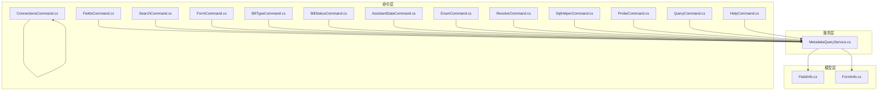
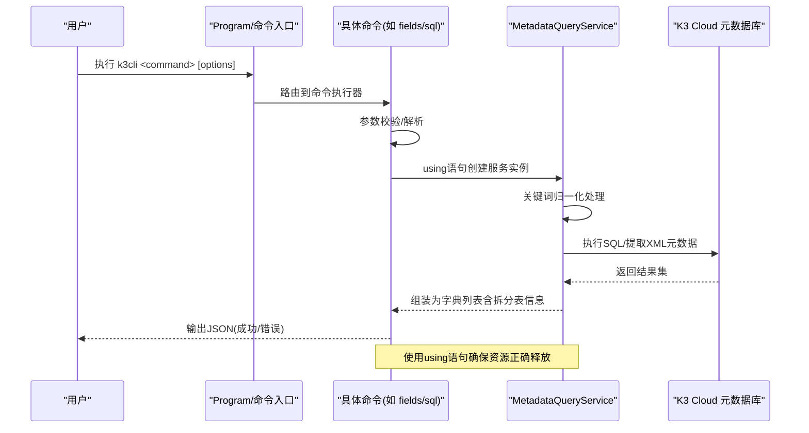
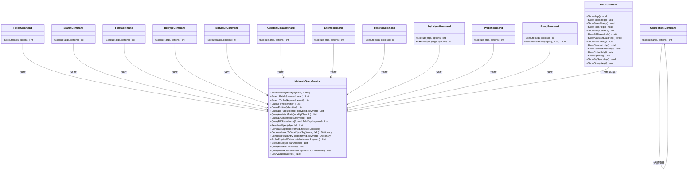

# 命令功能详解

<cite>
**本文引用的文件**
- [FieldsCommand.cs](file://K3CloudDataDictionary.Cli/Commands/FieldsCommand.cs)
- [SearchCommand.cs](file://K3CloudDataDictionary.Cli/Commands/SearchCommand.cs)
- [FormCommand.cs](file://K3CloudDataDictionary.Cli/Commands/FormCommand.cs)
- [BillTypeCommand.cs](file://K3CloudDataDictionary.Cli/Commands/BillTypeCommand.cs)
- [BillStatusCommand.cs](file://K3CloudDataDictionary.Cli/Commands/BillStatusCommand.cs)
- [AssistantDataCommand.cs](file://K3CloudDataDictionary.Cli/Commands/AssistantDataCommand.cs)
- [EnumCommand.cs](file://K3CloudDataDictionary.Cli/Commands/EnumCommand.cs)
- [ResolveCommand.cs](file://K3CloudDataDictionary.Cli/Commands/ResolveCommand.cs)
- [ConnectionsCommand.cs](file://K3CloudDataDictionary.Cli/Commands/ConnectionsCommand.cs)
- [SqlHelperCommand.cs](file://K3CloudDataDictionary.Cli/Commands/SqlHelperCommand.cs)
- [ProbeCommand.cs](file://K3CloudDataDictionary.Cli/Commands/ProbeCommand.cs)
- [QueryCommand.cs](file://K3CloudDataDictionary.Cli/Commands/QueryCommand.cs)
- [HelpCommand.cs](file://K3CloudDataDictionary.Cli/Commands/HelpCommand.cs)
- [MetadataQueryService.cs](file://K3CloudDataDictionary.Cli/Services/MetadataQueryService.cs)
- [FieldInfo.cs](file://Models/FieldInfo.cs)
- [FormInfo.cs](file://Models/FormInfo.cs)
</cite>

## 更新摘要
**所做更改**
- 更新了query命令的user-role-permissions子命令，现在在结果中包含FObjectNumber字段用于更好的业务对象标识
- 优化了底层查询逻辑，移除了不必要的T_SEC_PERMISSIONOBJECT表JOIN并修正表单过滤条件为o1.FID = @FormId
- 增强了用户角色权限查询的性能和准确性，支持按表单标识进行精确过滤

## 目录
1. [简介](#简介)
2. [项目结构](#项目结构)
3. [核心组件](#核心组件)
4. [架构总览](#架构总览)
5. [详细命令解析](#详细命令解析)
6. [依赖关系分析](#依赖关系分析)
7. [性能与限制](#性能与限制)
8. [故障排除指南](#故障排除指南)
9. [结论](#结论)
10. [附录：命令速查与组合使用](#附录命令速查与组合使用)

## 简介
本文件面向金蝶K3 Cloud数据字典命令行工具（k3cli）的使用者，系统性地梳理并解释以下命令的功能、参数、使用方法与输出格式：fields、search、form、billtype、billstatus、assistantdata、enum、resolve、connections、sql、probe、query。文档同时给出命令间的关系与常见组合使用场景，并提供错误处理与故障排除建议，帮助快速定位问题并正确使用工具。

**更新** 本次更新显著增强了工具的实用性和易用性，新增了sql命令的sync子命令用于头到明细同步，改进了billstatus命令的中文注释和常用标识功能，增强了fields命令的类型过滤能力，并全面改进了资源管理机制。特别新增了query命令的角色权限和用户权限查询功能，其中user-role-permissions子命令现在支持通过--form参数进行表单级别的权限过滤，并在结果中包含了FObjectNumber字段以提供更好的业务对象标识。

## 项目结构
- 命令层：位于 K3CloudDataDictionary.Cli/Commands，每个命令对应一个静态类，负责参数解析、调用服务与输出。
- 服务层：位于 K3CloudDataDictionary.Cli/Services，核心是 MetadataQueryService，封装对K3 Cloud元数据库的实时查询逻辑。
- 模型层：位于 Models，定义字段与表单等数据结构，便于UI与CLI共享。
- 帮助与入口：HelpCommand提供统一的帮助输出；Program负责参数解析与路由到具体命令。

**图表来源**
- [FieldsCommand.cs:15-164](file://K3CloudDataDictionary.Cli/Commands/FieldsCommand.cs#L15-L164)
- [SearchCommand.cs:13-126](file://K3CloudDataDictionary.Cli/Commands/SearchCommand.cs#L13-L126)
- [FormCommand.cs:13-97](file://K3CloudDataDictionary.Cli/Commands/FormCommand.cs#L13-L97)
- [BillTypeCommand.cs:13-68](file://K3CloudDataDictionary.Cli/Commands/BillTypeCommand.cs#L13-L68)
- [BillStatusCommand.cs:13-83](file://K3CloudDataDictionary.Cli/Commands/BillStatusCommand.cs#L13-L83)
- [AssistantDataCommand.cs:13-67](file://K3CloudDataDictionary.Cli/Commands/AssistantDataCommand.cs#L13-L67)
- [EnumCommand.cs:13-66](file://K3CloudDataDictionary.Cli/Commands/EnumCommand.cs#L13-L66)
- [ResolveCommand.cs:13-65](file://K3CloudDataDictionary.Cli/Commands/ResolveCommand.cs#L13-L65)
- [ConnectionsCommand.cs:15-403](file://K3CloudDataDictionary.Cli/Commands/ConnectionsCommand.cs#L15-L403)
- [SqlHelperCommand.cs:14-113](file://K3CloudDataDictionary.Cli/Commands/SqlHelperCommand.cs#L14-L113)
- [ProbeCommand.cs:14-112](file://K3CloudDataDictionary.Cli/Commands/ProbeCommand.cs#L14-L112)
- [QueryCommand.cs:17-275](file://K3CloudDataDictionary.Cli/Commands/QueryCommand.cs#L17-L275)
- [HelpCommand.cs:10-556](file://K3CloudDataDictionary.Cli/Commands/HelpCommand.cs#L10-L556)
- [MetadataQueryService.cs:31-2168](file://K3CloudDataDictionary.Cli/Services/MetadataQueryService.cs#L31-L2168)

章节来源
- [HelpCommand.cs:10-556](file://K3CloudDataDictionary.Cli/Commands/HelpCommand.cs#L10-L556)

## 核心组件
- 命令执行器：各命令类的 Execute 方法负责参数校验、调用服务、构建输出并返回退出码。
- 元数据查询服务：MetadataQueryService 封装了对K3 Cloud元数据库的查询逻辑，包括字段、表、单据类型、枚举、辅助资料、单据状态等。
- 输出格式：统一通过 JsonOutputWriter 写入标准JSON结构，包含命令名与数据主体，必要时包含嵌套对象（如字段的statusItems）。

**更新** 现在支持更强大的关键词归一化和模糊匹配，以及拆分表的自动识别和处理，新增了sql命令的sync子命令用于头到明细同步，并全面改进了资源管理机制。特别增强了query命令的权限查询功能，其中user-role-permissions子命令现在支持按表单标识进行精确过滤，并在结果中包含FObjectNumber字段以提供更好的业务对象标识。

章节来源
- [FieldsCommand.cs:15-164](file://K3CloudDataDictionary.Cli/Commands/FieldsCommand.cs#L15-L164)
- [SqlHelperCommand.cs:14-113](file://K3CloudDataDictionary.Cli/Commands/SqlHelperCommand.cs#L14-L113)
- [MetadataQueryService.cs:31-45](file://K3CloudDataDictionary.Cli/Services/MetadataQueryService.cs#L31-L45)

## 架构总览
命令层通过 MetadataQueryService 访问K3 Cloud元数据库，实现对表单、字段、单据类型、枚举、辅助资料、单据状态等的查询。输出统一为JSON，便于脚本化处理与二次加工。

**图表来源**
- [FieldsCommand.cs:49-129](file://K3CloudDataDictionary.Cli/Commands/FieldsCommand.cs#L49-L129)
- [SqlHelperCommand.cs:47-56](file://K3CloudDataDictionary.Cli/Commands/SqlHelperCommand.cs#L47-L56)
- [MetadataQueryService.cs:31-45](file://K3CloudDataDictionary.Cli/Services/MetadataQueryService.cs#L31-L45)
- [MetadataQueryService.cs:339-538](file://K3CloudDataDictionary.Cli/Services/MetadataQueryService.cs#L339-L538)

## 详细命令解析

### 命令：fields（查询表单字段）
- 功能概述：查询指定表单的字段信息，支持按实体过滤与关键词搜索（模糊/精确），新增对比模式和类型过滤功能。
- 必选参数
  - --form <identifier>：表单标识（如单据或基础资料的标识符）
- 可选参数
  - --entity <key>：实体Key（如主分录、明细等）
  - --keyword <keyword>：字段关键词（支持多关键词，逗号/分号分隔，模糊/精确匹配）
  - --exact, -e：精确匹配模式（完全相等）
  - --type <type>：字段类型过滤（entry/head/oid/normal）
  - --compare：对比模式，对比单据头和明细体字段差异
  - --physical：物理列模式，只输出物理列名列表
  - --connection, -c <id>：指定连接ID
  - --pretty：格式化输出
- 输出结构要点
  - 包含表单名、实体名、表名、字段键、显示名、数据库字段名、属性名、元素类型、标签、Lookup对象ID、枚举类型、分隔后缀、拆分表信息、更新动作计数等。
  - 当字段元素类型为40（单据状态）时，嵌套 statusItems（状态值与名称）。
  - 新增 splitTable 字段，显示拆分表的完整表名。
- 使用示例
  - 查询全部字段：k3cli fields --form PUR_PurchaseOrder
  - 按实体过滤：k3cli fields --form PUR_PurchaseOrder --entity FK_BillEntry
  - 模糊搜索：k3cli fields --form PUR_PurchaseOrder --keyword 物料
  - 多关键词搜索：k3cli fields --form PUR_PurchaseOrder --keyword 物料,供应商,日期
  - 精确搜索：k3cli fields --form PUR_PurchaseOrder --keyword FMaterialId --exact
  - 类型过滤：k3cli fields --form PUR_PurchaseOrder --type head
  - 对比模式：k3cli fields --form PUR_Requisition --compare
  - 物理列模式：k3cli fields --form PRD_PickMtrl --entity FEntity --physical
- 实际应用场景
  - 开发集成：获取字段映射与元素类型，辅助生成DTO或前端控件配置。
  - 审计与排障：定位特定字段（如物料、供应商）所在表单与实体。
  - 字段同步：通过对比模式快速了解头/明细字段分布。

**更新** 新增多关键词搜索、类型过滤和对比模式，支持更灵活的字段查询需求。类型过滤支持entry（明细实体）、head（头部实体）、oid（OID相关字段）、normal（普通业务字段）四种类型。全面改进了资源管理，使用using语句确保服务实例正确释放。

章节来源
- [FieldsCommand.cs:15-164](file://K3CloudDataDictionary.Cli/Commands/FieldsCommand.cs#L15-L164)
- [MetadataQueryService.cs:339-538](file://K3CloudDataDictionary.Cli/Services/MetadataQueryService.cs#L339-L538)

### 命令：search（模糊搜索字段或表）
- 功能概述：在字段或表层面进行模糊/精确搜索，支持限制返回数量，增强关键词匹配能力。
- 必选参数
  - --keyword <keyword>：搜索关键词
- 可选参数
  - --type <field|table>：搜索类型，默认 table（避免全量字段搜索导致慢查询）
  - --exact, -e：精确匹配模式
  - --limit <n>：最大返回结果数（默认100）
  - --connection, -c <id>：指定连接ID
  - --pretty：格式化输出
- 输出结构要点
  - type=table：返回表单标识、实体名、表名、元素类型、字段计数等。
  - type=field：返回字段级信息，包含状态项嵌套（当elementType=40时）。
  - 新增拆分表信息，支持更准确的字段定位。
- 使用示例
  - 搜索表：k3cli search --keyword PO_Order --type table
  - 搜索字段：k3cli search --keyword FMaterialId --type field
  - 精确搜索：k3cli search --keyword 物料 -e --type field
  - 限制结果：k3cli search --keyword 物料 --limit 50
- 实际应用场景
  - 快速定位目标表单或字段，结合 fields/form 命令进一步细化。

**更新** 改进了关键词匹配算法，支持更好的容错处理和拆分表识别。新增limit参数控制返回数量，全面改进了资源管理机制。

章节来源
- [SearchCommand.cs:13-126](file://K3CloudDataDictionary.Cli/Commands/SearchCommand.cs#L13-L126)
- [MetadataQueryService.cs:551-656](file://K3CloudDataDictionary.Cli/Services/MetadataQueryService.cs#L551-L656)

### 命令：form（查询表单元数据）
- 功能概述：查询指定表单的基础信息与实体列表（插件、服务规则、操作等计数来自完整元数据提取）。
- 必选参数
  - --id <identifier>：表单标识
- 可选参数
  - --connection, -c <id>：指定连接ID
  - --pretty：格式化输出
- 输出结构要点
  - 表单基本信息：表单ID、标识、名称、模型类型、子系统、各类插件计数、服务规则计数、更新动作计数、表单操作计数。
  - 实体列表：实体Key、实体名、表名、条目名、元素类型、服务规则计数等。
- 使用示例
  - k3cli form --id PUR_PurchaseOrder
- 实际应用场景
  - 了解表单整体构成与复杂度，辅助设计与优化。

**更新** 全面改进了资源管理，使用using语句确保MetadataQueryService实例的正确释放。

章节来源
- [FormCommand.cs:13-97](file://K3CloudDataDictionary.Cli/Commands/FormCommand.cs#L13-L97)
- [MetadataQueryService.cs:223-330](file://K3CloudDataDictionary.Cli/Services/MetadataQueryService.cs#L223-L330)

### 命令：billtype（查询单据类型）
- 功能概述：支持按表单查询单据类型列表，或按ID/关键词查询详情。
- 可选参数
  - --form <identifier>：按表单查询列表
  - --id <billTypeId>：按ID精确查询
  - --keyword <keyword>：按编码/名称/描述模糊查询
  - --connection, -c <id>：指定连接ID
  - --pretty：格式化输出
- 输出结构要点
  - 输出字段：单据类型ID、表单ID、编号、名称、描述。
- 使用示例
  - 查询列表：k3cli billtype --form PUR_PurchaseOrder
  - 精确查询：k3cli billtype --id <billTypeId>
  - 模糊搜索：k3cli billtype --keyword 采购
- 实际应用场景
  - 业务字典维护、单据映射与流程配置。

**更新** 全面改进了资源管理，使用using语句确保服务实例的正确释放。

章节来源
- [BillTypeCommand.cs:13-68](file://K3CloudDataDictionary.Cli/Commands/BillTypeCommand.cs#L13-L68)
- [MetadataQueryService.cs:736-797](file://K3CloudDataDictionary.Cli/Services/MetadataQueryService.cs#L736-L797)

### 命令：billstatus（查询单据状态字段枚举值）
- 功能概述：查询单据状态字段（elementType=40）的枚举值集合，支持按字段Key或关键词过滤，新增中文注释和常用标识。
- 必选参数
  - --form <identifier>：表单标识
- 可选参数
  - --field <fieldKey>：字段Key（精确匹配）
  - --keyword <keyword>：关键词（模糊匹配状态名称/值）
  - --connection, -c <id>：指定连接ID
  - --pretty：格式化输出
- 输出结构要点
  - 返回字段级信息，并嵌套 statusItems（状态值与名称、中文注释、常用标识）。
  - 常见状态值（Z暂存、A待审核、C已审核、E已驳回）会标记"← 常用"。
- 使用示例
  - 查询全部：k3cli billstatus --form PUR_PurchaseOrder
  - 指定字段：k3cli billstatus --form PUR_PurchaseOrder --field FDocumentStatus
  - 模糊搜索状态：k3cli billstatus --form PUR_PurchaseOrder --keyword 已审核
- 实际应用场景
  - 状态机设计、工作流配置与报表筛选。

**更新** 新增中文注释和常用标识功能，提供更丰富的状态信息。状态值会自动添加中文注释，常用状态会标记"← 常用"标识。全面改进了资源管理机制。

章节来源
- [BillStatusCommand.cs:13-83](file://K3CloudDataDictionary.Cli/Commands/BillStatusCommand.cs#L13-L83)
- [MetadataQueryService.cs:100-128](file://K3CloudDataDictionary.Cli/Services/MetadataQueryService.cs#L100-L128)
- [MetadataQueryService.cs:903-992](file://K3CloudDataDictionary.Cli/Services/MetadataQueryService.cs#L903-L992)

### 命令：assistantdata（查询辅助资料列表）
- 功能概述：查询指定辅助资料（Lookup对象）的明细数据。
- 必选参数
  - --id <lookUpObjectId>：辅助资料ID（即字段的LookUpObjectID）
- 可选参数
  - --connection, -c <id>：指定连接ID
  - --pretty：格式化输出
- 输出结构要点
  - 输出字段：ID、编码、名称、分录ID、分录编码、数据值。
- 使用示例
  - k3cli assistantdata --id <lookUpObjectId>
- 实际应用场景
  - 辅助资料字典核对、导入导出准备。

**更新** 全面改进了资源管理，使用using语句确保服务实例的正确释放。

章节来源
- [AssistantDataCommand.cs:13-67](file://K3CloudDataDictionary.Cli/Commands/AssistantDataCommand.cs#L13-L67)
- [MetadataQueryService.cs:803-846](file://K3CloudDataDictionary.Cli/Services/MetadataQueryService.cs#L803-L846)

### 命令：enum（查询枚举值列表）
- 功能概述：查询指定枚举类型（elementType=9）的所有枚举项。
- 必选参数
  - --id <enumTypeId>：枚举类型ID（即字段的EnumType/FEnumType）
- 可选参数
  - --connection, -c <id>：指定连接ID
  - --pretty：格式化输出
- 输出结构要点
  - 输出字段：ID、名称、值、枚举项ID、标题。
- 使用示例
  - k3cli enum --id <enumTypeId>
- 实际应用场景
  - 下拉框数据源准备、字段取值规范。

**更新** 全面改进了资源管理，使用using语句确保服务实例的正确释放。

章节来源
- [EnumCommand.cs:13-66](file://K3CloudDataDictionary.Cli/Commands/EnumCommand.cs#L13-L66)
- [MetadataQueryService.cs:852-894](file://K3CloudDataDictionary.Cli/Services/MetadataQueryService.cs#L852-L894)

### 命令：resolve（解析对象ID对应的表单）
- 功能概述：根据Lookup对象ID反查其对应的表单信息（用于从lookUpObject回溯到表单）。
- 必选参数
  - --id <objectId>：对象ID（即字段的lookUpObject值）
- 可选参数
  - --connection, -c <id>：指定连接ID
  - --pretty：格式化输出
- 输出结构要点
  - 输出字段：查找ID、表单ID、表名、主键字段名、原始字段名。
- 使用示例
  - k3cli resolve --id 6099b796-9e56-434e-895e-a1628d12d4c2
- 实际应用场景
  - 字段溯源、跨模块映射。

**更新** 全面改进了资源管理，使用using语句确保服务实例的正确释放。

章节来源
- [ResolveCommand.cs:13-65](file://K3CloudDataDictionary.Cli/Commands/ResolveCommand.cs#L13-L65)
- [MetadataQueryService.cs:134-173](file://K3CloudDataDictionary.Cli/Services/MetadataQueryService.cs#L134-L173)

### 命令：connections（管理数据库连接）
- 功能概述：连接管理子命令，支持列出、新增、测试、设置默认连接。
- 子命令
  - list：列出所有连接（含上次成功连接时间）
  - add：新增连接（--server/--db/--user 必填，--port默认1433，--default可同时设为默认）
  - update --id <id>：修改已有连接的信息
  - delete --id <id>：删除指定连接（支持 --force 跳过确认）
  - test [--id <id>]：测试指定连接（不指定则测试默认连接）
  - get-connection-string --id <id>：获取连接字符串
  - set-default --id <id>：设为默认连接
- 输出结构要点
  - list：连接列表（含ID、名称、服务器、数据库、用户、是否默认、显示名、最后成功连接时间）
  - add：新增连接的ID、名称、服务器、数据库、用户、是否默认、消息
  - test：连接ID、名称、服务器、数据库、成功标志与消息
  - set-default：连接ID、名称、数据库、设为默认后的消息
- 使用示例
  - k3cli connections list
  - k3cli connections add --server 192.168.1.100 --db AISC001 --user sa --password xxx --default
  - k3cli connections update --id 1 --server 192.168.1.200
  - k3cli connections delete --id 2 --force
  - k3cli connections test --id 1
  - k3cli connections get-connection-string --id 1
  - k3cli connections set-default --id 1
- 实际应用场景
  - 多租户或多实例环境下的连接切换与验证。

**更新** 新增update、delete和get-connection-string子命令，支持更完整的连接生命周期管理。

章节来源
- [ConnectionsCommand.cs:15-403](file://K3CloudDataDictionary.Cli/Commands/ConnectionsCommand.cs#L15-L403)

### 新增命令：sql（生成SQL辅助信息）
- 功能概述：根据指定的表单和字段，自动生成SQL辅助信息，包括物理表名、列名、JOIN条件、行号字段、SQL模板、LK关联表提示等。
- 必选参数
  - --form <identifier>：表单标识
  - --fields <field1,field2>：逗号分隔的字段列表（支持中文名或英文key）
- 可选参数
  - --connection, -c <id>：指定连接ID
  - --pretty：格式化输出
- 子命令
  - sync：生成单据头→明细字段批量同步SQL
    - 用法：k3cli sql sync --form <identifier> --field <keyword>
    - 示例：k3cli sql sync --form PUR_Requisition --field 追加采购原因
- 使用示例
  - 基本用法：k3cli sql --form PUR_PurchaseOrder --fields "累计收料数量,剩余收料数量"
  - 拆分表字段：k3cli sql --form PUR_PurchaseOrder --fields "最终确认交期"
  - 同步SQL：k3cli sql sync --form PUR_Requisition --field 追加采购原因
- 实际应用场景
  - 快速生成查询和更新SQL，自动处理拆分表和LK关联表。

**新增** 这是全新的命令，大幅简化了复杂SQL的编写过程。sync子命令专门用于头到明细字段的数据同步。全面改进了资源管理机制。

章节来源
- [SqlHelperCommand.cs:14-113](file://K3CloudDataDictionary.Cli/Commands/SqlHelperCommand.cs#L14-L113)
- [HelpCommand.cs:410-447](file://K3CloudDataDictionary.Cli/Commands/HelpCommand.cs#L410-L447)
- [MetadataQueryService.cs:1865-2003](file://K3CloudDataDictionary.Cli/Services/MetadataQueryService.cs#L1865-L2003)

### 新增命令：probe（探测物理表列）
- 功能概述：直接查询物理表的列信息，支持通配符匹配拆分表，不受字典覆盖范围限制。
- 必选参数
  - --table <tableName>：物理表名（支持 * 通配符）
- 可选参数
  - --keyword <keyword>：列名关键词（可选），模糊匹配
  - --connection, -c <id>：指定连接ID
  - --pretty：格式化输出
- 使用示例
  - 单表探测：k3cli probe --table t_PUR_POOrderEntry --keyword BASE
  - 批量匹配拆分表：k3cli probe --table "t_PUR_POOrderEntry*" --keyword FDELIVERYDATE
- 实际应用场景
  - 当字典中查不到某个字段时，直接使用此命令查询物理表列信息。

**新增** 这是全新的命令，用于绕过字典限制直接查询数据库物理结构。全面改进了资源管理机制。

章节来源
- [HelpCommand.cs:353-375](file://K3CloudDataDictionary.Cli/Commands/HelpCommand.cs#L353-375)
- [ProbeCommand.cs:14-112](file://K3CloudDataDictionary.Cli/Commands/ProbeCommand.cs#L14-L112)
- [MetadataQueryService.cs:997-1097](file://K3CloudDataDictionary.Cli/Services/MetadataQueryService.cs#L997-L1097)

### 新增命令：query（常用代码查询）
- 功能概述：快速调用预定义的SQL查询，返回业务数据。支持临时只读查询。
- 可用查询
  - list：列出所有可用查询
  - user-licenses：查询用户许可分配（组织、用户、许可分组）
  - blocking：查询数据库阻塞/死锁进程信息
  - mo-pick-summary：查询生产领料汇总
  - mo-return-summary：查询生产退料汇总
  - mo-instock-summary：查询生产入库汇总
  - bill-by-no：按单据编号查询单据
  - role-permissions：查询角色权限
  - user-role-permissions：查询用户角色权限（支持--form参数过滤）
  - --sql：临时只读查询（仅允许SELECT语句）
- 使用示例
  - 列出查询：k3cli query list
  - 查询用户许可：k3cli query user-licenses --org "荣耀" --user "Harrison"
  - 查询阻塞进程：k3cli query blocking --pretty
  - 查询角色权限：k3cli query role-permissions --pretty
  - 查询用户角色权限：k3cli query user-role-permissions --user 110792 --pretty
  - **新增** 按表单过滤用户角色权限：k3cli query user-role-permissions --user 110792 --form AP_Payable --pretty
  - 临时查询：k3cli query --sql "SELECT TOP 10 * FROM T_BD_Contact"
- 实际应用场景
  - 快速诊断和监控数据库状态。
  - 权限管理和审计分析。

**更新** 新增了role-permissions和user-role-permissions两个重要权限查询功能。role-permissions用于查询各角色的功能权限明细，包括业务领域、子系统、业务对象、权限项、权限状态等信息。**特别更新** user-role-permissions子命令现在支持--form参数，可以按表单标识进行精确的权限查询过滤，并且在结果中包含了FObjectNumber字段用于更好的业务对象标识。这大大提升了权限审计和分析的效率。底层查询逻辑已优化，移除了不必要的T_SEC_PERMISSIONOBJECT表JOIN并修正了表单过滤条件为o1.FID = @FormId，提高了查询性能和准确性。全面改进了资源管理机制。

章节来源
- [HelpCommand.cs:449-490](file://K3CloudDataDictionary.Cli/Commands/HelpCommand.cs#L449-490)
- [QueryCommand.cs:17-275](file://K3CloudDataDictionary.Cli/Commands/QueryCommand.cs#L17-275)
- [MetadataQueryService.cs:2322-2484](file://K3CloudDataDictionary.Cli/Services/MetadataQueryService.cs#L2322-L2484)

## 依赖关系分析

**图表来源**
- [FieldsCommand.cs:15-164](file://K3CloudDataDictionary.Cli/Commands/FieldsCommand.cs#L15-L164)
- [SearchCommand.cs:13-126](file://K3CloudDataDictionary.Cli/Commands/SearchCommand.cs#L13-L126)
- [FormCommand.cs:13-97](file://K3CloudDataDictionary.Cli/Commands/FormCommand.cs#L13-L97)
- [BillTypeCommand.cs:13-68](file://K3CloudDataDictionary.Cli/Commands/BillTypeCommand.cs#L13-L68)
- [BillStatusCommand.cs:13-83](file://K3CloudDataDictionary.Cli/Commands/BillStatusCommand.cs#L13-L83)
- [AssistantDataCommand.cs:13-67](file://K3CloudDataDictionary.Cli/Commands/AssistantDataCommand.cs#L13-L67)
- [EnumCommand.cs:13-66](file://K3CloudDataDictionary.Cli/Commands/EnumCommand.cs#L13-L66)
- [ResolveCommand.cs:13-65](file://K3CloudDataDictionary.Cli/Commands/ResolveCommand.cs#L13-L65)
- [ConnectionsCommand.cs:15-403](file://K3CloudDataDictionary.Cli/Commands/ConnectionsCommand.cs#L15-L403)
- [SqlHelperCommand.cs:14-113](file://K3CloudDataDictionary.Cli/Commands/SqlHelperCommand.cs#L14-L113)
- [ProbeCommand.cs:14-112](file://K3CloudDataDictionary.Cli/Commands/ProbeCommand.cs#L14-L112)
- [QueryCommand.cs:17-275](file://K3CloudDataDictionary.Cli/Commands/QueryCommand.cs#L17-275)
- [HelpCommand.cs:10-556](file://K3CloudDataDictionary.Cli/Commands/HelpCommand.cs#L10-L556)
- [MetadataQueryService.cs:31-2168](file://K3CloudDataDictionary.Cli/Services/MetadataQueryService.cs#L31-L2168)

## 性能与限制
- 上下文加载：首次查询会初始化元数据上下文并加载对象基础信息与元素类型映射，可能有一定延迟。
- 结果数量限制：搜索字段/表默认限制返回100条，避免大规模输出影响性能。
- LK表检测：批量检测LK关联表时使用短超时（5秒）和缓存机制，避免长时间等待。
- 建议
  - 优先使用精确参数（如 --entity、--field、--id）缩小范围。
  - 在批量场景中配合 --pretty 与管道重定向输出，便于后续处理。
  - 对于大型数据库，建议使用 --type table 进行搜索以避免全量字段扫描。
  - 使用 --limit 参数控制搜索结果数量。

**更新** 新增了LK表检测的超时保护和缓存机制，提升了大数据量场景下的性能表现。全面改进了资源管理机制，确保服务实例的正确释放。特别增强了权限查询功能的性能优化，其中user-role-permissions的--form参数可以有效减少查询结果集大小，并且通过移除不必要的表JOIN和优化查询条件来提升查询效率。

章节来源
- [MetadataQueryService.cs:31-45](file://K3CloudDataDictionary.Cli/Services/MetadataQueryService.cs#L31-L45)
- [MetadataQueryService.cs:642-656](file://K3CloudDataDictionary.Cli/Services/MetadataQueryService.cs#L642-L656)
- [MetadataQueryService.cs:1167-1230](file://K3CloudDataDictionary.Cli/Services/MetadataQueryService.cs#L1167-L1230)

## 故障排除指南
- 常见错误
  - 缺少必填参数：命令会输出"缺少必填参数"并展示帮助。
  - 未找到表单/实体：例如 form 命令找不到表单时会提示。
  - 连接失败：connections test 会返回测试结果与错误信息。
  - 关键词未匹配：可能是字典未收录，可使用 probe 命令直接查询物理表。
  - SQL安全校验失败：query --sql 命令会拒绝非SELECT语句和危险关键词。
  - **新增** 表单标识无效：user-role-permissions的--form参数需要有效的表单标识。
- 排查步骤
  - 确认连接ID有效且可连通：使用 connections test --id <id>。
  - 检查表单/字段标识是否正确：先用 search 或 form fields 获取准确标识。
  - 控制搜索范围：使用 --entity、--field、--exact 等参数缩小范围。
  - 关注超时与限制：若无结果，检查是否命中默认100条限制或搜索类型是否合适。
  - 处理LK表检测超时：如果LK表检测超时，可使用 probe 命令手动验证关联表存在性。
  - 验证SQL安全性：使用 query --sql 时确保只包含SELECT语句，避免危险关键词。
  - **新增** 验证表单标识：使用 user-role-permissions的--form参数时，确保传入的是有效的表单标识。
- 日志与输出
  - 命令执行过程中可能输出加载进度与异常信息，便于定位问题。
  - 新命令（probe/sql/query）提供详细的错误信息和解决建议。
  - 资源管理改进后，异常情况下的资源释放更加可靠。

**更新** 新增了针对新命令的故障排除指导，特别是LK表检测超时的处理方法，以及SQL安全校验失败的解决方案。全面改进了错误处理和资源管理机制。特别增加了权限查询相关的故障排除指导，包括user-role-permissions的--form参数验证和FObjectNumber字段的使用说明。

章节来源
- [FormCommand.cs:40-44](file://K3CloudDataDictionary.Cli/Commands/FormCommand.cs#L40-L44)
- [ConnectionsCommand.cs:281-403](file://K3CloudDataDictionary.Cli/Commands/ConnectionsCommand.cs#L281-L403)
- [QueryCommand.cs:218-272](file://K3CloudDataDictionary.Cli/Commands/QueryCommand.cs#L218-L272)
- [MetadataQueryService.cs:1500-1514](file://K3CloudDataDictionary.Cli/Services/MetadataQueryService.cs#L1500-L1514)

## 结论
本工具围绕K3 Cloud元数据提供了覆盖字段、表单、单据类型、枚举、辅助资料与单据状态的查询能力，命令参数清晰、输出标准化，适合开发、运维与业务人员在不同阶段使用。通过合理组合命令与参数，可高效完成数据字典的探索、审计与集成准备工作。

**更新** 本次更新显著增强了工具的实用性和易用性，新增的命令和增强的功能为用户提供了更强大的数据处理能力，特别是在处理复杂拆分表和LK关联表场景下表现出色。sql命令的sync子命令为头到明细数据同步提供了便捷的解决方案。特别新增了query命令的权限查询功能，其中user-role-permissions子命令现在支持通过--form参数进行精确的表单级别权限过滤，并在结果中包含FObjectNumber字段以提供更好的业务对象标识，为权限管理和安全审计提供了强有力的支持。底层查询逻辑已优化，移除了不必要的表JOIN并修正了查询条件，提升了查询性能和准确性。全面改进了资源管理机制，确保应用程序的稳定性和可靠性。

## 附录：命令速查与组合使用
- 快速定位字段
  - k3cli search --keyword 物料 --type field
  - k3cli fields --form PUR_PurchaseOrder --keyword FMaterialId --exact
  - k3cli fields --form PUR_PurchaseOrder --keyword 物料,供应商,日期
  - k3cli fields --form PUR_PurchaseOrder --type head
- 查看表单与实体
  - k3cli form --id PUR_PurchaseOrder
- 单据类型与状态
  - k3cli billtype --form PUR_PurchaseOrder
  - k3cli billstatus --form PUR_PurchaseOrder --field FDocumentStatus
- 枚举与辅助资料
  - k3cli enum --id <enumTypeId>
  - k3cli assistantdata --id <lookUpObjectId>
- Lookup对象反查
  - k3cli resolve --id <lookUpObjectId>
- 连接管理
  - k3cli connections list
  - k3cli connections add --server ... --db ... --user ...
  - k3cli connections test --id 1
  - k3cli connections update --id 1 --server newhost
  - k3cli connections delete --id 2 --force
  - k3cli connections get-connection-string --id 1
- 高级功能
  - k3cli probe --table "t_PUR_POOrderEntry*" --keyword FDELIVERYDATE
  - k3cli sql --form PUR_PurchaseOrder --fields "累计收料数量,剩余收料数量"
  - k3cli sql sync --form PUR_Requisition --field 追加采购原因
  - k3cli query user-licenses --org "荣耀" --user "Harrison"
  - k3cli query --sql "SELECT TOP 10 * FROM T_BD_Contact"
  - k3cli fields --form PUR_Requisition --compare
- 权限管理功能
  - k3cli query role-permissions --pretty
  - k3cli query user-role-permissions --user 110792 --pretty
  - k3cli query user-role-permissions --pretty
  - **新增** 按表单过滤用户角色权限：k3cli query user-role-permissions --user 110792 --form AP_Payable --pretty
  - **新增** 查看包含FObjectNumber字段的权限结果，用于更好的业务对象标识

**更新** 新增了probe、sql、query等命令的使用示例，以及更多高级功能的组合使用方式。特别强调了sql sync命令在头到明细数据同步中的应用，以及query命令的临时查询功能和新增的权限查询功能。新增了权限管理相关的命令使用示例，特别是user-role-permissions的--form参数使用示例和FObjectNumber字段的重要性。

章节来源
- [HelpCommand.cs:10-556](file://K3CloudDataDictionary.Cli/Commands/HelpCommand.cs#L10-L556)