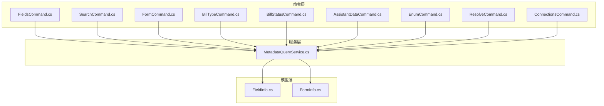
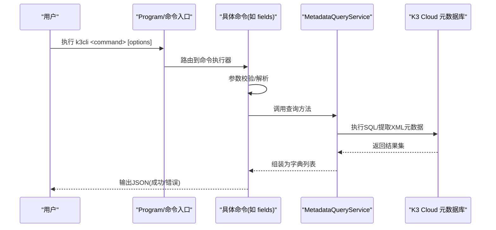
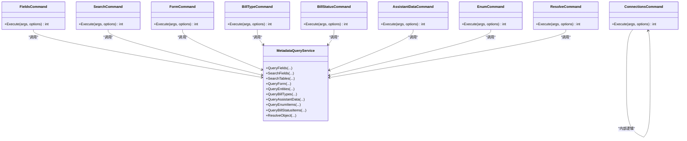

# 命令功能详解

<cite>
**本文引用的文件**
- [FieldsCommand.cs](file://K3CloudDataDictionary.Cli/Commands/FieldsCommand.cs)
- [SearchCommand.cs](file://K3CloudDataDictionary.Cli/Commands/SearchCommand.cs)
- [FormCommand.cs](file://K3CloudDataDictionary.Cli/Commands/FormCommand.cs)
- [BillTypeCommand.cs](file://K3CloudDataDictionary.Cli/Commands/BillTypeCommand.cs)
- [BillStatusCommand.cs](file://K3CloudDataDictionary.Cli/Commands/BillStatusCommand.cs)
- [AssistantDataCommand.cs](file://K3CloudDataDictionary.Cli/Commands/AssistantDataCommand.cs)
- [EnumCommand.cs](file://K3CloudDataDictionary.Cli/Commands/EnumCommand.cs)
- [ResolveCommand.cs](file://K3CloudDataDictionary.Cli/Commands/ResolveCommand.cs)
- [ConnectionsCommand.cs](file://K3CloudDataDictionary.Cli/Commands/ConnectionsCommand.cs)
- [MetadataQueryService.cs](file://K3CloudDataDictionary.Cli/Services/MetadataQueryService.cs)
- [HelpCommand.cs](file://K3CloudDataDictionary.Cli/Commands/HelpCommand.cs)
- [FieldInfo.cs](file://Models/FieldInfo.cs)
- [FormInfo.cs](file://Models/FormInfo.cs)
</cite>

## 目录
1. [简介](#简介)
2. [项目结构](#项目结构)
3. [核心组件](#核心组件)
4. [架构总览](#架构总览)
5. [详细命令解析](#详细命令解析)
6. [依赖关系分析](#依赖关系分析)
7. [性能与限制](#性能与限制)
8. [故障排除指南](#故障排除指南)
9. [结论](#结论)
10. [附录：命令速查与组合使用](#附录命令速查与组合使用)

## 简介
本文件面向金蝶K3 Cloud数据字典命令行工具（k3cli）的使用者，系统性地梳理并解释以下命令的功能、参数、使用方法与输出格式：fields、search、form、billtype、billstatus、assistantdata、enum、resolve、connections。文档同时给出命令间的关系与常见组合使用场景，并提供错误处理与故障排除建议，帮助快速定位问题并正确使用工具。

## 项目结构
- 命令层：位于 K3CloudDataDictionary.Cli/Commands，每个命令对应一个静态类，负责参数解析、调用服务与输出。
- 服务层：位于 K3CloudDataDictionary.Cli/Services，核心是 MetadataQueryService，封装对K3 Cloud元数据库的实时查询逻辑。
- 模型层：位于 Models，定义字段与表单等数据结构，便于UI与CLI共享。
- 帮助与入口：HelpCommand提供统一的帮助输出；Program负责参数解析与路由到具体命令。

图表来源
- [FieldsCommand.cs:1-88](file://K3CloudDataDictionary.Cli/Commands/FieldsCommand.cs#L1-L88)
- [SearchCommand.cs:1-110](file://K3CloudDataDictionary.Cli/Commands/SearchCommand.cs#L1-L110)
- [FormCommand.cs:1-93](file://K3CloudDataDictionary.Cli/Commands/FormCommand.cs#L1-L93)
- [BillTypeCommand.cs:1-66](file://K3CloudDataDictionary.Cli/Commands/BillTypeCommand.cs#L1-L66)
- [BillStatusCommand.cs:1-81](file://K3CloudDataDictionary.Cli/Commands/BillStatusCommand.cs#L1-L81)
- [AssistantDataCommand.cs:1-65](file://K3CloudDataDictionary.Cli/Commands/AssistantDataCommand.cs#L1-L65)
- [EnumCommand.cs:1-64](file://K3CloudDataDictionary.Cli/Commands/EnumCommand.cs#L1-L64)
- [ResolveCommand.cs:1-63](file://K3CloudDataDictionary.Cli/Commands/ResolveCommand.cs#L1-L63)
- [ConnectionsCommand.cs:1-231](file://K3CloudDataDictionary.Cli/Commands/ConnectionsCommand.cs#L1-L231)
- [MetadataQueryService.cs:1-839](file://K3CloudDataDictionary.Cli/Services/MetadataQueryService.cs#L1-L839)
- [FieldInfo.cs:1-110](file://Models/FieldInfo.cs#L1-L110)
- [FormInfo.cs:1-101](file://Models/FormInfo.cs#L1-L101)

章节来源
- [HelpCommand.cs:10-72](file://K3CloudDataDictionary.Cli/Commands/HelpCommand.cs#L10-L72)

## 核心组件
- 命令执行器：各命令类的 Execute 方法负责参数校验、调用服务、构建输出并返回退出码。
- 元数据查询服务：MetadataQueryService 封装了对K3 Cloud元数据库的查询逻辑，包括字段、表、单据类型、枚举、辅助资料、单据状态等。
- 输出格式：统一通过 JsonOutputWriter 写入标准JSON结构，包含命令名与数据主体，必要时包含嵌套对象（如字段的statusItems）。

章节来源
- [FieldsCommand.cs:13-85](file://K3CloudDataDictionary.Cli/Commands/FieldsCommand.cs#L13-L85)
- [MetadataQueryService.cs:12-37](file://K3CloudDataDictionary.Cli/Services/MetadataQueryService.cs#L12-L37)

## 架构总览
命令层通过 MetadataQueryService 访问K3 Cloud元数据库，实现对表单、字段、单据类型、枚举、辅助资料、单据状态等的查询。输出统一为JSON，便于脚本化处理与二次加工。

图表来源
- [FieldsCommand.cs:13-85](file://K3CloudDataDictionary.Cli/Commands/FieldsCommand.cs#L13-L85)
- [MetadataQueryService.cs:286-388](file://K3CloudDataDictionary.Cli/Services/MetadataQueryService.cs#L286-L388)

## 详细命令解析

### 命令：fields（查询表单字段）
- 功能概述：查询指定表单的字段信息，支持按实体过滤与关键词搜索（模糊/精确）。
- 必选参数
  - --form <identifier>：表单标识（如单据或基础资料的标识符）
- 可选参数
  - --entity <key>：实体Key（如主分录、明细等）
  - --keyword <keyword>：字段关键词（模糊/精确匹配）
  - --exact, -e：精确匹配模式（完全相等）
  - --connection, -c <id>：指定连接ID
  - --pretty：格式化输出
- 输出结构要点
  - 包含表单名、实体名、表名、字段键、显示名、数据库字段名、属性名、元素类型、标签、Lookup对象ID、枚举类型、分隔后缀、更新动作计数等。
  - 当字段元素类型为40（单据状态）时，嵌套 statusItems（状态值与名称）。
- 使用示例
  - 查询全部字段：k3cli fields --form PUR_PurchaseOrder
  - 按实体过滤：k3cli fields --form PUR_PurchaseOrder --entity FK_BillEntry
  - 模糊搜索：k3cli fields --form PUR_PurchaseOrder --keyword 物料
  - 精确搜索：k3cli fields --form PUR_PurchaseOrder --keyword FMaterialId --exact
- 实际应用场景
  - 开发集成：获取字段映射与元素类型，辅助生成DTO或前端控件配置。
  - 审计与排障：定位特定字段（如物料、供应商）所在表单与实体。
- 错误处理
  - 缺少必填参数会输出错误并展示帮助。
  - 异常捕获后以统一错误格式输出。

章节来源
- [FieldsCommand.cs:13-85](file://K3CloudDataDictionary.Cli/Commands/FieldsCommand.cs#L13-L85)
- [MetadataQueryService.cs:286-388](file://K3CloudDataDictionary.Cli/Services/MetadataQueryService.cs#L286-L388)

### 命令：search（模糊搜索字段或表）
- 功能概述：在字段或表层面进行模糊/精确搜索，支持限制返回数量。
- 必选参数
  - --keyword <keyword>：搜索关键词
- 可选参数
  - --type <field|table>：搜索类型，默认 table（避免全量字段搜索导致慢查询）
  - --exact, -e：精确匹配模式
  - --connection, -c <id>：指定连接ID
  - --pretty：格式化输出
- 输出结构要点
  - type=table：返回表单标识、实体名、表名、元素类型、字段计数等。
  - type=field：返回字段级信息，包含状态项嵌套（当elementType=40时）。
- 使用示例
  - 搜索表：k3cli search --keyword PO_Order --type table
  - 搜索字段：k3cli search --keyword FMaterialId --type field
  - 精确搜索：k3cli search --keyword 物料 -e --type field
- 实际应用场景
  - 快速定位目标表单或字段，结合 fields/form 命令进一步细化。

章节来源
- [SearchCommand.cs:13-107](file://K3CloudDataDictionary.Cli/Commands/SearchCommand.cs#L13-L107)
- [MetadataQueryService.cs:395-489](file://K3CloudDataDictionary.Cli/Services/MetadataQueryService.cs#L395-L489)

### 命令：form（查询表单元数据）
- 功能概述：查询指定表单的基础信息与实体列表（插件、服务规则、操作等计数来自完整元数据提取）。
- 必选参数
  - --id <identifier>：表单标识
- 可选参数
  - --connection, -c <id>：指定连接ID
  - --pretty：格式化输出
- 输出结构要点
  - 表单基本信息：表单ID、标识、名称、模型类型、子系统、各类插件计数、服务规则计数、更新动作计数、表单操作计数。
  - 实体列表：实体Key、实体名、表名、条目名、元素类型、服务规则计数等。
- 使用示例
  - k3cli form --id PUR_PurchaseOrder
- 实际应用场景
  - 了解表单整体构成与复杂度，辅助设计与优化。

章节来源
- [FormCommand.cs:13-89](file://K3CloudDataDictionary.Cli/Commands/FormCommand.cs#L13-L89)
- [MetadataQueryService.cs:172-277](file://K3CloudDataDictionary.Cli/Services/MetadataQueryService.cs#L172-L277)

### 命令：billtype（查询单据类型）
- 功能概述：支持按表单查询单据类型列表，或按ID/关键词查询详情。
- 可选参数
  - --form <identifier>：按表单查询列表
  - --id <billTypeId>：按ID精确查询
  - --keyword <keyword>：按编码/名称/描述模糊查询
  - --connection, -c <id>：指定连接ID
  - --pretty：格式化输出
- 输出结构要点
  - 输出字段：单据类型ID、表单ID、编号、名称、描述。
- 使用示例
  - 查询列表：k3cli billtype --form PUR_PurchaseOrder
  - 精确查询：k3cli billtype --id <billTypeId>
  - 模糊搜索：k3cli billtype --keyword 采购
- 实际应用场景
  - 业务字典维护、单据映射与流程配置。

章节来源
- [BillTypeCommand.cs:13-62](file://K3CloudDataDictionary.Cli/Commands/BillTypeCommand.cs#L13-L62)
- [MetadataQueryService.cs:569-630](file://K3CloudDataDictionary.Cli/Services/MetadataQueryService.cs#L569-L630)

### 命令：billstatus（查询单据状态字段枚举值）
- 功能概述：查询单据状态字段（elementType=40）的枚举值集合，支持按字段Key或关键词过滤。
- 必选参数
  - --form <identifier>：表单标识
- 可选参数
  - --field <fieldKey>：字段Key（精确匹配）
  - --keyword <keyword>：关键词（模糊匹配状态名称/值）
  - --connection, -c <id>：指定连接ID
  - --pretty：格式化输出
- 输出结构要点
  - 返回字段级信息，并嵌套 statusItems（状态值与名称）。
- 使用示例
  - 查询全部：k3cli billstatus --form PUR_PurchaseOrder
  - 指定字段：k3cli billstatus --form PUR_PurchaseOrder --field FDocumentStatus
  - 模糊搜索状态：k3cli billstatus --form PUR_PurchaseOrder --keyword 已审核
- 实际应用场景
  - 状态机设计、工作流配置与报表筛选。

章节来源
- [BillStatusCommand.cs:13-77](file://K3CloudDataDictionary.Cli/Commands/BillStatusCommand.cs#L13-L77)
- [MetadataQueryService.cs:736-821](file://K3CloudDataDictionary.Cli/Services/MetadataQueryService.cs#L736-L821)

### 命令：assistantdata（查询辅助资料列表）
- 功能概述：查询指定辅助资料（Lookup对象）的明细数据。
- 必选参数
  - --id <lookUpObjectId>：辅助资料ID（即字段的LookUpObjectID）
- 可选参数
  - --connection, -c <id>：指定连接ID
  - --pretty：格式化输出
- 输出结构要点
  - 输出字段：ID、编码、名称、分录ID、分录编码、数据值。
- 使用示例
  - k3cli assistantdata --id <lookUpObjectId>
- 实际应用场景
  - 辅助资料字典核对、导入导出准备。

章节来源
- [AssistantDataCommand.cs:13-61](file://K3CloudDataDictionary.Cli/Commands/AssistantDataCommand.cs#L13-L61)
- [MetadataQueryService.cs:636-679](file://K3CloudDataDictionary.Cli/Services/MetadataQueryService.cs#L636-L679)

### 命令：enum（查询枚举值列表）
- 功能概述：查询指定枚举类型（elementType=9）的所有枚举项。
- 必选参数
  - --id <enumTypeId>：枚举类型ID（即字段的EnumType/FEnumType）
- 可选参数
  - --connection, -c <id>：指定连接ID
  - --pretty：格式化输出
- 输出结构要点
  - 输出字段：ID、名称、值、枚举项ID、标题。
- 使用示例
  - k3cli enum --id <enumTypeId>
- 实际应用场景
  - 下拉框数据源准备、字段取值规范。

章节来源
- [EnumCommand.cs:13-60](file://K3CloudDataDictionary.Cli/Commands/EnumCommand.cs#L13-L60)
- [MetadataQueryService.cs:685-727](file://K3CloudDataDictionary.Cli/Services/MetadataQueryService.cs#L685-L727)

### 命令：resolve（解析对象ID对应的表单）
- 功能概述：根据Lookup对象ID反查其对应的表单信息（用于从lookUpObject回溯到表单）。
- 必选参数
  - --id <objectId>：对象ID（即字段的lookUpObject值）
- 可选参数
  - --connection, -c <id>：指定连接ID
  - --pretty：格式化输出
- 输出结构要点
  - 输出字段：查找ID、表单ID、表名、主键字段名、原始字段名。
- 使用示例
  - k3cli resolve --id 6099b796-9e56-434e-895e-a1628d12d4c2
- 实际应用场景
  - 字段溯源、跨模块映射。

章节来源
- [ResolveCommand.cs:13-59](file://K3CloudDataDictionary.Cli/Commands/ResolveCommand.cs#L13-L59)
- [MetadataQueryService.cs:83-122](file://K3CloudDataDictionary.Cli/Services/MetadataQueryService.cs#L83-L122)

### 命令：connections（管理数据库连接）
- 功能概述：连接管理子命令，支持列出、新增、测试、设置默认连接。
- 子命令
  - list：列出所有连接
  - add：新增连接（--server/--db/--user 必填，--port默认1433，--default可同时设为默认）
  - test --id <id>：测试指定连接
  - set-default --id <id>：设为默认连接
- 输出结构要点
  - list：连接列表（含ID、名称、服务器、数据库、用户、是否默认、显示名）
  - add：新增连接的ID、名称、服务器、数据库、用户、是否默认、消息
  - test：连接ID、名称、服务器、数据库、成功标志与消息
  - set-default：连接ID、名称、数据库、设为默认后的消息
- 使用示例
  - k3cli connections list
  - k3cli connections add --server 192.168.1.100 --db AISC001 --user sa --password xxx --default
  - k3cli connections test --id 1
  - k3cli connections set-default --id 1
- 实际应用场景
  - 多租户或多实例环境下的连接切换与验证。

章节来源
- [ConnectionsCommand.cs:15-229](file://K3CloudDataDictionary.Cli/Commands/ConnectionsCommand.cs#L15-L229)

## 依赖关系分析

图表来源
- [FieldsCommand.cs:13-85](file://K3CloudDataDictionary.Cli/Commands/FieldsCommand.cs#L13-L85)
- [SearchCommand.cs:13-107](file://K3CloudDataDictionary.Cli/Commands/SearchCommand.cs#L13-L107)
- [FormCommand.cs:13-89](file://K3CloudDataDictionary.Cli/Commands/FormCommand.cs#L13-L89)
- [BillTypeCommand.cs:13-62](file://K3CloudDataDictionary.Cli/Commands/BillTypeCommand.cs#L13-L62)
- [BillStatusCommand.cs:13-77](file://K3CloudDataDictionary.Cli/Commands/BillStatusCommand.cs#L13-L77)
- [AssistantDataCommand.cs:13-61](file://K3CloudDataDictionary.Cli/Commands/AssistantDataCommand.cs#L13-L61)
- [EnumCommand.cs:13-60](file://K3CloudDataDictionary.Cli/Commands/EnumCommand.cs#L13-L60)
- [ResolveCommand.cs:13-59](file://K3CloudDataDictionary.Cli/Commands/ResolveCommand.cs#L13-L59)
- [ConnectionsCommand.cs:15-229](file://K3CloudDataDictionary.Cli/Commands/ConnectionsCommand.cs#L15-L229)
- [MetadataQueryService.cs:83-821](file://K3CloudDataDictionary.Cli/Services/MetadataQueryService.cs#L83-L821)

## 性能与限制
- 上下文加载：首次查询会初始化元数据上下文并加载对象基础信息与元素类型映射，可能有一定延迟。
- 结果数量限制：搜索字段/表默认限制返回100条，避免大规模输出影响性能。
- 建议
  - 优先使用精确参数（如 --entity、--field、--id）缩小范围。
  - 在批量场景中配合 --pretty 与管道重定向输出，便于后续处理。

章节来源
- [MetadataQueryService.cs:31-37](file://K3CloudDataDictionary.Cli/Services/MetadataQueryService.cs#L31-L37)
- [MetadataQueryService.cs:475-486](file://K3CloudDataDictionary.Cli/Services/MetadataQueryService.cs#L475-L486)
- [MetadataQueryService.cs:547-558](file://K3CloudDataDictionary.Cli/Services/MetadataQueryService.cs#L547-L558)

## 故障排除指南
- 常见错误
  - 缺少必填参数：命令会输出“缺少必填参数”并展示帮助。
  - 未找到表单/实体：例如 form 命令找不到表单时会提示。
  - 连接失败：connections test 会返回测试结果与错误信息。
- 排查步骤
  - 确认连接ID有效且可连通：使用 connections test --id <id>。
  - 检查表单/字段标识是否正确：先用 search 或 form fields 获取准确标识。
  - 控制搜索范围：使用 --entity、--field、--exact 等参数缩小范围。
  - 关注超时与限制：若无结果，检查是否命中默认100条限制或搜索类型是否合适。
- 日志与输出
  - 命令执行过程中可能输出加载进度与异常信息，便于定位问题。

章节来源
- [FormCommand.cs:40-44](file://K3CloudDataDictionary.Cli/Commands/FormCommand.cs#L40-L44)
- [ConnectionsCommand.cs:192-222](file://K3CloudDataDictionary.Cli/Commands/ConnectionsCommand.cs#L192-L222)
- [MetadataQueryService.cs:31-37](file://K3CloudDataDictionary.Cli/Services/MetadataQueryService.cs#L31-L37)

## 结论
本工具围绕K3 Cloud元数据提供了覆盖字段、表单、单据类型、枚举、辅助资料与单据状态的查询能力，命令参数清晰、输出标准化，适合开发、运维与业务人员在不同阶段使用。通过合理组合命令与参数，可高效完成数据字典的探索、审计与集成准备工作。

## 附录：命令速查与组合使用
- 快速定位字段
  - k3cli search --keyword 物料 --type field
  - k3cli fields --form PUR_PurchaseOrder --keyword FMaterialId --exact
- 查看表单与实体
  - k3cli form --id PUR_PurchaseOrder
- 单据类型与状态
  - k3cli billtype --form PUR_PurchaseOrder
  - k3cli billstatus --form PUR_PurchaseOrder --field FDocumentStatus
- 枚举与辅助资料
  - k3cli enum --id <enumTypeId>
  - k3cli assistantdata --id <lookUpObjectId>
- Lookup对象反查
  - k3cli resolve --id <lookUpObjectId>
- 连接管理
  - k3cli connections list
  - k3cli connections add --server ... --db ... --user ...
  - k3cli connections test --id 1

章节来源
- [HelpCommand.cs:74-284](file://K3CloudDataDictionary.Cli/Commands/HelpCommand.cs#L74-L284)