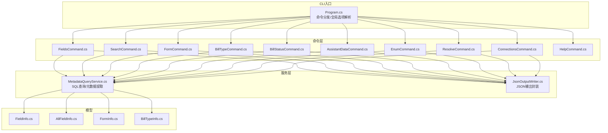
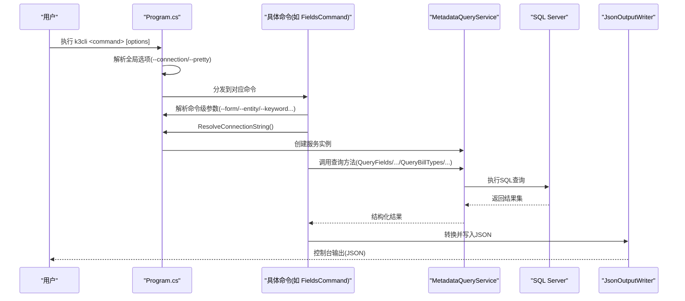
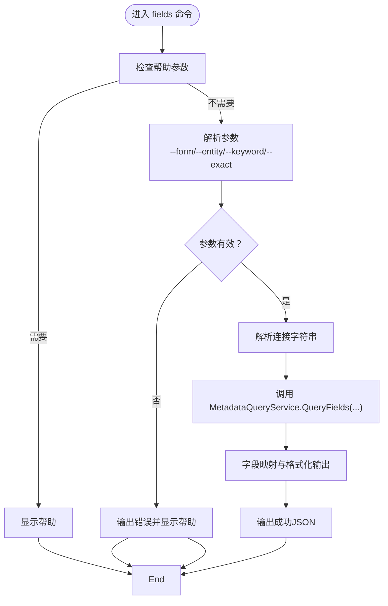
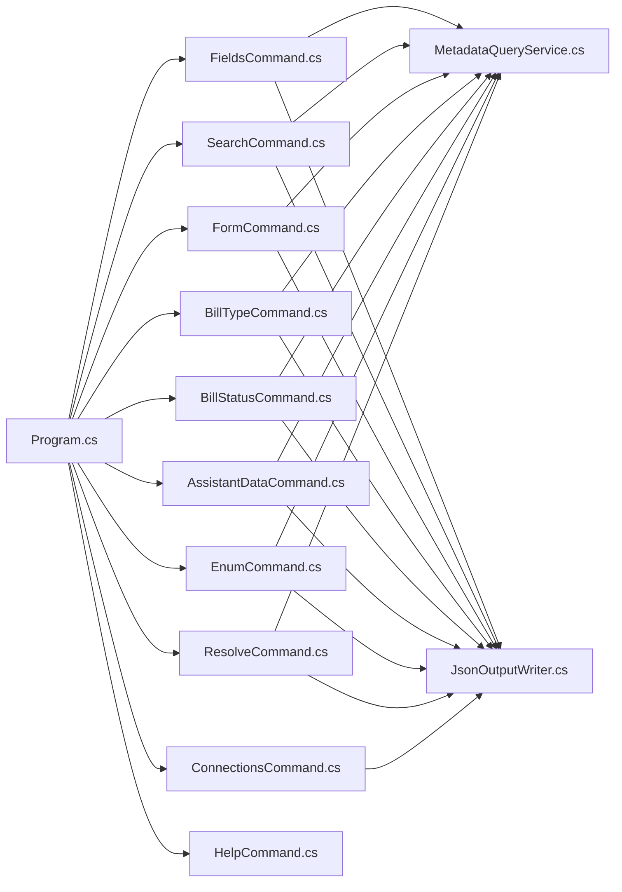

# 命令行工具

<cite>
**本文引用的文件**   
- [Program.cs](file://K3CloudDataDictionary.Cli/Program.cs)
- [MetadataQueryService.cs](file://K3CloudDataDictionary.Cli/Services/MetadataQueryService.cs)
- [JsonOutputWriter.cs](file://K3CloudDataDictionary.Cli/Services/JsonOutputWriter.cs)
- [FieldsCommand.cs](file://K3CloudDataDictionary.Cli/Commands/FieldsCommand.cs)
- [SearchCommand.cs](file://K3CloudDataDictionary.Cli/Commands/SearchCommand.cs)
- [FormCommand.cs](file://K3CloudDataDictionary.Cli/Commands/FormCommand.cs)
- [BillTypeCommand.cs](file://K3CloudDataDictionary.Cli/Commands/BillTypeCommand.cs)
- [BillStatusCommand.cs](file://K3CloudDataDictionary.Cli/Commands/BillStatusCommand.cs)
- [AssistantDataCommand.cs](file://K3CloudDataDictionary.Cli/Commands/AssistantDataCommand.cs)
- [EnumCommand.cs](file://K3CloudDataDictionary.Cli/Commands/EnumCommand.cs)
- [ResolveCommand.cs](file://K3CloudDataDictionary.Cli/Commands/ResolveCommand.cs)
- [ConnectionsCommand.cs](file://K3CloudDataDictionary.Cli/Commands/ConnectionsCommand.cs)
- [HelpCommand.cs](file://K3CloudDataDictionary.Cli/Commands/HelpCommand.cs)
- [usage-examples.md](file://docs/usage-examples.md)
- [FieldInfo.cs](file://Models/FieldInfo.cs)
- [AllFieldInfo.cs](file://Models/AllFieldInfo.cs)
- [FormInfo.cs](file://Models/FormInfo.cs)
- [BillTypeInfo.cs](file://Models/BillTypeInfo.cs)
</cite>

## 目录
1. [简介](#简介)
2. [项目结构](#项目结构)
3. [核心组件](#核心组件)
4. [架构总览](#架构总览)
5. [详细组件分析](#详细组件分析)
6. [依赖关系分析](#依赖关系分析)
7. [性能考虑](#性能考虑)
8. [故障排查指南](#故障排查指南)
9. [结论](#结论)
10. [附录](#附录)

## 简介
本文件面向金蝶K3 Cloud数据字典命令行工具（k3cli），系统性阐述其整体架构与实现要点，覆盖命令解析机制、服务层设计、输出格式处理、各命令功能与用法、以及批量处理与自动化脚本编写建议。读者可据此快速掌握工具的使用方式、内部工作原理与最佳实践。

## 项目结构
- CLI入口与全局逻辑位于 Program.cs，负责参数解析、全局选项处理、命令分发与异常捕获。
- 命令实现位于 Commands 子目录，每个命令对应一个静态类，职责单一、参数校验与输出格式转换清晰。
- 服务层位于 Services 子目录，核心为 MetadataQueryService（直连SQL Server实时查询）与 JsonOutputWriter（统一JSON输出）。
- Models 定义了若干领域模型，用于UI展示；CLI侧主要通过字典键映射实现数据转换。
- docs 提供使用示例与速查表，便于快速上手。

图表来源
- [Program.cs:14-69](file://K3CloudDataDictionary.Cli/Program.cs#L14-L69)
- [FieldsCommand.cs:13-85](file://K3CloudDataDictionary.Cli/Commands/FieldsCommand.cs#L13-L85)
- [SearchCommand.cs:13-107](file://K3CloudDataDictionary.Cli/Commands/SearchCommand.cs#L13-L107)
- [FormCommand.cs:13-90](file://K3CloudDataDictionary.Cli/Commands/FormCommand.cs#L13-L90)
- [BillTypeCommand.cs:13-63](file://K3CloudDataDictionary.Cli/Commands/BillTypeCommand.cs#L13-L63)
- [BillStatusCommand.cs:13-79](file://K3CloudDataDictionary.Cli/Commands/BillStatusCommand.cs#L13-L79)
- [AssistantDataCommand.cs:13-62](file://K3CloudDataDictionary.Cli/Commands/AssistantDataCommand.cs#L13-L62)
- [EnumCommand.cs:13-61](file://K3CloudDataDictionary.Cli/Commands/EnumCommand.cs#L13-L61)
- [ResolveCommand.cs:13-59](file://K3CloudDataDictionary.Cli/Commands/ResolveCommand.cs#L13-L59)
- [ConnectionsCommand.cs:15-229](file://K3CloudDataDictionary.Cli/Commands/ConnectionsCommand.cs#L15-L229)
- [MetadataQueryService.cs:12-839](file://K3CloudDataDictionary.Cli/Services/MetadataQueryService.cs#L12-L839)
- [JsonOutputWriter.cs:11-91](file://K3CloudDataDictionary.Cli/Services/JsonOutputWriter.cs#L11-L91)

章节来源
- [Program.cs:14-151](file://K3CloudDataDictionary.Cli/Program.cs#L14-L151)

## 核心组件
- 命令解析与分发：Program.Main 根据第一个参数选择具体命令，解析全局选项（--connection/-c、--pretty），并将剩余参数交由各命令处理。
- 全局选项：支持指定连接ID与美化输出。
- 连接解析：Program.ResolveConnectionString 优先使用显式连接ID，否则回退到默认连接。
- 服务层：MetadataQueryService 直连SQL Server，延迟加载元数据上下文，提供表单、实体、字段、单据类型、单据状态、辅助资料、枚举等查询能力。
- 输出层：JsonOutputWriter 统一封装成功/失败响应，支持美化输出与计数统计。

章节来源
- [Program.cs:74-151](file://K3CloudDataDictionary.Cli/Program.cs#L74-L151)
- [MetadataQueryService.cs:27-37](file://K3CloudDataDictionary.Cli/Services/MetadataQueryService.cs#L27-L37)
- [JsonOutputWriter.cs:26-80](file://K3CloudDataDictionary.Cli/Services/JsonOutputWriter.cs#L26-L80)

## 架构总览
k3cli采用“命令驱动 + 服务查询 + 统一输出”的分层架构。命令层负责参数解析与业务语义，服务层负责数据访问与元数据提取，输出层负责标准化JSON响应。

图表来源
- [Program.cs:33-69](file://K3CloudDataDictionary.Cli/Program.cs#L33-L69)
- [FieldsCommand.cs:38-84](file://K3CloudDataDictionary.Cli/Commands/FieldsCommand.cs#L38-L84)
- [MetadataQueryService.cs:172-230](file://K3CloudDataDictionary.Cli/Services/MetadataQueryService.cs#L172-L230)
- [JsonOutputWriter.cs:26-53](file://K3CloudDataDictionary.Cli/Services/JsonOutputWriter.cs#L26-L53)

## 详细组件分析

### 命令解析与全局选项
- 全局选项
  - --connection/-c：指定连接ID，优先使用该连接。
  - --pretty：启用JSON美化输出。
- 连接解析策略
  - 若指定ID存在则使用该连接；
  - 否则尝试默认连接；
  - 否则抛出明确错误提示。
- 异常处理
  - 全局try-catch捕获异常，统一通过JsonOutputWriter.WriteError输出错误信息。

章节来源
- [Program.cs:74-151](file://K3CloudDataDictionary.Cli/Program.cs#L74-L151)

### 字段查询命令（fields）
- 功能概述：查询表单字段信息，支持按表单、实体、关键词过滤，支持精确/模糊匹配。
- 关键参数
  - --form 必填：表单标识。
  - --entity 可选：实体Key。
  - --keyword 可选：关键词；--exact/-e 开启精确匹配。
  - --connection/--pretty 全局选项。
- 输出格式转换
  - 将底层字典键映射为友好字段名（如 formName、entityName、fieldName、propertyName、elementType、elementTypeName、tagName、lookUpObject、enumType、splitSuffix、splitDescription、updateActionCount），并对elementType=40时的statusItems进行嵌套输出。
- 典型用法
  - 查询表单全部字段、指定实体字段、模糊/精确搜索字段。

图表来源
- [FieldsCommand.cs:13-85](file://K3CloudDataDictionary.Cli/Commands/FieldsCommand.cs#L13-L85)
- [Program.cs:102-124](file://K3CloudDataDictionary.Cli/Program.cs#L102-L124)

章节来源
- [FieldsCommand.cs:13-85](file://K3CloudDataDictionary.Cli/Commands/FieldsCommand.cs#L13-L85)

### 搜索命令（search）
- 功能概述：支持按表（默认）或字段进行模糊/精确搜索，限制最大返回100条，避免全量字段搜索导致性能问题。
- 关键参数
  - --keyword 必填：搜索关键词。
  - --type 可选：table（默认）或 field。
  - --exact/-e：精确匹配。
  - --connection/--pretty。
- 输出格式转换
  - 表搜索：输出 formId/formIdentifier/formName/entityKey/entityName/table/elementType/fieldCount。
  - 字段搜索：输出与fields命令类似的字段友好字段名，并对elementType=40时的statusItems进行嵌套。

章节来源
- [SearchCommand.cs:13-107](file://K3CloudDataDictionary.Cli/Commands/SearchCommand.cs#L13-L107)

### 表单查询命令（form）
- 功能概述：查询表单元数据与实体列表，聚合插件、服务规则、更新动作、操作数等统计信息。
- 关键参数
  - --id 必填：表单标识。
  - --connection/--pretty。
- 输出结构
  - formId/formIdentifier/formName/modelType/subsystem/formPluginCount/listPluginCount/builderPluginCount/updateActionCount/serviceRuleCount/formOperationCount/entities[]。

章节来源
- [FormCommand.cs:13-90](file://K3CloudDataDictionary.Cli/Commands/FormCommand.cs#L13-L90)

### 单据类型命令（billtype）
- 功能概述：支持按表单查询列表、按ID精确查询、按关键词模糊搜索（编码/名称/描述）。
- 关键参数
  - --form/--id/--keyword 至少指定一个。
  - --connection/--pretty。
- 输出结构
  - billTypeId/billFormId/number/name/description。

章节来源
- [BillTypeCommand.cs:13-63](file://K3CloudDataDictionary.Cli/Commands/BillTypeCommand.cs#L13-L63)

### 单据状态命令（billstatus）
- 功能概述：查询elementType=40的单据状态字段的枚举值（状态项），支持按字段Key或关键词过滤。
- 关键参数
  - --form 必填：表单标识。
  - --field 可选：字段Key。
  - --keyword 可选：状态名称/值的模糊搜索。
  - --connection/--pretty。
- 输出结构
  - formId/formName/entityName/table/fieldKey/fieldName/dbFieldName/propertyName/elementType/elementTypeName/statusItems[]（每项包含value/name）。

章节来源
- [BillStatusCommand.cs:13-79](file://K3CloudDataDictionary.Cli/Commands/BillStatusCommand.cs#L13-L79)

### 辅助资料命令（assistantdata）
- 功能概述：查询lookUpObject对应的辅助资料选项列表。
- 关键参数
  - --id 必填：辅助资料ID（即字段的LookUpObjectID）。
  - --connection/--pretty。
- 输出结构
  - id/number/name/entryId/entryNumber/dataValue。

章节来源
- [AssistantDataCommand.cs:13-62](file://K3CloudDataDictionary.Cli/Commands/AssistantDataCommand.cs#L13-L62)

### 枚举命令（enum）
- 功能概述：查询elementType=9的下拉列表字段的枚举值。
- 关键参数
  - --id 必填：枚举类型ID（即字段的EnumType/FEnumType）。
  - --connection/--pretty。
- 输出结构
  - id/name/value/enumId/caption。

章节来源
- [EnumCommand.cs:13-61](file://K3CloudDataDictionary.Cli/Commands/EnumCommand.cs#L13-L61)

### 解析命令（resolve）
- 功能概述：根据lookUpObject ID反查对应表单信息，返回表单ID、表名、主键字段名、组织字段名等。
- 关键参数
  - --id 必填：对象ID（即字段的lookUpObject值）。
  - --connection/--pretty。
- 输出结构
  - lookupId/formId(tableName)/pkFieldName/orgFieldName。

章节来源
- [ResolveCommand.cs:13-59](file://K3CloudDataDictionary.Cli/Commands/ResolveCommand.cs#L13-L59)

### 连接管理命令（connections）
- 子命令
  - list：列出所有连接。
  - add：新增连接（--server/--port/--db/--user/--password/--name/--default）。
  - test --id：测试连接。
  - set-default --id：设为默认连接。
- 输出结构
  - list/add/test/set-default均返回统一JSON结构，包含必要字段与消息。

章节来源
- [ConnectionsCommand.cs:15-229](file://K3CloudDataDictionary.Cli/Commands/ConnectionsCommand.cs#L15-L229)

### 帮助命令（help）
- 提供全局帮助与各命令的帮助信息，涵盖用法、选项、示例与注意事项。

章节来源
- [HelpCommand.cs:10-287](file://K3CloudDataDictionary.Cli/Commands/HelpCommand.cs#L10-L287)

### 服务层：MetadataQueryService
- 上下文懒加载：EnsureContext 首次使用时加载元数据上下文与元素类型映射。
- 查询能力
  - QueryForm/QueryEntities：表单与实体信息。
  - QueryFields：字段查询，支持实体过滤与关键词过滤（模糊/精确）。
  - SearchFields/SearchTables：跨对象搜索字段与表。
  - QueryBillTypes：单据类型查询（按表单/ID/关键词）。
  - QueryAssistantData：辅助资料选项。
  - QueryEnumItems：枚举项。
  - QueryBillStatusItems：单据状态字段的枚举值。
  - ResolveObject：根据lookUpObject反查表单。
- 性能与限制
  - 字段搜索限制最大返回100条，避免全量扫描。
  - SQL命令超时设置合理，确保稳定性。

章节来源
- [MetadataQueryService.cs:27-839](file://K3CloudDataDictionary.Cli/Services/MetadataQueryService.cs#L27-L839)

### 输出层：JsonOutputWriter
- 成功输出：包含 success/command/data/count。
- 错误输出：包含 success/command/error。
- 美化输出：SetPrettyPrint 控制缩进。
- 转换工具：ConvertRows 保留字典列表原样。

章节来源
- [JsonOutputWriter.cs:11-91](file://K3CloudDataDictionary.Cli/Services/JsonOutputWriter.cs#L11-L91)

## 依赖关系分析
- 命令层依赖 Program（参数解析、连接解析）与 JsonOutputWriter（统一输出）。
- 服务层依赖 SQL Server，负责元数据查询与提取。
- 模型层主要用于UI展示，CLI侧通过字典键映射实现数据转换，降低耦合。

图表来源
- [Program.cs:33-69](file://K3CloudDataDictionary.Cli/Program.cs#L33-L69)
- [FieldsCommand.cs:40-77](file://K3CloudDataDictionary.Cli/Commands/FieldsCommand.cs#L40-L77)
- [SearchCommand.cs:41-97](file://K3CloudDataDictionary.Cli/Commands/SearchCommand.cs#L41-L97)
- [FormCommand.cs:35-82](file://K3CloudDataDictionary.Cli/Commands/FormCommand.cs#L35-L82)
- [BillTypeCommand.cs:38-55](file://K3CloudDataDictionary.Cli/Commands/BillTypeCommand.cs#L38-L55)
- [BillStatusCommand.cs:39-70](file://K3CloudDataDictionary.Cli/Commands/BillStatusCommand.cs#L39-L70)
- [AssistantDataCommand.cs:35-54](file://K3CloudDataDictionary.Cli/Commands/AssistantDataCommand.cs#L35-L54)
- [EnumCommand.cs:35-53](file://K3CloudDataDictionary.Cli/Commands/EnumCommand.cs#L35-L53)
- [ResolveCommand.cs:35-52](file://K3CloudDataDictionary.Cli/Commands/ResolveCommand.cs#L35-L52)
- [ConnectionsCommand.cs:17-123](file://K3CloudDataDictionary.Cli/Commands/ConnectionsCommand.cs#L17-L123)
- [JsonOutputWriter.cs:26-53](file://K3CloudDataDictionary.Cli/Services/JsonOutputWriter.cs#L26-L53)

## 性能考虑
- 字段搜索限制：SearchFields/SearchTables默认最多返回100条，避免大规模扫描。
- SQL超时控制：查询方法中为SQL命令设置了合理的CommandTimeout，防止长时间阻塞。
- 懒加载上下文：EnsureContext首次使用时才加载元数据，减少启动开销。
- 建议
  - 在大批量导出时结合--connection指定稳定连接，避免频繁切换。
  - 使用--exact进行精确匹配以减少中间结果集。
  - 对于复杂链路（如fields→resolve→fields），建议缓存中间结果以提升脚本效率。

[本节为通用性能建议，不直接分析特定文件]

## 故障排查指南
- 无默认连接
  - 现象：执行命令时报“没有默认连接”。
  - 处理：使用 connections add 添加连接并设为默认，或在命令中使用 --connection 指定ID。
- 连接ID不存在
  - 现象：指定 --connection <id> 但未找到该ID。
  - 处理：使用 connections list 查看ID列表，或使用 connections test 测试连接有效性。
- 参数缺失
  - 现象：fields/search/form/billtype/billstatus/assistantdata/enum/resolve 报错缺少必填参数。
  - 处理：参考各命令帮助（k3cli help 或 k3cli <cmd> help）补齐参数。
- SQL查询异常
  - 现象：命令执行过程中出现数据库相关错误。
  - 处理：检查连接字符串、网络连通性与SQL Server权限；必要时开启 --pretty 观察错误详情。

章节来源
- [Program.cs:129-151](file://K3CloudDataDictionary.Cli/Program.cs#L129-L151)
- [ConnectionsCommand.cs:173-228](file://K3CloudDataDictionary.Cli/Commands/ConnectionsCommand.cs#L173-L228)
- [HelpCommand.cs:74-287](file://K3CloudDataDictionary.Cli/Commands/HelpCommand.cs#L74-L287)

## 结论
k3cli通过清晰的命令分层、稳健的服务查询与统一的JSON输出，实现了对金蝶K3 Cloud元数据的高效探索与导出。借助使用示例与速查表，用户可以快速完成从字段到表单、从lookUpObject到关联表单、从单据类型到状态枚举的完整查询链路。配合批量脚本与自动化流程，可显著提升数据字典的维护与开发效率。

[本节为总结性内容，不直接分析特定文件]

## 附录

### 常用命令与参数速查
- fields：--form/--entity/--keyword/--exact/--connection/--pretty
- search：--keyword/--type/--exact/--connection/--pretty
- form：--id/--connection/--pretty
- billtype：--form/--id/--keyword/--connection/--pretty
- billstatus：--form/--field/--keyword/--connection/--pretty
- assistantdata：--id/--connection/--pretty
- enum：--id/--connection/--pretty
- resolve：--id/--connection/--pretty
- connections：list/add/test/set-default

章节来源
- [HelpCommand.cs:16-287](file://K3CloudDataDictionary.Cli/Commands/HelpCommand.cs#L16-L287)

### 使用示例与最佳实践
- 通过 lookUpObject 查询关联表单的完整流程（字段→resolve→fields）。
- 单据类型查询（按表单/ID/关键词）与辅助资料、枚举查询。
- 从搜索表到查询字段的链路（search→fields）。
- 根据表+实体查询子项明细字段。
- 单据状态字段枚举值查询。

章节来源
- [usage-examples.md:1-542](file://docs/usage-examples.md#L1-L542)