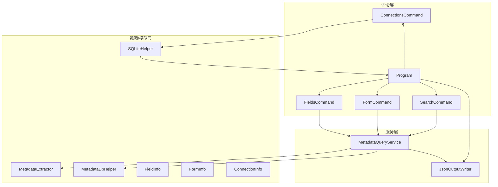
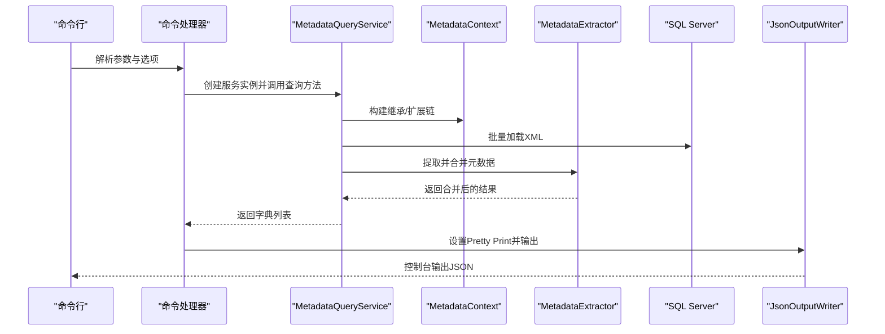
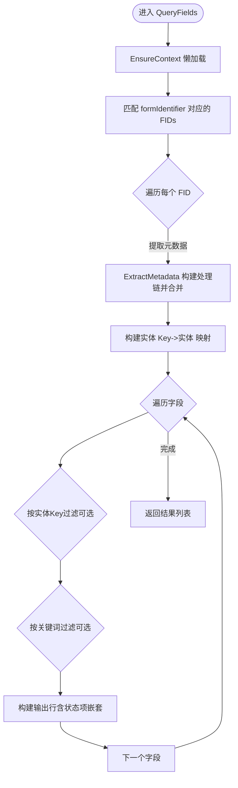
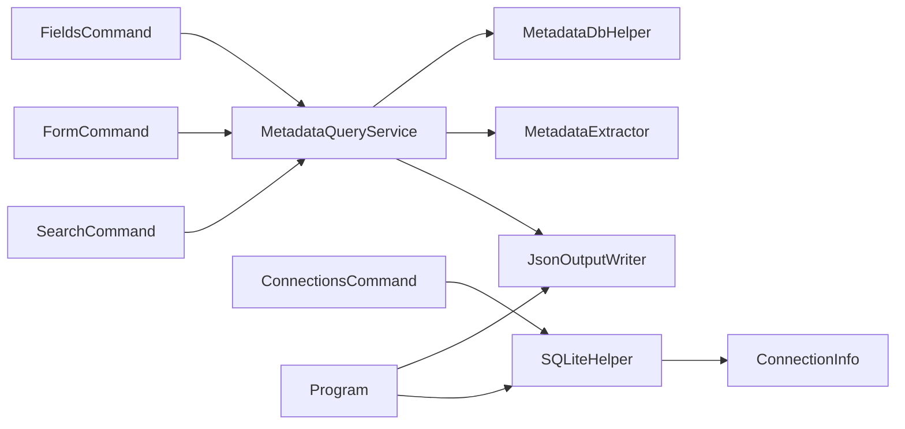

# 服务层实现

<cite>
**本文引用的文件**
- [MetadataQueryService.cs](file://K3CloudDataDictionary.Cli/Services/MetadataQueryService.cs)
- [JsonOutputWriter.cs](file://K3CloudDataDictionary.Cli/Services/JsonOutputWriter.cs)
- [Program.cs](file://K3CloudDataDictionary.Cli/Program.cs)
- [FieldsCommand.cs](file://K3CloudDataDictionary.Cli/Commands/FieldsCommand.cs)
- [FormCommand.cs](file://K3CloudDataDictionary.Cli/Commands/FormCommand.cs)
- [SearchCommand.cs](file://K3CloudDataDictionary.Cli/Commands/SearchCommand.cs)
- [ConnectionsCommand.cs](file://K3CloudDataDictionary.Cli/Commands/ConnectionsCommand.cs)
- [MetadataExtractor.cs](file://K3CloudDataDictionary/Views/MetadataExtractor.cs)
- [MetadataDbHelper.cs](file://K3CloudDataDictionary/Views/MetadataDbHelper.cs)
- [SQLiteHelper.cs](file://K3CloudDataDictionary/Helpers/SQLiteHelper.cs)
- [FieldInfo.cs](file://Models/FieldInfo.cs)
- [FormInfo.cs](file://Models/FormInfo.cs)
- [ConnectionInfo.cs](file://Models/ConnectionInfo.cs)
</cite>

## 目录
1. [简介](#简介)
2. [项目结构](#项目结构)
3. [核心组件](#核心组件)
4. [架构总览](#架构总览)
5. [详细组件分析](#详细组件分析)
6. [依赖关系分析](#依赖关系分析)
7. [性能考量](#性能考量)
8. [故障排查指南](#故障排查指南)
9. [结论](#结论)
10. [附录](#附录)

## 简介
本文档聚焦于金蝶K3 Cloud数据字典命令行工具的服务层实现，重点阐述以下内容：
- MetadataQueryService元数据查询服务的设计与实现：查询逻辑、数据处理、缓存机制、批量查询支持与性能优化。
- JsonOutputWriter JSON输出处理的工作原理：格式化输出、错误处理、Pretty Print等。
- 服务层与命令层的交互方式：参数解析、连接解析、结果转换与输出。
- 扩展与自定义建议：如何在现有架构上扩展新的查询能力与输出格式。

## 项目结构
服务层位于K3CloudDataDictionary.Cli/Services目录，主要包含：
- MetadataQueryService：面向SQL Server的实时元数据查询服务，负责表单、实体、字段、单据类型、辅助资料、枚举等查询。
- JsonOutputWriter：统一JSON输出格式化器，支持成功/失败响应、Pretty Print、原始JSON输出。

命令层位于K3CloudDataDictionary.Cli/Commands目录，各命令通过调用服务层完成具体业务查询，并将结果交由JsonOutputWriter输出。

图表来源
- [Program.cs:14-69](file://K3CloudDataDictionary.Cli/Program.cs#L14-L69)
- [FieldsCommand.cs:13-85](file://K3CloudDataDictionary.Cli/Commands/FieldsCommand.cs#L13-L85)
- [FormCommand.cs:13-90](file://K3CloudDataDictionary.Cli/Commands/FormCommand.cs#L13-L90)
- [SearchCommand.cs:13-107](file://K3CloudDataDictionary.Cli/Commands/SearchCommand.cs#L13-L107)
- [ConnectionsCommand.cs:15-231](file://K3CloudDataDictionary.Cli/Commands/ConnectionsCommand.cs#L15-L231)
- [MetadataQueryService.cs:12-839](file://K3CloudDataDictionary.Cli/Services/MetadataQueryService.cs#L12-L839)
- [JsonOutputWriter.cs:11-91](file://K3CloudDataDictionary.Cli/Services/JsonOutputWriter.cs#L11-L91)
- [MetadataExtractor.cs:102-880](file://K3CloudDataDictionary/Views/MetadataExtractor.cs#L102-L880)
- [MetadataDbHelper.cs:36-131](file://K3CloudDataDictionary/Views/MetadataDbHelper.cs#L36-L131)
- [SQLiteHelper.cs:10-370](file://K3CloudDataDictionary/Helpers/SQLiteHelper.cs#L10-L370)

章节来源
- [Program.cs:14-69](file://K3CloudDataDictionary.Cli/Program.cs#L14-L69)
- [MetadataQueryService.cs:12-839](file://K3CloudDataDictionary.Cli/Services/MetadataQueryService.cs#L12-L839)
- [JsonOutputWriter.cs:11-91](file://K3CloudDataDictionary.Cli/Services/JsonOutputWriter.cs#L11-L91)

## 核心组件
- MetadataQueryService：提供表单、实体、字段、单据类型、辅助资料、枚举、单据状态等查询能力；内部维护上下文与缓存，支持按对象ID反查表单信息；通过MetadataContext与MetadataExtractor实现继承链与扩展链的合并处理。
- JsonOutputWriter：统一输出格式，支持设置Pretty Print、成功/失败响应包装、原始JSON输出；将字典列表转换为更友好的JSON结构。

章节来源
- [MetadataQueryService.cs:12-839](file://K3CloudDataDictionary.Cli/Services/MetadataQueryService.cs#L12-L839)
- [JsonOutputWriter.cs:11-91](file://K3CloudDataDictionary.Cli/Services/JsonOutputWriter.cs#L11-L91)

## 架构总览
服务层采用“命令层-服务层-视图/模型层”的分层设计：
- 命令层负责参数解析、连接解析与结果转换。
- 服务层负责数据库访问、元数据提取与聚合。
- 视图/模型层负责XML解析、上下文构建与数据模型。

图表来源
- [Program.cs:14-69](file://K3CloudDataDictionary.Cli/Program.cs#L14-L69)
- [FieldsCommand.cs:13-85](file://K3CloudDataDictionary.Cli/Commands/FieldsCommand.cs#L13-L85)
- [FormCommand.cs:13-90](file://K3CloudDataDictionary.Cli/Commands/FormCommand.cs#L13-L90)
- [SearchCommand.cs:13-107](file://K3CloudDataDictionary.Cli/Commands/SearchCommand.cs#L13-L107)
- [MetadataQueryService.cs:826-836](file://K3CloudDataDictionary.Cli/Services/MetadataQueryService.cs#L826-L836)
- [MetadataExtractor.cs:289-360](file://K3CloudDataDictionary/Views/MetadataExtractor.cs#L289-L360)
- [MetadataDbHelper.cs:87-127](file://K3CloudDataDictionary/Views/MetadataDbHelper.cs#L87-L127)
- [JsonOutputWriter.cs:18-80](file://K3CloudDataDictionary.Cli/Services/JsonOutputWriter.cs#L18-L80)

## 详细组件分析

### MetadataQueryService 元数据查询服务
- 设计要点
  - 上下文懒加载：EnsureContext首次使用时初始化MetadataContext、对象基础信息与元素类型映射。
  - 缓存策略：加载所有对象基础信息与元素类型中文名映射到内存字典，后续查询直接命中，减少重复查询。
  - 元数据提取：通过ExtractMetadata构建完整处理链（继承链+扩展链），批量加载XML后交由MetadataExtractor合并。
  - 查询方法族：QueryForm、QueryEntities、QueryFields、SearchFields、SearchTables、QueryBillTypes、QueryAssistantData、QueryEnumItems、QueryBillStatusItems、ResolveObject等。
  - 错误处理：各查询方法均包含try-catch，异常通过控制台输出错误信息，保证命令层可获得稳定响应。

- 关键流程（字段查询）

图表来源
- [MetadataQueryService.cs:286-388](file://K3CloudDataDictionary.Cli/Services/MetadataQueryService.cs#L286-L388)

- 批量查询与高效处理
  - 处理链构建：MetadataContext.BuildFullChain按继承路径与扩展映射构建完整处理链，避免重复扫描。
  - 批量XML加载：MetadataDbHelper.LoadKernelXmlBatch一次性查询多个FID的XML，减少数据库往返。
  - 合并策略：MetadataExtractor.ExtractByFid按OID/Key粒度合并实体与字段，支持action=remove、edit等语义。

- 与命令层交互
  - 命令层通过Program.ResolveConnectionString解析连接字符串，传递给服务层构造函数。
  - 命令层调用服务层查询方法，得到字典列表后进行字段重命名与嵌套状态项处理，再交由JsonOutputWriter输出。

章节来源
- [MetadataQueryService.cs:27-839](file://K3CloudDataDictionary.Cli/Services/MetadataQueryService.cs#L27-L839)
- [MetadataExtractor.cs:102-360](file://K3CloudDataDictionary/Views/MetadataExtractor.cs#L102-L360)
- [MetadataDbHelper.cs:44-127](file://K3CloudDataDictionary/Views/MetadataDbHelper.cs#L44-L127)
- [Program.cs:129-151](file://K3CloudDataDictionary.Cli/Program.cs#L129-L151)
- [FieldsCommand.cs:13-85](file://K3CloudDataDictionary.Cli/Commands/FieldsCommand.cs#L13-L85)
- [FormCommand.cs:13-90](file://K3CloudDataDictionary.Cli/Commands/FormCommand.cs#L13-L90)
- [SearchCommand.cs:13-107](file://K3CloudDataDictionary.Cli/Commands/SearchCommand.cs#L13-L107)

### JsonOutputWriter JSON输出处理
- 功能特性
  - Pretty Print：通过SetPrettyPrint切换缩进格式化输出。
  - 成功响应：WriteSuccess(command, data, count)与WriteSuccess<T>(command, data)统一包装success=true与count字段。
  - 错误响应：WriteError(command, message)统一包装success=false与error字段。
  - 原始JSON：WriteJson(jObject)直接输出JObject，便于调试或特殊场景。
  - 字段转换：ConvertRows(rows)保留原字典列表，便于后续命令层进一步转换。

- 输出结构
  - 成功：{ success: true, command: "...", data: [...], count: n }
  - 失败：{ success: false, command: "...", error: "..." }

- 与命令层集成
  - 命令执行前调用SetPrettyPrint(options.PrettyPrint)设置输出格式。
  - 命令层将服务层返回的字典列表转换为更友好的字段名后，调用WriteSuccess输出。

章节来源
- [JsonOutputWriter.cs:11-91](file://K3CloudDataDictionary.Cli/Services/JsonOutputWriter.cs#L11-L91)
- [FieldsCommand.cs:15-77](file://K3CloudDataDictionary.Cli/Commands/FieldsCommand.cs#L15-L77)
- [FormCommand.cs:15-82](file://K3CloudDataDictionary.Cli/Commands/FormCommand.cs#L15-L82)
- [SearchCommand.cs:15-98](file://K3CloudDataDictionary.Cli/Commands/SearchCommand.cs#L15-L98)

### 服务层与命令层交互
- 参数解析与连接解析
  - Program.ParseGlobalOptions解析全局选项（--connection/-c、--pretty）。
  - Program.ResolveConnectionString优先使用指定连接ID，否则使用默认连接；若都不可用则抛出异常。
- 命令执行流程
  - 各命令在Execute中设置Pretty Print，解析必填/可选参数，调用服务层查询，进行结果转换，最后通过JsonOutputWriter输出。
- 错误处理
  - 命令层捕获异常并通过JsonOutputWriter.WriteError输出，确保命令行体验一致。

章节来源
- [Program.cs:74-151](file://K3CloudDataDictionary.Cli/Program.cs#L74-L151)
- [FieldsCommand.cs:13-85](file://K3CloudDataDictionary.Cli/Commands/FieldsCommand.cs#L13-L85)
- [FormCommand.cs:13-90](file://K3CloudDataDictionary.Cli/Commands/FormCommand.cs#L13-L90)
- [SearchCommand.cs:13-107](file://K3CloudDataDictionary.Cli/Commands/SearchCommand.cs#L13-L107)
- [ConnectionsCommand.cs:15-231](file://K3CloudDataDictionary.Cli/Commands/ConnectionsCommand.cs#L15-L231)

### 批量查询与高效数据处理
- 批量XML加载
  - MetadataDbHelper.LoadKernelXmlBatch根据收集的FID集合一次性查询，避免多次往返。
- 处理链与合并
  - MetadataContext.BuildFullChain与MetadataExtractor.ExtractByFid实现继承链与扩展链的合并，支持action=remove/edit等语义。
- 结果聚合
  - 服务层在查询方法中对插件、服务规则、更新动作等进行聚合统计，减少命令层负担。

章节来源
- [MetadataDbHelper.cs:87-127](file://K3CloudDataDictionary/Views/MetadataDbHelper.cs#L87-L127)
- [MetadataExtractor.cs:289-360](file://K3CloudDataDictionary/Views/MetadataExtractor.cs#L289-L360)
- [MetadataQueryService.cs:172-230](file://K3CloudDataDictionary.Cli/Services/MetadataQueryService.cs#L172-L230)

### 扩展与自定义指导
- 新增查询接口
  - 在MetadataQueryService中新增查询方法，遵循现有命名规范与返回格式；必要时复用ExtractMetadata或直接查询数据库。
  - 若涉及复杂XML解析，优先通过MetadataExtractor扩展合并逻辑，保持一致性。
- 输出格式定制
  - 在命令层对服务层返回的字典列表进行字段重命名与嵌套处理，满足不同命令的输出需求。
  - 如需调整JsonOutputWriter行为，可在WriteSuccess/WriteError中增加字段或调整结构。
- 性能优化建议
  - 复用上下文与缓存：确保EnsureContext只初始化一次，避免重复加载基础信息。
  - 批量查询：利用CollectNeededFids与LoadKernelXmlBatch减少数据库访问次数。
  - 限制结果规模：在搜索类查询中限制返回条数，避免大规模输出影响性能。

章节来源
- [MetadataQueryService.cs:12-839](file://K3CloudDataDictionary.Cli/Services/MetadataQueryService.cs#L12-L839)
- [MetadataExtractor.cs:289-360](file://K3CloudDataDictionary/Views/MetadataExtractor.cs#L289-L360)
- [JsonOutputWriter.cs:11-91](file://K3CloudDataDictionary.Cli/Services/JsonOutputWriter.cs#L11-L91)

## 依赖关系分析
- 服务层依赖
  - MetadataQueryService依赖MetadataContext、MetadataExtractor、MetadataDbHelper与SQL Server。
  - 命令层依赖服务层与JsonOutputWriter。
  - 连接管理依赖SQLiteHelper与ConnectionInfo模型。
- 外部依赖
  - System.Data.SqlClient用于SQL Server访问。
  - Newtonsoft.Json用于JSON序列化与格式化。

图表来源
- [FieldsCommand.cs:13-85](file://K3CloudDataDictionary.Cli/Commands/FieldsCommand.cs#L13-L85)
- [FormCommand.cs:13-90](file://K3CloudDataDictionary.Cli/Commands/FormCommand.cs#L13-L90)
- [SearchCommand.cs:13-107](file://K3CloudDataDictionary.Cli/Commands/SearchCommand.cs#L13-L107)
- [ConnectionsCommand.cs:15-231](file://K3CloudDataDictionary.Cli/Commands/ConnectionsCommand.cs#L15-L231)
- [MetadataQueryService.cs:12-839](file://K3CloudDataDictionary.Cli/Services/MetadataQueryService.cs#L12-L839)
- [MetadataExtractor.cs:102-360](file://K3CloudDataDictionary/Views/MetadataExtractor.cs#L102-L360)
- [MetadataDbHelper.cs:36-131](file://K3CloudDataDictionary/Views/MetadataDbHelper.cs#L36-L131)
- [SQLiteHelper.cs:10-370](file://K3CloudDataDictionary/Helpers/SQLiteHelper.cs#L10-L370)
- [Program.cs:14-69](file://K3CloudDataDictionary.Cli/Program.cs#L14-L69)

章节来源
- [Program.cs:14-69](file://K3CloudDataDictionary.Cli/Program.cs#L14-L69)
- [MetadataQueryService.cs:12-839](file://K3CloudDataDictionary.Cli/Services/MetadataQueryService.cs#L12-L839)
- [JsonOutputWriter.cs:11-91](file://K3CloudDataDictionary.Cli/Services/JsonOutputWriter.cs#L11-L91)

## 性能考量
- 懒加载与缓存
  - EnsureContext仅在首次查询时初始化上下文与字典缓存，避免重复IO。
- 批量查询
  - MetadataContext.CollectNeededFids与MetadataDbHelper.LoadKernelXmlBatch减少数据库往返次数。
- 结果限制
  - 搜索类查询限制返回条数，降低输出与传输开销。
- 并发与线程安全
  - MetadataContext为只读上下文，ExtractByFid为静态方法，避免共享状态引发的竞争问题。

## 故障排查指南
- 连接问题
  - 使用connections命令管理连接，通过TestConnection验证连通性。
  - 若ResolveConnectionString失败，检查连接ID是否存在或默认连接是否配置。
- 查询异常
  - 服务层各查询方法均包含异常捕获，命令层通过WriteError输出错误信息。
  - 检查SQL Server连接字符串、数据库权限与网络连通性。
- 输出格式
  - 通过--pretty选项启用Pretty Print，便于阅读；生产环境可关闭以减少输出体积。

章节来源
- [ConnectionsCommand.cs:173-228](file://K3CloudDataDictionary.Cli/Commands/ConnectionsCommand.cs#L173-L228)
- [Program.cs:129-151](file://K3CloudDataDictionary.Cli/Program.cs#L129-L151)
- [MetadataQueryService.cs:221-224](file://K3CloudDataDictionary.Cli/Services/MetadataQueryService.cs#L221-L224)

## 结论
本服务层实现以MetadataQueryService为核心，结合MetadataContext与MetadataExtractor实现了高效的元数据查询与合并；JsonOutputWriter提供了统一的JSON输出能力。命令层通过清晰的参数解析与连接解析，将查询结果标准化输出。整体架构具备良好的扩展性与性能表现，适合在金蝶K3 Cloud环境中进行元数据探索与数据字典生成。

## 附录
- 数据模型参考
  - FieldInfo：字段属性与显示字段。
  - FormInfo：表单属性与统计字段。
  - ConnectionInfo：连接信息与连接字符串生成。

章节来源
- [FieldInfo.cs:6-110](file://Models/FieldInfo.cs#L6-L110)
- [FormInfo.cs:6-101](file://Models/FormInfo.cs#L6-L101)
- [ConnectionInfo.cs:6-144](file://Models/ConnectionInfo.cs#L6-L144)