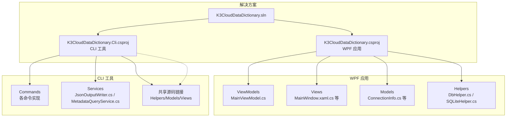
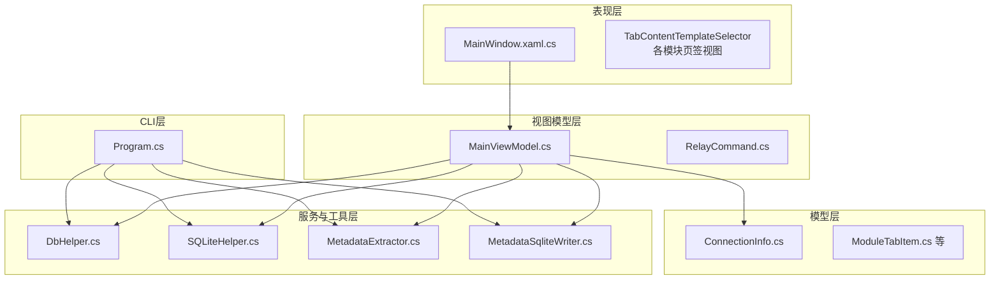
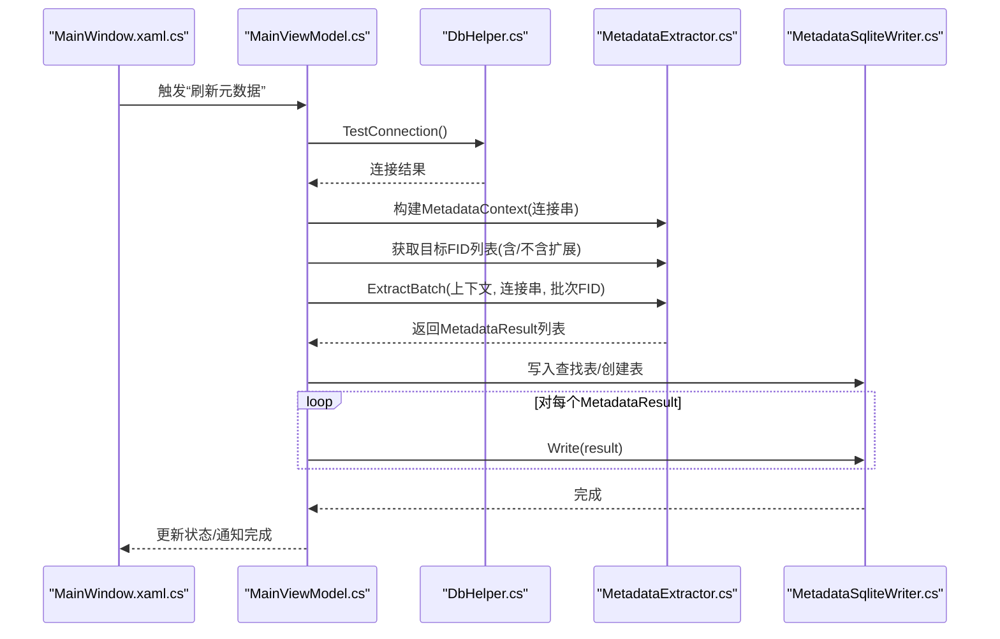
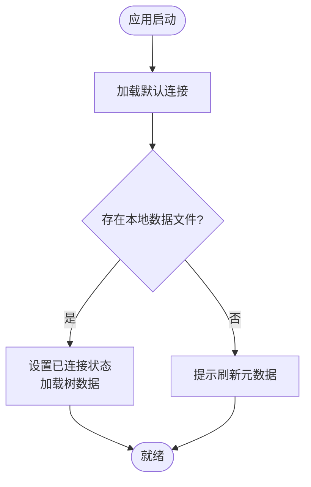
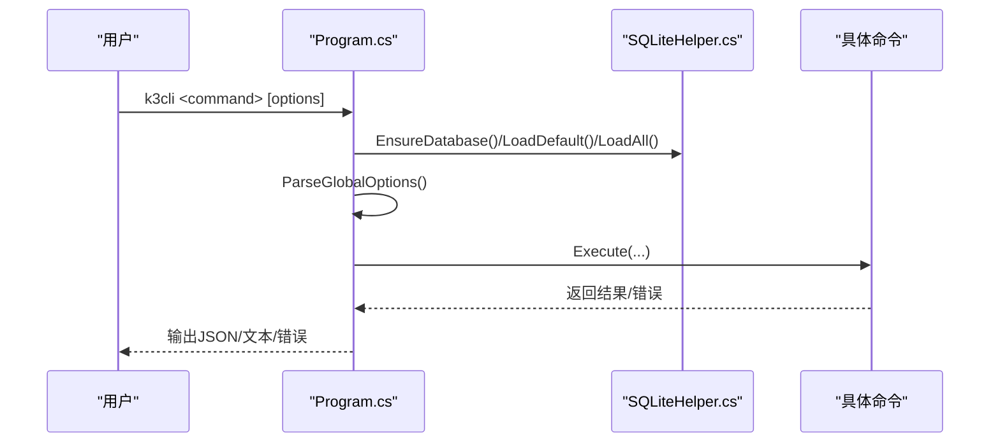
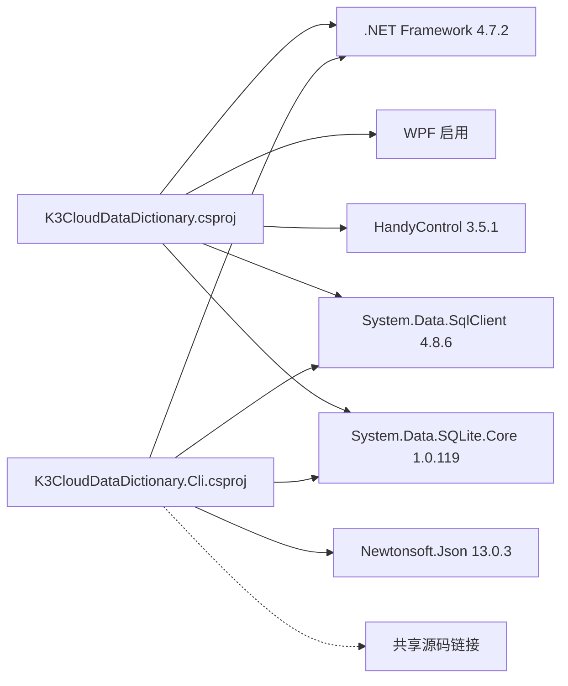

# 开发指南

<cite>
**本文档引用的文件**
- [K3CloudDataDictionary.csproj](file://K3CloudDataDictionary.csproj)
- [K3CloudDataDictionary.Cli.csproj](file://K3CloudDataDictionary.Cli/K3CloudDataDictionary.Cli.csproj)
- [Program.cs](file://K3CloudDataDictionary.Cli/Program.cs)
- [App.xaml.cs](file://App.xaml.cs)
- [MainWindow.xaml.cs](file://MainWindow.xaml.cs)
- [DbHelper.cs](file://Helpers/DbHelper.cs)
- [SQLiteHelper.cs](file://Helpers/SQLiteHelper.cs)
- [MetadataExtractor.cs](file://Views/MetadataExtractor.cs)
- [MetadataSqliteWriter.cs](file://Views/MetadataSqliteWriter.cs)
- [ConnectionInfo.cs](file://Models/ConnectionInfo.cs)
- [MainViewModel.cs](file://ViewModels/MainViewModel.cs)
- [K3CloudDataDictionary.sln](file://K3CloudDataDictionary.sln)
</cite>

## 目录
1. [简介](#简介)
2. [项目结构](#项目结构)
3. [核心组件](#核心组件)
4. [架构总览](#架构总览)
5. [详细组件分析](#详细组件分析)
6. [依赖关系分析](#依赖关系分析)
7. [性能考虑](#性能考虑)
8. [故障排查指南](#故障排查指南)
9. [结论](#结论)
10. [附录](#附录)

## 简介
本指南面向金蝶K3 Cloud数据字典系统的开发者，涵盖开发环境搭建、代码贡献规范、项目结构与设计原则、调试技巧、性能优化以及扩展与插件开发指导。系统采用WPF桌面应用与CLI工具双入口，结合MVVM模式与分层架构，实现对K3 Cloud元数据的抽取、合并、持久化与可视化展示。

## 项目结构
项目采用解决方案级组织，包含WPF主程序与独立CLI工具两部分，共享模型与辅助类，确保跨入口一致性。

**图表来源**
- [K3CloudDataDictionary.sln:1-32](file://K3CloudDataDictionary.sln#L1-L32)
- [K3CloudDataDictionary.csproj:1-21](file://K3CloudDataDictionary.csproj#L1-L21)
- [K3CloudDataDictionary.Cli.csproj:1-49](file://K3CloudDataDictionary.Cli/K3CloudDataDictionary.Cli.csproj#L1-L49)

**章节来源**
- [K3CloudDataDictionary.sln:1-32](file://K3CloudDataDictionary.sln#L1-L32)
- [K3CloudDataDictionary.csproj:1-21](file://K3CloudDataDictionary.csproj#L1-L21)
- [K3CloudDataDictionary.Cli.csproj:1-49](file://K3CloudDataDictionary.Cli/K3CloudDataDictionary.Cli.csproj#L1-L49)

## 核心组件
- 数据访问与连接管理
  - SQL Server连接测试与查询：DbHelper
  - 本地SQLite连接与连接配置持久化：SQLiteHelper
- 元数据抽取与合并
  - 元数据上下文与批处理抽取：MetadataExtractor
  - 本地SQLite写入与表结构：MetadataSqliteWriter
- 视图模型与UI交互
  - 主视图模型：MainViewModel
  - 主窗口事件与刷新流程：MainWindow
- CLI工具
  - 命令入口与参数解析：Program
  - 与WPF共享模型与辅助类

**章节来源**
- [DbHelper.cs:1-70](file://Helpers/DbHelper.cs#L1-L70)
- [SQLiteHelper.cs:1-370](file://Helpers/SQLiteHelper.cs#L1-L370)
- [MetadataExtractor.cs:1-880](file://Views/MetadataExtractor.cs#L1-L880)
- [MetadataSqliteWriter.cs:1-846](file://Views/MetadataSqliteWriter.cs#L1-L846)
- [MainViewModel.cs:1-800](file://ViewModels/MainViewModel.cs#L1-L800)
- [MainWindow.xaml.cs:1-800](file://MainWindow.xaml.cs#L1-L800)
- [Program.cs:1-166](file://K3CloudDataDictionary.Cli/Program.cs#L1-L166)

## 架构总览
系统采用MVVM与分层架构：
- 表现层（View）：WPF页面与控件，负责用户交互与状态显示
- 视图模型（ViewModel）：MainViewModel封装业务状态与命令，协调数据加载与UI更新
- 模型（Model）：ConnectionInfo等数据模型，支持INotifyPropertyChanged
- 服务与工具（Service/Helper）：DbHelper、SQLiteHelper、MetadataExtractor、MetadataSqliteWriter
- CLI层：Program解析命令，复用共享模型与工具

**图表来源**
- [MainWindow.xaml.cs:1-800](file://MainWindow.xaml.cs#L1-L800)
- [MainViewModel.cs:1-800](file://ViewModels/MainViewModel.cs#L1-L800)
- [ConnectionInfo.cs:1-144](file://Models/ConnectionInfo.cs#L1-L144)
- [DbHelper.cs:1-70](file://Helpers/DbHelper.cs#L1-L70)
- [SQLiteHelper.cs:1-370](file://Helpers/SQLiteHelper.cs#L1-L370)
- [MetadataExtractor.cs:1-880](file://Views/MetadataExtractor.cs#L1-L880)
- [MetadataSqliteWriter.cs:1-846](file://Views/MetadataSqliteWriter.cs#L1-L846)
- [Program.cs:1-166](file://K3CloudDataDictionary.Cli/Program.cs#L1-L166)

## 详细组件分析

### MVVM与分层设计
- MVVM要点
  - 视图模型：MainViewModel集中管理连接状态、树形目录、打开的页签、搜索与命令等
  - 命令：RelayCommand统一实现ICommand，降低视图与业务逻辑耦合
  - 数据绑定：WPF绑定到ViewModel属性，自动触发UI更新
- 分层与职责
  - View：负责渲染与事件转发
  - ViewModel：协调数据加载、状态切换、命令执行
  - Model：承载数据结构与显示名等
  - Helper/Service：封装数据库访问、文件与连接管理、元数据抽取与写入

**章节来源**
- [MainViewModel.cs:1-800](file://ViewModels/MainViewModel.cs#L1-L800)
- [MainWindow.xaml.cs:1-800](file://MainWindow.xaml.cs#L1-L800)
- [ConnectionInfo.cs:1-144](file://Models/ConnectionInfo.cs#L1-L144)

### 元数据抽取与合并流程
- 抽取上下文
  - MetadataContext：构建对象基础信息、扩展映射、目标FID列表，支持继承链与扩展链合并
- 批处理抽取
  - MetadataExtractor：按FID收集所需XML→批量加载→逐个提取→合并实体/字段/拆分表/插件/表单操作
- 合并策略
  - 有oid优先按oid匹配，action=remove删除，action=edit覆盖；无oid按Id/Key新增
  - 插件、表单操作、验证、业务服务均按oid/Id粒度合并
- 写入本地SQLite
  - MetadataSqliteWriter：创建表结构→写入查找表→按结果插入T_FORM/T_ENTITY/T_FIELD等→维护自增ID计数器

**图表来源**
- [MainWindow.xaml.cs:444-538](file://MainWindow.xaml.cs#L444-L538)
- [MainViewModel.cs:269-275](file://ViewModels/MainViewModel.cs#L269-L275)
- [DbHelper.cs:9-25](file://Helpers/DbHelper.cs#L9-L25)
- [MetadataExtractor.cs:299-360](file://Views/MetadataExtractor.cs#L299-L360)
- [MetadataSqliteWriter.cs:285-301](file://Views/MetadataSqliteWriter.cs#L285-L301)

**章节来源**
- [MetadataExtractor.cs:102-284](file://Views/MetadataExtractor.cs#L102-L284)
- [MetadataExtractor.cs:299-360](file://Views/MetadataExtractor.cs#L299-L360)
- [MetadataExtractor.cs:616-690](file://Views/MetadataExtractor.cs#L616-L690)
- [MetadataExtractor.cs:825-877](file://Views/MetadataExtractor.cs#L825-L877)
- [MetadataSqliteWriter.cs:79-283](file://Views/MetadataSqliteWriter.cs#L79-L283)

### 连接与本地数据管理
- 连接配置
  - SQLiteHelper维护Connections表，支持默认连接标记、密码加密存储、本地数据文件名推导
- 本地数据文件
  - 自动/导入文件扫描、重命名、删除、迁移旧版metadata.db
- 应用启动与连接切换
  - MainWindow根据当前连接决定本地数据路径与状态提示，MainViewModel负责ApplyConnectionAsync与树数据加载

**图表来源**
- [MainWindow.xaml.cs:36-86](file://MainWindow.xaml.cs#L36-L86)
- [SQLiteHelper.cs:55-112](file://Helpers/SQLiteHelper.cs#L55-L112)
- [SQLiteHelper.cs:218-254](file://Helpers/SQLiteHelper.cs#L218-L254)
- [MainViewModel.cs:246-267](file://ViewModels/MainViewModel.cs#L246-L267)

**章节来源**
- [SQLiteHelper.cs:17-53](file://Helpers/SQLiteHelper.cs#L17-L53)
- [SQLiteHelper.cs:55-112](file://Helpers/SQLiteHelper.cs#L55-L112)
- [SQLiteHelper.cs:218-338](file://Helpers/SQLiteHelper.cs#L218-L338)
- [MainWindow.xaml.cs:36-86](file://MainWindow.xaml.cs#L36-L86)
- [MainViewModel.cs:246-267](file://ViewModels/MainViewModel.cs#L246-L267)

### CLI工具与命令体系
- 入口与参数
  - Program解析命令与全局选项，调用各命令执行器
- 命令类型
  - 字段、搜索、表单、单据类型、单据状态、辅助资料、枚举、解析、连接管理、帮助等
- 连接解析
  - 支持通过--connection指定连接ID或使用默认连接，ResolveConnectionString统一解析

**图表来源**
- [Program.cs:14-69](file://K3CloudDataDictionary.Cli/Program.cs#L14-L69)
- [Program.cs:74-97](file://K3CloudDataDictionary.Cli/Program.cs#L74-L97)
- [Program.cs:129-151](file://K3CloudDataDictionary.Cli/Program.cs#L129-L151)
- [K3CloudDataDictionary.Cli.csproj:16-47](file://K3CloudDataDictionary.Cli/K3CloudDataDictionary.Cli.csproj#L16-L47)

**章节来源**
- [Program.cs:1-166](file://K3CloudDataDictionary.Cli/Program.cs#L1-L166)
- [K3CloudDataDictionary.Cli.csproj:1-49](file://K3CloudDataDictionary.Cli/K3CloudDataDictionary.Cli.csproj#L1-L49)

## 依赖关系分析
- 项目依赖
  - WPF应用：.NET Framework 4.7.2，WPF启用，HandyControl UI库，System.Data.SqlClient，System.Data.SQLite.Core
  - CLI工具：.NET Framework 4.7.2，Newtonsoft.Json，System.Data.SqlClient，System.Data.SQLite.Core
- 共享源码
  - CLI通过Compile Include链接共享源文件，避免重复维护

**图表来源**
- [K3CloudDataDictionary.csproj:1-21](file://K3CloudDataDictionary.csproj#L1-L21)
- [K3CloudDataDictionary.Cli.csproj:1-16](file://K3CloudDataDictionary.Cli/K3CloudDataDictionary.Cli.csproj#L1-L16)

**章节来源**
- [K3CloudDataDictionary.csproj:1-21](file://K3CloudDataDictionary.csproj#L1-L21)
- [K3CloudDataDictionary.Cli.csproj:1-16](file://K3CloudDataDictionary.Cli/K3CloudDataDictionary.Cli.csproj#L1-L16)

## 性能考虑
- 异步与并发
  - 刷新元数据使用Task.Run后台线程执行，避免阻塞UI；进度条与状态文本在Dispatcher中更新
- 批处理与缓存
  - MetadataExtractor按继承链收集所需FID，批量加载XML，减少多次往返
- 数据库事务
  - MetadataSqliteWriter使用事务包裹写入，提升批量插入性能
- I/O与索引
  - 写入前重建必要表，写入后建立常用索引，查询时利用索引加速

**章节来源**
- [MainWindow.xaml.cs:480-538](file://MainWindow.xaml.cs#L480-L538)
- [MetadataExtractor.cs:299-311](file://Views/MetadataExtractor.cs#L299-L311)
- [MetadataSqliteWriter.cs:49-50](file://Views/MetadataSqliteWriter.cs#L49-L50)
- [MetadataSqliteWriter.cs:103-148](file://Views/MetadataSqliteWriter.cs#L103-L148)

## 故障排查指南
- 连接失败
  - 使用DbHelper.TestConnection验证SQL Server连接；检查连接字符串、凭据与网络
- 本地数据异常
  - 检查SQLiteHelper.ScanLocalDataFiles与文件存在性；若本地文件被删除，清理UI状态并提示重新连接
- 刷新失败
  - 捕获异常并使用Growl提示；确认远程连接有效、本地数据库路径正确
- CLI命令错误
  - 使用--connection指定连接ID或设置默认连接；错误通过JsonOutputWriter输出

**章节来源**
- [DbHelper.cs:9-25](file://Helpers/DbHelper.cs#L9-L25)
- [MainWindow.xaml.cs:444-538](file://MainWindow.xaml.cs#L444-L538)
- [MainWindow.xaml.cs:428-442](file://MainWindow.xaml.cs#L428-L442)
- [Program.cs:64-68](file://K3CloudDataDictionary.Cli/Program.cs#L64-L68)
- [Program.cs:129-151](file://K3CloudDataDictionary.Cli/Program.cs#L129-L151)

## 结论
本项目通过MVVM与分层架构实现了K3 Cloud元数据的高效抽取、合并与可视化展示，CLI工具提供了便捷的命令行接口。建议在开发中遵循共享模型、异步处理、批处理与事务优化等最佳实践，确保稳定性与性能。

## 附录

### 开发环境搭建
- 环境要求
  - .NET Framework 4.7.2
  - Visual Studio（支持WPF与.NET Framework）
- 依赖包
  - WPF应用：HandyControl、System.Data.SqlClient、System.Data.SQLite.Core
  - CLI工具：Newtonsoft.Json、System.Data.SqlClient、System.Data.SQLite.Core
- 解决方案
  - 使用K3CloudDataDictionary.sln打开项目，选择Debug/Release与Any CPU配置

**章节来源**
- [K3CloudDataDictionary.csproj:1-21](file://K3CloudDataDictionary.csproj#L1-L21)
- [K3CloudDataDictionary.Cli.csproj:1-16](file://K3CloudDataDictionary.Cli/K3CloudDataDictionary.Cli.csproj#L1-L16)
- [K3CloudDataDictionary.sln:1-32](file://K3CloudDataDictionary.sln#L1-L32)

### 代码贡献指南
- 代码规范
  - 使用C#命名约定；保持方法短小、职责单一；使用async/await进行异步编程
  - 在UI线程外进行耗时操作，使用Dispatcher.Invoke更新UI
- 提交流程
  - 分支命名：feature/<功能>、fix/<问题>、docs/<文档>
  - 提交信息：类型: 简要描述（参考Angular风格）
- 测试要求
  - 单元测试：针对DbHelper、SQLiteHelper、MetadataExtractor关键方法
  - 集成测试：端到端验证连接、刷新、查询与CLI命令
- 文档与注释
  - 公开API与复杂逻辑需提供清晰注释；README与变更日志同步更新

### 调试技巧
- 断点与日志
  - 在MainWindow与MainViewModel的关键事件（连接、刷新、页签切换）设置断点
  - 使用HandyControl Growl输出运行时状态与错误
- 性能剖析
  - 使用Visual Studio性能探查器定位慢查询与高CPU占用点
- 数据验证
  - 通过SQLiteHelper.ScanLocalDataFiles核对本地数据文件状态
  - 在MetadataSqliteWriter中检查表结构与索引是否正确

### 扩展与插件开发
- 扩展机制
  - 元数据合并已支持扩展链递归合并（oid匹配与action语义），可直接复用
- 插件与表单操作
  - 插件、表单操作、验证与业务服务均按oid/Id合并，便于扩展注入
- 新增模块页签
  - 参考MainViewModel中页签打开与数据加载模式，新增ModuleTabItem与对应视图模板
- CLI扩展
  - 在K3CloudDataDictionary.Cli.Commands下新增命令类，复用共享模型与工具

**章节来源**
- [MetadataExtractor.cs:424-451](file://Views/MetadataExtractor.cs#L424-L451)
- [MetadataExtractor.cs:466-499](file://Views/MetadataExtractor.cs#L466-L499)
- [MainViewModel.cs:359-407](file://ViewModels/MainViewModel.cs#L359-L407)
- [K3CloudDataDictionary.Cli.csproj:16-47](file://K3CloudDataDictionary.Cli/K3CloudDataDictionary.Cli.csproj#L16-L47)