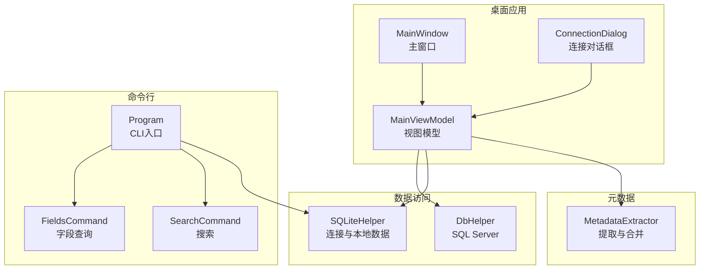
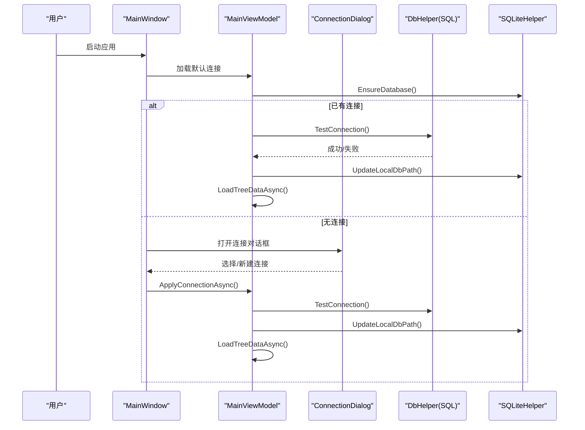
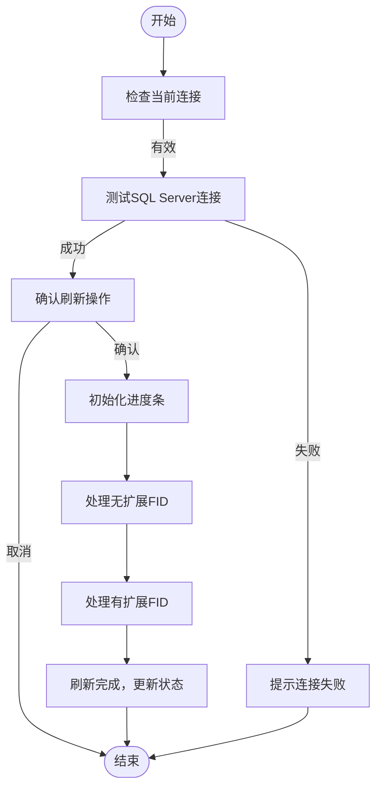
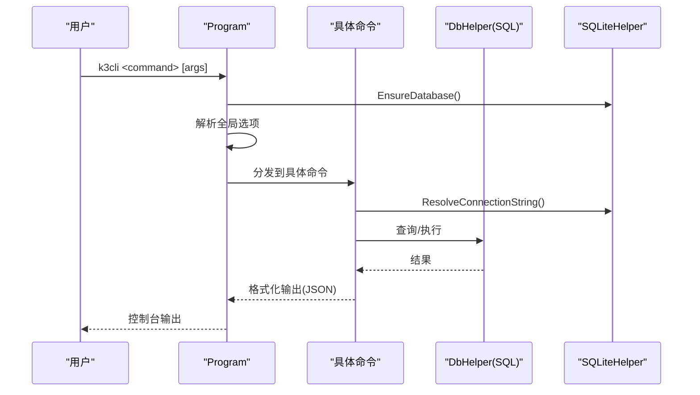
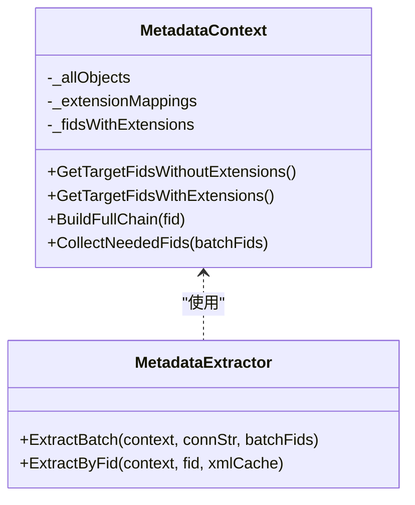
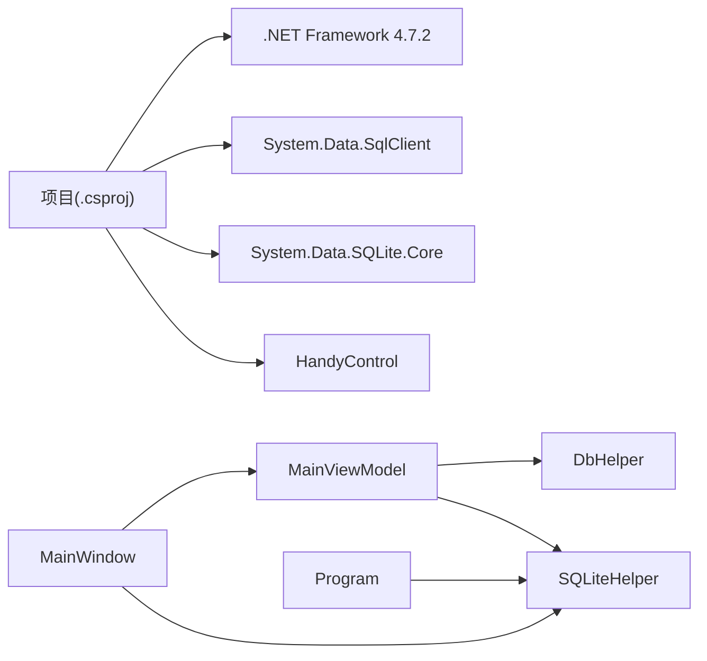

# 快速开始

<cite>
**本文档引用的文件**
- [K3CloudDataDictionary.csproj](file://K3CloudDataDictionary.csproj)
- [App.xaml.cs](file://App.xaml.cs)
- [MainWindow.xaml.cs](file://MainWindow.xaml.cs)
- [ConnectionDialog.xaml.cs](file://ConnectionDialog.xaml.cs)
- [Program.cs](file://K3CloudDataDictionary.Cli/Program.cs)
- [DbHelper.cs](file://Helpers/DbHelper.cs)
- [SQLiteHelper.cs](file://Helpers/SQLiteHelper.cs)
- [MainViewModel.cs](file://ViewModels/MainViewModel.cs)
- [MetadataExtractor.cs](file://Views/MetadataExtractor.cs)
- [ConnectionInfo.cs](file://Models/ConnectionInfo.cs)
- [FieldsCommand.cs](file://K3CloudDataDictionary.Cli/Commands/FieldsCommand.cs)
- [SearchCommand.cs](file://K3CloudDataDictionary.Cli/Commands/SearchCommand.cs)
- [usage-examples.md](file://docs/usage-examples.md)
</cite>

## 目录
1. [简介](#简介)
2. [项目结构](#项目结构)
3. [核心组件](#核心组件)
4. [架构总览](#架构总览)
5. [详细组件分析](#详细组件分析)
6. [依赖关系分析](#依赖关系分析)
7. [性能考虑](#性能考虑)
8. [故障排除指南](#故障排除指南)
9. [结论](#结论)
10. [附录](#附录)

## 简介
本指南面向首次使用金蝶K3 Cloud数据字典系统的新用户，涵盖环境要求、安装步骤、首次运行配置、图形界面与命令行工具的入门使用，以及常见问题排查。系统支持通过图形界面浏览元数据，也提供命令行工具进行自动化查询与集成。

## 项目结构
项目采用 WPF 桌面应用与 .NET Framework 4.7.2，结合 SQLite 存储连接配置，支持图形界面与命令行双入口。核心模块包括：
- 图形界面入口：MainWindow 与 ConnectionDialog，负责连接管理、元数据刷新与页面展示
- 命令行入口：Program，提供 fields/search/form/billtype 等命令
- 数据访问：DbHelper（SQL Server）与 SQLiteHelper（本地连接与本地数据）
- 视图模型：MainViewModel 提供树形导航、标签页管理与查询封装
- 元数据提取：MetadataExtractor 负责继承链与扩展链合并

**图表来源**
- [MainWindow.xaml.cs:36-86](file://MainWindow.xaml.cs#L36-L86)
- [ConnectionDialog.xaml.cs:25-33](file://ConnectionDialog.xaml.cs#L25-L33)
- [Program.cs:14-69](file://K3CloudDataDictionary.Cli/Program.cs#L14-L69)
- [DbHelper.cs:9-25](file://Helpers/DbHelper.cs#L9-L25)
- [SQLiteHelper.cs:17-53](file://Helpers/SQLiteHelper.cs#L17-L53)
- [MainViewModel.cs:235-244](file://ViewModels/MainViewModel.cs#L235-L244)
- [MetadataExtractor.cs:102-122](file://Views/MetadataExtractor.cs#L102-L122)

**章节来源**
- [K3CloudDataDictionary.csproj:1-21](file://K3CloudDataDictionary.csproj#L1-L21)
- [App.xaml.cs:1-9](file://App.xaml.cs#L1-L9)

## 核心组件
- 环境要求
  - .NET Framework 4.7.2（WPF 应用）
  - SQL Server（远程连接金蝶K3 Cloud元数据库）
  - SQLite（本地连接配置与本地元数据缓存）
- 安装与运行
  - 直接运行桌面应用或命令行程序
  - 首次运行会初始化 SQLite 连接数据库
- 配置与连接
  - 通过连接对话框添加/编辑/测试/设置默认连接
  - 支持从本地数据文件直接连接或远程刷新元数据
- 元数据刷新
  - 支持全量刷新与仅扩展刷新
  - 本地生成 SQLite 元数据库，用于后续查询与浏览

**章节来源**
- [K3CloudDataDictionary.csproj:2-8](file://K3CloudDataDictionary.csproj#L2-L8)
- [Program.cs:16-17](file://K3CloudDataDictionary.Cli/Program.cs#L16-L17)
- [ConnectionDialog.xaml.cs:71-133](file://ConnectionDialog.xaml.cs#L71-L133)
- [MainWindow.xaml.cs:444-538](file://MainWindow.xaml.cs#L444-L538)

## 架构总览
系统分为三层：
- 表现层：MainWindow 与 ConnectionDialog 提供图形界面交互
- 业务层：MainViewModel 负责连接切换、树形数据加载、标签页管理与查询封装
- 数据层：DbHelper 访问 SQL Server，SQLiteHelper 管理连接与本地元数据文件

**图表来源**
- [MainWindow.xaml.cs:36-86](file://MainWindow.xaml.cs#L36-L86)
- [ConnectionDialog.xaml.cs:155-222](file://ConnectionDialog.xaml.cs#L155-L222)
- [MainViewModel.cs:246-267](file://ViewModels/MainViewModel.cs#L246-L267)
- [DbHelper.cs:9-25](file://Helpers/DbHelper.cs#L9-L25)
- [SQLiteHelper.cs:17-53](file://Helpers/SQLiteHelper.cs#L17-L53)

## 详细组件分析

### 图形界面：连接与元数据刷新
- 连接管理
  - 支持添加、删除、编辑连接
  - 支持测试连接与设置默认连接
  - 支持从本地数据文件直接连接
- 元数据刷新
  - 全量刷新：重建本地元数据库
  - 仅扩展刷新：仅处理存在扩展的对象
  - 刷新进度与错误提示

**图表来源**
- [MainWindow.xaml.cs:444-538](file://MainWindow.xaml.cs#L444-L538)
- [MainWindow.xaml.cs:540-648](file://MainWindow.xaml.cs#L540-L648)

**章节来源**
- [ConnectionDialog.xaml.cs:71-133](file://ConnectionDialog.xaml.cs#L71-L133)
- [ConnectionDialog.xaml.cs:155-222](file://ConnectionDialog.xaml.cs#L155-L222)
- [MainWindow.xaml.cs:444-538](file://MainWindow.xaml.cs#L444-L538)

### 命令行工具：入门与常用命令
- CLI 入口
  - 初始化 SQLite 连接数据库
  - 解析全局选项（连接ID、美化输出）
- 常用命令
  - fields：查询表单字段（支持表单、实体、关键字、精确匹配）
  - search：搜索表单或字段（支持类型与精确匹配）
  - resolve：解析 lookUpObject 对应表单标识
  - billtype/billstatus/enum/assistantdata/form：查询单据类型、状态、枚举、辅助资料、表单信息
  - connections：管理连接（列出、添加、测试、设为默认）

**图表来源**
- [Program.cs:14-69](file://K3CloudDataDictionary.Cli/Program.cs#L14-L69)
- [FieldsCommand.cs:13-85](file://K3CloudDataDictionary.Cli/Commands/FieldsCommand.cs#L13-L85)
- [SearchCommand.cs:13-107](file://K3CloudDataDictionary.Cli/Commands/SearchCommand.cs#L13-L107)

**章节来源**
- [Program.cs:74-97](file://K3CloudDataDictionary.Cli/Program.cs#L74-L97)
- [FieldsCommand.cs:13-85](file://K3CloudDataDictionary.Cli/Commands/FieldsCommand.cs#L13-L85)
- [SearchCommand.cs:13-107](file://K3CloudDataDictionary.Cli/Commands/SearchCommand.cs#L13-L107)

### 元数据提取与合并
- 上下文构建：加载基础信息，构建扩展映射与目标FID列表
- 处理链：继承链 + 扩展链合并，支持去重与覆盖
- 批量提取：收集所需FID → 批量加载XML → 逐个提取并合并

**图表来源**
- [MetadataExtractor.cs:102-122](file://Views/MetadataExtractor.cs#L102-L122)
- [MetadataExtractor.cs:299-311](file://Views/MetadataExtractor.cs#L299-L311)
- [MetadataExtractor.cs:322-360](file://Views/MetadataExtractor.cs#L322-L360)

**章节来源**
- [MetadataExtractor.cs:102-122](file://Views/MetadataExtractor.cs#L102-L122)
- [MetadataExtractor.cs:299-311](file://Views/MetadataExtractor.cs#L299-L311)
- [MetadataExtractor.cs:322-360](file://Views/MetadataExtractor.cs#L322-L360)

## 依赖关系分析
- 项目依赖
  - .NET Framework 4.7.2（WPF）
  - System.Data.SqlClient（SQL Server）
  - System.Data.SQLite.Core（SQLite）
  - HandyControl（WPF控件库）
- 组件耦合
  - MainWindow 依赖 MainViewModel 与 SQLiteHelper
  - MainViewModel 依赖 DbHelper 与 SQLiteHelper
  - CLI Program 依赖各命令与 SQLiteHelper

**图表来源**
- [K3CloudDataDictionary.csproj:9-19](file://K3CloudDataDictionary.csproj#L9-L19)

**章节来源**
- [K3CloudDataDictionary.csproj:9-19](file://K3CloudDataDictionary.csproj#L9-L19)

## 性能考虑
- 元数据刷新
  - 分批处理（无扩展/有扩展两阶段），减少一次性压力
  - 批量加载XML，避免重复网络请求
- 查询优化
  - 本地SQLite缓存，避免频繁访问远程数据库
  - CLI命令默认按表搜索，避免全量字段扫描

[本节为通用建议，不直接分析具体文件]

## 故障排除指南
- 连接失败
  - 使用连接对话框“测试连接”按钮验证凭据与网络
  - 确认 SQL Server 可达与防火墙放行
- 无法刷新元数据
  - 确认已设置有效远程连接
  - 检查本地数据目录权限与磁盘空间
- 本地数据文件丢失
  - 应用会检测并提示“本地数据已删除”，需重新连接或导入数据
- CLI 无默认连接
  - 使用 connections 命令添加并设置默认连接，或通过 -c 指定连接ID

**章节来源**
- [ConnectionDialog.xaml.cs:135-153](file://ConnectionDialog.xaml.cs#L135-L153)
- [MainWindow.xaml.cs:444-457](file://MainWindow.xaml.cs#L444-L457)
- [MainWindow.xaml.cs:428-442](file://MainWindow.xaml.cs#L428-L442)
- [Program.cs:129-151](file://K3CloudDataDictionary.Cli/Program.cs#L129-L151)

## 结论
通过图形界面与命令行工具，用户可以便捷地管理连接、刷新元数据并进行查询。建议首次运行时先添加连接并刷新本地元数据，随后根据业务场景选择图形界面或CLI进行高效检索与集成。

[本节为总结性内容，不直接分析具体文件]

## 附录

### 环境要求与安装步骤
- 环境要求
  - .NET Framework 4.7.2
  - SQL Server（用于远程连接）
  - SQLite（随应用自动初始化）
- 安装步骤
  - 直接运行桌面应用或命令行程序
  - 首次运行自动创建连接数据库

**章节来源**
- [K3CloudDataDictionary.csproj:2-8](file://K3CloudDataDictionary.csproj#L2-L8)
- [Program.cs:16-17](file://K3CloudDataDictionary.Cli/Program.cs#L16-L17)

### 首次运行配置
- 添加数据库连接
  - 打开连接对话框，填写服务器IP、端口、数据库、用户名、密码
  - 点击“测试连接”验证，成功后“保存并设为默认”
- 刷新元数据
  - 点击“刷新元数据”或“刷新扩展元数据”
  - 等待进度完成，状态栏显示刷新结果

**章节来源**
- [ConnectionDialog.xaml.cs:71-133](file://ConnectionDialog.xaml.cs#L71-L133)
- [ConnectionDialog.xaml.cs:155-222](file://ConnectionDialog.xaml.cs#L155-L222)
- [MainWindow.xaml.cs:444-538](file://MainWindow.xaml.cs#L444-L538)

### 使用示例（图形界面）
- 添加连接：在连接对话框中新增或编辑连接
- 刷新元数据：在主界面点击“刷新元数据”
- 浏览树形结构：展开模块树，双击节点打开标签页
- 查询字段：在表单/实体标签页中筛选字段

**章节来源**
- [MainWindow.xaml.cs:353-359](file://MainWindow.xaml.cs#L353-L359)
- [MainViewModel.cs:323-335](file://ViewModels/MainViewModel.cs#L323-L335)

### 使用示例（命令行）
- 查询字段
  - k3cli fields --form <表单标识> [--entity <实体Key>] [--keyword <关键词>] [--exact]
- 搜索表单/字段
  - k3cli search --keyword <关键词> [--type table|field] [--exact]
- 解析 lookUpObject
  - k3cli resolve --id <lookUpObjectID>
- 查询单据类型/状态/枚举/辅助资料
  - k3cli billtype/billstatus/enum/assistantdata/form ...

参考使用案例文档获取完整命令链与输出示例。

**章节来源**
- [FieldsCommand.cs:13-85](file://K3CloudDataDictionary.Cli/Commands/FieldsCommand.cs#L13-L85)
- [SearchCommand.cs:13-107](file://K3CloudDataDictionary.Cli/Commands/SearchCommand.cs#L13-L107)
- [usage-examples.md:1-542](file://docs/usage-examples.md#L1-L542)