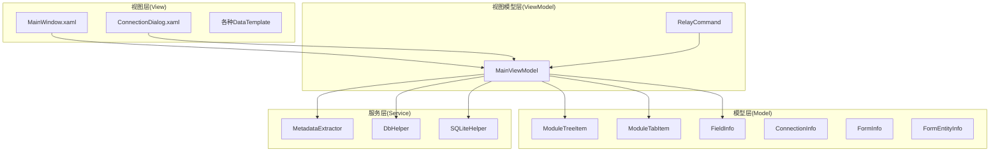
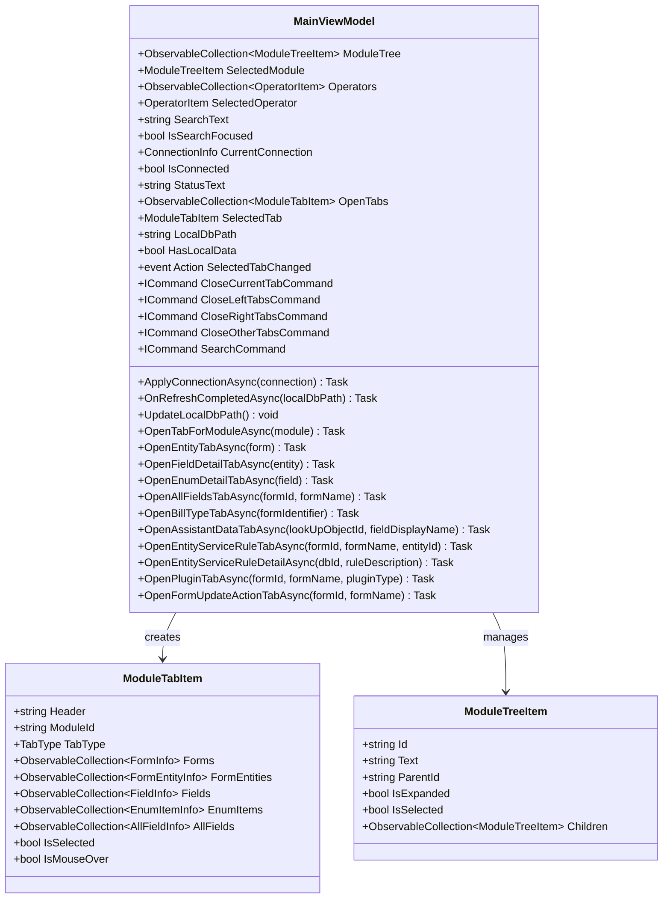
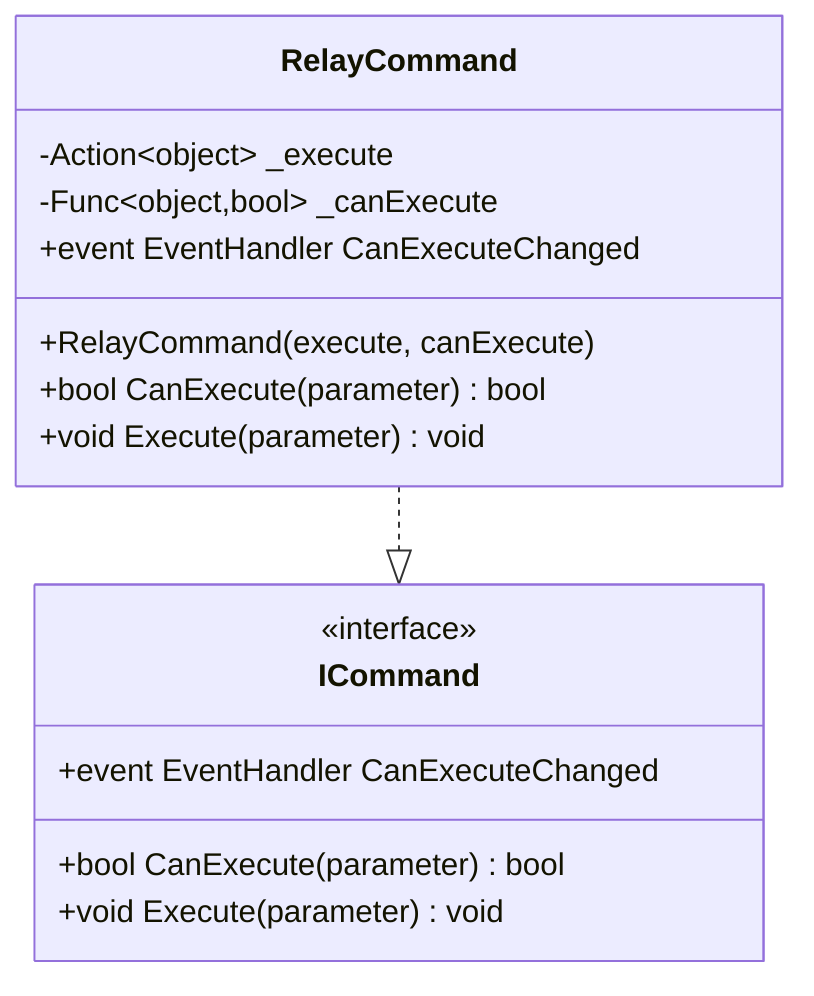
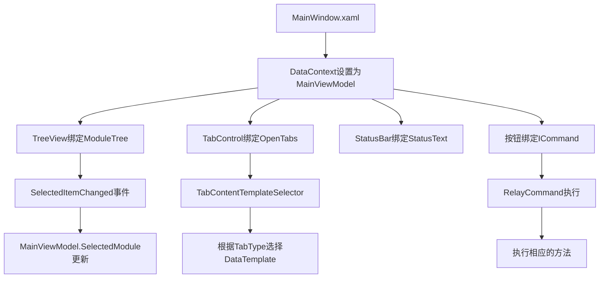
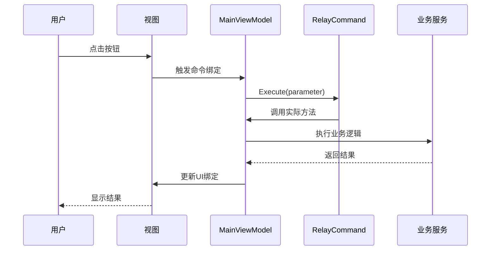
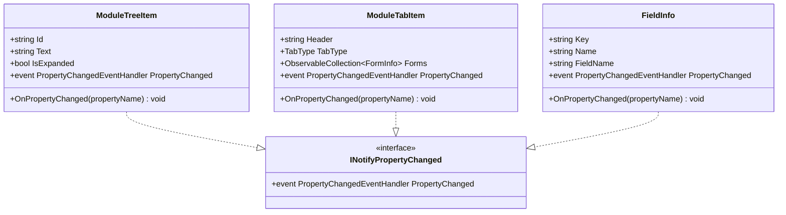
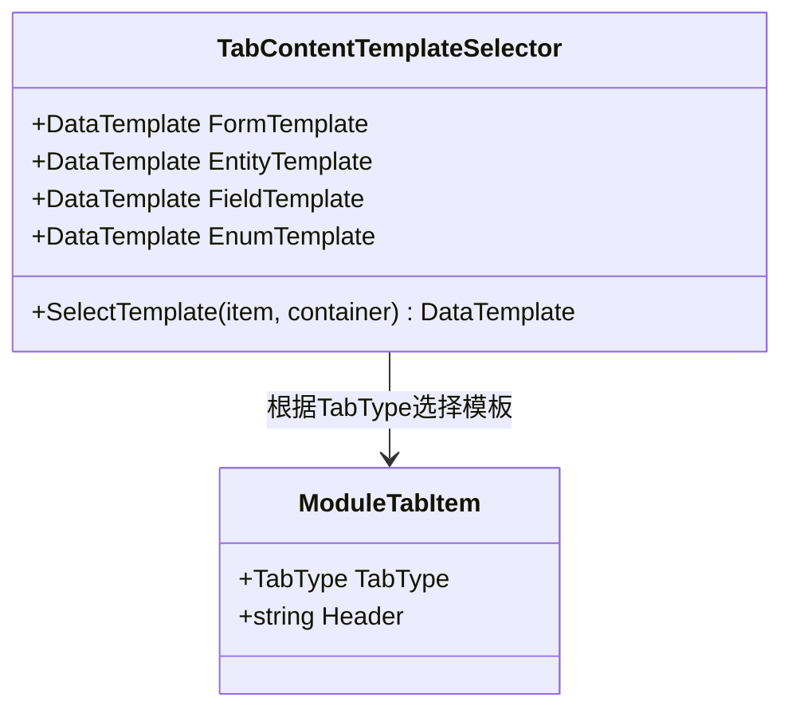
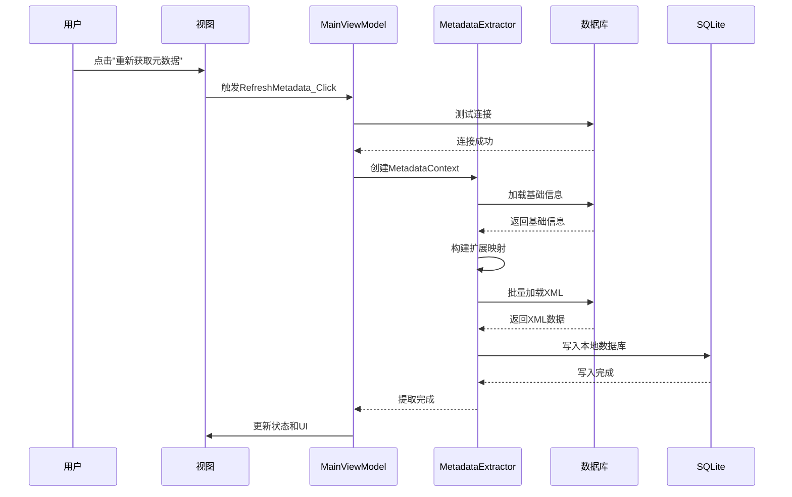

# MVVM模式实现

<cite>
**本文档引用的文件**
- [MainViewModel.cs](file://ViewModels/MainViewModel.cs)
- [RelayCommand.cs](file://ViewModels/RelayCommand.cs)
- [MainWindow.xaml.cs](file://MainWindow.xaml.cs)
- [MainWindow.xaml](file://MainWindow.xaml)
- [App.xaml.cs](file://App.xaml.cs)
- [App.xaml](file://App.xaml)
- [FieldInfo.cs](file://Models/FieldInfo.cs)
- [ModuleTreeItem.cs](file://Models/ModuleTreeItem.cs)
- [ModuleTabItem.cs](file://Models/ModuleTabItem.cs)
- [MetadataExtractor.cs](file://Views/MetadataExtractor.cs)
- [DbHelper.cs](file://Helpers/DbHelper.cs)
- [ConnectionDialog.xaml.cs](file://ConnectionDialog.xaml.cs)
- [TabContentTemplateSelector.cs](file://TabContentTemplateSelector.cs)
</cite>

## 目录
1. [项目概述](#项目概述)
2. [MVVM架构设计](#mvvm架构设计)
3. [核心组件分析](#核心组件分析)
4. [数据绑定机制](#数据绑定机制)
5. [命令模式实现](#命令模式实现)
6. [依赖属性与通知机制](#依赖属性与通知机制)
7. [视图与视图模型解耦](#视图与视图模型解耦)
8. [数据流与事件处理](#数据流与事件处理)
9. [性能优化策略](#性能优化策略)
10. [故障排除指南](#故障排除指南)
11. [总结](#总结)

## 项目概述

金蝶K3 Cloud数据字典系统是一个基于WPF的桌面应用程序，采用MVVM（Model-View-ViewModel）架构模式实现。该系统主要用于管理和展示金蝶K3 Cloud的元数据信息，包括表单、实体、字段、枚举等数据结构。

系统的核心功能包括：
- 连接管理：支持多种数据库连接配置
- 元数据提取：从金蝶K3 Cloud系统中提取元数据
- 数据展示：通过标签页形式展示不同类型的元数据
- 搜索过滤：支持多维度的数据搜索和过滤
- 本地数据存储：使用SQLite存储提取的元数据

## MVVM架构设计

### 架构层次结构



**图表来源**
- [MainViewModel.cs:18-198](file://ViewModels/MainViewModel.cs#L18-L198)
- [MainWindow.xaml.cs:30-86](file://MainWindow.xaml.cs#L30-L86)
- [ModuleTreeItem.cs:7-58](file://Models/ModuleTreeItem.cs#L7-L58)

### 核心设计原则

1. **关注点分离**：视图负责UI呈现，视图模型负责业务逻辑，模型负责数据结构
2. **双向数据绑定**：通过INotifyPropertyChanged接口实现数据同步
3. **命令模式**：使用ICommand接口处理用户交互
4. **依赖注入**：通过构造函数注入依赖的服务和数据

## 核心组件分析

### MainViewModel - 核心控制器

MainViewModel是整个应用的核心控制器，承担着以下职责：

#### 主要属性和功能



**图表来源**
- [MainViewModel.cs:18-127](file://ViewModels/MainViewModel.cs#L18-L127)
- [ModuleTabItem.cs:9-194](file://Models/ModuleTabItem.cs#L9-L194)
- [ModuleTreeItem.cs:7-58](file://Models/ModuleTreeItem.cs#L7-L58)

#### 关键特性

1. **连接管理**：处理数据库连接的建立、维护和断开
2. **元数据管理**：负责从数据库提取元数据并存储到本地SQLite
3. **标签页管理**：动态创建和管理不同类型的标签页
4. **状态管理**：跟踪应用的各种状态信息
5. **数据查询**：提供各种数据查询和过滤功能

**章节来源**
- [MainViewModel.cs:198-800](file://ViewModels/MainViewModel.cs#L198-L800)

### RelayCommand - 命令实现

RelayCommand实现了ICommand接口，提供了命令模式的标准实现：



**图表来源**
- [RelayCommand.cs:6-26](file://ViewModels/RelayCommand.cs#L6-L26)

**章节来源**
- [RelayCommand.cs:1-28](file://ViewModels/RelayCommand.cs#L1-L28)

## 数据绑定机制

### 视图到视图模型的绑定

MainWindow.xaml中定义了完整的数据绑定关系：



**图表来源**
- [MainWindow.xaml:22-24](file://MainWindow.xaml#L22-L24)
- [MainWindow.xaml:164-171](file://MainWindow.xaml#L164-L171)
- [MainWindow.xaml.cs:353-359](file://MainWindow.xaml.cs#L353-L359)

### 双向数据绑定实现

系统广泛使用了双向数据绑定机制：

1. **属性绑定**：`Text="{Binding SearchText}"` 实现搜索文本的双向绑定
2. **集合绑定**：`ItemsSource="{Binding Forms}"` 绑定数据网格的数据源
3. **命令绑定**：`Command="{Binding CloseCurrentTabCommand}"` 绑定用户操作
4. **状态绑定**：`Visibility="{Binding HasLocalData, Converter={StaticResource BoolToVis}}"` 绑定UI状态

**章节来源**
- [MainWindow.xaml:193-250](file://MainWindow.xaml#L193-L250)
- [MainWindow.xaml:385-383](file://MainWindow.xaml#L385-L383)

## 命令模式实现

### 命令执行流程



**图表来源**
- [MainWindow.xaml.cs:650-657](file://MainWindow.xaml.cs#L650-L657)
- [RelayCommand.cs:17-19](file://ViewModels/RelayCommand.cs#L17-L19)

### 命令类型

系统实现了多种类型的命令：

1. **标签页关闭命令**：`CloseCurrentTabCommand`、`CloseLeftTabsCommand`等
2. **搜索命令**：`SearchCommand` 处理用户输入的搜索请求
3. **连接管理命令**：处理连接的建立、删除、测试等操作

**章节来源**
- [MainViewModel.cs:176-194](file://ViewModels/MainViewModel.cs#L176-L194)
- [MainWindow.xaml.cs:650-657](file://MainWindow.xaml.cs#L650-L657)

## 依赖属性与通知机制

### INotifyPropertyChanged实现

所有模型类都实现了INotifyPropertyChanged接口，确保UI能够实时响应数据变化：



**图表来源**
- [ModuleTreeItem.cs:52-57](file://Models/ModuleTreeItem.cs#L52-L57)
- [ModuleTabItem.cs:188-193](file://Models/ModuleTabItem.cs#L188-L193)
- [FieldInfo.cs:102-107](file://Models/FieldInfo.cs#L102-L107)

### 属性变更通知

当属性值发生变化时，通过`OnPropertyChanged()`方法触发通知：

```csharp
public string SearchText
{
    get => _searchText;
    set 
    { 
        _searchText = value; 
        OnPropertyChanged(); 
        OnPropertyChanged(nameof(SearchPlaceholderVisible)); 
    }
}
```

这种设计确保了UI能够及时反映数据的变化，实现了真正的双向数据绑定。

**章节来源**
- [ModuleTreeItem.cs:15-43](file://Models/ModuleTreeItem.cs#L15-L43)
- [ModuleTabItem.cs:30-46](file://Models/ModuleTabItem.cs#L30-L46)
- [FieldInfo.cs:22-38](file://Models/FieldInfo.cs#L22-L38)

## 视图与视图模型解耦

### 解耦策略

1. **接口隔离**：通过接口定义契约，避免直接依赖具体实现
2. **事件驱动**：使用事件机制进行松耦合通信
3. **数据绑定**：通过绑定机制减少直接调用
4. **模板化设计**：使用DataTemplate实现视图的可替换性

### TabContentTemplateSelector的作用



**图表来源**
- [TabContentTemplateSelector.cs:7-49](file://TabContentTemplateSelector.cs#L7-L49)

**章节来源**
- [TabContentTemplateSelector.cs:1-52](file://TabContentTemplateSelector.cs#L1-L52)

## 数据流与事件处理

### 元数据提取流程



**图表来源**
- [MainWindow.xaml.cs:444-538](file://MainWindow.xaml.cs#L444-L538)
- [MetadataExtractor.cs:102-284](file://Views/MetadataExtractor.cs#L102-L284)

### 事件处理机制

系统使用多种事件处理机制：

1. **属性变更事件**：`PropertyChanged` 通知UI属性变化
2. **集合变更事件**：`CollectionChanged` 处理集合增删改
3. **用户交互事件**：按钮点击、双击等用户操作
4. **状态变更事件**：连接状态、标签页状态等

**章节来源**
- [MainWindow.xaml.cs:36-86](file://MainWindow.xaml.cs#L36-L86)
- [MainViewModel.cs:217-233](file://ViewModels/MainViewModel.cs#L217-L233)

## 性能优化策略

### 异步操作优化

1. **异步数据加载**：使用`async/await`避免UI阻塞
2. **批量数据处理**：通过批处理减少数据库访问次数
3. **延迟加载**：标签页内容按需加载，减少初始启动时间

### 内存管理

1. **对象池**：复用常用对象，减少垃圾回收压力
2. **弱引用**：在适当的地方使用弱引用避免内存泄漏
3. **及时释放**：确保数据库连接和文件句柄及时释放

### UI响应性优化

1. **Dispatcher调度**：使用Dispatcher确保UI线程安全
2. **进度反馈**：长耗时操作显示进度条
3. **防抖处理**：搜索框输入使用防抖机制

## 故障排除指南

### 常见问题及解决方案

#### 连接问题
- **问题**：数据库连接失败
- **原因**：网络问题、认证失败、权限不足
- **解决**：检查连接字符串、网络连通性、账户权限

#### 元数据提取失败
- **问题**：元数据提取过程中出现异常
- **原因**：数据库结构变化、权限不足、网络超时
- **解决**：检查数据库状态、增加超时时间、重新提取

#### UI无响应
- **问题**：界面卡死无响应
- **原因**：长时间运行的操作阻塞了UI线程
- **解决**：使用异步操作、显示进度指示器

**章节来源**
- [DbHelper.cs:9-25](file://Helpers/DbHelper.cs#L9-L25)
- [MainWindow.xaml.cs:520-532](file://MainWindow.xaml.cs#L520-L532)

## 总结

金蝶K3 Cloud数据字典系统成功实现了MVVM架构模式，展现了现代WPF应用的最佳实践：

### 架构优势

1. **清晰的职责分离**：视图、视图模型、模型各司其职
2. **高度的可测试性**：通过接口和依赖注入便于单元测试
3. **良好的可维护性**：模块化设计便于功能扩展和bug修复
4. **优秀的用户体验**：响应式UI和流畅的交互体验

### 技术亮点

1. **完善的命令模式**：通过RelayCommand实现标准的命令处理
2. **强大的数据绑定**：双向数据绑定确保UI与数据的实时同步
3. **灵活的模板系统**：通过DataTemplate实现视图的可定制化
4. **高效的异步处理**：异步操作保证UI的响应性

### 应用价值

该系统不仅满足了金蝶K3 Cloud元数据管理的实际需求，更重要的是为类似的企业级应用开发提供了可参考的MVVM实现范例。其架构设计、代码组织和最佳实践都值得其他开发者学习和借鉴。

通过深入理解这个系统的MVVM实现，开发者可以更好地掌握WPF应用开发的核心概念，提高企业级应用的开发效率和质量。