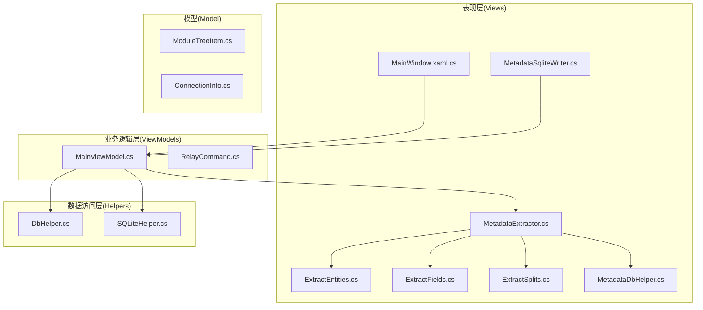
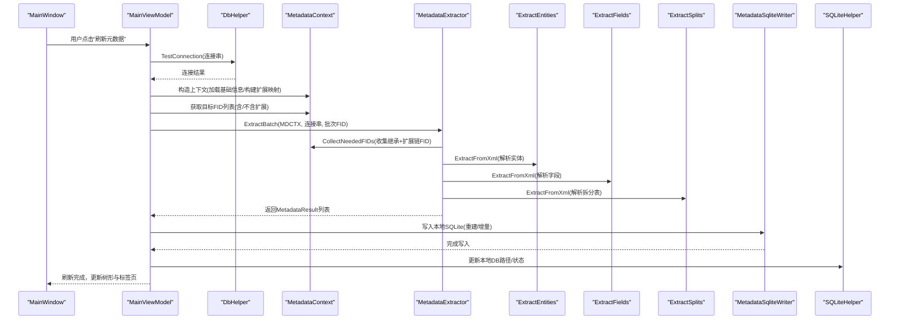
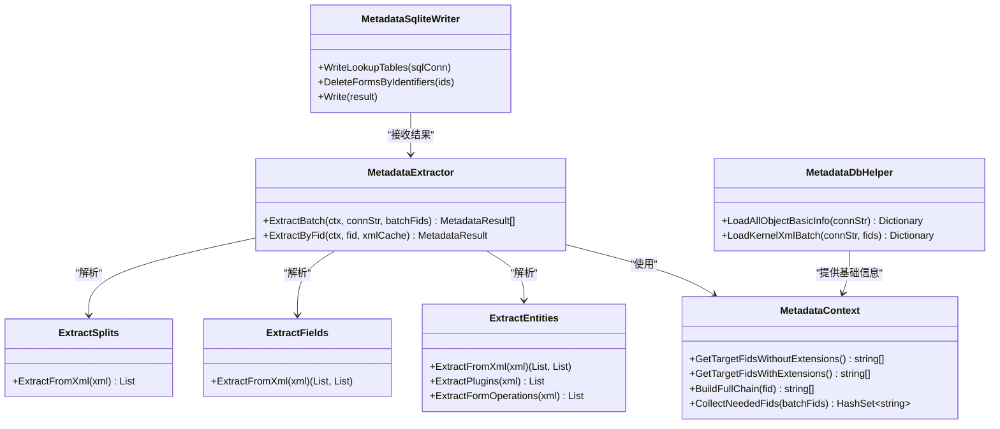
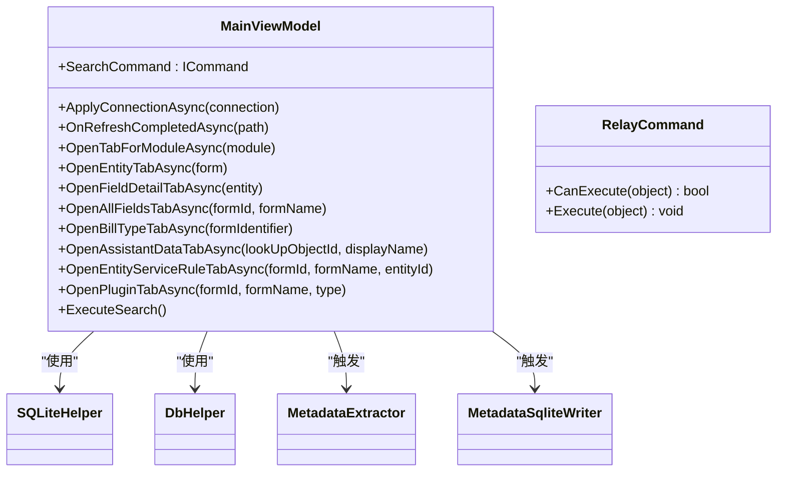
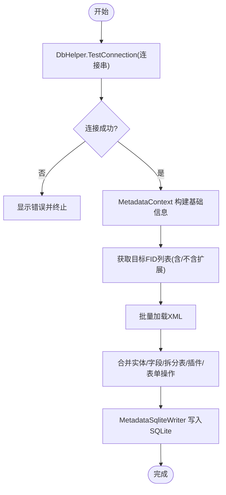
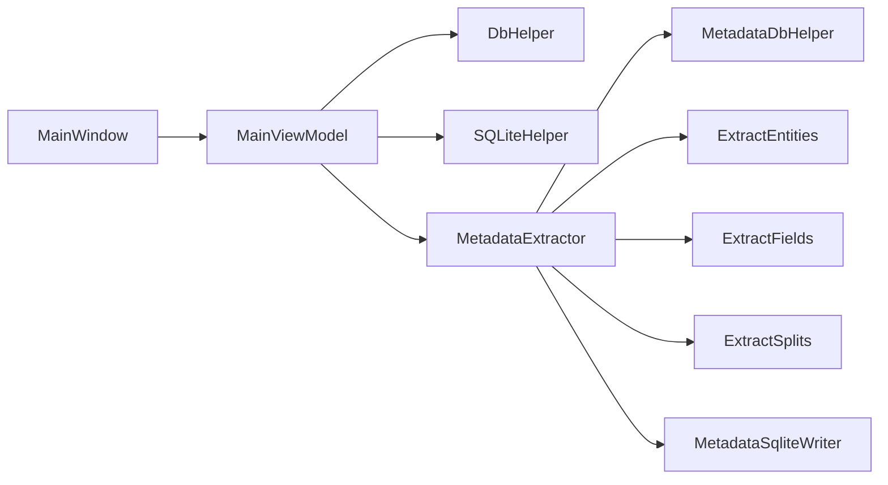

# 分层架构说明

<cite>
**本文档引用的文件**
- [MainWindow.xaml.cs](file://MainWindow.xaml.cs)
- [MainViewModel.cs](file://ViewModels/MainViewModel.cs)
- [RelayCommand.cs](file://ViewModels/RelayCommand.cs)
- [DbHelper.cs](file://Helpers/DbHelper.cs)
- [SQLiteHelper.cs](file://Helpers/SQLiteHelper.cs)
- [MetadataExtractor.cs](file://Views/MetadataExtractor.cs)
- [MetadataSqliteWriter.cs](file://Views/MetadataSqliteWriter.cs)
- [MetadataDbHelper.cs](file://Views/MetadataDbHelper.cs)
- [ExtractEntities.cs](file://Views/ExtractEntities.cs)
- [ExtractFields.cs](file://Views/ExtractFields.cs)
- [ExtractSplits.cs](file://Views/ExtractSplits.cs)
- [ModuleTreeItem.cs](file://Models/ModuleTreeItem.cs)
- [ConnectionInfo.cs](file://Models/ConnectionInfo.cs)
</cite>

## 目录
1. [引言](#引言)
2. [项目结构](#项目结构)
3. [核心组件](#核心组件)
4. [架构总览](#架构总览)
5. [详细组件分析](#详细组件分析)
6. [依赖关系分析](#依赖关系分析)
7. [性能考虑](#性能考虑)
8. [故障排除指南](#故障排除指南)
9. [结论](#结论)

## 引言
本项目为金蝶K3 Cloud数据字典系统，采用WPF桌面应用实现，围绕“表现层(Views)—业务逻辑层(ViewModels)—数据访问层(Helpers)”三层架构设计，实现从SQL Server数据库提取元数据、转换为本地SQLite数据并以树形结构与标签页形式展示的功能。本文档将详细阐述各层职责、边界与交互方式，解释数据流与控制流，给出分层架构图与序列图，并提供代码示例路径以便读者定位实现细节。

## 项目结构
项目采用按层分目录的组织方式：
- Views：UI模板与数据提取/写入组件（负责视图渲染与数据转换）
- ViewModels：MVVM ViewModel与命令封装（负责业务逻辑编排与状态管理）
- Helpers：数据库连接与SQLite配置工具（负责底层数据访问与配置）
- Models：领域模型（负责数据结构定义）
- CLI：命令行工具（与本说明文档关注的GUI分层架构关系较弱）

**图表来源**
- [MainWindow.xaml.cs:36-86](file://MainWindow.xaml.cs#L36-L86)
- [MainViewModel.cs:246-275](file://ViewModels/MainViewModel.cs#L246-L275)
- [DbHelper.cs:9-25](file://Helpers/DbHelper.cs#L9-L25)
- [SQLiteHelper.cs:17-53](file://Helpers/SQLiteHelper.cs#L17-L53)
- [MetadataExtractor.cs:102-138](file://Views/MetadataExtractor.cs#L102-L138)
- [MetadataSqliteWriter.cs:27-50](file://Views/MetadataSqliteWriter.cs#L27-L50)
- [ExtractEntities.cs:47-139](file://Views/ExtractEntities.cs#L47-L139)
- [ExtractFields.cs:70-164](file://Views/ExtractFields.cs#L70-L164)
- [ExtractSplits.cs:28-56](file://Views/ExtractSplits.cs#L28-L56)
- [MetadataDbHelper.cs:36-79](file://Views/MetadataDbHelper.cs#L36-L79)

**章节来源**
- [MainWindow.xaml.cs:36-86](file://MainWindow.xaml.cs#L36-L86)
- [MainViewModel.cs:198-215](file://ViewModels/MainViewModel.cs#L198-L215)

## 核心组件
- 表现层(Views)
  - MainWindow：承载UI事件与页面生命周期，协调ViewModel与各视图组件
  - MetadataExtractor/MetadataContext：构建继承/扩展链，批量提取XML并合并实体、字段、拆分表、插件与表单操作等
  - MetadataSqliteWriter：将提取结果写入本地SQLite数据库，重建或增量写入
  - ExtractEntities/ExtractFields/ExtractSplits：从XML解析实体、字段、拆分表信息
  - MetadataDbHelper：查询对象基础信息与批量加载内核XML
- 业务逻辑层(ViewModels)
  - MainViewModel：负责模块树、标签页、搜索、连接切换、查询本地SQLite等业务编排
  - RelayCommand：封装ICommand，简化命令绑定与CanExecute
- 数据访问层(Helpers)
  - DbHelper：测试SQL Server连接、执行查询与标量子查询
  - SQLiteHelper：维护连接配置SQLite、扫描/导入/重命名本地数据文件、迁移旧版metadata.db

**章节来源**
- [MainWindow.xaml.cs:361-423](file://MainWindow.xaml.cs#L361-L423)
- [MainViewModel.cs:323-357](file://ViewModels/MainViewModel.cs#L323-L357)
- [DbHelper.cs:9-67](file://Helpers/DbHelper.cs#L9-L67)
- [SQLiteHelper.cs:17-53](file://Helpers/SQLiteHelper.cs#L17-L53)
- [MetadataExtractor.cs:102-138](file://Views/MetadataExtractor.cs#L102-L138)
- [MetadataSqliteWriter.cs:27-50](file://Views/MetadataSqliteWriter.cs#L27-L50)
- [ExtractEntities.cs:47-139](file://Views/ExtractEntities.cs#L47-L139)
- [ExtractFields.cs:70-164](file://Views/ExtractFields.cs#L70-L164)
- [ExtractSplits.cs:28-56](file://Views/ExtractSplits.cs#L28-L56)
- [MetadataDbHelper.cs:36-79](file://Views/MetadataDbHelper.cs#L36-L79)

## 架构总览
系统遵循MVVM模式，表现层(Views)通过MainWindow与XAML绑定到MainViewModel，ViewModel负责业务编排并通过Helpers访问数据库与本地SQLite。数据流从SQL Server经XML解析与合并，最终写入本地SQLite供UI查询展示。

**图表来源**
- [MainWindow.xaml.cs:444-538](file://MainWindow.xaml.cs#L444-L538)
- [MainViewModel.cs:246-275](file://ViewModels/MainViewModel.cs#L246-L275)
- [DbHelper.cs:9-25](file://Helpers/DbHelper.cs#L9-L25)
- [MetadataExtractor.cs:299-311](file://Views/MetadataExtractor.cs#L299-L311)
- [MetadataContext.cs:102-138](file://Views/MetadataExtractor.cs#L102-L138)
- [ExtractEntities.cs:47-139](file://Views/ExtractEntities.cs#L47-L139)
- [ExtractFields.cs:70-164](file://Views/ExtractFields.cs#L70-L164)
- [ExtractSplits.cs:28-56](file://Views/ExtractSplits.cs#L28-L56)
- [MetadataSqliteWriter.cs:27-50](file://Views/MetadataSqliteWriter.cs#L27-L50)
- [SQLiteHelper.cs:235-290](file://Helpers/SQLiteHelper.cs#L235-L290)

## 详细组件分析

### 表现层(Views)分析
- MainWindow
  - 负责窗口加载、连接对话框、标签页创建与切换、进度条与消息提示、调用ViewModel进行元数据刷新与查询
  - 示例路径：[MainWindow.xaml.cs:36-86](file://MainWindow.xaml.cs#L36-L86)、[MainWindow.xaml.cs:444-538](file://MainWindow.xaml.cs#L444-L538)
- MetadataExtractor/MetadataContext
  - 构建继承链与扩展链，按批次加载XML并合并实体/字段/拆分表/插件/表单操作
  - 示例路径：[MetadataExtractor.cs:102-138](file://Views/MetadataExtractor.cs#L102-L138)、[MetadataExtractor.cs:299-360](file://Views/MetadataExtractor.cs#L299-L360)
- MetadataSqliteWriter
  - 创建/重建SQLite表结构，批量写入提取结果，支持增量写入与删除指定表单数据
  - 示例路径：[MetadataSqliteWriter.cs:27-50](file://Views/MetadataSqliteWriter.cs#L27-L50)、[MetadataSqliteWriter.cs:560-800](file://Views/MetadataSqliteWriter.cs#L560-L800)
- ExtractEntities/ExtractFields/ExtractSplits
  - 从XML解析实体、字段、拆分表信息，支持服务规则、插件、表单操作等子结构
  - 示例路径：[ExtractEntities.cs:47-139](file://Views/ExtractEntities.cs#L47-L139)、[ExtractFields.cs:70-164](file://Views/ExtractFields.cs#L70-L164)、[ExtractSplits.cs:28-56](file://Views/ExtractSplits.cs#L28-L56)
- MetadataDbHelper
  - 加载对象基础信息与批量内核XML，支撑上下文构建
  - 示例路径：[MetadataDbHelper.cs:44-79](file://Views/MetadataDbHelper.cs#L44-L79)

**图表来源**
- [MetadataExtractor.cs:102-138](file://Views/MetadataExtractor.cs#L102-L138)
- [MetadataExtractor.cs:299-360](file://Views/MetadataExtractor.cs#L299-L360)
- [MetadataSqliteWriter.cs:27-50](file://Views/MetadataSqliteWriter.cs#L27-L50)
- [ExtractEntities.cs:47-139](file://Views/ExtractEntities.cs#L47-L139)
- [ExtractFields.cs:70-164](file://Views/ExtractFields.cs#L70-L164)
- [ExtractSplits.cs:28-56](file://Views/ExtractSplits.cs#L28-L56)
- [MetadataDbHelper.cs:44-79](file://Views/MetadataDbHelper.cs#L44-L79)

**章节来源**
- [MainWindow.xaml.cs:361-423](file://MainWindow.xaml.cs#L361-L423)
- [MetadataExtractor.cs:102-138](file://Views/MetadataExtractor.cs#L102-L138)
- [MetadataSqliteWriter.cs:27-50](file://Views/MetadataSqliteWriter.cs#L27-L50)
- [ExtractEntities.cs:47-139](file://Views/ExtractEntities.cs#L47-L139)
- [ExtractFields.cs:70-164](file://Views/ExtractFields.cs#L70-L164)
- [ExtractSplits.cs:28-56](file://Views/ExtractSplits.cs#L28-L56)
- [MetadataDbHelper.cs:44-79](file://Views/MetadataDbHelper.cs#L44-L79)

### 业务逻辑层(ViewModels)分析
- MainViewModel
  - 负责模块树加载、标签页打开与切换、搜索、连接应用、本地SQLite查询、状态更新
  - 使用SQLiteHelper管理连接配置与本地DB路径，使用DbHelper测试连接
  - 示例路径：[MainViewModel.cs:246-275](file://ViewModels/MainViewModel.cs#L246-L275)、[MainViewModel.cs:323-357](file://ViewModels/MainViewModel.cs#L323-L357)、[MainViewModel.cs:292-321](file://ViewModels/MainViewModel.cs#L292-L321)
- RelayCommand
  - 封装ICommand，简化命令绑定与CanExecute变更通知
  - 示例路径：[RelayCommand.cs:6-26](file://ViewModels/RelayCommand.cs#L6-L26)

**图表来源**
- [MainViewModel.cs:246-275](file://ViewModels/MainViewModel.cs#L246-L275)
- [MainViewModel.cs:323-357](file://ViewModels/MainViewModel.cs#L323-L357)
- [MainViewModel.cs:292-321](file://ViewModels/MainViewModel.cs#L292-L321)
- [RelayCommand.cs:6-26](file://ViewModels/RelayCommand.cs#L6-L26)

**章节来源**
- [MainViewModel.cs:198-215](file://ViewModels/MainViewModel.cs#L198-L215)
- [MainViewModel.cs:246-275](file://ViewModels/MainViewModel.cs#L246-L275)
- [RelayCommand.cs:6-26](file://ViewModels/RelayCommand.cs#L6-L26)

### 数据访问层(Helpers)分析
- DbHelper
  - 提供连接测试、查询执行、标量子查询执行
  - 示例路径：[DbHelper.cs:9-67](file://Helpers/DbHelper.cs#L9-L67)
- SQLiteHelper
  - 维护连接配置SQLite、扫描/导入/重命名本地数据文件、迁移旧版metadata.db
  - 示例路径：[SQLiteHelper.cs:17-53](file://Helpers/SQLiteHelper.cs#L17-L53)、[SQLiteHelper.cs:218-254](file://Helpers/SQLiteHelper.cs#L218-L254)

**图表来源**
- [DbHelper.cs:9-25](file://Helpers/DbHelper.cs#L9-L25)
- [MetadataExtractor.cs:102-138](file://Views/MetadataExtractor.cs#L102-L138)
- [MetadataExtractor.cs:299-311](file://Views/MetadataExtractor.cs#L299-L311)
- [MetadataSqliteWriter.cs:27-50](file://Views/MetadataSqliteWriter.cs#L27-L50)

**章节来源**
- [DbHelper.cs:9-67](file://Helpers/DbHelper.cs#L9-L67)
- [SQLiteHelper.cs:17-53](file://Helpers/SQLiteHelper.cs#L17-L53)

## 依赖关系分析
- 层间依赖
  - Views依赖ViewModel（通过XAML绑定）与Helpers（通过ViewModel间接使用）
  - ViewModel依赖Helpers（连接配置与SQLite管理）、Views（触发写入与刷新）
  - Helpers为纯工具层，不反向依赖上层
- 内部依赖
  - MetadataExtractor依赖MetadataDbHelper、ExtractEntities、ExtractFields、ExtractSplits
  - MetadataSqliteWriter依赖MetadataExtractor输出结果
  - MainViewModel依赖DbHelper、SQLiteHelper、Views组件触发

**图表来源**
- [MainWindow.xaml.cs:36-86](file://MainWindow.xaml.cs#L36-L86)
- [MainViewModel.cs:246-275](file://ViewModels/MainViewModel.cs#L246-L275)
- [DbHelper.cs:9-25](file://Helpers/DbHelper.cs#L9-L25)
- [SQLiteHelper.cs:17-53](file://Helpers/SQLiteHelper.cs#L17-L53)
- [MetadataExtractor.cs:102-138](file://Views/MetadataExtractor.cs#L102-L138)
- [MetadataDbHelper.cs:44-79](file://Views/MetadataDbHelper.cs#L44-L79)
- [ExtractEntities.cs:47-139](file://Views/ExtractEntities.cs#L47-L139)
- [ExtractFields.cs:70-164](file://Views/ExtractFields.cs#L70-L164)
- [ExtractSplits.cs:28-56](file://Views/ExtractSplits.cs#L28-L56)
- [MetadataSqliteWriter.cs:27-50](file://Views/MetadataSqliteWriter.cs#L27-L50)

**章节来源**
- [MainWindow.xaml.cs:361-423](file://MainWindow.xaml.cs#L361-L423)
- [MainViewModel.cs:246-275](file://ViewModels/MainViewModel.cs#L246-L275)
- [MetadataExtractor.cs:102-138](file://Views/MetadataExtractor.cs#L102-L138)

## 性能考虑
- 批量处理
  - MetadataContext按继承链与扩展链收集所需FID，统一批量加载XML，避免重复查询
  - MetadataExtractor.ExtractBatch按批次处理，减少内存峰值
- 数据库访问
  - MetadataDbHelper.LoadKernelXmlBatch使用参数化IN子句一次性获取多个对象XML
  - DbHelper.ExecuteQuery设置CommandTimeout，避免长时间阻塞
- 写入优化
  - MetadataSqliteWriter使用事务批量插入，显著提升写入性能
  - 支持增量写入与删除指定表单数据，降低全量重建成本

[本节为通用指导，无需具体文件引用]

## 故障排除指南
- 远程数据库连接失败
  - 现象：刷新元数据时报错“远程数据库连接失败”
  - 排查：使用DbHelper.TestConnection检查连接串与凭据
  - 参考路径：[MainWindow.xaml.cs:453-457](file://MainWindow.xaml.cs#L453-L457)、[DbHelper.cs:9-25](file://Helpers/DbHelper.cs#L9-L25)
- 本地数据文件丢失
  - 现象：本地数据文件被删除后界面异常
  - 处理：MainWindow.CheckLocalDataAvailability检测并清理缓存与状态
  - 参考路径：[MainWindow.xaml.cs:428-442](file://MainWindow.xaml.cs#L428-L442)
- 刷新过程并发控制
  - 现象：重复点击刷新导致并发问题
  - 处理：使用Interlocked标记避免并发刷新
  - 参考路径：[MainWindow.xaml.cs:459-537](file://MainWindow.xaml.cs#L459-L537)
- 本地数据文件管理
  - 功能：导入、重命名、删除本地数据文件，避免与连接命名冲突
  - 参考路径：[SQLiteHelper.cs:256-338](file://Helpers/SQLiteHelper.cs#L256-L338)

**章节来源**
- [MainWindow.xaml.cs:428-442](file://MainWindow.xaml.cs#L428-L442)
- [MainWindow.xaml.cs:453-457](file://MainWindow.xaml.cs#L453-L457)
- [MainWindow.xaml.cs:459-537](file://MainWindow.xaml.cs#L459-L537)
- [DbHelper.cs:9-25](file://Helpers/DbHelper.cs#L9-L25)
- [SQLiteHelper.cs:256-338](file://Helpers/SQLiteHelper.cs#L256-L338)

## 结论
本项目通过清晰的三层架构实现了从SQL Server到本地SQLite再到UI展示的完整数据流。表现层专注于用户交互与视图渲染，业务逻辑层承担业务编排与状态管理，数据访问层提供稳定的数据库与本地存储能力。借助批量化与事务化的数据处理策略，系统在功能完整性与性能稳定性方面达到良好平衡。建议后续可在依赖注入容器与单元测试方面进一步增强，以提升可维护性与可测试性。