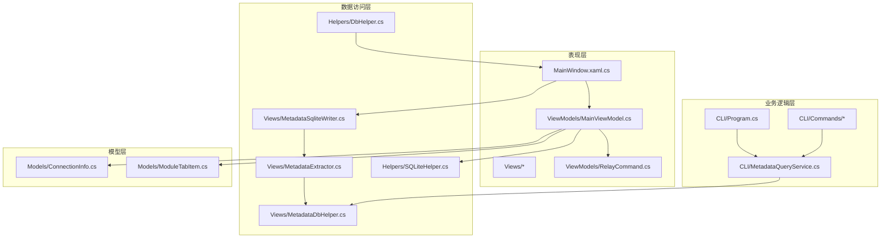
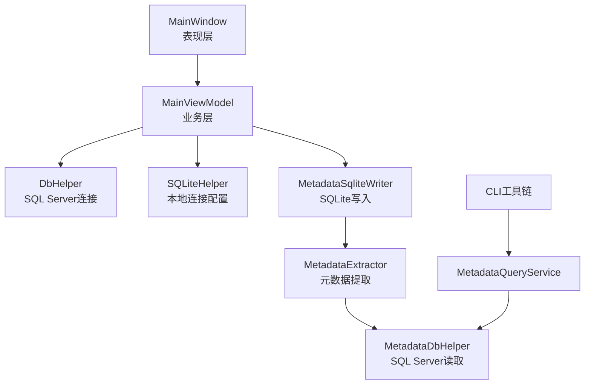
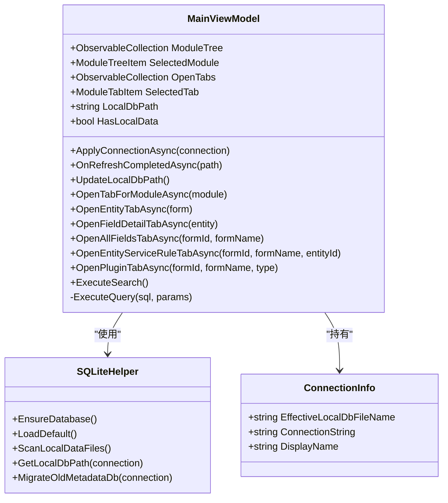
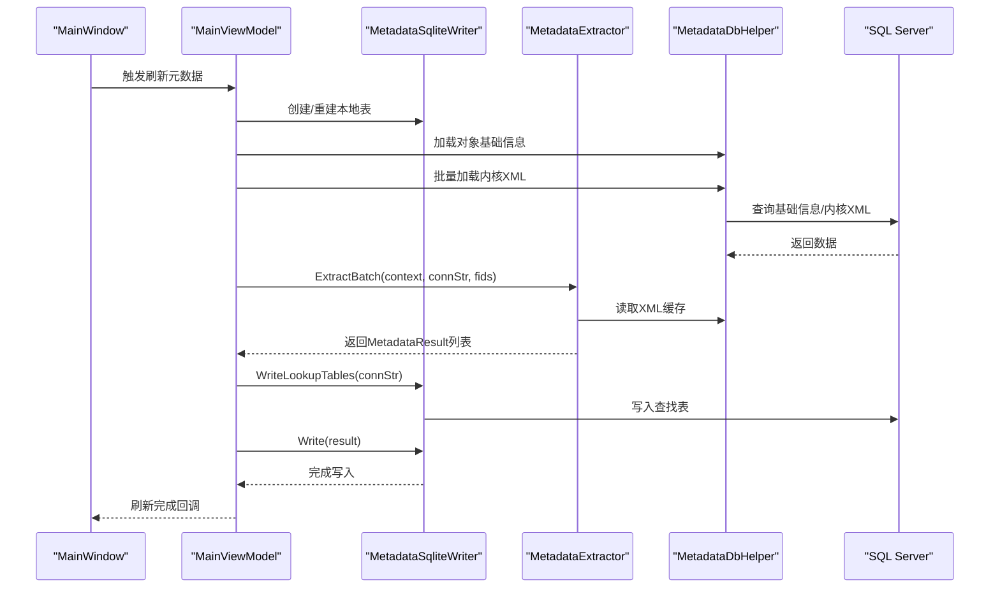
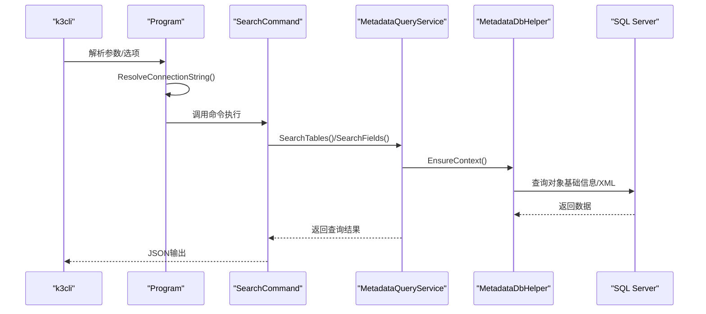
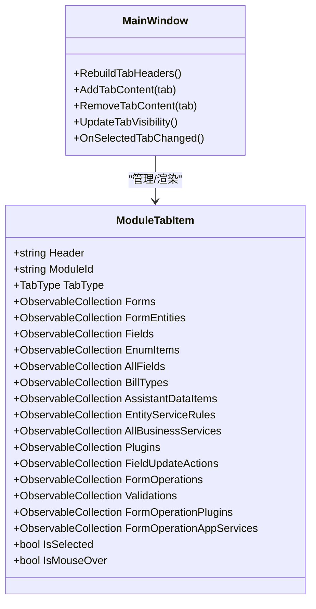
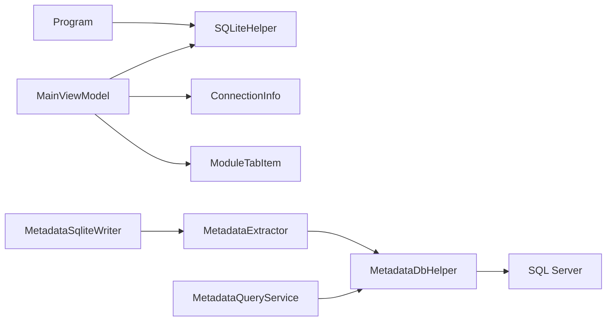

# 技术架构

<cite>
**本文档引用的文件**
- [App.xaml.cs](file://App.xaml.cs)
- [MainWindow.xaml.cs](file://MainWindow.xaml.cs)
- [MainViewModel.cs](file://ViewModels/MainViewModel.cs)
- [RelayCommand.cs](file://ViewModels/RelayCommand.cs)
- [MetadataExtractor.cs](file://Views/MetadataExtractor.cs)
- [MetadataDbHelper.cs](file://Views/MetadataDbHelper.cs)
- [MetadataSqliteWriter.cs](file://Views/MetadataSqliteWriter.cs)
- [DbHelper.cs](file://Helpers/DbHelper.cs)
- [SQLiteHelper.cs](file://Helpers/SQLiteHelper.cs)
- [ConnectionInfo.cs](file://Models/ConnectionInfo.cs)
- [ModuleTabItem.cs](file://Models/ModuleTabItem.cs)
- [Program.cs](file://K3CloudDataDictionary.Cli/Program.cs)
- [MetadataQueryService.cs](file://K3CloudDataDictionary.Cli/Services/MetadataQueryService.cs)
- [SearchCommand.cs](file://K3CloudDataDictionary.Cli/Commands/SearchCommand.cs)
</cite>

## 目录
1. [引言](#引言)
2. [项目结构](#项目结构)
3. [核心组件](#核心组件)
4. [架构总览](#架构总览)
5. [详细组件分析](#详细组件分析)
6. [依赖关系分析](#依赖关系分析)
7. [性能考量](#性能考量)
8. [故障排查指南](#故障排查指南)
9. [结论](#结论)
10. [附录](#附录)

## 引言
本技术架构文档面向金蝶K3 Cloud数据字典系统，聚焦MVVM模式与分层架构的落地实践，涵盖表现层（UI）、业务逻辑层（ViewModel/Service）、数据访问层（SQLite/SQL Server）以及CLI工具链。文档重点阐述以下要点：
- MVVM模式在WPF中的应用：MainViewModel作为核心控制器，负责状态管理、命令与数据加载。
- 分层架构：表现层（MainWindow + Views/Templates）、业务层（ViewModels + Services）、数据层（Helpers + Views）。
- 核心组件交互：MainViewModel与MetadataExtractor、DbHelper、SQLiteHelper协作，实现“远程元数据提取—本地SQLite缓存—UI展示”的闭环。
- 技术选型权衡：WPF + HandyControl控件库 + SQLite本地缓存 + CLI工具链的设计动机与收益。

## 项目结构
项目采用功能域与层次相结合的组织方式：
- 表现层：MainWindow、Views目录下的视图与模板选择器，配合ViewModels中的MainViewModel与RelayCommand。
- 业务逻辑层：ViewModels中的MainViewModel负责模块树、标签页、查询与刷新流程；CLI中的Program与Commands/Services提供命令行能力。
- 数据访问层：Helpers中的DbHelper、SQLiteHelper负责SQL Server连接测试与SQLite连接配置；Views中的MetadataDbHelper、MetadataExtractor、MetadataSqliteWriter负责元数据抽取与SQLite写入。
- 模型层：Models中的ConnectionInfo、ModuleTabItem等承载UI与业务状态。
- 文档与资源：docs目录存放使用示例，Resources存放资源文件。

图表来源
- [MainWindow.xaml.cs:1-1439](file://MainWindow.xaml.cs#L1-L1439)
- [MainViewModel.cs:1-1883](file://ViewModels/MainViewModel.cs#L1-L1883)
- [MetadataExtractor.cs:1-880](file://Views/MetadataExtractor.cs#L1-L880)
- [MetadataDbHelper.cs:1-131](file://Views/MetadataDbHelper.cs#L1-L131)
- [MetadataSqliteWriter.cs:1-846](file://Views/MetadataSqliteWriter.cs#L1-L846)
- [DbHelper.cs:1-70](file://Helpers/DbHelper.cs#L1-L70)
- [SQLiteHelper.cs:1-370](file://Helpers/SQLiteHelper.cs#L1-L370)
- [ConnectionInfo.cs:1-144](file://Models/ConnectionInfo.cs#L1-L144)
- [ModuleTabItem.cs:1-196](file://Models/ModuleTabItem.cs#L1-L196)
- [Program.cs:1-166](file://K3CloudDataDictionary.Cli/Program.cs#L1-L166)
- [MetadataQueryService.cs:1-839](file://K3CloudDataDictionary.Cli/Services/MetadataQueryService.cs#L1-L839)

章节来源
- [MainWindow.xaml.cs:1-1439](file://MainWindow.xaml.cs#L1-L1439)
- [MainViewModel.cs:1-1883](file://ViewModels/MainViewModel.cs#L1-L1883)
- [MetadataExtractor.cs:1-880](file://Views/MetadataExtractor.cs#L1-L880)
- [MetadataDbHelper.cs:1-131](file://Views/MetadataDbHelper.cs#L1-L131)
- [MetadataSqliteWriter.cs:1-846](file://Views/MetadataSqliteWriter.cs#L1-L846)
- [DbHelper.cs:1-70](file://Helpers/DbHelper.cs#L1-L70)
- [SQLiteHelper.cs:1-370](file://Helpers/SQLiteHelper.cs#L1-L370)
- [ConnectionInfo.cs:1-144](file://Models/ConnectionInfo.cs#L1-L144)
- [ModuleTabItem.cs:1-196](file://Models/ModuleTabItem.cs#L1-L196)
- [Program.cs:1-166](file://K3CloudDataDictionary.Cli/Program.cs#L1-L166)
- [MetadataQueryService.cs:1-839](file://K3CloudDataDictionary.Cli/Services/MetadataQueryService.cs#L1-L839)

## 核心组件
- MainViewModel：MVVM控制器，负责模块树加载、标签页管理、查询与刷新流程、状态文本更新、连接切换与本地数据库路径维护。
- MetadataExtractor/MetadataContext：元数据提取核心，构建继承链与扩展链，合并实体、字段、拆分表、插件、表单操作等信息。
- MetadataSqliteWriter：将提取结果写入SQLite，重建/维护本地数据表，支持增量更新与级联删除。
- DbHelper/SQLiteHelper：DbHelper提供SQL Server连接测试与通用查询；SQLiteHelper负责连接配置存储、本地数据文件扫描与迁移。
- MetadataDbHelper：从SQL Server读取对象基础信息与内核XML，供上下文与提取器使用。
- CLI工具链：Program统一入口，MetadataQueryService直连SQL Server实时查询，SearchCommand等命令提供JSON输出。

章节来源
- [MainViewModel.cs:1-1883](file://ViewModels/MainViewModel.cs#L1-L1883)
- [MetadataExtractor.cs:1-880](file://Views/MetadataExtractor.cs#L1-L880)
- [MetadataSqliteWriter.cs:1-846](file://Views/MetadataSqliteWriter.cs#L1-L846)
- [DbHelper.cs:1-70](file://Helpers/DbHelper.cs#L1-L70)
- [SQLiteHelper.cs:1-370](file://Helpers/SQLiteHelper.cs#L1-L370)
- [MetadataDbHelper.cs:1-131](file://Views/MetadataDbHelper.cs#L1-L131)
- [Program.cs:1-166](file://K3CloudDataDictionary.Cli/Program.cs#L1-L166)
- [MetadataQueryService.cs:1-839](file://K3CloudDataDictionary.Cli/Services/MetadataQueryService.cs#L1-L839)

## 架构总览
系统采用MVVM分层架构：
- 表现层（WPF + HandyControl）：MainWindow承载UI，MainViewModel绑定数据与命令，TabContentTemplateSelector动态渲染标签页内容。
- 业务层：MainViewModel协调元数据刷新与查询；CLI侧MetadataQueryService提供实时查询能力。
- 数据层：DbHelper/SQLiteHelper负责连接与本地存储；MetadataDbHelper/MetadataExtractor/MetadataSqliteWriter负责远程元数据抽取与本地SQLite写入。

图表来源
- [MainWindow.xaml.cs:1-1439](file://MainWindow.xaml.cs#L1-L1439)
- [MainViewModel.cs:1-1883](file://ViewModels/MainViewModel.cs#L1-L1883)
- [DbHelper.cs:1-70](file://Helpers/DbHelper.cs#L1-L70)
- [SQLiteHelper.cs:1-370](file://Helpers/SQLiteHelper.cs#L1-L370)
- [MetadataSqliteWriter.cs:1-846](file://Views/MetadataSqliteWriter.cs#L1-L846)
- [MetadataExtractor.cs:1-880](file://Views/MetadataExtractor.cs#L1-L880)
- [MetadataDbHelper.cs:1-131](file://Views/MetadataDbHelper.cs#L1-L131)
- [MetadataQueryService.cs:1-839](file://K3CloudDataDictionary.Cli/Services/MetadataQueryService.cs#L1-L839)

## 详细组件分析

### MainViewModel 控制器
- 角色定位：MVVM控制器，集中管理模块树、标签页、查询与刷新流程，维护连接状态与本地数据库路径。
- 关键职责：
  - 连接管理：ApplyConnectionAsync、OnRefreshCompletedAsync、UpdateLocalDbPath。
  - 树与标签页：LoadTreeDataAsync、OpenTabForModuleAsync、OpenEntityTabAsync、OpenFieldDetailTabAsync等。
  - 查询与导航：OpenAllFieldsTabAsync、OpenEntityServiceRuleTabAsync、OpenPluginTabAsync等。
  - 本地查询：ExecuteQuery基于SQLite连接执行SQL，返回字典列表供UI绑定。
- 与SQLite交互：通过SQLiteHelper确保数据库存在、加载默认连接、扫描本地数据文件、迁移旧版metadata.db。

图表来源
- [MainViewModel.cs:1-1883](file://ViewModels/MainViewModel.cs#L1-L1883)
- [SQLiteHelper.cs:1-370](file://Helpers/SQLiteHelper.cs#L1-L370)
- [ConnectionInfo.cs:1-144](file://Models/ConnectionInfo.cs#L1-L144)

章节来源
- [MainViewModel.cs:1-1883](file://ViewModels/MainViewModel.cs#L1-L1883)
- [SQLiteHelper.cs:1-370](file://Helpers/SQLiteHelper.cs#L1-L370)
- [ConnectionInfo.cs:1-144](file://Models/ConnectionInfo.cs#L1-L144)

### 元数据提取与本地存储
- MetadataContext：一次性加载对象基础信息，构建继承链与扩展链映射，提供按FID收集所需XML的批处理能力。
- MetadataExtractor：根据上下文与XML缓存，逐个提取并合并实体、字段、拆分表、插件、表单操作等，形成MetadataResult。
- MetadataSqliteWriter：创建/重建本地SQLite表，写入查找表与业务数据，支持增量更新与按表单标识删除级联清理。
- MetadataDbHelper：从SQL Server读取对象基础信息与内核XML，供上下文与提取器使用。

图表来源
- [MainWindow.xaml.cs:444-538](file://MainWindow.xaml.cs#L444-L538)
- [MainViewModel.cs:269-275](file://ViewModels/MainViewModel.cs#L269-L275)
- [MetadataSqliteWriter.cs:285-301](file://Views/MetadataSqliteWriter.cs#L285-L301)
- [MetadataExtractor.cs:299-311](file://Views/MetadataExtractor.cs#L299-L311)
- [MetadataDbHelper.cs:44-79](file://Views/MetadataDbHelper.cs#L44-L79)

章节来源
- [MetadataExtractor.cs:1-880](file://Views/MetadataExtractor.cs#L1-L880)
- [MetadataSqliteWriter.cs:1-846](file://Views/MetadataSqliteWriter.cs#L1-L846)
- [MetadataDbHelper.cs:1-131](file://Views/MetadataDbHelper.cs#L1-L131)

### CLI工具链与实时查询
- Program：统一入口，解析全局选项，路由命令，解析连接字符串。
- MetadataQueryService：懒加载上下文，加载元素类型名称映射，提供表单、实体、字段、单据类型、辅助资料、枚举等查询接口。
- SearchCommand：接收关键字，调用MetadataQueryService的搜索接口，输出JSON。

图表来源
- [Program.cs:129-151](file://K3CloudDataDictionary.Cli/Program.cs#L129-L151)
- [SearchCommand.cs:13-107](file://K3CloudDataDictionary.Cli/Commands/SearchCommand.cs#L13-L107)
- [MetadataQueryService.cs:27-37](file://K3CloudDataDictionary.Cli/Services/MetadataQueryService.cs#L27-L37)
- [MetadataDbHelper.cs:44-79](file://Views/MetadataDbHelper.cs#L44-L79)

章节来源
- [Program.cs:1-166](file://K3CloudDataDictionary.Cli/Program.cs#L1-L166)
- [MetadataQueryService.cs:1-839](file://K3CloudDataDictionary.Cli/Services/MetadataQueryService.cs#L1-L839)
- [SearchCommand.cs:1-110](file://K3CloudDataDictionary.Cli/Commands/SearchCommand.cs#L1-L110)

### 标签页与数据模型
- ModuleTabItem：承载不同类型的标签页数据集合（表单、实体、字段、枚举、插件、服务规则等），支持UI绑定与状态切换。
- MainWindow：动态构建标签页卡片与内容面板，响应MainViewModel的标签页集合变化与选中状态变更。

图表来源
- [ModuleTabItem.cs:1-196](file://Models/ModuleTabItem.cs#L1-L196)
- [MainWindow.xaml.cs:108-134](file://MainWindow.xaml.cs#L108-L134)
- [MainWindow.xaml.cs:301-325](file://MainWindow.xaml.cs#L301-L325)
- [MainWindow.xaml.cs:338-351](file://MainWindow.xaml.cs#L338-L351)

章节来源
- [ModuleTabItem.cs:1-196](file://Models/ModuleTabItem.cs#L1-L196)
- [MainWindow.xaml.cs:1-1439](file://MainWindow.xaml.cs#L1-L1439)

## 依赖关系分析
- 组件耦合：
  - MainViewModel依赖SQLiteHelper（连接配置与本地文件管理）、ConnectionInfo（连接信息）、ModuleTabItem（标签页数据容器）。
  - 元数据流程中，MetadataSqliteWriter依赖MetadataExtractor与MetadataDbHelper，后者依赖SQL Server。
  - CLI侧Program依赖SQLiteHelper解析连接，MetadataQueryService依赖MetadataDbHelper与SQL Server。
- 外部依赖：
  - WPF + HandyControl用于UI呈现。
  - System.Data.SQLite用于本地SQLite存储。
  - System.Data.SqlClient用于SQL Server连接。
- 循环依赖规避：各层职责清晰，未见循环引用。

图表来源
- [MainViewModel.cs:1-1883](file://ViewModels/MainViewModel.cs#L1-L1883)
- [SQLiteHelper.cs:1-370](file://Helpers/SQLiteHelper.cs#L1-L370)
- [ConnectionInfo.cs:1-144](file://Models/ConnectionInfo.cs#L1-L144)
- [ModuleTabItem.cs:1-196](file://Models/ModuleTabItem.cs#L1-L196)
- [MetadataSqliteWriter.cs:1-846](file://Views/MetadataSqliteWriter.cs#L1-L846)
- [MetadataExtractor.cs:1-880](file://Views/MetadataExtractor.cs#L1-L880)
- [MetadataDbHelper.cs:1-131](file://Views/MetadataDbHelper.cs#L1-L131)
- [Program.cs:1-166](file://K3CloudDataDictionary.Cli/Program.cs#L1-L166)
- [MetadataQueryService.cs:1-839](file://K3CloudDataDictionary.Cli/Services/MetadataQueryService.cs#L1-L839)

章节来源
- [MainViewModel.cs:1-1883](file://ViewModels/MainViewModel.cs#L1-L1883)
- [MetadataSqliteWriter.cs:1-846](file://Views/MetadataSqliteWriter.cs#L1-L846)
- [MetadataExtractor.cs:1-880](file://Views/MetadataExtractor.cs#L1-L880)
- [MetadataDbHelper.cs:1-131](file://Views/MetadataDbHelper.cs#L1-L131)
- [Program.cs:1-166](file://K3CloudDataDictionary.Cli/Program.cs#L1-L166)
- [MetadataQueryService.cs:1-839](file://K3CloudDataDictionary.Cli/Services/MetadataQueryService.cs#L1-L839)

## 性能考量
- 元数据提取批处理：MetadataExtractor通过CollectNeededFids收集所需FID，一次性批量加载XML，减少数据库往返次数。
- 上下文只读：MetadataContext为只读上下文，避免并发写入带来的复杂性，提升线程安全性。
- SQLite事务：MetadataSqliteWriter在构造函数中开启事务，批量写入时显著降低磁盘IO开销。
- 增量更新：支持DeleteFormsByIdentifiers按表单标识删除级联数据并InitIdCounters重置ID计数，避免全量重建。
- UI异步：MainWindow刷新元数据使用Task.Run与Dispatcher.Invoke，避免阻塞UI线程。
- CLI查询限制：SearchFields/SearchTables限制返回条目上限，避免大规模全量扫描导致的性能问题。

## 故障排查指南
- 连接失败：
  - 使用DbHelper.TestConnection验证SQL Server连接字符串有效性。
  - 检查SQLiteHelper.EnsureDatabase是否成功创建connections.db。
- 本地数据异常：
  - 检查MainWindow.CheckLocalDataAvailability是否检测到本地数据文件被删除并重置状态。
  - 使用SQLiteHelper.ScanLocalDataFiles确认本地数据文件列表与关联连接。
- 刷新失败：
  - 检查MainWindow.RefreshMetadata_Click/RefreshExtensionMetadata_Click中的错误提示与Growl反馈。
  - 确认MetadataSqliteWriter.WriteLookupTables与Write是否抛出异常。
- CLI查询异常：
  - Program.ResolveConnectionString解析默认连接失败时，提示需指定连接ID或添加默认连接。
  - MetadataQueryService在提取元数据时捕获异常并输出错误信息。

章节来源
- [DbHelper.cs:9-25](file://Helpers/DbHelper.cs#L9-L25)
- [SQLiteHelper.cs:17-53](file://Helpers/SQLiteHelper.cs#L17-L53)
- [MainWindow.xaml.cs:428-442](file://MainWindow.xaml.cs#L428-L442)
- [MainWindow.xaml.cs:444-538](file://MainWindow.xaml.cs#L444-L538)
- [Program.cs:129-151](file://K3CloudDataDictionary.Cli/Program.cs#L129-L151)
- [MetadataQueryService.cs:206-224](file://K3CloudDataDictionary.Cli/Services/MetadataQueryService.cs#L206-L224)

## 结论
本系统通过MVVM与分层架构实现了清晰的职责分离：表现层专注UI与交互，业务层集中处理流程与状态，数据层负责远程与本地存储。核心组件围绕MainViewModel、MetadataExtractor、DbHelper、SQLiteHelper协同工作，既满足桌面端的交互体验，又通过CLI工具链提供高效的命令行查询能力。SQLite本地缓存策略有效降低了对远程数据库的依赖，提升了离线可用性与查询性能。

## 附录
- 技术选型说明：
  - WPF：成熟的桌面UI框架，适合复杂交互与数据绑定。
  - HandyControl：增强控件库，简化常用控件的样式与交互。
  - SQLite：轻量本地存储，便于迁移与备份，适合作为离线缓存。
  - CLI：提供命令行工具，便于自动化与脚本集成。