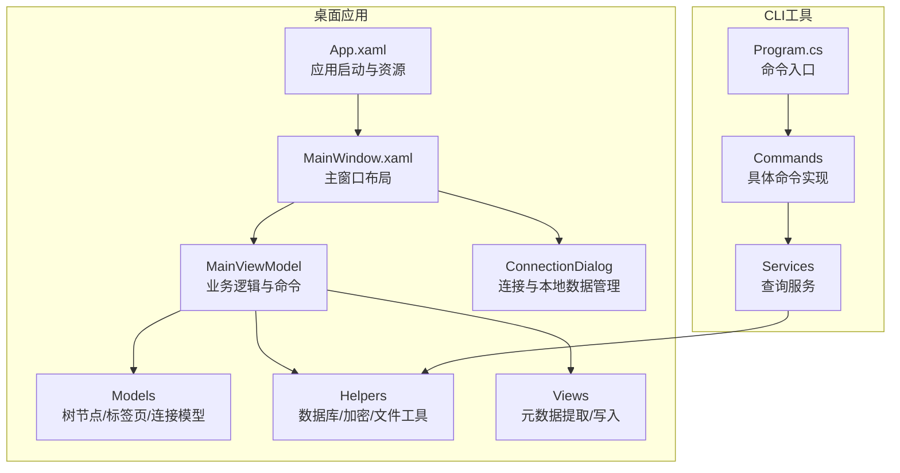
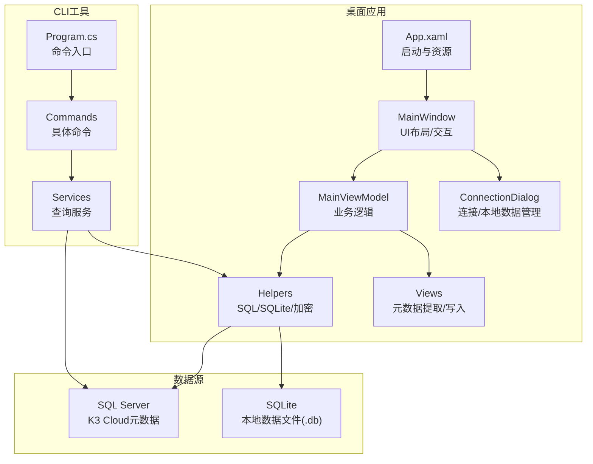
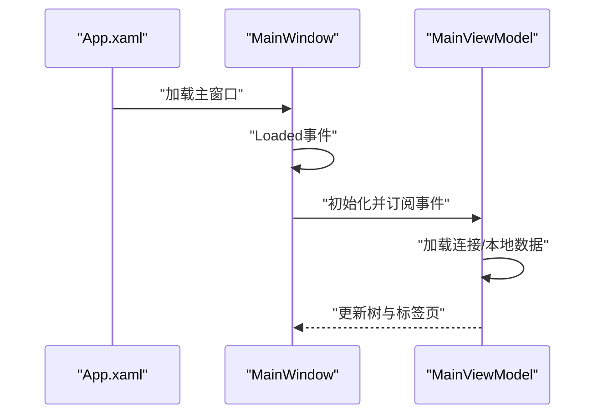
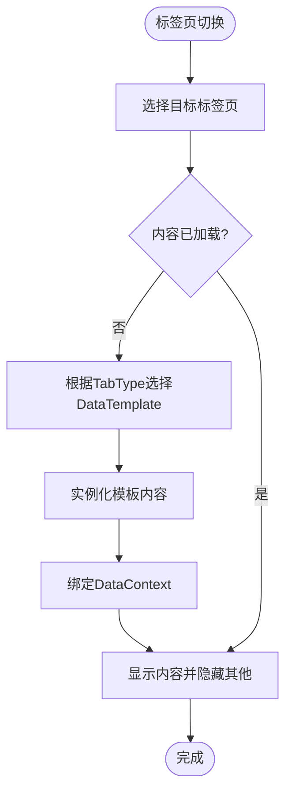
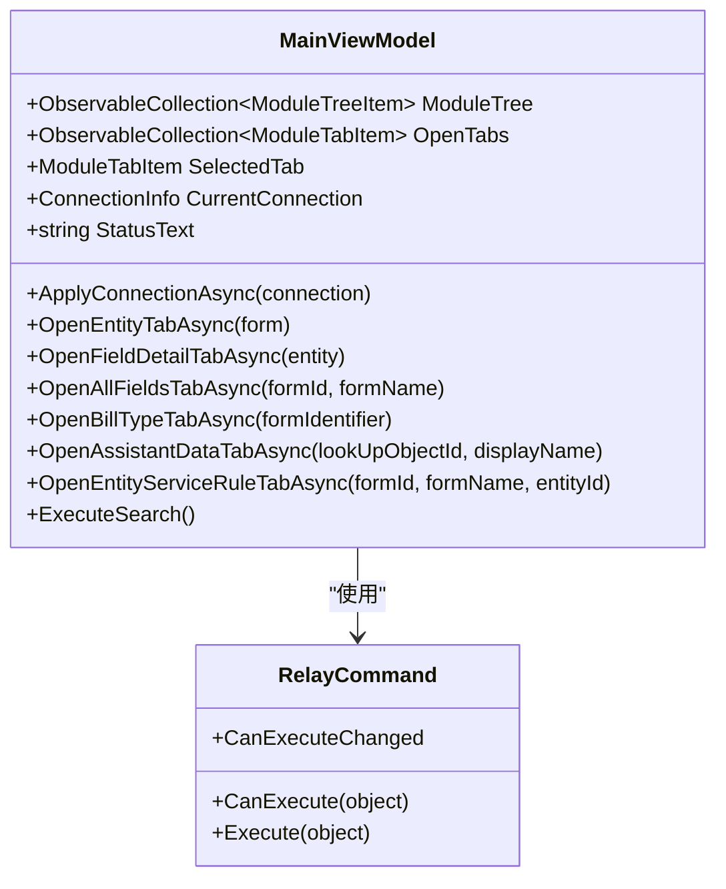
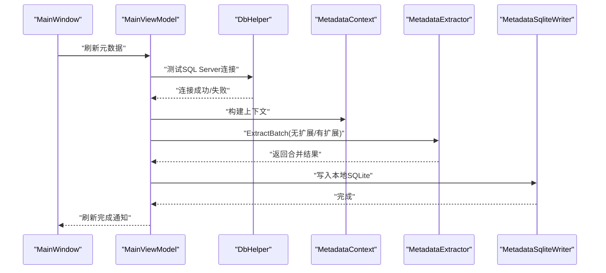
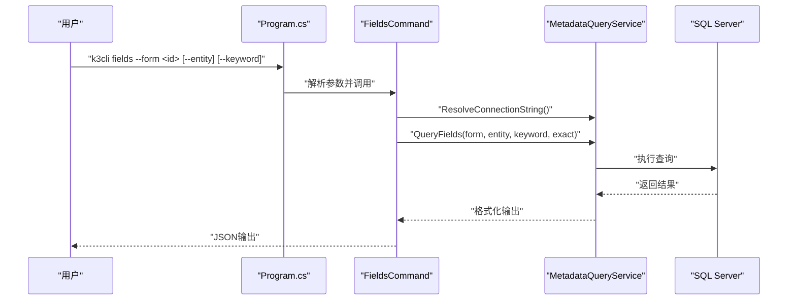
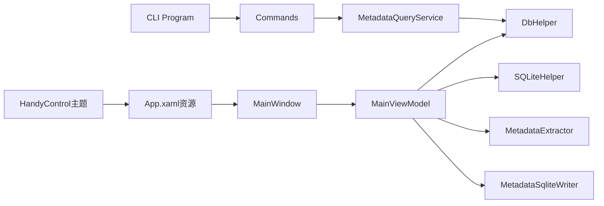

# 整体架构设计

<cite>
**本文档引用的文件**
- [App.xaml](file://App.xaml)
- [App.xaml.cs](file://App.xaml.cs)
- [MainWindow.xaml](file://MainWindow.xaml)
- [MainWindow.xaml.cs](file://MainWindow.xaml.cs)
- [Program.cs](file://K3CloudDataDictionary.Cli/Program.cs)
- [MainViewModel.cs](file://ViewModels/MainViewModel.cs)
- [RelayCommand.cs](file://ViewModels/RelayCommand.cs)
- [DbHelper.cs](file://Helpers/DbHelper.cs)
- [SQLiteHelper.cs](file://Helpers/SQLiteHelper.cs)
- [MetadataExtractor.cs](file://Views/MetadataExtractor.cs)
- [ModuleTreeItem.cs](file://Models/ModuleTreeItem.cs)
- [ModuleTabItem.cs](file://Models/ModuleTabItem.cs)
- [ConnectionDialog.xaml](file://ConnectionDialog.xaml)
- [FieldsCommand.cs](file://K3CloudDataDictionary.Cli/Commands/FieldsCommand.cs)
- [MetadataQueryService.cs](file://K3CloudDataDictionary.Cli/Services/MetadataQueryService.cs)
</cite>

## 目录
1. [引言](#引言)
2. [项目结构](#项目结构)
3. [核心组件](#核心组件)
4. [架构总览](#架构总览)
5. [详细组件分析](#详细组件分析)
6. [依赖关系分析](#依赖关系分析)
7. [性能考虑](#性能考虑)
8. [故障排除指南](#故障排除指南)
9. [结论](#结论)

## 引言
本文件面向金蝶K3 Cloud数据字典系统，提供整体架构设计文档。重点阐述桌面应用程序的高层架构模式、WPF应用的启动与资源管理、样式主题系统、模块化组织方式（主项目与CLI项目分离）、以及模块间依赖与数据流。文档旨在帮助开发者快速理解系统设计思想与实现要点。

## 项目结构
项目采用典型的WPF MVVM分层与模块化组织方式，结合独立的CLI工具，形成“桌面应用 + 命令行工具”的双入口架构。主要目录与职责如下：
- Helpers：通用数据访问与工具封装（SQL Server连接、SQLite连接、密码处理）
- Models：领域模型与UI绑定模型（树节点、标签页、连接信息等）
- ViewModels：MVVM ViewModel层（主窗体业务逻辑、命令封装）
- Views：视图相关类（元数据提取器、数据写入器等）
- K3CloudDataDictionary.Cli：命令行工具，提供基于SQL Server的实时查询能力
- 资源与样式：XAML资源字典、HandyControl主题、颜色与控件样式定义

图表来源
- [App.xaml:1-175](file://App.xaml#L1-L175)
- [MainWindow.xaml:1-800](file://MainWindow.xaml#L1-L800)
- [MainViewModel.cs:1-800](file://ViewModels/MainViewModel.cs#L1-L800)
- [Program.cs:1-166](file://K3CloudDataDictionary.Cli/Program.cs#L1-L166)

章节来源
- [App.xaml:1-175](file://App.xaml#L1-L175)
- [MainWindow.xaml:1-800](file://MainWindow.xaml#L1-L800)
- [Program.cs:1-166](file://K3CloudDataDictionary.Cli/Program.cs#L1-L166)

## 核心组件
- 应用程序入口与资源
  - App.xaml负责应用启动URI设置、主题资源合并（HandyControl）、品牌色板与控件样式定义
  - App.xaml.cs为空实现，实际启动流程由XAML StartupUri驱动
- 主窗口与布局
  - MainWindow.xaml定义非客户区按钮、菜单、树形导航、动态标签页区域、数据网格模板与过滤机制
  - MainWindow.xaml.cs承载窗口生命周期事件、标签页渲染与切换、元数据刷新流程、搜索与右键菜单交互
- 视图模型与命令
  - MainViewModel提供树节点集合、打开标签页集合、当前连接、状态文本、搜索命令与大量异步数据加载方法
  - RelayCommand实现ICommand接口，简化命令绑定与执行
- 辅助工具
  - DbHelper封装SQL Server连接测试与查询
  - SQLiteHelper封装连接配置持久化、本地数据文件扫描与迁移、导入/重命名/删除等管理操作
- 元数据处理
  - MetadataExtractor提供元数据上下文构建、继承链与扩展链合并、实体/字段/拆分表/插件/表单操作等合并策略
- CLI模块
  - Program.cs解析命令行参数、路由到具体命令
  - MetadataQueryService直连SQL Server，提供表单/实体/字段/单据类型/辅助资料/枚举等查询能力

章节来源
- [App.xaml:1-175](file://App.xaml#L1-L175)
- [App.xaml.cs:1-9](file://App.xaml.cs#L1-L9)
- [MainWindow.xaml:1-800](file://MainWindow.xaml#L1-L800)
- [MainWindow.xaml.cs:1-800](file://MainWindow.xaml.cs#L1-L800)
- [MainViewModel.cs:1-800](file://ViewModels/MainViewModel.cs#L1-L800)
- [RelayCommand.cs:1-28](file://ViewModels/RelayCommand.cs#L1-L28)
- [DbHelper.cs:1-70](file://Helpers/DbHelper.cs#L1-L70)
- [SQLiteHelper.cs:1-370](file://Helpers/SQLiteHelper.cs#L1-L370)
- [MetadataExtractor.cs:1-800](file://Views/MetadataExtractor.cs#L1-L800)
- [Program.cs:1-166](file://K3CloudDataDictionary.Cli/Program.cs#L1-L166)
- [MetadataQueryService.cs:1-800](file://K3CloudDataDictionary.Cli/Services/MetadataQueryService.cs#L1-L800)

## 架构总览
系统采用“桌面应用 + CLI工具”的双入口架构：
- 桌面应用：基于WPF + MVVM，通过SQLite本地数据文件提供离线浏览体验；支持连接远程SQL Server刷新元数据
- CLI工具：独立命令行程序，直接连接SQL Server进行实时查询，输出JSON格式结果，便于自动化集成

图表来源
- [App.xaml:1-175](file://App.xaml#L1-L175)
- [MainWindow.xaml:1-800](file://MainWindow.xaml#L1-L800)
- [MainViewModel.cs:1-800](file://ViewModels/MainViewModel.cs#L1-L800)
- [Program.cs:1-166](file://K3CloudDataDictionary.Cli/Program.cs#L1-L166)
- [MetadataQueryService.cs:1-800](file://K3CloudDataDictionary.Cli/Services/MetadataQueryService.cs#L1-L800)
- [DbHelper.cs:1-70](file://Helpers/DbHelper.cs#L1-L70)
- [SQLiteHelper.cs:1-370](file://Helpers/SQLiteHelper.cs#L1-L370)

## 详细组件分析

### WPF应用启动与资源管理
- 启动流程
  - App.xaml设置StartupUri为MainWindow.xaml，应用启动后加载主窗口
  - MainWindow.Loaded事件中初始化MainViewModel，订阅属性变更与集合变更，触发树与标签页加载
- 资源与主题
  - 合并HandyControl主题与SkinDefault皮肤
  - 定义品牌色板（AppAccentColor等）与DataGrid、DataGridColumnHeader、DataGridRowHeader等样式
  - 通过静态资源与样式复用，确保界面一致性

图表来源
- [App.xaml:1-175](file://App.xaml#L1-L175)
- [MainWindow.xaml.cs:36-86](file://MainWindow.xaml.cs#L36-L86)
- [MainViewModel.cs:198-244](file://ViewModels/MainViewModel.cs#L198-L244)

章节来源
- [App.xaml:1-175](file://App.xaml#L1-L175)
- [App.xaml.cs:1-9](file://App.xaml.cs#L1-L9)
- [MainWindow.xaml.cs:36-86](file://MainWindow.xaml.cs#L36-L86)
- [MainViewModel.cs:198-244](file://ViewModels/MainViewModel.cs#L198-L244)

### 主窗口架构与动态标签页
- 非客户区与连接菜单
  - 非客户区包含“实体映射管理”按钮，点击弹出连接菜单（连接管理、刷新元数据、刷新扩展元数据）
- 树形导航与标签页容器
  - 左侧树形控件绑定ModuleTreeItem集合，选中节点触发打开对应标签页
  - 标签页容器根据选择的ModuleTabItem动态加载DataTemplate，支持Form/Entity/Field/Enum/AllFields/BillType/AssistantData/ServiceRule等类型
- 标签页渲染与切换
  - MainWindow维护TabContentTemplateSelector，按TabType选择DataTemplate
  - 通过TabContentPanel与_tabContentMap映射，实现标签页内容的延迟加载与可见性切换
- 过滤与搜索
  - 每个DataGrid列头包含TextBox过滤器，使用防抖计时器减少查询压力
  - 支持快捷键关闭当前标签页（Ctrl+W）

图表来源
- [MainWindow.xaml.cs:301-351](file://MainWindow.xaml.cs#L301-L351)
- [MainWindow.xaml:163-710](file://MainWindow.xaml#L163-L710)

章节来源
- [MainWindow.xaml:1-800](file://MainWindow.xaml#L1-L800)
- [MainWindow.xaml.cs:164-351](file://MainWindow.xaml.cs#L164-L351)

### 视图模型与命令体系
- MainViewModel
  - 管理ModuleTree、OpenTabs、SelectedTab、CurrentConnection、StatusText等核心状态
  - 提供ApplyConnectionAsync、OnRefreshCompletedAsync、UpdateLocalDbPath等关键方法
  - 封装大量异步数据加载方法：OpenEntityTabAsync、OpenFieldDetailTabAsync、OpenAllFieldsTabAsync、OpenBillTypeTabAsync、OpenAssistantDataTabAsync、OpenEntityServiceRuleTabAsync等
  - 通过ExecuteQuery直接查询SQLite本地数据，返回统一字典列表
- RelayCommand
  - 简化命令绑定，支持CanExecute与CommandManager.RequerySuggested

图表来源
- [MainViewModel.cs:1-800](file://ViewModels/MainViewModel.cs#L1-L800)
- [RelayCommand.cs:1-28](file://ViewModels/RelayCommand.cs#L1-L28)

章节来源
- [MainViewModel.cs:1-800](file://ViewModels/MainViewModel.cs#L1-L800)
- [RelayCommand.cs:1-28](file://ViewModels/RelayCommand.cs#L1-L28)

### 元数据提取与合并策略
- 元数据上下文
  - MetadataContext一次性加载所有基础对象信息，构建扩展映射与目标FID列表
  - 支持按继承链与扩展链生成完整处理链，保证合并顺序正确
- 提取与合并
  - MetadataExtractor.ExtractBatch按批处理FID，使用XML缓存避免重复加载
  - 合并策略覆盖实体/字段/拆分表/插件/表单操作等，支持action=remove的删除语义
- 本地数据写入
  - Views层包含MetadataSqliteWriter等类，负责将提取结果写入SQLite本地数据库

图表来源
- [MainWindow.xaml.cs:444-538](file://MainWindow.xaml.cs#L444-L538)
- [MainViewModel.cs:269-275](file://ViewModels/MainViewModel.cs#L269-L275)
- [DbHelper.cs:9-25](file://Helpers/DbHelper.cs#L9-L25)
- [MetadataExtractor.cs:102-311](file://Views/MetadataExtractor.cs#L102-L311)

章节来源
- [MainWindow.xaml.cs:444-538](file://MainWindow.xaml.cs#L444-L538)
- [MainViewModel.cs:269-275](file://ViewModels/MainViewModel.cs#L269-L275)
- [DbHelper.cs:9-25](file://Helpers/DbHelper.cs#L9-L25)
- [MetadataExtractor.cs:102-311](file://Views/MetadataExtractor.cs#L102-L311)

### CLI模块与查询服务
- 命令入口
  - Program.cs解析命令与全局选项（--connection/-c、--pretty），路由到具体命令
- 查询服务
  - MetadataQueryService直连SQL Server，提供表单/实体/字段/单据类型/辅助资料/枚举等查询
  - 支持按表单标识、实体Key、关键词等条件过滤，支持精确/模糊匹配
- 输出格式
  - 统一使用JsonOutputWriter输出JSON，支持美化打印

图表来源
- [Program.cs:14-97](file://K3CloudDataDictionary.Cli/Program.cs#L14-L97)
- [FieldsCommand.cs:13-85](file://K3CloudDataDictionary.Cli/Commands/FieldsCommand.cs#L13-L85)
- [MetadataQueryService.cs:279-388](file://K3CloudDataDictionary.Cli/Services/MetadataQueryService.cs#L279-L388)

章节来源
- [Program.cs:14-97](file://K3CloudDataDictionary.Cli/Program.cs#L14-L97)
- [FieldsCommand.cs:13-85](file://K3CloudDataDictionary.Cli/Commands/FieldsCommand.cs#L13-L85)
- [MetadataQueryService.cs:279-388](file://K3CloudDataDictionary.Cli/Services/MetadataQueryService.cs#L279-L388)

### 连接与本地数据管理
- 连接对话框
  - 支持连接列表增删改、测试连接、保存连接
  - 支持本地数据文件导入/删除/重命名/刷新，区分自动生成与导入文件
- SQLite连接配置
  - SQLiteHelper.EnsureDatabase确保connections.db存在，支持默认连接标记
  - 支持按连接生成本地数据文件名，扫描data目录下所有.db文件

章节来源
- [ConnectionDialog.xaml:1-239](file://ConnectionDialog.xaml#L1-L239)
- [SQLiteHelper.cs:17-112](file://Helpers/SQLiteHelper.cs#L17-L112)
- [SQLiteHelper.cs:218-338](file://Helpers/SQLiteHelper.cs#L218-L338)

## 依赖关系分析
- 模块耦合
  - MainWindow强依赖MainViewModel，通过事件与命令交互
  - MainViewModel依赖Helpers（DbHelper/SQLiteHelper）与Views（MetadataExtractor/MetadataSqliteWriter）
  - CLI模块独立于桌面应用，仅共享部分模型与工具（如连接解析）
- 外部依赖
  - HandyControl主题库用于界面控件与样式
  - System.Data.SqlClient用于SQL Server连接
  - System.Data.SQLite用于本地数据文件

图表来源
- [MainWindow.xaml.cs:1-800](file://MainWindow.xaml.cs#L1-L800)
- [MainViewModel.cs:1-800](file://ViewModels/MainViewModel.cs#L1-L800)
- [DbHelper.cs:1-70](file://Helpers/DbHelper.cs#L1-L70)
- [SQLiteHelper.cs:1-370](file://Helpers/SQLiteHelper.cs#L1-L370)
- [MetadataExtractor.cs:1-800](file://Views/MetadataExtractor.cs#L1-L800)
- [Program.cs:1-166](file://K3CloudDataDictionary.Cli/Program.cs#L1-L166)
- [MetadataQueryService.cs:1-800](file://K3CloudDataDictionary.Cli/Services/MetadataQueryService.cs#L1-L800)
- [App.xaml:1-175](file://App.xaml#L1-L175)

章节来源
- [MainWindow.xaml.cs:1-800](file://MainWindow.xaml.cs#L1-L800)
- [MainViewModel.cs:1-800](file://ViewModels/MainViewModel.cs#L1-L800)
- [DbHelper.cs:1-70](file://Helpers/DbHelper.cs#L1-L70)
- [SQLiteHelper.cs:1-370](file://Helpers/SQLiteHelper.cs#L1-L370)
- [MetadataExtractor.cs:1-800](file://Views/MetadataExtractor.cs#L1-L800)
- [Program.cs:1-166](file://K3CloudDataDictionary.Cli/Program.cs#L1-L166)
- [MetadataQueryService.cs:1-800](file://K3CloudDataDictionary.Cli/Services/MetadataQueryService.cs#L1-L800)
- [App.xaml:1-175](file://App.xaml#L1-L175)

## 性能考虑
- 元数据刷新
  - 分两阶段处理：先无扩展FID，再有扩展FID，避免一次性加载过多XML
  - 使用进度条与状态文本反馈，防止长时间无响应
- 查询优化
  - CLI查询服务按对象类型过滤，避免扩展对象参与搜索
  - 字段/表搜索限制最大返回100条，提升交互响应
- UI渲染
  - 标签页内容按需加载，减少初始开销
  - 过滤器使用防抖计时器，降低频繁查询压力

## 故障排除指南
- 连接失败
  - 使用DbHelper.TestConnection验证SQL Server连接字符串
  - 检查SQLiteHelper.EnsureDatabase是否成功创建connections.db
- 本地数据异常
  - 若本地数据文件被删除，MainWindow会检测并清空主界面数据
  - 使用SQLiteHelper.ScanLocalDataFiles核对data目录文件状态
- CLI命令错误
  - 使用--help查看命令帮助
  - 检查--connection/-c参数是否指向有效连接ID
  - 捕获异常后通过JsonOutputWriter输出错误信息

章节来源
- [DbHelper.cs:9-25](file://Helpers/DbHelper.cs#L9-L25)
- [SQLiteHelper.cs:17-53](file://Helpers/SQLiteHelper.cs#L17-L53)
- [MainWindow.xaml.cs:428-442](file://MainWindow.xaml.cs#L428-L442)
- [Program.cs:53-68](file://K3CloudDataDictionary.Cli/Program.cs#L53-L68)

## 结论
本系统通过清晰的模块划分与MVVM架构，实现了桌面应用与CLI工具的协同工作：桌面应用侧重离线浏览与本地数据管理，CLI工具提供高性能的实时查询能力。资源与样式集中管理，确保了界面一致性与可维护性。建议后续持续优化元数据合并算法与查询索引，进一步提升大规模数据场景下的性能表现。