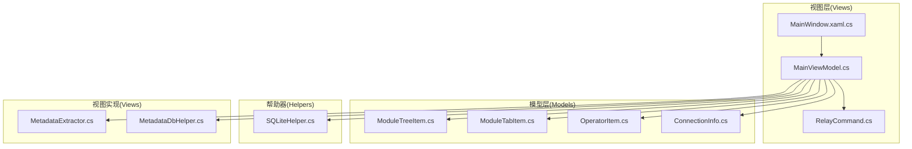
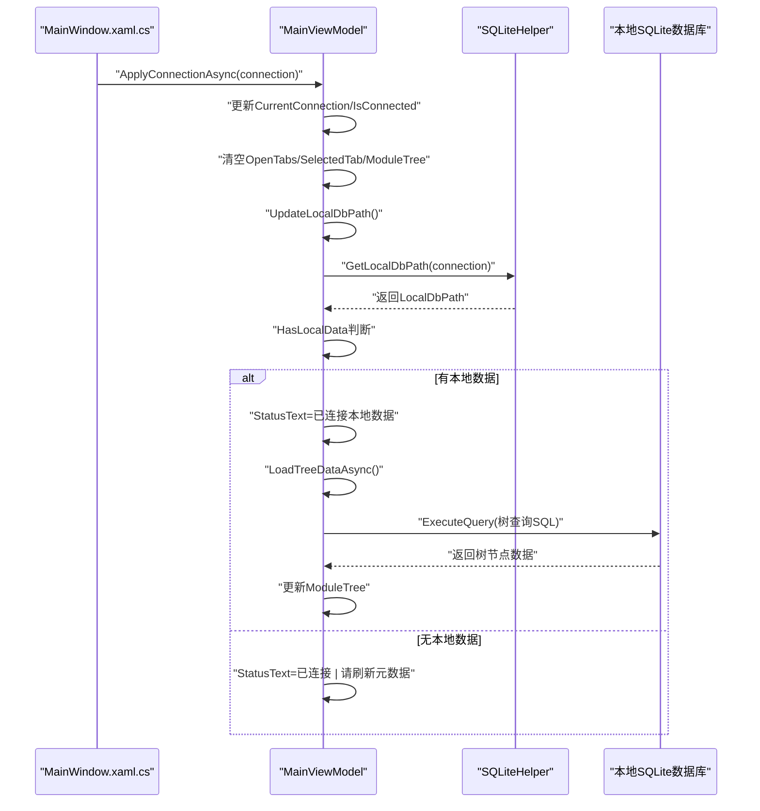
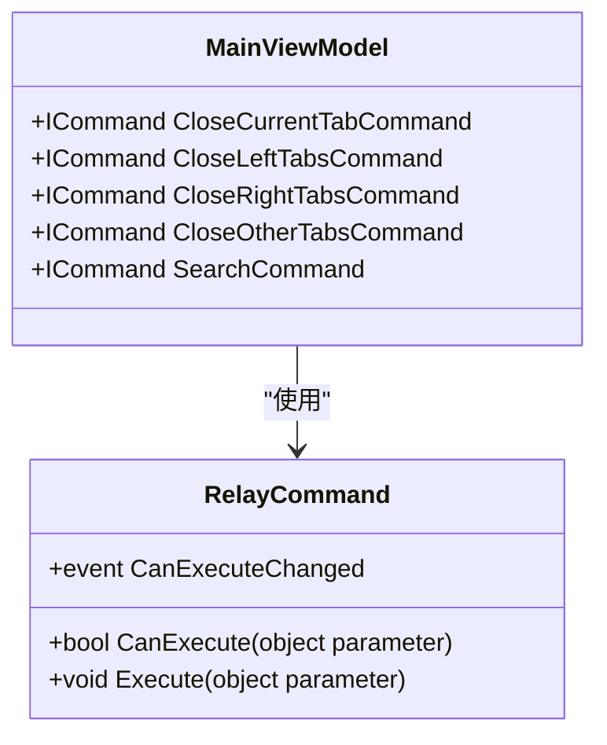
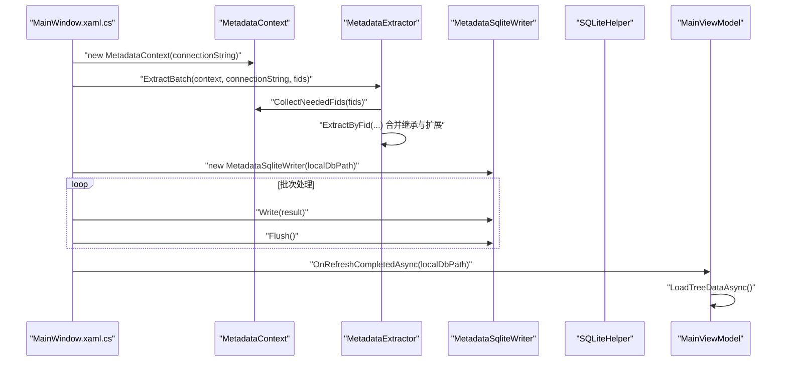
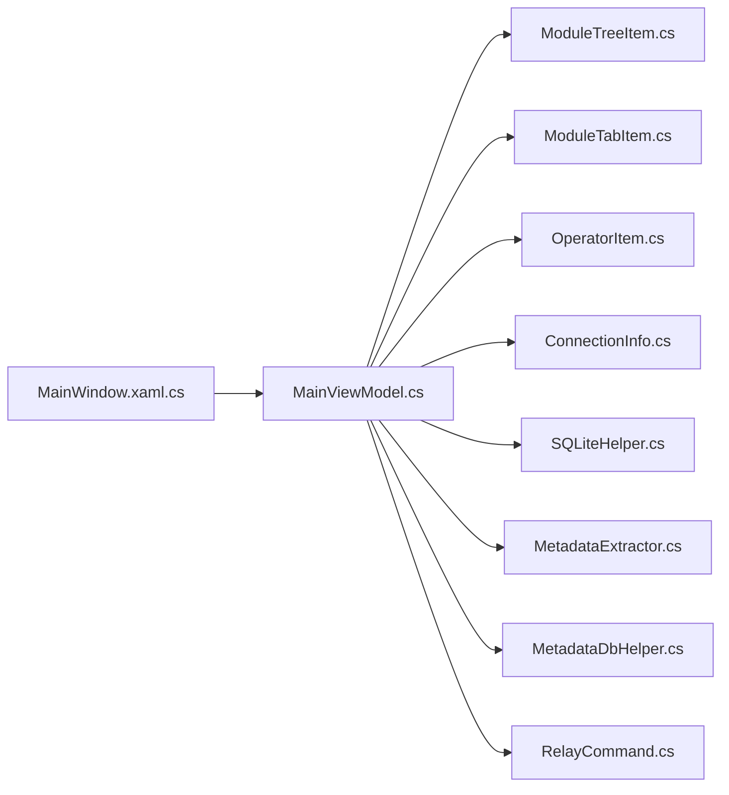

# 主控制器 - MainViewModel

<cite>
**本文档引用的文件**
- [MainViewModel.cs](file://ViewModels/MainViewModel.cs)
- [RelayCommand.cs](file://ViewModels/RelayCommand.cs)
- [SQLiteHelper.cs](file://Helpers/SQLiteHelper.cs)
- [MetadataExtractor.cs](file://Views/MetadataExtractor.cs)
- [MetadataDbHelper.cs](file://Views/MetadataDbHelper.cs)
- [ModuleTreeItem.cs](file://Models/ModuleTreeItem.cs)
- [ModuleTabItem.cs](file://Models/ModuleTabItem.cs)
- [OperatorItem.cs](file://Models/OperatorItem.cs)
- [ConnectionInfo.cs](file://Models/ConnectionInfo.cs)
- [MainWindow.xaml.cs](file://MainWindow.xaml.cs)
</cite>

## 目录
1. [简介](#简介)
2. [项目结构](#项目结构)
3. [核心组件](#核心组件)
4. [架构总览](#架构总览)
5. [详细组件分析](#详细组件分析)
6. [依赖关系分析](#依赖关系分析)
7. [性能考虑](#性能考虑)
8. [故障排查指南](#故障排查指南)
9. [结论](#结论)

## 简介
本文件为金蝶K3 Cloud数据字典系统的主控制器MainViewModel的详细技术文档。作为MVVM架构中的核心控制器，MainViewModel负责：
- 应用程序状态管理（连接状态、搜索状态、标签页状态）
- 数据绑定与UI交互（树形模块、表格数据、搜索过滤）
- 命令实现与事件处理（ICommand接口、Tab切换事件）
- 核心业务方法（ApplyConnectionAsync、OpenTabForModuleAsync、OpenEntityTabAsync等）
- 与SQLiteHelper、MetadataExtractor等组件的协作

文档将深入解释属性体系、命令实现、事件处理机制，并给出使用示例、最佳实践与性能优化建议。

## 项目结构
该项目采用MVVM分层架构，主要目录与职责如下：
- ViewModels：存放视图模型（MainViewModel、RelayCommand）
- Models：存放数据模型（ModuleTreeItem、ModuleTabItem、OperatorItem、ConnectionInfo等）
- Helpers：存放工具类（SQLiteHelper）
- Views：存放视图与元数据处理（MetadataExtractor、MetadataDbHelper等）
- 根目录：WPF应用入口（MainWindow.xaml.cs、App.xaml.cs等）

图表来源
- [MainViewModel.cs:18-215](file://ViewModels/MainViewModel.cs#L18-L215)
- [MainWindow.xaml.cs:30-86](file://MainWindow.xaml.cs#L30-L86)
- [SQLiteHelper.cs:10-53](file://Helpers/SQLiteHelper.cs#L10-L53)
- [MetadataExtractor.cs:289-360](file://Views/MetadataExtractor.cs#L289-L360)
- [MetadataDbHelper.cs:36-79](file://Views/MetadataDbHelper.cs#L36-L79)

章节来源
- [MainViewModel.cs:1-215](file://ViewModels/MainViewModel.cs#L1-L215)
- [MainWindow.xaml.cs:30-86](file://MainWindow.xaml.cs#L30-L86)

## 核心组件
本节概述MainViewModel的核心职责与关键成员。

- 状态属性
  - ModuleTree：模块树集合，支持INotifyPropertyChanged
  - SelectedModule：当前选中的模块项
  - Operators/SelectedOperator：搜索运算符集合与当前运算符
  - SearchText/IsSearchFocused/SearchPlaceholderVisible：搜索输入与占位符可见性
  - CurrentConnection/IsConnected/StatusText：连接状态与状态文本
  - OpenTabs/SelectedTab/SelectedTabChanged：打开的标签页与当前选中标签页
  - LocalDbPath/HasLocalData：本地数据库路径与是否存在本地数据
- 命令
  - CloseCurrentTabCommand/CloseLeftTabsCommand/CloseRightTabsCommand/CloseOtherTabsCommand：标签页关闭命令
  - SearchCommand：搜索命令（基于RelayCommand）
- 关键方法
  - ApplyConnectionAsync：应用连接并初始化本地数据
  - OnRefreshCompletedAsync：刷新完成后回调
  - UpdateLocalDbPath：根据当前连接更新本地数据库路径
  - OpenTabForModuleAsync/OpenEntityTabAsync/OpenFieldDetailTabAsync等：打开不同类型的标签页
  - LoadTreeDataAsync/LoadFormDataAsync/LoadEntityDataAsync/LoadFieldDataAsync等：加载树与数据
  - ExecuteQuery：通用SQLite查询执行
  - CloseCurrentTab/CloseLeftTabs/CloseRightTabs/CloseOtherTabs：标签页关闭逻辑

章节来源
- [MainViewModel.cs:38-127](file://ViewModels/MainViewModel.cs#L38-L127)
- [MainViewModel.cs:176-194](file://ViewModels/MainViewModel.cs#L176-L194)
- [MainViewModel.cs:246-290](file://ViewModels/MainViewModel.cs#L246-L290)
- [MainViewModel.cs:337-518](file://ViewModels/MainViewModel.cs#L337-L518)
- [MainViewModel.cs:1421-1530](file://ViewModels/MainViewModel.cs#L1421-L1530)
- [RelayCommand.cs:6-26](file://ViewModels/RelayCommand.cs#L6-L26)

## 架构总览
MainViewModel在MVVM架构中承担“控制器”角色，协调视图与数据源之间的交互。其核心流程包括：
- 连接管理：通过ApplyConnectionAsync设置CurrentConnection，更新LocalDbPath，必要时触发树与数据加载
- 模块导航：SelectedModule变化触发OnModuleSelected，进而打开对应表单标签页
- 标签页管理：OpenTabs集合管理打开的标签页，SelectedTabChanged事件驱动状态更新
- 数据查询：ExecuteQuery统一执行SQLite查询，各标签页方法负责具体SQL与映射
- 元数据刷新：MainWindow触发刷新流程，MainViewModel接收刷新完成回调并重建树

图表来源
- [MainViewModel.cs:246-275](file://ViewModels/MainViewModel.cs#L246-L275)
- [MainViewModel.cs:280-290](file://ViewModels/MainViewModel.cs#L280-L290)
- [MainViewModel.cs:1421-1456](file://ViewModels/MainViewModel.cs#L1421-L1456)
- [SQLiteHelper.cs:209-213](file://Helpers/SQLiteHelper.cs#L209-L213)

## 详细组件分析

### 属性体系与状态管理
- ModuleTree/SelectedModule
  - ModuleTree为ObservableCollection<ModuleTreeItem>，用于树形展示模块层级
  - SelectedModule变更时触发OnModuleSelected，展开模块并打开对应表单标签页
- Operators/SelectedOperator
  - 提供等于、包含、左包含、右包含四种运算符，用于搜索过滤
- SearchText/IsSearchFocused/SearchPlaceholderVisible
  - SearchText支持双向绑定，结合IsSearchFocused决定占位符显示
- CurrentConnection/IsConnected/StatusText
  - CurrentConnection存储当前连接信息；IsConnected反映连接状态；StatusText用于显示状态消息
- OpenTabs/SelectedTab/SelectedTabChanged
  - OpenTabs维护打开的标签页集合；SelectedTabChanged事件在标签页切换时触发
- LocalDbPath/HasLocalData
  - LocalDbPath为本地SQLite数据库文件路径；HasLocalData用于判断是否存在本地数据

章节来源
- [MainViewModel.cs:38-127](file://ViewModels/MainViewModel.cs#L38-L127)
- [ModuleTreeItem.cs:7-58](file://Models/ModuleTreeItem.cs#L7-L58)
- [ModuleTabItem.cs:9-196](file://Models/ModuleTabItem.cs#L9-L196)
- [OperatorItem.cs:3-7](file://Models/OperatorItem.cs#L3-L7)
- [ConnectionInfo.cs:6-144](file://Models/ConnectionInfo.cs#L6-L144)

### 命令实现（ICommand）
- CloseCurrentTabCommand/CloseLeftTabsCommand/CloseRightTabsCommand/CloseOtherTabsCommand
  - 基于RelayCommand实现，支持标签页批量关闭
- SearchCommand
  - 基于RelayCommand实现，绑定到搜索输入框回车事件

图表来源
- [RelayCommand.cs:6-26](file://ViewModels/RelayCommand.cs#L6-L26)
- [MainViewModel.cs:176-194](file://ViewModels/MainViewModel.cs#L176-L194)

章节来源
- [RelayCommand.cs:6-26](file://ViewModels/RelayCommand.cs#L6-L26)
- [MainViewModel.cs:176-194](file://ViewModels/MainViewModel.cs#L176-L194)

### 事件处理机制
- SelectedTabChanged事件
  - 在SelectedTab属性变更时触发，用于更新状态栏与UI状态
- OpenTabs集合变更事件
  - 监听集合增删，自动调整SelectedTab并保持一致性
- MainWindow.xaml.cs中的事件桥接
  - MainWindow订阅VM事件并同步UI状态（标签卡选择、滚动定位等）

章节来源
- [MainViewModel.cs:174-175](file://ViewModels/MainViewModel.cs#L174-L175)
- [MainViewModel.cs:217-233](file://ViewModels/MainViewModel.cs#L217-L233)
- [MainWindow.xaml.cs:36-48](file://MainWindow.xaml.cs#L36-L48)
- [MainWindow.xaml.cs:88-106](file://MainWindow.xaml.cs#L88-L106)

### 核心方法实现与调用关系

#### ApplyConnectionAsync：应用连接
- 设置CurrentConnection与IsConnected
- 清空OpenTabs、SelectedTab、ModuleTree
- 更新LocalDbPath并判断HasLocalData
- 若存在本地数据：更新状态文本并加载树数据；否则提示刷新元数据

章节来源
- [MainViewModel.cs:246-267](file://ViewModels/MainViewModel.cs#L246-L267)

#### OnRefreshCompletedAsync：刷新完成回调
- 接收本地数据库路径，设置LocalDbPath
- 清空OpenTabs并更新状态文本
- 加载树数据

章节来源
- [MainViewModel.cs:269-275](file://ViewModels/MainViewModel.cs#L269-L275)

#### UpdateLocalDbPath：更新本地数据库路径
- 基于CurrentConnection计算本地数据库文件路径
- 若CurrentConnection为空则置空LocalDbPath

章节来源
- [MainViewModel.cs:280-290](file://ViewModels/MainViewModel.cs#L280-L290)

#### ExecuteQuery：通用SQLite查询
- 使用SQLiteConnection连接LocalDbPath
- 支持参数化查询，返回字典列表
- 用于所有数据加载方法的底层查询

章节来源
- [MainViewModel.cs:292-321](file://ViewModels/MainViewModel.cs#L292-L321)

#### OnModuleSelected/OpenTabForModuleAsync：模块选择与表单标签页
- SelectedModule变更触发OnModuleSelected
- 若模块存在且HasLocalData为true，则打开对应表单标签页
- 标签页去重：若已存在相同模块ID的表单标签则直接选中

章节来源
- [MainViewModel.cs:323-357](file://ViewModels/MainViewModel.cs#L323-L357)

#### OpenEntityTabAsync/OpenFieldDetailTabAsync/OpenLookupEntityTabAsync/OpenEnumDetailTabAsync/OpenBillTypeTabAsync/OpenAssistantDataTabAsync/OpenEntityServiceRuleTabAsync/OpenEntityServiceRuleDetailAsync/OpenPluginTabAsync/OpenFieldUpdateActionTabAsync/OpenFormUpdateActionTabAsync/OpenFormOperationTabAsync/OpenValidationTabAsync/OpenFormOperationPluginTabAsync/OpenFormOperationAppServiceTabAsync/OpenEntityUpdateActionTabAsync：各类标签页打开
- 各方法均遵循统一模式：
  - 参数校验与HasLocalData检查
  - 生成唯一tabKey并去重
  - 构造ModuleTabItem并填充数据
  - 添加到OpenTabs并设置SelectedTab
- 特殊逻辑：
  - Lookup/Enum/BillType/AssistantData等通过ExecuteQuery查询并映射到相应模型
  - 服务规则与实体服务规则详情通过复杂SQL联查并聚合显示

章节来源
- [MainViewModel.cs:359-518](file://ViewModels/MainViewModel.cs#L359-L518)
- [MainViewModel.cs:519-851](file://ViewModels/MainViewModel.cs#L519-L851)
- [MainViewModel.cs:852-1286](file://ViewModels/MainViewModel.cs#L852-L1286)

#### LoadTreeDataAsync/LoadFormDataAsync/LoadEntityDataAsync/LoadFieldDataAsync：树与数据加载
- LoadTreeDataAsync：分三级加载模块树（顶级分类、子系统、表单），组装父子关系
- LoadFormDataAsync/LoadEntityDataAsync/LoadFieldDataAsync：分别加载表单、实体、字段数据，映射到对应模型集合

章节来源
- [MainViewModel.cs:1421-1530](file://ViewModels/MainViewModel.cs#L1421-L1530)
- [MainViewModel.cs:1532-1595](file://ViewModels/MainViewModel.cs#L1532-L1595)

#### BuildAllFieldsQuery/BuildFormQuery/BuildEntityQuery/BuildFieldQuery：SQL构建
- 通过BuildAllFieldsQuery等方法构建复杂SQL，支持联查与聚合统计
- 参数化查询，避免SQL注入

章节来源
- [MainViewModel.cs:1327-1359](file://ViewModels/MainViewModel.cs#L1327-L1359)
- [MainViewModel.cs:1532-1595](file://ViewModels/MainViewModel.cs#L1532-L1595)

#### 标签页关闭命令：CloseCurrentTab/CloseLeftTabs/CloseRightTabs/CloseOtherTabs
- CloseCurrentTab：防止并发关闭导致异常，确保SelectedTab正确恢复
- CloseLeftTabs/CloseRightTabs/CloseOtherTabs：按位置范围批量关闭

章节来源
- [MainViewModel.cs:1361-1419](file://ViewModels/MainViewModel.cs#L1361-L1419)

### 与SQLiteHelper、MetadataExtractor的协作

#### 与SQLiteHelper的协作
- EnsureDatabase：确保连接配置数据库存在
- LoadDefault/LoadAll：加载默认连接与所有连接
- GetLocalDbPath：根据连接计算本地数据库文件路径
- ScanLocalDataFiles/ImportLocalData/DeleteLocalData/RenameLocalData：本地数据文件管理
- MigrateOldMetadataDb：旧版升级迁移

章节来源
- [SQLiteHelper.cs:17-53](file://Helpers/SQLiteHelper.cs#L17-L53)
- [SQLiteHelper.cs:85-112](file://Helpers/SQLiteHelper.cs#L85-L112)
- [SQLiteHelper.cs:209-213](file://Helpers/SQLiteHelper.cs#L209-L213)
- [SQLiteHelper.cs:218-254](file://Helpers/SQLiteHelper.cs#L218-L254)
- [SQLiteHelper.cs:260-338](file://Helpers/SQLiteHelper.cs#L260-L338)
- [SQLiteHelper.cs:345-367](file://Helpers/SQLiteHelper.cs#L345-L367)

#### 与MetadataExtractor的协作
- MainWindow触发刷新流程，构造MetadataContext并分批提取元数据
- MetadataExtractor.ExtractBatch：批量提取FID对应的元数据，内部按继承链与扩展链合并
- MetadataSqliteWriter：将提取结果写入本地SQLite数据库

图表来源
- [MainWindow.xaml.cs:480-538](file://MainWindow.xaml.cs#L480-L538)
- [MainWindow.xaml.cs:582-647](file://MainWindow.xaml.cs#L582-L647)
- [MetadataExtractor.cs:299-311](file://Views/MetadataExtractor.cs#L299-L311)
- [MetadataExtractor.cs:322-360](file://Views/MetadataExtractor.cs#L322-L360)
- [MetadataDbHelper.cs:44-79](file://Views/MetadataDbHelper.cs#L44-L79)

章节来源
- [MainWindow.xaml.cs:480-538](file://MainWindow.xaml.cs#L480-L538)
- [MainWindow.xaml.cs:582-647](file://MainWindow.xaml.cs#L582-L647)
- [MetadataExtractor.cs:299-360](file://Views/MetadataExtractor.cs#L299-L360)
- [MetadataDbHelper.cs:44-127](file://Views/MetadataDbHelper.cs#L44-L127)

## 依赖关系分析

图表来源
- [MainViewModel.cs:18-15](file://ViewModels/MainViewModel.cs#L18-L15)
- [MainWindow.xaml.cs:30-33](file://MainWindow.xaml.cs#L30-L33)

章节来源
- [MainViewModel.cs:18-15](file://ViewModels/MainViewModel.cs#L18-L15)
- [MainWindow.xaml.cs:30-33](file://MainWindow.xaml.cs#L30-L33)

## 性能考虑
- 异步加载：所有数据加载方法均使用异步Task.Run执行数据库查询，避免阻塞UI线程
- 批量处理：树加载与数据加载采用分层策略，减少一次性加载压力
- 参数化查询：ExecuteQuery统一使用SQLiteParameter，提升安全性与性能
- 标签页去重：打开标签页前检查是否已存在，避免重复加载
- 本地数据优先：HasLocalData判断优先使用本地SQLite，减少远程查询
- 刷新流程优化：MainWindow中分两阶段处理（无扩展/有扩展），并使用进度条反馈

章节来源
- [MainViewModel.cs:1421-1530](file://ViewModels/MainViewModel.cs#L1421-L1530)
- [MainViewModel.cs:292-321](file://ViewModels/MainViewModel.cs#L292-L321)
- [MainWindow.xaml.cs:480-538](file://MainWindow.xaml.cs#L480-L538)
- [MainWindow.xaml.cs:582-647](file://MainWindow.xaml.cs#L582-L647)

## 故障排查指南
- 连接失败
  - 检查CurrentConnection是否为空，确认ServerIp/Port/Database/UserName/Password是否有效
  - 使用DbHelper.TestConnection验证连接字符串
- 本地数据缺失
  - 检查LocalDbPath是否存在，若不存在需先刷新元数据或导入本地数据
  - 使用SQLiteHelper.ScanLocalDataFiles确认文件扫描结果
- 树加载失败
  - 检查HasLocalData与ExecuteQuery返回结果
  - 确认SQLite数据库中存在T_META_*相关表
- 标签页无法打开
  - 检查SelectedModule/SelectedTab状态
  - 确认OpenTabs集合中无重复tabKey
- 刷新失败
  - 检查MainWindow中刷新按钮的启用状态与用户确认
  - 查看StatusText与异常堆栈信息

章节来源
- [MainWindow.xaml.cs:444-472](file://MainWindow.xaml.cs#L444-L472)
- [MainWindow.xaml.cs:540-568](file://MainWindow.xaml.cs#L540-L568)
- [SQLiteHelper.cs:218-254](file://Helpers/SQLiteHelper.cs#L218-L254)
- [MainViewModel.cs:1421-1456](file://ViewModels/MainViewModel.cs#L1421-L1456)

## 结论
MainViewModel作为MVVM架构中的核心控制器，通过完善的属性体系、命令实现与事件处理机制，实现了对模块树、标签页、搜索与连接状态的统一管理。其与SQLiteHelper、MetadataExtractor等组件的协作，使得系统既能高效加载本地数据，又能灵活刷新远程元数据。遵循本文档的最佳实践与性能建议，可进一步提升用户体验与系统稳定性。