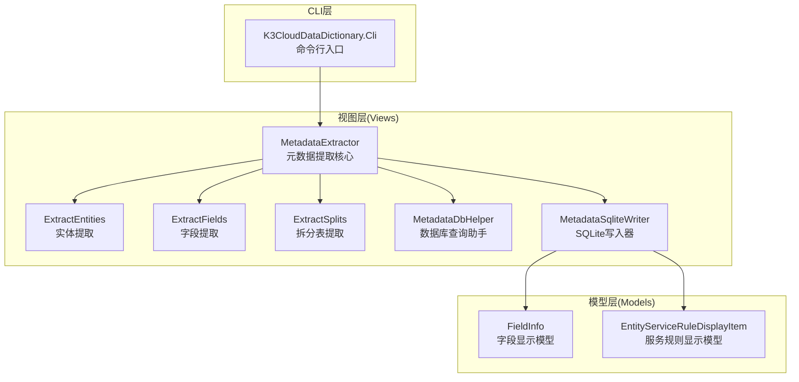
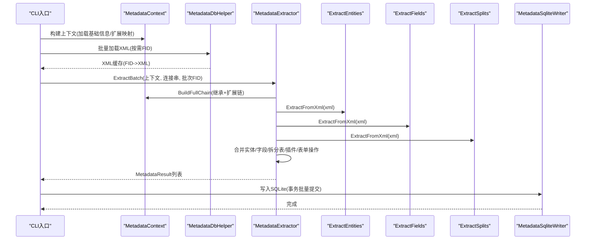
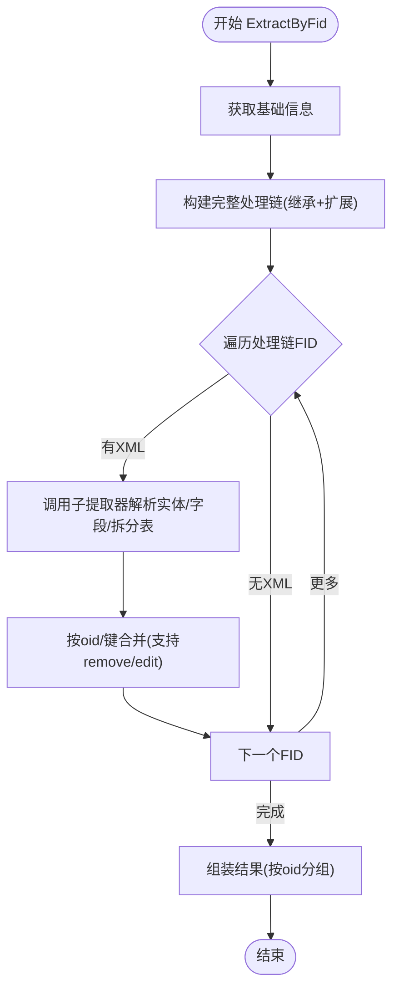
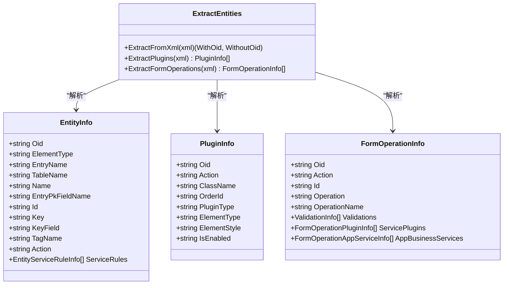
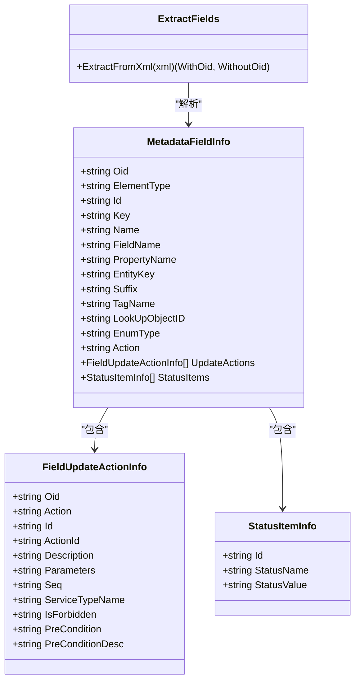
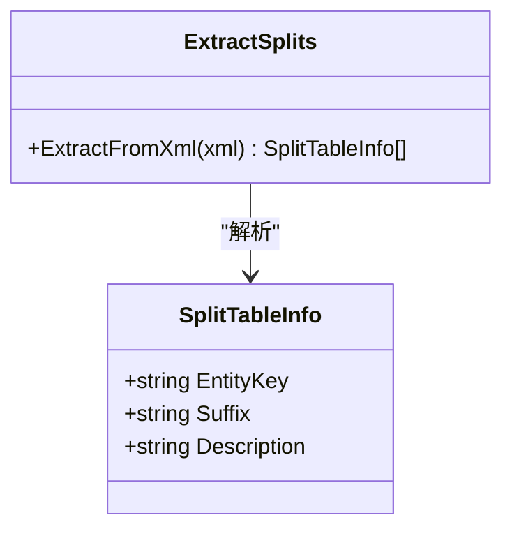
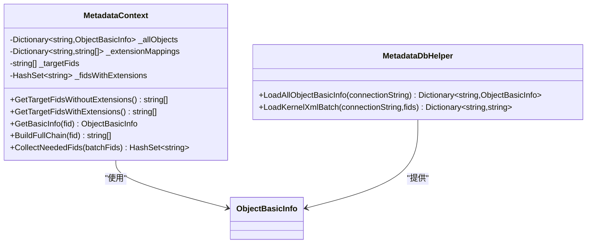
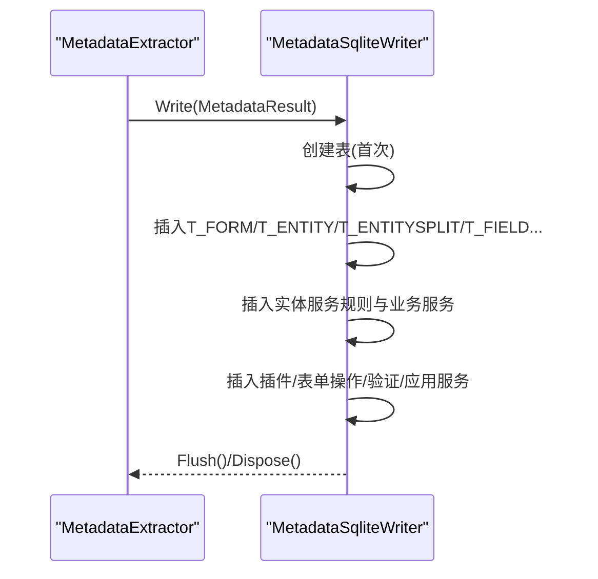
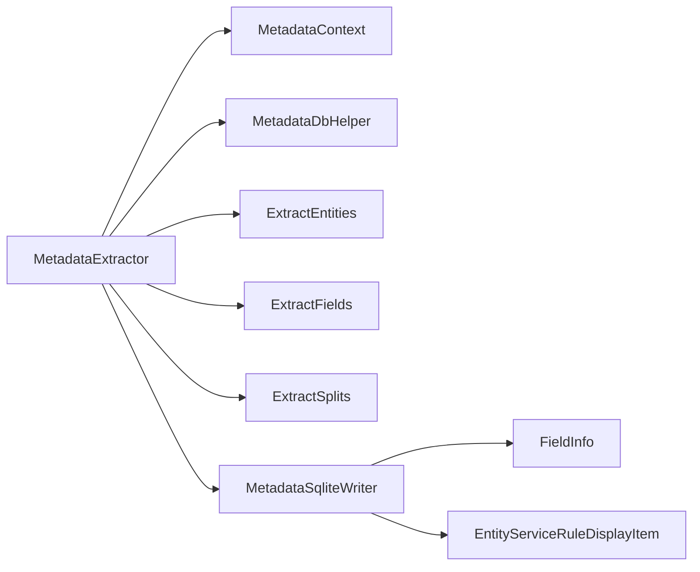

# 元数据提取器 - MetadataExtractor

<cite>
**本文档引用的文件**
- [MetadataExtractor.cs](file://Views/MetadataExtractor.cs)
- [ExtractEntities.cs](file://Views/ExtractEntities.cs)
- [ExtractFields.cs](file://Views/ExtractFields.cs)
- [ExtractSplits.cs](file://Views/ExtractSplits.cs)
- [MetadataSqliteWriter.cs](file://Views/MetadataSqliteWriter.cs)
- [MetadataDbHelper.cs](file://Views/MetadataDbHelper.cs)
- [EntityServiceRuleInfo.cs](file://Views/EntityServiceRuleInfo.cs)
- [FieldUpdateActionInfo.cs](file://Views/FieldUpdateActionInfo.cs)
- [FormOperationInfo.cs](file://Views/FormOperationInfo.cs)
- [PluginInfo.cs](file://Views/PluginInfo.cs)
- [FieldInfo.cs](file://Models/FieldInfo.cs)
- [EntityServiceRuleDisplayItem.cs](file://Models/EntityServiceRuleDisplayItem.cs)
</cite>

## 目录
1. [简介](#简介)
2. [项目结构](#项目结构)
3. [核心组件](#核心组件)
4. [架构总览](#架构总览)
5. [详细组件分析](#详细组件分析)
6. [依赖关系分析](#依赖关系分析)
7. [性能考虑](#性能考虑)
8. [故障排除指南](#故障排除指南)
9. [结论](#结论)
10. [附录](#附录)

## 简介
本文件面向金蝶K3 Cloud数据字典系统的元数据提取器MetadataExtractor，提供全面的技术文档。重点涵盖XML元数据解析、继承链处理、扩展数据合并等机制，详解ExtractEntities、ExtractFields、ExtractSplits等子提取器的职责与实现原理，描述从K3 Cloud数据库读取XML到本地SQLite存储的完整流程，并给出错误处理机制与性能优化策略。

## 项目结构
本项目围绕“元数据提取”与“本地化存储”两条主线组织：
- 视图层(Views)：负责XML解析、继承/扩展链构建、合并策略、SQLite写入
- 模型层(Models)：提供UI展示所需的显示模型
- CLI层(K3CloudDataDictionary.Cli)：命令行入口与服务封装（与提取流程关联）

图表来源
- [MetadataExtractor.cs:289-360](file://Views/MetadataExtractor.cs#L289-L360)
- [ExtractEntities.cs:47-139](file://Views/ExtractEntities.cs#L47-L139)
- [ExtractFields.cs:70-164](file://Views/ExtractFields.cs#L70-L164)
- [ExtractSplits.cs:28-56](file://Views/ExtractSplits.cs#L28-L56)
- [MetadataSqliteWriter.cs:9-846](file://Views/MetadataSqliteWriter.cs#L9-L846)
- [MetadataDbHelper.cs:36-127](file://Views/MetadataDbHelper.cs#L36-L127)
- [FieldInfo.cs:6-110](file://Models/FieldInfo.cs#L6-L110)
- [EntityServiceRuleDisplayItem.cs:6-72](file://Models/EntityServiceRuleDisplayItem.cs#L6-L72)

章节来源
- [MetadataExtractor.cs:289-360](file://Views/MetadataExtractor.cs#L289-L360)
- [MetadataDbHelper.cs:44-127](file://Views/MetadataDbHelper.cs#L44-L127)
- [MetadataSqliteWriter.cs:560-809](file://Views/MetadataSqliteWriter.cs#L560-L809)

## 核心组件
- 元数据提取核心(MetadataExtractor)：负责批处理提取、继承链构建、XML缓存复用、合并策略执行与结果组装
- 子提取器：
  - ExtractEntities：解析实体、实体服务规则、插件、表单操作
  - ExtractFields：解析字段、字段更新动作、状态项
  - ExtractSplits：解析拆分表信息
- 上下文(MetadataContext)：一次性加载基础信息，构建扩展映射与目标FID集合，生成完整处理链
- 数据库助手(MetadataDbHelper)：加载基础信息与批量XML
- SQLite写入器(MetadataSqliteWriter)：将提取结果持久化至本地SQLite
- 模型(Models)：用于UI展示的数据模型

章节来源
- [MetadataExtractor.cs:289-360](file://Views/MetadataExtractor.cs#L289-L360)
- [ExtractEntities.cs:47-139](file://Views/ExtractEntities.cs#L47-L139)
- [ExtractFields.cs:70-164](file://Views/ExtractFields.cs#L70-L164)
- [ExtractSplits.cs:28-56](file://Views/ExtractSplits.cs#L28-L56)
- [MetadataDbHelper.cs:36-127](file://Views/MetadataDbHelper.cs#L36-L127)
- [MetadataSqliteWriter.cs:9-846](file://Views/MetadataSqliteWriter.cs#L9-L846)

## 架构总览
元数据提取流程分为“准备阶段”和“执行阶段”：
- 准备阶段：构建MetadataContext，加载基础信息与扩展映射，计算目标FID集合
- 执行阶段：批量加载XML，按继承链逐层合并实体、字段、拆分表、插件、表单操作，最终写入SQLite

图表来源
- [MetadataExtractor.cs:299-311](file://Views/MetadataExtractor.cs#L299-L311)
- [MetadataExtractor.cs:322-360](file://Views/MetadataExtractor.cs#L322-L360)
- [MetadataDbHelper.cs:87-127](file://Views/MetadataDbHelper.cs#L87-L127)
- [MetadataSqliteWriter.cs:560-809](file://Views/MetadataSqliteWriter.cs#L560-L809)

## 详细组件分析

### 元数据提取核心(MetadataExtractor)
- 批处理提取：CollectNeededFids收集完整处理链所需FID，LoadKernelXmlBatch一次性批量加载XML，避免重复连接
- 继承链与扩展链：BuildFullChain解析继承路径，AppendExtensions递归追加扩展FID，确保合并顺序正确
- 合并策略：
  - 实体/字段：按oid匹配父级，action=remove删除，action=edit覆盖属性；无oid实体/字段按Id/Key新增
  - 拆分表：按EntityKey+Suffix匹配，存在则覆盖描述，不存在则新增
  - 插件/表单操作/验证/业务服务：优先oid匹配，否则回退到ClassName/Id；支持remove删除
- 结果组装：BuildResult按oid有无分组，填充实体、字段、拆分表、插件、表单操作列表

图表来源
- [MetadataExtractor.cs:322-360](file://Views/MetadataExtractor.cs#L322-L360)
- [MetadataExtractor.cs:616-690](file://Views/MetadataExtractor.cs#L616-L690)
- [MetadataExtractor.cs:404-451](file://Views/MetadataExtractor.cs#L404-L451)

章节来源
- [MetadataExtractor.cs:299-360](file://Views/MetadataExtractor.cs#L299-L360)
- [MetadataExtractor.cs:404-690](file://Views/MetadataExtractor.cs#L404-L690)

### 子提取器：ExtractEntities
- 职责：解析实体、实体服务规则、插件、表单操作
- 实体解析：提取Tag、oid、ElementType、EntryName、TableName、Name、EntryPkFieldName、Id、Key、KeyField等
- 服务规则：解析WhenTrueBusinessServices与WhenFalseBusinessServices，形成FormBusinessServiceInfo列表
- 插件提取：FormPlugins、ListPlugins、WebFormBuilderPlugins容器下的PlugIn元素
- 表单操作：FormOperations容器下的FormOperation及其Validations、ServicePlugins、AppBusinessService

图表来源
- [ExtractEntities.cs:47-139](file://Views/ExtractEntities.cs#L47-L139)
- [ExtractEntities.cs:144-177](file://Views/ExtractEntities.cs#L144-L177)
- [ExtractEntities.cs:182-274](file://Views/ExtractEntities.cs#L182-L274)

章节来源
- [ExtractEntities.cs:47-139](file://Views/ExtractEntities.cs#L47-L139)
- [ExtractEntities.cs:144-177](file://Views/ExtractEntities.cs#L144-L177)
- [ExtractEntities.cs:182-274](file://Views/ExtractEntities.cs#L182-L274)

### 子提取器：ExtractFields
- 职责：解析字段、字段更新动作、状态项
- 字段解析：提取Tag、oid、ElementType、Id、Key、Name、FieldName、PropertyName、EntityKey、Suffix、LookUpObjectID、EnumType
- 更新动作：解析UpdateActions下的各类业务服务，形成FieldUpdateActionInfo列表
- 状态项：ElementType=40时解析StatusItems

图表来源
- [ExtractFields.cs:70-164](file://Views/ExtractFields.cs#L70-L164)
- [FieldUpdateActionInfo.cs:3-36](file://Views/FieldUpdateActionInfo.cs#L3-L36)
- [FieldInfo.cs:6-110](file://Models/FieldInfo.cs#L6-L110)

章节来源
- [ExtractFields.cs:70-164](file://Views/ExtractFields.cs#L70-L164)
- [FieldUpdateActionInfo.cs:3-36](file://Views/FieldUpdateActionInfo.cs#L3-L36)
- [FieldInfo.cs:6-110](file://Models/FieldInfo.cs#L6-L110)

### 子提取器：ExtractSplits
- 职责：解析拆分表信息
- 依据：遍历SplitTable元素，读取父级实体Key、Suffix与Description

图表来源
- [ExtractSplits.cs:28-56](file://Views/ExtractSplits.cs#L28-L56)

章节来源
- [ExtractSplits.cs:28-56](file://Views/ExtractSplits.cs#L28-L56)

### 上下文与数据库助手
- MetadataContext：构建扩展映射(FBASEOBJECTID→扩展FID列表)、识别存在扩展的基础对象、生成完整处理链
- MetadataDbHelper：一次性加载所有基础信息(不含XML)，批量查询内核XML内容

图表来源
- [MetadataExtractor.cs:102-284](file://Views/MetadataExtractor.cs#L102-L284)
- [MetadataDbHelper.cs:44-127](file://Views/MetadataDbHelper.cs#L44-L127)

章节来源
- [MetadataExtractor.cs:102-284](file://Views/MetadataExtractor.cs#L102-L284)
- [MetadataDbHelper.cs:44-127](file://Views/MetadataDbHelper.cs#L44-L127)

### SQLite写入器
- 表结构：创建T_FORM、T_ENTITY、T_ENTITYSPLIT、T_FIELD、T_ENTITYSERVICERULE、T_FORMBUSINESSSERVICE、T_PLUGIN、T_FIELDUPDATEACTION、T_FORMOPERATION、T_VALIDATION、T_FORMOPERATION_PLUGIN、T_FORMOPERATION_APPSERVICE等
- 写入策略：按表单维度写入，维护自增ID计数器；支持删除指定表单标识的记录并级联清理
- 性能：使用事务批量提交，减少磁盘IO；按索引列建立索引提升查询效率

图表来源
- [MetadataSqliteWriter.cs:560-809](file://Views/MetadataSqliteWriter.cs#L560-L809)
- [MetadataExtractor.cs:356-397](file://Views/MetadataExtractor.cs#L356-L397)

章节来源
- [MetadataSqliteWriter.cs:560-809](file://Views/MetadataSqliteWriter.cs#L560-L809)
- [MetadataExtractor.cs:356-397](file://Views/MetadataExtractor.cs#L356-L397)

## 依赖关系分析
- MetadataExtractor依赖：
  - MetadataContext(只读上下文)：提供继承/扩展链构建
  - MetadataDbHelper：提供基础信息与XML缓存
  - 子提取器：ExtractEntities/ExtractFields/ExtractSplits
  - SQLite写入器：MetadataSqliteWriter
- 模型依赖：Models中的显示模型用于UI展示，与写入器解耦

图表来源
- [MetadataExtractor.cs:299-360](file://Views/MetadataExtractor.cs#L299-L360)
- [MetadataSqliteWriter.cs:560-809](file://Views/MetadataSqliteWriter.cs#L560-L809)
- [FieldInfo.cs:6-110](file://Models/FieldInfo.cs#L6-L110)
- [EntityServiceRuleDisplayItem.cs:6-72](file://Models/EntityServiceRuleDisplayItem.cs#L6-L72)

章节来源
- [MetadataExtractor.cs:299-360](file://Views/MetadataExtractor.cs#L299-L360)
- [MetadataSqliteWriter.cs:560-809](file://Views/MetadataSqliteWriter.cs#L560-L809)

## 性能考虑
- 批量加载XML：LoadKernelXmlBatch一次性查询多个FID的XML，减少数据库往返
- 内存构建链：MetadataContext在内存中构建扩展映射与处理链，避免重复扫描
- 合并策略优化：
  - 使用字典按oid/键快速定位父级，降低查找复杂度
  - 拆分表与插件/表单操作采用按组合键匹配，避免全量扫描
- SQLite写入优化：
  - 事务批量提交，减少磁盘写入次数
  - 预分配ID计数器，避免每次插入触发自增回读
  - 建立常用查询索引，加速后续查询与清理

## 故障排除指南
- XML为空或解析失败
  - 现象：ExtractFromXml返回空列表或异常
  - 排查：确认LoadKernelXmlBatch返回的XML内容是否为空；检查FID是否存在于数据库
  - 参考
    - [MetadataDbHelper.cs:87-127](file://Views/MetadataDbHelper.cs#L87-L127)
    - [ExtractEntities.cs:49-58](file://Views/ExtractEntities.cs#L49-L58)
- 继承链缺失或顺序错误
  - 现象：合并后实体/字段属性不完整
  - 排查：检查FInheritPath格式与ParseInheritPath解析逻辑；确认BuildFullChain是否正确反转并追加扩展
  - 参考
    - [MetadataExtractor.cs:158-181](file://Views/MetadataExtractor.cs#L158-L181)
    - [MetadataExtractor.cs:268-283](file://Views/MetadataExtractor.cs#L268-L283)
- 合并冲突或覆盖异常
  - 现象：action=remove未生效或覆盖字段未按预期
  - 排查：确认MergeEntities/MergeFields中按oid/键匹配与action判断逻辑
  - 参考
    - [MetadataExtractor.cs:616-690](file://Views/MetadataExtractor.cs#L616-L690)
    - [MetadataExtractor.cs:404-451](file://Views/MetadataExtractor.cs#L404-L451)
- SQLite写入失败或数据不一致
  - 现象：插入报错或数据缺失
  - 排查：检查事务是否正常提交；确认外键约束与级联删除逻辑；核对表结构与参数绑定
  - 参考
    - [MetadataSqliteWriter.cs:560-809](file://Views/MetadataSqliteWriter.cs#L560-L809)
    - [MetadataSqliteWriter.cs:306-353](file://Views/MetadataSqliteWriter.cs#L306-L353)

章节来源
- [MetadataDbHelper.cs:87-127](file://Views/MetadataDbHelper.cs#L87-L127)
- [ExtractEntities.cs:49-58](file://Views/ExtractEntities.cs#L49-L58)
- [MetadataExtractor.cs:158-181](file://Views/MetadataExtractor.cs#L158-L181)
- [MetadataExtractor.cs:616-690](file://Views/MetadataExtractor.cs#L616-L690)
- [MetadataExtractor.cs:404-451](file://Views/MetadataExtractor.cs#L404-L451)
- [MetadataSqliteWriter.cs:560-809](file://Views/MetadataSqliteWriter.cs#L560-L809)
- [MetadataSqliteWriter.cs:306-353](file://Views/MetadataSqliteWriter.cs#L306-L353)

## 结论
MetadataExtractor通过“上下文预构建+子提取器解析+继承/扩展链合并”的架构，实现了从K3 Cloud数据库到本地SQLite的高效元数据提取与持久化。其设计强调：
- 线程安全与可扩展性：上下文只读、XML缓存按FID隔离
- 精准合并：基于oid/键的继承合并与remove/edit语义
- 高效写入：事务批量提交与索引优化
建议在大规模提取场景中结合批处理策略与增量更新机制，进一步提升吞吐与稳定性。

## 附录
- 关键模型补充
  - 实体服务规则与业务服务
    - [EntityServiceRuleInfo.cs:5-67](file://Views/EntityServiceRuleInfo.cs#L5-L67)
  - 字段更新动作
    - [FieldUpdateActionInfo.cs:3-36](file://Views/FieldUpdateActionInfo.cs#L3-L36)
  - 表单操作与验证/插件/应用服务
    - [FormOperationInfo.cs:9-120](file://Views/FormOperationInfo.cs#L9-L120)
  - 插件信息
    - [PluginInfo.cs:3-30](file://Views/PluginInfo.cs#L3-L30)
  - 显示模型
    - [FieldInfo.cs:6-110](file://Models/FieldInfo.cs#L6-L110)
    - [EntityServiceRuleDisplayItem.cs:6-72](file://Models/EntityServiceRuleDisplayItem.cs#L6-L72)