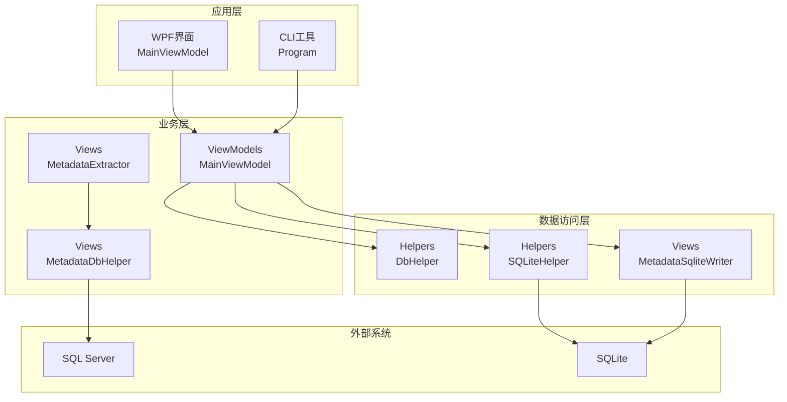
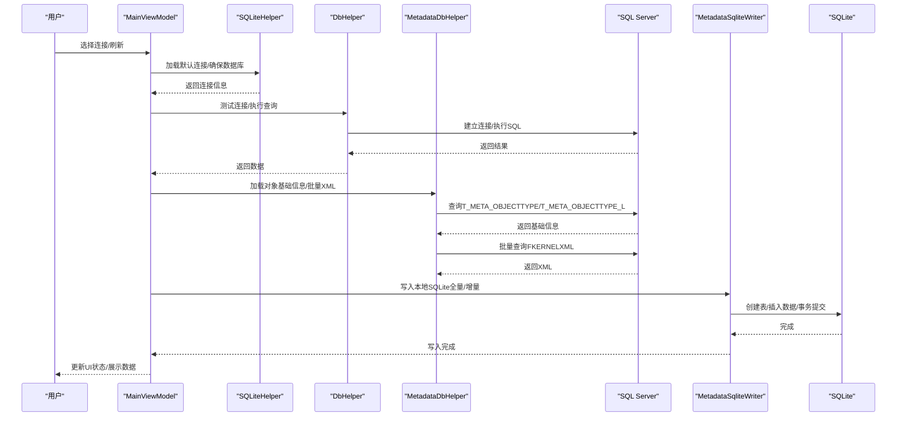
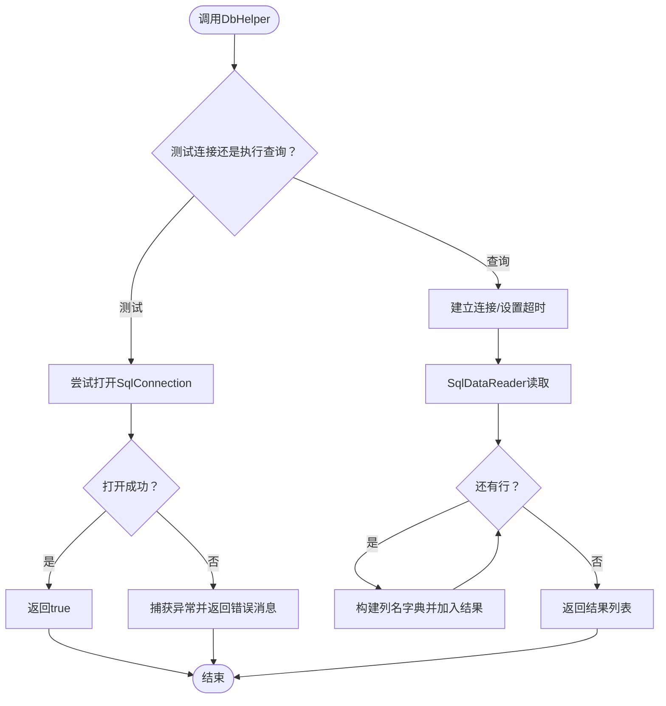
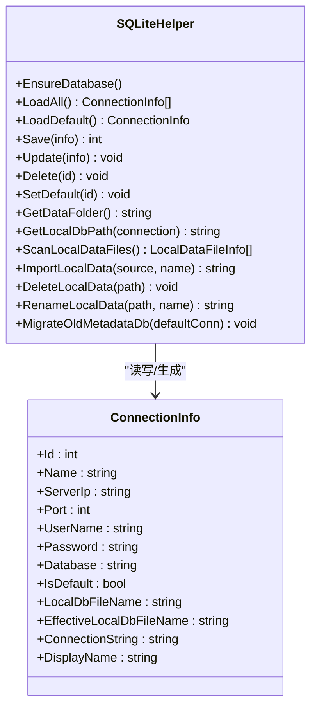
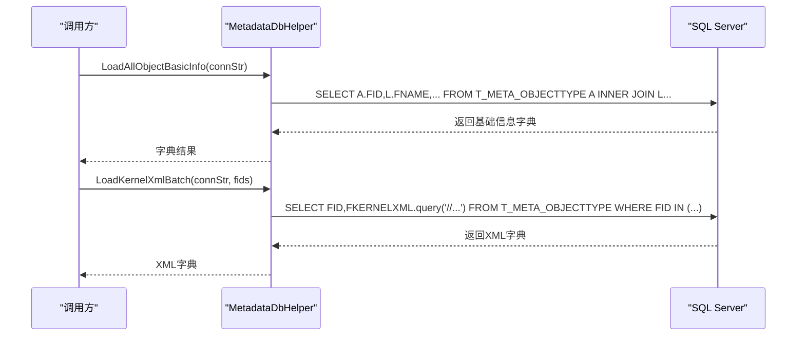
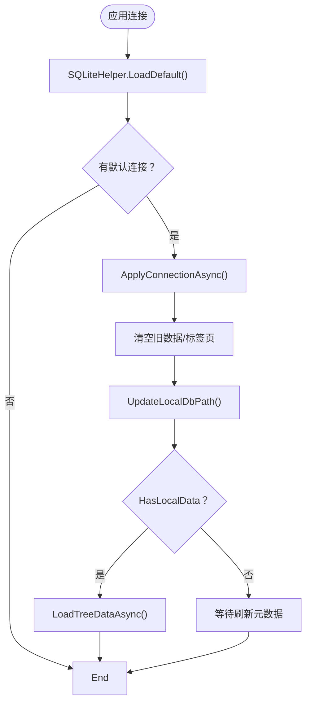
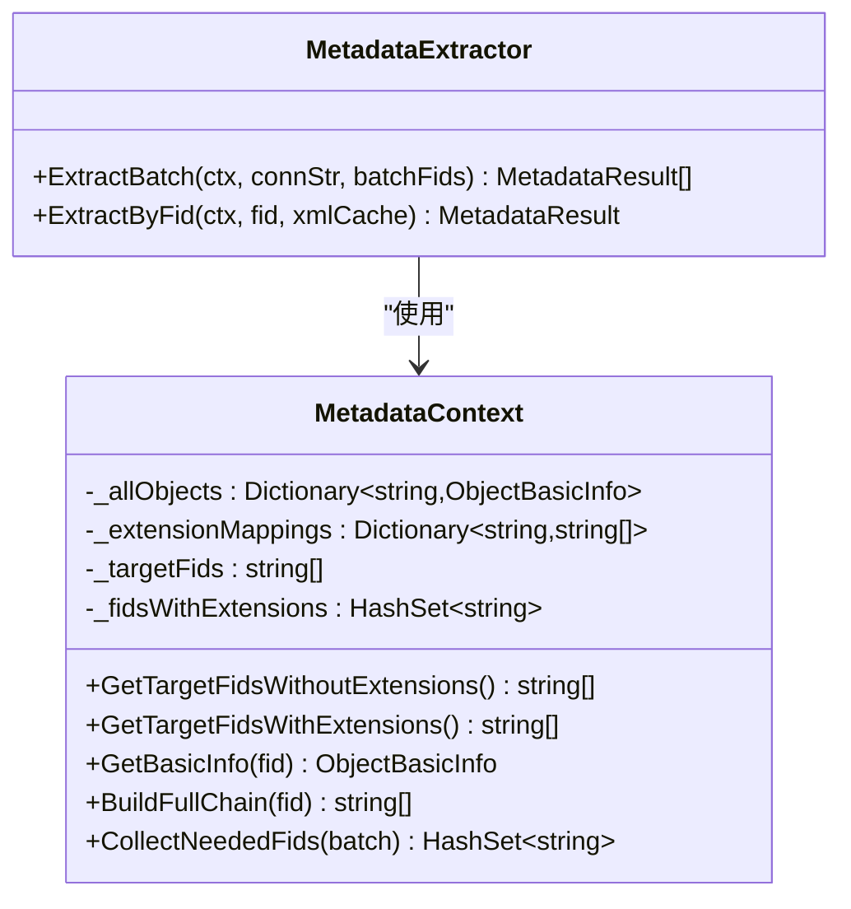
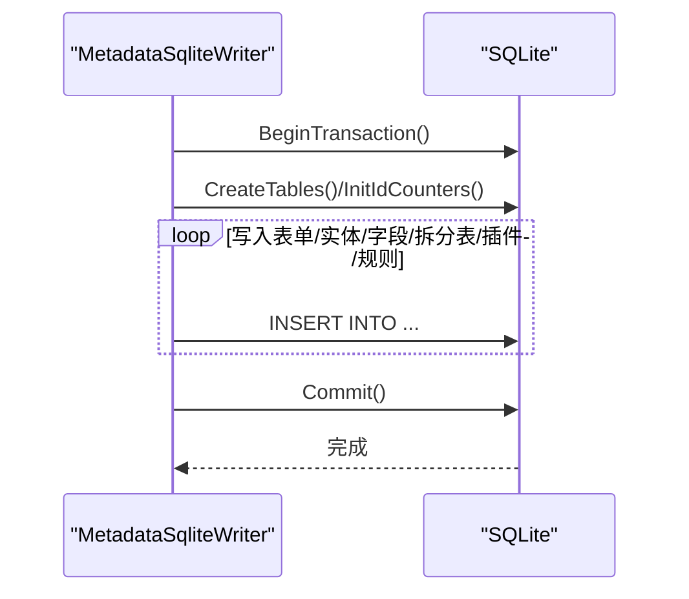
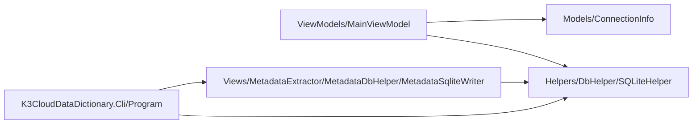

# 数据库助手 - DbHelper与SQLiteHelper

<cite>
**本文档引用的文件**
- [DbHelper.cs](file://Helpers/DbHelper.cs)
- [SQLiteHelper.cs](file://Helpers/SQLiteHelper.cs)
- [MetadataDbHelper.cs](file://Views/MetadataDbHelper.cs)
- [MainViewModel.cs](file://ViewModels/MainViewModel.cs)
- [MetadataExtractor.cs](file://Views/MetadataExtractor.cs)
- [ConnectionInfo.cs](file://Models/ConnectionInfo.cs)
- [MetadataSqliteWriter.cs](file://Views/MetadataSqliteWriter.cs)
- [Program.cs](file://K3CloudDataDictionary.Cli/Program.cs)
- [K3CloudDataDictionary.csproj](file://K3CloudDataDictionary.csproj)
</cite>

## 目录
1. [简介](#简介)
2. [项目结构](#项目结构)
3. [核心组件](#核心组件)
4. [架构总览](#架构总览)
5. [详细组件分析](#详细组件分析)
6. [依赖关系分析](#依赖关系分析)
7. [性能考虑](#性能考虑)
8. [故障排除指南](#故障排除指南)
9. [结论](#结论)

## 简介
本技术文档聚焦于金蝶K3 Cloud数据字典系统的数据库助手组件，系统性阐述以下关键能力：
- SQL Server连接管理、查询执行与事务处理机制（DbHelper）
- 本地SQLite数据库操作、数据同步与缓存管理（SQLiteHelper）
- 元数据存储与查询辅助（MetadataDbHelper）
- 与MainViewModel、MetadataExtractor的协作关系
- 连接池管理、异常处理、性能优化策略
- 使用示例、配置参数说明与故障排除指南

## 项目结构
该项目采用分层与职责分离的设计，数据库访问层位于Helpers目录，业务逻辑与UI交互位于ViewModels与Views目录，CLI工具位于K3CloudDataDictionary.Cli目录。

**图表来源**
- [MainViewModel.cs:198-290](file://ViewModels/MainViewModel.cs#L198-L290)
- [DbHelper.cs:7-68](file://Helpers/DbHelper.cs#L7-L68)
- [SQLiteHelper.cs:10-53](file://Helpers/SQLiteHelper.cs#L10-L53)
- [MetadataDbHelper.cs:36-79](file://Views/MetadataDbHelper.cs#L36-L79)
- [MetadataSqliteWriter.cs:9-50](file://Views/MetadataSqliteWriter.cs#L9-L50)

**章节来源**
- [K3CloudDataDictionary.csproj:1-21](file://K3CloudDataDictionary.csproj#L1-L21)

## 核心组件
- DbHelper：提供SQL Server连接测试、通用查询执行、标量查询执行，统一超时控制与资源释放。
- SQLiteHelper：负责本地连接配置存储、本地数据文件扫描与导入、迁移与清理，以及连接信息的增删改查。
- MetadataDbHelper：针对K3 Cloud元数据表的专用查询辅助，支持一次性加载对象基础信息与批量内核XML查询。
- MainViewModel：应用主视图模型，协调连接切换、本地数据路径更新、SQLite查询封装与UI状态维护。
- MetadataExtractor：元数据提取上下文与提取流程，结合MetadataDbHelper批量加载XML并进行继承/扩展链合并。
- MetadataSqliteWriter：将提取结果写入本地SQLite数据库，支持全量重建与增量更新，提供事务与索引优化。
- Program：CLI入口，解析全局选项、解析连接字符串，统一错误输出。

**章节来源**
- [DbHelper.cs:7-68](file://Helpers/DbHelper.cs#L7-L68)
- [SQLiteHelper.cs:10-368](file://Helpers/SQLiteHelper.cs#L10-L368)
- [MetadataDbHelper.cs:36-129](file://Views/MetadataDbHelper.cs#L36-L129)
- [MainViewModel.cs:235-290](file://ViewModels/MainViewModel.cs#L235-L290)
- [MetadataExtractor.cs:102-284](file://Views/MetadataExtractor.cs#L102-L284)
- [MetadataSqliteWriter.cs:9-283](file://Views/MetadataSqliteWriter.cs#L9-L283)
- [Program.cs:129-151](file://K3CloudDataDictionary.Cli/Program.cs#L129-L151)

## 架构总览
系统围绕“连接配置（SQLite）—元数据查询（SQL Server）—本地缓存（SQLite）—UI展示（WPF/CLI）”的闭环展开。DbHelper与SQLiteHelper分别承担远程与本地数据访问职责；MetadataDbHelper与MetadataExtractor负责元数据的高效加载与合并；MainViewModel与CLI入口协调业务流程与用户交互。

**图表来源**
- [MainViewModel.cs:235-290](file://ViewModels/MainViewModel.cs#L235-L290)
- [DbHelper.cs:9-67](file://Helpers/DbHelper.cs#L9-L67)
- [MetadataDbHelper.cs:44-127](file://Views/MetadataDbHelper.cs#L44-L127)
- [MetadataSqliteWriter.cs:285-353](file://Views/MetadataSqliteWriter.cs#L285-L353)

## 详细组件分析

### DbHelper：SQL Server连接与查询执行
- 连接测试：TestConnection接收连接字符串，使用SqlConnection尝试打开连接，捕获异常并返回错误消息。
- 查询执行：ExecuteQuery建立连接、设置CommandTimeout为60秒，使用SqlDataReader逐行读取，构建大小写不敏感的列名字典，返回行集合。
- 标量查询：ExecuteScalar执行标量查询，返回单一值。
- 异常处理：统一try/catch捕获异常，保证资源释放（using语句）。
- 性能特性：显式设置CommandTimeout，避免长时间阻塞；使用SqlDataReader流式读取，降低内存占用。

**图表来源**
- [DbHelper.cs:9-67](file://Helpers/DbHelper.cs#L9-L67)

**章节来源**
- [DbHelper.cs:7-68](file://Helpers/DbHelper.cs#L7-L68)

### SQLiteHelper：本地SQLite数据库与连接管理
- 数据库初始化：EnsureDatabase确保data目录存在，创建Connections表，兼容旧版本迁移（添加LocalDbFileName列）。
- 连接信息CRUD：LoadAll/LoadDefault/Save/Update/Delete/SetDefault/ClearDefaultFlag实现连接配置的增删改查与默认标记清理。
- 本地数据文件管理：GetDataFolder/GetLocalDbPath/ScanLocalDataFiles/ImportLocalData/DeleteLocalData/RenameLocalData提供本地数据文件的扫描、导入、删除与重命名。
- 迁移逻辑：MigrateOldMetadataDb根据默认连接迁移旧版metadata.db至按连接命名的新文件，避免与其他数据文件冲突。
- 安全性：密码字段通过PasswordHelper加密/解密存储，避免明文保存。

**图表来源**
- [SQLiteHelper.cs:17-368](file://Helpers/SQLiteHelper.cs#L17-L368)
- [ConnectionInfo.cs:6-144](file://Models/ConnectionInfo.cs#L6-L144)

**章节来源**
- [SQLiteHelper.cs:10-368](file://Helpers/SQLiteHelper.cs#L10-L368)
- [ConnectionInfo.cs:6-144](file://Models/ConnectionInfo.cs#L6-L144)

### MetadataDbHelper：元数据查询辅助
- LoadAllObjectBasicInfo：一次性查询所有对象基础信息（不含XML），用于内存构建继承链与扩展链，筛选模型类型为400或100。
- LoadKernelXmlBatch：批量查询指定FID列表的内核XML内容，使用参数化IN子句，一次数据库连接获取所有XML，提高网络往返效率。

**图表来源**
- [MetadataDbHelper.cs:44-127](file://Views/MetadataDbHelper.cs#L44-L127)

**章节来源**
- [MetadataDbHelper.cs:36-129](file://Views/MetadataDbHelper.cs#L36-L129)

### MainViewModel：连接切换与本地SQLite查询封装
- 连接加载：LoadSavedConnection调用SQLiteHelper.EnsureDatabase与LoadDefault，自动连接默认连接。
- 连接应用：ApplyConnectionAsync切换连接时清空旧数据，更新本地数据库路径，检测本地数据是否存在并加载树形数据。
- 本地查询封装：ExecuteQuery封装SQLite连接、参数化查询、流式读取，供各模块页签使用。
- 与SQLiteHelper协作：UpdateLocalDbPath基于当前连接计算本地数据库文件路径；OnRefreshCompletedAsync在刷新完成后更新UI状态与树形数据。

**图表来源**
- [MainViewModel.cs:235-290](file://ViewModels/MainViewModel.cs#L235-L290)

**章节来源**
- [MainViewModel.cs:235-290](file://ViewModels/MainViewModel.cs#L235-L290)

### MetadataExtractor：元数据提取与合并
- MetadataContext：一次性加载所有对象基础信息，构建扩展映射与目标FID集合，支持按继承链与扩展链生成完整处理链。
- ExtractBatch/ExtractByFid：收集所需FID→批量加载XML→逐个提取→合并实体/字段/拆分表/插件/表单操作。
- 合并策略：基于oid或Id/Key进行匹配，支持action=remove的删除与action=edit的覆盖，递归合并扩展链。

**图表来源**
- [MetadataExtractor.cs:102-284](file://Views/MetadataExtractor.cs#L102-L284)

**章节来源**
- [MetadataExtractor.cs:102-397](file://Views/MetadataExtractor.cs#L102-L397)

### MetadataSqliteWriter：本地SQLite写入与事务管理
- 表结构：CreateTables按K3 Cloud元数据模型创建多表，包含索引与约束，支持全量重建。
- 写入流程：Write(MetadataResult)将表单、实体、拆分表、字段、值更新动作、服务规则、插件、表单操作等写入，使用事务保证一致性。
- 增量更新：InitIdCounters从现有表读取最大FID，避免ID冲突；DeleteFormsByIdentifiers支持按表单标识删除级联数据并重置ID计数器。
- 事务与性能：BeginTransaction开启事务，批量插入后Flush，减少磁盘I/O；索引在全量重建时集中创建，提升查询效率。

**图表来源**
- [MetadataSqliteWriter.cs:29-50](file://Views/MetadataSqliteWriter.cs#L29-L50)
- [MetadataSqliteWriter.cs:560-800](file://Views/MetadataSqliteWriter.cs#L560-L800)

**章节来源**
- [MetadataSqliteWriter.cs:9-283](file://Views/MetadataSqliteWriter.cs#L9-L283)

### CLI入口：Program与连接字符串解析
- EnsureDatabase：启动时确保SQLite连接配置数据库可用。
- ResolveConnectionString：优先使用--connection指定的连接ID，否则使用默认连接；若均不可用抛出异常并提示使用帮助。
- 错误处理：统一捕获异常并通过JsonOutputWriter输出错误信息。

**章节来源**
- [Program.cs:14-151](file://K3CloudDataDictionary.Cli/Program.cs#L14-L151)

## 依赖关系分析
- 外部依赖：System.Data.SqlClient、System.Data.SQLite.Core、HandyControl。
- 内部依赖：ViewModels依赖Helpers与Models；Views依赖Helpers与Models；CLI依赖Helpers与Views。
- 循环依赖：未发现循环依赖，职责边界清晰。

**图表来源**
- [K3CloudDataDictionary.csproj:12-16](file://K3CloudDataDictionary.csproj#L12-L16)
- [MainViewModel.cs:13-14](file://ViewModels/MainViewModel.cs#L13-L14)
- [Program.cs:3-5](file://K3CloudDataDictionary.Cli/Program.cs#L3-L5)

**章节来源**
- [K3CloudDataDictionary.csproj:12-16](file://K3CloudDataDictionary.csproj#L12-L16)

## 性能考虑
- 连接与超时
  - SQL Server：DbHelper设置CommandTimeout为60秒，避免长时间阻塞；使用using语句确保连接及时释放。
  - SQLite：MainViewModel封装ExecuteQuery，统一参数化查询与流式读取，减少内存占用。
- 批量查询
  - MetadataDbHelper使用参数化IN子句批量加载XML，减少网络往返次数。
- 事务与索引
  - MetadataSqliteWriter在全量重建时集中创建索引，在增量更新时避免重复创建，提升写入与查询性能。
- 缓存与内存
  - MetadataExtractor在上下文中一次性加载基础信息，构建扩展映射与目标FID列表，避免重复查询；XML在方法返回后由GC回收，降低内存压力。
- I/O优化
  - SQLiteHelper的ImportLocalData/RenameLocalData/DeleteLocalData提供原子性操作，避免并发冲突。

[本节为通用性能建议，无需特定文件引用]

## 故障排除指南
- SQL Server连接失败
  - 使用DbHelper.TestConnection诊断连接字符串与凭据；检查网络连通性与防火墙设置。
  - 若出现超时，适当增大CommandTimeout或优化查询。
- SQLite连接异常
  - 确认data目录存在且具备写权限；使用SQLiteHelper.EnsureDatabase初始化数据库。
  - 若迁移失败，检查旧表结构与列是否存在。
- 元数据加载异常
  - 检查MetadataDbHelper查询条件与表名是否正确；确认LocaleID为2052的多语言表存在。
  - 批量XML加载失败时，确认FID列表非空且数据库可达。
- 本地数据文件问题
  - 使用SQLiteHelper.ScanLocalDataFiles检查data目录下.db文件；ImportLocalData会自动规避与连接预期文件名冲突。
  - 删除或重命名失败时，确认文件未被占用且路径有效。
- CLI使用问题
  - 未设置默认连接时，使用--connection指定连接ID；使用--pretty美化JSON输出。
  - 出错时查看标准错误输出，根据提示修正参数或配置。

**章节来源**
- [DbHelper.cs:9-25](file://Helpers/DbHelper.cs#L9-L25)
- [SQLiteHelper.cs:17-53](file://Helpers/SQLiteHelper.cs#L17-L53)
- [MetadataDbHelper.cs:44-127](file://Views/MetadataDbHelper.cs#L44-L127)
- [Program.cs:129-151](file://K3CloudDataDictionary.Cli/Program.cs#L129-L151)

## 结论
本系统通过DbHelper、SQLiteHelper、MetadataDbHelper、MainViewModel、MetadataExtractor与MetadataSqliteWriter的协同工作，实现了从SQL Server元数据抽取、本地SQLite缓存、UI展示与CLI工具的完整闭环。DbHelper与SQLiteHelper分别承担远程与本地数据访问职责，MetadataDbHelper与MetadataExtractor负责高效的元数据加载与合并，MainViewModel与CLI入口协调业务流程与用户交互。通过事务、批量化查询、索引与参数化SQL等手段，系统在保证稳定性的同时兼顾了性能与可维护性。