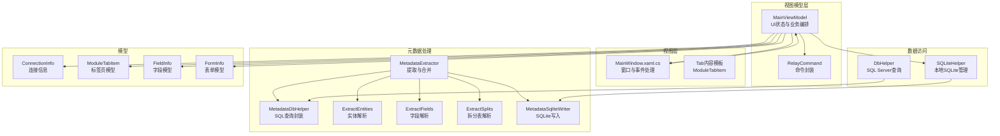
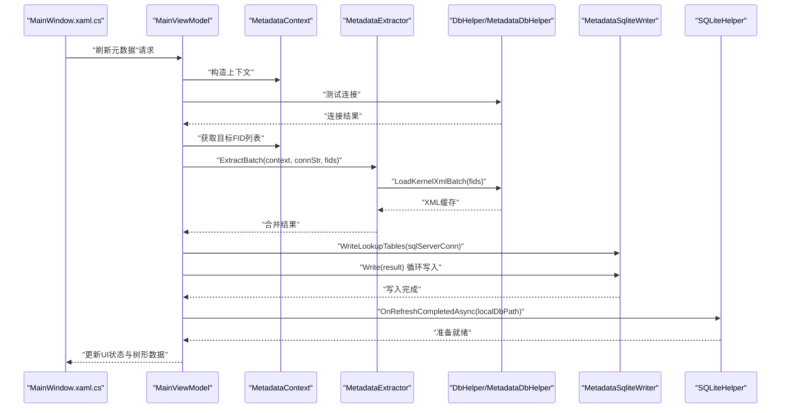
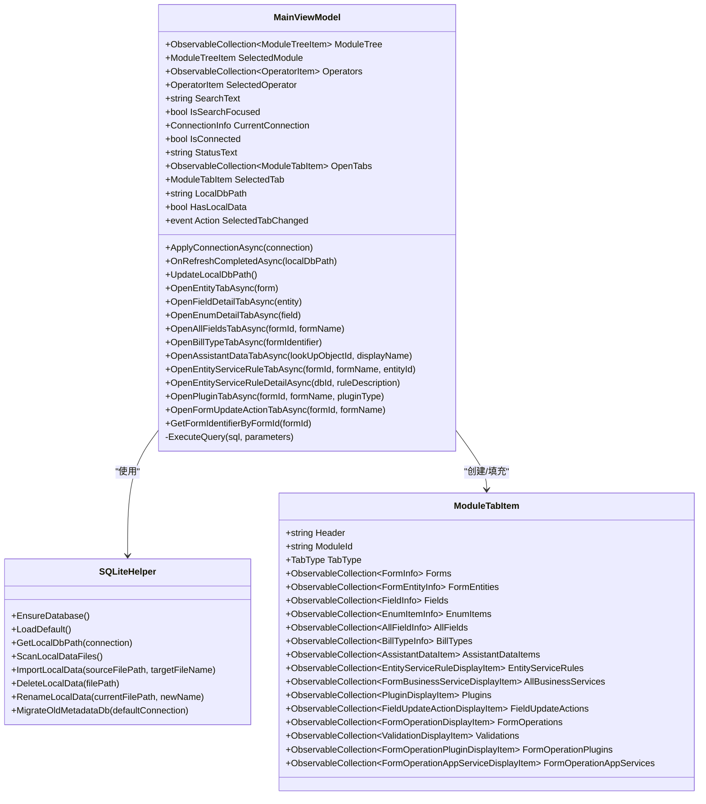
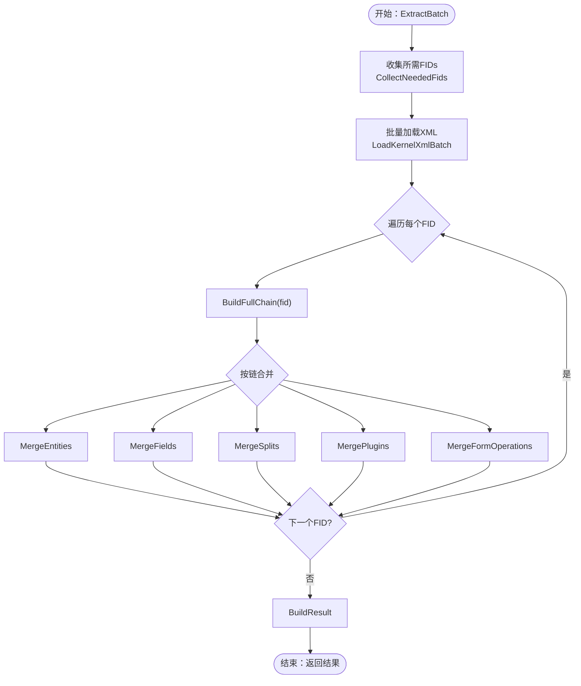
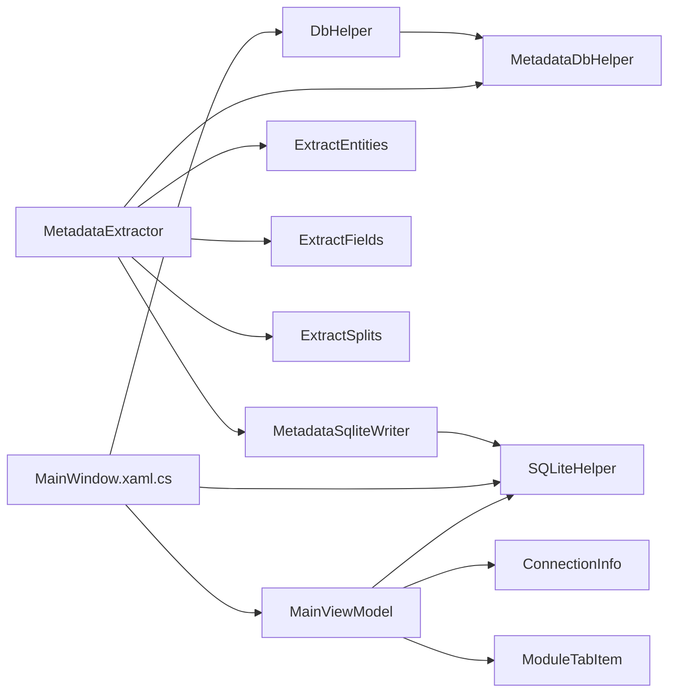

# 核心组件设计

<cite>
**本文档引用的文件**
- [MainViewModel.cs](file://ViewModels/MainViewModel.cs)
- [MetadataExtractor.cs](file://Views/MetadataExtractor.cs)
- [DbHelper.cs](file://Helpers/DbHelper.cs)
- [SQLiteHelper.cs](file://Helpers/SQLiteHelper.cs)
- [MetadataDbHelper.cs](file://Views/MetadataDbHelper.cs)
- [MetadataSqliteWriter.cs](file://Views/MetadataSqliteWriter.cs)
- [ConnectionInfo.cs](file://Models/ConnectionInfo.cs)
- [ModuleTabItem.cs](file://Models/ModuleTabItem.cs)
- [MainWindow.xaml.cs](file://MainWindow.xaml.cs)
- [ExtractEntities.cs](file://Views/ExtractEntities.cs)
- [ExtractFields.cs](file://Views/ExtractFields.cs)
- [ExtractSplits.cs](file://Views/ExtractSplits.cs)
- [FieldInfo.cs](file://Models/FieldInfo.cs)
- [FormInfo.cs](file://Models/FormInfo.cs)
- [RelayCommand.cs](file://ViewModels/RelayCommand.cs)
</cite>

## 目录
1. [引言](#引言)
2. [项目结构](#项目结构)
3. [核心组件](#核心组件)
4. [架构总览](#架构总览)
5. [详细组件分析](#详细组件分析)
6. [依赖关系分析](#依赖关系分析)
7. [性能考虑](#性能考虑)
8. [故障排除指南](#故障排除指南)
9. [结论](#结论)
10. [附录](#附录)

## 引言
本设计文档聚焦于金蝶K3 Cloud数据字典系统的核心组件，围绕以下关键组件展开：MainViewModel 控制器、MetadataExtractor 元数据提取器、DbHelper 数据库助手、SQLiteHelper 本地存储等。文档旨在阐明各组件的职责边界、接口设计、内部实现机制、组件间协作关系与通信方式（事件传递、数据共享、异常处理），并通过多种图示展示生命周期与交互流程，并提供使用示例与最佳实践建议。

## 项目结构
系统采用 MVVM 架构，主要模块划分如下：
- 视图模型层：MainViewModel 负责 UI 状态与业务流程编排
- 视图层：MainWindow.xaml.cs 与各类 Tab 内容模板
- 视图解析与元数据提取：MetadataExtractor、ExtractEntities、ExtractFields、ExtractSplits
- 数据访问层：DbHelper（SQL Server）、SQLiteHelper（本地SQLite）
- 模型层：ConnectionInfo、ModuleTabItem、FieldInfo、FormInfo 等
- 工具与帮助：RelayCommand

**图表来源**
- [MainViewModel.cs:18-800](file://ViewModels/MainViewModel.cs#L18-L800)
- [MetadataExtractor.cs:289-800](file://Views/MetadataExtractor.cs#L289-L800)
- [MetadataDbHelper.cs:36-131](file://Views/MetadataDbHelper.cs#L36-L131)
- [ExtractEntities.cs:47-293](file://Views/ExtractEntities.cs#L47-L293)
- [ExtractFields.cs:70-167](file://Views/ExtractFields.cs#L70-L167)
- [ExtractSplits.cs:28-60](file://Views/ExtractSplits.cs#L28-L60)
- [MetadataSqliteWriter.cs:9-846](file://Views/MetadataSqliteWriter.cs#L9-L846)
- [DbHelper.cs:7-70](file://Helpers/DbHelper.cs#L7-L70)
- [SQLiteHelper.cs:10-370](file://Helpers/SQLiteHelper.cs#L10-L370)
- [ConnectionInfo.cs:6-144](file://Models/ConnectionInfo.cs#L6-L144)
- [ModuleTabItem.cs:9-196](file://Models/ModuleTabItem.cs#L9-L196)
- [MainWindow.xaml.cs:30-800](file://MainWindow.xaml.cs#L30-L800)
- [FieldInfo.cs:6-110](file://Models/FieldInfo.cs#L6-L110)
- [FormInfo.cs:6-101](file://Models/FormInfo.cs#L6-L101)

**章节来源**
- [MainViewModel.cs:18-800](file://ViewModels/MainViewModel.cs#L18-L800)
- [MainWindow.xaml.cs:30-800](file://MainWindow.xaml.cs#L30-L800)

## 核心组件
本节概述四大核心组件的职责与边界：
- MainViewModel：负责连接管理、树形导航、标签页打开与数据加载、状态更新、搜索与命令绑定
- MetadataExtractor：负责构建继承/扩展链、批量加载XML、按链合并实体/字段/拆分表/插件/表单操作
- DbHelper：提供 SQL Server 连接测试与通用查询能力
- SQLiteHelper：提供本地SQLite连接信息存储、本地数据文件扫描/导入/重命名/删除、路径计算

**章节来源**
- [MainViewModel.cs:18-800](file://ViewModels/MainViewModel.cs#L18-L800)
- [MetadataExtractor.cs:289-800](file://Views/MetadataExtractor.cs#L289-L800)
- [DbHelper.cs:7-70](file://Helpers/DbHelper.cs#L7-L70)
- [SQLiteHelper.cs:10-370](file://Helpers/SQLiteHelper.cs#L10-L370)

## 架构总览
系统整体工作流分为“远程元数据获取”和“本地数据浏览”两大路径：
- 远程元数据获取：MainWindow 触发刷新，创建 MetadataContext，分批提取 FID，调用 MetadataExtractor 合并，再通过 MetadataSqliteWriter 写入 SQLite
- 本地数据浏览：MainViewModel 依据 ConnectionInfo 计算本地数据库路径，基于 SQLite 查询构建树与标签页数据

**图表来源**
- [MainWindow.xaml.cs:444-538](file://MainWindow.xaml.cs#L444-L538)
- [MetadataExtractor.cs:299-311](file://Views/MetadataExtractor.cs#L299-L311)
- [MetadataDbHelper.cs:87-127](file://Views/MetadataDbHelper.cs#L87-L127)
- [DbHelper.cs:9-25](file://Helpers/DbHelper.cs#L9-L25)
- [MetadataSqliteWriter.cs:285-301](file://Views/MetadataSqliteWriter.cs#L285-L301)
- [SQLiteHelper.cs:209-213](file://Helpers/SQLiteHelper.cs#L209-L213)

## 详细组件分析

### MainViewModel 控制器
- 职责范围
  - 连接管理：加载默认连接、应用新连接、切换连接时清理旧数据
  - 树形导航：根据模块选择打开对应标签页（表单、实体、字段、枚举、单据类型、辅助资料、服务规则、插件、值更新、表单操作等）
  - 标签页管理：打开/关闭标签页、状态栏文本更新、Tab 类型与计数显示
  - 本地数据查询：基于 SQLite 路径执行 SQL 查询，支持 LookupObjectID、EnumType、FormIdentifier 等跨表关联查询
  - 命令绑定：SearchCommand、关闭标签页命令等
- 接口设计
  - 属性：ModuleTree、Operators、SelectedOperator、SearchText、IsSearchFocused、CurrentConnection、IsConnected、StatusText、OpenTabs、SelectedTab、LocalDbPath、HasLocalData
  - 方法：ApplyConnectionAsync、OnRefreshCompletedAsync、UpdateLocalDbPath、OpenEntityTabAsync、OpenFieldDetailTabAsync、OpenEnumDetailTabAsync、OpenAllFieldsTabAsync、OpenBillTypeTabAsync、OpenAssistantDataTabAsync、OpenEntityServiceRuleTabAsync、OpenEntityServiceRuleDetailAsync、OpenPluginTabAsync、OpenFormUpdateActionTabAsync、GetFormIdentifierByFormId、各种 Load*DataAsync
  - 事件：SelectedTabChanged
- 内部实现机制
  - 使用 SQLiteHelper.EnsureDatabase 与 SQLiteHelper.LoadDefault 初始化连接信息
  - 使用 SQLiteHelper.GetLocalDbPath 计算本地数据库路径
  - 使用 ExecuteQuery 执行本地 SQLite 查询，返回字典列表供 UI 绑定
  - 通过 ModuleTabItem 的集合属性承载不同 Tab 的数据源
- 组件协作
  - 与 SQLiteHelper 协作进行连接与本地数据路径管理
  - 与 MainWindow.xaml.cs 事件联动（如 SelectedTabChanged）
  - 与 RelayCommand 封装命令
- 异常处理
  - 模块选择与标签页打开过程中捕获异常并更新状态文本
  - 刷新元数据时通过 Dispatcher.Invoke 回到 UI 线程更新进度与状态

**图表来源**
- [MainViewModel.cs:18-800](file://ViewModels/MainViewModel.cs#L18-L800)
- [SQLiteHelper.cs:10-370](file://Helpers/SQLiteHelper.cs#L10-L370)
- [ModuleTabItem.cs:9-196](file://Models/ModuleTabItem.cs#L9-L196)

**章节来源**
- [MainViewModel.cs:18-800](file://ViewModels/MainViewModel.cs#L18-L800)
- [RelayCommand.cs:6-28](file://ViewModels/RelayCommand.cs#L6-L28)

### MetadataExtractor 元数据提取器
- 职责范围
  - 构建对象基础信息字典与继承/扩展映射
  - 为指定 FID 构建完整处理链（继承链 + 每层继承节点的扩展链）
  - 批量加载 XML 并按链合并实体、字段、拆分表、插件、表单操作
  - 提供线程安全的合并策略（oid 优先匹配、action=remove 删除、action=edit 覆盖）
- 接口设计
  - MetadataContext：只读上下文，提供 BuildFullChain、CollectNeededFids、GetBasicInfo、GetTargetFidsWithoutExtensions、GetTargetFidsWithExtensions
  - MetadataExtractor：ExtractBatch、ExtractByFid，以及一系列 Merge* 辅助方法
- 内部实现机制
  - 通过 MetadataDbHelper.LoadAllObjectBasicInfo 加载基础信息
  - 通过 MetadataDbHelper.LoadKernelXmlBatch 批量加载 XML
  - 通过 ExtractEntities、ExtractFields、ExtractSplits 解析 XML
  - 使用字典按 oid/Key 进行合并与覆盖
- 组件协作
  - 依赖 MetadataDbHelper 进行数据库查询
  - 依赖 ExtractEntities/ExtractFields/ExtractSplits 进行 XML 解析
  - 输出给 MetadataSqliteWriter 写入本地数据库
- 异常处理
  - 未找到对象基础信息时返回空结果
  - XML 缓存缺失时跳过对应层级

**图表来源**
- [MetadataExtractor.cs:299-311](file://Views/MetadataExtractor.cs#L299-L311)
- [MetadataExtractor.cs:322-360](file://Views/MetadataExtractor.cs#L322-L360)
- [MetadataExtractor.cs:404-451](file://Views/MetadataExtractor.cs#L404-L451)
- [MetadataExtractor.cs:616-690](file://Views/MetadataExtractor.cs#L616-L690)
- [MetadataDbHelper.cs:87-127](file://Views/MetadataDbHelper.cs#L87-L127)

**章节来源**
- [MetadataExtractor.cs:102-284](file://Views/MetadataExtractor.cs#L102-L284)
- [MetadataExtractor.cs:299-360](file://Views/MetadataExtractor.cs#L299-L360)
- [MetadataDbHelper.cs:44-127](file://Views/MetadataDbHelper.cs#L44-L127)

### DbHelper 数据库助手
- 职责范围
  - 测试 SQL Server 连接可用性
  - 执行查询与标量子查询，统一超时设置
- 接口设计
  - TestConnection：返回布尔值并输出错误消息
  - ExecuteQuery：返回行字典列表
  - ExecuteScalar：返回标量结果
- 内部实现机制
  - 使用 SqlConnection/SqlCommand 执行
  - 统一 CommandTimeout=60 秒
- 组件协作
  - 被 MainWindow.xaml.cs 用于连接测试
  - 被 MetadataDbHelper 用于基础信息与XML查询
- 异常处理
  - 捕获异常并返回错误消息

**章节来源**
- [DbHelper.cs:7-70](file://Helpers/DbHelper.cs#L7-L70)
- [MetadataDbHelper.cs:44-127](file://Views/MetadataDbHelper.cs#L44-L127)

### SQLiteHelper 本地存储
- 职责范围
  - 确保 connections.db 存在并具备必要列
  - 连接信息的增删改查与默认标记管理
  - 本地数据文件的扫描、导入、重命名、删除
  - 本地数据库路径计算与旧版迁移
- 接口设计
  - EnsureDatabase、LoadAll、LoadDefault、Save、Update、Delete、SetDefault
  - GetDataFolder、GetLocalDbPath、ScanLocalDataFiles、ImportLocalData、DeleteLocalData、RenameLocalData
  - MigrateOldMetadataDb
- 内部实现机制
  - 使用 System.Data.SQLite 进行 CRUD
  - 本地数据文件名与连接信息关联，避免与保留名冲突
  - 旧版 metadata.db 迁移到按连接命名的新文件
- 组件协作
  - 被 MainViewModel 用于连接与本地路径管理
  - 被 MainWindow.xaml.cs 用于刷新元数据前后路径计算
- 异常处理
  - 列已存在时忽略 ALTER 操作
  - 文件重命名冲突时自动编号

**章节来源**
- [SQLiteHelper.cs:17-370](file://Helpers/SQLiteHelper.cs#L17-L370)
- [ConnectionInfo.cs:86-96](file://Models/ConnectionInfo.cs#L86-L96)

### 元数据写入器（MetadataSqliteWriter）
- 职责范围
  - 创建/重建 SQLite 表结构（T_FORM、T_ENTITY、T_ENTITYSPLIT、T_FIELD、T_PLUGIN、T_FIELDUPDATEACTION、T_FORMOPERATION、T_VALIDATION 等）
  - 写入查找表（T_MDL_ELEMENTTYPE_L、T_META_SUBSYSTEM、T_META_FORMENUM、T_Meta_LookupClass、T_BAS_BILLTYPE、T_BAS_ASSISTANTDATA、T_MDL_FORMBUSINESS_L、T_MDL_FORMVALIDATIONTYPE_L）
  - 写入提取结果（表单、实体、拆分表、字段、值更新动作、服务规则、插件、表单操作及子集合）
  - 支持增量删除指定表单标识的记录并重置 ID 计数器
- 接口设计
  - 构造函数：支持重建表或增量写入
  - WriteLookupTables、Write、DeleteFormsByIdentifiers
- 内部实现机制
  - 使用 SQLiteConnection/SQLiteTransaction 批量写入
  - 通过 ExecuteNonQuery 执行 DDL/DML
  - 通过参数化 SQL 防注入
- 组件协作
  - 被 MainWindow.xaml.cs 在刷新元数据时调用
  - 依赖 MetadataExtractor 的结果
- 异常处理
  - 通过事务保证一致性，异常时回滚

**章节来源**
- [MetadataSqliteWriter.cs:27-846](file://Views/MetadataSqliteWriter.cs#L27-L846)

## 依赖关系分析
- MainViewModel 依赖 SQLiteHelper（连接与本地路径）、ConnectionInfo（连接信息模型）、ModuleTabItem（标签页数据模型）
- MetadataExtractor 依赖 MetadataDbHelper（SQL Server 查询）、ExtractEntities/ExtractFields/ExtractSplits（XML 解析）
- MainWindow.xaml.cs 依赖 MainViewModel（事件绑定）、DbHelper（连接测试）、SQLiteHelper（路径与刷新）
- DbHelper 与 MetadataDbHelper 共同依赖 SQL Server
- MetadataSqliteWriter 依赖 SQLite

**图表来源**
- [MainViewModel.cs:18-800](file://ViewModels/MainViewModel.cs#L18-L800)
- [MainWindow.xaml.cs:444-538](file://MainWindow.xaml.cs#L444-L538)
- [MetadataExtractor.cs:289-800](file://Views/MetadataExtractor.cs#L289-L800)
- [MetadataDbHelper.cs:36-131](file://Views/MetadataDbHelper.cs#L36-L131)
- [ExtractEntities.cs:47-293](file://Views/ExtractEntities.cs#L47-L293)
- [ExtractFields.cs:70-167](file://Views/ExtractFields.cs#L70-L167)
- [ExtractSplits.cs:28-60](file://Views/ExtractSplits.cs#L28-L60)
- [MetadataSqliteWriter.cs:9-846](file://Views/MetadataSqliteWriter.cs#L9-L846)
- [DbHelper.cs:7-70](file://Helpers/DbHelper.cs#L7-L70)
- [SQLiteHelper.cs:10-370](file://Helpers/SQLiteHelper.cs#L10-L370)

**章节来源**
- [MainViewModel.cs:18-800](file://ViewModels/MainViewModel.cs#L18-L800)
- [MainWindow.xaml.cs:444-538](file://MainWindow.xaml.cs#L444-L538)
- [MetadataExtractor.cs:289-800](file://Views/MetadataExtractor.cs#L289-L800)

## 性能考虑
- 批量处理
  - MetadataExtractor 使用 CollectNeededFids 收集所需 FID，一次性 LoadKernelXmlBatch，减少数据库往返
- 线程安全
  - MetadataContext 为只读上下文，避免并发写入
  - XML 缓存在方法内局部使用，避免共享状态
- I/O 优化
  - MetadataSqliteWriter 使用事务批量写入，减少磁盘写入次数
  - SQLite 使用参数化查询，提升执行效率
- 内存管理
  - XML 在方法返回后交由 GC 回收
  - 字典按 oid/Key 建立索引，合并时快速定位
- UI 响应
  - 刷新元数据在后台线程执行，通过 Dispatcher.Invoke 更新 UI，避免阻塞

[本节为通用指导，不直接分析具体文件]

## 故障排除指南
- 连接失败
  - 使用 DbHelper.TestConnection 检查 SQL Server 连接，查看错误消息
  - 确认 ConnectionInfo.ConnectionString 正确
- 本地数据不可用
  - 检查 MainViewModel.HasLocalData 与 LocalDbPath 是否有效
  - 若文件被删除，MainWindow.xaml.cs 会清空数据并提示重新连接
- 刷新元数据异常
  - 查看状态文本与 Growl 提示
  - 确认 SQLiteHelper.GetLocalDbPath 返回的有效路径
  - 检查 MetadataSqliteWriter 写入日志与事务回滚情况
- 合并冲突
  - 确认 XML 中 action=remove 的正确使用
  - 检查 oid 与 Key 的匹配规则是否符合预期

**章节来源**
- [DbHelper.cs:9-25](file://Helpers/DbHelper.cs#L9-L25)
- [MainWindow.xaml.cs:444-538](file://MainWindow.xaml.cs#L444-L538)
- [MainViewModel.cs:235-290](file://ViewModels/MainViewModel.cs#L235-L290)

## 结论
本设计文档梳理了金蝶K3 Cloud数据字典系统的核心组件及其协作关系。MainViewModel 作为控制器协调 UI 与数据访问；MetadataExtractor 负责复杂继承/扩展链的合并；DbHelper 与 SQLiteHelper 分别承担远程与本地数据访问；MetadataSqliteWriter 完成最终的结构化写入。通过清晰的职责划分、线程安全的上下文设计、批量处理与事务写入，系统实现了高效稳定的元数据获取与本地浏览体验。

[本节为总结性内容，不直接分析具体文件]

## 附录
- 使用示例
  - 连接与刷新元数据：MainWindow.xaml.cs 中的刷新菜单项触发，依次测试连接、构建上下文、提取与写入
  - 打开实体/字段/枚举/单据类型/辅助资料/服务规则/插件等标签页：MainViewModel 的相应方法根据本地 SQLite 数据动态加载
  - 本地数据文件管理：通过 SQLiteHelper.ImportLocalData/RenameLocalData/DeleteLocalData 管理 data 目录中的 .db 文件
- 最佳实践
  - 保持 MetadataContext 只读，避免并发修改
  - 批量处理时统一使用 CollectNeededFids 与 LoadKernelXmlBatch
  - 写入 SQLite 前先写入查找表，确保外键约束满足
  - UI 更新通过 Dispatcher.Invoke，避免跨线程访问
  - 对关键异常进行捕获并反馈给用户（Growl）

**章节来源**
- [MainWindow.xaml.cs:444-648](file://MainWindow.xaml.cs#L444-L648)
- [MainViewModel.cs:323-800](file://ViewModels/MainViewModel.cs#L323-L800)
- [SQLiteHelper.cs:256-338](file://Helpers/SQLiteHelper.cs#L256-L338)