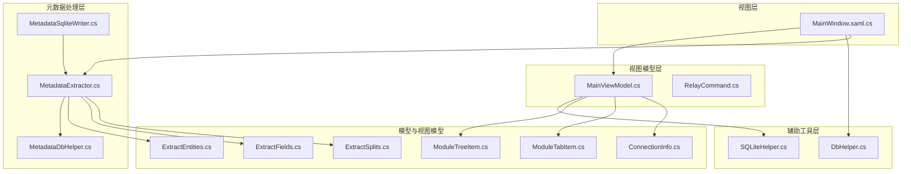
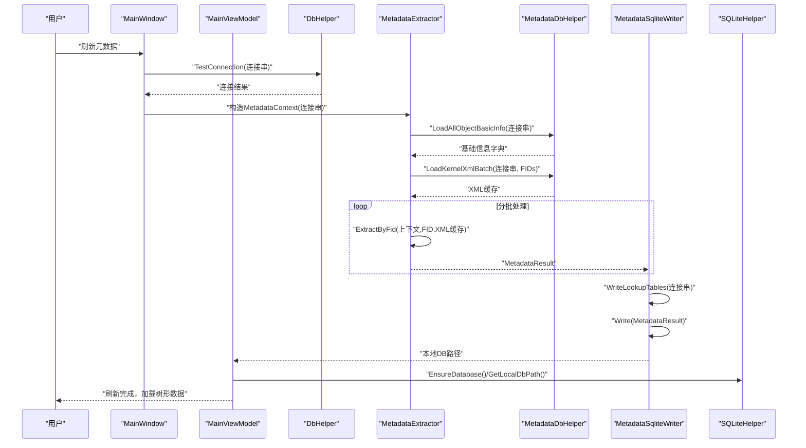
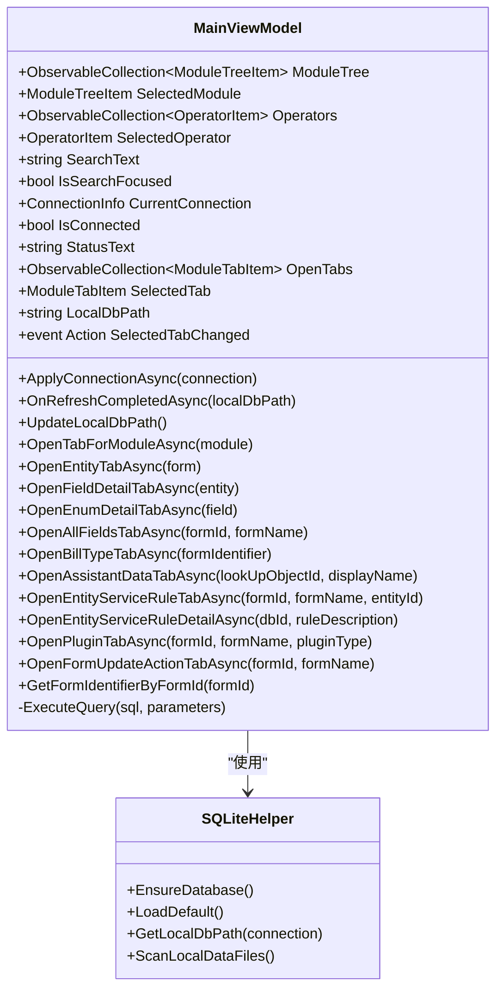
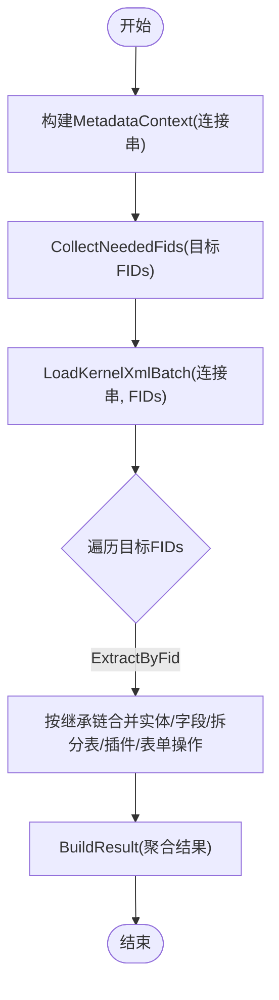
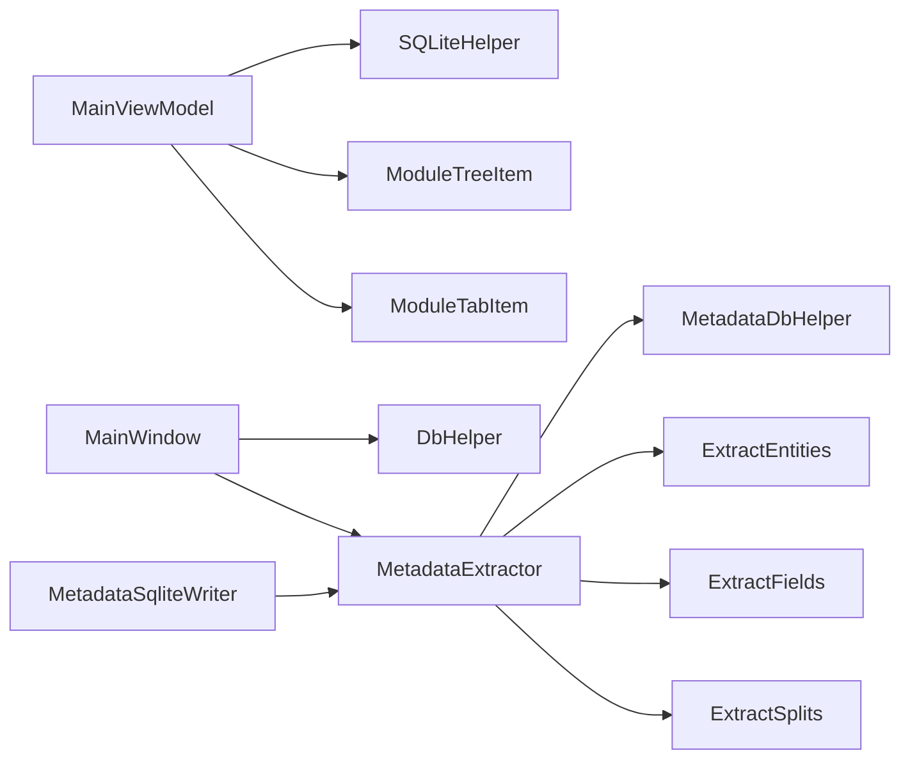

# 组件交互与协作

<cite>
**本文档引用的文件**
- [MainViewModel.cs](file://ViewModels/MainViewModel.cs)
- [MetadataExtractor.cs](file://Views/MetadataExtractor.cs)
- [DbHelper.cs](file://Helpers/DbHelper.cs)
- [SQLiteHelper.cs](file://Helpers/SQLiteHelper.cs)
- [MetadataDbHelper.cs](file://Views/MetadataDbHelper.cs)
- [MetadataSqliteWriter.cs](file://Views/MetadataSqliteWriter.cs)
- [MainWindow.xaml.cs](file://MainWindow.xaml.cs)
- [ConnectionInfo.cs](file://Models/ConnectionInfo.cs)
- [ModuleTreeItem.cs](file://Models/ModuleTreeItem.cs)
- [ModuleTabItem.cs](file://Models/ModuleTabItem.cs)
- [ExtractEntities.cs](file://Views/ExtractEntities.cs)
- [ExtractFields.cs](file://Views/ExtractFields.cs)
- [ExtractSplits.cs](file://Views/ExtractSplits.cs)
- [RelayCommand.cs](file://ViewModels/RelayCommand.cs)
</cite>

## 目录
1. [简介](#简介)
2. [项目结构](#项目结构)
3. [核心组件](#核心组件)
4. [架构总览](#架构总览)
5. [详细组件分析](#详细组件分析)
6. [依赖关系分析](#依赖关系分析)
7. [性能考量](#性能考量)
8. [故障排查指南](#故障排查指南)
9. [结论](#结论)
10. [附录](#附录)

## 简介
本文件面向金蝶K3 Cloud数据字典系统的组件交互与协作机制，重点阐述MainViewModel、MetadataExtractor、DbHelper、SQLiteHelper等核心组件之间的交互关系、数据流向、事件传递机制与异常处理策略，并提供调用序列、参数传递与返回值处理说明。同时给出组件解耦设计、依赖注入与测试策略的最佳实践建议，以及异步操作处理、并发控制与性能优化方案。

## 项目结构
系统采用MVVM架构，主要模块包括：
- 视图模型层：MainViewModel负责UI状态管理、命令执行与数据加载
- 视图层：MainWindow.xaml.cs承载菜单与刷新流程，各Tab模板由模板选择器动态加载
- 辅助工具层：DbHelper、SQLiteHelper提供数据库连接与本地存储能力
- 元数据处理层：MetadataExtractor、MetadataDbHelper、MetadataSqliteWriter负责从SQL Server抽取、合并并写入SQLite
- 模型与视图模型：ModuleTreeItem、ModuleTabItem、ConnectionInfo等支撑树形导航与标签页数据

**图表来源**
- [MainWindow.xaml.cs:36-86](file://MainWindow.xaml.cs#L36-L86)
- [MainViewModel.cs:198-215](file://ViewModels/MainViewModel.cs#L198-L215)
- [DbHelper.cs:9-25](file://Helpers/DbHelper.cs#L9-L25)
- [SQLiteHelper.cs:17-53](file://Helpers/SQLiteHelper.cs#L17-L53)
- [MetadataDbHelper.cs:44-79](file://Views/MetadataDbHelper.cs#L44-L79)
- [MetadataExtractor.cs:289-360](file://Views/MetadataExtractor.cs#L289-L360)
- [MetadataSqliteWriter.cs:27-50](file://Views/MetadataSqliteWriter.cs#L27-L50)

**章节来源**
- [MainWindow.xaml.cs:36-86](file://MainWindow.xaml.cs#L36-L86)
- [MainViewModel.cs:198-215](file://ViewModels/MainViewModel.cs#L198-L215)
- [DbHelper.cs:9-25](file://Helpers/DbHelper.cs#L9-L25)
- [SQLiteHelper.cs:17-53](file://Helpers/SQLiteHelper.cs#L17-L53)
- [MetadataDbHelper.cs:44-79](file://Views/MetadataDbHelper.cs#L44-L79)
- [MetadataExtractor.cs:289-360](file://Views/MetadataExtractor.cs#L289-L360)
- [MetadataSqliteWriter.cs:27-50](file://Views/MetadataSqliteWriter.cs#L27-L50)

## 核心组件
- MainViewModel：负责连接管理、树形数据加载、标签页打开与切换、搜索与状态更新、SQLite查询与异步加载
- MetadataExtractor：基于MetadataContext构建继承/扩展链，合并XML元数据，输出统一结果
- MetadataDbHelper：从SQL Server查询对象基础信息与内核XML，支持批量加载
- MetadataSqliteWriter：将元数据写入SQLite，重建或增量更新表结构
- DbHelper：远程SQL Server连接测试与查询
- SQLiteHelper：本地SQLite连接信息管理、本地数据文件扫描与导入、默认连接与路径计算
- MainWindow.xaml.cs：菜单入口、刷新流程调度、进度反馈与错误提示

**章节来源**
- [MainViewModel.cs:18-127](file://ViewModels/MainViewModel.cs#L18-L127)
- [MetadataExtractor.cs:289-360](file://Views/MetadataExtractor.cs#L289-L360)
- [MetadataDbHelper.cs:44-79](file://Views/MetadataDbHelper.cs#L44-L79)
- [MetadataSqliteWriter.cs:27-50](file://Views/MetadataSqliteWriter.cs#L27-L50)
- [DbHelper.cs:9-25](file://Helpers/DbHelper.cs#L9-L25)
- [SQLiteHelper.cs:17-53](file://Helpers/SQLiteHelper.cs#L17-L53)
- [MainWindow.xaml.cs:444-538](file://MainWindow.xaml.cs#L444-L538)

## 架构总览
系统围绕“远程抽取—本地合并—本地查询—UI展示”的闭环展开。远程SQL Server提供元数据内核XML，经MetadataExtractor按继承/扩展链合并后写入SQLite，MainViewModel通过SQLiteHelper与本地SQLite交互，实现树形导航与标签页数据查询。

**图表来源**
- [MainWindow.xaml.cs:444-538](file://MainWindow.xaml.cs#L444-L538)
- [DbHelper.cs:9-25](file://Helpers/DbHelper.cs#L9-L25)
- [MetadataExtractor.cs:299-311](file://Views/MetadataExtractor.cs#L299-L311)
- [MetadataDbHelper.cs:44-79](file://Views/MetadataDbHelper.cs#L44-L79)
- [MetadataDbHelper.cs:87-127](file://Views/MetadataDbHelper.cs#L87-L127)
- [MetadataSqliteWriter.cs:285-301](file://Views/MetadataSqliteWriter.cs#L285-L301)
- [MetadataSqliteWriter.cs:560-800](file://Views/MetadataSqliteWriter.cs#L560-L800)
- [SQLiteHelper.cs:17-53](file://Helpers/SQLiteHelper.cs#L17-L53)
- [MainViewModel.cs:246-275](file://ViewModels/MainViewModel.cs#L246-L275)

## 详细组件分析

### MainViewModel：UI状态、命令与数据加载
- 负责连接应用、本地DB路径更新、树形数据加载、标签页打开与切换、状态文本更新
- 提供大量异步方法用于打开不同类型的标签页（表单、实体、字段、枚举、单据类型、辅助资料、服务规则、插件、值更新、表单操作等）
- 使用SQLiteHelper进行本地数据库确保与路径计算，内部封装SQLite查询ExecuteQuery
- 通过事件SelectedTabChanged与UI联动，更新状态栏显示

**图表来源**
- [MainViewModel.cs:18-127](file://ViewModels/MainViewModel.cs#L18-L127)
- [MainViewModel.cs:246-275](file://ViewModels/MainViewModel.cs#L246-L275)
- [MainViewModel.cs:292-321](file://ViewModels/MainViewModel.cs#L292-L321)
- [MainViewModel.cs:337-407](file://ViewModels/MainViewModel.cs#L337-L407)
- [MainViewModel.cs:412-490](file://ViewModels/MainViewModel.cs#L412-L490)
- [MainViewModel.cs:495-518](file://ViewModels/MainViewModel.cs#L495-L518)
- [MainViewModel.cs:523-557](file://ViewModels/MainViewModel.cs#L523-L557)
- [MainViewModel.cs:604-654](file://ViewModels/MainViewModel.cs#L604-L654)
- [MainViewModel.cs:659-731](file://ViewModels/MainViewModel.cs#L659-L731)
- [MainViewModel.cs:736-786](file://ViewModels/MainViewModel.cs#L736-L786)
- [MainViewModel.cs:791-806](file://ViewModels/MainViewModel.cs#L791-L806)
- [SQLiteHelper.cs:17-53](file://Helpers/SQLiteHelper.cs#L17-L53)

**章节来源**
- [MainViewModel.cs:18-127](file://ViewModels/MainViewModel.cs#L18-L127)
- [MainViewModel.cs:246-275](file://ViewModels/MainViewModel.cs#L246-L275)
- [MainViewModel.cs:292-321](file://ViewModels/MainViewModel.cs#L292-L321)
- [MainViewModel.cs:337-407](file://ViewModels/MainViewModel.cs#L337-L407)
- [MainViewModel.cs:412-490](file://ViewModels/MainViewModel.cs#L412-L490)
- [MainViewModel.cs:495-518](file://ViewModels/MainViewModel.cs#L495-L518)
- [MainViewModel.cs:523-557](file://ViewModels/MainViewModel.cs#L523-L557)
- [MainViewModel.cs:604-654](file://ViewModels/MainViewModel.cs#L604-L654)
- [MainViewModel.cs:659-731](file://ViewModels/MainViewModel.cs#L659-L731)
- [MainViewModel.cs:736-786](file://ViewModels/MainViewModel.cs#L736-L786)
- [MainViewModel.cs:791-806](file://ViewModels/MainViewModel.cs#L791-L806)
- [SQLiteHelper.cs:17-53](file://Helpers/SQLiteHelper.cs#L17-L53)

### MetadataExtractor：继承/扩展链合并与结果构建
- 通过MetadataContext构建继承链与扩展映射，按处理顺序合并实体、字段、拆分表、插件与表单操作
- 支持按OID与Key进行覆盖与删除逻辑，保证扩展对象正确继承与覆盖
- 输出统一的MetadataResult，包含对象基础信息与各类元数据集合

**图表来源**
- [MetadataExtractor.cs:299-311](file://Views/MetadataExtractor.cs#L299-L311)
- [MetadataExtractor.cs:322-360](file://Views/MetadataExtractor.cs#L322-L360)
- [MetadataExtractor.cs:365-397](file://Views/MetadataExtractor.cs#L365-L397)
- [MetadataExtractor.cs:404-418](file://Views/MetadataExtractor.cs#L404-L418)
- [MetadataExtractor.cs:425-451](file://Views/MetadataExtractor.cs#L425-L451)
- [MetadataExtractor.cs:467-499](file://Views/MetadataExtractor.cs#L467-L499)
- [MetadataExtractor.cs:616-648](file://Views/MetadataExtractor.cs#L616-L648)
- [MetadataExtractor.cs:659-690](file://Views/MetadataExtractor.cs#L659-L690)
- [MetadataExtractor.cs:726-759](file://Views/MetadataExtractor.cs#L726-L759)
- [MetadataExtractor.cs:784-806](file://Views/MetadataExtractor.cs#L784-L806)

**章节来源**
- [MetadataExtractor.cs:289-360](file://Views/MetadataExtractor.cs#L289-L360)
- [MetadataExtractor.cs:365-397](file://Views/MetadataExtractor.cs#L365-L397)
- [MetadataExtractor.cs:404-418](file://Views/MetadataExtractor.cs#L404-L418)
- [MetadataExtractor.cs:425-451](file://Views/MetadataExtractor.cs#L425-L451)
- [MetadataExtractor.cs:467-499](file://Views/MetadataExtractor.cs#L467-L499)
- [MetadataExtractor.cs:616-648](file://Views/MetadataExtractor.cs#L616-L648)
- [MetadataExtractor.cs:659-690](file://Views/MetadataExtractor.cs#L659-L690)
- [MetadataExtractor.cs:726-759](file://Views/MetadataExtractor.cs#L726-L759)
- [MetadataExtractor.cs:784-806](file://Views/MetadataExtractor.cs#L784-L806)

### DbHelper：远程连接测试与查询
- 提供TestConnection与ExecuteQuery/ExecuteScalar，统一远程SQL Server访问接口
- 通过CommandTimeout控制超时，避免长时间阻塞

**章节来源**
- [DbHelper.cs:9-25](file://Helpers/DbHelper.cs#L9-L25)
- [DbHelper.cs:27-54](file://Helpers/DbHelper.cs#L27-L54)
- [DbHelper.cs:56-67](file://Helpers/DbHelper.cs#L56-L67)

### SQLiteHelper：本地连接与数据文件管理
- 确保本地SQLite连接信息表存在，提供连接增删改查、默认标记设置、本地数据文件扫描与导入、重命名与删除
- 计算本地DB路径，支持按连接命名迁移旧文件

**章节来源**
- [SQLiteHelper.cs:17-53](file://Helpers/SQLiteHelper.cs#L17-L53)
- [SQLiteHelper.cs:85-112](file://Helpers/SQLiteHelper.cs#L85-L112)
- [SQLiteHelper.cs:209-213](file://Helpers/SQLiteHelper.cs#L209-L213)
- [SQLiteHelper.cs:218-254](file://Helpers/SQLiteHelper.cs#L218-L254)
- [SQLiteHelper.cs:260-303](file://Helpers/SQLiteHelper.cs#L260-L303)
- [SQLiteHelper.cs:345-367](file://Helpers/SQLiteHelper.cs#L345-L367)

### MetadataDbHelper：基础信息与XML加载
- 加载对象基础信息（含多语言名称），构建继承路径与扩展映射
- 批量查询内核XML，按FID返回XML内容字典

**章节来源**
- [MetadataDbHelper.cs:44-79](file://Views/MetadataDbHelper.cs#L44-L79)
- [MetadataDbHelper.cs:87-127](file://Views/MetadataDbHelper.cs#L87-L127)

### MetadataSqliteWriter：SQLite写入与表结构管理
- 支持重建表或增量更新，初始化ID计数器
- 写入查找表（枚举、LookupClass、单据类型、辅助资料等）
- 写入表单、实体、拆分表、字段、值更新、服务规则、插件、表单操作及其子集合
- 支持按表单标识删除相关数据并重置ID计数器

**章节来源**
- [MetadataSqliteWriter.cs:27-50](file://Views/MetadataSqliteWriter.cs#L27-L50)
- [MetadataSqliteWriter.cs:55-69](file://Views/MetadataSqliteWriter.cs#L55-L69)
- [MetadataSqliteWriter.cs:79-283](file://Views/MetadataSqliteWriter.cs#L79-L283)
- [MetadataSqliteWriter.cs:285-301](file://Views/MetadataSqliteWriter.cs#L285-L301)
- [MetadataSqliteWriter.cs:306-353](file://Views/MetadataSqliteWriter.cs#L306-L353)
- [MetadataSqliteWriter.cs:560-800](file://Views/MetadataSqliteWriter.cs#L560-L800)

### MainWindow.xaml.cs：菜单入口与刷新流程
- 菜单项触发刷新：先校验远程连接，再根据目标对象数量分两阶段处理（无扩展与有扩展）
- 使用Dispatcher在UI线程更新状态与进度条，Task.Run后台执行刷新
- 成功后回调MainViewModel.OnRefreshCompletedAsync，刷新树形数据

**章节来源**
- [MainWindow.xaml.cs:444-538](file://MainWindow.xaml.cs#L444-L538)
- [MainWindow.xaml.cs:540-648](file://MainWindow.xaml.cs#L540-L648)

### 元数据抽取与解析：实体、字段、拆分表
- ExtractEntities：解析实体、实体服务规则、插件、表单操作及子集合
- ExtractFields：解析字段、值更新事件与状态项
- ExtractSplits：解析拆分表信息

**章节来源**
- [ExtractEntities.cs:49-139](file://Views/ExtractEntities.cs#L49-L139)
- [ExtractEntities.cs:144-177](file://Views/ExtractEntities.cs#L144-L177)
- [ExtractEntities.cs:182-274](file://Views/ExtractEntities.cs#L182-L274)
- [ExtractFields.cs:72-164](file://Views/ExtractFields.cs#L72-L164)
- [ExtractSplits.cs:30-56](file://Views/ExtractSplits.cs#L30-L56)

## 依赖关系分析
- MainViewModel依赖SQLiteHelper进行本地DB路径与连接信息管理，依赖自身封装的SQLite查询方法
- MainWindow.xaml.cs依赖DbHelper进行远程连接测试，依赖MetadataExtractor/MetadataDbHelper/MetadataSqliteWriter完成刷新流程
- MetadataExtractor依赖MetadataDbHelper加载基础信息与XML，依赖ExtractEntities/ExtractFields/ExtractSplits解析XML
- MetadataSqliteWriter依赖MetadataExtractor输出的结果进行写入

**图表来源**
- [MainViewModel.cs:198-215](file://ViewModels/MainViewModel.cs#L198-L215)
- [SQLiteHelper.cs:17-53](file://Helpers/SQLiteHelper.cs#L17-L53)
- [MainWindow.xaml.cs:444-538](file://MainWindow.xaml.cs#L444-L538)
- [DbHelper.cs:9-25](file://Helpers/DbHelper.cs#L9-L25)
- [MetadataExtractor.cs:289-360](file://Views/MetadataExtractor.cs#L289-L360)
- [MetadataDbHelper.cs:44-79](file://Views/MetadataDbHelper.cs#L44-L79)
- [ExtractEntities.cs:49-139](file://Views/ExtractEntities.cs#L49-L139)
- [ExtractFields.cs:72-164](file://Views/ExtractFields.cs#L72-L164)
- [ExtractSplits.cs:30-56](file://Views/ExtractSplits.cs#L30-L56)
- [MetadataSqliteWriter.cs:560-800](file://Views/MetadataSqliteWriter.cs#L560-L800)

**章节来源**
- [MainViewModel.cs:198-215](file://ViewModels/MainViewModel.cs#L198-L215)
- [SQLiteHelper.cs:17-53](file://Helpers/SQLiteHelper.cs#L17-L53)
- [MainWindow.xaml.cs:444-538](file://MainWindow.xaml.cs#L444-L538)
- [DbHelper.cs:9-25](file://Helpers/DbHelper.cs#L9-L25)
- [MetadataExtractor.cs:289-360](file://Views/MetadataExtractor.cs#L289-L360)
- [MetadataDbHelper.cs:44-79](file://Views/MetadataDbHelper.cs#L44-L79)
- [ExtractEntities.cs:49-139](file://Views/ExtractEntities.cs#L49-L139)
- [ExtractFields.cs:72-164](file://Views/ExtractFields.cs#L72-L164)
- [ExtractSplits.cs:30-56](file://Views/ExtractSplits.cs#L30-L56)
- [MetadataSqliteWriter.cs:560-800](file://Views/MetadataSqliteWriter.cs#L560-L800)

## 性能考量
- 异步与并发
  - 刷新流程使用Task.Run后台执行，避免UI阻塞；通过Interlocked保护刷新状态，防止重复触发
  - MetadataExtractor按批处理FIDs，先处理无扩展对象，再处理有扩展对象，减少锁竞争
- 数据库访问
  - MetadataDbHelper批量加载XML，减少多次往返；DbHelper设置CommandTimeout，避免长事务
  - MetadataSqliteWriter使用事务批量插入，显著提升写入性能
- 内存与合并
  - MetadataExtractor使用字典按OID/Key合并实体与字段，避免重复扫描
- I/O与文件管理
  - SQLiteHelper扫描与导入本地数据文件时避免与连接名冲突，减少误识别

**章节来源**
- [MainWindow.xaml.cs:459-537](file://MainWindow.xaml.cs#L459-L537)
- [MainWindow.xaml.cs:561-647](file://MainWindow.xaml.cs#L561-L647)
- [MetadataDbHelper.cs:87-127](file://Views/MetadataDbHelper.cs#L87-L127)
- [DbHelper.cs:36-67](file://Helpers/DbHelper.cs#L36-L67)
- [MetadataSqliteWriter.cs:49-50](file://Views/MetadataSqliteWriter.cs#L49-L50)
- [MetadataExtractor.cs:300-311](file://Views/MetadataExtractor.cs#L300-L311)

## 故障排查指南
- 连接失败
  - 使用DbHelper.TestConnection验证远程连接串有效性，捕获异常消息
- 本地数据缺失
  - MainWindow.CheckLocalDataAvailability检测本地DB文件是否存在，若不存在清空界面数据并提示
- 刷新中断或重复触发
  - 通过Interlocked保护刷新状态，确保仅一次刷新任务执行
- 写入异常
  - MetadataSqliteWriter在异常时回滚事务，保持数据一致性；检查表结构与参数绑定

**章节来源**
- [DbHelper.cs:9-25](file://Helpers/DbHelper.cs#L9-L25)
- [MainWindow.xaml.cs:428-442](file://MainWindow.xaml.cs#L428-L442)
- [MainWindow.xaml.cs:459-537](file://MainWindow.xaml.cs#L459-L537)
- [MainWindow.xaml.cs:561-647](file://MainWindow.xaml.cs#L561-L647)
- [MetadataSqliteWriter.cs:49-50](file://Views/MetadataSqliteWriter.cs#L49-L50)

## 结论
本系统通过清晰的职责划分与异步化设计，实现了从远程SQL Server抽取元数据、在本地SQLite合并与持久化，并以MVVM模式高效驱动UI交互。MainViewModel承担协调者角色，MetadataExtractor负责复杂合并逻辑，DbHelper与SQLiteHelper分别保障远程与本地数据访问的稳定性。建议在后续迭代中引入依赖注入容器以进一步解耦组件，并完善单元测试覆盖关键合并与解析逻辑。

## 附录
- 最佳实践建议
  - 依赖注入：将DbHelper、SQLiteHelper、MetadataDbHelper、MetadataExtractor注册为服务，MainViewModel与MainWindow通过接口依赖
  - 测试策略：为MetadataExtractor编写单元测试，覆盖继承链、扩展链、覆盖与删除逻辑；为MainViewModel编写集成测试，覆盖标签页打开与状态更新
  - 并发控制：对共享资源（如SQLite连接）使用锁或并发集合，避免竞态条件
  - 日志与可观测性：在关键路径增加日志与指标，便于定位性能瓶颈与异常